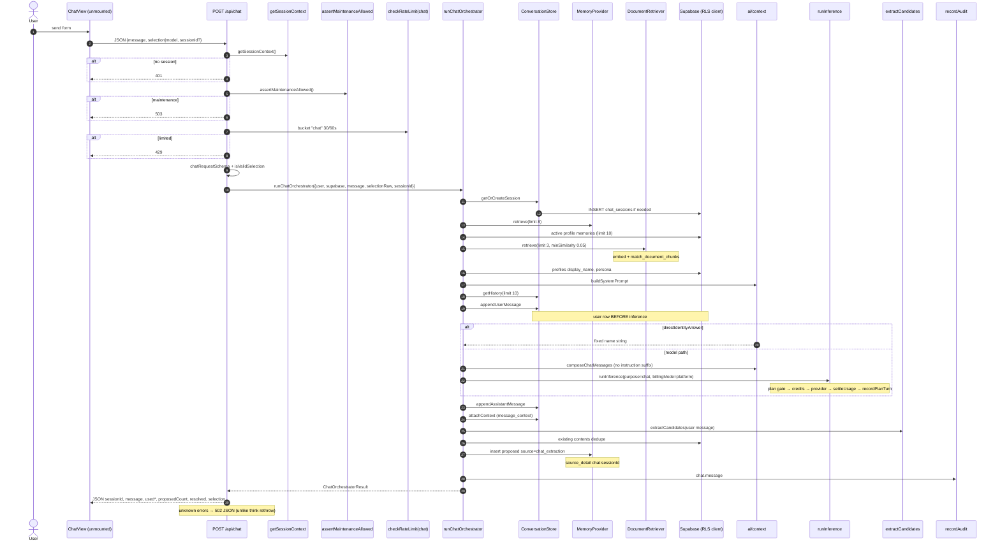

# 02 — Current Chat and Memory Flow Audit

> **Role:** Current Chat and Memory Flow Auditor  
> **Scope:** End-to-end trace and comparison of `ThinkingView` → `POST /api/think` versus `ChatView` → `POST /api/chat` → `runChatOrchestrator`, including shared memory/retrieval/inference/persistence layers.  
> **Constraints:** Documentation only. No production code, migrations, APIs, prompts, tests, dependencies, configuration, or behaviour changes.  
> **Prior docs:** [`00-roadmap.md`](./00-roadmap.md), [`01-repository-map.md`](./01-repository-map.md).

This document traces **what the repository does today**. It does not design a future memory architecture.

---

## Legend (evidence classes)

| Label | Meaning |
| --- | --- |
| **Verified** | Observed directly in repository files (paths, symbols, call order). |
| **Conclusion** | Architectural interpretation grounded in verified facts. |
| **Risk** | Failure mode or drift with concrete code evidence; not a design recommendation. |
| **Assumption** | Reasonable inference not proven by exhaustive runtime execution. |
| **Unknown** | Requires live runtime verification (HTTP against a running stack, or external callers outside this repo). |

Citations use `path` + symbol + approximate line ranges as of this audit.

---

## Executive verdict

| Question | Verdict | Evidence class |
| --- | --- | --- |
| Which path does the authenticated home page use? | **`ThinkingView` → `POST /api/think`** | Verified |
| Does `/api/chat` have a currently reachable UI caller? | **No in-repo page mounts `ChatView`; `/chat` redirects to `/`.** API remains callable by HTTP. | Verified (static) / Unknown (external callers) |
| Is `/api/think` the canonical product path? | **Yes for live UX.** | Conclusion |
| Does README match runtime? | **No** — README says product chat goes through Context Orchestrator; live path does not. | Verified |
| Do both paths share context builders? | **Yes** (`buildSystemPrompt`, `composeChatMessages`, `directIdentityAnswer`). | Verified |
| Are the paths behaviourally identical for questions? | **No** — intent branches, selection defaults, ports vs inline SQL, error handling, audit keys, and instruction prompt suffix differ. | Verified |

---

## 1. Reachability and documentation drift

### 1.1 Authenticated home page (Verified)

| Step | File / symbol |
| --- | --- |
| Authed `/` renders Thinking shell | `src/app/page.tsx` — imports `ThinkingShell` + `ThinkingView` (~L55–67) |
| Composer POSTs to think | `ThinkingView.submit` → `fetch("/api/think", …)` (`src/components/ThinkingView.tsx` ~L297–301) |
| Optional session restore | `ThinkingView` → `GET /api/sessions/[id]` (~L148–178); handler `src/app/api/sessions/[id]/route.ts` |

Anon `/` renders `LandingPage` only (`page.tsx` ~L35–36).

### 1.2 `/api/chat` callers (Verified + Unknown)

| Caller | Status |
| --- | --- |
| `src/components/ChatView.tsx` `send` → `fetch("/api/chat", …)` (~L65–69) | **Only in-repo caller** of `/api/chat` |
| Import sites of `ChatView` under `src/` | **None** (component is defined but never imported by a page) |
| `src/app/(app)/chat/page.tsx` | **Redirects to `/`** with comment “Thinking is the primary surface” |
| Tests hitting `POST /api/chat` or `runChatOrchestrator` | **None** found under `tests/` (only a comment in `tests/memory.test.ts` ~L153 about “same query shape as POST /api/chat”) |
| External/manual HTTP clients, old bookmarks, scripts outside repo | **Unknown** |

**Conclusion:** In this repository’s product UI, `/api/chat` is currently **unreachable**. The route handler and orchestrator remain live code if invoked directly.

### 1.3 Documentation disagreements with runtime (Verified)

| Document | Claim | Runtime evidence |
| --- | --- | --- |
| `README.md` “Chat / inference” (~L89–96) | “Product chat goes through the **Context Orchestrator** (`src/lib/orchestration/`)” | Authed product path is `/api/think`, which **does not** call `runChatOrchestrator` |
| `docs/admin-commercial-architecture.md` (~L33) | `/api/chat · /api/think → orchestration → runInference` | Think calls `runInference` **inline**; only chat uses `orchestration/chat.ts` |
| `README.md` Architecture tree (~L169–170) | Lists `(app)/… chat …` and `api/… chat …` as primary surfaces | `/chat` redirects; Thinking + Vault are live |
| `01-repository-map.md` §2 conceptual loop | Orders provenance → extract → “credits / plan usage settlement” at the end | Settlement runs **inside** `runInference` **before** assistant persistence and extraction |
| `01-repository-map.md` | Describes ChatView as the parallel UI path | Accurate that ChatView *would* call `/api/chat`, but ChatView is **not mounted** by any page (map §12 already flagged this as unclear) |

**Report only — earlier docs were not edited.**

---

## 2. Shared building blocks

Both question-style paths (and chat’s only path) reuse these modules:

| Concern | Module | Key symbols |
| --- | --- | --- |
| Auth | `src/lib/auth.ts` | `getSessionContext` |
| Maintenance gate | `src/lib/admin/system-controls.ts` | `assertMaintenanceAllowed` |
| Rate limit | `src/lib/ratelimit.ts` | `checkRateLimit` (fail-open on RPC errors) |
| Memory port | `src/lib/memory/provider.ts`, `index.ts` | `MemoryProvider`, `getMemoryProvider()` |
| Default memory impl | `src/lib/memory/supabase-provider.ts` | `insert` / `retrieve` (await embeddings) |
| Optional Mem0 | `src/lib/memory/mem0-provider.ts` | Hybrid insert/retrieve when `MEMORY_PROVIDER=mem0` |
| Extraction | `src/lib/memory/extraction/index.ts` | `extractCandidates` (timeout → heuristic fallback) |
| Context / identity | `src/lib/ai/context.ts` | `buildSystemPrompt`, `composeChatMessages`, `directIdentityAnswer`, `toUserIdentity` |
| Inference + billing | `src/lib/inference/complete.ts` | `runInference` (plan gate, credits hold, complete, `settleUsage`, `recordPlanTurn`) |
| Audit | `src/lib/audit.ts` | `recordAudit` (best-effort; errors swallowed) |

**Only `/api/chat` uses:**

| Port | File | Used by |
| --- | --- | --- |
| `ConversationStore` | `src/lib/conversation/store.ts` | `runChatOrchestrator` only |
| `DocumentRetriever` | `src/lib/documents/retrieve.ts` | `runChatOrchestrator` only |

**Only `/api/think` uses:**

| Module | Role |
| --- | --- |
| `src/lib/think/intent.ts` | `classifyIntent`, `stripRememberPrefix` |
| Inline session/history/message SQL in `handleQuestion` | Parallel to `ConversationStore` |
| Inline `match_document_chunks` + embed in `handleQuestion` | Parallel to `DocumentRetriever` |
| `handleStatement` / `handleInstruction` | Active-memory shortcuts; no chat turn |

---

## 3. Mermaid — `/api/think`

Covers the **question / fall-through instruction** path (`handleQuestion`). Statement and remembered-instruction shortcuts are summarized after the diagram.

```mermaid
sequenceDiagram
  autonumber
  actor User
  participant TV as ThinkingView
  participant API as POST /api/think
  participant Auth as getSessionContext
  participant Ops as assertMaintenanceAllowed
  participant RL as checkRateLimit(think)
  participant Intent as classifyIntent
  participant DB as Supabase (RLS client)
  participant Mem as MemoryProvider
  participant Emb as EmbeddingProvider
  participant Ctx as ai/context
  participant Inf as runInference
  participant Ext as extractCandidates
  participant Audit as recordAudit

  User->>TV: submit composer
  TV->>TV: optimistic user bubble
  TV->>API: JSON {message, sessionId?, model}
  API->>Auth: getSessionContext()
  alt no session
    API-->>TV: 401 Unauthorized
  end
  API->>Ops: assertMaintenanceAllowed()
  alt maintenance
    API-->>TV: 503
  end
  API->>RL: bucket "think" 40/60s
  alt limited
    API-->>TV: 429
  end
  API->>API: thinkRequestSchema + isValidModel
  API->>DB: profiles.default_model (auto resolution)
  API->>Intent: classifyIntent(message)

  alt intent = statement
    API->>Mem: insert status=active source=manual
    Note over Mem: embed sync then memories INSERT
    API->>Audit: think.remember
    API-->>TV: {intent:statement, memoryRegistered:true}
  else intent = instruction (remember/forget/show handled)
    API->>Mem: insert active OR DB archive OR vault nudge
    API->>Audit: think.remember / think.forget (when applicable)
    API-->>TV: {intent:instruction, confirmation, …}
  else question (or unhandled instruction → handleQuestion)
    API->>DB: chat_sessions insert if no sessionId
    API->>Mem: retrieve(query, limit 8)
    Note over Mem: embed query + match_memories RPC
    API->>DB: active profile memories (limit 10)
    API->>Emb: embed([message])
    API->>DB: match_document_chunks RPC
    API->>DB: profiles display_name, persona
    API->>Ctx: buildSystemPrompt(memories, chunks, identity)
    API->>DB: chat_messages history (limit 10)
    API->>DB: INSERT chat_messages role=user
    Note over API,DB: user row persisted BEFORE inference
    alt directIdentityAnswer (questions only)
      Ctx-->>API: fixed name string (no runInference)
    else model path
      API->>Ctx: composeChatMessages(+ instruction suffix if needed)
      API->>Inf: runInference(purpose=chat, billingMode=platform)
      Note over Inf: plan gate → credits → provider → settleUsage → recordPlanTurn
    end
    API->>DB: INSERT chat_messages role=assistant
    API->>DB: INSERT message_context (memories + chunks)
    API->>Ext: extractCandidates(user message)
    API->>DB: load existing memory contents (dedupe)
    API->>Mem: insert status=proposed source=chat_extraction
    Note over Mem: embed sync; source_detail think:sessionId
    API->>Audit: think.message
    API-->>TV: {intent, sessionId, reply, message, used*, proposedCount, …}
  end
```

### Think statement / handled-instruction shortcuts (Verified)

| Intent branch | Function | Persistence | Inference | Extraction | Session |
| --- | --- | --- | --- | --- | --- |
| `statement` | `handleStatement` (~L171–209) | `MemoryProvider.insert` **active**, `source: manual`, type `episodic` | None | None | None |
| `instruction` + “remember …” | `handleInstruction` (~L221–252) | **active**, `source: manual`, type `semantic` | None | None | None |
| `instruction` + forget/delete… | `handleInstruction` (~L256–297) | `memories.status = archived` (ILIKE match, limit 5) | None | None | None |
| `instruction` + show/list/open | `handleInstruction` (~L301–307) | None | None | None | None |
| Other instructions | falls through to `handleQuestion` with `intent: "instruction"` | Full question path | Yes (unless identity direct skipped — direct only when `intent === "question"`) | Yes | Yes |

---

## 4. Mermaid — `/api/chat`



---

## 5. Stage-by-stage traces

Constants shared by both question paths: `MIN_SIMILARITY = 0.05`, `HISTORY_LIMIT = 10`, memory retrieve limit `8`, document match count `3`, profile memories limit `10`.

### 5.1 `/api/think` — question path (`handleQuestion`)

| Stage | File / function | Input → output | DB R/W | External | Sync? | Failure blocks response? | Errors / observability | Tests |
| --- | --- | --- | --- | --- | --- | --- | --- | --- |
| User submission | `ThinkingView.submit` | Composer text (+ optional file upload to `/api/documents` first) → optimistic UI | None (client) | Browser fetch | Yes | Client shows error; optimistic user bubble kept | Client `error` state | No component tests |
| Client request | `fetch("/api/think")` | `{message, sessionId, model}` | — | HTTP | Yes | — | — | — |
| Validation | `thinkRequestSchema` in `api/think/route.ts`; `isValidModel` | Body → parsed or 400 | — | — | Yes | Yes (400) | — | Schema untested as route |
| Authentication | `getSessionContext` | Cookie session → `{supabase,user}` or 401 | Auth getUser | Supabase Auth | Yes | Yes (401) | — | Indirect via integration auth |
| Ops controls | `assertMaintenanceAllowed` | — / throw | Read `system_operational_controls` (cached) | — | Yes | Yes (503) | — | `tests/system-controls.test.ts` |
| Rate limit | `checkRateLimit(userId,"think",40,60)` | allowed? | RPC `increment_rate_limit` via **service role** | — | Yes | Yes if denied (429); **fail-open** on limiter errors | Swallow → allow | Migration `*_audit_ratelimit.sql`; no dedicated think RL test |
| Entitlement / credits | Deferred to `runInference` | — | Plan snapshot, credits | — | Yes when inferring | Yes (402) if insufficient / plan blocked | Route maps `InsufficientCreditsError`, `PlanUsageBlockedError` | Inference/billing unit suites |
| Intent | `classifyIntent` | string → statement\|question\|instruction | — | — | Sync | N/A | — | `tests/intent.test.ts` |
| Session resolution | Inline insert `chat_sessions` if no `sessionId` | title = message[:60], model = selectionKey | **W** sessions | — | Yes | Yes (500 on insert error) | — | No route test |
| Memory retrieval | `getMemoryProvider().retrieve` | query → `RetrievedMemory[]` filtered ≥ 0.05 | **R** via `match_memories`; embed | Embeddings provider; optional Mem0 | Yes | Throws → uncaught (think rethrows) | — | `tests/memory.test.ts` (provider/RLS) |
| Profile memories | Direct `memories` select type=profile active | rows → merged by id (sim=1) | **R** | — | Yes | Soft (empty on miss) | — | Partial identity RLS in memory test |
| Document retrieval | Inline embed + `match_document_chunks` | chunks ≥ 0.05 | **R** RPC | Embeddings | Yes | Soft if RPC empty; embed throw blocks | — | No dedicated retrieve test |
| Context construction | `buildSystemPrompt` | memories+chunks+identity → systemPrompt | — | — | Sync | N/A | — | `tests/context.test.ts` |
| History | `chat_messages` select | last 10 → reversed ChatMessage[] | **R** | — | Yes | Soft empty | — | — |
| User-message persistence | `chat_messages` insert role=user | message text | **W** | — | Yes | **Error ignored** (no check) | Silent failure risk | — |
| Direct-answer shortcut | `directIdentityAnswer` only if `intent==="question"` | name Q → string or null | — | — | Sync | N/A | Skips credits/inference | `tests/context.test.ts` |
| Model selection | `resolveThinkSelection` + later `runInference` router | model / auto / profile.default_model | **R** profiles.default_model earlier | — | Yes | Invalid model → 400 earlier | — | `tests/models.test.ts`, `inference.test.ts` |
| Inference | `runInference` | composed messages → content + resolved | usage/credits/plan writes | LLM providers | Yes | Yes (402/503/throw) | Provider ops events | Inference tests |
| Usage settlement | Inside `runInference` via `settleUsage` + `recordPlanTurn` | usage draft → ledger | **W** usage_events, credit_*, plan_usage | — | Yes | Settlement errors would throw before assistant persist | — | Meter/billing units |
| Assistant persistence | `chat_messages` insert assistant | content, displayModel | **W** | — | Yes | Yes (500 on `amErr`) | — | — |
| Provenance | `message_context` insert | memory_id / document_chunk_id + relevance | **W** | — | Yes | **Error ignored** | — | Schema in `*_chat.sql` |
| Memory extraction | `extractCandidates(message)` | candidates[] | — | OpenRouter via ChatProvider or heuristic | Yes | LLM fail → heuristic; still awaited | Timeout env | `tests/extraction.test.ts` |
| Memory insertion | `provider.insert` proposed | fresh vs existing contents | **W** memories (+ embed) | Embed / Mem0 | Yes | **Yes** — throw after assistant saved | source_detail `think:{sessionId}` | Provider tests |
| Audit | `recordAudit` action `think.message` | metadata | **W** audit_log (admin) | — | Yes | No (swallowed) | console.error | — |
| HTTP response | `NextResponse.json` | intent, sessionId, reply, message, used*, proposedCount, meta | — | — | Yes | — | — | — |

### 5.2 `/api/chat` — `runChatOrchestrator`

| Stage | File / function | Input → output | DB R/W | External | Sync? | Failure blocks? | Errors / observability | Tests |
| --- | --- | --- | --- | --- | --- | --- | --- | --- |
| User submission | `ChatView.send` | form → optimistic messages | — | fetch | Yes | Client error | — | **No UI mount** |
| Validation | `chatRequestSchema` (`validation.ts`); `isValidSelection` | requires `selection` or `model` | — | — | Yes | 400 | — | Schema exists; no route test |
| Auth / ops / RL | Same helpers; bucket **`"chat"` 30/60** | — | Same as think | — | Yes | 401/503/429 | — | — |
| Entitlement | Via `runInference` | — | Same | — | Yes | 402 mapped in route | — | — |
| Intent | **None** | Always full chat turn | — | — | — | — | — | — |
| Session | `ConversationStore.getOrCreateSession` | sessionId | **W** if new | — | Yes | Throw → route 502 | — | Port untested |
| Memory / profile merge | Same pattern as think | usedMemories | Same | Same | Yes | Throw → 502 | profileError `console.error` | — |
| Documents | `DocumentRetriever.retrieve` | usedChunks | RPC + embed | Embeddings | Yes | Throw → 502 | — | — |
| Context | `buildSystemPrompt` + `composeChatMessages` | Same builders; **no** instruction suffix | — | — | Sync | — | — | `context.test.ts` |
| History | `getHistory` | ChatMessage[] | **R** | — | Yes | Soft | — | — |
| User message | `appendUserMessage` | — | **W**; **throws on error** | — | Yes | Yes | — | — |
| Direct answer | `directIdentityAnswer` always attempted | — | — | — | Sync | — | — | `context.test.ts` |
| Inference / settle | `runInference` | Same purpose/billingMode | Same | Same | Yes | Yes → 502 (or 402 mapped) | — | — |
| Assistant | `appendAssistantMessage` | ConversationMessage | **W**; throws | — | Yes | Yes | — | — |
| Provenance | `attachContext` | links → `message_context`; throws on error | **W** | — | Yes | Yes | — | — |
| Extraction / insert | Same as think | proposed; `source_detail: chat:{sessionId}` | Same | Same | Yes | Yes if insert throws | — | extraction unit |
| Audit | `chat.message` | metadata includes selection | **W** best-effort | — | Yes | No | — | — |
| HTTP response | route JSON | includes `resolved`, `selection` (think uses responseMeta fields instead) | — | — | Yes | Unknown → **502** (think rethrows) | — | — |

---

## 6. Side-by-side comparison

| Dimension | `/api/think` | `/api/chat` |
| --- | --- | --- |
| Product UI entry | `ThinkingView` on authed `/` | `ChatView` **unmounted**; `/chat` → `/` |
| Rate-limit bucket | `"think"`, **40**/60s | `"chat"`, **30**/60s |
| Request schema | Inline Zod; `model` optional (default auto) | `chatRequestSchema`; **selection or model required** |
| Auto model default | Request auto → else `profiles.default_model` → else `{type:"auto"}` | Whatever client sends; **no profile default_model read** |
| Intent classification | Yes (`classifyIntent`) | No |
| Active-memory shortcuts | Statement + remember instruction → **active** insert | None |
| Forget / vault nudge | Instruction heuristics | None |
| Conversation persistence | Inline Supabase in route | `ConversationStore` port |
| Document retrieval | Inline embed + RPC | `DocumentRetriever` port |
| User message error handling | Insert **not checked** | Throws → 502 |
| `message_context` errors | Insert **not checked** | Throws → 502 |
| Instruction system prompt | Extra “brief confirmation…” suffix when `intent==="instruction"` | N/A |
| Identity direct answers | Only for `intent==="question"` | Always attempted |
| Extraction `source_detail` | `think:{sessionId}` | `chat:{sessionId}` |
| Audit action | `think.message` / `think.remember` / `think.forget` | `chat.message` |
| Response shape | Intent + `reply` + `responseMeta` (modelLabel, memoryRegistered, …) | Orchestrator fields + `resolved` / `selection` |
| Unknown error mapping | Operational/credits mapped; else **rethrow** | Mapped + catch-all **502** |
| Orchestrator module | Not used | `runChatOrchestrator` |
| Shared context builders | Yes | Yes |
| Shared `runInference` | Yes (question path) | Yes (non-direct) |
| Shared `extractCandidates` | Yes (question path) | Yes |

---

## 7. Persistence-ordering analysis

### 7.1 Ordering answers (both question paths unless noted)

| # | Question | Think (question) | Chat | Statement / remember (think only) |
| --- | --- | --- | --- | --- |
| 1 | Stores user message before inference? | **Yes** (`insert` then `runInference`) | **Yes** (`appendUserMessage` then `runInference`) | **N/A** — no chat message |
| 2 | Can store user message when inference fails? | **Yes** | **Yes** | N/A |
| 3 | Can generate a response that is never persisted? | **Yes** — inference/direct succeeds, assistant insert fails (`amErr` → 500) | **Yes** — `appendAssistantMessage` throws after inference | N/A (confirmation not stored as chat) |
| 4 | Extraction before HTTP response? | **Yes** (awaited) | **Yes** | **No** extraction |
| 5 | Waits for embedding generation? | **Yes** for retrieve + proposed/active insert (Supabase provider); document embed awaited | Same via ports | **Yes** on active insert |
| 6 | Active or proposed memories? | Question path → **proposed**; statement/remember → **active** | **proposed** only (from extraction) | **active** |
| 7 | Complete `message_context`? | Written for assistant when memories/chunks used; **errors ignored**; none on shortcuts | Written via `attachContext`; **errors throw**; always attempted after assistant | **None** |
| 8 | Repeat extraction on client retry? | **Yes** — new POST, new user row, extract again; content dedupe only (case-insensitive exact content) | Same | Re-insert active on resubmit (no chat dedupe) |
| 9 | Credits settle before or after persistence? | **After user message, before assistant message** (inside `runInference`) | Same | **No** credits (no inference) |
| 10 | Same context-building rules as other path? | **Mostly** — shared builders; think adds instruction suffix; think gates identity-direct by intent; think reads profile default model | Shared builders without instruction suffix | N/A |

### 7.2 Ordered timeline (question / chat turn)

```text
1. session ensure
2. memory retrieve (+ embed)
3. profile memories merge
4. document retrieve (+ embed)
5. identity load + buildSystemPrompt
6. history load
7. USER MESSAGE WRITE
8. direct identity OR runInference
      8a. plan entitlement assert
      8b. credits assert
      8c. provider complete
      8d. settleUsage (+ recordPlanTurn if platform non-mock)
9. ASSISTANT MESSAGE WRITE
10. message_context WRITE
11. extractCandidates (+ embed on insert)
12. proposed memories WRITE
13. audit WRITE (best-effort)
14. HTTP 200 JSON
```

**Verified:** Steps 8d → 9 means a charged turn can exist without an assistant row if step 9 fails.  
**Verified:** Step 7 before 8 means a user row can exist without an assistant reply if step 8 fails.  
**Verified:** Steps 11–12 run before the client receives success, so extraction latency is on the critical path.

---

## 8. Failure-scenario analysis

| Scenario | Think behaviour | Chat behaviour | Risk class |
| --- | --- | --- | --- |
| Unauthenticated | 401 | 401 | Shared |
| Maintenance mode | 503 at route (and again inside `runInference`) | Same | Shared |
| Rate limited | 429 (`think` 40) | 429 (`chat` 30) | Intentional difference |
| Limiter RPC down | Fail-open allow | Fail-open allow | Shared |
| Invalid body / model | 400 | 400 | Shared |
| Plan / credits blocked | 402 after user message already written (question path) | Same | Shared **Risk** |
| Provider failure after user write | Think: error may **rethrow** (500); user row remains; no assistant; no extraction | Chat: **502**; same orphan user row | Shared **Risk** |
| Assistant insert fails after successful inference | 500; credits already settled; user row present; no provenance/extract | 502; same | Shared **dangerous** |
| `message_context` insert fails | **Swallowed**; client still gets 200 with usedMemories in JSON | **Throws** → 502 after assistant exists | Divergent **Risk** |
| Extraction LLM timeout | Heuristic fallback inside `extractCandidates` | Same | Shared (mitigated) |
| Proposed `insert` throws (embed/DB) | Blocks response after assistant (+ credits) committed | Same | Shared **dangerous** |
| Client retries after timeout | Duplicate user messages; possible duplicate proposed if content differs slightly; exact content deduped | Same | Shared **Risk** |
| Statement path embed/DB fail | Blocks; no chat residue | N/A | Think-only |
| Forget ILIKE topic | Archives up to 5 active matches; no semantic search | N/A | Think-only (heuristic) |
| Optimistic UI vs server | Think keeps user bubble on error even if server never stored / or stored without reply | Chat keeps optimistic user message similarly | UX drift |

---

## 9. Test-coverage analysis

### 9.1 What is covered (Verified)

| Area | Tests | Covers path? |
| --- | --- | --- |
| Intent heuristics | `tests/intent.test.ts` | Think-only classifier |
| Context / identity / direct answers | `tests/context.test.ts` | Shared builders |
| Extraction pipeline / skip / timeout fallback | `tests/extraction.test.ts` | Shared `extractCandidates` |
| Redaction / secrets | `tests/redaction.test.ts` | Shared gates used by extraction + think insert |
| Memory provider + RLS (incl. profile identity query shape comment) | `tests/memory.test.ts` (integration) | Shared provider; **not** HTTP routes |
| ChatProvider factory / mock | `tests/chat-provider.test.ts` | Extraction’s ChatProvider; not product `runInference` path |
| Inference router / models | `tests/inference.test.ts`, `models.test.ts` | Shared when inferring |
| System controls | `tests/system-controls.test.ts` | Shared maintenance gate |
| Mem0 helpers | `tests/mem0-*.test.ts` | Optional provider |

### 9.2 What is not covered (Verified absence)

| Gap | Notes |
| --- | --- |
| HTTP `POST /api/think` | No route/integration test of full turn ordering |
| HTTP `POST /api/chat` | No route test; no orchestrator unit test file |
| `runChatOrchestrator` | No dedicated test |
| `ConversationStore` / `DocumentRetriever` | No dedicated tests |
| Persistence ordering (user before infer; settle before assistant) | Untested as a contract |
| Think statement/instruction branches | Untested beyond `classifyIntent` unit cases |
| Provenance write success/failure | Untested |
| Deduped extraction insert + `source_detail` prefixes | Untested at orchestration layer |
| Reachability of ChatView | Static evidence only |

### 9.3 External contracts (Verified)

- No OpenAPI/spec file in-repo binding `/api/chat`.
- Demo matrix / private-beta docs exercise **Thinking**, not ChatView (`docs/demo-mode-test-matrix.md` step 4).
- Comment in `tests/memory.test.ts` references `/api/chat` query shape for **profiles** only — not an HTTP contract.

---

## 10. Shared vs duplicated vs path-only

### Shared (Verified)

- Auth, maintenance, rate-limit helper, audit helper
- `getMemoryProvider` / insert / retrieve
- Profile-memory merge algorithm (duplicate code, same logic)
- `buildSystemPrompt` / `composeChatMessages` / `directIdentityAnswer` / `toUserIdentity`
- `runInference` + platform billing mode for model answers
- `extractCandidates` → proposed insert with content dedupe against non-deleted memories
- Tables: `chat_sessions`, `chat_messages`, `message_context`, `memories`, embeddings RPCs

### Duplicated (parallel implementations)

| Logic | Think | Chat |
| --- | --- | --- |
| Session create / history / append messages / context | Inline SQL in `handleQuestion` | `conversation/store.ts` |
| Document chunk retrieve | Inline in `handleQuestion` | `documents/retrieve.ts` |
| Profile+semantic memory merge loop | Copied in both files | Copied in both files |
| Extraction → dedupe → insert block | Nearly identical | Nearly identical |

### Think-only behaviour

- Intent classification and statement/instruction UX
- **Active** memory writes from composer (bypass review queue)
- Forget-by-ILIKE archive
- Profile `default_model` for Auto
- Instruction confirmation system-prompt suffix
- Identity-direct gated off for instructions
- Softer DB error handling on user message + provenance
- Response metadata for ResponseInfoButton (`memoryRegistered`, `modelLabel`, …)
- Rate bucket `think` @ 40/min

### Chat-only behaviour

- `ConversationStore` / `DocumentRetriever` ports (injectable)
- Stricter persistence error propagation
- Response includes `resolved` + `selection` policy
- Catch-all 502 for unexpected errors
- Rate bucket `chat` @ 30/min
- Selection required in schema

### Differences that appear intentional (Conclusion)

- Thinking as capture+ask UX with quiet statement saves and instruction shortcuts
- Chat as continuous conversational UI with inline “why does the AI know this?” context (legacy)
- Separate rate-limit buckets
- Distinct audit action names and `source_detail` prefixes
- Think UI response meta vs chat’s richer resolved routing payload

### Differences that appear dangerous (Risk)

1. **Credits settled before assistant persistence** on both paths — charge without durable reply.
2. **User message persisted before entitlement/inference** — orphans on 402/provider failure.
3. **Extraction awaited on critical path** — latency and insert failures after a successful (and possibly billed) reply.
4. **Think ignores user-message and `message_context` insert errors**; chat fails closed — provenance and history diverge by path.
5. **Statement/remember writes `active` memories** while extraction writes `proposed` — same composer can bypass review.
6. **No idempotency** — retries re-extract / re-insert.
7. **Dead ChatView + live `/api/chat`** — external callers can exercise a second behavioural surface while docs claim one orchestrator.
8. **README / admin architecture claim orchestrator is the product path** — operators may debug the wrong code.

---

## 11. Established answers (checklist)

| # | Question | Answer | Class |
| --- | --- | --- | --- |
| 1 | Authenticated home path | `page.tsx` → `ThinkingView` → `/api/think` | Verified |
| 2 | Reachable `/api/chat` caller | No mounted UI; only unmounted `ChatView`; HTTP still open | Verified / Unknown external |
| 3 | Test or external contract on `/api/chat` | No HTTP tests; comment-only reference; demo matrix uses Thinking | Verified |
| 4 | Canonical product path | `/api/think` | Conclusion |
| 5 | Docs disagree with runtime? | Yes — README + admin map vs think inline path; map’s settlement order sketch vs `runInference` | Verified |
| 6 | Shared logic | Context builders, memory provider, extraction, inference/billing, auth/ops/RL helpers | Verified |
| 7 | Duplicated logic | Session/messages/context SQL vs ConversationStore; document retrieve; merge + extract blocks | Verified |
| 8 | One-path-only behaviour | Think intents/active shortcuts/forget; chat ports/stricter errors/response shape | Verified |
| 9 | Intentional differences | Capture vs chat UX; audit/source_detail; RL buckets | Conclusion |
| 10 | Dangerous differences | Settlement vs persist order; active bypass; soft vs hard provenance errors; dual live APIs | Risk |

---

## 12. Verified facts / conclusions / risks / assumptions / unknowns

### Verified facts

1. Authed home uses Thinking → `/api/think` (`src/app/page.tsx`, `ThinkingView.tsx`).
2. `/chat` redirects to `/`; `ChatView` has **zero** import sites under `src/`.
3. `/api/think` implements orchestration **inline** (~548 lines); `/api/chat` delegates to `runChatOrchestrator` (~277 lines).
4. Both question paths persist the user message **before** `runInference`, and settle usage **inside** `runInference` **before** assistant persistence.
5. Both await `extractCandidates` and proposed `insert` **before** returning HTTP success.
6. Think statement/remember paths insert **active** memories with embeddings and **do not** create chat sessions/messages or run extraction.
7. Shared prompt assembly lives in `src/lib/ai/context.ts`.
8. Default memory insert/retrieve await embeddings (`SupabaseMemoryProvider`).
9. `ConversationStore` and `DocumentRetriever` are only referenced from `orchestration/chat.ts`.
10. Migrations defining chat/memory/RPC surfaces include at least `20260720000002_memories.sql`, `000003_documents.sql`, `000004_chat.sql`, `000006_rls.sql`, `000007_functions.sql`, `000009_grants.sql`, plus metering/ops migrations used by `runInference`.

### Behavioural conclusions

1. `/api/think` is the **canonical product conversation/memory loop** today.
2. `/api/chat` is a **parallel, still-functional API** whose first-party UI is orphaned.
3. Memory “write modes” in Thinking are dual: **trusted active capture** vs **proposed extraction** on Q&A turns.
4. Context construction for model turns is intentionally shared; product branching (intent) is think-specific.

### Risks

1. Billed turns without assistant rows; user rows without replies.
2. Proposed-memory insert failure after a successful assistant reply (client may retry → duplicate work).
3. Active memories from statements skip the review queue that README describes for extraction.
4. Documentation points maintainers at `orchestration/` while production traffic hits `api/think/route.ts`.
5. Soft provenance failures on think hide “why this answer” integrity issues.

### Assumptions

1. No out-of-repo production client currently depends on `/api/chat` (not proven).
2. Mem0 is off in default local/demo matrices (aligned with map + AGENTS.md).
3. Fail-open rate limiting is acceptable ops policy (coded intentionally).

### Unknowns requiring runtime verification

1. Whether any deployed environment, bookmark, or mobile client still POSTs `/api/chat`.
2. Observed frequency of orphan user messages / charged-without-assistant under real provider failures.
3. Whether `message_context` silent failures occur in practice on think (needs DB assertion after forced RPC failure).
4. End-to-end latency contribution of inline extraction under LLM vs heuristic modes.
5. Exact Mem0 add/wait behaviour under think statement vs proposed insert in a live Mem0-configured environment.

---

## 13. Factual notes on earlier planning docs (not edited)

| Prior doc | Issue found in this audit |
| --- | --- |
| `01-repository-map.md` | Conceptual credit settlement placed after extraction; runtime settles inside `runInference` before assistant persistence. |
| `01-repository-map.md` | Treats ChatView as the parallel UI; correct as code existence, but reachability is **unmounted** (map §12 already asked to confirm). |
| `README.md` | States product chat goes through Context Orchestrator — **false for the live Thinking path**. |
| `docs/admin-commercial-architecture.md` | Implies both `/api/chat` and `/api/think` go through orchestration — **only chat does**. |

---

## 14. Out of scope (explicit)

- Target memory architecture
- Consolidation recommendations as a mandate (duplication noted; not prescribed)
- Code, migration, API, prompt, test, or config changes

---

*End of Stage 2 flow audit. Next roadmap stage: `03-database-rls-audit.md`.*
