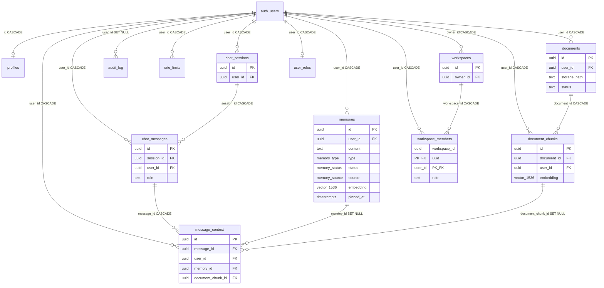

# 03 — Database, Migration, Index, Grant, and RLS Audit

> **Role:** Current Database, Migration, Index, Grant, and RLS Auditor  
> **Scope:** Exact current-state documentation of how Supabase / PostgreSQL protects, stores, retrieves, updates, and deletes user memory data.  
> **Constraints:** Investigation and documentation only. No production code, migrations, SQL application, API, prompt, test, dependency, configuration, or behaviour changes. No target schema design.  
> **Prior docs:** [`00-roadmap.md`](./00-roadmap.md), [`01-repository-map.md`](./01-repository-map.md), [`02-current-memory-flow.md`](./02-current-memory-flow.md).

This document audits **what the database and access paths do today**. It does not design a replacement schema.

---

## Legend (evidence classes)

| Label | Meaning |
| --- | --- |
| **Verified** | Observed directly in migration SQL or application source. |
| **Conclusion** | Interpretation grounded in verified facts. |
| **Security risk** | Isolation / privilege / leakage concern with code evidence. |
| **Integrity risk** | Consistency / orphan / duplicate / constraint gap with evidence. |
| **Performance risk** | Index, scan, or retrieval concern with evidence. |
| **Assumption** | Reasonable inference not proven by live DB execution in this stage. |
| **Unknown** | Requires live Supabase / runtime verification. |

Citations use migration filenames or `path` + symbol. Stage 2 status text in `00-roadmap.md` still says Stage 2 is **next**; this audit treats Stage 2 as complete per task instructions and does **not** edit prior docs.

---

## 1. Executive summary

### Verdict (Conclusion)

The core memory, document, and chat tables are **user-scoped via `user_id` / `auth.uid()` RLS**, with semantic RPCs that hard-filter `auth.uid()`. Multi-user **content isolation for normal authenticated clients is substantially enforced** for direct table access and `match_memories` / `match_document_chunks`. Workspaces exist but **do not scope memories**. Deduplication, parent/child ownership consistency, provenance completeness, and idempotent inserts are **mostly application assumptions**, not database guarantees.

### What the database currently guarantees (Verified + Conclusion)

| Guarantee | Status |
| --- | --- |
| Multi-user isolation (authenticated SELECT/UPDATE/DELETE on own rows) | **Mostly yes** for core tables via RLS `auth.uid() = user_id` / `id` |
| Ownership consistency between parent and child rows | **Partial** — FKs exist; **no** DB check that `chat_messages.user_id` matches `chat_sessions.user_id`, or that `message_context` targets belong to the same user |
| Exactly one user per session and message chain | **Not guaranteed** — `session_id` FK does not constrain message `user_id` to session owner |
| Valid provenance links | **Partial** — FKs to message / memory / chunk; both targets nullable |
| At least one provenance target per `message_context` row | **No** — no CHECK requiring `memory_id OR document_chunk_id` |
| No cross-user provenance links | **No DB guarantee** — RLS only checks `message_context.user_id`, not target ownership |
| Valid memory statuses and types | **Yes** — Postgres enums |
| Valid source values | **Yes** — enum; some values appear unused by writers |
| Embedding dimensional consistency | **Yes at column type** — `vector(1536)`; wrong dim rejected by Postgres |
| Cascading deletion without orphan rows | **Mostly yes** for auth-user cascade; **SET NULL** leaves provenance / audit stubs |
| Idempotent memory insertion | **No** — no unique on `(user_id, content)` |
| Safe account deletion | **Partial** — `auth.users` delete cascades most FKs; storage cleanup is application + admin; audit rows SET NULL |
| Safe document deletion | **Yes for chunks** — `ON DELETE CASCADE`; storage object removal is application |
| Safe conversation deletion | **Cascade exists** if session deleted; **no product API** deletes sessions today |
| Safe RPC execution (`match_*`) | **Yes for identity** — filter `auth.uid()`; invoker mode |
| Safe service-role usage | **Depends on callers** — service role bypasses RLS; safety is application discipline |

### Highest-severity findings (ranked preview)

1. **Service-role bypass** — any omitted/wrong `user_id` filter on admin client can read/write any user’s memory data (**Security**).
2. **Parent/child ownership not enforced** — messages / chunks / provenance can reference another user’s parent or target while inserting under the caller’s `user_id` (**Integrity**, limited **Security** for pollution).
3. **No memory content uniqueness** — exact duplicate rows allowed; app-only dedupe (**Integrity**).
4. **`increment_rate_limit` takes caller-supplied `p_user_id`** under `SECURITY DEFINER` (mitigated: execute granted to `service_role` only) (**Security** if grants widen).
5. **Application soft-fail paths** (Stage 2) leave DB state that RLS cannot “fix” (orphans, missing provenance) (**Integrity**).

---

## 2. Migration timeline

Ordered by filename timestamp. Memory-core migrations called out.

| # | Migration | Memory relevance | Creates / changes |
| --- | --- | --- | --- |
| 1 | `20260720000001_init.sql` | **Core** | Extensions `pgcrypto`, `vector`; enums `memory_type`, `memory_status`, `memory_source`; `profiles`; `handle_new_user` (SECURITY DEFINER); `set_updated_at`; auth trigger |
| 2 | `20260720000002_memories.sql` | **Core** | `memories` + btree + ivfflat indexes; updated_at trigger |
| 3 | `20260720000003_documents.sql` | **Core** | `documents`, `document_chunks` + indexes |
| 4 | `20260720000004_chat.sql` | **Core** | `chat_sessions`, `chat_messages`, `message_context` |
| 5 | `20260720000005_audit_ratelimit.sql` | Adjacent | `audit_log`, `rate_limits`, `increment_rate_limit` |
| 6 | `20260720000006_rls.sql` | **Core** | Enable RLS + policies for core tables |
| 7 | `20260720000007_functions.sql` | **Core** | `match_memories`, `match_document_chunks` + execute grants |
| 8 | `20260720000008_storage.sql` | **Core** | Private `documents` bucket + storage.objects policies |
| 9 | `20260720000009_grants.sql` | **Core** | PostgREST table/function grants |
| 10 | `20260720180000_ensure_profile_bootstrap.sql` | **Core** | Hardened `handle_new_user` + backfill |
| 11 | `20260721140000_inference_metering.sql` | Adjacent | Metering tables; alters `profiles.default_model` / `chat_sessions.model` defaults |
| 12 | `20260721140001_inference_grants.sql` | Adjacent | Metering grants |
| 13 | `20260721180000_billing_byok_workspaces.sql` | **Workspaces** | `workspaces`, `workspace_members` (+ billing/BYOK); **no FK to memories** |
| 14 | `20260721190000_memory_pinned_at.sql` | **Core** | `memories.pinned_at` + index |
| 15 | `20260721200000_stripe_webhook_events.sql` | Adjacent | Webhook idempotency |
| 16 | `20260721210000_commercial_plan_usage.sql` | Adjacent | Plan usage + `record_plan_usage_turn` |
| 17 | `20260721220000_founding_offer_dismissed.sql` | Adjacent | `billing_settings` column only |
| 18 | `20260722000000_admin_roles.sql` | Ownership/roles | `user_roles`, `admin_audit_log`, `handle_new_user_role` |
| 19–28 | Plan editor, provider ops, promotions, system controls (+ grants) | Adjacent | Commercial/admin; do not alter memory RLS |

**Verified:** 28 SQL migrations under `supabase/migrations/`. No later migration adds `workspace_id` to `memories`, `documents`, or chat tables.

---

## 3. Current entity relationship diagram



**Verified gap:** No edge from `workspaces` / `workspace_members` to `memories`, documents, or chat.

---

## 4. Table-by-table schema inventory

### 4.1 Enums (from `20260720000001_init.sql`)

| Enum | Values |
| --- | --- |
| `memory_type` | `profile`, `preference`, `semantic`, `episodic`, `project`, `temporary` |
| `memory_status` | `active`, `proposed`, `rejected`, `superseded`, `archived`, `deleted` |
| `memory_source` | `manual`, `chat_extraction`, `document`, `onboarding`, `import` |

**Unused-by-writers (Verified search under `src/`):** enum sources `document`, `onboarding`, `import` appear in types but product writers use `manual` or `chat_extraction` (onboarding UI posts to `/api/memories`, which hardcodes `source: "manual"`).

---

### 4.2 `profiles`

| Aspect | Detail |
| --- | --- |
| Purpose | 1:1 profile / onboarding / default model for `auth.users` |
| Columns | `id uuid PK`; `display_name text` nullable; `persona text` nullable; `default_model text NOT NULL DEFAULT 'openai/gpt-4o-mini'` then later default `'openai.gpt-4o-mini'` (`*_inference_metering.sql`); `onboarding_completed boolean NOT NULL DEFAULT false`; `created_at` / `updated_at timestamptz NOT NULL DEFAULT now()` |
| PK | `id` |
| FK | `id → auth.users(id) ON DELETE CASCADE` |
| Unique / checks | PK only |
| Triggers | `profiles_set_updated_at`; signup `on_auth_user_created` → `handle_new_user` |
| Indexes | PK only |
| RLS | Enabled |
| Policies | `profiles_select_own`, `profiles_insert_own`, `profiles_update_own` — **no DELETE policy** |
| Tenant rule | Row identity = `auth.uid()` |
| App R/W | `lib/auth`, `lib/profile`, `/api/profile`, think/chat identity reads, export, admin console (service role), onboarding via profile PATCH |

---

### 4.3 `memories`

| Aspect | Detail |
| --- | --- |
| Purpose | Canonical user memory store (proposed + active + lifecycle statuses) |
| Columns | `id uuid PK DEFAULT gen_random_uuid()`; `user_id uuid NOT NULL`; `content text NOT NULL` CHECK length 1–8000; `category text` nullable; `type memory_type NOT NULL DEFAULT 'semantic'`; `source memory_source NOT NULL DEFAULT 'manual'`; `source_detail text` nullable; `confidence real NOT NULL DEFAULT 1.0` CHECK 0–1; `status memory_status NOT NULL DEFAULT 'active'`; `is_sensitive boolean NOT NULL DEFAULT false`; `embedding vector(1536)` nullable; `expires_at timestamptz` nullable; `created_at` / `updated_at`; **`pinned_at timestamptz` nullable** (`*_memory_pinned_at.sql`) |
| PK | `id` |
| FK | `user_id → auth.users ON DELETE CASCADE` |
| Unique | **None** on content |
| Triggers | `memories_set_updated_at` |
| Indexes | See §5 |
| RLS | Enabled — full CRUD own-row policies |
| Tenant rule | `user_id = auth.uid()`; **not workspace-scoped** |
| App R/W | `SupabaseMemoryProvider`, `Mem0MemoryProvider`, `/api/memories*`, `/api/think`, orchestration, `/api/account`, `/api/export`, `/api/search`, Vault pages, admin usage aggregates |

---

### 4.4 `documents`

| Aspect | Detail |
| --- | --- |
| Purpose | Uploaded file metadata |
| Columns | `id uuid PK`; `user_id uuid NOT NULL`; `filename text NOT NULL`; `storage_path text NOT NULL`; `mime_type text NOT NULL`; `size_bytes bigint NOT NULL`; `page_count int` nullable; `status text NOT NULL DEFAULT 'processing'` CHECK (`processing`,`ready`,`failed`); `error text` nullable; `created_at timestamptz NOT NULL DEFAULT now()` — **no `updated_at`** |
| FK | `user_id → auth.users ON DELETE CASCADE` |
| RLS | Full CRUD own-row |
| App R/W | `/api/documents*`, think/chat retrieval (indirect), export, account delete, billing storage usage, admin |

---

### 4.5 `document_chunks`

| Aspect | Detail |
| --- | --- |
| Purpose | Embedded searchable slices of documents |
| Columns | `id uuid PK`; `document_id uuid NOT NULL`; `user_id uuid NOT NULL`; `content text NOT NULL`; `page_number int` nullable; `chunk_index int NOT NULL`; `embedding vector(1536)` nullable; `created_at` |
| FKs | `document_id → documents ON DELETE CASCADE`; `user_id → auth.users ON DELETE CASCADE` |
| RLS | SELECT / INSERT / DELETE own — **no UPDATE policy** |
| Ownership note | Insert policy only checks `user_id`; **does not** require `documents.user_id = auth.uid()` |
| App R/W | Insert in `POST /api/documents`; retrieve via `match_document_chunks`; delete via document cascade |

---

### 4.6 `chat_sessions`

| Aspect | Detail |
| --- | --- |
| Purpose | Conversation containers |
| Columns | `id uuid PK`; `user_id uuid NOT NULL`; `title text NOT NULL DEFAULT 'New chat'`; `model text NOT NULL` (default updated in metering migration); `created_at` / `updated_at` |
| FK | `user_id → auth.users ON DELETE CASCADE` |
| Triggers | `chat_sessions_set_updated_at` |
| RLS | Full CRUD own-row |
| App R/W | `/api/think`, `ConversationStore`, `/api/sessions/[id]`, `/api/search` — **no dedicated session DELETE API found** |

---

### 4.7 `chat_messages`

| Aspect | Detail |
| --- | --- |
| Purpose | User / assistant / system messages |
| Columns | `id uuid PK`; `session_id uuid NOT NULL`; `user_id uuid NOT NULL`; `role text NOT NULL` CHECK (`user`,`assistant`,`system`); `content text NOT NULL`; `model text` nullable; `created_at` |
| FKs | `session_id → chat_sessions ON DELETE CASCADE`; `user_id → auth.users ON DELETE CASCADE` |
| RLS | SELECT / INSERT / DELETE — **no UPDATE policy** |
| Ownership note | Insert only checks `user_id = auth.uid()`; **no** check that session owner matches |
| App R/W | Think inline SQL; `ConversationStore`; session restore; search |

---

### 4.8 `message_context`

| Aspect | Detail |
| --- | --- |
| Purpose | Provenance: memories/chunks used for an assistant message |
| Columns | `id uuid PK`; `message_id uuid NOT NULL`; `user_id uuid NOT NULL`; `memory_id uuid` nullable; `document_chunk_id uuid` nullable; `relevance real` nullable; `created_at` |
| FKs | `message_id → chat_messages ON DELETE CASCADE`; `user_id → auth.users ON DELETE CASCADE`; `memory_id → memories ON DELETE SET NULL`; `document_chunk_id → document_chunks ON DELETE SET NULL` |
| Checks | **None** requiring a non-null target or same-user targets |
| RLS | SELECT / INSERT only — **no UPDATE / DELETE policies** (row removal via cascades) |
| App R/W | Think (errors ignored); `ConversationStore.attachContext` (throws) |

---

### 4.9 `audit_log`

| Aspect | Detail |
| --- | --- |
| Purpose | User-facing action audit (service-role writes) |
| Columns | `id`; `user_id` nullable FK **ON DELETE SET NULL**; `action text NOT NULL`; `entity_type`; `entity_id`; `metadata jsonb NOT NULL DEFAULT '{}'` ; `created_at` |
| RLS | SELECT own only; **no insert policy for authenticated** |
| App W | `lib/audit.recordAudit` via admin client |

---

### 4.10 `rate_limits`

| Aspect | Detail |
| --- | --- |
| Purpose | Fixed-window counters |
| PK | `(user_id, bucket, window_start)` |
| RLS | Enabled **with zero policies** — only service role + SECURITY DEFINER function |
| App | `checkRateLimit` → admin RPC `increment_rate_limit` |

---

### 4.11 `workspaces` / `workspace_members`

| Aspect | Detail |
| --- | --- |
| Purpose | “Personal workspaces (Phase 5 minimal tenancy)” — billing/BYOK migration |
| `workspaces` | `id`; `owner_id → auth.users CASCADE`; `name`; `default_model`; `monthly_credit_budget`; timestamps |
| `workspace_members` | PK `(workspace_id, user_id)`; `role` CHECK (`owner`,`admin`,`member`) |
| RLS | Member/owner policies as in migration |
| Memory link | **None** |
| App | `/api/workspaces` (owner-centric); settings page lists workspaces |

---

### 4.12 Other ownership / processing tables (adjacent)

Relevant to “memory processing, inference usage, roles, or user ownership” but not memory content storage:

| Table | Owner key | RLS summary | Memory link |
| --- | --- | --- | --- |
| `user_roles` | `user_id` | SELECT own; writes service-role | Platform admin RBAC |
| `usage_events` | `user_id` / `tenant_id` | SELECT own | Inference metering |
| `credit_accounts` / `credit_ledger` | `user_id` | SELECT own | Credits |
| `plan_usage_periods` | `user_id` | SELECT own | Plan turns |
| `admin_audit_log` | `actor_user_id` | No authenticated policies | Staff audit |
| `user_provider_keys` | `user_id` | Full CRUD own | BYOK |
| `stripe_customers` / `subscriptions` | `user_id` | SELECT own | Billing |

---

## 5. Index inventory

| Table | Index | Type / definition | Notes |
| --- | --- | --- | --- |
| `memories` | `memories_pkey` | PK (`id`) | |
| `memories` | `memories_user_id_idx` | btree (`user_id`) | Partially redundant with composite prefixes |
| `memories` | `memories_status_idx` | btree (`user_id`, `status`) | List/filter |
| `memories` | `memories_type_idx` | btree (`user_id`, `type`) | Profile memory query |
| `memories` | `memories_embedding_idx` | **ivfflat** cosine, `lists = 100` | ANN; unused when embedding NULL (Mem0 path) |
| `memories` | `memories_pinned_at_idx` | btree (`user_id`, `pinned_at DESC NULLS LAST`) | Vault list order |
| `documents` | `documents_user_id_idx` | btree (`user_id`) | |
| `document_chunks` | `document_chunks_user_id_idx` | btree (`user_id`) | |
| `document_chunks` | `document_chunks_document_id_idx` | btree (`document_id`) | |
| `document_chunks` | `document_chunks_embedding_idx` | **ivfflat** cosine, `lists = 100` | |
| `chat_sessions` | `chat_sessions_user_id_idx` | btree (`user_id`) | |
| `chat_messages` | `chat_messages_session_id_idx` | btree (`session_id`, `created_at`) | History |
| `chat_messages` | `chat_messages_user_id_idx` | btree (`user_id`) | |
| `message_context` | `message_context_message_id_idx` | btree (`message_id`) | |
| `message_context` | `message_context_user_id_idx` | btree (`user_id`) | |
| `audit_log` | `audit_log_user_id_idx` | btree (`user_id`, `created_at DESC`) | |
| `rate_limits` | PK | (`user_id`, `bucket`, `window_start`) | |

**Full-text indexes:** **None** on memory/chat/document content (Verified). Vault search uses `ilike` / app filters (`/api/search`, memories `q` param).

**Redundancy (Performance):** `memories_user_id_idx` overlaps leading columns of status/type/pinned indexes — not harmful, mildly redundant.

**Missing indexes (Performance / Integrity assumptions):** no unique `(user_id, lower(content))`; no index on `memories(user_id, content)` for dedupe scans; no GIN/trgm for ILIKE forget/search.

---

## 6. Grant inventory

### 6.1 Schema

```text
GRANT USAGE ON SCHEMA public TO anon, authenticated, service_role;
```

**Verified:** `anon` has schema usage but **no table grants** on memory-core tables in `*_grants.sql`.

### 6.2 Authenticated — memory core (`20260720000009_grants.sql`)

| Object | Privileges |
| --- | --- |
| `profiles`, `memories`, `documents`, `document_chunks`, `chat_sessions`, `chat_messages`, `message_context` | `SELECT, INSERT, UPDATE, DELETE` |
| `audit_log` | `SELECT` only |
| `match_memories`, `match_document_chunks` | `EXECUTE` |
| `rate_limits` | **No grant** to authenticated |
| `increment_rate_limit` | **Not** granted to authenticated (only `service_role`) |

**Note:** Table UPDATE/DELETE grants exist even where RLS omits UPDATE/DELETE policies (`document_chunks` UPDATE, `chat_messages` UPDATE, `message_context` UPDATE/DELETE, `profiles` DELETE). Effect: privilege exists but RLS denies (**Verified pattern**).

### 6.3 Service role

```text
GRANT ALL ON ALL TABLES IN SCHEMA public TO service_role;
```

plus explicit later grants on new tables. **Bypasses RLS** in Supabase PostgREST / JS client usage.

### 6.4 Workspaces / roles

| Object | Authenticated | Service role |
| --- | --- | --- |
| `workspaces`, `workspace_members` | CRUD | ALL |
| `user_roles` | SELECT | ALL |
| `admin_audit_log` | none | ALL |

### 6.5 Storage

Policies on `storage.objects` for bucket `documents` (folder prefix = `auth.uid()`). Bucket private, 20 MiB, mime allowlist PDF/text/markdown.

---

## 7. RLS policy matrix

Legend: **Deny** = no policy / no grant → empty or error; **Own** = `auth.uid()` match; **Bypass** = service role; **N/A** = no product admin RLS path (admins use service role).

| Table | Anon | Auth SELECT | Auth INSERT | Auth UPDATE | Auth DELETE | Service role | Admin (product) | Policy names | USING | WITH CHECK |
| --- | --- | --- | --- | --- | --- | --- | --- | --- | --- | --- |
| `profiles` | Deny | Own | Own | Own | **Deny** (no policy) | Bypass | Via service role | `profiles_*_own` | `auth.uid() = id` | same on INSERT/UPDATE |
| `memories` | Deny | Own | Own | Own | Own | Bypass | Via service role | `memories_*_own` | `auth.uid() = user_id` | same |
| `documents` | Deny | Own | Own | Own | Own | Bypass | Via service role | `documents_*_own` | `user_id` | same |
| `document_chunks` | Deny | Own | Own | **Deny** | Own | Bypass | Via service role | `document_chunks_{select,insert,delete}_own` | `user_id` | INSERT check `user_id` |
| `chat_sessions` | Deny | Own | Own | Own | Own | Bypass | Via service role | `chat_sessions_*_own` | `user_id` | same |
| `chat_messages` | Deny | Own | Own | **Deny** | Own | Bypass | Via service role | `chat_messages_{select,insert,delete}_own` | `user_id` | INSERT check |
| `message_context` | Deny | Own | Own | **Deny** | **Deny** | Bypass | Via service role | `message_context_{select,insert}_own` | `user_id` | INSERT check |
| `audit_log` | Deny | Own | **Deny** | Deny | Deny | Bypass (writers) | Via service role | `audit_log_select_own` | `user_id` | — |
| `rate_limits` | Deny | Deny | Deny | Deny | Deny | Bypass + definer fn | N/A | *(none)* | — | — |
| `workspaces` | Deny | Member/owner | Owner insert | Owner | Owner | Bypass | N/A | `workspaces_*` | owner or member exists | owner on write |
| `workspace_members` | Deny | Self or workspace owner | Owner ALL | Owner ALL | Owner ALL | Bypass | N/A | `workspace_members_select`, `workspace_members_owner_write` | see migration | see migration |
| `user_roles` | Deny | Own | Deny | Deny | Deny | Bypass | Elevate via service APIs | `user_roles_select_own` | `user_id` | — |
| Storage `objects` (documents) | Deny | Folder = uid | Folder = uid | Folder = uid | Folder = uid | Bypass | Account delete uses admin storage | `documents_storage_*_own` | folder[1]=uid | insert check |

**Workspace member → another member’s private memory:** **Denied by memory RLS** (memories have no workspace share path). **Verified.**

---

## 8. SQL function and RPC audit

### 8.1 `match_memories` (`20260720000007_functions.sql`)

| Field | Value |
| --- | --- |
| Args | `query_embedding vector(1536)`, `match_count int DEFAULT 8`, `filter_types memory_type[] DEFAULT null` |
| Returns | Table of memory fields + `similarity real` |
| Language / volatility | `sql` `STABLE` |
| Security | **Invoker** (default) — not DEFINER |
| Uses `auth.uid()` | **Yes** — `m.user_id = auth.uid()` |
| User id as argument | **No** |
| Cross-user request | **Cannot** via this filter (also RLS on underlying table) |
| `search_path` | Not set; body uses `public.memories` qualified |
| Grants | `authenticated`, `service_role` |
| Index usage | Orders by `embedding <=> query` — intended to use ivfflat (**Assumption** planner may fall back on small tables) |
| Extra filters | `status = 'active'`, embedding NOT NULL, not expired |
| Failure | Returns empty set / PostgREST error on bad vector dim |

### 8.2 `match_document_chunks`

| Field | Value |
| --- | --- |
| Args | `query_embedding vector(1536)`, `match_count int DEFAULT 5` |
| Returns | chunk id, document_id, filename, content, page_number, similarity |
| Security | Invoker |
| Uses `auth.uid()` | **Yes** on `c.user_id` |
| User id argument | **No** |
| Cross-user | Filtered to caller’s chunks; joins `documents` for filename without extra `d.user_id` filter (**Integrity** if chunk/document users diverge) |
| Grants | `authenticated`, `service_role` |

### 8.3 `increment_rate_limit` (`*_audit_ratelimit.sql`)

| Field | Value |
| --- | --- |
| Args | `p_user_id uuid`, `p_bucket text`, `p_window_seconds int` |
| Returns | `int` (new count) |
| Security | **`SECURITY DEFINER`**, `search_path = public` |
| Uses `auth.uid()` | **No** — trusts argument |
| Cross-user | **Could** increment another user’s bucket if execute were granted broadly |
| Grants | **`service_role` only** (mitigation) |
| App caller | `lib/ratelimit.checkRateLimit` via admin client with session user id |
| Failure | App **fail-open** allows request |

### 8.4 Profile bootstrap — `handle_new_user`

| Field | Value |
| --- | --- |
| Trigger | `AFTER INSERT ON auth.users` |
| Security | DEFINER, `search_path = public` |
| Behaviour | Insert profile; `ON CONFLICT DO NOTHING`; display name from metadata/email |
| Replay | Idempotent conflict handling; migration also backfills missing profiles |
| Double fire | Second insert no-ops on PK conflict (**Verified** SQL) |

### 8.5 `handle_new_user_role`

Same pattern for `user_roles` default `'user'`.

### 8.6 Account deletion / cleanup functions

**Verified:** **No** Postgres function dedicated to account wipe. Application `DELETE /api/account` deletes storage objects then `auth.admin.deleteUser`, relying on **FK cascades**.

### 8.7 Other SECURITY DEFINER (adjacent)

| Function | Risk note for memory audit |
| --- | --- |
| `apply_credit_delta(p_user_id, …)` | Trusts user id arg; service_role execute |
| `record_plan_usage_turn` | Service_role |
| `redeem_promotion` | Authenticated execute; own-user logic inside |
| `admin_publish_plan_version` | Admin plan config |
| `enforce_registration_shutdown` | Blocks auth insert |
| `set_updated_at` | Trigger; not DEFINER |

---

## 9. Application access-path mapping

| Path | Client type | Tables / RPCs | Notes |
| --- | --- | --- | --- |
| `createSupabaseServerClient` + `getSessionContext` | Anon key + user JWT → **RLS on** | All user APIs | Primary product path |
| `createSupabaseAdminClient` | Service role → **RLS off** | audit, rate limit, billing, admin, account storage/auth delete | Must filter explicitly |
| `SupabaseMemoryProvider` | Caller’s client | `memories` insert/update; `match_memories` | Embeds then inserts; `retrieve` ignores `_userId` arg (RPC uses auth) |
| `Mem0MemoryProvider` | Caller’s client + Mem0 HTTP | `memories` with `embedding: null`; Mem0 search; optional delete | Supabase still canonical |
| `ConversationStore` | RLS client | sessions/messages/`message_context` | Used by `/api/chat` only |
| `DocumentRetriever` | RLS client | `match_document_chunks` | Chat only |
| `POST /api/think` | RLS client | sessions, messages, context, memories, RPCs | Soft-ignores some write errors (Stage 2) |
| `POST /api/chat` | RLS + ports | Same tables via ports | Stricter error propagation |
| `/api/memories*` | RLS | `memories` | PATCH then optional `reembed` / `syncMetadata` |
| `/api/documents*` | RLS + storage | documents, chunks, storage | Chunks cascade on delete |
| `/api/account` | RLS + admin | memories wipe; storage; `deleteUser` | Cascades DB |
| `/api/export` | RLS | memories, documents, profiles | Includes embeddings in `select("*")` |
| Admin / billing libs | Admin client | Cross-user aggregates | Intentionally privileged |

**Forged `user_id` on insert (authenticated):** RLS `WITH CHECK (auth.uid() = user_id)` rejects mismatched inserts (**Verified** policy). App still passes `user.id` from session.

---

## 10. Multi-user isolation analysis

### Scenario tests (static schema/policy analysis)

| # | Scenario | Expected DB outcome | Class |
| --- | --- | --- | --- |
| 1 | User A SELECT User B memory by ID | Empty / not found (RLS) | **Verified** policy; **integration tested** in `tests/memory.test.ts` |
| 2 | User A UPDATE/archive User B memory | No-op / no row change | **Verified** + tested |
| 3 | User A `match_memories` with embedding “about” B’s content | Only A’s rows; B content not returned | **Verified** RPC + tested |
| 4 | User A `match_document_chunks` vs B’s doc | Only A’s chunks | **Verified** RPC filter |
| 5 | User A submits B’s `sessionId` | History filtered by RLS to A’s messages; A may **insert** messages with A’s `user_id` into B’s session FK | **Integrity risk** (pollution); content of B’s messages not readable by A |
| 6 | User A attach `message_context` to B’s message | INSERT requires A’s `user_id`; FK allows B’s `message_id` if known → **cross-user provenance row** under A | **Integrity risk**; B does not SELECT A’s context rows |
| 7 | Client forges `user_id` | INSERT/UPDATE CHECK fails | **Verified** |
| 8 | Service-role omits/wrong user filter | **Full access** — isolation depends on app | **Security risk** |
| 9 | Delete document with chunks | Chunks **CASCADE** | **Verified** FK |
| 10 | Delete conversation with messages/provenance | Session DELETE cascades messages → context | **Verified** FK; **no product delete API** |
| 11 | Delete account | `deleteUser` → CASCADE most tables; audit SET NULL; storage cleaned in app | **Verified** + memory cascade test |
| 12 | Archive/delete memory referenced by context | `memory_id SET NULL` — provenance row remains | **Verified** FK |
| 13 | Two identical memories same user | **Allowed** | **Verified** no unique |
| 14 | Two users identical content | **Allowed** (separate `user_id`) | **Verified** |
| 15 | Wrong embedding dimension | Postgres rejects `vector(1536)` mismatch | **Verified** type |
| 16 | Migration applied twice | Supabase migration history prevents re-apply; SQL uses some `IF NOT EXISTS` / `OR REPLACE` | **Assumption** on hosted history; see §16 |
| 17 | Migration fails midway | Partial DDL possible without transaction wrapping across files | **Unknown** / ops risk |
| 18 | Profile bootstrap twice | `ON CONFLICT DO NOTHING` | **Verified** |
| 19 | Workspace member reads other member’s memory | **Denied** — memories not workspace-scoped | **Verified** |
| 20 | Memory UPDATE succeeds, re-embed fails | Row updated with stale embedding / Mem0 desync | **Integrity risk** (app ordering in `/api/memories/[id]`) |

### Isolation conclusion

For **authenticated JWT clients**, memory **content** isolation is strong and partially integration-tested. Residual risks are **service-role discipline**, **session/message parent consistency**, and **external Mem0** mirroring (outside Postgres RLS).

---

## 11. Ownership and foreign-key integrity analysis

| Relationship | FK behaviour | Same-user enforced? |
| --- | --- | --- |
| `memories.user_id` → auth | CASCADE | Via RLS on write |
| `documents.user_id` → auth | CASCADE | Via RLS |
| `document_chunks.document_id` → documents | CASCADE | **No** same-user CHECK |
| `document_chunks.user_id` → auth | CASCADE | RLS on chunk `user_id` only |
| `chat_messages.session_id` → sessions | CASCADE | **No** same-user CHECK |
| `message_context.message_id` → messages | CASCADE | **No** |
| `message_context.memory_id` → memories | SET NULL | **No** |
| `message_context.document_chunk_id` → chunks | SET NULL | **No** |

**Missing constraints (Integrity):**

1. `chat_messages.user_id` must equal owning session’s `user_id`.
2. `document_chunks.user_id` must equal parent document’s `user_id`.
3. `message_context.user_id` must equal message’s `user_id`.
4. Provenance target must belong to same user (or null).
5. At least one of `memory_id` / `document_chunk_id` NOT NULL.
6. Optional: forbid both null; optional XOR if product intends single target per row.

**Database guarantees application duplicates:** RLS ownership checks that APIs also pass `user.id` — intentional defense in depth.

**Application assumptions not in DB:** exact-content dedupe; sessionId ownership before use; provenance completeness; Mem0 link presence; embedding always populated for Supabase provider (Mem0 leaves NULL).

---

## 12. Deletion and cascade analysis

```text
auth.users DELETE
  ├─ profiles CASCADE
  ├─ memories CASCADE  → message_context.memory_id SET NULL (for other users’ rows only if cross-linked; own context also CASCADE via messages if sessions go)
  ├─ documents CASCADE → document_chunks CASCADE → message_context.document_chunk_id SET NULL
  ├─ chat_sessions CASCADE → chat_messages CASCADE → message_context CASCADE
  ├─ rate_limits CASCADE
  ├─ workspaces CASCADE → workspace_members CASCADE
  ├─ user_roles CASCADE
  └─ audit_log.user_id SET NULL (rows retained)
```

| Delete path | Behaviour |
| --- | --- |
| Single memory DELETE | Hard delete; Mem0 `remove` best-effort first; provenance SET NULL |
| Wipe all memories (`/api/account` scope memories) | RLS delete all visible rows (`neq` dummy id); Mem0 `removeAll` |
| Document DELETE | Storage remove then row delete → chunks cascade |
| Session | No API; would cascade messages/context |
| Account | Storage paths + `deleteUser` |

**Orphan risks:**

- User message without assistant (app ordering — Stage 2) — **rows valid**, incomplete conversation.
- `message_context` with both targets null after memory/chunk deletes — **allowed**.
- Audit rows with `user_id` null after account delete — **retained**.
- Document `status=failed` with storage object present — possible if processing fails after upload (**Integrity**).
- Mem0 remote entries if Supabase delete fails after Mem0 remove (or inverse) — **Unknown** without live Mem0.

---

## 13. Duplicate and idempotency analysis

| Mechanism | Enforced where? |
| --- | --- |
| Exact content dedupe on extraction | **Application only** (case-insensitive `Set` in think/orchestrator) |
| Unique `(user_id, content)` | **Absent** |
| Retry of think/chat turn | New user message + possible new proposed memories if content differs slightly |
| Statement/remember active insert | No dedupe |
| Profile bootstrap | Idempotent SQL |
| Stripe webhook / plan grants | Separate unique constraints (adjacent) |
| `usage_events.request_id` PK | Idempotent metering (adjacent) |

**Conclusion:** Memory insertion is **not idempotent** at the database layer. Aligns with Stage 2 finding #10.

---

## 14. Vector and retrieval-storage analysis

| Topic | Fact |
| --- | --- |
| Dimension | `vector(1536)` on `memories.embedding` and `document_chunks.embedding`; app `EMBEDDING_DIM = 1536` |
| Index | ivfflat cosine `lists = 100` on both |
| Null embeddings | Allowed; `match_memories` / `match_document_chunks` require NOT NULL |
| Mem0 path | Inserts `embedding: null`; retrieval via Mem0 then filters Supabase active rows |
| Literal format | `toVectorLiteral` → `[1,2,…]` string for PostgREST |
| Wrong dim | DB error on insert/update/RPC |
| ANN quality | ivfflat needs training/lists tuning; small N may scan (**Performance** / **Unknown** live) |
| Full-text | Not used for retrieval |

---

## 15. Workspace-scope analysis

| Claim | Evidence |
| --- | --- |
| Workspace tables exist | `*_billing_byok_workspaces.sql` |
| API CRUD for owner workspaces | `/api/workspaces` |
| Memories / documents / chat have `workspace_id` | **No** |
| RLS shares memories across members | **No** |
| Member accessing other member memory | Blocked by user-scoped memory RLS |

**Conclusion:** Current memory rows are **user-scoped, not workspace-scoped**, confirming Stage 2 finding #8. Workspace schema is adjacent tenancy scaffolding without memory binding.

---

## 16. Migration safety analysis

| Topic | Assessment |
| --- | --- |
| Ordering | Timestamp prefixes; core chain init → tables → RLS → functions → storage → grants is coherent |
| Replay | Supabase records applied versions; many objects use `create or replace` / `if not exists` (pinned_at, storage bucket upsert, profile function) |
| Mid-failure | Separate files; a failure mid-file can leave partial objects until repair (**Unknown** without ops runbook test) |
| Grants after RLS | Policies before grants — OK; later tables bring their own grants |
| Enum extension | No later `ALTER TYPE` for memory enums — new values would need new migration |
| Profile default_model rewrite | Data UPDATE in metering migration — not memory content |
| Double bootstrap | Safe |

**Migration ordering risk:** Low for memory core. **Replay risk:** Low if using Supabase migration history; raw re-run of `CREATE POLICY` without `DROP` would fail (original RLS migration is not idempotent).

---

## 17. Existing test coverage

| Suite | Covers | Gaps |
| --- | --- | --- |
| `tests/memory.test.ts` (integration) | Profile auto-create; memory RLS isolate; anon deny; `match_memories` cross-user; own delete; account cascade memories | No `match_document_chunks`; no message_context; no session ownership; no duplicate insert; no forged user_id assert; no workspace |
| `tests/admin-config-rls.integration.test.ts` | Admin/commercial tables opaque | Not memory core |
| `tests/admin-auth.integration.test.ts` | `user_roles` | Adjacent |
| `tests/provider-ops.integration.test.ts` | Ops table RLS | Adjacent |
| Unit suites | Providers/extraction/context — **not** DB constraints | |

**Verified:** No automated test asserts parent/child same-user checks, provenance CHECKs, or document chunk RLS isolation.

---

## 18. Risks ranked by severity

| Sev | ID | Type | Finding |
| --- | --- | --- | --- |
| **Critical** | R1 | Security | Service-role clients bypass RLS; wrong filter → cross-user memory read/write (admin, metering, account, settings audit path). |
| **High** | R2 | Integrity | No DB enforcement that message/chunk/context child `user_id` matches parent owner; sessionId spoof can pollute FKs. |
| **High** | R3 | Integrity | No unique / idempotent memory insert; duplicates + retry amplification (Stage 2). |
| **High** | R4 | Integrity | `message_context` allows null targets and cross-user target IDs; SET NULL leaves hollow provenance. |
| **Medium** | R5 | Security | `increment_rate_limit` DEFINER trusts `p_user_id` — safe only while execute stays service_role. |
| **Medium** | R6 | Integrity | Memory PATCH updates content before `reembed`; failure → stale vectors / Mem0 desync. |
| **Medium** | R7 | Integrity | App soft-fails (think user message / context / forget errors) produce incomplete but “valid” rows. |
| **Medium** | R8 | Security / Privacy | `/api/export` selects full memory rows including embeddings for the user. |
| **Low** | R9 | Performance | ivfflat `lists=100` may be suboptimal; ILIKE search/forget unindexed. |
| **Low** | R10 | Integrity | Unused enum sources; `status=deleted` exists but APIs hard-delete or archive. |
| **Low** | R11 | Performance | Redundant `memories_user_id_idx`. |
| **Info** | R12 | Assumption | Workspace schema unused for memory — future footgun if UI implies shared vaults. |

---

## 19. Unknowns requiring runtime verification

1. Live planner use of ivfflat vs sequential scan on demo-scale data.
2. Exact PostgREST error vs empty array for anon SELECT on granted-vs-ungranted tables.
3. Whether any deployed job uses service role against `memories` without `user_id` filter.
4. Mem0 ↔ Supabase divergence rates after failed link/update/delete.
5. Behaviour of `chat_messages` insert into another user’s `session_id` under real JWT (confirm pollution without leakage).
6. Storage orphan rate when document DB insert fails after upload (or reverse).
7. Whether hosted migration history matches local 28-file set.
8. Concurrent `increment_rate_limit` under load (upsert race — SQL looks atomic).
9. Whether `message_context` insert with only `user_id` + `message_id` and null targets is ever produced by bugs.
10. Account delete completeness for nested storage folders beyond listed `storage_path`s.

---

## 20. Files recommended for Stage 4

Stage 4 is **Memory extraction and classification audit**. Prioritize:

1. `src/lib/memory/extraction/index.ts` — `extractCandidates` pipeline, timeout, fallback  
2. `src/lib/memory/extraction/llm.ts` — `EXTRACTION_SYSTEM_PROMPT`  
3. `src/lib/memory/extraction/heuristic.ts` — offline patterns / types  
4. `src/lib/memory/extraction/schema.ts` — Zod candidate shape  
5. `src/lib/memory/extraction/skip.ts` — skip rules  
6. `src/lib/memory/extraction/provider.ts` — port  
7. `src/lib/memory/redaction.ts` — sensitivity / secrets gates  
8. `src/lib/validation.ts` — `createMemorySchema` / update schemas  
9. `src/lib/types.ts` — memory enums/types  
10. `src/app/api/think/route.ts` — statement/remember/forget + proposed insert  
11. `src/lib/orchestration/chat.ts` — proposed insert / dedupe  
12. `src/lib/memory/supabase-provider.ts` / `mem0-provider.ts` — persist side effects  
13. `tests/extraction.test.ts`, `tests/redaction.test.ts`  
14. This file (`03-database-rls-audit.md`) for status/source enum and uniqueness gaps  

Optional cross-check: `src/app/api/memories/route.ts` (manual active writes vs proposed).

---

## Database guarantee checklist (explicit answers)

| # | Question | Answer |
| --- | --- | --- |
| 1 | Multi-user isolation | **Yes for authenticated RLS paths**; **no** for unscoped service-role |
| 2 | Parent/child ownership consistency | **Not fully** |
| 3 | Exactly one user per session/message chain | **Not guaranteed** |
| 4 | Valid provenance links | **FK-valid; semantically weak** |
| 5 | ≥1 provenance target per context row | **No** |
| 6 | No cross-user provenance | **No DB guarantee** |
| 7 | Valid memory statuses/types | **Yes (enums)** |
| 8 | Valid source values | **Yes (enum)** |
| 9 | Embedding dimensional consistency | **Yes (`vector(1536)`)** |
| 10 | Cascading deletion without orphans | **Mostly; SET NULL stubs remain** |
| 11 | Idempotent memory insertion | **No** |
| 12 | Safe account deletion | **Mostly via cascade + app storage** |
| 13 | Safe document deletion | **Yes for DB chunks; storage app-level** |
| 14 | Safe conversation deletion | **Cascade OK; no product API** |
| 15 | Safe RPC execution | **Yes for `match_*` identity binding** |
| 16 | Safe service-role usage | **Caller-dependent** |

---

## Alignment with Stage 2 findings

| Stage 2 finding | DB audit stance |
| --- | --- |
| Think ignores some insert errors | **Confirmed application**; DB would accept/reject normally if errors checked |
| Forget ignores errors | App-only |
| User/assistant/provenance incompleteness | Allowed by schema (no pairing constraints) |
| Dual persistence abstractions | Same tables/RLS |
| User-scoped not workspace-scoped | **Confirmed** |
| Mem0 mirrors; Supabase canonical | **Confirmed** (`embedding` null + Mem0 id in `source_detail`) |
| Exact dedupe in app only | **Confirmed** — no DB unique |

---

## Factual notes on earlier planning docs (not edited)

| Prior doc | Note |
| --- | --- |
| `00-roadmap.md` | Still lists Stage 2 as **next** and Stage 3 as pending; task treats Stage 2 complete and Stage 3 active. |
| `01-repository-map.md` | Migration inventory matches; correctly flagged workspace scoping as unclear — this audit resolves: **not scoped**. |
| `02-current-memory-flow.md` | Soft-fail and dual-path conclusions are application-layer; this audit adds that the **schema does not compensate** for those failures. |

---

## Evidence classes summary

### Verified facts

1. Core memory/chat/document schema, enums, indexes, RLS policies, and grants as cited in migrations `000001`–`000009`, profile bootstrap, `memory_pinned_at`, workspaces.  
2. `match_*` filter on `auth.uid()` as SECURITY INVOKER.  
3. `increment_rate_limit` is SECURITY DEFINER with user id argument; execute to service_role only.  
4. No `workspace_id` on memories/documents/chat.  
5. No unique content constraint on memories.  
6. `message_context` uses SET NULL on memory/chunk delete; both targets nullable.  
7. Integration tests cover basic memory RLS + `match_memories` isolation + account cascade for memories.

### Behavioural conclusions

1. Authenticated multi-tenant isolation for memory **content** is the primary DB defence and is generally sound.  
2. Integrity of conversation graphs and provenance is weaker than isolation.  
3. Workspaces are not part of the memory tenancy model today.

### Security risks

Service-role misuse; DEFINER rate-limit arg trust; session/context pollution vectors; export of embeddings.

### Data-integrity risks

Missing same-user CHECKs; duplicate memories; hollow provenance; update/reembed split; app soft-fails.

### Performance risks

ivfflat tuning; unindexed ILIKE; redundant btree.

### Assumptions

Supabase migration history prevents double-apply in normal ops; Mem0 off by default in local/demo.

### Unknowns

Listed in §19.

---

*End of Stage 3 database / RLS audit. Next roadmap stage: `04-extraction-audit.md`.*
