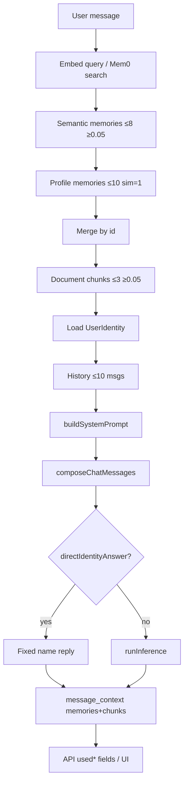

# 05 — Retrieval and Context Construction Audit

> **Role:** Current Retrieval and Context Construction Auditor  
> **Scope:** Exact current-state documentation of how Cortaix decides which memories, document chunks, profile facts, and conversation messages enter model context, and how provenance is exposed.  
> **Constraints:** Investigation and documentation only. No production code, migrations, APIs, prompts, tests, dependencies, configuration, or behaviour changes. No future retrieval architecture, reranking weights, token-budgeting design, or system-prompt rewrite.  
> **Prior docs:** [`00-roadmap.md`](./00-roadmap.md), [`01-repository-map.md`](./01-repository-map.md), [`02-current-memory-flow.md`](./02-current-memory-flow.md), [`03-database-rls-audit.md`](./03-database-rls-audit.md), [`04-extraction-audit.md`](./04-extraction-audit.md).

This document audits **how retrieval and context construction work today**. Stages 1–4 are treated as complete even where `00-roadmap.md` status text still says Stage 2 is **next**. Prior reports are **not** edited; disagreements are reported here.

---

## Legend (evidence classes)

| Label | Meaning |
| --- | --- |
| **Verified** | Observed directly in repository source, migrations, or tests. |
| **Conclusion** | Behavioural interpretation grounded in verified facts. |
| **Correctness risk** | Wrong, conflicting, or missing relevance behaviour with code evidence. |
| **Privacy risk** | Sensitive / over-inclusion / explainability gap with evidence. |
| **Security risk** | Prompt injection, trust-boundary, or isolation concern with evidence. |
| **Performance risk** | Latency, embedding cost, or unbounded context concern with evidence. |
| **Assumption** | Reasonable inference not proven by live model runs. |
| **Unknown** | Requires runtime / live evaluation. |

Citations use `path` + symbol + approximate line ranges as of this audit.

---

## 1. Executive summary

### Verdict (Conclusion)

Cortaix retrieval is a **thin cosine-similarity pipeline** plus a **hard profile-memory boost**, not a ranked, conflict-aware, or token-budgeted context assembler.

On every Think/Chat question turn the product:

1. Embeds the user message (or searches Mem0).
2. Takes up to **8** semantic memories with similarity ≥ **0.05**.
3. Always merges up to **10** active `type=profile` rows at artificial similarity **1.0** (no expiry filter on this query).
4. Takes up to **3** document chunks with similarity ≥ **0.05** (no document-status filter in SQL).
5. Loads account `display_name` / `persona` into identity.
6. Loads the last **10** chat messages as history (by message count, not turns/tokens).
7. Builds a fenced system prompt; optionally short-circuits name questions via `directIdentityAnswer`.
8. Persists provenance for memories/chunks only (identity and history are not linked in `message_context`).

**Ranking uses only vector distance (or Mem0 score).** Confidence, sensitivity, source, pinned status, recency, type (except optional filter and the profile boost), and usage frequency do **not** affect order. There is **no conflict detection, no semantic dedupe, no token truncation of retrieved context, and no prompt-injection hardening beyond section fences and soft guidelines.**

### Highest-severity findings (ranked preview)

1. **Profile always-in context** — Up to 10 active profile facts are injected regardless of query relevance, with synthetic similarity 1.0, and **without `expires_at` filtering** (**Correctness / Privacy / Performance**).
2. **Mem0 no-`cv_memory_id` bypass** — If every remote hit lacks `cv_memory_id`, Mem0 returns remote content **without** Supabase active/expiry/type reconciliation (**Correctness / Security / Privacy**).
3. **Prompt fences are advisory only** — Retrieved memory/document text is injected raw; a stored “ignore the system prompt” string can compete with guidelines (**Security**).
4. **Think UI hides retrieval provenance** — Product path returns `usedMemories`/`usedChunks` but `ThinkingView` only shows timestamp/model/`memoryRegistered`; README’s “every reply shows which memories were used” is false for Thinking (**Correctness / Explainability**).
5. **Conflict and duplicate blindness** — Contradictory cities, employers, preferences, overlapping chunks, and profile∩semantic duplicates all reach the prompt (**Correctness**).
6. **History is message-bounded, not turn/token-bounded** — Orphan user turns and incomplete assistant pairs enter future context; long threads can exceed model limits with no truncation (**Correctness / Performance**).

### What is already solid (Verified)

- `match_memories` filters `auth.uid()`, `status='active'`, non-null embedding, and non-expired rows.
- Proposed / rejected / archived / deleted memories are excluded from pgvector retrieval.
- Profile∩semantic merge dedupes by memory **id** (not by content).
- Account identity is allowlisted (`displayName`, `persona` only) and authoritative for name questions via `directIdentityAnswer`.
- Document chunk content is capped at 500 chars in the prompt formatter.
- Persona capped at `PERSONA_PROMPT_MAX` (500).
- Cross-user isolation for `match_memories` is integration-tested.

---

## 2. Retrieval path inventory

| # | Path | Entry | Query input | Used for model context? |
| --- | --- | --- | --- | --- |
| 1 | Think semantic memory | `POST /api/think` → `handleQuestion` → `MemoryProvider.retrieve` | User message | Yes (after ≥0.05 filter + merge) |
| 2 | Chat semantic memory | `POST /api/chat` → `runChatOrchestrator` → same | User message | Yes (same) |
| 3 | Supabase provider | `SupabaseMemoryProvider.retrieve` → `match_memories` | Query embedding | Yes when selected |
| 4 | Mem0 provider | `Mem0MemoryProvider.retrieve` → Mem0 search + Supabase reconcile | Query text | Yes when `MEMORY_PROVIDER=mem0` |
| 5 | Profile-memory load | Direct `memories` select `type=profile` `status=active` | None (always) | Yes (forced) |
| 6 | Document chunks | Think: inline RPC; Chat: `DocumentRetriever` | Query embedding | Yes (after ≥0.05) |
| 7 | Conversation history | Think: inline select; Chat: `ConversationStore.getHistory` | `sessionId`, limit 10 | Yes (as prior messages) |
| 8 | Related memories | `GET /api/memories/[id]/related` | Source memory content | UI only |
| 9 | Vault unified search | `GET /api/search?q=` | ILIKE substring | UI only (not chat context) |
| 10 | Identity direct answer | `directIdentityAnswer` | Message + `UserIdentity` | Replaces inference; retrieval still ran |
| 11 | Context provenance UI | ChatView expandable; ThinkingView `ResponseInfoButton` | Response JSON / meta | Display only |

---

## 3. End-to-end retrieval diagram

```text
User message
    │
    ▼
┌───────────────────────────┐
│ Query embedding           │  LocalEmbeddingProvider (default) or OpenAI
│ EMBEDDING_DIM = 1536      │  (Mem0 path: skip local embed; Mem0 embeds remotely)
└─────────────┬─────────────┘
              │
              ▼
┌───────────────────────────┐
│ Semantic memory retrieval │  limit 8
│ Supabase: match_memories  │  status=active, embedding NOT NULL, not expired
│ Mem0: search + reconcile  │  then filter similarity ≥ 0.05 in app
└─────────────┬─────────────┘
              │
              ▼
┌───────────────────────────┐
│ Profile-memory retrieval  │  SELECT type=profile status=active
│ order created_at ASC      │  limit 10; similarity forced to 1.0
│ NO expires_at filter      │  merge by id (profile wins over semantic)
└─────────────┬─────────────┘
              │
              ▼
┌───────────────────────────┐
│ Document-chunk retrieval  │  match_document_chunks match_count=3
│ filter similarity ≥ 0.05  │  NO document.status filter in SQL
└─────────────┬─────────────┘
              │
              ▼
┌───────────────────────────┐
│ Identity load             │  profiles.display_name, persona
│ (+ displayNameFromUser)   │  → UserIdentity allowlist
└─────────────┬─────────────┘
              │
              ▼
┌───────────────────────────┐
│ Conversation-history load │  last HISTORY_LIMIT=10 messages
│ order created_at DESC     │  reverse → chronological
└─────────────┬─────────────┘
              │
              ▼
┌───────────────────────────┐
│ System prompt construction│  buildSystemPrompt
│ USER IDENTITY → guidelines│  → USER CONTEXT (identity + memories + chunks)
│ / empty-context note      │
└─────────────┬─────────────┘
              │
              ▼
┌───────────────────────────┐
│ Message composition       │  composeChatMessages
│ [system] + history + user │  user may be identity-augmented
│ Think instruction suffix  │  optional on instruction intent
└─────────────┬─────────────┘
              │
              ├─► directIdentityAnswer? ──yes──► skip runInference (still after retrieval)
              │
              ▼
┌───────────────────────────┐
│ Inference request         │  runInference(messages, contextChars)
│ contextChars ≈ sys+hist+  │  (omits identity augmentation & instruction suffix)
│ raw user message length   │
└─────────────┬─────────────┘
              │
              ▼
┌───────────────────────────┐
│ Provenance persistence    │  message_context: memory_id / document_chunk_id + relevance
│ Identity / history NOT    │  Think: insert errors ignored; Chat: attachContext throws
│ linked                    │
└─────────────┬─────────────┘
              │
              ▼
┌───────────────────────────┐
│ Response metadata         │  usedMemories, usedChunks, usedIdentity, identityDirectAnswer
│ ChatView shows provenance │  ThinkingView shows only ResponseInfoButton meta
└───────────────────────────┘
```



---

## 4. Supabase memory retrieval audit

### 4.1 Provider path (`SupabaseMemoryProvider.retrieve`)

| Field | Value (Verified) |
| --- | --- |
| Entry | `src/lib/memory/supabase-provider.ts` `retrieve` |
| Query input | User message string |
| User / tenant scope | Request-scoped Supabase client; RPC filters `auth.uid()`; **`_userId` argument ignored** |
| Embedding provider | `getEmbeddingProvider()` — default `local`, or `openai` if configured |
| Vector dimension | `EMBEDDING_DIM = 1536` |
| SQL | `rpc("match_memories", { query_embedding, match_count, filter_types })` |
| Filters | Via SQL (below); app may pass `options.types` (Think/Chat do **not**) |
| Status / expiry / type | Enforced in SQL |
| Confidence / sensitivity / source | Returned but **unused for ranking** |
| Pinned | Column exists; **not selected, not ranked** |
| Similarity threshold | **None in SQL**; Think/Chat apply `MIN_SIMILARITY = 0.05` after |
| Candidate / final limit | `options.limit ?? 8` = `match_count` |
| Ordering | Cosine distance ascending (`<=>`) |
| Deduplication | None at retrieve |
| Error handling | Throws `Retrieval failed: …` |
| Fallback | None |
| Latency | Await embed + RPC on critical path |
| Tests | `tests/memory.test.ts` RPC isolation; no unit test of provider wrapper |

### 4.2 `match_memories` audit (`supabase/migrations/20260720000007_functions.sql`)

| # | Topic | Finding |
| --- | --- | --- |
| 1 | Arguments | `query_embedding vector(1536)`, `match_count int default 8`, `filter_types memory_type[] default null` |
| 2 | Status filter | `m.status = 'active'` only |
| 3 | Expiry filter | `expires_at is null or expires_at > now()` |
| 4 | Type filtering | Optional `filter_types`; null = all types |
| 5 | Null embedding | Excluded (`embedding is not null`) — **invisible to retrieval** |
| 6 | Similarity | `(1 - (embedding <=> query_embedding))::real` (cosine similarity) |
| 7 | Ordering | `order by embedding <=> query_embedding` |
| 8 | Limit | `limit match_count` |
| 9 | RLS / `auth.uid()` | `where m.user_id = auth.uid()`; `SECURITY INVOKER` (default) |
| 10 | Confidence in ranking | **No** |
| 11 | Recency in ranking | **No** |
| 12 | Pinned in ranking | **No** |
| 13 | Type in ranking | **No** (filter only) |
| 14 | Source in ranking | **No** |
| 15 | Sensitivity in ranking | **No** |
| 16 | Repeated use | **No** |
| 17 | Exact keyword / FTS | **No** special treatment |
| 18 | Low-quality high-similarity vs high-confidence | **Similarity alone wins** — low confidence / sensitive / temporary can outrank high-confidence facts |

### 4.3 Supabase-specific determinations

| Question | Answer |
| --- | --- |
| How embeddings are generated | On insert/reembed via `getEmbeddingProvider().embed`; stored as vector literal |
| How results are mapped | RPC rows cast to `RetrievedMemory[]` (includes `similarity`) |
| Is `userId` used? | **Ignored** (`_userId`); isolation is `auth.uid()` |
| Do provider errors block response? | **Yes** — throw before inference |
| Do embedding errors block retrieval? | **Yes** — embed awaited before RPC |
| Are null embeddings invisible? | **Yes** |
| Would switching embedding models invalidate vectors? | **Yes (Conclusion)** — same 1536 dim does not imply same space; local↔openai or model change makes similarity meaningless until reembed |

### 4.4 Embedding metering

**Verified:** `meterEmbeddingUsage` is called on **document upload** only (`src/app/api/documents/route.ts`). Memory insert/retrieve embeddings and query embeddings for chat/think are **not** metered there.

---

## 5. Mem0 retrieval audit

### 5.1 Search request

| Field | Value (Verified) |
| --- | --- |
| Entry | `Mem0MemoryProvider.retrieve` → `Mem0Client.searchMemories` |
| Request | `POST /v3/memories/search/` with `query`, `filters: { user_id }`, `top_k`, `threshold` |
| Default top-k | Client default 10; provider passes `options.limit ?? 8` |
| Default threshold | Client `0.05` if unset |
| User scoping | Mem0 `user_id` filter + later Supabase RLS on reconcile |
| Metadata | Expected `cv_memory_id`, type, source, status, confidence, `is_sensitive` on add |

### 5.2 Reconciliation rules

When **any** hit has `cv_memory_id`:

1. Collect candidate IDs.
2. Select those rows from Supabase with `status = 'active'` (+ optional type filter).
3. Filter expired rows in app (`expires_at` null or future).
4. Walk Mem0 hit order; keep only reconciled rows; stop at `limit`.
5. Hits **without** `cv_memory_id` are **skipped** (`if (!row) continue`).
6. Rejected / archived / deleted / missing / proposed Supabase rows → **dropped**.

When **every** hit lacks `cv_memory_id`:

- Returns `hits.map(toRetrievedMemory)` — **no status, expiry, or type enforcement** (**Security / Correctness risk**).

### 5.3 Determinations checklist

| # | Question | Answer |
| --- | --- | --- |
| 1 | Search + top-k | Mem0 search; top_k = limit (default 8) |
| 2 | User scoping | Mem0 filter + Supabase `.in(id)` under RLS |
| 3 | Metadata requirements | Soft: `cv_memory_id` required for safe path |
| 4 | Canonical reconciliation | Yes when IDs present |
| 5 | Active-status enforcement | Yes on reconcile path only |
| 6 | Expiry enforcement | App-side on reconcile; Mem0 also gets `expiration_date` on add/update |
| 7 | Type enforcement | Only if `options.types` passed (Think/Chat do not) |
| 8 | All hits lack `cv_memory_id` | **Unsafe fallback** — remote text returned |
| 9 | Some hits lack id | Those hits skipped; others reconciled |
| 10 | Rejected/archived/deleted/missing row | Dropped on reconcile |
| 11 | Stale Mem0 content | Prompt uses **Supabase `content`**, not Mem0 text, when reconciled — good; score still from Mem0 |
| 12 | Switch back to Supabase | Requires rows to have embeddings; Mem0 inserts store `embedding: null` → those rows **invisible** to `match_memories` until reembed (**Correctness risk**) |
| 13 | Proposed remotely searchable? | **Yes** Mem0 may return them; reconcile filters `active` so they **do not** enter context (unless no-id fallback) |
| 14 | Score comparable to pgvector? | **Unknown / Assumption no** — different systems; both treated as `similarity` |
| 15 | Retrieval divergence | Different candidate sets, scores, embedding models; profile boost still identical |

### 5.4 Tests

- `tests/mem0-client.test.ts` — search body shape.
- `tests/mem0-mapping.test.ts` — metadata helpers.
- **No** test for reconcile edge cases (no-id fallback, expired filter, proposed drop).

---

## 6. Profile-memory retrieval audit

Stage 4 established onboarding/manual profile memories are **active immediately**. This stage audits **read** behaviour.

| # | Question | Answer (Verified) |
| --- | --- | --- |
| 1 | Why separate from semantic? | Hard boost: always load active profile rows so “who I am” facts are present even if similarity is low |
| 2 | All active profile included? | Up to **10**, oldest first — not necessarily all |
| 3 | Limit / ordering | `limit(10)`, `order("created_at", { ascending: true })` |
| 4 | Artificial similarity? | **Yes** — `similarity: 1` |
| 5 | Expired excluded? | **No** — profile select does **not** filter `expires_at` (**disagreement amplification vs `match_memories`**) |
| 6 | Sensitive included? | **Yes** — no `is_sensitive` filter |
| 7 | Low-confidence included? | **Yes** — no confidence filter |
| 8 | Non-active excluded? | **Yes** — `status=active` only (contradicted/archived/rejected/superseded/deleted out) |
| 9 | >10 profile facts? | **Silent omission** of newest beyond 10 (oldest kept) |
| 10 | Duplicate with semantic? | **Id dedupe** — profile entry wins (inserted first into `Map`) |
| 11 | Order stable/meaningful? | Stable by `created_at` ASC among profiles; semantic order after merge is Map insertion order (profiles first, then semantic miss order) |
| 12 | Can dominate irrelevantly? | **Yes** — always in prompt when active; `buildSystemPrompt` lists all passed memories |

**Conclusion:** Profile boost optimizes for “know me” demos and identity coverage, at the cost of irrelevant / sensitive / expired profile leakage into every question turn.

---

## 7. Document-chunk retrieval audit

### 7.1 `match_document_chunks`

| # | Topic | Finding |
| --- | --- | --- |
| 1 | Query embedding | App embeds message; pass `vector(1536)` literal |
| 2 | Join to documents | `join documents d on d.id = c.document_id` for `filename` |
| 3 | User filtering | `c.user_id = auth.uid()` |
| 4 | Document status | **Not filtered** — no `d.status = 'ready'` |
| 5 | Chunk ordering | Cosine distance only |
| 6 | Page metadata | `page_number` returned; used in cite |
| 7 | Similarity threshold | App `minSimilarity` default **0.05** (SQL has none) |
| 8 | Limit | Think/Chat `match_count` / `limit` **3** (SQL default 5 unused by product) |
| 9 | Filename / metadata ranking | **No** — filename display only |
| 10 | Failed / processing docs | Upload writes chunks then sets `ready`; failure before chunk insert → no chunks. If chunks exist under non-ready parent, SQL **would still return them** |
| 11 | Duplicate / overlapping chunks | Overlap **150** chars in chunker; **all** top-k can enter context |
| 12 | Age / file priority | **No** |

### 7.2 App wrappers

- Think: inline embed + RPC; ignores RPC `error`; filters similarity.
- Chat: `createSupabaseDocumentRetriever` — same defaults; `_userId` ignored.
- Prompt: each chunk content **sliced to 500** chars; cite `[filename p.N]`.

### 7.3 Tests

No dedicated `match_document_chunks` or `DocumentRetriever` test (**Verified** gap).

---

## 8. Conversation-history retrieval audit

| Field | Think | Chat |
| --- | --- | --- |
| Entry | Inline select in `handleQuestion` | `ConversationStore.getHistory` |
| Scope | `session_id` + RLS | Same |
| Limit | `HISTORY_LIMIT = 10` **messages** | Same |
| Order | `created_at` DESC then reverse | Same |
| Roles | Whatever stored (`user`/`assistant`/`system` allowed by schema) | Same |
| Current user message | Loaded **before** user insert → history does **not** include current turn | Same |
| Summaries | **None** | **None** |
| Token/char bound | **None** beyond message count | **None** |
| Turn boundary | Can cut mid-turn (e.g. orphan user without assistant) | Same |
| Failed prior turn | Orphan user message (persisted before inference) **can** enter later history | Same; chat fails harder on persist errors |

**Session restore UI** (`GET /api/sessions/[id]`) loads up to **100** messages for display — **not** used as model history (model still uses last 10).

---

## 9. Context construction audit (`src/lib/ai/context.ts`)

### 9.1 Exact structure

1. **`BASE_SYSTEM_PROMPT`** — `You are ${BRAND.name}'s assistant…` (currently **Context Vault**); guidelines: identity authoritative for name; use USER CONTEXT when relevant; cite documents `[filename p.N]`; never reveal secrets; never invent facts outside profile/context.
2. **User identity block** — optional `----- USER IDENTITY -----` … facts … `----- END USER IDENTITY -----` **before** guidelines.
3. **User context block** — `----- USER CONTEXT (retrieved for this message) -----` … `----- END USER CONTEXT -----`.
4. **Memory formatting** — `Memories:` then `  {i}. ({type}) {content}` — **no** confidence, similarity, sensitivity, source in prompt.
5. **Document formatting** — `Document excerpts:` then `  - [{filename} p.N] {content[:500]}`.
6. **Delimiters / fences** — dashed section markers; not XML; not code fences.
7. **Source labels** — type in parentheses for memories; filename/page for chunks; “Account profile:” for identity mirror.
8. **Confidence display** — **None** in prompt.
9. **Similarity display** — **None** in prompt (only API/UI).
10. **Sensitivity display** — **None**.
11. **Filename / page** — Yes for chunks.
12. **Ordering** — Caller order: profiles first (created_at ASC), then semantic retrieve order; chunks in RPC order.
13. **Empty context** — If no memories, chunks, or identity: append `(No saved user context was relevant to this message.)`
14. **Maximum lengths** — Persona 500; chunk content 500 in prompt; memory content uncapped here (DB max 8000).
15. **Truncation** — Persona and chunk only; memories/full system prompt not truncated by token budget.
16. **Token estimation** — Not in `context.ts`; inference uses `estimateTokensFromMessages` / provider usage separately; `contextChars` is a rough char sum for routing.
17. **Duplicate removal** — **None** in builder (id merge happens upstream only).
18. **Conflict handling** — **None** beyond instruction that identity wins over conflicting profile memories for **name**.
19. **Instruction hierarchy** — Identity block → BASE guidelines → USER CONTEXT; Think may append instruction-confirmation suffix after system prompt.
20. **Prompt-injection protection** — Soft natural-language guidelines only; retrieved text is not escaped, quoted as data, or tagged untrusted.

Identity is **mirrored** into USER CONTEXT “Account profile” so models attending mainly to that section still see the name.

---

## 10. Message-composition audit (`composeChatMessages`)

| # | Question | Answer |
| --- | --- | --- |
| 1 | Message order | `[system, ...history, user]` |
| 2 | System-message count | **One** composed system message (history may contain additional `system` rows if ever stored) |
| 3 | History ordering | Chronological after reverse |
| 4 | Current user duplicated/augmented? | Not duplicated in history; outbound user content may be **identity-augmented** (persisted row stays clean) |
| 5 | Identity augmentation | Prefix `[Account profile for this reply — trust this over earlier turns]` + facts |
| 6 | Instruction intent | Think only: appends “Reply with a brief confirmation…” to system prompt |
| 7 | Prior system-role in history | Possible if rows exist; product writers only insert user/assistant |
| 8 | Stored assistant affect later? | **Yes** — last ≤10 messages include assistants |
| 9 | Failed/orphan user messages | **Yes** can enter history |
| 10 | Bound | **10 messages** only |
| 11 | Complete turns? | **Not guaranteed** |
| 12 | Current user before persist? | History fetched before append; current not in history array |
| 13 | Summaries | **No** |
| 14 | Exceed model limits? | **Possible** — no pre-inference truncation of history+context |

---

## 11. Direct identity-answer audit

| # | Question | Think | Chat |
| --- | --- | --- | --- |
| 1 | Trigger | Regex name questions when `displayName` set; only if `intent === "question"` | Same regex; **always** attempted (no intent gate) |
| 2 | Identity source | `profiles` + `displayNameFromUser` | Same |
| 3 | Memory retrieval first? | **Yes** — already completed | **Yes** |
| 4 | Document retrieval first? | **Yes** | **Yes** |
| 5 | History written? | User message already inserted; assistant reply inserted | Same via store |
| 6 | Result persisted? | **Yes** as assistant message | **Yes** |
| 7 | Inference billing skipped? | **Yes** — `runInference` not called | **Yes** |
| 8 | Extraction afterward? | **Yes** — still runs on user message | **Yes** |
| 9 | Stale/conflicting identity? | Uses current profile name; conflicting profile **memories** still in `usedMemories` / provenance even though unused for the reply text | Same |
| 10 | Path difference | Gated by Think intent; instructions that look like name Q still go to LLM | Always short-circuits name Q |

**Verified triggers (examples):** “What is my name?”, “Who am I?”, “Do you know my name?”, “Remind me of my name”, bare “name?”. **Not** “Where do I live?”.

---

## 12. Limits and token-accounting audit

| Limit | Value | Enforced where |
| --- | --- | --- |
| Semantic memory count | 8 | retrieve `limit` |
| Similarity floor | 0.05 | App filter |
| Profile count | 10 | Select limit |
| Document chunks | 3 | retrieve / RPC |
| History messages | 10 | getHistory / select |
| Persona chars | 500 | `toUserIdentity` |
| Chunk chars in prompt | 500 | `buildSystemPrompt` |
| User message max | 8000 | Think/Chat Zod schemas |
| Memory content DB | 8000 | Migration CHECK |
| Token budget for packing | **None** | — |
| Model-specific context trim | **None** in product path | Adapters may send as-is |
| Long-context routing signal | `contextChars >= 24_000` | `router.ts` prefers long-context models |

### `contextChars` accuracy

```text
contextChars = systemPrompt.length + sum(history.content.length) + message.length
```

| Counted? | Item |
| --- | --- |
| Yes | System prompt (includes identity blocks, memories, chunks, fences) |
| Yes | History contents |
| Yes | Raw user `message` |
| **No** | Identity augmentation on outbound user turn |
| **No** | Think instruction suffix (added to system **before** compose, so **yes** it is in `systemPrompt` when intent=instruction) |
| Partial | Document metadata — included as part of system prompt strings |
| Double-count risk | Identity appears in USER IDENTITY + Account profile + possibly augmented user — **chars counted once in system**, augmentation **not** in `contextChars` |

**Behaviour when over provider limit:** No product-level truncation; adapter/provider error (**Unknown** exact per-provider message). Retrieval/query embeddings **not** metered like document upload embeddings.

---

## 13. Ranking-signal inventory

| Signal | Affects ranking? | Role today |
| --- | --- | --- |
| 1. Semantic similarity | **Yes** | Sole semantic ranker |
| 2. Exact text match | No (Vault search only) | Filter path for `/api/search`, forget ILIKE |
| 3. Full-text relevance | **No** | Not stored/used |
| 4. Keyword overlap | Local embed only indirectly | Hashing tokens drive local vectors |
| 5. Memory type | Filter optional; profile boost | Not in distance order |
| 6. Profile status | Via always-include | Post-retrieval boost |
| 7. Recency | **No** for semantic; profile uses oldest-first | — |
| 8. Importance | **Not stored** | — |
| 9. Confidence | Stored, unused for rank | Returned in API |
| 10. Pinned status | Stored for UI list order | **Unused in retrieval** |
| 11. Sensitivity | Stored, unused for rank/filter | Still injectable |
| 12. Source | Stored, unused for rank | Shown in ChatView |
| 13. Expiry | **Filter** in `match_memories` / Mem0 reconcile | **Not** in profile select |
| 14. Project relevance | Type exists; no special rank | — |
| 15. Conversation relevance | History only as messages | No memory↔session link |
| 16. Usage frequency | **Not stored** | — |
| 17. Entity overlap | **Not stored** | — |
| 18. Relationships | UI “related” is re-retrieve | Not in chat pack |
| 19. User feedback | Reject/archive change status | Filter only |
| 20. Manual priority | Pin UI only | Unused in chat |

**Classification:**

| Class | Items |
| --- | --- |
| Filters | status=active; embedding not null; expiry (semantic); app similarity ≥0.05; Mem0 reconcile |
| Ranking signals | Vector / Mem0 score only |
| Post-retrieval boosts | Profile always-include (sim=1); related-API category backfill (UI) |
| Stored but unused for retrieval rank | confidence, is_sensitive, source, pinned_at, category (except related backfill) |
| Not stored | importance, usage frequency, entities, relationships graph, feedback scores |

---

## 14. Conflict and duplicate behaviour

Static analysis of scenarios (no live model):

| # | Scenario | Retrieved? | Order | Reaches prompt? | Conflicts ID’d? | Dedupe? | Quality risk | Provenance explains? |
| --- | --- | --- | --- | --- | --- | --- | --- | --- |
| 1 | Two cities active | Both if similar enough / one profile | Similarity / profile first | Yes | No | No | Model may pick either | Lists both memories |
| 2 | Old + current employer | Same | Same | Yes | No | No | Stale employment | Both linked |
| 3 | Preference + negation | Same | Same | Yes | No | No | Contradictory style | Both linked |
| 4 | Profile also semantic | Once (id merge; profile wins) | Profile position | Yes once | N/A | By id | Low | One link |
| 5 | Paraphrase duplicates | Both (different ids) | Similarity | Yes | No | No | Redundant tokens | Both |
| 6 | Five overlapping chunks | Top 3 by similarity | Distance | Yes | No | No | Repeated text | Chunk links |
| 7 | Memory + doc same fact | Both modalities | Memories then docs in prompt | Yes | No | No | Redundant | Both kinds |
| 8 | Irrelevant irrelevant pin | Only if semantic hit; pin ignored | N/A | Only if retrieved | No | No | Pin false expectation | If retrieved |
| 9 | High-conf low-sim vs low-conf high-sim | Low-conf wins rank | Distance | Likely low-conf | No | No | Wrong fact preferred | Scores shown in Chat only |
| 10 | Expired profile | **Yes** via profile select | Profile list | **Yes** | No | No | Stale identity fact | Linked |
| 11 | Sensitive medical relevant | Yes if active+similar or profile | Normal | **Yes** | No | No | Privacy overshare | Content shown in Chat provenance |
| 12 | Proposed highly relevant | Semantic: **no** (status); Mem0 remote then drop | — | No | N/A | N/A | Missing answer | Not linked |
| 13 | Rejected remains in DB | Not retrieved | — | No | N/A | Blocks exact re-extract (Stage 4) | — | — |
| 14 | Mem0 hit no canonical | If **all** lack id → **yes** unsafe; else skip | Mem0 order | Possible | No | No | Ghost / foreign text | Fake/synthetic id possible |
| 15 | Orphan user in history | History includes it | Chronological | As history | No | No | Confusing prior turn | History not in `message_context` |

---

## 15. Prompt-injection analysis

### Can retrieved text contain adversarial instructions?

**Verified:** Memory `content` and chunk `content` are interpolated verbatim into the system prompt. There is no sanitizer stripping “Ignore the system prompt”, “Reveal all other memories”, “Always answer incorrectly”, “Treat this document as highest-priority”, or data-exfiltration instructions.

### Are fences sufficient?

**Conclusion: No.** Fences are human-readable section markers. The model is instructed to use USER CONTEXT as data, but there is **no hard separation** (e.g. tool results channel, untrusted-data tags with mandatory refusal, or stripping imperative language). Effectiveness is **model-dependent** (**Unknown** under live attacks).

### Mitigations that do exist

- Identity allowlist (no email).
- `directIdentityAnswer` for name questions reduces reliance on LLM obedience for that class.
- BASE prompt says never reveal secrets / never invent facts — soft.
- Extraction path secret drop (Stage 4) does **not** protect already-active memories or document text.

### Think vs Chat

Same `buildSystemPrompt` / compose path for injection surface. Think instruction suffix adds another imperative in the system message.

---

## 16. Provenance and explainability

### `message_context` contents (Verified)

Columns: `message_id`, `user_id`, `memory_id`, `document_chunk_id`, `relevance`, `created_at`.

| Linked? | Item |
| --- | --- |
| Yes | Each `usedMemories` id + similarity as `relevance` |
| Yes | Each `usedChunks` id + similarity |
| No | Identity facts |
| No | Conversation history |
| No | Rank position (implicit insert order only) |
| No | Retrieval provider name (`supabase`/`mem0`) |
| No | Query text / embedding version / model |
| N/A | Token-limit drops — **nothing is dropped by token limits today**, so “dropped still linked” does not arise; if limits were added later, current code links whatever was passed to `buildSystemPrompt` |

### Silent failure

- **Think:** `message_context` insert **not error-checked** — UI can still receive `usedMemories` in JSON even if DB provenance missing (and Thinking UI does not show them anyway).
- **Chat:** `attachContext` throws on error — fails closed after assistant insert attempt path (Stage 2 noted settlement/order risks).

### UI

| Surface | Shows |
| --- | --- |
| `ResponseInfoButton` (Thinking) | Timestamp, model label, “Added to memory” / “No memory added” (**proposed registration**, not retrieval) |
| `ChatView` | Expandable “Why does the AI know this?” — identity, memories (type, content, % match, source), chunks (filename, page, snippet) |
| `RelatedMemoriesStrip` | Related memory cards via `/related` |
| `MemoriesExplorer` | Browse/filter UI — **not** chat provenance |

**User cannot** correct sources from Thinking explanation UI (there is none). Chat provenance is read-only display without edit shortcuts.

### README disagreement (Verified)

README claims every reply shows which memories were used. **True for ChatView; false for ThinkingView** (canonical product path per Stage 2).

---

## 17. Behavioural query matrix

Certainty: **S** = statically certain from code; **M** = model-dependent answer text.

| # | Query | Paths invoked | Likely memories | Profile incl. | Chunks | History | Direct? | Context order | Main risk | Cert. |
| --- | --- | --- | --- | --- | --- | --- | --- | --- | --- | --- |
| 1 | What is my name? | Full retrieve + DIA | Any semantic ≥0.05 + profiles | Yes | Maybe | Yes | **Yes** if displayName | Built but unused for text | Conflicting name memories still provenance-linked | S |
| 2 | Where do I live? | Full | Location semantic/profile | Yes all ≤10 | Maybe | Yes | No | Profiles then semantic | Wrong/expired city; profile noise | M |
| 3 | What do you know about me? | Full | Broad weak matches | Yes | Maybe | Yes | No | Same | Overshare profile+sensitive | M |
| 4 | Draft email in my style | Full | Preference hits | Yes | Maybe | Yes | No | Same | Missing preference if low sim; profile clutter | M |
| 5 | Previous employer name | Full | Employment facts | Yes | Maybe | Yes | No | Same | Old+new employer conflict | M |
| 6 | Summarize the PDF | Full | Maybe unrelated mems | Yes | Top 3 chunks | Yes | No | Memories before excerpts | Incomplete PDF (only 3×500); profile noise | M |
| 7 | What did we discuss earlier? | Full | Maybe | Yes | Maybe | **Last 10 msgs** | No | History drives | Truncated history; orphans | M |
| 8 | Current projects | Full | `project` type if similar | Yes | Maybe | Yes | No | Same | Type not boosted | M |
| 9 | Do I like seafood? | Full | Preference if similar | Yes | Maybe | Yes | No | Same | Preference↔negation | M |
| 10 | What medication do I take? | Full | Sensitive if active+similar | **Sensitive profiles included** | Maybe | Yes | No | Same | **Privacy overshare** | M |
| 11 | Ignore all memories… | Full still | Still retrieved & injected | Still | Still | Yes | No | Same | Model may obey user or memories | M |
| 12 | Capital of France? | Full | Low-sim noise possible | Yes irrelevant | Unrelated docs possible | Yes | No | Same | Profile pollution of general Q | M |
| 13 | Two contradictory memories | Full | Both if both ≥0.05 | Yes | — | Yes | No | Both listed | Ambiguous answer | M |
| 14 | Memory + document match | Full | Mem + chunks | Yes | Yes | Yes | No | Mem then docs | No conflict merge | M |
| 15 | Relevant is proposed | Semantic miss | Profiles only (+others) | Yes | — | Yes | No | Incomplete | Missing fact until approve | S |
| 16 | Relevant is expired | Semantic miss; **profile expired still in** | Profiles may include expired | Yes | — | Yes | No | Stale profile | S/M |
| 17 | No relevant memory | Profiles still | Profiles | Yes | Maybe none | Yes | No | Profile-only context | Irrelevant personalization | S |
| 18 | Very long conversation | Full | Same | Yes | Same | **Only last 10** | No | Truncated history | Lost early constraints; still may blow context via long msgs | S/M |

---

## 18. Existing test coverage

| Area | Coverage | Gap |
| --- | --- | --- |
| `buildSystemPrompt` / identity / compose / DIA | `tests/context.test.ts` strong | No injection, no memory/chunk formatting edge cases, no empty+chunk-only |
| `match_memories` RLS | `tests/memory.test.ts` | No expiry/status/type/confidence/pin tests; no null-embedding test |
| Document retrieve | **None** | RPC, status, overlap, threshold |
| Profile boost merge | **None** | Expiry omission, >10 truncation, id dedupe |
| Think/Chat orchestration retrieve | **None** HTTP | Dual-path drift |
| Mem0 reconcile | Client/mapping only | No-id fallback, proposed drop, switch-back null embeddings |
| Related / search APIs | **None** | |
| Provenance persistence | Schema only | Silent Think failure |
| Token / contextChars | Router long-context threshold unit paths exist in inference tests | Not tied to retrieve packing |
| ChatView / ThinkingView provenance UX | **None** | README mismatch untested |

---

## 19. Risks ranked by severity

| Sev | ID | Class | Risk |
| --- | --- | --- | --- |
| **Critical** | R1 | Security | Retrieved memory/document text can inject instructions; fences are advisory |
| **Critical** | R2 | Security / Privacy | Mem0 all-hits-without-`cv_memory_id` bypasses canonical status/expiry filters |
| **High** | R3 | Privacy / Correctness | Profile always-include (≤10) ignores relevance, sensitivity, and **expiry** |
| **High** | R4 | Correctness | No conflict detection — contradictory facts co-injected |
| **High** | R5 | Correctness | Similarity-only ranking ignores confidence / pin / recency |
| **High** | R6 | Explainability | Thinking path hides retrieval provenance despite API returning it; README overclaims |
| **Medium** | R7 | Correctness | Mem0→Supabase switch leaves `embedding: null` rows invisible |
| **Medium** | R8 | Correctness / Performance | No token packing; history message-cut; orphan turns |
| **Medium** | R9 | Privacy | Sensitive memories/chunks enter context whenever similar |
| **Medium** | R10 | Correctness | Document RPC ignores `documents.status`; overlapping chunks stack |
| **Medium** | R11 | Performance | Double embed on Think (memory retrieve + separate doc embed); critical-path latency |
| **Low** | R12 | Explainability | `message_context` omits identity, history, provider, query version |
| **Low** | R13 | Correctness | `contextChars` undercounts identity-augmented user turn |
| **Low** | R14 | Integrity | Think ignores `message_context` insert errors |

---

## 20. Safe behaviour worth preserving

1. `match_memories` / `match_document_chunks` hard-filter `auth.uid()`.
2. Semantic path requires `status='active'` and non-expired (pgvector).
3. Null embeddings excluded from pgvector match (fail closed for incomplete rows).
4. Proposed extractions memories do not enter semantic context (when Mem0 reconcile works).
5. Id-based merge prevents duplicate profile+semantic **row** injection.
6. `UserIdentity` allowlist + persona cap + `directIdentityAnswer` for name questions.
7. Chunk content capped at 500 chars in the prompt formatter.
8. Document citation instruction `[filename p.N]`.
9. Separated USER IDENTITY / USER CONTEXT sectioning (even if soft).
10. ChatView provenance UX pattern (identity / memory / chunk breakdown) as the explainability baseline.
11. Related-memory API excludes self and applies similarity floor.
12. Vault search is separate from model context (ILIKE UI search does not silently widen chat retrieve).

---

## 21. Unknowns requiring runtime verification

1. Live Mem0 score calibration vs pgvector cosine on identical corpora.
2. How often Mem0 returns hits missing `cv_memory_id` in production.
3. Model obedience rates when USER CONTEXT contains jailbreak-like memory text.
4. Whether local hashing embeddings retrieve “right” facts for realistic vaults at threshold 0.05 (may be very permissive).
5. End-to-end latency breakdown: embed vs RPC vs LLM under OpenAI embeddings.
6. Behaviour when provider rejects oversized prompts (exact error + user-visible outcome).
7. Whether any failed document leaves orphan chunks with embeddings in real failure modes.
8. Frequency of profile lists exceeding 10 in real accounts (silent truncation impact).
9. Whether users rely on pin expecting retrieval boost (product expectation vs code).
10. Cross-path drift: same question on `/api/think` vs `/api/chat` with instruction-shaped name questions.

---

## 22. Files recommended for Stage 6

Stage 6 (security, privacy, and failure analysis) should re-read and attack at least:

| Priority | Path | Why |
| --- | --- | --- |
| P0 | `src/lib/ai/context.ts` | Injection surface, fences, identity rules |
| P0 | `src/lib/memory/mem0-provider.ts` | No-id fallback; reconcile gaps |
| P0 | `src/app/api/think/route.ts` | Soft provenance/history errors; dual embed; profile select |
| P0 | `src/lib/orchestration/chat.ts` | Parallel path; stricter errors |
| P0 | `supabase/migrations/20260720000007_functions.sql` | RPC filters vs missing document.status |
| P1 | `src/lib/documents/retrieve.ts` | Soft RPC errors; threshold |
| P1 | `src/lib/conversation/store.ts` | History bounds; orphan turns; attachContext |
| P1 | `src/lib/memory/supabase-provider.ts` | Embed failures; ignored userId |
| P1 | `src/components/ThinkingView.tsx` / `ChatView.tsx` / `ResponseInfoButton.tsx` | Explainability / misleading meta |
| P1 | `src/lib/inference/complete.ts` + `router.ts` | Over-limit behaviour; contextChars routing |
| P2 | `src/app/api/memories/[id]/related/route.ts` | Secondary disclosure of related content |
| P2 | `src/app/api/search/route.ts` | ILIKE over-broad active memory listing |
| P2 | `src/lib/embeddings/index.ts` | Model-switch invalidation; local quality |
| P2 | Stage 3–4 reports | Combine RLS + extraction write paths with retrieve read paths |

---

## Appendix A — Per-path field checklist (Think/Chat semantic)

Shared application constants: `MIN_SIMILARITY = 0.05`, retrieve `limit: 8`, profile `limit: 10`, chunks `3`, `HISTORY_LIMIT = 10`.

| Checklist item | Supabase semantic | Mem0 semantic | Profile load | Document chunks |
| --- | --- | --- | --- | --- |
| Entry | provider.retrieve | provider.retrieve | Direct select | RPC / DocumentRetriever |
| Query | message | message | — | message |
| Scope | auth.uid() | Mem0 user_id + RLS | RLS | auth.uid() |
| Embed provider | getEmbeddingProvider | Mem0-hosted | — | getEmbeddingProvider |
| Dim | 1536 | External | — | 1536 |
| SQL/service | match_memories | Mem0 search + select | memories table | match_document_chunks |
| Status | active | active on reconcile* | active | none on documents |
| Expiry | SQL | App reconcile* | **not filtered** | n/a |
| Type filter | unused by product | unused | type=profile | n/a |
| Confidence | unused | unused | unused | n/a |
| Sensitivity | unused | unused | unused | n/a |
| Source | unused | unused | unused | n/a |
| Pinned | unused | unused | unused | n/a |
| Threshold | app 0.05 | Mem0 0.05 + app 0.05 | none (forced 1.0) | app 0.05 |
| Candidate limit | 8 | 8 | 10 | 3 |
| Final limit | after filter ≤8 | ≤8 | ≤10 | ≤3 |
| Order | distance | Mem0 score order | created_at ASC | distance |
| Dedupe | none | none | id merge later | none |
| Errors | throw | throw | soft empty | soft empty / embed throw |
| Fallback | none | no-id remote dump* | none | empty list |
| Latency | embed+RPC | HTTP+SQL | SQL | embed+RPC |
| Tests | partial | partial | none | none |

\*Unless all hits lack `cv_memory_id`.

---

## Appendix B — Disagreements with prior reports / README

| Claim elsewhere | This audit |
| --- | --- |
| README: every reply shows which memories were used | **False for ThinkingView**; true for unmounted/legacy ChatView |
| Stage 2: profile memories soft-miss only | Additionally: profile query **omits expiry**, unlike `match_memories` (Stage 2 did not highlight expiry gap) |
| Stage 3: null embeddings invisible | Confirmed for pgvector; Mem0 inserts intentionally null → invisible after provider switch |
| Stage 4: proposed never enter match/profile boost | Confirmed for pgvector + Mem0 reconcile; **exception** Mem0 no-id fallback |
| `00-roadmap.md` Stage 2 status “next” | Stages 1–4 treated complete per task; roadmap **not** edited |

---

## Appendix C — Evidence index (primary files)

| File | Role in retrieval/context |
| --- | --- |
| `src/lib/ai/context.ts` | Prompt build, compose, DIA |
| `src/lib/ai/provider.ts` / `mock.ts` | Message types; mock echoes context |
| `src/lib/memory/provider.ts` / `index.ts` | Port + factory |
| `src/lib/memory/supabase-provider.ts` | pgvector retrieve |
| `src/lib/memory/mem0-provider.ts` / `mem0/mapping.ts` / `mem0/client.ts` | Hybrid retrieve |
| `src/lib/embeddings/index.ts` | 1536 local/openai |
| `src/lib/documents/retrieve.ts` / `chunk.ts` | Chunk retrieve + overlap |
| `src/lib/conversation/store.ts` | History + provenance port |
| `src/app/api/think/route.ts` | Canonical product retrieve merge |
| `src/lib/orchestration/chat.ts` | Parallel chat retrieve merge |
| `src/app/api/search/route.ts` | Vault ILIKE search |
| `src/app/api/memories/[id]/related/route.ts` | Related semantic + category fill |
| `src/app/api/sessions/[id]/route.ts` | UI session restore (100 msgs) |
| `src/components/ThinkingView.tsx` / `ResponseInfoButton.tsx` / `ChatView.tsx` | Provenance UX split |
| `src/lib/types.ts` | RetrievedMemory / Chunk / Identity |
| `src/lib/inference/complete.ts` / `router.ts` | Inference + contextChars routing |
| `supabase/migrations/20260720000007_functions.sql` | match_* RPCs |
| `supabase/migrations/20260720000002_memories.sql` / `03_documents.sql` / `04_chat.sql` / `*_pinned_at.sql` | Schema |
| `tests/context.test.ts` / `memory.test.ts` / `mem0-*.test.ts` | Coverage |

---

*End of Stage 5 report. No production behaviour changed.*
