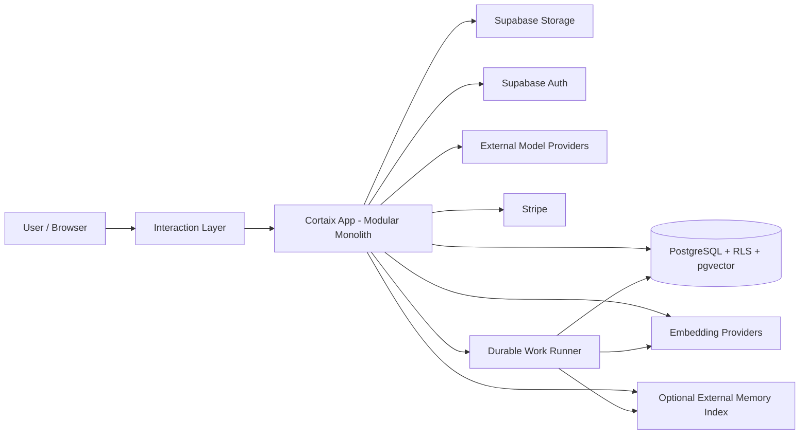
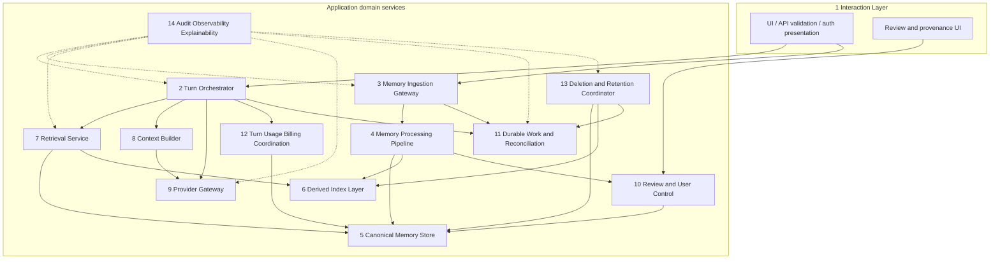
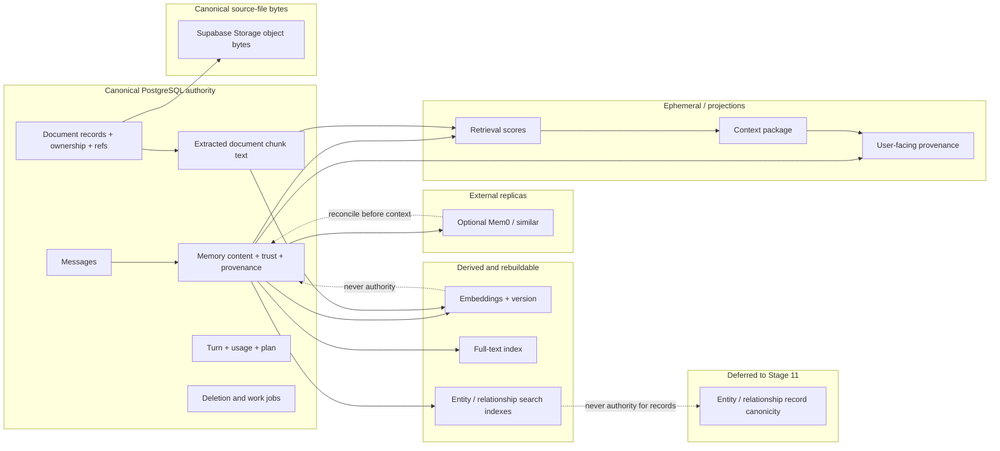
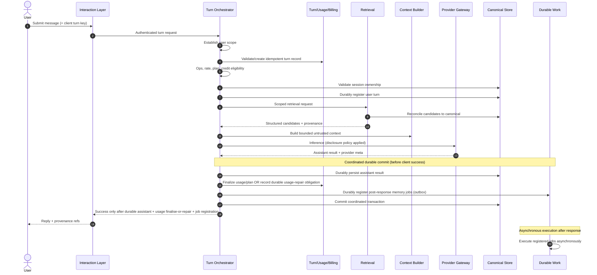
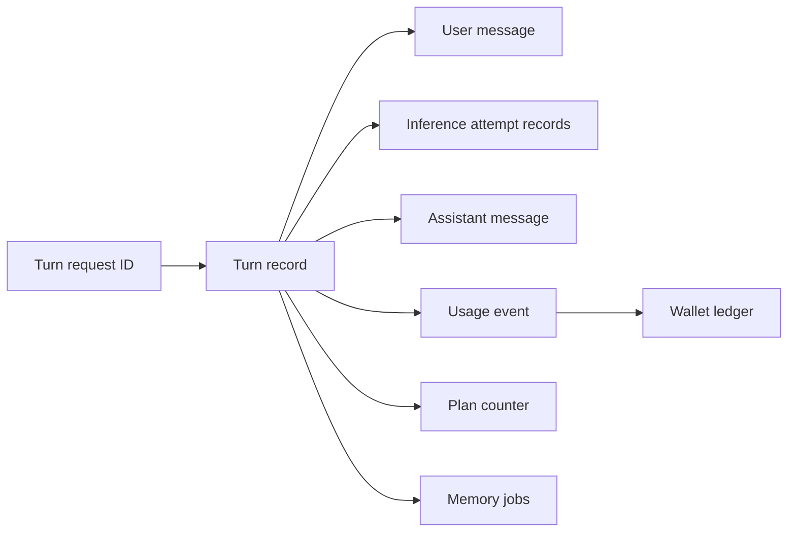
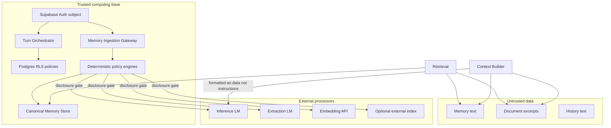
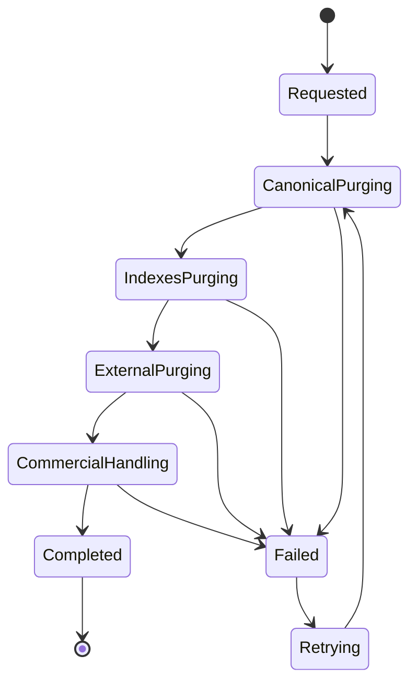

# 07 — Target Memory Architecture

> **Role:** Target Memory Architecture Designer  
> **Scope:** High-level target shape of Cortaix’s persistent, model-independent personal AI memory system.  
> **Constraints:** Documentation only. No production code, migrations, SQL, APIs, prompts, tests, dependencies, configuration, secrets, or behaviour changes. No implementation roadmap or first-PR specification. Exact taxonomy, schema, algorithms, retrieval weights, and framework build-versus-reuse decisions are deferred to Stages 8–13.  
> **Prior docs:** [`00-roadmap.md`](./00-roadmap.md), [`01-repository-map.md`](./01-repository-map.md), [`02-current-memory-flow.md`](./02-current-memory-flow.md), [`03-database-rls-audit.md`](./03-database-rls-audit.md), [`04-extraction-audit.md`](./04-extraction-audit.md), [`05-retrieval-context-audit.md`](./05-retrieval-context-audit.md), [`06-security-failure-audit.md`](./06-security-failure-audit.md).

Stages 1–6 are treated as **complete** even though `00-roadmap.md` status text may lag. Prior reports are **not** edited; factual disagreements are recorded here.

---

## Legend (evidence classes)

| Label | Meaning |
| --- | --- |
| **Verified audit requirement** | Behaviour or risk established in Stages 1–6 that the architecture must address. |
| **Architectural decision** | Binding target choice for Stages 8+. |
| **Tradeoff** | Cost accepted to obtain a decision’s benefits. |
| **Assumption** | Reasonable premise not proven by live production metrics. |
| **Deferred decision** | Intentionally left to a later stage. |
| **Unknown** | Cannot be resolved from audits alone; later stages or runtime must answer. |

---

## 1. Executive summary

Cortaix’s target memory architecture is a **modular monolith**: one Next.js deployable; **PostgreSQL** as the **canonical authority** for memory semantics, ownership, provenance, lifecycle, application state, references, extracted document records, and operational coordination; **Supabase Storage** as the allowed canonical repository for **source-file bytes** (with PostgreSQL holding ownership, metadata, and references); pgvector and optional external stores as **rebuildable derived indexes**; and a **PostgreSQL-backed durable-work layer** whose **registration** is part of the durable turn commit while **execution** remains asynchronous after the client response.

The design is grounded in Stages 2–6. Those audits show that the product already has strong **RLS-based user isolation** for normal authenticated reads, a usable review queue for automatic extraction, and replaceable provider adapters — but conversation orchestration is **duplicated and route-local**, memory trust is **phrasing-gated**, extraction and embedding sit on the **response critical path**, billing can **settle before durable assistant persistence**, retrieval is **cosine-only with forced profile injection**, and deletion / external sync are **best-effort sequences**.

### Primary style decision

**Option B — modular monolith with explicit domain services** is selected over route-centered evolution (Option A) and distributed event-driven services (Option C). Evidence: the repository is a single Next.js + Supabase application; dual orchestration paths already cause behavioural drift; High integrity/billing failures are ordering and boundary problems, not throughput problems that require Kafka or separate services.

### What changes conceptually

| Current (verified) | Target (decision) |
| --- | --- |
| `/api/think` and `/api/chat` duplicate orchestration | One **Turn Orchestrator** behind all conversational interfaces |
| Route-local active memory inserts and extraction | One **Memory Ingestion Gateway** + **Memory Processing Pipeline** |
| PostgreSQL + optional Mem0 with incomplete reconciliation | PostgreSQL **canonical** for memory semantics and coordination; Mem0/embeddings/FTS as **derived**; Storage may hold source-file bytes |
| Extraction awaited before HTTP 200 | **Durable outbox/job registration** before client success; **async execution** after response |
| Usage settled inside inference before assistant write | Usage linked to durable turn; success only when assistant is durable and usage is finalised **or** a durable usage-repair obligation is recorded |
| Intent classifier as accidental trust gate | Deterministic policy before semantic trust; ordinary statements do **not** auto-activate trusted memory |
| Profile rows forced into every prompt | Profile is a **retrieval channel**, not an always-include authority |
| Retrieved text interpolated as system-adjacent context | Retrieved content classified as **untrusted data** |
| Account/memory deletion as ordered best-effort calls | **Deletion Coordinator** with tracked terminal states |

### What is deliberately not decided here

Taxonomy, trust/lifecycle names, table columns, extraction algorithms, entity graphs, retrieval weights, and Mem0/Letta/LangMem/LangGraph build-versus-reuse — Stages 8–13.

### Verdict

The architecture is proportionate to the current stack, structurally contains every High and Conditional High issue from Stages 2–6 that architecture can contain, preserves RLS isolation, and leaves later stages genuinely open.

---

## 2. Audit-derived architectural requirements

Each requirement is a **Verified audit requirement** unless noted. Architecture must resolve or structurally contain it.

### 2.1 Current flow (Stages 1–2, 6)

| ID | Requirement | Source |
| --- | --- | --- |
| F1 | Converge Think and Chat onto one orchestration boundary | Dual paths; Think canonical; Chat live but UI-orphaned (Stage 2) |
| F2 | Remove route-local memory trust and write decisions from conversation endpoints | Think statement/remember active inserts in route (Stages 2, 4) |
| F3 | Do not treat a turn as successful without durable assistant persistence when a reply is returned | Assistant insert after settle; charge-without-reply (Stages 2, 6) |
| F4 | Link billing and plan usage to a stable turn/request identity with recoverable atomicity | New UUID per retry; plan turns lack request_id (Stage 6) |
| F5 | Move extraction, embedding sync, and index sync **execution** off the user-facing critical path while **registering** that work durably before client success | Extraction awaited before 200 (Stage 2) |
| F6 | Persist user turns with entitlement ordering that avoids orphan charged states | User message before entitlement; settle before assistant (Stage 2) |
| F7 | End-to-end turn idempotency so retries do not duplicate messages, charges, or jobs | No turn idempotency (Stages 2, 6) |
| F8 | Keep assistant, provenance, extraction, and billing reconcilable under partial failure | Soft/hard fail divergence Think vs Chat (Stages 2, 6) |

### 2.2 Memory creation (Stage 4)

| ID | Requirement | Source |
| --- | --- | --- |
| M1 | Intent classification must not be the trust gate for canonical activation | Phrasing-gated active episodic (Stage 4) |
| M2 | Ordinary conversational statements must not immediately become trusted active memory by default | `handleStatement` → active (Stage 4) |
| M3 | Equivalent facts under slight rewording must not silently diverge into active vs proposed | Exact-only dedupe; phrasing gates (Stage 4) |
| M4 | Secret and sensitive-data policy must apply to **all** ingestion paths, not only extraction finalize | Active paths bypass `scanForForbiddenSecrets` (Stages 4, 6) |
| M5 | Corrections and contradictions must be representable (semantics deferred to Stage 8/10) | No supersede writers (Stage 4) |
| M6 | Semantic duplicate detection must be architecturally possible (algorithm deferred) | Exact-only dedupe (Stages 3–4) |
| M7 | Every durable memory mutation carries structured provenance | Weak `source_detail`; no message/extractor version (Stage 4) |
| M8 | LLM and heuristic interpretation must not silently produce incompatible trust outcomes for the same input | Timeout → heuristic invents; empty LLM does not (Stage 4) |

### 2.3 Storage and ownership (Stage 3)

| ID | Requirement | Source |
| --- | --- | --- |
| S1 | Preserve RLS + `auth.uid()` isolation for normal product memory CRUD | Strong multi-user isolation (Stages 3, 6) |
| S2 | Parent–child ownership consistency must be enforceable (DB + app) | Session/message/`message_context` gaps (Stages 3, 6) |
| S3 | Memory ownership remains user-scoped; workspaces must not implicitly broaden access | Workspaces unused for memories (Stage 3) |
| S4 | External indexes must not diverge unchecked from canonical rows | Mem0 mirror / delete ordering (Stages 3–6) |
| S5 | Memory text and embeddings must be reconcilable (stale vectors detectable) | PATCH content before reembed (Stage 3) |
| S6 | Exact and semantic dedupe must not rely solely on soft application habit | No unique constraint; app-only exact dedupe (Stage 3) |
| S7 | Local and external deletion must be a tracked workflow, not an untracked sequence | Account delete modes (Stage 6) |

### 2.4 Retrieval and context (Stage 5)

| ID | Requirement | Source |
| --- | --- | --- |
| R1 | Retrieval must support multi-signal ranking later without redesigning boundaries | Cosine-only today (Stage 5) |
| R2 | Profile facts must not be forced into every prompt regardless of relevance/expiry | Always-include ≤10, no expiry filter (Stage 5) |
| R3 | Confidence, sensitivity, recency, source, pinned state must be available to selection (weights deferred) | Signals unused (Stage 5) |
| R4 | Conflict-aware and duplicate-aware selection must be possible at the architecture layer | Contradictions co-injected (Stage 5) |
| R5 | Retrieved text must not sit at the same instruction authority as system policy | Verbatim system interpolation (Stages 5–6) |
| R6 | Context packing must be token-aware (budgets deferred) | No token packing; history message-bounded (Stage 5) |
| R7 | User-facing provenance for what influenced a reply must be first-class | Thinking UI hides used memories (Stage 5) |
| R8 | External index hits must reconcile to canonical rows before entering model context | Mem0 no-`cv_memory_id` fallback (Stage 5) |

### 2.5 Security, privacy, and failures (Stage 6)

| ID | Requirement | Source |
| --- | --- | --- |
| X1 | Forbidden secrets must be blocked or quarantined before trusted activation on all paths | Active-path secret store (Stage 6 High) |
| X2 | Sensitive disclosure to external providers must be policy-controlled | Sensitive active → providers (Stage 6) |
| X3 | Retrieved memories/documents are an indirect prompt-injection surface; treat as untrusted data | Conditional High (Stages 5–6) |
| X4 | Rate limits and operational controls must not silently fail open without an explicit product policy | Fail-open RL/ops (Stage 6 High) |
| X5 | Usage settlement, wallet debit, and message persistence must be atomic or recoverably compensatable | Charge without reply; debit skip (Stage 6) |
| X6 | Retries must not double-charge, duplicate plan turns, duplicate messages, or duplicate jobs | New requestId; plan not idempotent (Stage 6) |
| X7 | Service-role use remains necessary but explicitly scoped; normal memory CRUD stays on RLS clients | Service-role inventory (Stage 6) |
| X8 | Account deletion spans multiple systems and needs tracked completion | Mem0/Auth/storage/Stripe modes (Stage 6) |
| X9 | Provider costs that touch memory (embeddings, extraction) must be meterable at the architecture boundary | Unmetered memory/query embeds (Stage 6) |
| X10 | Preserve: no verified normal-path cross-user memory disclosure under RLS | Stage 6 verdict |

---

## 3. Accepted architectural principles

Each candidate principle is **accepted**, **modified**, or **rejected**, with audit evidence and tradeoff.

| # | Principle | Decision | Why | Audit evidence | Cost / tradeoff |
| --- | --- | --- | --- | --- | --- |
| P1 | PostgreSQL is the canonical authority for memory semantics, ownership, provenance, lifecycle, application state, references, extracted document records, and operational coordination | **Accept / sharpen** | Already true for memories, chat, extracted docs, turns; strongest isolation and transactional surface. Source-file **bytes** may live in Storage with PG holding ownership/metadata/refs | Stages 1, 3 | Schema design burden in Stage 9; Storage/DB dual-write discipline for files |
| P2 | External memory systems, vector indexes, full-text indexes, and search replicas are derived, never authoritative | **Accept** | Mem0 no-id fallback and delete divergence prove authority leaks | Stages 3, 5, 6 | Extra reconciliation latency; rebuild jobs |
| P3 | Every memory mutation enters through one application-owned memory boundary | **Accept** | Route-local writes caused asymmetric secret and trust behaviour | Stages 2, 4, 6 | API routes become thin; migration of Think shortcuts |
| P4 | Language models may propose interpretations but may not directly overwrite trusted canonical memory | **Accept** | LLM/heuristic divergence and active-path trust failures | Stage 4 | Review or deterministic promotion required; slower “instant remember” UX unless Stage 8 defines a safe explicit path |
| P5 | Deterministic validation and policy run before semantic model processing where possible | **Accept** | Extract finalize’s secret drop works; active paths skip it | Stages 4, 6 | Some false positives may need user override flows (Stage 8) |
| P6 | User ownership and tenant scope are explicit at every boundary | **Accept / sharpen** | RLS works; parent-child and service-role need explicit ownership checks | Stages 3, 6 | More checks and Stage 9 constraints |
| P7 | Every durable memory has provenance | **Accept** | Weak provenance today blocks explainability and repair | Stages 4–5 | Storage and UI surface for provenance |
| P8 | Every side effect is idempotent | **Accept** | Retries double-charge / duplicate messages / jobs | Stages 2, 6 | Requires stable request and job keys |
| P9 | User-visible response path separated from slower memory-processing **execution** | **Accept** | Extraction on critical path after billed reply | Stage 2 | Eventual consistency for proposed memories; requires durable job **registration** before success |
| P10 | No success response for a replied turn unless the assistant is durable and usage is finalised or a durable usage-repair obligation is recorded | **Accept / sharpen** | Charge-without-reply is High; ambiguous “delayed success” must not reopen the crash window | Stages 2, 6 | Stricter failure surface; Stage 9 defines exact transaction/schema |
| P11 | Billing and plan usage linked to durable turn via stable request identity | **Accept** | Usage PK helps; plan turns and new UUIDs do not | Stage 6 | Turn record design in Stage 9 |
| P12 | Retrieved memories and documents are untrusted data, not instructions | **Accept** | Indirect injection surface | Stages 5–6 | Prompt/layout redesign in Stage 12; models may still misbehave (**Unknown**) |
| P13 | Sensitive-data disclosure is policy-controlled before external send | **Accept** | Sensitive active memories sent freely today | Stage 6 | Possible reduced personalization when policy withholds |
| P14 | Deletion is a durable workflow, not untracked best-effort calls | **Accept** | Account delete mode matrix | Stage 6 | Longer “pending deletion” states; ops UI |
| P15 | Provider adapters are replaceable and cannot define memory semantics | **Accept** | Mem0 hybrid already almost this; leaks when remote text skips reconcile | Stages 1, 5 | Adapter discipline; Stage 13 still chooses libraries |
| P16 | Explainability is a first-class product capability | **Accept** | Thinking hides provenance; README overclaims | Stage 5 | Interaction-layer work; metadata cost |
| P17 | Current RLS-based user isolation must not be weakened | **Accept** | Primary safety property | Stages 3, 6 | Limits some admin convenience patterns |
| P18 | New infrastructure must justify operational cost | **Accept** | No evidence for Kafka/ES/graph/dedicated vector DB at this scale | Stages 1–6 | May revisit if volume/SLOs change (**Assumption**) |

**Rejected variants:** “Mem0 as co-authority,” “route handlers own memory trust,” “best-effort deletion is enough,” and “embeddings are permanent primary keys of meaning” — all contradicted by Stages 3–6.

---

## 4. Architectural style comparison and decision

### 4.1 Option A — Route-centered evolution

Continue placing orchestration and memory behaviour in Next.js route handlers with more helpers.

| Criterion | Assessment |
| --- | --- |
| Correctness | Weak — Stage 2 shows Think vs Chat already diverged on soft-fail, ports, and active writes |
| User isolation | Neutral if RLS preserved; easy to reintroduce route-local gaps |
| Failure atomicity | Hard — ordering bugs live in long routes today |
| Idempotency | Hard to enforce consistently across routes |
| Latency | Can stay low, but critical-path work tends to accumulate in routes |
| Operational complexity | Low deploy complexity; high cognitive complexity |
| Cost | Lowest short-term engineering cost |
| Testability | Poor — Stage 2 notes no Think/Chat HTTP turn tests |
| Provider independence | Weak — adapters called ad hoc from routes |
| Team/repo maturity | Matches current code shape, not desired shape |
| Incremental migration | Easy initially, painful later |
| Reversibility | High short-term, low long-term |

**Verdict:** Reject as primary style. Helpers alone did not prevent dual-path drift.

### 4.2 Option B — Modular monolith with explicit domain services

One Next.js application + PostgreSQL; clear application services for turns, ingestion, processing, canonical memory, retrieval, context, providers, review, deletion, usage.

| Criterion | Assessment |
| --- | --- |
| Correctness | Strong — single Turn Orchestrator ends F1/F2 |
| User isolation | Strong — keep RLS user clients; scoped service role |
| Failure atomicity | Strong — turn/usage coordination and durable work in one DB |
| Idempotency | Strong — shared request/job keys |
| Latency | Strong — durable registration before success; async post-response **execution** (P9) |
| Operational complexity | Moderate — still one deployable; jobs need a runner |
| Cost | Proportionate to stack; no new distributed infra |
| Testability | Strong — services unit-testable without HTTP routes |
| Provider independence | Strong — Provider Gateway boundary |
| Team/repo maturity | Fits Next.js + Supabase monorepo (Stage 1) |
| Incremental migration | Strong — routes thin out behind services while old paths coexist |
| Reversibility | Strong — can later extract workers without rewriting domain |

**Verdict:** **Select as primary architectural style.**

### 4.3 Option C — Distributed event-driven services

Split chat, memory, retrieval, workers, billing across deployables with an external queue/bus.

| Criterion | Assessment |
| --- | --- |
| Correctness | Possible but introduces distributed consistency problems the audits do not require |
| User isolation | More trust boundaries to get wrong |
| Failure atomicity | Harder across services; outbox still needed |
| Idempotency | Required everywhere; higher cost |
| Latency | Potentially good for workers; worse for local turn coherence |
| Operational complexity | High — unjustified by current evidence (P18) |
| Cost | High ops and engineering |
| Testability | Integration-heavy |
| Provider independence | Orthogonal |
| Team/repo maturity | Overfits a single App Router codebase |
| Incremental migration | Hard |
| Reversibility | Low once split |

**Verdict:** Reject for initial target. Revisit only under clear load, isolation, or team-scale triggers (§19).

### 4.4 Decision

**Architectural decision:** Option B — modular monolith with explicit domain services and PostgreSQL-backed durable work.

**Tradeoff:** Domain boundaries add indirection versus today’s inline Think route; accepted to stop behavioural drift and make invariants testable.

**Assumption:** Product scale for the planning horizon fits one Next.js deployable plus scheduled/worker execution compatible with Vercel and Supabase.

---

## 5. Target system context



**System ownership**

| External system | Role in target |
| --- | --- |
| Supabase Auth | Identity; session subject for RLS |
| PostgreSQL | Canonical authority for memory semantics, ownership, provenance, lifecycle, application state, references, extracted document records, turns, usage, jobs, review state, and operational coordination |
| pgvector | Derived vector index inside the same DB |
| Supabase Storage | May remain the **canonical repository for source-file bytes**; PostgreSQL holds authoritative ownership, metadata, and references. Not a memory-semantics authority |
| Inference providers | Stateless completion; no memory authority |
| Embedding providers | Rebuildable vectors; versioned |
| Optional Mem0 / similar | Derived search index only; non-authoritative |
| Stripe | Commercial records; deletion coordinator tracks cancel/retain |
| Vercel / Next.js | Interaction + orchestration + job triggering |

---

## 6. Target component architecture



Logical components share one deployable. Deployable vs logical split is in §19.

---

## 7. Component responsibility and boundary table

| Component | Responsibilities | Must not | Sync vs async |
| --- | --- | --- | --- |
| **1. Interaction Layer** | UI submit; API Zod validation; session presentation; response status; review queue UX; provenance display; correction/delete controls | Create canonical memory rows; choose trust; call providers with raw policy decisions; settle usage | Sync (user-facing) |
| **2. Turn Orchestrator** | Stable turn/request id; authz scope; session ownership; ops/rate/plan/credit gates; history load; ask Retrieval + Context; inference via Provider Gateway; durable user/assistant messages; usage coordination; **durably register** post-response outbox/jobs in the same coordinated commit as assistant (+ usage or usage-repair); return success only after that commit; assemble response metadata | Direct canonical memory writes; extraction; embedding rebuild; provider-format parsing; secret trust decisions beyond calling policy ports; return success before outbox registration | Sync for turn commit; **registers** async work; does not await pipeline execution |
| **3. Memory Ingestion Gateway** | Sole entry for remember, chat candidates, manual create, onboarding, imports, docs-as-memory-candidates, profile updates, future integrations; ownership; source attribution; secret/sensitive policy; idempotency; provenance; normalize; hand off to processing | Final taxonomy decisions; silent trusted activation of ordinary statements; provider-specific semantics | Sync ack for explicit user actions; processing may continue async |
| **4. Memory Processing Pipeline** | Candidate detection → interpretation → validation → dedupe → conflict eval → canonical mutation proposal → embed/index update | Auto-activate ordinary inferred facts; mutate without provenance; bypass policy; define Stage 10 algorithms here | Mostly async via durable work **execution** |
| **5. Canonical Memory Store** | PostgreSQL truth for content, ownership, trust/lifecycle, provenance, versions, source links, review state, external-index sync state, document metadata/refs | Treat embeddings, Mem0, or Storage bytes as memory-semantics truth | Transactional with related turn/job rows where required |
| **6. Derived Index Layer** | Embeddings, FTS, entity/relationship **search indexes**, optional external indexes | Return context without canonical reconcile; own deletion unilaterally; decide whether entity/relationship **records** are canonical (Stage 11) | Async rebuild/sync |
| **7. Retrieval Service** | Scoped request; multi-channel candidates; canonical reconcile; validity filter; conflict-aware selection; provenance; structured candidates | Final weights (Stage 12); prompt formatting; trust activation | Sync on turn path |
| **8. Context Builder** | Token budget; model limits; separate memory/doc/history; dedupe; conflict representation; sensitivity disclosure; untrusted-data formatting; provenance package | Treat retrieved text as instructions; unbounded packing | Sync on turn path |
| **9. Provider Gateway** | LM inference, extraction models, embeddings, external memory APIs, BYOK | Define product memory semantics; skip disclosure policy; hide usage | Sync calls with owned timeouts/retries |
| **10. Review and User Control** | Present uncertain changes; approve/correct/merge/reject/archive/restore/delete; explain remembered and influential items | Silent background activation of contested items | Sync UI; mutations via CMS/MIG |
| **11. Durable Work** | Outbox/jobs for extract, embed, sync, conflict, summary, deletion, reconcile, usage repair; **registration** in the turn’s coordinated transaction; idempotent **execution**/replay; DLQ/manual review | Block HTTP success waiting for full pipeline **execution**; treat pre-registration enqueue failure as outbox-retryable | Registration sync with turn commit; **execution** async after response |
| **12. Turn / Usage / Billing** | Bind turn id ↔ messages ↔ inference attempts ↔ usage ↔ wallet ↔ plan; client success rules (assistant durable + usage finalised or durable usage-repair obligation) | Settle finally before durable assistant when a reply is owed; return success without usage finalise **or** recorded repair obligation | Sync within turn transaction/compensation |
| **13. Deletion Coordinator** | Tracked deletion across canonical, indexes, Mem0, docs/storage, conversations, BYOK, account, Stripe, retained audits | Untracked fire-and-forget multi-system deletes | Async with visible status |
| **14. Audit / Observability / Explainability** | Correlation, turn, source, mutation, retrieval, provider, usage, job, deletion events; user-facing provenance | Copy raw private content into ops logs by default | Best-effort append; explainability durable |

### 7.1 Turn Orchestrator — inside vs outside

**Inside:** request identity; user scope; session ownership validation; maintenance/rate/plan/credit checks; load history; call Retrieval Service; call Context Builder; call Provider Gateway for inference; durable message writes; usage coordination (finalise or record durable usage-repair obligation); **durably register** post-response outbox/jobs; commit the coordinated transaction; assemble client metadata (including provenance refs); return success only after that commit.

**Outside:** memory taxonomy; extraction prompts; embedding generation; Mem0 sync; review approvals; document parsing; Stripe webhooks; admin RBAC (except consuming ops gates); awaiting full memory-pipeline **execution**.

### 7.2 Memory Processing Pipeline — stage nature

| Stage | Deterministic? | May use LM? | Sync with user turn? | May fail independently? | Affects user-facing turn? | Must never happen automatically |
| --- | --- | --- | --- | --- | --- | --- |
| Raw intake normalize | Yes | No | Gateway sync | Yes | Only explicit-ack paths | — |
| Secret / sensitive policy | Yes | No | Gateway sync | Fail closed for forbidden | Yes (reject/quarantine) | Storing forbidden secrets as trusted |
| Candidate detection | Mostly yes; LM optional later | Optional | Async | Yes | No | Trusted activation |
| Interpretation | May | Yes | Async | Yes | No | Direct overwrite of trusted memory |
| Validation | Yes | No | Async | Yes | No | Skip policy |
| Deduplication | Algorithm deferred; boundary yes | Optional assist | Async | Yes | No | Silent merge without provenance |
| Conflict evaluation | Boundary yes; rules deferred | Optional assist | Async | Yes | Surfaces review | Auto-resolve contested trusted facts without policy |
| Canonical mutation proposal | Yes for write shape | No for authority | Async | Yes | Review items | Auto-trusted from ordinary chat |
| Embedding / derived updates | Yes once content fixed | Embed model | Async | Yes | No | Treating index as canonical |

---

## 8. Canonical and derived data matrix



| Information | Class | Notes |
| --- | --- | --- |
| Raw user message | **Canonical** | Durable conversation record (PostgreSQL) |
| Assistant response | **Canonical** | Required for successful replied turns |
| Canonical memory content | **Canonical** | PostgreSQL authority for semantics |
| Memory trust / lifecycle state | **Canonical** | Exact names deferred (Stage 8) |
| Provenance (source message/doc, actor, policy version) | **Canonical** | Required on mutations |
| Extraction candidate | **Canonical operational proposal** | Durable proposal/review artifact; not yet trusted memory |
| Embedding | **Derived and rebuildable** | Versioned; never sole authority |
| Full-text index | **Derived and rebuildable** | Non-authoritative |
| Entity / relationship **search indexes** | **Derived and rebuildable** | Rebuildable retrieval aids; never sole authority |
| Entity records / relationship records | **Deferred (Stage 11)** | Whether Cortaix has canonical entity records, canonical relationship records, inferred relationships, or a mixture is **not** decided here. User-confirmed or provenance-bearing relationships must **not** be ruled non-canonical in Stage 7. Final graph representation is deferred. |
| Retrieval score | **Operational telemetry / ephemeral** | May be stored on provenance snapshot |
| Context package | **Ephemeral + optional durable snapshot** | Snapshot supports explainability |
| Provider response metadata | **Operational telemetry** | No raw prompt bodies by default |
| Usage event | **Canonical commercial** | Linked to turn id |
| Wallet ledger | **Canonical commercial** | |
| Plan counter | **Canonical commercial** | Must reconcile to turn id |
| External Mem0 entry | **External replica / derived index** | Non-authoritative; reconcile before context use |
| Document source-file bytes | **Canonical bytes in Storage** (allowed) | Supabase Storage may remain the canonical repository for source-file bytes |
| Document ownership, metadata, and storage references | **Canonical (PostgreSQL)** | Authoritative ownership, metadata, and refs live in PostgreSQL |
| Extracted document / chunk records | **Canonical (PostgreSQL)** | Extracted text and document records are application state under PG authority |
| Document chunk embedding | **Derived and rebuildable** | Never sole authority |
| Summary | **Derived** | Rebuildable; not a replacement for sources |
| Audit event | **Operational telemetry** | Prefer ids/metadata over raw private text |
| Deletion / outbox job row | **Canonical operational** | Tracked until terminal; registration precedes client success for turn-triggered work |
| User-facing provenance view | **User-facing projection** | Built from canonical provenance + retrieval decisions |
| `message_context`-like influence record | **Canonical explainability** | Survives as durable “what influenced this reply” |

---

## 9. Target user-turn sequence

### 9.1 Candidate high-level timeline (adopted with refinements)



### 9.2 Ordering decisions

| Question | Decision | Rationale |
| --- | --- | --- |
| Persist user message before entitlement? | **No for billed inference turns** — register an idempotent turn intent first; entitlement/plan/credit gates before durable user-message commit that will appear as a completed conversational turn. A denied turn may record a non-conversational denial artifact if needed for audit, but must not create orphan “user spoke, nothing answered” history by default. | Stage 2 orphans on 402 (F6) |
| Retrieval before or after durable turn registration? | **After** turn record exists (idempotent identity), **before** inference; retrieval uses the turn id for provenance. | Correlate retrieval to turn (Stage 6 correlation gaps) |
| Usage settlement and assistant persistence one transaction? | **Prefer one coordinated DB transaction** (exact SQL deferred to Stage 9) so a replied turn cannot succeed unless assistant is durable and usage is finalised **or** a durable idempotent usage-repair obligation is recorded with the turn. | Stage 6 High charge-without-reply; closes ambiguous “5xx or delayed success” |
| When is post-response memory work registered vs executed? | **Registration** of required outbox/job rows happens **in the same coordinated commit** as assistant (+ usage finalise-or-repair), **before** client success. **Execution** remains asynchronous after the response. | Prevents crash window where success returns but memory work was never created |
| Which failures return error? | Auth, ownership, entitlement, rate (per explicit policy), inference failure after retries, assistant persist failure, failure to either finalise usage **or** record a durable usage-repair obligation, failure to **register** required outbox/jobs before commit, disclosure policy hard-block | User must not see success without durability (P10) |
| Which degrade gracefully? | Non-critical derived retrieval channels; document miss; optional external index down → fall back to canonical-only retrieve; soft telemetry | Preserve answer path |
| Explicit remember synchronous ack? | **Yes** — Gateway returns durable acknowledgement that intake was accepted under policy; final trusted activation may still be sync or async per Stage 8, but never silent. | User trust (Stage 4 explicit UX worth preserving) |
| Post-response jobs safely run more than once? | **Yes** — once registered, job **execution** must be idempotent; replay must not duplicate canonical effects | Stage 6 retries |
| Client retry with same turn identity? | **Must** return or reconcile to the same durable outcome without duplicate messages or charges | Stages 2, 6 (F7, X6) |

### 9.3 Failure-boundary table (target)

| Step | Failure | Client | Durable state | Billing | Retry safe? |
| --- | --- | --- | --- | --- | --- |
| Auth / scope | Fail | 401/403 | No turn | No | Yes |
| Idempotent turn create | Conflict / reuse | Same outcome as original | Existing turn | Per original | Yes (replay) |
| Ops / rate deny | Deny | 429/503 per **explicit** fail-closed or degraded policy | Turn marked denied | No | Yes |
| Entitlement deny | Deny | 402 | Turn denied; no user conversational message | No | Yes |
| Session ownership | Deny | 404/403 | No pollution | No | Yes |
| User turn persist | Fail | 5xx | No assistant; no charge | No | Yes |
| Retrieval partial | Degrade | Continue | Turn notes degraded channels | N/A | N/A |
| Context build fail | Error | 5xx | User turn may exist unfinished | No settle | Yes with same turn id |
| Inference fail | Error | 5xx | Unfinished turn | No final settle | Yes same turn id |
| Assistant persist fail | Error | 5xx | Compensation: do not finalize billing; mark turn failed | Not final | Yes same turn id |
| Usage finalize fail after assistant (before success) | Recoverable within commit rules | **No success** until usage is finalised **or** a durable idempotent usage-repair obligation is atomically recorded with the turn | Assistant + repair obligation (if used) | Must converge to one | Same turn id; settle/repair idempotent |
| Required outbox/job **registration** fail (before row exists) | Hard for replied turns | **No success** — transaction must not commit as successful replied turn | No successful replied-turn commit; **not** retryable by an outbox that was never written | Not final | Same turn id after repair |
| Crash after commit, before HTTP response | Transport / client timeout | Client may retry with same turn id | Assistant + usage finalise-or-repair + registered jobs already durable | Per committed turn | Yes — reconcile to same outcome |
| Async job **execution** fail | Invisible to turn success | Review/ops surface | Registered job → retry / DLQ | Unaffected | Job replay (idempotent) |

**Architectural decision:** A replied turn may return success only when:

1. The assistant result is durably persisted, and
2. Usage and plan effects have been finalised exactly once, **or** a durable, idempotent usage-repair obligation has been atomically recorded with the turn, and
3. Required post-response memory work has been **durably registered** in the PostgreSQL outbox / job layer, and
4. The coordinated database transaction has committed.

Job **execution** remains asynchronous after the response. Exact transaction and schema remain **Deferred** to Stage 9. Client retry with the same turn identity must return or reconcile to the same durable outcome without duplicate messages or charges.

**Distinction:** Durable **registration** (outbox/job row exists in the committed turn transaction) is not the same as asynchronous **execution** (worker later processes that row). An enqueue failure **before** the outbox row exists cannot be described as retryable by that same outbox.

---

## 10. Target asynchronous memory-processing sequence

```mermaid
sequenceDiagram
  autonumber
  participant TO as Turn Orchestrator
  participant DW as Durable Work
  participant MIG as Ingestion Gateway
  participant MPP as Processing Pipeline
  participant CMS as Canonical Memory
  participant DIL as Derived Indexes
  participant RUC as Review Control
  participant AUE as Audit/Explain

  Note over TO,DW: Job already registered in turn commit; this is execution
  DW->>DW: Claim registered job(turn_id, user_id, source_message_id, idempotency_key)
  DW->>MIG: Deliver intake (or TO already registered intake)
  MIG->>MIG: Policy, normalize, provenance
  MIG->>MPP: Candidates
  MPP->>MPP: Detect / interpret / validate / dedupe / conflict
  alt Needs review or uncertain
    MPP->>CMS: Store proposal + review state
    MPP->>RUC: Surface review item
  else Deterministic safe mutation allowed by Stage 8 policy
    MPP->>CMS: Apply canonical mutation with provenance
  end
  MPP->>DIL: Embed + sync derived indexes (incl. entity/relationship search indexes)
  DIL-->>CMS: Record index sync state / version
  MPP->>AUE: Mutation and job events
  DW->>DW: Mark job succeeded or DLQ
```

**Invariants for async path**

- Jobs are **registered** before client success; this sequence describes **execution**.
- Jobs carry `user_id`, `turn_id` / `source_id`, and idempotency key.
- Replay is safe: same key → same canonical effect.
- External index updates happen **after** canonical write intent is recorded; failures leave sync state `pending`/`failed`, never “remote-only truth.”
- Ordinary conversational extraction **must not** auto-activate trusted memory (**Architectural decision**; aligns with M2). Exact promotion rules are **Deferred** to Stage 8.
- Entity/relationship **search-index** updates are derived; whether entity/relationship **records** are canonical is **Deferred** to Stage 11.

---

## 11. Durable work and reconciliation model

**Architectural decision:** Prefer a **PostgreSQL-backed outbox / job table** initially. External queues are deferred until operational evidence justifies them (P18).

### Registration vs execution

| Concern | Rule |
| --- | --- |
| **Registration** | Required post-response memory work is written as outbox/job rows in the **same coordinated transaction** as the durable assistant (and usage finalise-or-repair) for replied turns. Registration completes **before** client success. |
| **Execution** | Workers claim and process registered rows **asynchronously after** the response. Execution failure does not unwind a successful replied turn. |
| Pre-registration failure | If the outbox/job row was **never written**, that failure is **not** retryable by “the same outbox.” The turn must not return success; recovery uses the same turn identity, not a phantom outbox replay. |

### Conceptual model (no tables)

| Concern | Target rule |
| --- | --- |
| Job ownership | Every job has verified `user_id` (and later workspace id only if Stage 8/9 introduces scoped memory — default personal) |
| Idempotency | Unique natural key per (type, subject, content revision) |
| Retry state | `pending → running → succeeded \| failed → dead_letter` (job operational states; not Stage 8 memory lifecycle names) |
| Dead-letter | Manual review / ops; no silent drop of deletion or billing repair jobs |
| Observability | Job id correlated to turn id; metrics without raw content |
| Safe replay | Handlers check canonical state before mutating |
| Relationship to transactions | Producer writes job row in the same transaction as the triggering canonical event (**transactional outbox**); client success follows commit |

**Work types (conceptual):** extraction, validation, conflict analysis, embedding rebuild, external index sync, summary refresh, deletion steps, billing/usage repair, reconciliation sweeps.

**Runner shape:** scheduled or request-triggered worker compatible with Vercel (cron / queue-less poller / `waitUntil`-style continuation). Exact mechanism is operational, not a new distributed bus.

---

## 12. Turn, usage, and billing coordination



### Coordination rules (**Architectural decisions**)

1. Every conversational attempt has a **stable turn request id** (client-supplied idempotency key validated per user, or server-issued and returned for retries).
2. Inference attempts are children of the turn; provider failover shares the turn id.
3. **Client success for a replied turn requires:**
   - durable assistant persistence, and
   - usage and plan effects finalised exactly once, **or** a durable, idempotent usage-repair obligation atomically recorded with the turn, and
   - required post-response memory work **durably registered** in the outbox/job layer, and
   - the coordinated database transaction committed.
4. **Usage finalization and plan consumption reconcile to exactly one durable turn** (credits and plan counters share the turn identity story; plan recording gains idempotency). Exact transaction and schema are **Deferred** to Stage 9.
5. Memory job **registration** shares the turn id and the success-path commit; job **execution** runs asynchronously after the response.
6. Client retry with the same turn identity must return or reconcile to the **same durable outcome** without duplicate messages or charges.
7. Recoverable states explicitly modeled:
   - Charged but no durable answer → **forbidden as terminal**; repair rolls back or refunds/compensates and marks turn failed.
   - Durable answer with missing usage finalisation → allowed to succeed **only if** a durable usage-repair obligation was recorded in the same commit; repair then converges exactly once.
   - Double charge on retry → prevented by turn-id idempotency.
   - Plan-turn double count → prevented by turn-id idempotency.
   - Duplicate assistant messages → prevented by turn uniqueness.
   - Duplicate extraction jobs → prevented by job idempotency keys once registered.
   - Failure to register required jobs before the outbox row exists → **no client success**; not outbox-retryable until a row is written.

**Tradeoff:** Slightly more complex turn state machine than today’s fire-and-forget route. Accepted to close Stage 6 High billing integrity gaps and the post-success enqueue crash window.

**Deferred:** Exact SQL transaction function and ledger schema (Stage 9).

---

## 13. Provider-independence model

### Provider Gateway responsibilities

| Concern | Rule |
| --- | --- |
| Interfaces | Completion, extraction completion, embedding, external memory index ops, BYOK resolution |
| Input data | Only after Context Builder / disclosure policy; adapters receive **already-scoped** payloads |
| Policy checks | Secret/sensitive disclosure, retention uncertainty flags, purpose tags (`chat` \| `extract` \| `embed` \| `index`) |
| Timeouts / retries | Owned by Gateway; orchestrators do not embed provider-specific retry loops |
| Usage reporting | Every billable op emits meterable events with turn/job id (closes unmetered embed gap architecturally) |
| Logging | Provider, model, latency, cost, outcome — **not** raw private content by default |
| Fallback | Ordered bindings; one settle per turn for inference |
| External retention | Treat as **Unknown**; product policy assumes possible retention and minimizes unnecessary disclosure |

### Adapter constraints

- Cannot invent memory types, trust states, or delete canonical rows.
- External memory adapters: write/read only as derived index; **reconcile by canonical id** before any context use.
- Embedding adapters: return vectors tagged with **embedding-version / model identity**.
- Switching embedding providers never silently mixes spaces in one query (invariant §17).

**Deferred:** Whether to keep Mem0, adopt Letta/LangMem/LangGraph, or build (Stage 13).

---

## 14. Security and privacy boundaries



### Boundary rules

| Boundary | Rule |
| --- | --- |
| Memory CRUD | Normal product paths use request-scoped RLS clients (X7, X10) |
| Service role | Billing, admin, jobs that cannot run as user, Auth admin — always filter by verified user id; never for routine user memory CRUD |
| Ingestion | Secret scan + sensitivity policy **before** trusted activation and before external index mirror |
| Context | Retrieved content marked untrusted; system policy not overridable by vault text |
| Parent/child | Session and provenance writes require owner match (S2) |
| Workspaces | Do not grant memory read/write by membership alone (S3) |
| Rate/ops | Fail-open is **not** the architectural default; product may choose explicit degraded modes, but must not be accidental (X4) |
| Logs | No raw private content by default (Stage 6 logging gaps) |

---

## 15. Deletion and retention coordination



### Scope of coordinated deletion

| Asset | Behaviour |
| --- | --- |
| Canonical memories | Soft or hard per Stage 8; always tracked |
| Derived indexes | Rebuild/delete until sync state terminal |
| Mem0 / external stores | Explicit steps; failure blocks “fully deleted” claim |
| Documents + storage | DB + storage objects; orphans tracked |
| Conversations | Cascade under ownership rules |
| BYOK keys | Destroy ciphertext materials |
| Account data | Auth delete only after required remote steps policy |
| Stripe / commercial | Cancel or retain per legal/commercial policy — **periods deferred** |
| Audit / legally retained | Retained with user ids nullified where appropriate; not silently dropped |

**Architectural decision:** Deletion is a **stateful job** with visible completion/failure. Users and operators can see incomplete external cleanup.

**Tradeoff:** Account deletion may take longer to report “complete.” Accepted vs Stage 6 partial-delete modes.

---

## 16. Audit, observability, and explainability model

| Signal | Purpose | Content rule |
| --- | --- | --- |
| Correlation / turn id | Tie HTTP → inference → usage → jobs | Ids only |
| Source ids | Message, document, import | Ids |
| Memory mutation events | Who/what/why | Metadata + memory id; not full text in ops logs by default |
| Retrieval decisions | Explainability | Candidate ids, filters, scores snapshot |
| Provider operations | Ops / cost | No prompt bodies by default |
| Usage records | Billing integrity | Tokens/cost/turn id |
| Job attempts | Replay / DLQ | Error codes; redact payloads |
| Deletion attempts | Completion | Step status |
| User-facing provenance | Trust | Safe projection of ids + content the user already owns |

**Architectural decision:** Explainability is produced by Retrieval + Context Builder + durable influence records, not by scraping logs.

---

## 17. Architecture invariants

Later stages and implementation PRs must preserve:

1. A provider cannot activate, overwrite, or delete canonical memory directly.
2. Every canonical memory mutation has a verified owner and provenance.
3. Every conversation turn has a stable idempotency identity.
4. Every assistant response returned as successful is durably stored.
5. A replied turn returns success only when usage and plan effects are finalised exactly once **or** a durable idempotent usage-repair obligation is recorded with the turn; billing and plan effects reconcile to exactly one durable turn.
6. Required post-response memory work is **durably registered** (outbox/job) before client success; **execution** is asynchronous and replaying it does not duplicate canonical effects. Pre-registration enqueue failure is not retryable by a non-existent outbox row.
7. External index results are reconciled against canonical state before model context.
8. Memory that is not retrieval eligible under its canonical lifecycle, validity, and policy rules cannot enter model context.
9. Untrusted memory or document text cannot change system policy.
10. Sensitive-data disclosure is decided before provider transmission.
11. User A cannot attach child records to User B’s parent objects.
12. Embeddings are rebuildable and tied to an embedding-version identity.
13. Provider switching never silently compares incompatible vector spaces.
14. Every item that influences a response can be explained to the user.
15. Deletion is tracked until all required local and external steps reach a terminal result.
16. Operational logs do not contain raw private content by default.
17. Normal product operation does not require the service role for user memory CRUD.
18. Workspaces cannot implicitly broaden access to personal memory.
19. Ordinary conversational statements cannot become trusted canonical memory without an explicit Stage-8-defined trust path (not phrasing alone).
20. Secret/sensitive policy applies uniformly at the Memory Ingestion Gateway for all writers.
21. `/api/think` and `/api/chat` (and future clients) do not own divergent memory semantics; they call the Turn Orchestrator / Ingestion Gateway.
22. Rate-limit and operational-control failures follow an explicit product policy; accidental fail-open is not an invariant of the platform.
23. Canonical memory content changes invalidate or version derived embeddings before those embeddings are trusted for retrieval.
24. Cross-user content isolation under RLS for normal product paths must not regress below today’s verified guarantee (X10).
25. PostgreSQL remains the canonical authority for memory semantics, ownership, provenance, lifecycle, application state, references, extracted document records, and operational coordination; Storage may hold source-file bytes under PG ownership/metadata/refs; external memory systems and search indexes remain derived.
26. Entity and relationship **search indexes** are derived; whether entity/relationship **records** are canonical is deferred to Stage 11 and must not be prejudged here.

---

## 18. Current-to-target component mapping

| Current component | Target mapping | Disposition |
| --- | --- | --- |
| `src/app/api/think/route.ts` | Thin Interaction → Turn Orchestrator; remember/statement → Ingestion Gateway | **Split responsibility** / **Refactor behind a boundary** |
| `src/app/api/chat/route.ts` | Thin Interaction → same Turn Orchestrator | **Refactor behind a boundary**; eventual UI/API convergence |
| `src/lib/orchestration/chat.ts` | Seed of Turn Orchestrator (ports pattern) | **Preserve** shape; **Refactor** to shared orchestrator |
| `src/lib/ai/context.ts` | Context Builder (+ untrusted formatting) | **Refactor behind a boundary** |
| `src/lib/memory/provider.ts` | Split: Canonical Memory port vs Derived Index port | **Split responsibility** |
| `src/lib/memory/supabase-provider.ts` | Canonical Memory Store + pgvector derived adapter | **Preserve** as default canonical path; **Refactor** |
| `src/lib/memory/mem0-provider.ts` | Derived Index adapter only; always reconcile | **Refactor behind a boundary**; authority role **Replace eventually** if still hybrid-authoritative |
| `src/lib/memory/extraction/**` | Memory Processing Pipeline (interpretation stage) | **Refactor**; algorithms **Deferred** Stage 10 |
| `src/lib/documents/retrieve.ts` | Retrieval Service document channel | **Preserve** / **Refactor behind a boundary** |
| `src/lib/conversation/store.ts` | Turn Orchestrator persistence port | **Preserve**; extend for turn idempotency |
| `src/lib/inference/complete.ts` | Provider Gateway + Turn/Usage coordination | **Split responsibility** |
| Billing / usage modules | Turn/Usage/Billing Coordination | **Refactor behind a boundary** |
| `src/app/api/account` DELETE | Deletion and Retention Coordinator | **Replace eventually** (workflow) |
| Review queue UI | Review and User Control + Interaction | **Preserve**; deepen provenance |
| Supabase migrations / RLS | Canonical store foundation | **Preserve** isolation; extend in Stage 9 — **not now** |
| `src/lib/think/intent.ts` | Interaction hint only; **not** trust gate | **Retire after migration** as authority; may remain UX classifier |
| `src/lib/memory/redaction.ts` | Policy engine used by Ingestion Gateway + disclosure | **Preserve**; apply universally |
| `src/lib/ratelimit.ts` / system-controls | Ops gates with explicit failure policy | **Refactor** fail-open behaviour (**Decision deferred** on exact policy knobs; architecture forbids accidental fail-open) |
| Dual profile-boost queries in Think/Chat | Retrieval Service profile channel | **Replace eventually** as always-include |

Disposition vocabulary: Preserve · Refactor behind a boundary · Replace eventually · Split responsibility · Retire after migration · Decision deferred.

---

## 19. Deployment and operational shape

### Recommended initial shape

| Layer | Choice |
| --- | --- |
| Deployable app | One Next.js application on Vercel |
| Auth | Supabase Auth |
| Database | Supabase PostgreSQL + RLS |
| Vectors | pgvector in the same database |
| Files | Supabase Storage |
| Durable work | PostgreSQL job/outbox + scheduled/worker execution compatible with Vercel |
| Providers | Optional adapters (OpenRouter et al., embeddings, Mem0) |
| Commercial | Stripe as today |

### Distinctions

1. **Logical components** — the fourteen domains in §6–7.
2. **Deployable components** — initially: Next.js app, Supabase (Auth/DB/Storage), optional external APIs.
3. **Future extraction** — durable worker may become a separate service if job latency/volume demands; domain code should allow that without rewrite.
4. **Justify additional infrastructure when:** sustained job backlog SLO breach; multi-region active-active; search volume exceeds Postgres comfortably; compliance forces isolated processors. Until then: **no** Kafka, Elasticsearch, graph DB, or dedicated vector DB by default.

---

## 20. Migration compatibility

The target must **coexist** with the current system without a big-bang cutover. Stage 16 will sequence work; here only coexistence rules:

| Current asset | Coexistence rule | Protection that must stay active |
| --- | --- | --- |
| Existing memories | Remain canonical rows; new fields additive | RLS; retrieval eligibility filters (current statuses such as proposed/active may still apply during coexistence; final Stage 8 names not established here) |
| Existing embeddings | Treated as derived; may lack version → rebuild when versioning lands | Null embedding fail-closed in `match_memories` |
| Message history | Remains; turn ids may wrap existing sessions gradually | Session ownership checks when introduced |
| Review queue | Continues for proposed; Gateway feeds same or compatible states | Items not retrieval-eligible under current rules stay out of retrieval |
| `message_context` | Keep as influence record; enrich later | Do not drop provenance writes |
| Mem0 mirrors | Remain optional derived; tighten reconcile before context | User-scoped Mem0 filters; insert rollback patterns |
| `/api/think` | Facade over Turn Orchestrator during migration | Auth, maintenance, RLS clients |
| `/api/chat` | Same orchestrator; avoid new divergent features | Same |
| RLS | Untouched in strength; Stage 9 may add parent-child checks | `auth.uid()` policies and match RPCs |
| Billing/usage data | Existing `request_id` usage rows remain; new turns add stronger linkage | Usage PK idempotency intent |
| Document storage objects | Bytes may remain in Storage; PG continues to own metadata/refs | Storage policies + document row ownership |

**Must not weaken during migration:** RLS isolation; proposed-not-retrieved; extract-path secret drop (until Gateway supersedes with universal policy); Mem0 user filters; Stripe webhook claim pattern.

---

## 21. Alternatives considered and rejected

| Alternative | Decision | Why |
| --- | --- | --- |
| Keep both Think and Chat orchestration paths | **Reject** as long-term | Stage 2 dangerous divergences (F1) |
| Make Mem0 the source of truth | **Reject** | Divergence, no-id fallback, delete modes (Stages 3–6) |
| Let extraction model directly update trusted memory | **Reject** | P4; Stage 4 divergence |
| Keep extraction synchronous on response path | **Reject** | F5; Stage 2 critical-path risk |
| Return success before durable outbox/job registration | **Reject** | Crash window after assistant+usage commit with no memory work |
| Treat “5xx or delayed success” as an open choice after assistant persist | **Reject** | Success only when assistant durable and usage finalised or usage-repair obligation recorded |
| Store all profile facts in every prompt | **Reject** | R2; Stage 5 High |
| Add a graph database immediately | **Reject** | P18; Stage 11 decides entity/relationship record canonicity and representation; search indexes may be relational/derived without choosing a graph DB |
| Classify all entity links and relationship edges as non-canonical now | **Reject** (premature) | Search indexes are derived; record canonicity deferred to Stage 11 |
| Add a dedicated vector database immediately | **Reject** | pgvector sufficient; embeddings are derived |
| Use an external queue immediately | **Reject** (defer) | Start with Postgres outbox; revisit on evidence |
| Declare PostgreSQL the sole repository for source-file bytes | **Reject** (overbroad) | Storage may remain canonical for bytes; PG owns semantics, ownership, metadata, refs |
| Store only summaries instead of source memories | **Reject** | Breaks explainability and correction (product intent) |
| Treat documents as memories | **Reject** as identity merge | Documents remain separate sources; may produce memory *candidates* via Gateway |
| Let every explicit remember bypass review | **Defer / modify** | Explicit UX preserved; **must not** bypass secret policy; trust promotion rules → Stage 8 |
| Keep embeddings without version metadata | **Reject** | Invariants 12–13; Stage 3/5 provider switch pain |
| Perform deletion as untracked best-effort calls | **Reject** | X8; Stage 6 modes |

---

## 22. Risks and tradeoffs introduced by the target

| Risk / tradeoff | Class | Mitigation direction (not implementation) |
| --- | --- | --- |
| Eventual consistency for proposed memories after reply | Tradeoff | Durable job registration before success + review UI freshness |
| Stricter success criteria may increase visible failures vs silent soft-fail | Tradeoff | Better than charge-without-reply or success-without-registered memory work |
| Explicit remember feels slower if review required | Tradeoff | Stage 8 may define safe sync trusted path for explicit acts after policy |
| Outbox runner operational burden | Tradeoff | Still cheaper than distributed bus |
| Dual-write period during migration | Risk | Facades + invariants tests; Stage 16 |
| Over-design before Stage 8 taxonomy | Risk | This doc forbids finalizing taxonomy / lifecycle names |
| Premature entity graph decisions | Risk | Stage 11 owns record canonicity and representation |
| Fail-closed rate limits may hurt availability | Tradeoff | Explicit degraded mode better than silent open |
| Disclosure policy may reduce personalization | Tradeoff | User control surfaces |

---

## 23. Decisions intentionally deferred

| Topic | Stage |
| --- | --- |
| Memory taxonomy; trust levels; lifecycle state names; explicit vs inferred; temporary validity; supersede/contradiction semantics | **8** |
| Exact tables, columns, constraints, indexes, RLS policy SQL, service interfaces, RPCs, transactions (including usage finalise vs usage-repair obligation schema) | **9** |
| Extraction prompts; deterministic validation details; dedupe algorithms; correction detection; conflict analysis; confidence formulas | **10** |
| Entity types; relationship types; entity resolution; whether entity/relationship records are canonical, inferred, or mixed; graph representation | **11** |
| Hybrid retrieval; reranking weights; thresholds; token budgets; conflict packing; final prompt formatting | **12** |
| Build vs reuse Mem0 / Letta / LangMem / LangGraph / other | **13** |
| Exact fail-closed vs degraded knobs for rate/ops | Product/ops policy alongside Stage 9 |
| Legal retention periods for Stripe/audits | Legal / commercial (not Stage 7) |
| Whether explicit remember may sync-activate after policy | Stage 8 (architecture only requires policy + provenance + no secret bypass) |

---

## 24. Required architecture decisions (checklist)

| # | Decision | Outcome |
| --- | --- | --- |
| 1 | Canonical authority for memory semantics / ownership / provenance / lifecycle / application state / references / extracted docs / operational coordination | **PostgreSQL** |
| 1b | Canonical repository for source-file bytes | **Supabase Storage may remain**; PostgreSQL holds ownership, metadata, and references |
| 2 | External memory providers, vector indexes, FTS, search replicas | **Optional derived indexes**, never authoritative |
| 3 | Modular monolith vs distributed | **Modular monolith (Option B)** |
| 4 | Post-response processing | **Postgres-backed durable work / outbox**: **register before client success**; **execute asynchronously after** |
| 5 | Think + Chat | **Converge on one Turn Orchestrator** |
| 6 | Explicit remember bypass processing? | **No bypass of Gateway policy/processing**; Stage 8 may allow faster trust promotion after policy |
| 7 | Ordinary statements → trusted memory? | **No** by default |
| 8 | Success requires durable assistant? | **Yes** for replied turns |
| 9 | When usage becomes final / when success is allowed | Success only if usage/plan finalised exactly once **or** durable idempotent usage-repair obligation recorded with the turn; exact schema → Stage 9 |
| 10 | Idempotency propagation | **Stable turn request id** across messages, usage, jobs; retries reconcile to same outcome |
| 11 | Retrieval reconciliation | **Mandatory against canonical** before context |
| 12 | Profile always-include channel? | **No** — ranked/candidate channel |
| 13 | Retrieved content in instruction hierarchy | **Untrusted data**, not system policy |
| 14 | Secret/sensitive policy enforcement | **Ingestion Gateway** (+ disclosure gate before providers) |
| 15 | Providers receive raw sensitive context? | **Only if disclosure policy allows** |
| 16 | Memory processing blocks chat? | **No** — execution is async after success; registration is part of the success commit |
| 17 | Embeddings canonical? | **No — rebuildable derived** with version id |
| 18 | Provider switching / vector spaces | **Never mix incompatible spaces** |
| 19 | Deletion completion | **Tracked stateful workflow to terminal status** |
| 20 | Cross-user parent-child | **Prevent via ownership checks + Stage 9 constraints** |
| 21 | Workspaces and memory | **Do not broaden personal memory access** |
| 22 | User-facing provenance | **Produced by retrieval/context + durable influence records** |
| 23 | Failure repair | **Idempotent job replay + billing/usage repair**; pre-registration failures are not outbox-retryable |
| 24 | Entity/relationship record canonicity | **Deferred to Stage 11**; only search indexes classified as derived here |
| 25 | Intentionally deferred | **Stages 8–13 list in §23** |

---

## 25. Acceptance-criteria assessment

| # | Criterion | Status |
| --- | --- | --- |
| 1 | Resolves or structurally contains High / Conditional High from Stages 2–6 | **Met** — see §2 and invariants |
| 2 | Preserves RLS multi-user isolation | **Met** — P17, invariants 17–18, 24 |
| 3 | Removes route-local trust decisions from conversation endpoints | **Met** — Gateway + Orchestrator |
| 4 | PostgreSQL canonical authority for memory semantics and coordination | **Met** — Storage may hold source-file bytes under PG ownership/metadata/refs |
| 5 | Multiple model/embedding/memory providers | **Met** — Provider Gateway |
| 6 | Memory processing off critical path | **Met** — register before success; execute async after |
| 7 | Idempotent recoverable side effects | **Met** — turn + job ids; usage finalise-or-repair |
| 8 | Provenance and explainability possible | **Met** |
| 9 | Future entities/relationships without forcing a graph DB or premature non-canonical ruling | **Met** — search indexes derived; record canonicity deferred to Stage 11 |
| 10 | Hybrid retrieval without premature weights | **Met** — Retrieval Service boundary only |
| 11 | Safe deletion / external cleanup path | **Met** — Deletion Coordinator |
| 12 | No unnecessary infrastructure | **Met** — Option B + Postgres jobs |
| 13 | Coexist with current application | **Met** — §20 |
| 14 | Later-stage decisions remain open | **Met** — §23 |
| 15 | Specific enough for Stages 8–9 | **Met** — components, invariants, data matrix, sequences |
| 16 | No success-before-outbox crash window | **Met** — §9, §11, §12 |

---

## 26. Unknowns requiring later stages

| Unknown | Why open | Likely stage |
| --- | --- | --- |
| Exact trust promotion path for explicit remember | Product UX vs safety | 8 |
| Whether fail-closed rate limits are product-acceptable | Availability tradeoff | 9 / ops |
| Live Mem0 retention after delete | Contractual | 13 / legal |
| Model obedience rates under untrusted-data formatting | Runtime eval | 12, 14, 15 |
| Whether Postgres job polling meets latency SLOs on Vercel | Ops | 16 |
| External callers still using `/api/chat` | Runtime | 16 |
| Embedding version migration cost for existing rows | Data volume | 9, 16 |
| Need for workspace-scoped memory ever | Product | 8+ (default remains user-scoped) |

---

## 27. Files and questions recommended for Stage 8

Stage 8 (**Memory taxonomy, trust model, and lifecycle**) should answer:

### Questions

1. What memory kinds exist (facts, preferences, projects, decisions, relationships, temporary, …) and how they differ from documents?
2. What trust levels exist between raw intake, proposed, user-confirmed, and system-trusted?
3. What lifecycle states replace or refine today’s enums without breaking review UX?
4. How do explicit remember, manual create, onboarding, and inferred chat candidates differ in trust entry points **after** Gateway policy?
5. How are corrections, supersessions, and contradictions represented at the model level (not algorithms)?
6. How does sensitivity interact with trust and retrieval eligibility?
7. How does expiry interact with profile-like facts?
8. What user-visible language matches each state?
9. What must never be auto-trusted regardless of phrasing?
10. How do workspaces remain non-broadening while leaving room for future shared memory products?

### Files / prior docs to re-read

- This document (`07-target-architecture.md`) — especially §7.2, §17, §23, §24 items 6–7, 19–21
- `04-extraction-audit.md` — active vs proposed asymmetry; enums in use
- `03-database-rls-audit.md` — current `memory_type` / `memory_status` / `memory_source` enums
- `05-retrieval-context-audit.md` — profile boost and invalid-state leakage risks
- `06-security-failure-audit.md` — secret/sensitive matrix
- `src/lib/types.ts`, `src/components/ReviewQueue.tsx`, `src/components/MemoryCard.tsx` — current user-facing states (read-only for Stage 8)

### Non-goals for Stage 8

No migrations, no column lists, no extraction algorithms, no retrieval weights, no framework selection.

---

## 28. Disagreements with prior planning artifacts

| Artifact | Claim / status | This stage |
| --- | --- | --- |
| `00-roadmap.md` status table | Stages 2–6 still next/pending | Treat Stages 1–6 **complete**; roadmap not edited |
| README / Stage 2 notes | Orchestrator is product path; think is inline | Target **converges** both on Turn Orchestrator |
| README “always proposed” | Implies all capture is proposed | Target: ordinary inference proposed/review; explicit paths policy-gated (Stage 8) |
| Stage 1 assumption of no workers | Accurate today | Target introduces Postgres durable work (not external bus) |
| Any implication Mem0 is co-canonical | Hybrid comments | Target: **derived only** |

---

## 29. Evidence class summary

| Class | Examples in this document |
| --- | --- |
| Verified audit requirement | §2 tables F1–X10 |
| Architectural decision | Option B; PostgreSQL memory-semantics authority; Storage may hold source-file bytes; async job execution after durable registration; turn idempotency; profile not always-include |
| Tradeoff | Eventual proposed memory; stricter success; outbox ops |
| Assumption | Single-deployable scale remains sufficient |
| Deferred decision | §23 Stages 8–13 |
| Unknown | §26 |

---

*End of Stage 7 report. Documentation only — no production behaviour changes.*
