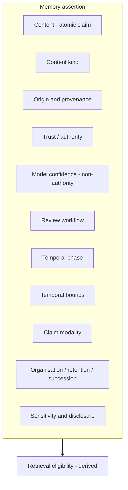
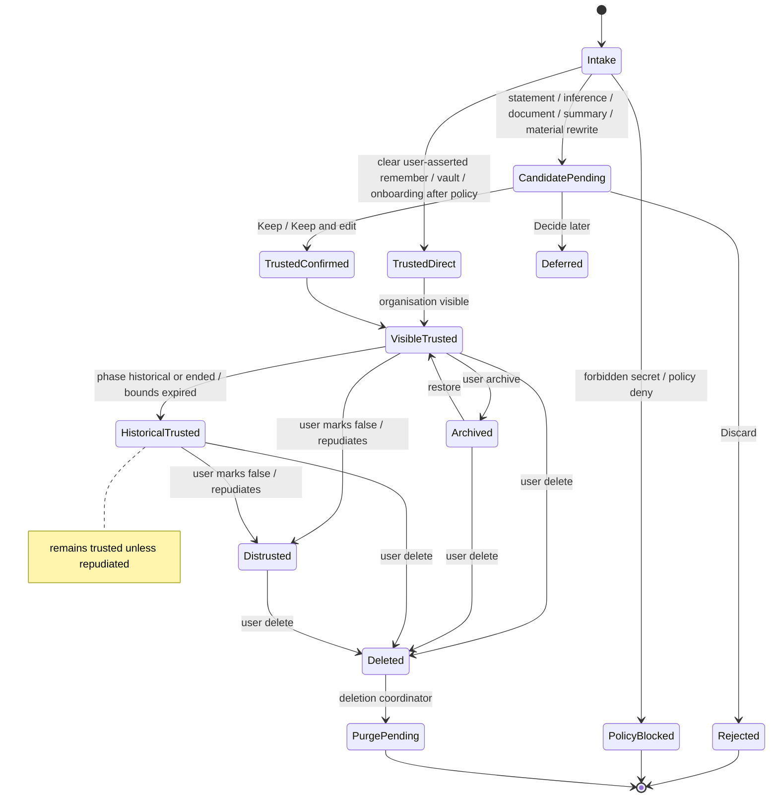
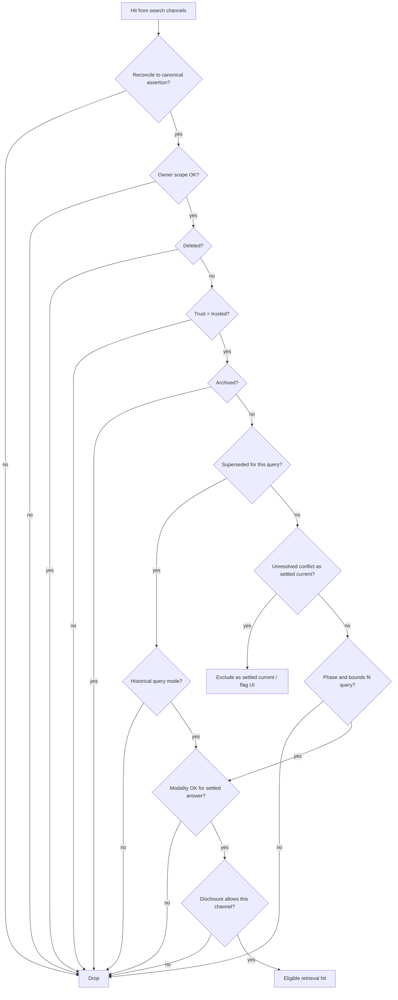
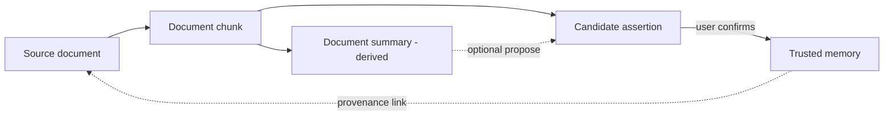
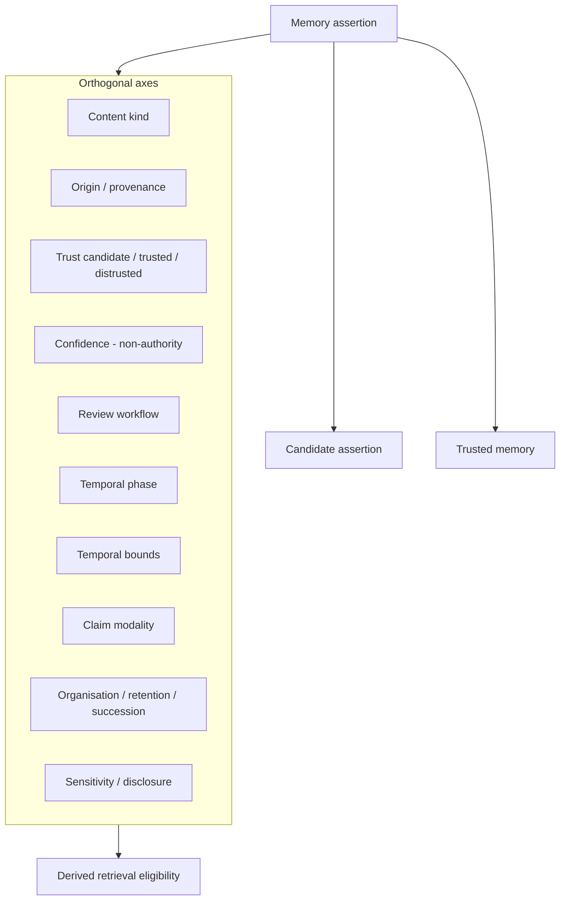
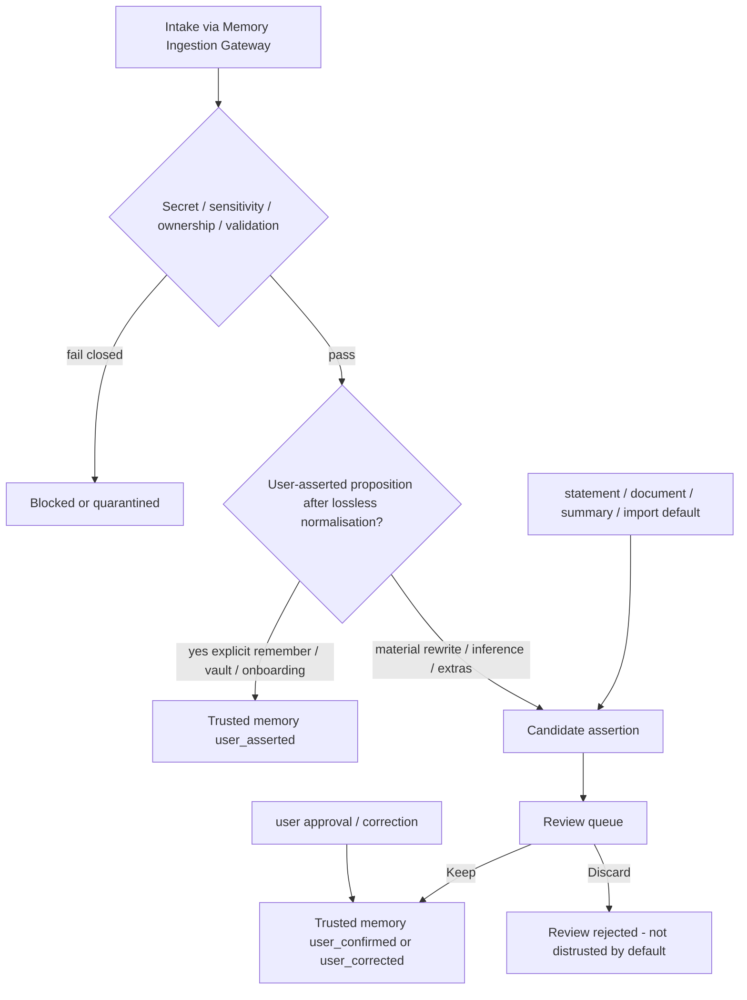
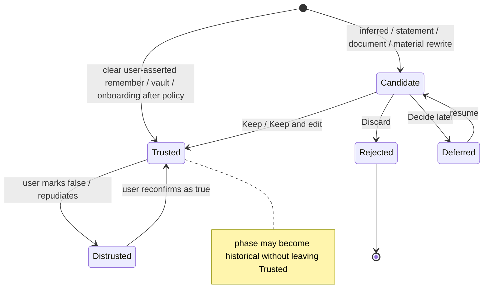
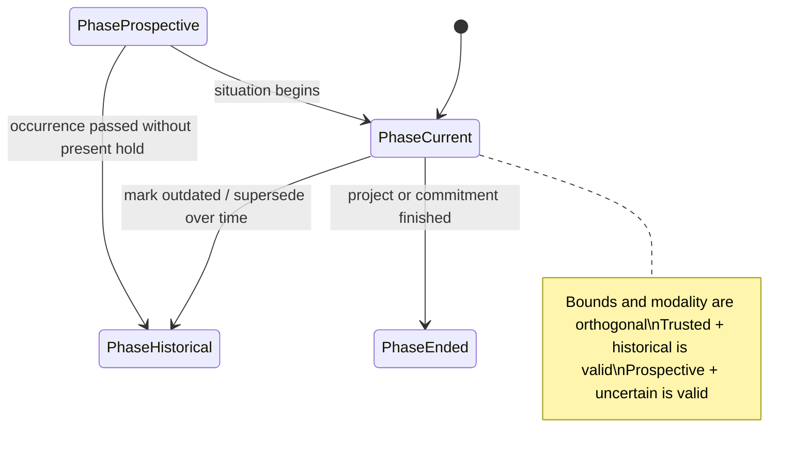

# 08 — Memory Taxonomy, Trust, and Lifecycle

> **Role:** Memory Taxonomy, Trust, and Lifecycle Designer  
> **Scope:** Conceptual target memory model for Cortaix. Documentation only.  
> **Constraints:** No production code, migrations, SQL, APIs, prompts, tests, dependencies, configuration, secrets, or behaviour changes. No implementation roadmap or Stage 9–13 design (tables, algorithms, entity graphs, retrieval weights, framework selection).  
> **Prior docs:** [`00-roadmap.md`](./00-roadmap.md), [`01-repository-map.md`](./01-repository-map.md), [`02-current-memory-flow.md`](./02-current-memory-flow.md), [`03-database-rls-audit.md`](./03-database-rls-audit.md), [`04-extraction-audit.md`](./04-extraction-audit.md), [`05-retrieval-context-audit.md`](./05-retrieval-context-audit.md), [`06-security-failure-audit.md`](./06-security-failure-audit.md), [`07-target-architecture.md`](./07-target-architecture.md).

Stages 1–7 are treated as **complete** even though `00-roadmap.md` status text may lag. Prior reports are **not** edited; factual disagreements are recorded here.

---

## Legend (evidence classes)

| Label | Meaning |
| --- | --- |
| **Verified current behaviour** | Observed in code or Stages 1–7 audits. |
| **Conceptual decision** | Binding Stage 8 choice for later design stages. |
| **User-facing wording** | Language suitable for ordinary users; not internal enum names. |
| **Tradeoff** | Cost accepted to obtain a decision’s benefits. |
| **Assumption** | Reasonable premise not proven by live production metrics. |
| **Deferred decision** | Intentionally left to Stages 9–13 or product/legal. |
| **Unknown** | Cannot be resolved from audits and Stage 7 alone. |

---

## 1. Executive summary

Cortaix’s target conceptual memory model is an **orthogonal multi-dimension model** (Option C). A **memory assertion** is a durable, provenance-bearing claim owned by a user. It may exist as a **candidate assertion** (canonical operational proposal, not yet trusted) or as **trusted memory** (user-authorised). Content kind, origin, trust, model confidence, review workflow, **temporal phase**, **temporal bounds**, **claim modality**, organisational lifecycle, sensitivity/disclosure, and retrieval eligibility are separate dimensions and must not collapse into a single `type` or `status` field.

### Verdict

| Question | Answer |
| --- | --- |
| Primary conceptual model | **Option C — orthogonal dimensions**, with a **current-state projection** for UI and Stage 9 persistence (not pure event-sourcing as the product model) |
| Vocabulary | **Memory assertion** (umbrella) → **candidate assertion** or **trusted memory**; candidates may be canonical application data without being trusted |
| Explicit remember / manual Vault / onboarding | May create **trusted memory** after Gateway policy — **only for propositions the user actually asserted**; material model rewriting becomes a candidate |
| Ordinary chat statements | Enter as **candidate assertions**; phrasing alone never grants trust |
| Inference / documents / uncertain imports | Require **user confirmation** before trust |
| `temporary` | **Not** a content kind — represented via **temporal bounds** / phase, not a kind |
| Temporal model | Split into **phase**, **bounds**, and **claim modality** (not one flat validity enum) |
| `profile` | Split: **identity** content kind + optional **retrieval channel** (Stage 7 already rejected always-include) |
| One flat `status` | **Split** into review, trust, temporal axes, organisation, deletion, and succession/conflict |
| Confidence vs trust | **Separated** — model confidence never equals user confirmation |
| `distrusted` | Narrow: user **repudiated / confirmed false** — not rejection, history, uncertainty, or conflict |
| Stage 7 architecture | **Preserved**; no silent architectural changes |

### Why this stage matters

Stages 2–6 show the product already has useful review UX and RLS isolation, but trust is **phrasing-gated**, `source: manual` overloads four different entry paths, `temporary` does not expire, `superseded` and soft `deleted` have no writers, confidence is stored but unused, and sensitivity does not affect trust or retrieval. Stage 7 assigned exact trust treatment of explicit remember to this stage. This report closes that gap at the **conceptual** layer so Stage 9 can design persistence without inventing product semantics.

---

## 2. Evidence from the current system

### 2.1 Current enums and fields

**Verified current behaviour** (`src/lib/types.ts`, migrations `20260720000001_init.sql`, `20260720000002_memories.sql`):

| Dimension today | Values / fields |
| --- | --- |
| Type | `profile`, `preference`, `semantic`, `episodic`, `project`, `temporary` |
| Status | `active`, `proposed`, `rejected`, `superseded`, `archived`, `deleted` |
| Source | `manual`, `chat_extraction`, `document`, `onboarding`, `import` |
| Other | `confidence`, `is_sensitive`, `expires_at`, `pinned_at`, `source_detail`, `category` |

### 2.2 Trust treatment by path

**Verified current behaviour** (Stages 2, 4; Think route; `POST /api/memories`):

| Path | Status | Source | Confidence | Secret blocking | Review |
| --- | --- | --- | --- | --- | --- |
| Think statement | `active` | `manual` | 1 | Flag only | None |
| Explicit remember | `active` | `manual` | 1 | Flag only | None |
| Manual Vault create | `active` | `manual` | default 1 | Flag via `isSensitive` | None |
| Onboarding facts | `active` via POST | `manual` (not `onboarding`) | 1 | As POST | None |
| Chat/Think extraction | `proposed` | `chat_extraction` | ~0.6–1 | Drop forbidden | Review queue |
| Document upload | No memory row | N/A | N/A | N/A | Chunks only |
| Import source enum | Unused by product writers | — | — | — | — |

`provider.ts` documents the product rule of thumb: *active for trusted manual entries; proposed for anything extracted*.

### 2.3 User-facing surface

**Verified current behaviour** (`ReviewQueue.tsx`, `MemoryCard.tsx`, `Badges.tsx`, vault pages):

- Review queue: Keep (`proposed`→`active`), Discard (`proposed`→`rejected`); sensitive banner says suggestions are never auto-approved.
- Cards show type label, status string, source, sensitive badge; **not** confidence, expiry, pin, or `source_detail`.
- Vault list filters `active` only; detail supports pin, edit, archive, restore, hard delete.
- New memory form hard-codes type `semantic`.
- No UI for `superseded` or soft `deleted`.

### 2.4 Retrieval and validity

**Verified current behaviour** (Stages 3, 5; `match_memories`):

- Semantic retrieval: `status = active`, embedding present, `expires_at` null or future.
- Profile boost: up to 10 active `type=profile`, forced similarity 1.0, **no expiry filter**.
- Confidence, sensitivity, source, pin unused in ranking.
- Proposed / rejected / archived / superseded excluded from `match_memories` by status filter.
- Mem0 hits without `cv_memory_id` may skip canonical reconcile (Stage 5/6 risk).

### 2.5 Correction and supersession

**Verified current behaviour** (Stage 4):

- No supersede writer; enum exists.
- Corrections create new active rows; prior rows remain.
- Exact-content dedupe blocks re-proposal of rejected text.
- Soft `deleted` never set; hard `DELETE` removes rows after provider remove.

### 2.6 Documents

**Verified current behaviour** (Stages 3, 5):

- `documents` / `document_chunks` are separate; upload does not create `source: document` memories.
- Document chunks are a parallel retrieval channel.
- Stage 7: documents are separate canonical sources; not automatically memories.

### 2.7 Stage 7 constraints this model must honour

**Architectural decision** (Stage 7) — preserved here:

1. PostgreSQL canonical for memory semantics, ownership, provenance, lifecycle, application state, operational coordination.
2. External indexes derived and non-authoritative.
3. Every mutation through Memory Ingestion Gateway.
4. LM may propose; may not directly activate/overwrite/delete trusted memory.
5. Ordinary conversational statements cannot become trusted merely by phrasing.
6. Explicit remember cannot bypass ownership, provenance, secret/sensitivity policy, validation, or processing.
7. Exact trust treatment of explicit remember assigned to Stage 8 (**this document decides it**).
8. Non-eligible retrieved memory cannot enter context.
9. Profile is not an unconditional always-included channel.
10. Workspaces cannot broaden personal memory access.
11. Documents ≠ memories by default.
12. Entity/relationship record canonicity deferred to Stage 11.
13. Preserve RLS user isolation.
14. User must understand why something was remembered and why it influenced a response.

---

## 3. Problems with the current taxonomy

| # | Problem | Evidence | Conceptual harm |
| --- | --- | --- | --- |
| 1 | **`temporary` is a type, not a temporal property** | Type alone sets no TTL; expiry optional and unused in UI | Short-lived situations look permanent; no matter/phase/bounds separation |
| 2 | **`profile` mixes kind, retrieval channel, and UI grouping** | Always-include boost; type label “Profile” | Forces identity into every prompt; conflates “who I am” with “always inject” |
| 3 | **`semantic` is overloaded** | Remember hard-codes `semantic`; extractors use it for “knowledge” | Trust path and content meaning share one label |
| 4 | **`episodic` absorbs all Think statements** | Statement → fixed episodic active | Events, identity facts, and commitments collapse |
| 5 | **Projects / decisions / commitments / goals lack distinct kinds** | Only `project` type; no decision/commitment/goal | Ongoing context and commitments treated like generic knowledge |
| 6 | **Relationship facts have no conceptual place** without Stage 11 entities | “My manager is Tasos” → profile/episodic/heuristic | People facts either overfit identity or disappear into semantic |
| 7 | **One `status` merges trust, review, validity, archive, deletion, supersession** | `active` ≈ trusted+current; `proposed` ≈ review; unused `superseded`/`deleted` | Cannot represent “trusted and historical” cleanly |
| 8 | **Confidence confused with trust** | Active paths set confidence 1; extract confidence unused | High model confidence looks like user confirmation |
| 9 | **Sensitivity confused with neither trust nor disclosure** | Flag + review banner; Keep still works; retrieved freely | Sensitive ≠ false; also ≠ “safe to send to providers” |
| 10 | **`source` is not accurate provenance** | Statement/remember/onboarding/Vault all `manual` | Explainability and trust policy cannot distinguish entry modes |
| 11 | **Granularity is unbounded** | Compound statements stored whole | Hard to correct one claim without rewriting many |
| 12 | **Phrasing gates trust** | Stage 4 M1/M2 | Same fact, different authority depending on sentence shape |
| 13 | **No separation of user-asserted content vs model interpretation** | Remember stores route text as trusted with confidence 1 | Explicit intent could later be abused to activate rewritten content |

**Disagreement with README (report only):** README emphasises proposed extraction and non-auto-approval of sensitive suggestions; it understates Think statement/remember **active** writes that bypass extraction secret drop (Stage 4 already noted).

---

## 4. Conceptual-model alternatives

### Option A — Keep the current flat model

Retain one type, one source, one confidence, one sensitivity flag, one status, with minor additions.

| Criterion | Assessment |
| --- | --- |
| Conceptual clarity | Weak — Stage 4/5 problems are structural |
| User understanding | Familiar UI labels, but status meanings already opaque |
| Correction / contradiction | Weak — no room without overloading status |
| Temporal facts | Weak — `temporary` and `expires_at` insufficient |
| Privacy / sensitivity | Weak — no disclosure axis |
| Retrieval safety | Weak — eligibility encoded only as `active` |
| Explainability | Weak — `manual` provenance |
| Migration compatibility | Strong short-term |
| Stage 9 feasibility | Easy schema, hard semantics |
| Over-engineering risk | Low |
| Provider independence | Neutral |

**Verdict:** Reject as primary model. Compatible as a **migration projection** only.

### Option B — Expand the flat taxonomy

Add more types and statuses; keep one-dimensional structure.

| Criterion | Assessment |
| --- | --- |
| Conceptual clarity | Better labels, same collisions (trust vs validity vs archive vs modality) |
| User understanding | Worse — more enums in badges |
| Correction / contradiction | Still forces multi-meaning status |
| Temporal facts | Still type-or-status encoded |
| Privacy | Still one sensitivity bit |
| Retrieval safety | Still “active means eligible” |
| Migration | Moderate |
| Over-engineering | Medium — enum explosion |
| Stage 9 | Tempting but brittle |

**Verdict:** Reject as primary. Some expanded **content kinds** are useful; expanding **status** alone is not.

### Option C — Orthogonal conceptual dimensions

Separate content kind, origin, trust, confidence, temporal phase, temporal bounds, claim modality, lifecycle/organisation, sensitivity/disclosure, review workflow, and derived retrieval eligibility.

| Criterion | Assessment |
| --- | --- |
| Conceptual clarity | Strong — matches audit failure modes |
| User understanding | Strong if UI shows friendly projections, not all axes |
| Correction / contradiction | Strong — representable without detection algorithms |
| Temporal facts | Strong — phase/bounds/modality combinations |
| Privacy | Strong — store vs disclose separable |
| Retrieval safety | Strong — eligibility derived |
| Explainability | Strong — provenance dimension |
| Migration | Requires mapping layer (acceptable) |
| Stage 9 feasibility | Feasible as columns/projections; not event-sourcing required |
| Over-engineering | Risk if every axis becomes a user-visible control |
| Provider independence | Strong — providers never define axes |

**Verdict:** **Select as primary conceptual model**, with UI and Stage 9 using **projections** so users never manage all raw axes.

### Option D — Event-only memory history

All changes as immutable events; current memory as a fold over events.

| Criterion | Assessment |
| --- | --- |
| Conceptual clarity | Strong for provenance/audit |
| User understanding | Weak as primary product object |
| Correction / contradiction | Strong historically |
| Temporal facts | Strong |
| Retrieval safety | Requires materialised current state anyway |
| Migration | Hard from row-centric schema |
| Stage 9 feasibility | Heavy without evidence of need |
| Over-engineering | High for current product scale (Stage 7 P18) |
| Provider independence | Neutral |

**Verdict:** Reject as **primary product model**. **Adopt as a supporting idea:** conceptual versioning/provenance history must exist; Stage 9 may store append-only mutation events **behind** a materialised current projection. Users interact with assertions and trusted memories, not raw event streams.

### Selection

**Conceptual decision:** **Option C primary**, with **materialised current-state projection** and **provenance/version history** inspired by Option D’s strengths without making event-sourcing the user model.

**Tradeoff:** Stage 9 must design a clear projection (and possibly fewer physical columns than conceptual axes). Accepted to fix trust/validity/status collisions.

---

## 5. Selected conceptual model

### 5.1 Vocabulary (binding)

| Term | Meaning |
| --- | --- |
| **Memory assertion** | Umbrella: a durable conceptual claim with content and provenance under PostgreSQL authority |
| **Candidate assertion** | A durable **canonical operational proposal** awaiting review or otherwise lacking user authority; **not** trusted user memory; **not** retrieval-eligible as trusted memory |
| **Trusted memory** | A memory assertion granted **user authority** through explicit user assertion (after policy), user confirmation, or user correction |
| **Canonical (application data)** | Stored under PostgreSQL authority. Candidate assertions **are** canonical operational data; that does **not** make them trusted memories |
| **Derived** | Rebuildable indexes, embeddings, summaries, external replicas — never authority for trust |

**Conceptual decision:** Whether candidates and trusted memories share one physical table or use separate proposal records is **Deferred** to Stage 9. Conceptually they share the assertion umbrella and differ by trust/review position.

### 5.2 Dimension diagram



### 5.3 Core idea

A **memory assertion** carries:

1. **Content** — what is claimed  
2. **Kind** — what sort of personal information it is  
3. **Origin / provenance** — how and from where it entered; whether content is user-authored or system-interpreted  
4. **Trust** — whether it is a candidate assertion, trusted memory, or repudiated (`distrusted`)  
5. **Confidence** — optional quality signal about *interpretation*, never authority  
6. **Review state** — pending/accepted/rejected/deferred for candidates  
7. **Temporal phase** — prospective / current / historical / ended  
8. **Temporal bounds** — unbounded, interval-bounded, event-anchored, expiry-ruled  
9. **Claim modality** — asserted, uncertain, conditional, hypothetical, planned  
10. **Lifecycle / organisation** — visible, archived, deleted, retention, succession/conflict  
11. **Sensitivity / disclosure** — store/retrieve/show/send permissions  
12. **Retrieval eligibility** — **derived** from the above + policy, never an independent authority  

**Assumption:** Ordinary users primarily see a small projection: content, friendly kind, “Suggested / Saved / Hidden / Outdated”, sensitivity cue, and simple actions. Internal axes stay internal.

---

## 6. Definition of a memory assertion

**Conceptual decision:**

> A **memory assertion** is a durable, user-owned, policy-validated **atomic claim** that Cortaix stores under PostgreSQL authority, with structured provenance and explicit positions on trust, review, temporal, and lifecycle axes.

It is **not** automatically trusted memory. Trust is a separate position.

### Forms

| Form | Is canonical application data? | Is trusted user memory? | Default retrieval as memory? |
| --- | --- | --- | --- |
| Candidate assertion | Yes (operational proposal) | No | No |
| Trusted memory | Yes | Yes | Yes, if other eligibility axes allow |
| Repudiated (`distrusted`) assertion | Yes (history/provenance) | No — user confirmed false/repudiated | No as truth |

### Qualifies as a memory assertion

- A fact, preference, instruction, goal, commitment, decision, event, relationship fact, project context statement, or intentional knowledge the system may retain about the user.
- A proposed interpretation of chat, documents, or imports (as a **candidate**).
- A user-confirmed interpretation (as **trusted memory**).
- A correction that replaces, historically bounds, or repudiates a prior assertion.

### Does not qualify as a memory assertion (by itself)

| Thing | Why not |
| --- | --- |
| Raw chat message | Conversation record; may *source* candidates |
| Assistant reply | Conversation record |
| Uploaded document / chunk | Document source / extract; Stage 7 |
| Embedding / Mem0 hit | Derived index |
| Retrieval score / context package | Ephemeral or explainability snapshot |
| System-generated rolling summary | **Derived** unless user promotes it to an assertion |
| Profile `display_name` / persona fields | Account identity settings (may seed identity assertions separately) |
| Workspace membership | Access scope, not memory content |

### Atomicity principle

Prefer **one primary claim per assertion**. Compound inputs may produce multiple candidates. Summaries are derived unless explicitly confirmed. See §20.

---

## 7. Memory-content taxonomy

### 7.1 First-class content kinds

| Kind | Meaning | Examples | Notes |
| --- | --- | --- | --- |
| **identity** | Who the user is; relatively stable personal facts | Name, home city, role, languages | Replaces most uses of `profile` as a *kind* |
| **preference** | How the user likes things done; habits and taste | Tone, tools, dietary habits | Includes habit / working style |
| **instruction** | How the assistant should behave | “Always answer in Greek”; project style rules | Distinct from taste when it is a directive |
| **goal** | Intention or desired outcome | “I want to ship Atlas by Q3” | Not yet a commitment |
| **commitment** | Promise or obligation | “I’ll send the draft Friday” | Stronger than goal |
| **decision** | Chosen course among alternatives | “We decided on a modular monolith” | May be project-scoped |
| **project_context** | Ongoing work situation or project framing | “Project Atlas uses American English” | Scope label ≠ access grant |
| **event** | Something that happened or is scheduled as an occurrence | Meeting, flight, past trip | Replaces overloaded `episodic` |
| **relationship_fact** | A fact involving another person or role | “My manager is Tasos” | Conceptual kind only; **no** Stage 11 entity schema |
| **knowledge** | Intentional general or reference knowledge the user wants stored | Notes, definitions, bookmarks-as-facts | Narrowed successor of `semantic` |

### 7.2 Grouped rather than first-class

| Area | Treatment |
| --- | --- |
| Habit / working style | Under **preference** |
| Temporary situation | **Temporal bounds** (bounded interval / expiry), not a kind |
| Future uncertainty (“I might…”) | **Claim modality = uncertain** (and often phase = prospective); usually a candidate |
| Procedure for the assistant | **instruction** |
| Profile as UI bucket | Projection/filter over **identity** (+ maybe preferences), not a kind |
| “Semantic memory” as cognitive science term | Avoid as product kind — too broad |

### 7.3 Relationship facts without Stage 11

**Conceptual decision:** Relationship information may be remembered as ordinary assertions of kind **relationship_fact**. Stage 11 may later attach entity/edge records. Stage 8 does **not** define entity resolution, edge tables, or graph canonicity.

**Deferred decision:** Whether relationship_fact memories eventually *require* linked entity records — Stage 11.

### 7.4 Projects, decisions, commitments

**Conceptual decision:** These are first-class kinds because correction, phase, and retrieval needs differ:

- A **decision** may remain **trusted** and **historically true** after a project ends.
- A **commitment** may move to phase `ended` without becoming `distrusted`.
- **project_context** may end when a project ends without deleting historical decisions.

Scope tags (project labels) are **relevance**, not ownership.

---

## 8. Origin and provenance model

### 8.1 Origin classes

Origin describes **how information entered**, not whether it is true.

| Origin class | Meaning |
| --- | --- |
| `explicit_remember` | User issued a remember command / equivalent explicit retain intent |
| `manual_vault` | User created or edited via Vault UI/API as deliberate memory authoring |
| `onboarding` | Captured during onboarding as user-provided starter facts |
| `conversational_statement` | Ordinary first-person chat content without explicit remember |
| `conversational_inference` | Model/heuristic interpretation of chat (not verbatim user assertion framing) |
| `user_correction` | User corrected prior assertion content, phase, or truth |
| `user_approval` | User approved a candidate (Keep / Keep after edit) |
| `document_candidate` | Derived from a document as a proposed assertion |
| `import` | Brought in from an external export/integration package |
| `integration` | Future external system push/pull |
| `system_summary` | System-generated summary or rollup |
| `model_interpretation` | LM rewrite/normalisation applied during processing |
| `heuristic_interpretation` | Deterministic heuristic interpretation |

Multiple provenance facets may apply (e.g. inference + later user_approval).

### 8.2 Provenance required for explainability

**Conceptual decision** — every durable assertion mutation carries enough provenance to answer:

1. Who owns it (`user_id`)  
2. What intake path created or changed it  
3. Which source artifact(s) support it (message, document, import batch, prior assertion) when available  
4. Whether content is **user-authored** vs **system-interpreted / expanded**  
5. Whether any transformation was treated as **lossless normalisation** vs **material rewrite** (conceptual mark; detection **Deferred** Stage 10)  
6. Which policy/version gates ran (secret/sensitivity) at a conceptual level  
7. What actor performed confirmation/rejection/correction/repudiation (user vs system)  
8. What prior assertion version or conflicting candidate is related  

**Do not** choose DB columns here (**Deferred** Stage 9).

**Invariant:** Origin never alone grants trust. Trust policy uses origin as an *input*, not as truth.

### 8.3 Explicit authority and interpretation (binding)

**Conceptual decision — user authority survival rule:**

1. Explicit remember, manual Vault creation, and onboarding grant user authority **only to propositions the user actually asserted**.  
2. **Lossless deterministic normalisation** (whitespace, trivial casing, punctuation cleanup that does not change meaning) may preserve direct trust.  
3. **Material semantic rewriting**, inferred details, assumed scope, inferred relationships, or model-generated decomposition **do not** automatically inherit user authority.  
4. Such interpreted or expanded claims become **candidate assertions** requiring confirmation.  
5. A model may **propose** content kind, scope, or atomic splitting, but may not use the user’s explicit remember intent to activate content the user did not clearly assert.  
6. **Model confidence does not alter this rule.**  
7. Exact detection of lossless versus material transformation remains **Deferred** to Stage 10.

Clear atomic example that remains instant-save after policy: “Remember that I live in Athens.”

---

## 9. Trust and authority model

### 9.1 Trust is not confidence

| Concept | Meaning |
| --- | --- |
| **Trust / authority** | Entitlement for Cortaix to treat the assertion as the user’s authorised personal memory |
| **Model confidence** | Estimator of interpretation quality; non-authoritative |

**Conceptual decision:** Language-model confidence must **never** be treated as equivalent to user confirmation (Stage 7 P4; Stage 4).

### 9.2 Trust positions

| Trust position | Meaning | Notes |
| --- | --- | --- |
| **candidate** | Durable proposal; not user-authorised memory | Review outcome lives on the **review** axis (`pending` / `rejected` / …), not here as “distrusted” |
| **trusted** | User-authorised memory (after policy / confirmation / correction) | May be current **or** historical; phase changes do **not** silently remove trust |
| **distrusted** | User **explicitly repudiated** the assertion or confirmed it as **false** | Narrow; not rejection, not history, not uncertainty, not unresolved conflict |

**Conceptual decision:** A rejected candidate is a **review outcome** on a candidate assertion. It is **not** automatically a `distrusted` trusted memory.

**Conceptual decision:** Validity / phase / modality changes do **not** silently modify trust. Moving a trusted employment fact to `historical` keeps it **trusted** as historical information unless the user repudiates it.

### 9.3 Authority sources (why trusted)

| Authority source | Meaning |
| --- | --- |
| `user_asserted` | Direct user assert via explicit remember, manual Vault create, or onboarding — **limited to user-asserted propositions** after policy (§8.3) |
| `user_confirmed` | User approved or edited-and-kept a candidate |
| `user_corrected` | User correction established the new trusted assertion |
| *(none)* | Candidates, system summaries without confirmation, material model expansions |

**Conceptual decision:** No provider, embedding score, or external index may grant canonical trust (Stage 7).

### 9.4 Trust entry decisions

| # | Question | Decision |
| --- | --- | --- |
| 1 | Explicit remember (“Remember that I live in Athens”) | **May become trusted immediately** after Gateway policy **for the user-asserted proposition**; material rewrite/expansion → candidate (§8.3) |
| 2 | Manual Vault creation | **Equivalent** for trust to explicit remember — deliberate authoring of user-asserted content; expansions still candidates |
| 3 | Onboarding statements | **Trusted user assertions** after the same policy gates, for what the user actually entered |
| 4 | Ordinary “I live in Athens.” | **Candidate assertion** by default — not trusted from phrasing alone; classifiers may route UX but **must not** be the trust gate (Stage 7 M1) |
| 5 | Inferred facts | **Never** auto-trusted; require user confirmation |
| 6 | Document-derived | **Never** trusted without user confirmation |
| 7 | Import | **Default candidate**; may become trusted only if the import package carries an explicit prior user-confirmation claim **and** local policy re-validates — details **Deferred** Stage 9/10 |
| 8 | User editing/confirming | Raises authority to `user_confirmed` / `user_corrected`; can promote candidate → trusted |
| 9 | Can trusted become uncertain? | **Modality** may become uncertain without changing trust; retrieval as settled current fact may be suppressed. Trust drops to `distrusted` only on explicit repudiation / confirmed false |
| 10 | Always requires review | Inferences; document candidates; system summaries; material expansions of explicit remember; third-party personal data of concern; unresolved contradictions needing user choice; optional high-sensitivity confirm (**Deferred** product/Stage 10) |

### 9.5 What must never be auto-trusted

- Forbidden secrets (must not become trusted memory; prefer block/quarantine).
- Ordinary conversational phrasing alone.
- Pure model/heuristic inference.
- Materially rewritten or expanded content under an explicit-remember umbrella.
- Document text merely because it was uploaded.
- External index hits.
- System summaries.
- Third-party intimate identifiers without explicit user confirmation and policy allow (**Assumption** aligned with Stage 6 privacy posture).

---

## 10. Confidence model

**Conceptual decision:**

1. Confidence is an **interpretation quality signal** attached to candidates and optionally retained after confirmation for analytics/explainability.
2. Confidence **does not** set trust, does not alone set retrieval eligibility, does not override user confirmation, and **does not** allow interpreted expansions to inherit explicit-remember authority (§8.3).
3. Explicit remember / manual create of user-authored content use confidence only as a neutral default (e.g. “not applicable / user-authored”), not as proof.
4. Ranking use of confidence is **Deferred** to Stage 12; formulas **Deferred** to Stage 10.

**User-facing wording:** Prefer not to show raw 0–1 scores. Prefer “Suggested from your chat” vs “You saved this.”

---

## 11. Review workflow

### 11.1 When items appear in review

**Conceptual decision:** Review is required when trust cannot be granted by a deliberate user-assertion path after policy, or when policy/conflict/interpretation rules require human judgment:

- Conversational statements (default)
- Conversational inferences
- Document candidates
- System summaries proposed as memory assertions
- Imports lacking trustworthy confirmation claims
- **Material interpretations / expansions** of explicit remember / Vault / onboarding content
- Conflicts/contradictions needing user choice
- Re-proposals that relate to previously rejected content (exact duplicate blocking may continue; semantic re-proposal rules **Deferred** Stage 10)
- Optional: high-sensitivity content even on explicit paths if product policy chooses confirmation (**Deferred** product/Stage 10)

### 11.2 User actions (keep simple)

| Action | Conceptual effect | User-facing wording |
| --- | --- | --- |
| Keep | Candidate assertion → trusted memory (`user_confirmed`) | **Keep** |
| Keep after editing | Edit content/kind/phase/bounds/modality as needed → trusted memory | **Keep & edit** |
| Reject | Review outcome `rejected` on a candidate; not retrieved as trusted memory; **not** automatically `distrusted` | **Discard** |
| Merge with existing | Candidate absorbed into existing trusted memory with provenance | **Merge** (advanced; can ship later) |
| Correct existing | Opens correction of a trusted memory; candidate may supply the correction | **Fix existing** |
| Mark outdated | Trusted memory phase → historical / ended as appropriate; **trust retained** unless user repudiates | **Mark as outdated** |
| Resolve contradiction | User chooses current truth, coexistence with scopes, repudiation, or defer | **Choose what’s true** |
| Delay | Leave review `deferred` | **Decide later** |
| Delete candidate | Remove candidate artifact (stronger than discard if product distinguishes) | **Delete suggestion** |
| Mark false / repudiate | Trusted or candidate assertion → trust `distrusted` (narrow) | **This isn’t true** |

**Tradeoff:** Merge/contradiction UI can be phased; Keep/Discard/Edit must remain first-class (current UX strength).

### 11.3 Review vs other axes

| Concept | Distinct meaning |
| --- | --- |
| Review rejection | User declined a **candidate**; review axis terminal |
| Distrust | User says an assertion is **false** / repudiated |
| Historical / ended / expired bounds | Temporal axes; trusted may remain |
| Archive | Organisation hide-without-delete |
| Delete | Retention removal workflow |
| Conflict open | Succession/conflict axis; may suppress current retrieval without erasing trust |

---

## 12. Temporal model (phase, bounds, modality)

**Conceptual decision:** Do **not** treat `current`, `historical`, `temporary_bounded`, `scheduled`, `timeless`, `uncertain`, `expired`, and `ended` as one mutually exclusive axis. Split into at least three orthogonal dimensions.

### 12.1 Time concepts (metadata)

| Concept | Meaning |
| --- | --- |
| **Event time** | When the real-world situation occurred or occurs |
| **Learned time** | When Cortaix ingested the assertion |
| **Valid interval** | Interval during which the assertion applies as present truth, if bounded |
| **Expiry rule** | Rule after which current applicability ends automatically |
| **Historical usefulness** | Whether a non-current assertion may still help as past context |

Exact timestamps and physical encoding **Deferred** Stage 9.

### 12.2 Temporal phase

Whether the assertion applies prospectively, currently, historically, or has ended.

| Phase | Meaning | Example |
| --- | --- | --- |
| **prospective** | Applies to the future | Upcoming flight; possible future move |
| **current** | Applies now | “I live in Athens.” |
| **historical** | Applies to the past; not present | “I used to live in London.”; past employment |
| **ended** | Situation/project/commitment finished | Ended project context |

Phase is independent of trust: a historical employment fact may remain **trusted**.

### 12.3 Temporal bounds

How time limits the assertion’s applicability.

| Bounds | Meaning | Example |
| --- | --- | --- |
| **unbounded** | No expected automatic end | Standing preference; name |
| **interval_bounded** | Valid over a known or stated interval | “Staying in Mykonos until September.” |
| **event_anchored** | Anchored to a specific occurrence time | “Flight tomorrow at 18:00.” |
| **expiry_ruled** | Governed by an expiry rule (may be system or user-set) | Short-lived note with expiry |

“Expired” is a **derived or transitioned state of bounds/phase** (interval ended; occurrence passed), not a separate content kind and not distrust.

### 12.4 Claim modality

How the user presents the epistemic status of the claim.

| Modality | Meaning | Example |
| --- | --- | --- |
| **asserted** | Presented as a fact/preference/instruction | “I live in Athens.” |
| **uncertain** | Hedged / not sure | “I might move next year.” |
| **conditional** | Depends on a condition | “If I take the job, I’ll relocate.” |
| **hypothetical** | Speculative framing | “Suppose I lived in Lisbon…” |
| **planned** | Intention/plan without full certainty of occurrence | “I’m planning to travel next week.” |

Modality is **not** trust and **not** distrust. Uncertain content often remains a **candidate** until confirmed, but a user may also confirm an uncertain plan as trusted-with-modality-uncertain.

### 12.5 Combination examples

| Scenario | Phase | Bounds | Modality | Typical trust |
| --- | --- | --- | --- | --- |
| Current unbounded preference | current | unbounded | asserted | Trusted if remember/Vault/onboarding/Keep |
| Current bounded stay | current | interval_bounded | asserted | Per path |
| Future event with scheduled time | prospective | event_anchored | asserted or planned | Per path |
| Future uncertain possible move | prospective | unbounded or interval_bounded | uncertain | Usually candidate |
| Historical but still trusted employment | historical | unbounded or interval_bounded | asserted | Trusted (historical) |
| Ended project; decisions remain historically true | project_context → ended; decisions → historical (or current if still binding) | as applicable | asserted | Trusted unless repudiated |

### 12.6 Statement mappings

| Statement | Phase | Bounds | Modality |
| --- | --- | --- | --- |
| “I live in Athens.” | current | unbounded | asserted |
| “I used to live in London.” | historical | unbounded (past residence) | asserted |
| “I am staying in Mykonos until September.” | current | interval_bounded | asserted |
| “My flight is tomorrow at 18:00.” | prospective → later historical | event_anchored | asserted / planned |
| “I normally avoid dairy.” | current | unbounded | asserted |
| “For this project, use British English.” | current while project active; project may later end | unbounded within project scope | asserted |
| “I no longer work at Company A.” | prior employment → historical; may update current role | as applicable | asserted |
| “I might move next year.” | prospective | unbounded | uncertain |

### 12.7 Temporary is not a kind

**Conceptual decision:** Deprecate `temporary` as a content kind. Represent short-lived situations via **temporal bounds** (interval_bounded / event_anchored / expiry_ruled) and phase transitions. Retain `temporary` only for migration compatibility mapping.

**User-facing wording:** “Temporary”, “Until …”, “Past”, “Not sure yet”, “Planned” — not internal enum names.

---

## 13. Lifecycle model

### 13.1 Separate axes (not one flat status)

| Axis | Positions (conceptual) | Purpose |
| --- | --- | --- |
| **Review** | `none` (direct trusted path), `pending`, `accepted`, `rejected`, `deferred` | Candidate workflow |
| **Trust** | `candidate`, `trusted`, `distrusted` | Authority (§9.2) |
| **Temporal phase** | prospective / current / historical / ended | §12.2 |
| **Temporal bounds** | unbounded / interval_bounded / event_anchored / expiry_ruled (+ derived expired) | §12.3 |
| **Claim modality** | asserted / uncertain / conditional / hypothetical / planned | §12.4 |
| **Organisation** | `visible`, `archived` | User hide-without-delete |
| **Retention** | `present`, `deleted`, `purge_pending` | Deletion coordinator (Stage 7) |
| **Succession / conflict** | `head`, `superseded`, `merged_into`, `conflict_open` | Version / conflict relation |

**Conceptual decision:** One flat lifecycle enum is **insufficient**. Stage 9 may still store a **projection status** for migration/UI compatibility, but semantics are multi-axis.

### 13.2 Clarified meanings

| Term | Meaning | Not the same as |
| --- | --- | --- |
| **Rejected** | User declined a **candidate** (review outcome) | Distrusted; expired; archived; deleted |
| **Distrusted** | User repudiated / confirmed false | Rejected candidate; historical; uncertain modality; conflict_open |
| **Superseded** | Replaced by a newer assertion for the same claim/scope | Merely archived; merely phase=historical |
| **Historical / ended** | Temporal phase; may remain **trusted** | Rejected; distrusted; deleted |
| **Expired** | Bounds window ended / occurrence passed; phase typically historical or ended | Rejected; distrusted |
| **Archived** | User hid from default browsing; not deleted | Deleted; rejected |
| **Deleted** | Retention removal; never retrieval-eligible; deletion workflow tracks derived cleanup | Archive |
| **Corrected** | New trusted assertion (or phase/bounds change) by user fix; prior remains in provenance | Silent overwrite without history |
| **Conflicted (`conflict_open`)** | Unresolved disagreement; may suppress current retrieval **without** erasing trust | Distrusted; superseded (resolved) |
| **Merged** | Candidate or duplicate absorbed into another assertion with provenance | Deleted without link |

### 13.3 Lifecycle narrative (intake → terminal)



### 13.4 User-facing lifecycle language

| Internal concept | User-facing wording |
| --- | --- |
| Candidate pending | **Suggested** |
| Trusted visible | **Saved** |
| Archived | **Hidden** |
| Historical / ended / expired bounds | **Outdated** / **Past** (with optional “kept for history”) |
| Rejected candidate | **Discarded** |
| Distrusted | **Marked as not true** |
| Deleted | **Deleted** |
| Conflict open | **Needs your decision** |
| Uncertain modality | **Not sure / possible** |
| Policy blocked secret | **Can’t save that (looks like a secret)** |

---

## 14. Sensitivity and disclosure model

### 14.1 Classes of content (conceptual)

| Class | Examples | Default posture |
| --- | --- | --- |
| **Forbidden secrets** | Passwords, API keys, recovery codes, auth tokens | Must not become trusted memory; block or quarantine |
| **Highly sensitive useful** | Health, financial, legal, intimate, precise identity docs | May store if policy allows; disclosure tightly controlled; often review |
| **Third-party personal** | Friend’s passport number | Strong caution; usually block or require explicit confirmation + purpose limit |
| **Ordinary personal** | Preferences, public-ish identity facts | Normal trust paths apply |
| **Provider-restricted** | Allowed to store locally; must not send to some providers | Store ≠ disclose |

Detection algorithms **Deferred** Stage 10.

### 14.2 Separate permission questions

| Permission | Meaning |
| --- | --- |
| May be stored | Survives Gateway as durable candidate assertion or trusted memory |
| May become trusted | Eligible for trust promotion under §9 |
| May be retrieved | Eligible under §15 |
| May be shown to user | Vault/review visibility (almost always yes for owner) |
| May be sent to inference provider | Disclosure policy |
| May be sent to embedding provider | Disclosure policy (may differ) |
| May be copied to external memory index | Disclosure + derived-index policy |

**Conceptual decision:** Sensitivity does **not** imply falsity or low trust. A sensitive trusted preference may be true and confirmed while still withheld from some providers.

**Conceptual decision:** Storage permission and external-provider disclosure permission are **separate** (Stage 7 P13).

---

## 15. Retrieval-eligibility model

Eligibility is **derived**, never an independent authority.

### 15.1 Conceptual gate (must pass)

A memory assertion may become a retrieval **hit** for assistant context only if all hold:

1. **Ownership scope** matches the requesting user (RLS / explicit scope).  
2. **Trust** is `trusted` (candidate assertions, rejected review outcomes, and `distrusted` excluded as trusted truth).  
3. **Retention** is not deleted / purge-pending.  
4. **Organisation** allows retrieval (archived default: **not** eligible for assistant context — **Conceptual decision**).  
5. **Temporal phase / bounds** fit the query mode:
   - Current-state questions → phase `current` (and in-window bounds); not historical/ended as if present  
   - Prospective questions → phase `prospective` when relevant  
   - Historical questions → may include `historical` / `ended` / expired bounds when relevant  
6. **Claim modality**: uncertain/hypothetical/conditional claims must not be presented as settled asserted current facts unless the query asks for possibilities/plans (**Conceptual decision**).  
7. **Succession**: `superseded` head-replaced assertions are **not** eligible as current answers; may be historical context when asked.  
8. **Conflict**: unresolved `conflict_open` does **not** enter as settled simultaneous current facts; may surface as “needs decision” metadata. Conflict may suppress current retrieval **without** changing trust to `distrusted`.  
9. **Sensitivity / disclosure**: model-context retrieval requires disclosure permission; user UI follows show permission.  
10. **Canonical reconcile**: external index hits must map to an eligible trusted memory (Stage 7). Stale hits for deleted/candidate/distrusted rows drop.  
11. **Pin / project scope**: may boost or filter relevance later; pin does not bypass trust/temporal rules; project labels do not grant cross-user access.  

Ranking weights/thresholds **Deferred** Stage 12.



---

## 16. Explicit remember and manual creation treatment

**Conceptual decision** (closes Stage 7 deferred item; refined by §8.3):

| Path | After Gateway policy | Trust | Review | User ack |
| --- | --- | --- | --- | --- |
| Explicit remember of a clear user-asserted atomic proposition | Ownership, secret, sensitivity, validation, processing required — **no bypass** | **Trusted memory** (`user_asserted`) if policy allows | Not required for that clear assertion | Synchronous durable acknowledgement (“Saved”) |
| Explicit remember + material model rewrite/expansion/split extras | Same policy | Extras are **candidate assertions**; only clear user-asserted core may trust | Yes for interpreted extras | Ack may note saved core + suggestions |
| Manual Vault create of user-entered content | Same | **Trusted** for entered content | Not required | Success = saved |
| Onboarding user-entered assertions | Same | **Trusted** for entered content | Not required | Saved with onboarding |

**Tradeoff:** Instant remember UX preserved for clear atomic assertions such as “Remember that I live in Athens.”; safety preserved by mandatory Gateway policy and by refusing to let interpretation inherit authority.

Forbidden secrets: **not** trusted; user sees clear refusal. Highly sensitive content: may still be trusted if allowed, with disclosure restrictions and clear UI marking.

---

## 17. Ordinary conversational-statement treatment

**Conceptual decision:**

1. Ordinary first-person statements default to **candidate assertions** (trust `candidate`, review `pending`).
2. Intent/phrasing classifiers may improve UX (e.g. suggest “Save this?”) but **must not** grant trust.
3. Inferences extracted from Q&A/chat remain candidates until Keep.
4. Hedged language should bias toward **claim modality = uncertain** (and often phase = prospective) and never auto-trust as settled fact.
5. User may later promote via review or an explicit remember that references the same claim (dedupe/conflict **Deferred** Stage 10).

This satisfies Stage 7 decisions 5 and 7 and audit requirements M1/M2.

---

## 18. Document-derived memory treatment



**Conceptual decision:**

| Artifact | Class |
| --- | --- |
| Source document | Canonical source object (bytes + PG metadata) — **not** a memory assertion |
| Document chunk | Canonical extracted text under document authority — **not** a memory assertion |
| Document summary | **Derived** unless user promotes |
| Extracted candidate | **Candidate assertion** with `document_candidate` origin — canonical operational data, not trusted memory |
| User-confirmed memory from doc | **Trusted memory** with provenance to document/chunk |
| Intentional knowledge typed by user | Trusted or candidate assertion of kind `knowledge` — independent of documents |
| Project context | Content kind / scope — not automatic from filename |

Deleting or updating a document must **not** produce undefined assertion behaviour: trusted memories retain provenance links; cascade rules **Deferred** Stage 9. Confirmed memories do not silently vanish solely because a file was removed — **Assumption** pending Stage 9 product choice, but behaviour must be **defined**, not undefined.

---

## 19. Correction, contradiction, and supersession semantics

### 19.1 Situation meanings

| Situation | Model meaning |
| --- | --- |
| Edit wording of same assertion | Same logical assertion; content revision with provenance; trust retained if user-authored edit that does not invent new claims |
| Correct a false memory | Prior assertion may become `distrusted` and/or `superseded`; new trusted assertion (`user_corrected`); prior kept in provenance; prior ineligible as trusted truth |
| Fact changed over time | Prior → phase `historical` / succession `superseded`; **trust may remain** on the historical record; new `current` head trusted |
| Reverse a preference | New current preference supersedes old; old historical (still trusted as past preference unless repudiated) |
| Add historical information | Create historical-phase assertion without changing current head |
| Two sources disagree | `conflict_open` until user resolves; do not silently pick model side; trust not auto-erased |
| User contradicts inferred candidate | Candidate rejected or corrected; inferred never outranks user |
| User contradicts confirmed memory | User correction wins; prior version retained in provenance; may be `distrusted` if marked false, or historical if time-changed |
| Context-specific truths | Coexist when scopes differ — **not** contradictions |
| Ambiguous corrections | Remain `conflict_open` or candidate until clarified |
| Explicit remember with model-added details | Core user-asserted proposition may trust; added details are candidates (§8.3) |

### 19.2 Core decisions

| # | Decision |
| --- | --- |
| 1 | Memory assertions are **versioned conceptually** — not silently overwritten without history |
| 2 | Previous versions remain available for provenance/explainability |
| 3 | Superseded / non-current assertions are **not** eligible as current answers; may be historical context when relevant; may remain **trusted** historically |
| 4 | Unresolved contradictions do **not** enter context as settled dual current facts; conflict ≠ automatic distrust |
| 5 | User-confirmed information outranks unsupported inference |
| 6 | Correction ≠ deletion — correction preserves history; deletion removes eligibility and starts retention workflow |
| 7 | Context-specific facts may coexist without being contradictions |
| 8 | Phase/bounds/modality changes do **not** silently change trust |
| 9 | A corrected false assertion may remain in provenance while ineligible as trusted current or historical truth (`distrusted` and/or superseded) |

Conflict **detection algorithms** Deferred Stage 10.

```mermaid
sequenceDiagram
  participant U as User
  participant MIG as Ingestion Gateway
  participant CMS as Canonical Store
  participant R as Review

  U->>MIG: "Actually, I moved to Athens last month."
  MIG->>MIG: Policy + normalize + provenance + authority survival check
  alt Explicit remember / vault correction of clear user assertion
    MIG->>CMS: Create trusted current identity fact
    MIG->>CMS: Prior residence phase=historical succession=superseded trust retained
  else Ordinary statement / inference / material rewrite
    MIG->>CMS: Store candidate assertion linked to prior
    MIG->>R: Surface correction / conflict review
    U->>R: Confirm new current fact
    R->>CMS: Promote candidate; supersede prior
  end
```

---

## 20. Memory granularity

### 20.1 Principles

**Conceptual decision:**

1. Prefer **atomic assertions** as the unit of memory.  
2. One user input **may** produce several candidate assertions when claims are independent.  
3. Several tightly bound facets of one claim may remain one assertion when splitting would harm meaning (e.g. “flight tomorrow at 18:00 to Chania”).  
4. **Narrative episodes** may be one `event` if they are one occurrence; multi-day stories should not smuggle unrelated preferences.  
5. **Project summaries** and **rolling summaries** are **derived** by default; become trusted memory only if user confirms.  
6. **Lists of preferences** should usually split into separate preference assertions for correction.  
7. **Instructions** should be separate from descriptive preferences when one is a directive.  
8. **Model-proposed decomposition** of an explicit remember produces **candidate assertions** for non-asserted splits; the clearly asserted core may remain directly trusted (§8.3). Detection of lossless vs material split **Deferred** Stage 10.

### 20.2 Effects

| Topic | Rule |
| --- | --- |
| Correction | Atomic units allow correcting one claim without rewriting others |
| Provenance | Each assertion links to supporting sources cleanly |
| Avoid multi-claim bags | Do not store mutually independent claims in one assertion |
| Authority | Splits that invent claims cannot inherit explicit-remember trust |
| Splitting algorithms | **Deferred** Stage 10 |

---

## 21. User control and user-facing language

### 21.1 What users must be able to see

1. What was remembered (content)  
2. Why it was remembered (origin explanation)  
3. Where it came from (chat, vault, onboarding, document, import)  
4. Explicit vs inferred / interpreted  
5. Whether it is currently trusted/saved vs suggested  
6. Whether it is current, past, planned, or uncertain  
7. Whether it is sensitive  
8. Whether it influenced a response (Stage 7 explainability)  
9. What replaced, contradicted, or was marked not true  
10. How to correct, hide (archive), restore, or delete  

### 21.2 What users must be able to change

Keep/Discard/Edit; correct; mark outdated; mark not true; archive/restore; delete; pin (relevance hint); adjust sensitivity visibility preferences where product allows (**Deferred** exact controls).

### 21.3 Language separation

| Avoid in UI | Prefer |
| --- | --- |
| `proposed` / `active` / `candidate` trust position | Suggested / Saved |
| `distrusted` | Marked as not true |
| `superseded` | Replaced / Outdated |
| `chat_extraction` | From your conversation |
| `user_asserted` | You asked Cortaix to remember this |
| Raw confidence 0.73 | (omit or “Not sure — please confirm”) |
| Internal phase/bounds/modality enums | Past / Until … / Planned / Possible |
| `match_memories` eligibility | “Used in this answer” / “Not used” |

---

## 22. Workspace and ownership boundary

**Conceptual decision:**

1. **Personal memory ownership** remains user-scoped; RLS isolation preserved (Stage 7).  
2. Project/workspace **labels** affect relevance and scoping of *which personal memories apply*, not who can read them.  
3. Workspace membership **cannot** reveal another user’s personal memories.  
4. Future shared-memory products must introduce an **explicit shared-memory object** with its own consent model — not by widening personal memory reads.  
5. **Deferred:** whether shared memories ever exist; schema/policies for them (Stage 9+ / product).

---

## 23. Source-to-entry matrix

| Ingestion path | Initial trust | Review required? | Immediately retrieval eligible? | Required provenance | Secret / sensitivity | May supersede existing? | User-visible ack | Important tradeoff |
| --- | --- | --- | --- | --- | --- | --- | --- | --- |
| Explicit remember (clear user-asserted proposition) | Trusted memory after policy | No (unless policy forces) | Yes if trusted + eligible axes | Origin explicit_remember; source message/turn; user-authored mark | Block secrets; mark sensitive; disclosure limits | Yes, when same claim/scope corrected | “Saved” / refusal if blocked | Instant UX for clear atoms vs policy cost |
| Explicit remember (material model rewrite / inferred extras) | Core may trust; extras = candidate assertions | Yes for extras | Only trusted core if eligible | Interpretation / expansion provenance; lossless vs material mark | Same | Only after confirm for extras | “Saved X; suggested Y” | Authority does not follow inventions |
| Manual Vault creation | Trusted for user-entered content after policy | No for entered content | Yes if trusted + eligible | Origin manual_vault; actor user | Same | Yes via edit/correct flows | “Saved” | Same as remember |
| Onboarding | Trusted for user-entered content after policy | No | Yes if eligible | Origin onboarding | Same | Rare; starter set | Onboarding complete | Starter trust without chat noise |
| Ordinary conversational statement | Candidate assertion | Yes | No | Origin conversational_statement; message id | Scan; candidates for sensitive | Only after confirmation / explicit correct | Optional “Suggested” toast | Avoid phrasing-gated trust |
| Conversational inference | Candidate assertion | Yes | No | Origin conversational_inference; model/heuristic mark; message | Same; never auto-trust | Only after user confirm | Appears in review | Interpretation errors contained |
| User correction | Trusted (`user_corrected`) after policy for clear correction; ambiguous → candidate/conflict | No for deliberate clear correct; yes if ambiguous | Yes for new trusted head if eligible | Links prior assertion versions | Same | Yes — expected | “Updated” | Must retain history; false priors may be distrusted |
| User approval of proposal | Trusted (`user_confirmed`) | Already in review | Yes after Keep if eligible | Approval actor + prior candidate provenance | Re-check on edit | Yes if correcting | “Saved” | Keep path preserved |
| Document-derived candidate | Candidate assertion | Yes | No | document_candidate + doc/chunk refs | Same; docs ≠ memories | Only after confirm | Review item “From document” | Prevent doc upload = memory |
| Import | Candidate by default | Yes unless confirmed-export exception | No by default | import batch id; claimed prior trust | Re-validate locally | Only after policy | Import report | Don’t inherit remote trust blindly |
| Future integration | Candidate by default | Yes by default | No by default | integration identity + external ids | Same | Only after policy/confirm | Integration activity | Provider independence |
| System-generated summary | Candidate (or derived-only) | Yes to become trusted memory | No until confirmed | system_summary + supporting assertion/doc ids | Same | Should not silently supersede atoms | Review “Summary suggestion” | Summaries stay derived by default |

---

## 24. Current-to-target mapping

### 24.1 Types

| Current | Mapping | Target treatment |
| --- | --- | --- |
| `profile` | **Split** | Content kind **identity**; remove always-include channel semantics; UI group “About you” may remain |
| `preference` | **Preserved** (refined) | Kind **preference**; habits grouped here |
| `semantic` | **Renamed / narrowed** | Kind **knowledge**; remember-path no longer implies this kind automatically |
| `episodic` | **Renamed** | Kind **event** |
| `project` | **Renamed / refined** | Kind **project_context**; decisions/commitments/goals split out as siblings |
| `temporary` | **Merged into other concepts** | **Temporal bounds / phase**; deprecate as kind; retain for migration compatibility |

**New kinds (conceptual):** `instruction`, `goal`, `commitment`, `decision`, `relationship_fact`.

### 24.2 Statuses

| Current | Mapping | Target treatment |
| --- | --- | --- |
| `active` | **Split** | Projection of `trusted` + `visible` + not deleted + typically current-eligible; **not** identical to “non-historical” |
| `proposed` | **Renamed** | Review `pending` + trust `candidate` → UI **Suggested** |
| `rejected` | **Preserved** | Review `rejected` on a candidate; **not** automatic `distrusted` |
| `superseded` | **Preserved / activated** | Succession `superseded`; may remain trusted historically |
| `archived` | **Preserved** | Organisation `archived` / UI **Hidden** |
| `deleted` | **Preserved / activated** | Retention `deleted` + deletion coordinator; distinguish hard purge |

### 24.3 Sources

| Current | Mapping | Target treatment |
| --- | --- | --- |
| `manual` | **Split** | `explicit_remember`, `manual_vault`, (misused onboarding/statement paths remapped) |
| `chat_extraction` | **Split** | `conversational_statement` vs `conversational_inference` (+ interpretation marks) |
| `document` | **Preserved** as origin class | `document_candidate` until confirmed |
| `onboarding` | **Preserved** | Use truly; stop writing onboarding as `manual` |
| `import` | **Preserved** | Activate with re-validation rules |

### 24.4 Former single “validity” bundle

| Former conflated idea | Target dimension |
| --- | --- |
| current / historical / ended | **Temporal phase** |
| temporary_bounded / scheduled / timeless / expired | **Temporal bounds** (+ derived expired) |
| uncertain | **Claim modality** (not phase, not distrust) |

---

## 25. Worked examples

For each: kind, origin, initial trust, review, phase, bounds, modality, sensitivity, retrieval eligibility, user wording, correction/conflict notes.

### 1. “My name is Nicol.”

| Axis | Treatment |
| --- | --- |
| Kind | identity |
| Origin | conversational_statement (or onboarding if collected there) |
| Trust | Candidate (chat); Trusted if onboarding/Vault/remember of user-asserted content |
| Review | Yes if ordinary chat |
| Phase / bounds / modality | current / unbounded / asserted |
| Sensitivity | Ordinary personal (usually) |
| Retrieval | Only once trusted |
| Wording | Suggested: “Your name is Nicol?” / Saved: “Name: Nicol” |
| Conflict | Later name change supersedes |

### 2. “Remember that I live in Athens.”

| Axis | Treatment |
| --- | --- |
| Kind | identity |
| Origin | explicit_remember |
| Trust | **Trusted memory** after policy for this clear user-asserted proposition |
| Review | No |
| Phase / bounds / modality | current / unbounded / asserted |
| Sensitivity | Ordinary |
| Retrieval | Eligible when phase/bounds fit current questions |
| Wording | “Saved: You live in Athens.” |
| Conflict | Supersedes prior current residence; prior may remain trusted historical |
| Note | Instant-save path preserved; inventing extras (e.g. neighbourhood) would be candidates |

### 3. “I live in Athens.”

| Axis | Treatment |
| --- | --- |
| Kind | identity |
| Origin | conversational_statement |
| Trust | Candidate assertion |
| Review | Yes |
| Phase / bounds / modality | current / unbounded / asserted |
| Sensitivity | Ordinary |
| Retrieval | No until Keep |
| Wording | Suggested memory |
| Conflict | Same as #2 after approval |

### 4. “I used to live in London.”

| Axis | Treatment |
| --- | --- |
| Kind | identity or event |
| Origin | statement → candidate; remember/Vault → trusted |
| Trust | Per path; if trusted, remains **trusted historical** |
| Review | Per path |
| Phase / bounds / modality | historical / unbounded / asserted |
| Sensitivity | Ordinary |
| Retrieval | Historical queries yes; not as current home |
| Wording | “Past: Lived in London” |
| Conflict | Coexists with current Athens |

### 5. “Actually, I moved to Athens last month.”

| Axis | Treatment |
| --- | --- |
| Kind | identity (+ event facet optional) |
| Origin | correction (statement candidate or explicit) |
| Trust | Trusted only via confirm/remember/Vault of user-asserted correction |
| Review | Likely yes if statement |
| Phase / bounds / modality | New: current / unbounded / asserted; prior residence: historical |
| Sensitivity | Ordinary |
| Retrieval | New current eligible after trust |
| Wording | “Updated where you live” |
| Conflict | Supersession; prior not distrusted merely because outdated |

### 6. “I prefer emails without contractions.”

| Axis | Treatment |
| --- | --- |
| Kind | preference (or instruction if framed as rule) |
| Origin | statement → candidate; remember → trusted |
| Trust | Per path |
| Phase / bounds / modality | current / unbounded / asserted |
| Sensitivity | Ordinary |
| Retrieval | When trusted |
| Wording | “Preference: emails without contractions” |

### 7. “For Project Atlas, use American English.”

| Axis | Treatment |
| --- | --- |
| Kind | instruction |
| Origin | per path |
| Trust | per path |
| Phase / bounds / modality | current while project active / unbounded within scope / asserted |
| Sensitivity | Ordinary |
| Retrieval | Eligible in Atlas scope when trusted |
| Wording | “For Project Atlas: American English” |
| Conflict | Coexists with British English for other projects |

### 8. “My flight is tomorrow at 18:00.”

| Axis | Treatment |
| --- | --- |
| Kind | event |
| Origin | per path |
| Trust | remember → trusted for asserted flight; statement → candidate |
| Phase / bounds / modality | prospective → later historical / event_anchored / asserted or planned |
| Sensitivity | Ordinary (unless ticket PII patterns) |
| Retrieval | Eligible around travel; not permanent lifestyle fact |
| Wording | “Flight tomorrow 18:00” |

### 9. “I might travel next week.”

| Axis | Treatment |
| --- | --- |
| Kind | goal or event |
| Origin | statement → candidate |
| Trust | Candidate; modality uncertain must not auto-trust as settled |
| Phase / bounds / modality | prospective / unbounded or interval_bounded / **uncertain** |
| Sensitivity | Ordinary |
| Retrieval | Not as settled plan until confirmed; even if confirmed, treat as uncertain/planned |
| Wording | “Possible travel next week” |

### 10. “My manager is Tasos.”

| Axis | Treatment |
| --- | --- |
| Kind | relationship_fact |
| Origin | per path |
| Trust | per path |
| Phase / bounds / modality | current / unbounded / asserted |
| Sensitivity | Third-party personal — careful disclosure |
| Retrieval | When trusted + disclosure allows |
| Wording | “Manager: Tasos” |
| Note | No entity graph required to store the assertion |

### 11. “We decided to use a modular monolith.”

| Axis | Treatment |
| --- | --- |
| Kind | decision |
| Origin | per path |
| Trust | per path |
| Phase / bounds / modality | current decision; if later changed → historical/superseded while remaining historically true unless repudiated |
| Sensitivity | Ordinary / project |
| Retrieval | Project-scoped relevance |
| Wording | “Decision: modular monolith” |

### 12. “This document says the contract ends in December.”

| Axis | Treatment |
| --- | --- |
| Kind | knowledge or commitment/event depending on claim |
| Origin | document_candidate |
| Trust | Candidate assertion until user confirms |
| Phase / bounds / modality | prospective or current obligation / interval_bounded or event-anchored end / asserted (as document claim) |
| Sensitivity | Possibly legal-sensitive |
| Retrieval | Document chunk may retrieve separately; trusted memory only after confirm |
| Wording | “From document: contract ends December — confirm?” |
| Conflict | Document update does not silently rewrite confirmed memory |

### 13. “Remember my API key: sk-example.”

| Axis | Treatment |
| --- | --- |
| Kind | N/A — forbidden secret |
| Origin | explicit_remember attempt |
| Trust | **Must not** become trusted memory |
| Review | Block/quarantine; explain |
| Phase / bounds / modality | N/A |
| Sensitivity | Forbidden secret |
| Retrieval | Never |
| Wording | “Can’t save secrets like API keys.” |

### 14. “My friend’s passport number is…”

| Axis | Treatment |
| --- | --- |
| Kind | relationship_fact / third-party sensitive |
| Origin | statement/remember |
| Trust | Default **do not trust**; prefer block or forced review with strong warning |
| Review | Required if not blocked |
| Phase / bounds / modality | N/A until allowed |
| Sensitivity | Third-party highly sensitive |
| Retrieval | No unless explicitly allowed by policy + user |
| Wording | “That looks like someone else’s private ID — not saved.” |

### 15. User-approved inferred preference

| Axis | Treatment |
| --- | --- |
| Kind | preference |
| Origin | conversational_inference → user_approval |
| Trust | Trusted memory (`user_confirmed`) |
| Review | Done |
| Phase / bounds / modality | current / unbounded / asserted |
| Sensitivity | Ordinary or marked |
| Retrieval | Eligible |
| Wording | “Saved from suggestion” |

### 16. Rejected memory proposed again with different wording

| Axis | Treatment |
| --- | --- |
| Kind | same as claim |
| Origin | inference/statement |
| Trust | Candidate again |
| Review | Yes; prior **rejection** is provenance (review outcome), not `distrusted` unless user marked false |
| Phase / bounds / modality | as claimed |
| Sensitivity | as claimed |
| Retrieval | No until approved |
| Conflict | Stage 10 decides semantic link to prior rejection; must not auto-trust |
| Wording | “Suggested again — you discarded something similar” |

### 17. Two valid preferences in different project contexts

| Axis | Treatment |
| --- | --- |
| Kind | instruction/preference |
| Origin | per path |
| Trust | both trusted |
| Phase / bounds / modality | both current / unbounded within scope / asserted |
| Retrieval | Scope-aware; not a contradiction |
| Wording | Show project labels |
| Conflict | None |

### 18. A project that has ended

| Axis | Treatment |
| --- | --- |
| Kind | project_context (+ related decisions remain) |
| Origin | user marks ended |
| Trust | remains **trusted**; not distrusted by ending |
| Phase / bounds / modality | project_context → ended; decisions may remain historical (or still current if binding) / asserted |
| Retrieval | Not as active project context; decisions may remain historical knowledge |
| Wording | “Project ended — kept for history” |

### 19. Memory user wants hidden but not deleted

| Axis | Treatment |
| --- | --- |
| Kind | unchanged |
| Origin | unchanged |
| Trust | trusted |
| Organisation | **archived / Hidden** |
| Retrieval | Default not eligible |
| Wording | “Hidden” / Restore |

### 20. Deleted memory still present in an external index

| Axis | Treatment |
| --- | --- |
| Canonical | retention `deleted`; never eligible |
| Derived | stale hit must fail reconcile → drop (Stage 7) |
| User wording | “Deleted” |
| Coordinator | Deletion workflow continues until external cleanup terminal |

### 21. Explicit remember with model-invented expansion (illustrative)

| Axis | Treatment |
| --- | --- |
| Input | “Remember that I live in Athens.” → model also invents “prefers coastal cities” |
| Kind | identity for asserted core; preference for invented extra |
| Trust | Core trusted after policy; invented preference = **candidate assertion** |
| Review | Required for invented preference |
| Phase / bounds / modality | current / unbounded / asserted (core) |
| Wording | “Saved: You live in Athens.” + suggestion for the extra |
| Rule | §8.3 authority survival |

---

## 26. Architecture diagrams

### 26.1 Conceptual memory model



### 26.2 Source-to-trust flow



### 26.3 Trust and review state diagram



### 26.4 Temporal and lifecycle diagram



### 26.5 Correction and supersession sequence

See §19 sequence diagram.

### 26.6 Retrieval-eligibility decision diagram

See §15 flowchart.

### 26.7 Memory-versus-document relationship diagram

See §18 flowchart.

---

## 27. Model invariants

1. Memory kind, origin, trust, confidence, temporal phase, temporal bounds, claim modality, sensitivity, lifecycle, and retrieval eligibility are **not** silently treated as the same concept.  
2. Language-model confidence is **not** equivalent to user confirmation.  
3. No provider may grant canonical trust.  
4. Explicit remember actions **never** bypass secret or sensitivity policy.  
5. Ordinary conversational phrasing alone **cannot** grant trusted status.  
6. Every trusted memory has provenance.  
7. Corrections do **not** erase the existence of the prior assertion from provenance history.  
8. Superseded or no-longer-current information does **not** answer current-state questions as if still current.  
9. Historical information may remain **trusted** and available when relevant without being presented as current.  
10. Rejected candidates are **not** retrieved as trusted memory, and rejection is **not** automatically distrust.  
11. Deleted information is **never** retrieval eligible, even if a stale external index still returns it.  
12. Archive is **not** silently equivalent to deletion.  
13. Expiry / ended phase is **not** silently equivalent to rejection or distrust.  
14. Sensitivity does **not** automatically imply falsity or low trust.  
15. Storage permission and external-provider disclosure permission are **separate** decisions.  
16. Documents remain sources and do **not** become memories merely by being uploaded.  
17. User-confirmed information takes precedence over unsupported inference.  
18. Context-specific truths may coexist when their scope differs.  
19. Workspaces cannot broaden access to personal memory.  
20. The user-facing interface must explain states using understandable language rather than internal technical terminology.  
21. Every durable assertion mutation enters through the Memory Ingestion Gateway (Stage 7).  
22. PostgreSQL remains the canonical authority for memory semantics; external indexes are derived (Stage 7).  
23. A language model may propose interpretations but may not directly activate, overwrite, or delete trusted memory.  
24. Retrieval eligibility is derived from canonical state and policy; it is not itself authority.  
25. Profile/identity information is not an unconditional always-included channel.  
26. System-generated summaries are derived until user confirmation promotes them.  
27. Forbidden secrets must not become trusted memory.  
28. Personal memory remains user-owned under RLS isolation.  
29. Explicit remember and manual Vault creation are deliberate assertion paths and may trust after policy — without becoming a policy bypass.  
30. Unresolved contradictions must not be injected as settled simultaneous current facts.  
31. Explicit remember / Vault / onboarding grant authority **only** to propositions the user actually asserted; material model rewriting does not inherit that authority.  
32. Candidate assertions may be canonical operational data without being trusted memories.  
33. Temporal phase, temporal bounds, and claim modality are orthogonal; combinations such as trusted+historical and prospective+uncertain are first-class.  
34. `distrusted` means user repudiation / confirmed false — not rejection, history, uncertainty, conflict, archive, or deletion.  
35. Validity / phase / bounds / modality changes do not silently modify trust.

---

## 28. Risks and tradeoffs

| Risk / tradeoff | Mitigation |
| --- | --- |
| Orthogonal model over-exposes axes in UI | Ship friendly projections; progressive disclosure |
| Instant remember still stores sensitive-but-allowed content | Disclosure gates; clear badges; Stage 10 detection |
| Candidates delay useful personalization | Review UX + optional “Save this?” prompts; not silent trust |
| Multi-axis Stage 9 schema complexity | Allow projected status column for migration; keep semantics clear |
| Lossless vs material rewrite boundary fuzzy | Stage 10 detection; bias extras to candidates when unsure (**Assumption**) |
| Rejected-then-reworded duplicates annoy users | Stage 10 semantic linking; still no auto-trust |
| Archived vs outdated vs not-true confusion | Distinct user wording: Hidden / Past / Marked as not true |
| Relationship_fact without entities feels incomplete | Accept Stage 11 deferral; assertions still useful |
| Import trust inheritance ambiguity | Default candidate; explicit exception path later |

---

## 29. Migration compatibility

**Conceptual decision:** Coexistence strategy (no SQL here):

1. Treat existing `active` rows as **trusted + visible** projections unless evidence says otherwise.  
2. Treat existing `proposed` as **candidate assertions** (suggested).  
3. Map `temporary` type → temporal bounds unknown/interval; do not invent TTLs silently (**Assumption:** operators may later backfill).  
4. Keep reading old enums during transition via mapping layer.  
5. `source: manual` rows remain valid; new writes should use finer origins when implemented.  
6. Do not require rewrite of all historical rows to new kinds before Stage 9 design.  
7. Preserve: proposed-not-retrieved; RLS; review Keep/Discard behaviour during coexistence (Stage 7 §20).  
8. Do not map historical `active` rows to `distrusted` when they become outdated later.

**Deferred:** exact migration mechanics — Stage 9 / 16.

---

## 30. Decisions intentionally deferred

### Stage 9

Exact tables, columns, enums, constraints, indexes, RLS, RPCs, transactions, service interfaces, migration mechanics, document-delete cascade specifics, import confirmation-claim validation storage, projected vs multi-column physical design, whether candidates and trusted memories share a table or use separate proposal records, physical encoding of phase/bounds/modality.

### Stage 10

Extraction prompts; candidate detection; secret detection implementation; dedupe; correction detection; conflict analysis; confidence calculation; candidate splitting; automatic summarisation; lossless-vs-material transformation detection; whether sensitive explicit remember requires extra confirmation UX.

### Stage 11

Entity types; entity resolution; relationship types; relationship record canonicity; graph representation. (Stage 8 only allows relationship_fact as a memory kind.)

### Stage 12

Retrieval weights, thresholds, reranking, token budgets, prompt formatting, conflict packing, pin boost formulas, historical-vs-current retrieval ranking, modality-aware ranking.

### Stage 13

Mem0 role beyond non-authoritative constraint; Letta; LangMem; LangGraph; framework build-versus-reuse.

---

## 31. Unknowns requiring later stages

| Unknown | Why open | Likely stage |
| --- | --- | --- |
| Exact physical encoding of orthogonal axes | Schema craft | 9 |
| Shared table vs separate proposal records for candidates | Persistence design | 9 |
| Whether sensitive explicit remember needs mandatory second confirm | Product safety UX | 10 / product |
| Lossless vs material rewrite classifier quality | Algorithm + eval | 10, 15 |
| Semantic duplicate of rejected items policy | Algorithm + UX | 10 |
| Document deletion vs confirmed memory default | Product choice | 9 |
| Shared-memory product existence | Product | later |
| How often uncertain statements should even create candidates | Noise vs recall | 10, 15 |
| User comprehension of Hidden vs Past vs Not true | UX research | 15 / design |
| Whether relationship_fact should later require entities | Graph needs | 11 |

---

## 32. Acceptance-criteria assessment

| # | Criterion | Status |
| --- | --- | --- |
| 1 | Coherent target memory taxonomy | **Met** — §7 |
| 2 | Separates content kind from temporal scope | **Met** — temporary → bounds/phase; modality separate |
| 3 | Separates trust from confidence | **Met** — §9–10 |
| 4 | Separates review from validity and deletion | **Met** — §11–13 |
| 5 | Clear treatment for explicit remember | **Met** — §16 + §8.3 authority survival |
| 6 | Clear treatment for ordinary statements | **Met** — §17; candidates |
| 7 | Corrections and changing facts representable | **Met** — §19 |
| 8 | Contradictions representable without algorithms | **Met** — conflict_open |
| 9 | Expiry and historical validity defined | **Met** — §12 phase/bounds |
| 10 | Sensitivity separate from trust | **Met** — §14 |
| 11 | Conceptual retrieval eligibility without weights | **Met** — §15 |
| 12 | User control and understandable UI language | **Met** — §21 |
| 13 | Preserves Stage 7 architectural invariants | **Met** — §2.7, §27 |
| 14 | Preserves personal ownership and RLS isolation | **Met** — §22 |
| 15 | Documents distinct from memories | **Met** — §18 |
| 16 | Does not decide Stages 9–13 details | **Met** — §30 |
| 17 | Maps current model to target | **Met** — §24 |
| 18 | Enough clarity for Stage 9 DB/service design | **Met** — dimensions, matrices, invariants |
| 19 | Candidate vs trusted vocabulary consistent | **Met** — §5.1, §6 |
| 20 | Distrust narrowed; phase/modality orthogonal | **Met** — §9.2, §12 |

---

## 33. Files and questions recommended for Stage 9

### Questions for Stage 9

1. How are orthogonal axes physically stored — wide columns, side tables, projection status, and/or append-only mutation log?  
2. How are **temporal phase**, **temporal bounds**, and **claim modality** encoded without forcing a single validity enum?  
3. Do candidate assertions and trusted memories share one table, or are proposals separate records linked to eventual trusted memories?  
4. How are version links for supersession/correction/repudiation represented without designing Stage 10 detectors?  
5. How is review state stored relative to assertion records?  
6. How do document provenance references work when documents are deleted or replaced?  
7. How is soft-deleted vs hard-purged encoded for the Deletion Coordinator?  
8. How do Gateway APIs expose explicit remember vs candidate intake with idempotency keys, including partial trust when material extras are split off?  
9. How are disclosure policy decisions recorded for audit without leaking secret material into logs?  
10. What compatibility views preserve current `active`/`proposed` clients during migration?  
11. How are project scope labels stored without becoming ACL grants?  
12. What constraints enforce parent-child ownership for provenance references (message/doc/assertion)?  
13. How is a conceptual “lossless normalisation” vs “material rewrite” mark stored once Stage 10 can detect it?

### Files / prior docs to re-read

- This document (`08-memory-model.md`) — especially §§5–6, 8.3, 9, 12–13, 15–16, 23–24, 27  
- `07-target-architecture.md` — Canonical Memory Store, Ingestion Gateway, Deletion Coordinator, durable work  
- `03-database-rls-audit.md` — current enums, RLS, `match_memories`  
- `06-security-failure-audit.md` — secret/sensitive matrix; deletion modes  
- `supabase/migrations/*memories*` — current shape (read-only)  
- `src/lib/types.ts`, validation schemas, memory API routes — coexistence constraints  

### Non-goals for Stage 9

No extraction prompt redesign, no retrieval weight selection, no entity graph, no framework build-versus-reuse, no production behaviour changes until later gated stages approve implementation.

---

## 34. Disagreements with prior planning artifacts

| Artifact | Claim / status | This stage |
| --- | --- | --- |
| `00-roadmap.md` status table | Stage 8 pending; earlier stages may show stale status | Treat Stages 1–7 **complete**; roadmap not edited |
| Current enums as product truth | Six types / six statuses / five sources | **Conceptual** target splits and renames; enums retained for migration mapping |
| README “always proposed” | Implies all capture is proposed | Explicit remember / Vault / onboarding may trust **after policy** for user-asserted propositions; ordinary inference remains candidate |
| Stage 7 “exact trust of explicit remember deferred” | Open | **Closed here:** trusted after Gateway policy for user-asserted propositions; no policy bypass; material interpretation does not inherit authority |
| UI copy “never auto-approved” for sensitive | Implies sensitive cannot be active without review | True for extraction path today; target: sensitive may be trusted on **explicit** paths if allowed, still never auto-trusted from inference; forbidden secrets blocked |
| Earlier draft Stage 8 single “validity” axis | Bundled current/historical/temporary/uncertain/expired | **Corrected:** split into temporal phase, temporal bounds, and claim modality |
| Earlier draft Stage 8 broad `distrusted` | Included rejection / uncertainty / validity loss | **Corrected:** narrow repudiation / confirmed-false only |

**No disagreement** with Stage 7’s architectural authority, Gateway boundary, document≠memory, workspace non-broadening, or derived-index rules.

---

## 35. Evidence class summary

| Class | Examples in this document |
| --- | --- |
| Verified current behaviour | §2 path table; unused supersede writer; profile boost; document≠memory |
| Conceptual decision | Option C; candidate vs trusted vocabulary; phase/bounds/modality split; authority survival rule; narrow distrust |
| User-facing wording | Suggested / Saved / Hidden / Past / Marked as not true |
| Tradeoff | Instant remember for clear atoms vs candidates for material rewrites |
| Assumption | Soft defaults for third-party IDs; archived excluded from default retrieval; unsure rewrites bias to candidates |
| Deferred decision | §30 Stages 9–13 |
| Unknown | §31 |

---

## 36. Final consistency checklist

| # | Check | Status |
| --- | --- | --- |
| 1 | Dimensions are genuinely orthogonal | **Yes** — kind, origin, trust, confidence, review, phase, bounds, modality, organisation, retention, succession, sensitivity |
| 2 | A memory may be trusted and historical simultaneously | **Yes** — §9.2, §12.2, §13 |
| 3 | A claim may be future and uncertain simultaneously | **Yes** — prospective + uncertain |
| 4 | Explicit remember trusts only user-asserted propositions | **Yes** — §8.3, §16 |
| 5 | Provider interpretation cannot inherit user authority automatically | **Yes** — §8.3 |
| 6 | Candidate assertions are canonical operational data but not trusted memories | **Yes** — §5.1, §6 |
| 7 | Review rejection, distrust, historical validity, conflict, archive, and deletion have distinct meanings | **Yes** — §11.3, §13.2 |
| 8 | No Stage 9 schema selected | **Yes** — §30 |
| 9 | No Stage 10 algorithms designed | **Yes** — §30 |
| 10 | Only this report changed for Stage 8 corrections | **Yes** (delivery constraint) |

---

*End of Stage 8 report. Documentation only — no production behaviour changes.*
