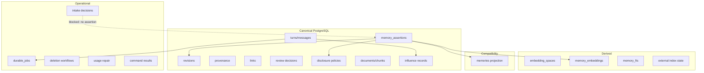
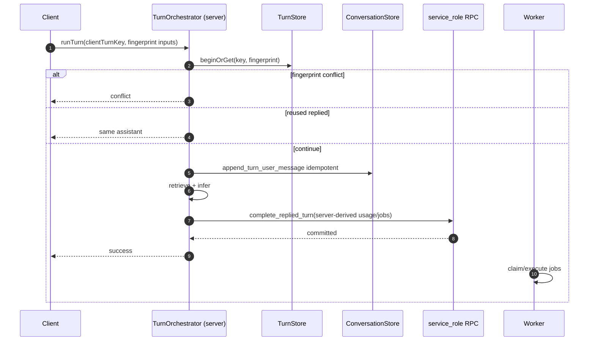
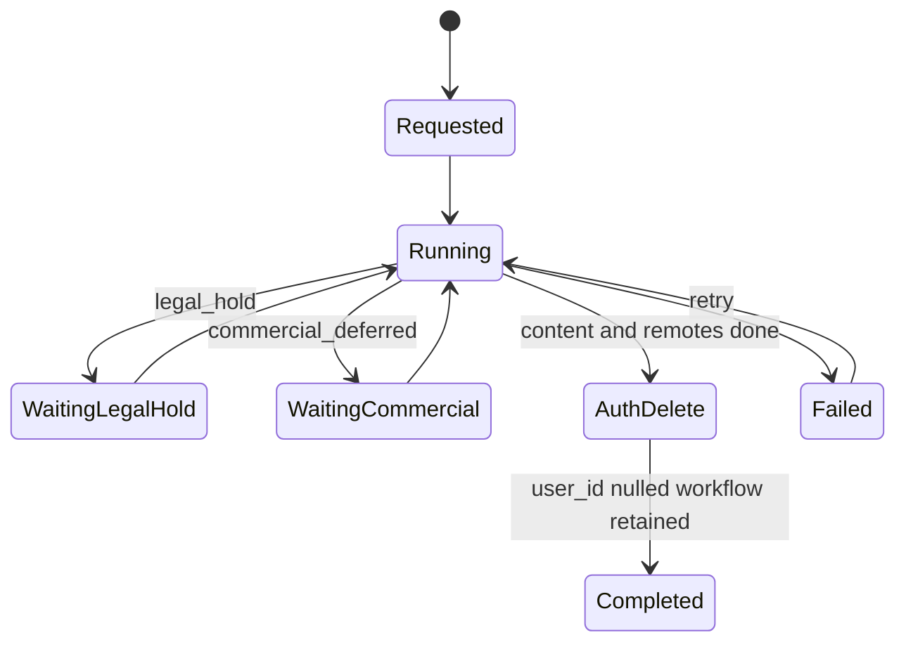
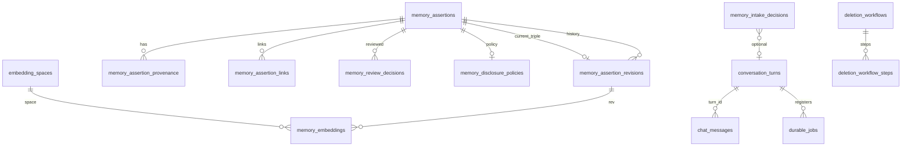

# 09 — Database and Service Technical Design

> **Role:** Database and Service Technical Designer  
> **Scope:** Exact, production-oriented PostgreSQL and application-service design for Cortaix memory, turns, usage coordination, durable work, and deletion — grounded in Stages 1–8 and verified migrations/code.  
> **Constraints:** Documentation only. No migrations, SQL application, production code, API, prompt, test, dependency, configuration, or behaviour changes. No Stage 10 algorithms, Stage 11 entity graphs, Stage 12 ranking, Stage 13 frameworks, Stage 16 roadmap, or Stage 17 first-PR specification.  
> **Prior docs:** [`00-roadmap.md`](./00-roadmap.md), [`01-repository-map.md`](./01-repository-map.md), [`02-current-memory-flow.md`](./02-current-memory-flow.md), [`03-database-rls-audit.md`](./03-database-rls-audit.md), [`04-extraction-audit.md`](./04-extraction-audit.md), [`05-retrieval-context-audit.md`](./05-retrieval-context-audit.md), [`06-security-failure-audit.md`](./06-security-failure-audit.md), [`07-target-architecture.md`](./07-target-architecture.md), [`08-memory-model.md`](./08-memory-model.md).  
> **Revision note:** Corrected for Gateway-only mutation, backend-only turn completion, same-assertion revision binding, purge/tombstone consistency, blocked-intake separation, provenance source-deletion semantics, turn-message idempotency, non-inventive legacy mapping, deletion-workflow survivability, actor identity, semantic link uniqueness, complete table DDL, constrained jobs, and 1536-dim embedding registry.

Stages 1–8 are treated as **complete** even if `00-roadmap.md` status text lags. Prior reports are **not** edited. Disagreements with Stages 7–8 are recorded in §45 rather than silently changed.

---

## Legend (evidence classes)

| Label | Meaning |
| --- | --- |
| **Verified current behaviour** | Confirmed in migration SQL or application source in this stage. |
| **Technical decision** | Binding Stage 9 physical/service choice. |
| **Constraint** | Hard requirement from Stages 7–8 or verified current safety properties. |
| **Security property** | Isolation, trust, or disclosure guarantee the design must preserve. |
| **Tradeoff** | Cost accepted for a decision’s benefits. |
| **Assumption** | Reasonable premise not proven by live production metrics. |
| **Deferred decision** | Owned by Stages 10–13, 15–17, product, or legal. |
| **Unknown** | Cannot be closed from audits and Stages 7–8 alone. |

---

## 1. Executive summary

### Verdict

Cortaix’s target physical model remains **Option B lean — new canonical `memory_assertions`**, with orthogonal current-state columns and supporting tables for revisions, provenance, succession, review, disclosure, derived indexes, turns, durable jobs, deletion workflows, influence records, and **blocked-intake decisions**. Existing `public.memories` remains a temporary compatibility projection.

Candidates and trusted memories share one assertion table via `trust`. Ordinary browser clients have **SELECT-only** access to canonical assertion state; all mutations go through narrow Gateway RPCs. Replied-turn completion is **backend/service-role only**.

### Binding shape

| Area | Decision |
| --- | --- |
| Architecture | Modular monolith; PostgreSQL canonical; Storage for source-file bytes; indexes derived |
| Mutation trust boundary | Authenticated SELECT own rows; INSERT/UPDATE/DELETE only via approved RPCs or trusted backend |
| Assertion identity | Stable UUID; `(user_id, id)`; current revision bound by `(user_id, id, current_revision_id)` |
| Trust / authority | Enforceable CHECKs; legacy uses `legacy_migrated` / `legacy_unknown` only for backfill |
| Temporal | Separate phase, bounds kind, modality |
| Turns | `conversation_turns` + `turn_id` on messages; fingerprint; at most one user and one assistant message |
| Outbox | Constrained `durable_jobs`; registered in backend completion TX |
| Embeddings | Registry of spaces; product rule **all spaces are 1536-d**; revision-bound derived table |
| Purge | Tombstone with NULL revision pointer; no private content |
| Blocked secrets | `memory_intake_decisions` — never an assertion row with raw secret |
| Coexistence | Compatibility projection; no invented legacy authority/kind |

### Corrections in this revision

Gateway-only mutation; backend-only `complete_replied_turn`; same-assertion revision FKs; purge/tombstone consistency; intake-decision table; provenance source-deleted markers; turn-message idempotency + fingerprint; non-inventive legacy mapping; deletion workflow survivability after Auth delete; actor kinds; semantic link uniqueness; complete DDL for previously summarised tables; job type/subject CHECKs; embedding-space registry with fixed 1536.

---

## 2. Verified current technical constraints

### 2.1 Schema (verified from migrations)

| Object | Verified facts |
| --- | --- |
| Enums | `memory_type` (`profile`,`preference`,`semantic`,`episodic`,`project`,`temporary`); `memory_status` (`active`,`proposed`,`rejected`,`superseded`,`archived`,`deleted`); `memory_source` (`manual`,`chat_extraction`,`document`,`onboarding`,`import`) — `20260720000001_init.sql` |
| `memories` | User-owned; content 1..8000; `embedding vector(1536)`; RLS own CRUD — `20260720000002_memories.sql` |
| Documents / chat | Child FKs without composite ownership — `20260720000003_documents.sql`, `20260720000004_chat.sql` |
| Match RPCs | SECURITY INVOKER, `auth.uid()` filter — `20260720000007_functions.sql` |
| Usage / plan | `usage_events` PK `request_id`; `record_plan_usage_turn` not turn-idempotent |
| Workspaces | Do not scope memories |
| Account delete RPC | None |

### 2.2 Application contracts (verified)

Think route-local active writes; Chat `runChatOrchestrator`; settlement before assistant persist; fresh UUID per attempt; `message_context` only; `MemoryProvider` request-scoped client.

### 2.3 Gaps Stage 9 must close

Parent/child ownership; turn idempotency; charge-without-reply; unused soft-delete/superseded; stale embeddings; Mem0 authority leaks; no outbox; untracked deletion; **direct client mutation of trust** (current product table grants); invented legacy semantics risk.

---

## 3. Binding inputs from Stages 7 and 8

Preserved without silent change:

1. Modular monolith; PostgreSQL canonical; Storage for bytes; indexes derived.  
2. One Turn Orchestrator; one Memory Ingestion Gateway; routes do not own trust.  
3. Required post-response work registered before client success; execution async.  
4. Replied turn requires durable assistant + usage finalise-or-repair + job registration + commit.  
5. Same turn identity reconciles without duplicates.  
6. Retrieved content untrusted; external hits reconcile; deletion tracked.  
7. Personal memory user-scoped; workspaces cannot broaden access.  
8. Stage 8 orthogonal dimensions and authority survival rule.  
9. Documents are sources; eligibility derived.

**Technical decision:** Stage 9 stores a legacy projection status for coexistence only.

---

## 4. Physical-model alternatives

Options A–E assessment is unchanged from the prior Stage 9 draft: **Option B lean selected**; A rejected as long-term; C rejected as primary (selective side tables adopted); D rejected (shared table); E rejected as product model.

---

## 5. Selected persistence model

### Technical decision — Option B (lean), corrected trust boundary

Canonical current assertion in `public.memory_assertions`. Supporting tables:

- history: `memory_assertion_revisions`, `memory_review_decisions`, `memory_assertion_links`
- provenance: `memory_assertion_provenance`
- policy: `memory_disclosure_policies` (only for stored assertions)
- intake ops: `memory_intake_decisions` (includes blocked secrets without assertion rows)
- derived: `embedding_spaces`, `memory_embeddings`, `memory_fts_documents`, `external_memory_index_entries`, `document_chunk_embeddings`
- operational: `conversation_turns`, `turn_inference_attempts`, `usage_repair_obligations`, `durable_jobs`, `deletion_workflows`, `deletion_workflow_steps`, `memory_command_results`
- explainability: `response_influence_records`
- projection: `memories` compatibility surface

**Mutation rule:** no ordinary authenticated INSERT/UPDATE/DELETE grants on canonical mutation tables.

---

## 6. Design vocabulary

| Term | Physical meaning |
| --- | --- |
| Memory assertion | Row in `memory_assertions` |
| Candidate / trusted / distrusted | `trust` values |
| Current revision | Bound by `(user_id, id, current_revision_id)` → same assertion |
| Intake decision | `memory_intake_decisions` outcome; may block without storing assertion |
| Derived index | Embeddings / FTS / external entries |
| Compatibility projection | `memories` adapter surface |
| Turn | `conversation_turns` keyed by `(user_id, client_turn_key)` + fingerprint |
| Actor | `actor_kind` + `actor_id` (not forged foreign user UUIDs) |
| Outbox job | Constrained `durable_jobs` row |

---

## 7. Canonical versus operational versus derived data



| Class | Authoritative for meaning? | Rebuildable? |
| --- | --- | --- |
| Canonical | Yes | No |
| Operational | Yes for workflow/idempotency | No |
| Commercial | Yes for billing | No |
| Derived | No | Yes |
| Projection | No | Yes from canonical |

---

## 8. Complete target table catalogue

### 8.0 Enums

```text
assertion_content_kind:
  identity | preference | instruction | goal | commitment | decision |
  project_context | event | relationship_fact | knowledge | legacy_unknown

assertion_trust: candidate | trusted | distrusted

assertion_authority_source:
  none | user_asserted | user_confirmed | user_corrected | legacy_migrated

assertion_review_state: none | pending | accepted | rejected | deferred

temporal_phase: prospective | current | historical | ended
temporal_bounds_kind: unbounded | interval_bounded | event_anchored | expiry_ruled
claim_modality: asserted | uncertain | conditional | hypothetical | planned
assertion_organisation: visible | archived
assertion_retention: present | deleted | purge_pending | purged
assertion_succession: head | superseded | merged_into | conflict_open

assertion_origin_class:
  explicit_remember | manual_vault | onboarding | conversational_statement |
  conversational_inference | user_correction | user_approval | document_candidate |
  import | integration | system_summary | model_interpretation | heuristic_interpretation |
  legacy_unknown

sensitivity_class:
  ordinary_personal | highly_sensitive | third_party_personal |
  provider_restricted | forbidden_secret

transformation_kind: none | lossless_normalisation | material_transformation | unknown

actor_kind: owner_user | system | worker | admin

conversation_turn_state:
  intent_registered | denied | retrieving | inferring | completing |
  replied | failed | cancelled

durable_job_type:
  extract_turn_candidates | embed_assertion | embed_document_chunk |
  sync_external_index | delete_step | usage_repair | rebuild_fts |
  reconcile_external_index | transition_temporal | compat_projection_sync

durable_job_subject_type:
  assertion | document | document_chunk | turn | user | deletion_workflow | usage_repair

durable_job_state: pending | leased | succeeded | failed | dead_letter | cancelled

deletion_scope_type: assertion | document | conversation | account | candidate_batch
deletion_workflow_state:
  requested | running | waiting_legal_hold | waiting_commercial |
  completed | failed | cancelled
deletion_step_key:
  soft_delete_canonical | purge_revisions | purge_embeddings | purge_fts |
  purge_external_index | purge_storage | purge_byok | anonymise_audit |
  commercial_handling | auth_delete | cancel_pending_jobs | hard_purge_tombstone
deletion_step_state: pending | running | succeeded | failed | skipped

intake_outcome: accepted | partially_accepted | blocked

source_unavailable_reason: deleted | missing | never_linked
```

**Constraint:** `legacy_unknown` content kind and `legacy_migrated` authority are assignable **only** when `legacy_memory_id IS NOT NULL` (backfill rows). Product RPCs reject them for new writes.

### 8.1 Mutation and grant model (normative)

**Technical decision — Gateway/RPC-only mutation**

| Principal | Canonical mutation tables | Read |
| --- | --- | --- |
| `authenticated` (browser/PostgREST) | **SELECT own rows only** — no INSERT/UPDATE/DELETE table grants | Yes where listed |
| User-facing mutation RPCs | `EXECUTE` granted to `authenticated` | Mutate via DEFINER with `auth.uid()` check |
| Backend Turn Orchestrator | Uses **service_role** for `complete_replied_turn` and related completion | Verified `p_user_id` + turn ownership |
| Workers | `service_role` for claim/complete job RPCs | Scoped by job `user_id` / workflow subject |

Canonical mutation tables include at least: `memory_assertions`, `memory_assertion_revisions`, `memory_assertion_provenance`, `memory_assertion_links`, `memory_review_decisions`, `memory_disclosure_policies`, `memory_intake_decisions`, `memory_command_results`, `conversation_turns`, `turn_inference_attempts`, `usage_repair_obligations`, `durable_jobs`, `deletion_workflows`, `deletion_workflow_steps`, `response_influence_records`, and compatibility write path to `memories`.

**Why SECURITY DEFINER for user mutation RPCs:** with no INSERT/UPDATE grants, SECURITY INVOKER cannot write. DEFINER is required, with:

1. `SET search_path = public`  
2. First statement: `IF auth.uid() IS NULL OR auth.uid() <> p_user_id THEN RAISE`  
3. No caller-supplied “acting as” other users  
4. Actor recorded as `owner_user` + `auth.uid()` for user RPCs  
5. Minimum `EXECUTE` grants  

**Security property:** A user cannot call PostgREST and set `trust='trusted'` or `authority_source='user_asserted'`.

Compatibility writes go through the same Gateway adapter RPCs (never direct PostgREST upsert of trust fields).

---

### 8.2 `memory_assertions` — **canonical**

**Purpose:** Current-state memory assertion.  
**Classification:** Canonical.  
**PK:** `id uuid`  
**Unique:** `(user_id, id)`; unique `(user_id, id, current_revision_id)` WHERE `current_revision_id IS NOT NULL` (for composite FK from embeddings/influence); unique `(legacy_memory_id)` WHERE NOT NULL.

| Column | Type | Null | Default | Notes |
| --- | --- | --- | --- | --- |
| `id` | uuid | NO | `gen_random_uuid()` | Stable id; preserved from legacy on backfill |
| `user_id` | uuid | NO | — | FK `auth.users(id)` ON DELETE **CASCADE** — account Auth delete runs only after assertion purge/external cleanup, so unfinished reconcile never depends on post-Auth assertion rows |
| `content_text` | text | NO | — | Mirror of current revision; `''` **only** when `retention='purged'` |
| `content_kind` | assertion_content_kind | NO | — | Mirror of current revision kind; `legacy_unknown` only if backfill |
| `category` | text | YES | NULL | |
| `scope_labels` | text[] | NO | `'{}'` | Not access grants |
| `trust` | assertion_trust | NO | — | |
| `authority_source` | assertion_authority_source | NO | `'none'` | |
| `confidence` | real | YES | NULL | |
| `review_state` | assertion_review_state | NO | — | |
| `temporal_phase` | temporal_phase | NO | `'current'` | |
| `temporal_bounds_kind` | temporal_bounds_kind | NO | `'unbounded'` | |
| `valid_from` | timestamptz | YES | NULL | |
| `valid_to` | timestamptz | YES | NULL | |
| `event_at` | timestamptz | YES | NULL | |
| `event_timezone` | text | YES | NULL | IANA |
| `expires_at` | timestamptz | YES | NULL | |
| `claim_modality` | claim_modality | NO | `'asserted'` | |
| `organisation` | assertion_organisation | NO | `'visible'` | |
| `retention` | assertion_retention | NO | `'present'` | |
| `succession_state` | assertion_succession | NO | `'head'` | |
| `pinned_at` | timestamptz | YES | NULL | |
| `origin_class` | assertion_origin_class | NO | — | |
| `current_revision_id` | uuid | YES | NULL | NULL **only** when `retention='purged'` |
| `trust_changed_at` | timestamptz | YES | NULL | |
| `trust_changed_actor_kind` | actor_kind | YES | NULL | |
| `trust_changed_actor_id` | uuid | YES | NULL | Meaning depends on actor_kind |
| `deleted_at` | timestamptz | YES | NULL | |
| `purged_at` | timestamptz | YES | NULL | |
| `legacy_memory_id` | uuid | YES | NULL | Non-null ⇒ backfill row |
| `legacy_projection_status` | memory_status | YES | NULL | Compat only |
| `migration_note` | text | YES | NULL | Safe code/note, no invented events |
| `created_at` | timestamptz | NO | `now()` | |
| `updated_at` | timestamptz | NO | `now()` | |

**Checks:**

1. `trust='trusted' ⇒ authority_source IN ('user_asserted','user_confirmed','user_corrected','legacy_migrated')`  
2. `trust='candidate' ⇒ authority_source='none'`  
3. `trust='distrusted' ⇒ trust_changed_actor_kind='owner_user' AND trust_changed_actor_id IS NOT NULL AND trust_changed_at IS NOT NULL` *(Stage 8: owner repudiation; admin path Deferred — not enabled now)*  
4. `review_state='accepted' ⇒ trust='trusted'`  
5. `review_state IN ('pending','deferred','rejected') ⇒ trust='candidate'`  
6. `review_state='none' ⇒ trust IN ('trusted','distrusted')`  
7. Bounds CHECKs as before (unbounded/interval/event/expiry)  
8. `retention='deleted' ⇒ deleted_at IS NOT NULL`  
9. `retention='purged' ⇒ purged_at IS NOT NULL AND deleted_at IS NOT NULL AND current_revision_id IS NULL AND content_text=''`  
10. `retention <> 'purged' ⇒ current_revision_id IS NOT NULL AND char_length(content_text) BETWEEN 1 AND 8000`  
11. `confidence IS NULL OR confidence BETWEEN 0 AND 1`  
12. `authority_source='legacy_migrated' ⇒ legacy_memory_id IS NOT NULL`  
13. `content_kind='legacy_unknown' ⇒ legacy_memory_id IS NOT NULL`  
14. `trust_changed_actor_kind='owner_user' ⇒ trust_changed_actor_id = user_id`

**FK current revision (same assertion):**

```text
UNIQUE (user_id, id, current_revision_id)  -- filtered / or always when revision not null
FOREIGN KEY (user_id, id, current_revision_id)
  REFERENCES memory_assertion_revisions (user_id, assertion_id, id)
  DEFERRABLE INITIALLY DEFERRED
```

**Indexes:** `(user_id)`; eligibility composite; review partial; pins partial; `(legacy_memory_id)` unique where not null.

**RLS:** enabled. Policy: `SELECT` using `auth.uid() = user_id`. No authenticated INSERT/UPDATE/DELETE policies.  
**Grants:** `authenticated`: **SELECT only**. `service_role`: ALL (used only inside RPCs/workers).  
**Writers:** mutation RPCs / backend completion (via service_role).  
**Readers:** Vault, review, retrieval reconcile, export (exclude purged).  
**TX owner:** Gateway mutation RPCs; deletion purge steps.  
**Migration:** backfill from `memories`; see §34.

**Mirrored-state enforcement:** mutation RPCs set `content_text`/`content_kind` from the new current revision in the same TX. Deferred constraint trigger `trg_assertion_revision_mirror` asserts `content_text` and `content_kind` equal the referenced revision when `current_revision_id IS NOT NULL`.

**Disclosure presence:** every assertion with `retention IN ('present','deleted','purge_pending')` has a `memory_disclosure_policies` row created in the same insert TX. Purged tombstones may drop disclosure rows.

---

### 8.3 `memory_assertion_revisions` — **canonical history**

| Column | Type | Null | Default |
| --- | --- | --- | --- |
| `id` | uuid | NO | `gen_random_uuid()` |
| `user_id` | uuid | NO | — |
| `assertion_id` | uuid | NO | — |
| `revision_no` | int | NO | — |
| `content` | text | NO | CHECK char_length BETWEEN 1 AND 8000 |
| `normalised_content` | text | YES | NULL |
| `content_kind` | assertion_content_kind | NO | — CHECK `<> 'legacy_unknown' OR` only via backfill RPC |
| `transformation_kind` | transformation_kind | NO | `'unknown'` |
| `authored_by_role` | text | NO | CHECK IN (`user`,`system_model`,`system_heuristic`,`system_import`) |
| `actor_kind` | actor_kind | NO | — |
| `actor_id` | uuid | YES | NULL |
| `change_reason` | text | NO | CHECK IN (`create`,`edit`,`keep_after_edit`,`correct`,`system_backfill`) |
| `created_at` | timestamptz | NO | `now()` |

**PK:** `id`  
**Unique:** `(user_id, id)`; `(user_id, assertion_id, revision_no)`; **`(user_id, assertion_id, id)`** — required for same-assertion current pointer and embedding FKs.  
**FKs:** `(user_id, assertion_id) → memory_assertions(user_id, id) ON DELETE CASCADE`  
**Checks:** `actor_kind='owner_user' ⇒ actor_id = user_id`; `actor_kind IN ('system','worker') ⇒ actor_id IS NULL OR actor_id is service principal id`  
**Indexes:** `(user_id, assertion_id, revision_no DESC)`  
**RLS:** SELECT own; no authenticated writes.  
**Grants:** authenticated SELECT; service_role ALL.  
**Writers:** Gateway mutation RPCs only.  
**Purge:** hard-deleted in `purge_revisions` step; never retained on purged tombstones.

---

### 8.4 `memory_review_decisions` — **canonical history**

| Column | Type | Null | Default |
| --- | --- | --- | --- |
| `id` | uuid | NO | `gen_random_uuid()` |
| `user_id` | uuid | NO | — |
| `assertion_id` | uuid | NO | — |
| `decision` | text | NO | CHECK IN (`accepted`,`rejected`,`deferred`,`candidate_deleted`,`keep_after_edit`,`merge`,`correction`,`contradiction_resolution`,`repudiation`) |
| `actor_kind` | actor_kind | NO | — |
| `actor_id` | uuid | YES | NULL |
| `notes` | text | YES | NULL | **codes only** — no raw private bodies |
| `resulting_trust` | assertion_trust | NO | — |
| `resulting_review_state` | assertion_review_state | NO | — |
| `merge_target_assertion_id` | uuid | YES | NULL |
| `idempotency_key` | text | NO | — |
| `created_at` | timestamptz | NO | `now()` |

**Unique:** `(user_id, assertion_id, idempotency_key)`  
**FKs:** composite to assertion; optional merge target same user.  
**Checks:** `actor_kind='owner_user' ⇒ actor_id = user_id`  
**RLS/grants:** SELECT own; writes via RPC only.  
**Migration:** **Do not invent** review decisions for legacy rows lacking evidence.

---

### 8.5 `memory_assertion_provenance` — **canonical**

| Column | Type | Null | Default |
| --- | --- | --- | --- |
| `id` | uuid | NO | `gen_random_uuid()` |
| `user_id` | uuid | NO | — |
| `assertion_id` | uuid | NO | — |
| `revision_id` | uuid | YES | NULL |
| `origin_class` | assertion_origin_class | NO | — |
| `source_kind` | text | NO | CHECK IN (`chat_message`,`document`,`document_chunk`,`import_batch`,`integration`,`prior_assertion`,`turn`,`none`) |
| `source_chat_message_id` | uuid | YES | NULL |
| `source_document_id` | uuid | YES | NULL |
| `source_document_chunk_id` | uuid | YES | NULL |
| `source_prior_assertion_id` | uuid | YES | NULL |
| `source_turn_id` | uuid | YES | NULL |
| `source_external_ref` | text | YES | NULL |
| `source_deleted_at` | timestamptz | YES | NULL |
| `source_unavailable_reason` | source_unavailable_reason | YES | NULL |
| `transformation_kind` | transformation_kind | NO | `'unknown'` |
| `policy_version` | text | YES | NULL |
| `created_at` | timestamptz | NO | `now()` |

**Selected source-deletion semantics:**

1. `source_kind` is always retained.  
2. Concrete source ID columns are nullable.  
3. While the source exists, composite FKs enforce same-user ownership.  
4. On source delete, application/RPC sets the matching source ID to NULL, sets `source_deleted_at=now()`, and `source_unavailable_reason='deleted'`.  
5. CHECK: for each `source_kind` requiring a target, either the ID is NOT NULL **or** (`source_deleted_at IS NOT NULL AND source_unavailable_reason IS NOT NULL`).  
6. `source_kind='none'` ⇒ all source IDs NULL and `source_unavailable_reason='never_linked'` allowed.  
7. Prior-assertion sources: prefer soft retention of assertion tombstones; if hard-removed, same null+marker pattern.  

**PostgreSQL note:** avoid bare `ON DELETE SET NULL` on composite FKs that include non-null `user_id`. Use **ON DELETE RESTRICT** on source FKs and perform explicit nullification in the deletion step, **or** use single-column FKs only on the source id with a trigger validating `user_id` match on insert/update. **Selected:** single-column FKs on source ids (`REFERENCES chat_messages(id) ON DELETE RESTRICT` etc.) plus **BEFORE DELETE** on sources that call a SECURITY DEFINER helper to nullify provenance ids and stamp `source_deleted_at` for same-user rows; insert/update triggers verify `provenance.user_id` equals source owner.

**RLS/grants:** SELECT own; RPC writes only.

---

### 8.6 `memory_assertion_links` — **canonical succession**

| Column | Type | Null | Default |
| --- | --- | --- | --- |
| `id` | uuid | NO | `gen_random_uuid()` |
| `user_id` | uuid | NO | — |
| `from_assertion_id` | uuid | NO | — |
| `to_assertion_id` | uuid | NO | — |
| `link_type` | text | NO | CHECK IN (`supersedes`,`corrects_false`,`changed_over_time`,`merged_into`,`conflicts_with`,`derived_from`) |
| `is_active` | boolean | NO | `true` |
| `created_actor_kind` | actor_kind | NO | — |
| `created_actor_id` | uuid | YES | NULL |
| `created_at` | timestamptz | NO | `now()` |
| `resolved_at` | timestamptz | YES | NULL |
| `superseded_at` | timestamptz | YES | NULL |
| `command_idempotency_key` | text | NO | — |

**Uniques:**

1. **Semantic active uniqueness:** unique `(user_id, from_assertion_id, to_assertion_id, link_type)` WHERE `is_active`  
2. **Command idempotency:** unique `(user_id, command_idempotency_key)`  

Historical resolutions deactivate prior active links (`is_active=false`, `superseded_at`) and insert a new active row when needed — preventing duplicate active semantics via different idempotency keys.

**Checks:** `from <> to`; `created_actor_kind='owner_user' ⇒ created_actor_id = user_id`; open conflict ⇒ `link_type='conflicts_with' AND resolved_at IS NULL AND is_active`.  
**FKs:** composite both ends.  
**RLS/grants:** SELECT own; RPC writes.

---

### 8.7 `memory_disclosure_policies` — **canonical**

Exists **only** for stored assertions (not for blocked intake).

| Column | Type | Null | Default |
| --- | --- | --- | --- |
| `user_id` | uuid | NO | — |
| `assertion_id` | uuid | NO | — |
| `sensitivity_class` | sensitivity_class | NO | `'ordinary_personal'` |
| `classification_source` | text | NO | CHECK IN (`user`,`heuristic`,`model`,`policy_default`,`legacy_flag`) |
| `policy_version` | text | NO | — |
| `allow_store` | boolean | NO | `true` |
| `allow_trust` | boolean | NO | `true` |
| `allow_user_display` | boolean | NO | `true` |
| `allow_retrieval` | boolean | NO | `true` |
| `allow_inference_disclosure` | boolean | NO | `true` |
| `allow_embedding_disclosure` | boolean | NO | `true` |
| `allow_external_index_disclosure` | boolean | NO | `false` |
| `user_override` | jsonb | YES | NULL |
| `denial_reason_code` | text | YES | NULL |
| `quarantine` | boolean | NO | `false` |
| `updated_at` / `created_at` | timestamptz | NO | `now()` |

**PK:** `(user_id, assertion_id)` FK cascade to assertion.  
**Check:** `sensitivity_class='forbidden_secret'` is **not** used on stored trusted rows for blocked intake — blocked secrets never create this row. If a stored assertion is later reclassified restricted: `quarantine=true` means withheld from external disclosure channels without storing raw secret material.  
**RLS/grants:** SELECT own; RPC writes.

---

### 8.8 `memory_intake_decisions` — **operational**

**Purpose:** Record Gateway intake outcomes including forbidden-secret blocks **without** creating assertions that contain secrets.

| Column | Type | Null | Default |
| --- | --- | --- | --- |
| `id` | uuid | NO | `gen_random_uuid()` |
| `user_id` | uuid | NO | — |
| `command_idempotency_key` | text | NO | — |
| `turn_id` | uuid | YES | NULL |
| `origin_class` | assertion_origin_class | NO | — |
| `outcome` | intake_outcome | NO | — |
| `reason_code` | text | YES | NULL | e.g. `forbidden_secret` |
| `policy_version` | text | NO | — |
| `content_fingerprint` | bytea | YES | NULL | optional irreversible HMAC/hash — **not** reversible to secret |
| `accepted_assertion_ids` | uuid[] | NO | `'{}'` | ids created when partial/accepted |
| `created_at` | timestamptz | NO | `now()` |

**Unique:** `(user_id, command_idempotency_key)`  
**FK:** optional turn composite.  
**Forbidden columns:** raw secret, full message body, secret-bearing payloads.  
**Quarantine meaning without storage:** `outcome='blocked'` + `reason_code='forbidden_secret'` is the durable record; no assertion, no disclosure policy, no embedding.  
**RLS:** SELECT own; INSERT via Gateway RPC only.  
**Grants:** authenticated SELECT; service_role ALL.  
**TX owner:** Gateway command TX (same TX as any accepted assertion inserts).

---

### 8.9 `memory_command_results` — **operational idempotency**

| Column | Type | Null | Default |
| --- | --- | --- | --- |
| `user_id` | uuid | NO | — |
| `command_idempotency_key` | text | NO | — |
| `command_type` | text | NO | — |
| `result_json` | jsonb | NO | — | ids/codes only |
| `created_at` | timestamptz | NO | `now()` |

**PK:** `(user_id, command_idempotency_key)`  
**Purpose:** replay-safe Gateway/review command responses.  
**RLS:** SELECT own; RPC writes.

---

### 8.10 `embedding_spaces` — **derived registry**

| Column | Type | Null | Default |
| --- | --- | --- | --- |
| `space_id` | text | NO | — PK |
| `provider` | text | NO | — |
| `model_id` | text | NO | — |
| `dimensions` | int | NO | CHECK `= 1536` |
| `active` | boolean | NO | `true` |
| `notes` | text | YES | NULL |
| `created_at` | timestamptz | NO | `now()` |

**Technical decision — dimensionality:** all supported embedding spaces **must output 1536 dimensions**. Provider adapters that natively differ must project/pad/truncate **only inside the adapter under an explicit space definition**; incompatible native dims are not queried as-is. pgvector column remains `vector(1536)`. Cross-space comparisons are forbidden.

Seed includes `legacy-unlabeled-1536` and `local-h1`.

**RLS:** authenticated SELECT active rows; service_role mutate.

---

### 8.11 `memory_embeddings` — **derived**

| Column | Type | Null | Default |
| --- | --- | --- | --- |
| `id` | uuid | NO | `gen_random_uuid()` |
| `user_id` | uuid | NO | — |
| `assertion_id` | uuid | NO | — |
| `revision_id` | uuid | NO | — |
| `embedding_space` | text | NO | — FK → `embedding_spaces(space_id)` |
| `embedding_dim` | int | NO | `1536` CHECK `= 1536` |
| `embedding` | vector(1536) | YES | NULL |
| `state` | text | NO | CHECK IN (`pending`,`ready`,`stale`,`failed`) DEFAULT `'pending'` |
| `provider` | text | YES | NULL |
| `model_id` | text | YES | NULL |
| `error_code` | text | YES | NULL |
| `created_at` / `updated_at` | timestamptz | NO | `now()` |

**Unique:** `(user_id, assertion_id, embedding_space)`  
**FK:** `(user_id, assertion_id, revision_id) → memory_assertion_revisions(user_id, assertion_id, id)` ON DELETE CASCADE  
**Index:** ivfflat WHERE `state='ready'`  
**RLS:** SELECT own; worker writes via SR.  
**Stale rule:** revision advance marks ready→stale and enqueues rebuild for current revision only.

---

### 8.12 `memory_fts_documents` — **derived**

| Column | Type | Null | Default |
| --- | --- | --- | --- |
| `user_id` | uuid | NO | — |
| `assertion_id` | uuid | NO | — |
| `revision_id` | uuid | NO | — |
| `document` | tsvector | NO | — |
| `updated_at` | timestamptz | NO | `now()` |

**PK:** `(user_id, assertion_id)`  
**FK:** `(user_id, assertion_id, revision_id) → revisions(user_id, assertion_id, id)`  
**GIN** on `document`. SELECT own; worker writes.

---

### 8.13 `external_memory_index_entries` — **derived**

| Column | Type | Null | Default |
| --- | --- | --- | --- |
| `id` | uuid | NO | `gen_random_uuid()` |
| `user_id` | uuid | NO | — |
| `assertion_id` | uuid | NO | — |
| `revision_id` | uuid | NO | — |
| `provider` | text | NO | — |
| `external_id` | text | YES | NULL |
| `sync_state` | text | NO | CHECK IN (`pending`,`synced`,`stale`,`failed`,`deleted`) |
| `last_synced_at` | timestamptz | YES | NULL |
| `last_error_code` | text | YES | NULL |
| `created_at` / `updated_at` | timestamptz | NO | `now()` |

**Unique:** `(user_id, assertion_id, provider)`  
**FK:** revision triple as embeddings. Non-authoritative. SELECT own; worker writes.

---

### 8.14 `document_chunk_embeddings` — **derived**

| Column | Type | Null | Default |
| --- | --- | --- | --- |
| `id` | uuid | NO | `gen_random_uuid()` |
| `user_id` | uuid | NO | — |
| `document_id` | uuid | NO | — |
| `chunk_id` | uuid | NO | — |
| `content_sha256` | bytea | NO | — | chunk content fingerprint |
| `embedding_space` | text | NO | — FK embedding_spaces |
| `embedding_dim` | int | NO | `1536` CHECK `= 1536` |
| `embedding` | vector(1536) | YES | NULL |
| `state` | text | NO | CHECK IN (`pending`,`ready`,`stale`,`failed`) DEFAULT `'pending'` |
| `error_code` | text | YES | NULL |
| `created_at` / `updated_at` | timestamptz | NO | `now()` |

**Unique:** `(user_id, chunk_id, embedding_space)`  
**FKs:** `(user_id, document_id) → documents(user_id,id) ON DELETE CASCADE`; `(user_id, chunk_id) → document_chunks(user_id,id) ON DELETE CASCADE`  
**Indexes:** ivfflat WHERE ready; `(user_id, document_id)`  
**RLS:** SELECT own; worker writes.  
**Writers/readers:** document pipeline / retrieval.  
**TX owner:** embed job handler.

---
### 8.15 `conversation_turns` — **canonical operational**

| Column | Type | Null | Default |
| --- | --- | --- | --- |
| `id` | uuid | NO | `gen_random_uuid()` |
| `user_id` | uuid | NO | — |
| `client_turn_key` | text | NO | — |
| `request_fingerprint` | text | NO | — | immutable hash of message content/hash, session id, interface, selectionKey, attachment ids |
| `session_id` | uuid | YES | NULL |
| `state` | conversation_turn_state | NO | `'intent_registered'` |
| `interface` | text | NO | CHECK IN (`think`,`chat`,`api`,`other`) |
| `selection_key` | text | NO | — |
| `user_message_id` | uuid | YES | NULL |
| `assistant_message_id` | uuid | YES | NULL |
| `usage_request_id` | uuid | YES | NULL |
| `denial_code` | text | YES | NULL |
| `retrieval_snapshot` | jsonb | NO | `'{}'` | **ids/scores/codes only** |
| `direct_answer` | boolean | NO | `false` |
| `error_code` | text | YES | NULL |
| `created_at` / `updated_at` | timestamptz | NO | `now()` |
| `completed_at` | timestamptz | YES | NULL |

**Unique:** `(user_id, client_turn_key)`  
**Checks:** `state='replied' ⇒ assistant_message_id IS NOT NULL`; fingerprint immutable (no UPDATE of fingerprint after insert — enforced by RPC/trigger).  
**Conflict rule:** beginOrGet with same `client_turn_key` but different `request_fingerprint` → `conflict` error.  
**FKs:** composite to session; message FKs use `(user_id, user_message_id)` / assistant similarly once messages unique.  
**RLS:** SELECT own; writes via TurnStore RPCs / backend completion.  
**Grants:** authenticated SELECT; no direct INSERT/UPDATE; service_role ALL for completion path.

---

### 8.16 `chat_messages` upgrades — **canonical**

Additive columns/constraints on existing table:

| Column | Type | Null | Default |
| --- | --- | --- | --- |
| existing columns | unchanged | | |
| `turn_id` | uuid | YES | NULL | required for new product writes |

**New constraints:**

1. unique `(user_id, id)`  
2. FK `(user_id, session_id) → chat_sessions(user_id, id)` ON DELETE CASCADE  
3. FK `(user_id, turn_id) → conversation_turns(user_id, id)` ON DELETE RESTRICT WHERE turn_id present  
4. **Partial unique:** at most one user message per turn: unique `(user_id, turn_id)` WHERE `role='user' AND turn_id IS NOT NULL`  
5. **Partial unique:** at most one assistant message per turn: unique `(user_id, turn_id)` WHERE `role='assistant' AND turn_id IS NOT NULL`  

**Idempotent user-message insert:** TurnStore upserts by `(user_id, turn_id, role='user')` or catches unique violation and returns existing id.  
**Assistant insert:** only inside backend `complete_replied_turn`.  
**RLS:** retain own SELECT/INSERT for legacy coexistence during dual-write, but product path uses TurnStore RPC; after cutover remove authenticated INSERT grant and use RPC-only (same as assertions). **Technical decision for target:** authenticated SELECT; INSERT only via TurnStore backend using service_role or DEFINER RPC `append_turn_user_message` that checks uid.

---

### 8.17 `turn_inference_attempts` — **operational**

| Column | Type | Null | Default |
| --- | --- | --- | --- |
| `id` | uuid | NO | `gen_random_uuid()` |
| `user_id` | uuid | NO | — |
| `turn_id` | uuid | NO | — |
| `attempt_no` | int | NO | — |
| `provider` | text | NO | — |
| `model_id` | text | NO | — |
| `status` | text | NO | CHECK IN (`started`,`succeeded`,`failed`) |
| `error_code` | text | YES | NULL |
| `latency_ms` | int | YES | NULL |
| `created_at` | timestamptz | NO | `now()` |

**Unique:** `(user_id, turn_id, attempt_no)`  
**FK:** composite to turn ON DELETE CASCADE  
**RLS:** SELECT own; backend writes.

---

### 8.18 `usage_repair_obligations` — **operational commercial**

| Column | Type | Null | Default |
| --- | --- | --- | --- |
| `id` | uuid | NO | `gen_random_uuid()` |
| `user_id` | uuid | NO | — |
| `turn_id` | uuid | NO | — |
| `usage_request_id` | uuid | YES | NULL |
| `state` | text | NO | CHECK IN (`pending`,`succeeded`,`failed`,`cancelled`) |
| `reason_code` | text | NO | — |
| `payload` | jsonb | NO | `'{}'` | tokens/cost estimates **only** |
| `idempotency_key` | text | NO | — |
| `created_at` / `updated_at` | timestamptz | NO | `now()` |

**Unique:** `(user_id, idempotency_key)`, `(user_id, turn_id)`  
**RLS:** SELECT own; created only by backend completion RPC.

---

### 8.19 `durable_jobs` — **operational outbox**

| Column | Type | Null | Default |
| --- | --- | --- | --- |
| `id` | uuid | NO | `gen_random_uuid()` |
| `user_id` | uuid | YES | — | SET NULL only for post-Auth account-deletion residual jobs using `subject_ref` |
| `job_type` | durable_job_type | NO | — |
| `subject_type` | durable_job_subject_type | NO | — |
| `subject_id` | uuid | YES | NULL |
| `subject_ref` | text | YES | NULL | safe non-content ref when user_id null (e.g. workflow id) |
| `turn_id` | uuid | YES | NULL |
| `idempotency_key` | text | NO | — |
| `payload` | jsonb | NO | `'{}'` |
| `payload_schema_version` | int | NO | `1` |
| `priority` | int | NO | `100` |
| `available_at` | timestamptz | NO | `now()` |
| `state` | durable_job_state | NO | `'pending'` |
| `attempt_count` | int | NO | `0` |
| `max_attempts` | int | NO | `8` |
| `lease_owner` | text | YES | NULL |
| `lease_expires_at` | timestamptz | YES | NULL |
| `last_error_code` | text | YES | NULL |
| `created_at` | timestamptz | NO | `now()` |
| `started_at` | timestamptz | YES | NULL |
| `completed_at` | timestamptz | YES | NULL |
| `cancelled_at` | timestamptz | YES | NULL |

**Unique:** `(COALESCE(user_id, '00000000-0000-0000-0000-000000000000'::uuid), idempotency_key)` or `(subject_ref, idempotency_key)` for null-user rows — **Selected:** unique `(idempotency_key)` globally for simplicity **plus** unique `(user_id, idempotency_key)` WHERE user_id NOT NULL.

**Subject requirements CHECK:**

| job_type | required subject |
| --- | --- |
| extract_turn_candidates | subject_type=turn, subject_id=turn_id NOT NULL |
| embed_assertion | subject_type=assertion, subject_id NOT NULL |
| embed_document_chunk | subject_type=document_chunk, subject_id NOT NULL |
| sync_external_index / reconcile_external_index / rebuild_fts / transition_temporal | assertion |
| delete_step | deletion_workflow |
| usage_repair | usage_repair |
| compat_projection_sync | assertion |

**Payload privacy:** may contain UUIDs, enums, counters, error codes, space ids, content hashes — **never** raw message/assertion/document/secret text.  
**Retry:** `failed` with `attempt_count < max_attempts` → reschedule `available_at`; else `dead_letter`.  
**Lease recovery:** leased with `lease_expires_at < now()` reclaimable.  
**Cancellation:** deletion workflow sets `cancelled` for obsolete jobs.  
**Job-result idempotency:** handlers check canonical state before mutate; complete is idempotent for same job id.  
**RLS:** optional SELECT own while user_id present; claim/complete SR-only.  
**Writers:** backend completion + Gateway RPCs (DEFINER) register jobs; workers update via SR RPCs.

---

### 8.20 `deletion_workflows` — **operational**

| Column | Type | Null | Default |
| --- | --- | --- | --- |
| `id` | uuid | NO | `gen_random_uuid()` |
| `user_id` | uuid | YES | NULL | ON DELETE SET NULL from auth.users — workflow **survives** Auth deletion |
| `subject_ref` | text | NO | — | stable non-content key, e.g. `account:<uuid>` or `assertion:<uuid>` |
| `scope_type` | deletion_scope_type | NO | — |
| `scope_id` | uuid | YES | NULL |
| `state` | deletion_workflow_state | NO | `'requested'` |
| `requested_actor_kind` | actor_kind | NO | — |
| `requested_actor_id` | uuid | YES | NULL |
| `idempotency_key` | text | NO | — |
| `visible_status` | text | NO | — |
| `legal_hold` | boolean | NO | `false` |
| `commercial_deferred` | boolean | NO | `false` |
| `auth_deleted_at` | timestamptz | YES | NULL |
| `created_at` / `updated_at` | timestamptz | NO | `now()` |
| `completed_at` | timestamptz | YES | NULL |

**Unique:** `(idempotency_key)`; `(user_id, idempotency_key)` WHERE user_id NOT NULL  
**FK:** `user_id → auth.users(id) ON DELETE SET NULL`  
**Checks:** `requested_actor_kind='owner_user' ⇒ requested_actor_id = user_id` while user present; account scope requires `subject_ref` starting with `account:`.  
**Ordering (account):** soft-delete/purge content → storage → BYOK → external indexes → commercial/legal waits → anonymise audit → **auth_delete last** → complete.  
**After Auth delete:** `user_id` null; `subject_ref` + steps remain; no personal content retained for workflow continuity.  
**RLS:** SELECT where `auth.uid() = user_id` (invisible after auth delete to end user; ops via SR).  
**Grants:** authenticated SELECT own; mutate via RPC/SR.  
**TX owner:** DeletionCoordinator.

---

### 8.21 `deletion_workflow_steps` — **operational**

| Column | Type | Null | Default |
| --- | --- | --- | --- |
| `id` | uuid | NO | `gen_random_uuid()` |
| `workflow_id` | uuid | NO | — FK `deletion_workflows(id) ON DELETE CASCADE` |
| `user_id` | uuid | YES | NULL | SET NULL with workflow |
| `step_key` | deletion_step_key | NO | — |
| `state` | deletion_step_state | NO | `'pending'` |
| `attempt_count` | int | NO | `0` |
| `last_error_code` | text | YES | NULL |
| `skipped_reason_code` | text | YES | NULL |
| `created_at` / `updated_at` | timestamptz | NO | `now()` |

**Unique:** `(workflow_id, step_key)`  
**Indexes:** `(workflow_id, state)`  
**RLS:** SELECT via workflow ownership while user_id present; SR otherwise.  
**Writers:** deletion worker RPCs.

---

### 8.22 `response_influence_records` — **canonical explainability**

| Column | Type | Null | Default |
| --- | --- | --- | --- |
| `id` | uuid | NO | `gen_random_uuid()` |
| `user_id` | uuid | NO | — |
| `turn_id` | uuid | NO | — |
| `assistant_message_id` | uuid | NO | — |
| `assertion_id` | uuid | YES | NULL |
| `assertion_revision_id` | uuid | YES | NULL |
| `document_chunk_id` | uuid | YES | NULL |
| `channel` | text | NO | CHECK IN (`memory`,`document`,`identity`,`other`) |
| `eligibility_snapshot` | jsonb | NO | `'{}'` | ids/flags/codes only |
| `relevance` | real | YES | NULL |
| `selected` | boolean | NO | `true` |
| `created_at` | timestamptz | NO | `now()` |

**Checks:** memory channel ⇒ assertion_id + assertion_revision_id NOT NULL; document ⇒ chunk_id NOT NULL.  
**FKs:**  
- `(user_id, turn_id) → conversation_turns`  
- `(user_id, assistant_message_id) → chat_messages`  
- `(user_id, assertion_id, assertion_revision_id) → memory_assertion_revisions(user_id, assertion_id, id)`  
- `(user_id, document_chunk_id) → document_chunks`  
**RLS:** SELECT own; INSERT only via backend completion.  
**Migration:** backfill from `message_context` where possible.

---

### 8.23 Existing tables — ownership upgrades

| Table | Change |
| --- | --- |
| `documents` | unique `(user_id, id)` |
| `document_chunks` | unique `(user_id, id)`; FK `(user_id, document_id)` |
| `chat_sessions` | unique `(user_id, id)` |
| `message_context` | coexistence only; freeze new writes after cutover |
| `memories` | projection; writes only via Gateway adapter |
| usage/credits/plan | retained; turn-linked idempotent plan recording |
| `audit_log` | metadata codes only; `user_id` ON DELETE SET NULL retained |
| workspaces | no memory FKs |

---

### 8.24 Purge / tombstone model (normative)

1. Soft delete: `retention='deleted'`, keep revisions until purge steps.  
2. Purge steps remove revisions, embeddings, FTS, external entries, and disclosure rows/private policy state.  
3. While the user still exists, a tombstone may remain: `retention='purged'`, `current_revision_id=NULL`, `content_text=''`, `purged_at` set, safe metadata only (`id`, `user_id`, timestamps, non-content enums).  
4. Retrieval and compatibility projection **exclude** purged.  
5. External stale hits reconcile to purged ⇒ drop.  
6. **Account deletion:** complete soft-delete → purge revisions/content → derived cleanup → storage → BYOK → external-index cleanup → commercial/legal waits → audit anonymisation → **then** Auth delete. Assertion rows (including tombstones) are removed in the purge/hard-delete steps **before** Auth deletion, so `ON DELETE CASCADE` from `auth.users` does not destroy an unfinished content-cleanup obligation.  
7. **What remains after Auth user row is gone:** `deletion_workflows` / `deletion_workflow_steps` (and any residual account-scoped `durable_jobs`) with `user_id` null and `subject_ref` set; anonymised `audit_log` rows; commercial records retained per deferred legal policy. **No** assertion content, revisions, or secret-bearing payloads remain merely to preserve workflow state.

---

## 9. Exact assertion schema

Identity, content, trust, temporal, organisation/retention/succession as in §8.2 with corrections:

- Current revision same-assertion FK  
- Mirrored `content_text`/`content_kind` enforced  
- Purge NULL revision pointer  
- Actor kind fields for trust changes  
- Legacy-only values gated by `legacy_memory_id`

---

## 10. Candidate and review schema

Unchanged conceptually; mutations via review RPCs only; no invented legacy decisions.

---

## 11. Trust and authority representation

| Trust | Authority | Extra |
| --- | --- | --- |
| candidate | none | review pending/deferred/rejected |
| trusted | user_asserted / user_confirmed / user_corrected / **legacy_migrated** | trust_changed_* on transition; legacy_migrated only for backfill |
| distrusted | prior authority may remain | **owner_user** repudiation actor required |

Material transformation ⇒ candidate + `transformation_kind` marker.

---

## 12. Temporal representation

Unchanged split of phase/bounds/modality; expired derived; historical may remain trusted.

---

## 13. Organisation, retention, succession

Includes `purged` tombstone state. Succession linked to active link uniqueness (§8.6).

---

## 14. Version and provenance model

Answers updated:

| Question | Answer |
| --- | --- |
| Text updates | New revision + pointer; mirror columns updated atomically |
| Same-assertion binding | `(user_id, assertion_id, id)` unique + assertion FK triple |
| Source document deleted | IDs nullified + `source_deleted_at` / reason; kind retained |
| Actor | actor_kind + actor_id with owner equality CHECK |
| Blocked secret | intake decision only — no assertion |

---

## 15. Parent-child ownership enforcement

Composite uniques + composite FKs; same-assertion revision triples; influence revision triples; provenance insert triggers validate source owner; deletion helpers nullify sources safely.

---

## 16. Sensitivity and disclosure

Hybrid policy on stored assertions only. Blocked secrets → `memory_intake_decisions`. Quarantine on stored rows means disclosure withheld, not secret storage.

---

## 17. Embedding and index model

**Selected strategy:** `embedding_spaces` registry + **hard product rule that every space is 1536-d**; physical `vector(1536)`; adapters must project into a registered 1536 space; never compare across `embedding_space` values; revision triple FK; stale protection.

Not selected: multi-dimension native pgvector columns (would need per-dim tables). Not selected: claiming arbitrary dims on a fixed vector column.

---

## 18. External-index reconciliation

Unchanged port rules; purged/deleted/ineligible drop; mark external `stale`/`deleted`.

---

## 19. Document provenance

Document candidates only via Gateway; deletion nullifies provenance ids with markers; confirmed memories remain.

---

## 20. Turn and message model

### States

`intent_registered → (denied | retrieving → inferring → completing → replied | failed | cancelled)`

### Idempotency

1. `(user_id, client_turn_key)` unique.  
2. Immutable `request_fingerprint`; mismatch ⇒ conflict.  
3. `turn_id` on messages; ≤1 user and ≤1 assistant per turn.  
4. User message insert idempotent before inference.  
5. Assistant insert only in backend completion TX.  
6. Crash after user message: retry finds same turn + same user message.  
7. Crash after replied commit: retry returns same assistant.  
8. `direct_answer=true` may omit usage/repair.



---

## 21. Usage and billing coordination

Backend-only completion finalises usage or repair. Browser cannot supply arbitrary usage drafts.

---

## 22. Durable work / outbox model

See §8.19 for enums, subject matrix, payload privacy, lease/retry/cancel. Registration only from Gateway DEFINER RPCs or backend completion.

---

## 23. Deletion workflow model

Account ordering:



Auth delete is last among required local/storage/BYOK/external/commercial/audit steps. Workflow and steps survive via nullable `user_id` + `subject_ref`. No personal content kept to preserve workflow.

---

## 24. Explainability and influence records

Influence written only in backend completion; eligibility_snapshot codes only; revision triple FK.

---

## 25. Service architecture

Unchanged modular-monolith boundaries; Interaction Layer never holds service_role in the browser; Next.js server uses service_role only for completion/workers.

---

## 26. Exact service interfaces

Interfaces preserved with these trust notes:

| Interface | Credential | Notes |
| --- | --- | --- |
| TurnOrchestrator | Next.js server; calls SR for completion | Never expose completion to browser |
| MemoryIngestionGateway | User JWT → DEFINER RPCs with uid check | No direct table writes |
| CanonicalAssertionStore | Used inside Gateway RPCs | Not a PostgREST public writer |
| ConversationStore / TurnStore | Server; user message RPC; assistant via completion | Idempotent |
| UsageCoordinator | Server-only | Builds usage draft from provider results |
| DurableWorkStore.registerInTx | Inside Gateway/completion | |
| DurableWorkStore.claim/complete | service_role worker | |
| DeletionCoordinator | User start RPC; worker SR steps | |

`complete_replied_turn` input (server-derived):

- `p_user_id` (must match turn.user_id; caller is service_role)  
- `p_turn_id`  
- `p_assistant_content`, `p_model`  
- `p_usage_draft` **constructed by server** from inference metering (tokens, model, purpose) — not trusted client JSON  
- `p_influence_rows` server-built from retrieval selection  
- `p_required_jobs` server-built allowlisted job descriptors  

Browser may only call `runTurn` HTTP API with message + clientTurnKey + session + selection.

---
## 27. Ingestion command model

Commands unchanged in surface area; execution path:

1. Authenticated HTTP → Gateway  
2. Gateway calls DEFINER RPC with `p_user_id = auth.uid()`  
3. Same TX: intake decision row; zero or more assertions+revisions+provenance+disclosure; command_results; durable_jobs  
4. Blocked secret: intake decision only (`outcome=blocked`) — **no assertion**  

Partial outcomes still first-class. Idempotent via `memory_command_results`.

---

## 28. Transaction ownership matrix

| Workflow | Owner | Credential | Tables | Idempotency | Commit | Failure | Retry |
| --- | --- | --- | --- | --- | --- | --- | --- |
| Explicit remember | Gateway RPC | user JWT → DEFINER | intake, assertions…, jobs, command_results | command key | after all | error | same key |
| Remember + extras | Gateway RPC | same | multiple assertions | command key | same | partial codes | same key |
| Chat candidate job | Worker → Gateway | SR | assertions… | job key | job TX | retry/DLQ | replay |
| Approve/reject/defer | Review RPC | user JWT → DEFINER | assertion, decision | decision key | RPC | conflict | same key |
| Correction | Gateway RPC | DEFINER | assertions, links, revisions | command key | RPC | conflict | same key |
| Mark historical / repudiate / archive | Gateway RPC | DEFINER | assertion (+decision) | command key | TX | error | same key |
| Assertion/document delete start | Deletion RPC | DEFINER | workflow/steps + soft delete | workflow key | TX | failed | resume |
| Re-embed / ext sync register | Gateway/CAS RPC | DEFINER | stale + job | job key | TX | error | replay |
| User message append | TurnStore RPC | DEFINER or server | chat_messages | turn+role unique | TX | conflict→fetch | same turn |
| **Replied turn completion** | TurnOrchestrator | **service_role only** | turns, messages, influence, usage/repair, jobs | client_turn_key | single TX | no success | same key+fingerprint |
| Usage repair | Worker | SR | usage/credits/plan | obligation key | TX | DLQ | replay |
| Account deletion | DeletionCoordinator | start user DEFINER; steps SR | workflows survive Auth | workflow key | stepwise | visible | resume |

---

## 29. RPC / function catalogue

| Name | Caller | Auth / grants | Security | Ownership | Notes |
| --- | --- | --- | --- | --- | --- |
| `complete_replied_turn` | TurnOrchestrator server | **EXECUTE service_role only** | DEFINER, `search_path=public` | Validates turn.user_id = p_user_id; rejects if fingerprint/state conflict | Server-derived usage/jobs/influences only |
| `append_turn_user_message` | TurnStore server | authenticated EXECUTE | DEFINER | `auth.uid()=p_user_id` | Idempotent per turn |
| `begin_or_get_turn` | TurnStore | authenticated EXECUTE | DEFINER | uid | Fingerprint conflict → raise |
| `gateway_execute_command` | Gateway | authenticated EXECUTE | DEFINER | uid | Dispatches remember/correct/… |
| `approve_memory_candidate` | Review | authenticated EXECUTE | DEFINER | uid + row owner | pending only |
| `reject_memory_candidate` / `defer_memory_candidate` | Review | authenticated | DEFINER | uid | |
| `correct_memory_assertion` | Gateway | authenticated | DEFINER | uid | |
| `start_deletion_workflow` | DeletionCoordinator | authenticated | DEFINER | uid | Creates surviving workflow |
| `claim_durable_jobs` | Worker | service_role | DEFINER SKIP LOCKED | N/A | |
| `complete_durable_job` / `fail_durable_job` | Worker | service_role | DEFINER | lease owner | |
| `reconcile_assertions_by_ids` | Retrieval | authenticated | **INVOKER** | uid via RLS | read-only |
| `match_memory_embeddings` | Retrieval | authenticated | INVOKER | uid | space pinned; eligible join |

**INVOKER** reserved for read-only paths that rely on RLS table SELECT grants.  
**DEFINER** required for mutations because tables lack INSERT/UPDATE grants.

Legacy `match_memories` retained during coexistence.

---

## 30. RLS and grants matrix

| Table | RLS | Auth SEL | Auth INS/UPD/DEL | SR | Notes |
| --- | --- | --- | --- | --- | --- |
| memory_assertions | ✓ | own | **✗** | ✓ via RPC | purged hidden from default views |
| memory_assertion_revisions | ✓ | own | ✗ | ✓ | |
| memory_review_decisions | ✓ | own | ✗ | ✓ | notes codes only |
| memory_assertion_provenance | ✓ | own | ✗ | ✓ | |
| memory_assertion_links | ✓ | own | ✗ | ✓ | |
| memory_disclosure_policies | ✓ | own | ✗ | ✓ | |
| memory_intake_decisions | ✓ | own | ✗ | ✓ | no secrets |
| memory_command_results | ✓ | own | ✗ | ✓ | |
| embedding_spaces | ✓ | active | ✗ | ✓ | |
| memory_embeddings | ✓ | own | ✗ | ✓ W | |
| memory_fts_documents | ✓ | own | ✗ | ✓ W | |
| external_memory_index_entries | ✓ | own | ✗ | ✓ W | |
| document_chunk_embeddings | ✓ | own | ✗ | ✓ W | |
| conversation_turns | ✓ | own | ✗ | ✓ | |
| turn_inference_attempts | ✓ | own | ✗ | ✓ | |
| usage_repair_obligations | ✓ | own | ✗ | ✓ | |
| durable_jobs | ✓ | own optional | ✗ | ✓ W | |
| deletion_workflows | ✓ | own if user_id | ✗ | ✓ | survives null user |
| deletion_workflow_steps | ✓ | via workflow | ✗ | ✓ | |
| response_influence_records | ✓ | own | ✗ | ✓ | |
| chat_messages (target) | ✓ | own | ✗ direct | ✓ | append via RPC |
| documents/chunks | ✓ | own | limited existing → migrate to RPC where mutating trust-adjacent | ✓ | composite FKs |
| memories compat | ✓ | own | **adapter RPC only** | ✓ | |
| usage/credits/plan | ✓ | SEL | SR/RPC | ✓ | |
| audit_log | ✓ | SEL | SR | ✓ | codes only |
| workspaces | ✓ | member | owner | ✓ | **no memory access** |

---

## 31. Index strategy

Unchanged eligibility/review/vector/FTS/job indexes; plus unique turn-message partial indexes; provenance `(user_id, source_*)`; deletion `(state)`; embedding_spaces PK.

---

## 32. Retrieval persistence contract

Same Stage 8 gate fields. Always exclude `retention IN ('deleted','purge_pending','purged')`. Compatibility projection never emits purged tombstones. Embedding join requires `revision_id = current_revision_id AND state='ready' AND embedding_space = :pinned`.

---

## 33. Current-to-target component mapping

Unchanged fates, with clarifications: Memory API/Think/Chat become thin HTTP → Gateway/TurnOrchestrator; PostgREST direct memory writes retired; `MemoryProvider` split behind ports.

---

## 34. Legacy row mapping

| Legacy | Target | Rule |
| --- | --- | --- |
| type `profile` | `content_kind=identity` | Old enum proves profile/identity bucket (Stage 8 successor mapping) |
| type `preference` | `content_kind=preference` | Direct |
| type `semantic` | `content_kind=knowledge` | Stage 8 successor mapping only; no extra claims |
| type `episodic` | `content_kind=event` | Stage 8 successor mapping only |
| type `project` | `content_kind=project_context` | Stage 8 successor mapping only |
| type `temporary` | `content_kind=legacy_unknown` | **Does not** prove `knowledge` or any Stage 8 kind |
| `expires_at` present | copy into `expires_at`; set bounds `expiry_ruled` | Only when non-null; **do not invent** expiry |
| `expires_at` null on temporary | bounds `unbounded` | No invented TTL |
| status `active` | `trust=trusted`, `authority_source=legacy_migrated`, `review_state=none`, org visible, retention present | **Not** `user_asserted` / `user_confirmed` |
| `proposed` | `trust=candidate`, `review_state=pending` | No invented review decision row |
| `rejected` | `trust=candidate`, `review_state=rejected` | **Not** distrusted; no repudiation actor |
| `superseded` | `trust=trusted`, `succession_state=superseded`, `authority_source=legacy_migrated` | No invented correction links |
| `archived` | `organisation=archived`, `trust=trusted`, `authority_source=legacy_migrated` | |
| `deleted` | `retention=deleted`, `deleted_at` from `updated_at` if needed | |
| source `manual` | `origin_class=legacy_unknown` | Includes Think auto-active statements; **not** `explicit_remember` / `manual_vault` |
| `chat_extraction` | `origin_class=conversational_inference` | Enum proves extraction path only |
| `document` / `onboarding` / `import` | matching origin_class | |
| embeddings | `embedding_space=legacy-unlabeled-1536`, `state=ready` | |
| `is_sensitive=true` | `sensitivity_class=highly_sensitive`, conservative disclosure defaults | |
| `pinned_at` / `confidence` / `category` | copy | |
| review decisions / correction links / confirmation events | **do not invent** | `migration_note` may record `backfilled_from_memories` code only |

Projection table/view may expose legacy `type`/`status`/`source` for old UI without claiming new authority history.

New product RPCs reject `legacy_unknown` / `legacy_migrated` inputs.

---

## 35. Coexistence and migration design

Additive tables + write-through **Gateway adapter** + dual-read + backfill + cutover. Adapter is the only writer to `memories` projection. Shadow validation before cutover. Rollback keeps projection. Think and Chat both move to TurnOrchestrator before removing old paths.

---

## 36. Security analysis

| # | Threat | Protection |
| --- | --- | --- |
| 1 | Cross-user refs | Composite / validated FKs |
| 2 | Direct trust grant via PostgREST | No INS/UPD grants; DEFINER RPCs |
| 3 | Fabricated complete_replied_turn | service_role only; server-derived payloads |
| 4 | Forged actor UUID | actor_kind + owner equality CHECKs |
| 5 | Secret stored on block | intake_decisions without assertion |
| 6 | Job payload leakage | schema/version + privacy rules |
| 7 | Disclosure bypass | policy checks before external send |
| 8 | Stale external | reconcile + purged tombstones |
| 9 | Duplicate messages/charges | turn fingerprint + message uniques + usage PK |
| 10 | Fingerprint mismatch reuse | conflict |
| 11 | Duplicate semantic links | active unique without idempotency_key |
| 12 | Account delete kills workflow | user_id SET NULL; subject_ref |
| 13 | DEFINER abuse | uid checks, search_path, min grants |
| 14 | Compat write bypass | adapter-only grants |
| 15 | Embedding dim confusion | registry CHECK = 1536 + space pin |
| 16 | Workspace widening | no memory predicates |
| 17 | Revision pointer to other assertion | triple FK |
| 18 | Purge leaving private text | NULL revision + delete revisions |

---

## 37. Architecture diagrams

### 37.1 ERD (core)



### 37.2–37.3

Canonical/derived and service-boundary diagrams as §7 and §25.

### 37.4 Replied-turn sequence

See §20 (backend SR completion).

### 37.5 Explicit remember

Gateway DEFINER TX: policy → intake decision → optional assertions → jobs → command_results.

### 37.6–37.8

Approval / correction / outbox sequences unchanged in spirit; all mutations RPC-gated.

### 37.9 Deletion

See §23 (Auth last; workflow survives).

### 37.10 RLS trust boundary

Browser JWT → SELECT + user RPCs only; service_role confined to server completion/workers.

### 37.11 Coexistence

Adapter dual-read/write; projection non-authoritative.

### 37.12 Embedding lifecycle

pending→ready→stale→rebuild; space pinned; dim 1536.

---

## 38. Database and service invariants

1–37 from prior Stage 9 retained in spirit, with corrections:

1. Every assertion has exactly one verified `user_id` owner; account Auth deletion occurs only after assertion purge, so ownership rows are not required after Auth delete.  
2. Candidates need not be trusted.  
3. Trusted ⇒ valid authority including legacy_migrated only for backfill.  
4. Distrusted ⇒ owner_user repudiation evidence.  
5. Rejection ≠ distrust.  
6. Phase changes do not alter trust.  
7. Historical may remain trusted.  
8. Phase/bounds/modality not collapsed.  
9. Mutations have provenance or intake decision.  
10. Material transforms cannot inherit explicit authority.  
11. No cross-user parent/child refs.  
12. Deleted/purge-pending/purged never retrieval-eligible.  
13. Archived excluded from default assistant retrieval.  
14. Candidate/rejected/distrusted not trusted context truth.  
15. External hits reconcile.  
16. Content changes version embeddings.  
17. No cross-space compare.  
18. External indexes derived.  
19. Required jobs registered before success.  
20. Job replay safe.  
21. Turn retries cannot duplicate messages/charges/jobs.  
22. Replied ⇒ durable assistant.  
23. Replied ⇒ usage or repair (except direct_answer).  
24. Replied ⇒ committed TX.  
25. Store vs disclosure separate.  
26. Raw secrets not in jobs/logs/assertions on block.  
27. Documents ≠ memories by upload.  
28. Workspaces cannot broaden memory access.  
29. Normal memory ops RLS SELECT; mutations RPC.  
30. Service-role scoped and verified.  
31. Deletion tracked to terminal state; survives Auth delete.  
32. Legacy rows get no invented authority/kind/events.  
33. Compatibility non-authoritative.  
34. Provider ids ≠ product semantics.  
35–37. Stage 10/11/12 additive.  
38. No browser direct trusted grant.  
39. complete_replied_turn not browser-callable.  
40. Current revision belongs to same assertion.  
41. Purged tombstone has no private revision text.  
42. Turn key + different fingerprint ⇒ conflict.  
43. Active semantic links unique without idempotency_key.  
44. Actor owner_user cannot forge other user ids.  
45. All embedding spaces dimension 1536.  
46. Mirrored content_text/kind match current revision when pointer non-null.  
47. Stored assertion has disclosure policy until purged.  
48. Private payloads store ids/codes/hashes/metrics only.

---

## 39. Failure modes and recovery

Includes fingerprint conflict; completion unauthorized from client; lease reclaim; deletion waiting_legal_hold / waiting_commercial; Auth-last failure leaves workflow running with content already purged.

---

## 40. Risks and tradeoffs

| Topic | Note |
| --- | --- |
| DEFINER surface | Larger than INVOKER-only; mitigated by uid checks and min grants |
| service_role completion | Concentrated server trust; required to stop browser commercial forgery |
| legacy_unknown kinds | Weaker UX labels until optional offline classification |
| nullable user_id on workflows | Ops complexity; required for survivability |
| Fixed 1536 | Limits native multi-dim providers unless adapter projects |

---

## 41. Decisions intentionally deferred

Stage 10–13, 15–17 unchanged. Admin repudiation path not enabled. Offline legacy kind classification optional later.

---

## 42. Unknowns

Volume/SLO for outbox; high-sensitivity confirm product rule; import confirmation claims; legal retention windows; HNSW vs IVFFlat ops; whether projection is view vs trigger table at cutover.

---

## 43. Acceptance-criteria assessment

Prior criteria still met, plus corrections 1–15 satisfied: Gateway-only mutation; backend completion; same-assertion revisions; purge consistency; intake decisions; provenance markers; turn-message idempotency; non-inventive legacy; deletion survivability; actors; semantic link uniqueness; complete DDL; constrained jobs; 1536 registry; mirrored-state and private-payload rules.

---

## 44. Files and questions for Stage 10

Same file list. Added questions: how intake_decisions reason codes map from detectors; whether offline legacy kind classification should rewrite `legacy_unknown` under migration notes without inventing authority.

---

## 45. Disagreements with prior artifacts

| Item | Disposition |
| --- | --- |
| Roadmap stale status | Report only |
| Prior Stage 9 draft granting authenticated INSERT/UPDATE on assertions | **Corrected** — SELECT only |
| Prior Stage 9 authenticated execute on complete_replied_turn | **Corrected** — service_role only |
| Prior revision FK same-user only | **Corrected** — same-assertion triple |
| Prior purge vs NOT NULL revision conflict | **Corrected** |
| Prior blocked secret via disclosure row | **Corrected** — intake_decisions |
| Prior provenance ON DELETE SET NULL + NOT NULL user_id | **Corrected** |
| Prior legacy temporary→knowledge and manual→user_asserted | **Corrected** |
| Prior deletion cascading away unfinished workflow | **Corrected** |
| Stage 7/8 binding architecture | Preserved |

---

## 46. Final consistency checklist

- [x] No browser client can directly grant trusted memory  
- [x] Commercial completion not callable with fabricated browser payloads  
- [x] Current revision always same assertion  
- [x] Purged tombstone has no private revision text  
- [x] Blocking a secret does not store the secret  
- [x] Provenance survives source deletion without FK/CHECK contradiction  
- [x] Turn retries cannot duplicate either message role  
- [x] Reused turn keys with different input conflict  
- [x] Legacy rows receive no invented authority or content kind  
- [x] Account deletion does not destroy unfinished workflow  
- [x] Actor identity cannot be forged  
- [x] Semantic links cannot duplicate via new idempotency keys  
- [x] Every proposed table has complete DDL-quality definition  
- [x] Job types/subjects/payloads constrained  
- [x] Embedding dimensionality matches provider-independence promise (1536 registry)  
- [x] Only this document changed in this correction pass  
- [x] No production behaviour changed  

---

## Appendix A — Mirrored-state and private-payload rules

### Mirrored / cross-table consistency (enforced in mutation RPCs + deferred triggers)

1. When `current_revision_id IS NOT NULL`: `content_text` and `content_kind` equal revision.  
2. Every non-purged stored assertion has disclosure policy row.  
3. Trusted authority CHECK.  
4. Distrusted owner repudiation CHECK.  
5. Candidate review_state ∈ pending/deferred/rejected.  
6. `succession_state='conflict_open'` ⇒ exists active unresolved `conflicts_with` link; `superseded`/`merged_into` ⇒ matching active link.

### Private-payload allowlist (default deny raw bodies)

| Field | Allowed |
| --- | --- |
| `conversation_turns.retrieval_snapshot` | ids, scores, channel codes |
| `memory_review_decisions.notes` | short reason codes |
| `usage_repair_obligations.payload` | tokens/cost/model ids |
| `durable_jobs.payload` | ids, enums, hashes, counters, space ids |
| `response_influence_records.eligibility_snapshot` | filter flags/codes |
| `audit_log.metadata` | ids/codes/metrics |
| worker error metadata | error codes |
| `memory_intake_decisions.content_fingerprint` | irreversible hash only |

---

## Appendix B — `complete_replied_turn` contract (normative)

1. EXECUTE granted **only** to `service_role`.  
2. DEFINER + `search_path=public`.  
3. Loads turn by `p_turn_id`; requires `turn.user_id = p_user_id`.  
4. Rejects terminal conflict / fingerprint mismatch.  
5. Inserts assistant message with `turn_id` (unique role assistant).  
6. Finalises server-built usage **or** repair obligation **or** allows direct_answer exception.  
7. Inserts influence rows with revision triples.  
8. Registers allowlisted jobs from server descriptors.  
9. Sets `state='replied'` and commits.  
10. Replay returns prior outcome without duplicates.

---

## Appendix C — Contract-test surfaces (Stage 15 preview)

1. Authenticated PostgREST INSERT into memory_assertions fails.  
2. Authenticated EXECUTE complete_replied_turn fails.  
3. DEFINER remember with other user_id fails.  
4. current_revision_id cannot reference another assertion.  
5. Purged tombstone has NULL revision and empty content; revisions gone.  
6. Forbidden secret intake creates intake_decision only.  
7. Source delete nullifies provenance id and sets source_deleted_at.  
8. Retry same turn key does not duplicate user/assistant messages.  
9. Same turn key different fingerprint → conflict.  
10. Legacy backfill uses legacy_migrated/legacy_unknown; product RPC rejects those inputs.  
11. Account Auth delete leaves deletion_workflows row with null user_id.  
12. owner_user actor_id must equal user_id.  
13. Second active identical link rejected.  
14. Job with wrong subject_type rejected.  
15. Embedding space with dimensions≠1536 rejected.  
16. Mirror trigger rejects content_text drift.

---

*End of Stage 9 technical design (corrected). Production behaviour unchanged.*
