# 09 — Database and Service Technical Design

> **Role:** Database and Service Technical Designer  
> **Scope:** Exact, production-oriented PostgreSQL and application-service design for Cortaix memory, turns, usage coordination, durable work, and deletion — grounded in Stages 1–8 and verified migrations/code.  
> **Constraints:** Documentation only. No migrations, SQL application, production code, API, prompt, test, dependency, configuration, or behaviour changes. No Stage 10 algorithms, Stage 11 entity graphs, Stage 12 ranking, Stage 13 frameworks, Stage 16 roadmap, or Stage 17 first-PR specification.  
> **Prior docs:** [`00-roadmap.md`](./00-roadmap.md), [`01-repository-map.md`](./01-repository-map.md), [`02-current-memory-flow.md`](./02-current-memory-flow.md), [`03-database-rls-audit.md`](./03-database-rls-audit.md), [`04-extraction-audit.md`](./04-extraction-audit.md), [`05-retrieval-context-audit.md`](./05-retrieval-context-audit.md), [`06-security-failure-audit.md`](./06-security-failure-audit.md), [`07-target-architecture.md`](./07-target-architecture.md), [`08-memory-model.md`](./08-memory-model.md).

Stages 1–8 are treated as **complete** even if `00-roadmap.md` status text lags. Prior reports are **not** edited. Disagreements with Stages 7–8 are recorded in §45 rather than silently changed.

This document is **self-contained**. Required design content is stated here directly. It incorporates the security and schema corrections for Gateway-only mutation, backend-only turn completion, same-assertion revision binding, purge/tombstones, blocked intake, provenance source-deletion, turn-message idempotency, non-inventive legacy mapping, deletion survivability, actor identity, semantic link uniqueness, constrained jobs, embedding-space registry, worker ingestion, forbidden-secret non-storage, intake-to-assertion link table, namespaced idempotency, honest 1536-d embedding rules, distinct `extract_document_candidates` jobs, split assertion vs document-chunk embedding result commands, and atomic vector delivery inside those embedding result commands.

---

## Legend (evidence classes)

| Label | Meaning |
| --- | --- |
| **Verified current behaviour** | Confirmed in migration SQL or application source in this stage. |
| **Technical decision** | Binding Stage 9 physical/service choice. |
| **Constraint** | Hard requirement from Stages 7–8 or verified current safety properties. |
| **Security property** | Isolation, trust, or disclosure guarantee the design must preserve. |
| **Tradeoff** | Cost accepted for a decision’s benefits. |
| **Assumption** | Reasonable premise not proven by live production metrics. |
| **Deferred decision** | Owned by Stages 10–13, 15–17, product, or legal. |
| **Unknown** | Cannot be closed from audits and Stages 7–8 alone. |

---

## 1. Executive summary

### Verdict

Cortaix’s target physical model is **Option B lean — new canonical `memory_assertions`**, with orthogonal current-state columns and supporting tables for revisions, provenance, succession, review, disclosure, derived indexes, turns, durable jobs, deletion workflows, influence records, intake decisions, and intake-to-assertion links. Existing `public.memories` remains a temporary compatibility projection, not a second authority.

Candidates and trusted memories share one assertion table via `trust`. Ordinary browser clients have **SELECT-only** access to canonical assertion state; all mutations go through narrow Gateway RPCs. Replied-turn completion is **backend/service-role only**. Asynchronous workers ingest through a separate **service-role worker Gateway RPC** that cannot grant `user_asserted` authority. Forbidden secrets never become stored assertions.

### Binding shape

| Area | Decision |
| --- | --- |
| Architecture | Modular monolith; PostgreSQL canonical; Storage for source-file bytes; indexes derived |
| Mutation trust boundary | Authenticated SELECT own rows; INSERT/UPDATE/DELETE only via approved RPCs or trusted backend |
| User Gateway RPCs | DEFINER + `auth.uid() = p_user_id` |
| Worker Gateway RPCs | DEFINER + service_role only; job lease + subject verification |
| Assertion identity | Stable UUID; `(user_id, id)`; current revision bound by `(user_id, id, current_revision_id)` |
| Trust / authority | Enforceable CHECKs; legacy uses `legacy_migrated` / `legacy_unknown` only for backfill |
| Temporal | Separate phase, bounds kind, modality |
| Turns | `conversation_turns` + `turn_id` on messages; fingerprint; ≤1 user and ≤1 assistant message |
| Outbox | Constrained `durable_jobs`; registered in backend completion TX; `(user_id, idempotency_key)` or `(subject_ref, idempotency_key)` |
| Embeddings | Registry of spaces; every space produces exactly 1536-d; no naive pad/truncate; revision-bound |
| Purge | Tombstone with NULL revision pointer; no private content |
| Blocked secrets | `memory_intake_decisions` only; never assertion or disclosure `forbidden_secret` |
| Intake links | `memory_intake_decision_assertions` with composite same-user FKs |
| Coexistence | Compatibility projection; no invented legacy authority/kind |

### What this stage does not decide

Extraction/dedupe/conflict algorithms (10); entity graphs (11); ranking/packing (12); Mem0/Letta/etc. (13); full test framework (15); implementation roadmap (16); first PR (17); embedding projection transform algorithms.

---

## 2. Verified current technical constraints

### 2.1 Schema (verified from migrations)

| Object | Verified facts |
| --- | --- |
| Enums | `memory_type` (`profile`,`preference`,`semantic`,`episodic`,`project`,`temporary`); `memory_status` (`active`,`proposed`,`rejected`,`superseded`,`archived`,`deleted`); `memory_source` (`manual`,`chat_extraction`,`document`,`onboarding`,`import`) — `20260720000001_init.sql` |
| `memories` | User-owned; content 1..8000; `embedding vector(1536)`; `expires_at`; `pinned_at`; ivfflat cosine; RLS own CRUD — `20260720000002_memories.sql`, `20260721190000_memory_pinned_at.sql` |
| Documents | `documents` + `document_chunks` with parallel `user_id`; chunk FK without composite ownership — `20260720000003_documents.sql` |
| Chat | `chat_sessions`, `chat_messages`, `message_context`; message FK without composite ownership; provenance FKs without same-user enforcement — `20260720000004_chat.sql` |
| Match RPCs | `match_memories` / `match_document_chunks` SECURITY INVOKER, filter `auth.uid()`, active+unexpired — `20260720000007_functions.sql` |
| Usage | `usage_events` PK `request_id`; `credit_accounts` / `credit_ledger`; `apply_credit_delta` SECURITY DEFINER — `20260721140000_inference_metering.sql` |
| Plan usage | `plan_usage_periods`; `record_plan_usage_turn` not turn-idempotent — `20260721210000_commercial_plan_usage.sql` |
| Workspaces | Exist; do not scope memories — `20260721180000_billing_byok_workspaces.sql` |
| Account delete helper RPC | None in migrations; app orchestrates delete |

### 2.2 Application contracts (verified)

| Surface | Verified behaviour |
| --- | --- |
| Types | `Memory`, `MemoryType`, `MemoryStatus`, `MemorySource` in `src/lib/types.ts` |
| `MemoryProvider` | `insert`, `retrieve`, `reembed`, `remove`, `syncMetadata`, `removeAll`; request-scoped client — `src/lib/memory/provider.ts` |
| Think | Route-local active inserts for statement/remember — `src/app/api/think/route.ts` |
| Chat | `runChatOrchestrator` → proposed extraction after reply — `src/lib/orchestration/chat.ts` |
| Settlement | `runInference` settles usage before assistant persist |
| Idempotency | Fresh UUID per attempt; no client turn key |
| Influence | `message_context` only |
| Export | JSON: profile + non-deleted memories + document metadata |

### 2.3 Integrity / security gaps Stage 9 must close

1. Parent/child ownership not structurally enforced.  
2. No turn idempotency; retries can duplicate messages/charges/jobs.  
3. Charge-without-reply ordering window.  
4. Soft-delete / superseded statuses unused by writers.  
5. Embeddings co-located with content; content PATCH can leave stale vectors appearing current.  
6. Mem0 can become de-facto authority when reconcile fails.  
7. No durable outbox; extraction on critical path.  
8. Account deletion is an untracked sequence.  
9. Direct client mutation of trust via table grants.  
10. Worker paths must not impersonate user JWT RPCs.

---

## 3. Binding inputs from Stages 7 and 8

### 3.1 Stage 7 constraints (preserved)

1. Modular monolith; not microservices.  
2. PostgreSQL canonical for memory semantics, ownership, provenance, lifecycle, application state, references, extracted document records, operational coordination.  
3. Supabase Storage may remain canonical for source-file bytes.  
4. Embeddings, FTS, external indexes derived and rebuildable.  
5. One Turn Orchestrator; one Memory Ingestion Gateway.  
6. Route handlers do not own trust decisions.  
7. Required post-response work registered durably before client success; execution async.  
8. Replied turn succeeds only after durable assistant + usage finalise-or-repair + job registration + commit.  
9. Same turn identity reconciles without duplicate messages/charges/jobs.  
10. Retrieved content is untrusted data.  
11. External-index hits reconcile to canonical state before context.  
12. Deletion is a tracked workflow.  
13. Personal memories user-scoped under RLS; workspaces cannot broaden access.

### 3.2 Stage 8 constraints (preserved)

1. Vocabulary: memory assertion / candidate assertion / trusted memory / distrusted (narrow).  
2. Orthogonal dimensions must not collapse into one physical `status` without a compatibility projection.  
3. Explicit authority survival rule (user-asserted only; material rewrite → candidate).  
4. Temporal phase, bounds, modality are separate.  
5. Documents remain sources; document-derived candidates need confirmation.  
6. Retrieval eligibility is derived, never stored authority.

**Technical decision:** Stage 9 stores a legacy projection status for coexistence only; canonical semantics remain multi-axis.

---

## 4. Physical-model alternatives

### Option A — Extend `memories` in place

Widen `memories` with new columns/enums; keep it as the only assertion table.

| Criterion | Assessment |
| --- | --- |
| Stage 8 clarity | Weak — legacy `type`/`status`/`source` collide with new axes |
| PostgreSQL constraints | Moderate — CHECK soup on overloaded enums |
| RLS simplicity | Strong short-term |
| Parent-child ownership | Still needs composite key work elsewhere |
| Query complexity | Low initially |
| Write complexity | Moderate |
| Review / correction | Awkward — one status still overloaded unless projection-only |
| Retrieval | Easy if eligibility columns added |
| Migration | Easiest code-path change |
| Compatibility | Strong |
| Over-engineering | Low |
| Rollback | Easy |
| Future entities | Neutral |
| Provider independence | Neutral |

**Verdict:** Reject as **primary long-term model**. Accept additive columns only as transitional aids on a compatibility projection.

### Option B — New `memory_assertions` + compatibility layer

New canonical assertion table; keep `memories` as projection/adapter during migration.

| Criterion | Assessment |
| --- | --- |
| Stage 8 clarity | Strong — new enums match Stage 8 |
| Constraints | Strong — trust/authority CHECKs without legacy collision |
| RLS | Strong — same `auth.uid()` pattern with SELECT-only + RPC mutation |
| Parent-child | Can introduce composite uniqueness cleanly |
| Query | Moderate — one hot row + targeted joins |
| Writes | Moderate — Gateway owns mutations |
| Review/history | Side tables for decisions/revisions |
| Retrieval | Strong — eligibility filters on hot columns |
| Migration | Medium — dual-read/write period |
| Compatibility | Strong via view/adapter |
| Over-engineering | Controlled |
| Rollback | Strong if dual-write/projection kept |
| Future entities | Assertion IDs remain stable anchors |
| Provider independence | Strong |

**Verdict:** **Select as primary**, with lean supporting tables (not full Option C).

### Option C — Narrow assertion + many normalised state tables

Identity/content core; separate tables for trust, temporal, policy, etc. as canonical current state.

| Criterion | Assessment |
| --- | --- |
| Clarity | Highest conceptual purity |
| Constraints | Strong but multi-table transactions |
| RLS | Harder — policies explode |
| Query | High join cost on every eligibility check |
| Writes | High |
| Migration | Heavy |
| Over-engineering | **High** for current scale (Stage 7 P18) |

**Verdict:** Reject as primary. Adopt **selectively** for revisions, provenance, links, disclosure, derived indexes, intake links.

### Option D — Separate candidate and trusted tables

| Criterion | Assessment |
| --- | --- |
| Clarity | Appealing for trust UI |
| Review/approval | Forces row move/copy on Keep |
| Correction across trust | Painful |
| Migration | Two populations + projection mess |
| Over-engineering | Medium-high |

**Verdict:** Reject. Stage 8 treats candidate/trusted as trust positions of one assertion umbrella.

### Option E — Event-sourced canonical model

| Criterion | Assessment |
| --- | --- |
| Clarity | Strong audit trail |
| Query/write | Heavy projections required |
| RLS | Complex |
| Over-engineering | **Too high** (Stage 8 rejected as product model) |

**Verdict:** Reject as primary. Append-only **revision/decision/job** history is enough.

---

## 5. Selected persistence model

### Technical decision — Option B (lean), corrected trust boundary

**Canonical current assertion** lives in `public.memory_assertions` with orthogonal current-state columns. Supporting tables:

- history: `memory_assertion_revisions`, `memory_review_decisions`, `memory_assertion_links`
- provenance: `memory_assertion_provenance`
- policy: `memory_disclosure_policies` (only for stored assertions; never `forbidden_secret`)
- intake ops: `memory_intake_decisions`, `memory_intake_decision_assertions`
- command idempotency: `memory_command_results`
- derived: `embedding_spaces`, `memory_embeddings`, `memory_fts_documents`, `external_memory_index_entries`, `document_chunk_embeddings`
- operational: `conversation_turns`, `turn_inference_attempts`, `usage_repair_obligations`, `durable_jobs`, `deletion_workflows`, `deletion_workflow_steps`
- explainability: `response_influence_records`
- projection: `memories` compatibility surface

**Mutation rule:** no ordinary authenticated INSERT/UPDATE/DELETE grants on canonical mutation tables.

**Tradeoff:** Dual-read/write burden during migration and DEFINER RPC surface. Accepted to prevent PostgREST trust self-grant and to enable structural ownership fixes.

---

## 6. Design vocabulary

| Term | Physical meaning |
| --- | --- |
| Memory assertion | Row in `memory_assertions` |
| Candidate assertion | Assertion with `trust = 'candidate'` |
| Trusted memory | Assertion with `trust = 'trusted'` |
| Distrusted | Assertion with `trust = 'distrusted'` plus owner repudiation evidence |
| Current revision | Bound by `(user_id, id, current_revision_id)` → same assertion revision |
| Intake decision | `memory_intake_decisions` outcome; may block without storing assertion |
| Intake–assertion link | `memory_intake_decision_assertions` |
| Derived index | Embeddings / FTS / external entries rebuildable from canonical |
| Compatibility projection | `memories` adapter surface mirroring legacy API shape |
| Turn | `conversation_turns` keyed by `(user_id, client_turn_key)` + fingerprint |
| Actor | `actor_kind` + `actor_id` (not forged foreign user UUIDs) |
| User Gateway path | Authenticated DEFINER RPCs with `auth.uid()` |
| Worker Gateway path | Service-role DEFINER RPCs bound to leased jobs |
| Outbox job | Constrained `durable_jobs` row registered in a producer transaction |

---

## 7. Canonical versus operational versus derived data

```mermaid
flowchart TB
  subgraph Canonical["Canonical PostgreSQL"]
    MA[memory_assertions]
    REV[memory_assertion_revisions]
    PROV[memory_assertion_provenance]
    LINK[memory_assertion_links]
    REVW[memory_review_decisions]
    DISC[memory_disclosure_policies]
    DOC[documents and chunks metadata]
    TURN[conversation_turns and messages]
    INFL[response_influence_records]
  end

  subgraph Operational["Operational coordination"]
    INT[memory_intake_decisions]
    ITA[memory_intake_decision_assertions]
    CMD[memory_command_results]
    JOB[durable_jobs]
    DEL[deletion_workflows]
    REPAIR[usage_repair_obligations]
    INF[turn_inference_attempts]
  end

  subgraph Derived["Derived rebuildable"]
    REG[embedding_spaces]
    EMB[memory_embeddings]
    FTS[memory_fts_documents]
    EXT[external_memory_index_entries]
    CEMB[document_chunk_embeddings]
  end

  subgraph Bytes["Byte store"]
    ST[(Supabase Storage files)]
  end

  subgraph Projection["Compatibility projection"]
    MEM[(memories compat)]
  end

  MA --> REV
  MA --> PROV
  MA --> LINK
  MA --> DISC
  MA --> EMB
  MA --> FTS
  MA --> EXT
  MA --> MEM
  INT --> ITA
  ITA --> MA
  INT -.->|blocked: no assertion| MA
  DOC --> ST
  DOC --> CEMB
  TURN --> JOB
  TURN --> REPAIR
  TURN --> INFL
  REG --> EMB
  REG --> CEMB
```

| Class | Examples | Rebuildable? | Authoritative for product meaning? |
| --- | --- | --- | --- |
| Canonical | assertions, revisions, provenance, turns, influence, document metadata | No (except restore from backup) | Yes |
| Operational | jobs, deletion steps, usage repair, intake decisions, command results | No — coordination truth | Yes for workflow/idempotency state |
| Commercial | `usage_events`, credits, plan periods | No | Yes for billing |
| Derived | embeddings, FTS, external index | Yes | No |
| Bytes | storage objects | No (source files) | Yes for bytes only |
| Projection | `memories` compat | Yes from canonical | No |

## 8. Complete target table catalogue

DDL-quality definitions follow. Types use PostgreSQL. Unless noted, timestamps are `timestamptz`. UUIDs use `gen_random_uuid()`.

### 8.0 Enums

```text
assertion_content_kind:
  identity | preference | instruction | goal | commitment | decision |
  project_context | event | relationship_fact | knowledge | legacy_unknown

assertion_trust: candidate | trusted | distrusted

assertion_authority_source:
  none | user_asserted | user_confirmed | user_corrected | legacy_migrated

assertion_review_state: none | pending | accepted | rejected | deferred

temporal_phase: prospective | current | historical | ended
temporal_bounds_kind: unbounded | interval_bounded | event_anchored | expiry_ruled
claim_modality: asserted | uncertain | conditional | hypothetical | planned
assertion_organisation: visible | archived
assertion_retention: present | deleted | purge_pending | purged
assertion_succession: head | superseded | merged_into | conflict_open

assertion_origin_class:
  explicit_remember | manual_vault | onboarding | conversational_statement |
  conversational_inference | user_correction | user_approval | document_candidate |
  import | integration | system_summary | model_interpretation | heuristic_interpretation |
  legacy_unknown

sensitivity_class:
  ordinary_personal | highly_sensitive | third_party_personal | provider_restricted
  -- note: forbidden_secret is NOT a stored-assertion sensitivity_class value

intake_sensitivity_reason:
  ordinary_personal | highly_sensitive | third_party_personal |
  provider_restricted | forbidden_secret

transformation_kind: none | lossless_normalisation | material_transformation | unknown

actor_kind: owner_user | system | worker | admin

conversation_turn_state:
  intent_registered | denied | retrieving | inferring | completing |
  replied | failed | cancelled

durable_job_type:
  extract_turn_candidates | extract_document_candidates |
  embed_assertion | embed_document_chunk |
  sync_external_index | delete_step | usage_repair | rebuild_fts |
  reconcile_external_index | transition_temporal | compat_projection_sync |
  quarantine_forbidden_secret

durable_job_subject_type:
  assertion | document | document_chunk | turn | user | deletion_workflow | usage_repair

durable_job_state: pending | leased | succeeded | failed | dead_letter | cancelled

deletion_scope_type: assertion | document | conversation | account | candidate_batch
deletion_workflow_state:
  requested | running | waiting_legal_hold | waiting_commercial |
  completed | failed | cancelled
deletion_step_key:
  soft_delete_canonical | purge_revisions | purge_embeddings | purge_fts |
  purge_external_index | purge_storage | purge_byok | anonymise_audit |
  commercial_handling | auth_delete | cancel_pending_jobs | hard_purge_tombstone
deletion_step_state: pending | running | succeeded | failed | skipped

intake_outcome: accepted | partially_accepted | blocked
intake_assertion_role: accepted_core | candidate_extra

source_unavailable_reason: deleted | missing | never_linked

worker_command_type:
  conversational_candidate | inference_candidate | document_candidate |
  transition_temporal |
  mark_assertion_embedding_result | mark_document_chunk_embedding_result
```

**Constraints:**

- `legacy_unknown` content kind and `legacy_migrated` authority are assignable **only** when `legacy_memory_id IS NOT NULL`. Product and worker RPCs reject them for new writes.
- Stored-assertion `sensitivity_class` enum **excludes** `forbidden_secret`. Forbidden-secret outcomes live only on intake decisions / deletion reason codes.

---

### 8.1 Mutation and grant model (normative)

**Technical decision — Gateway/RPC-only mutation with two credential paths**

| Principal | Canonical mutation tables | Path |
| --- | --- | --- |
| `authenticated` (browser/PostgREST) | **SELECT own rows only** — no INSERT/UPDATE/DELETE table grants | User-facing DEFINER RPCs with `auth.uid() = p_user_id` |
| Backend Turn Orchestrator | Uses **service_role** for `complete_replied_turn` | Verified `p_user_id` + turn ownership; server-derived payloads |
| Workers | **service_role** for claim/complete and **`gateway_execute_worker_command`** | Job lease + subject verification; cannot create `user_asserted` |

Canonical mutation tables include: `memory_assertions`, `memory_assertion_revisions`, `memory_assertion_provenance`, `memory_assertion_links`, `memory_review_decisions`, `memory_disclosure_policies`, `memory_intake_decisions`, `memory_intake_decision_assertions`, `memory_command_results`, `conversation_turns`, `turn_inference_attempts`, `usage_repair_obligations`, `durable_jobs`, `deletion_workflows`, `deletion_workflow_steps`, `response_influence_records`, and the compatibility write path to `memories`.

**Why SECURITY DEFINER for mutation RPCs:** with no INSERT/UPDATE grants, SECURITY INVOKER cannot write. DEFINER is required, with:

1. `SET search_path = public`  
2. User RPCs: `IF auth.uid() IS NULL OR auth.uid() <> p_user_id THEN RAISE`  
3. Worker RPCs: EXECUTE granted only to `service_role`; verify leased job (see §8.1.1 / §29)  
4. No caller-supplied “acting as” other users outside verified job ownership  
5. Minimum `EXECUTE` grants  

**Security property:** A user cannot call PostgREST and set `trust='trusted'` or `authority_source='user_asserted'`. A worker cannot grant `user_asserted` either.

Compatibility writes go through Gateway adapter RPCs only.

#### 8.1.1 Worker ingestion path (normative)

**RPC:** `gateway_execute_worker_command`  
**EXECUTE:** `service_role` only  
**Security:** DEFINER, `search_path=public`

**Inputs:**

| Param | Meaning |
| --- | --- |
| `p_job_id` | Durable job id |
| `p_worker_id` | Lease owner string |
| `p_user_id` | Target user (must match job) |
| `p_command` | Allowlisted `worker_command_type` payload (jsonb). Embedding result commands may include `embedding` as a JSON number array (see vector contract below). |
| `p_command_idempotency_key` | Command key under `(user_id, key)` |

**Embedding vector transport contract (normative — one exact choice):**

1. Application workers pass `embedding?: number[]` inside the `mark_*_embedding_result` command object.  
2. SQL `gateway_execute_worker_command` receives that array as part of `p_command` jsonb.  
3. Inside the DEFINER RPC, the array is validated then converted to `vector(1536)` and written to the embedding table in the **same transaction** as `state` / `error_code`.  
4. There is **no** separate typed `p_embedding` argument and **no** pre-write of the vector outside this RPC.

**Verification order (all required):**

1. Job exists.  
2. `job.state = 'leased'` and `job.lease_owner = p_worker_id` and `lease_expires_at > now()`.  
3. `job.user_id = p_user_id` (candidate/extract/embed jobs always require non-null job.user_id matching the target owner).  
4. `job.job_type` is allowed to emit `p_command.type` (matrix below).  
5. Job subject matches command source per command-specific rules below.  
6. Job has not already produced a terminal command result for this idempotency key; if `memory_command_results` exists, return it (replay).  

**Allowlisted worker commands → job types:**

| worker_command_type | Allowed job_type |
| --- | --- |
| conversational_candidate / inference_candidate | `extract_turn_candidates` only |
| document_candidate | `extract_document_candidates` only |
| transition_temporal | `transition_temporal` |
| mark_assertion_embedding_result | `embed_assertion` only |
| mark_document_chunk_embedding_result | `embed_document_chunk` only |

**Command-specific subject verification:**

##### `conversational_candidate` / `inference_candidate`

1. `job_type = 'extract_turn_candidates'`.  
2. `subject_type = 'turn'` and `subject_id = command.turnId = job.turn_id`.  
3. `sourceMessageId` belongs to the same user and turn.  
4. Creates only candidate assertions with chat/turn provenance.  
5. Cannot create document-derived candidates.

##### `document_candidate`

1. `job_type = 'extract_document_candidates'`.  
2. Job subject is either:
   - **document-scoped (default for whole-document extraction):** `subject_type='document'`, `subject_id=document_id`; command.`documentId` must equal `subject_id`; optional `chunkId` must belong to that document and user; or  
   - **chunk-scoped (when extraction is registered per chunk):** `subject_type='document_chunk'`, `subject_id=chunk_id`; command.`chunkId` must equal `subject_id`; command.`documentId` must equal the chunk’s parent document.  
3. Job user matches document and chunk owner.  
4. Document (and chunk, if supplied) is not deleted and is not in a deletion workflow that forbids processing (`deletion_workflows` for that document/account in `running|waiting_*` with a soft-deleted or purge-pending document blocks processing).  
5. Creates only candidate assertions (`trust='candidate'`, `authority_source='none'`) with document/chunk provenance and `origin_class='document_candidate'`.  
6. Cannot create `user_asserted`, `user_confirmed`, trusted memory, or conversational/inference candidates.  
7. Replay returns the prior command result.

##### `mark_assertion_embedding_result`

1. `job_type = 'embed_assertion'`.  
2. `subject_type='assertion'` and `subject_id = command.assertionId`.  
3. `revisionId` belongs to that assertion (`(user_id, assertion_id, revision_id)`).  
4. `embeddingSpace` matches the job payload and an **active** `embedding_spaces` row.  
5. Mutates only `memory_embeddings` for that assertion/space — never document-chunk embedding rows.  
6. **When `state='ready'`:**  
   - `embedding` is required;  
   - it contains exactly **1,536 finite numeric values** (reject NaN/±Infinity/non-numbers);  
   - `errorCode` must be null/absent;  
   - `revisionId` must equal the assertion’s `current_revision_id`;  
   - RPC converts the JSON array to `vector(1536)` and upserts `embedding` + `state='ready'` + `error_code=NULL` + revision binding **atomically**.  
7. **When `state='failed'`:**  
   - `embedding` must be absent or null;  
   - `errorCode` is required;  
   - RPC sets `state='failed'` and `error_code` atomically and **does not write** the `embedding` column (an existing valid ready vector for a still-current revision is not overwritten by a failed command; a failed command whose revision is no longer current is rejected).  
8. Workers must not write the vector outside this RPC and then call a second command to mark ready.

##### `mark_document_chunk_embedding_result`

1. `job_type = 'embed_document_chunk'`.  
2. `subject_type='document_chunk'` and `subject_id = command.chunkId`.  
3. Chunk belongs to `command.documentId` and `p_user_id`.  
4. `contentSha256` matches the current chunk content fingerprint.  
5. `embeddingSpace` matches the job payload and an **active** registry row.  
6. Stale, missing, or deleted chunks (or documents in a forbidding deletion workflow) cannot be marked `ready`.  
7. Mutates only `document_chunk_embeddings` — never assertion embedding rows.  
8. **When `state='ready'`:**  
   - `embedding` is required with exactly **1,536 finite numeric values**;  
   - `errorCode` must be null/absent;  
   - RPC converts JSON → `vector(1536)` and stores vector + `state='ready'` + `error_code=NULL` + fingerprint **atomically**.  
9. **When `state='failed'`:**  
   - `embedding` must be absent or null;  
   - `errorCode` is required;  
   - RPC sets failed state/error atomically without writing `embedding`; does not clobber a still-valid ready vector for the current fingerprint; rejects if fingerprint is stale.  
10. Workers must not pre-write the chunk vector then separately mark ready.

##### `transition_temporal`

1. `job_type = 'transition_temporal'`.  
2. Subject assertion matches `command.assertionId` and user.  
3. Updates temporal fields only; does not alter trust/authority.

**Authority rules:**

- Worker path **cannot** set `authority_source` to `user_asserted` or `user_confirmed`, and cannot create `trust='trusted'` memory.  
- Model/system-generated assertions always enter as `trust='candidate'`, `authority_source='none'`, unless a separately recorded user approval decision already exists for that assertion (approval is a user RPC, not a worker command).  
- Actor recorded as `actor_kind='worker'`.  

**Atomicity:** intake decision (if any), assertion/revision/provenance/disclosure/link rows, `memory_intake_decision_assertions`, embedding vector+state rows, `memory_command_results`, and follow-up job registration commit in one transaction. Replay returns the existing command result (**ids/state/codes only — never the embedding vector**).

**Embedding privacy / durability:**

1. The embedding vector is derived numerical data, not raw user text; it may travel in the service-role RPC `p_command`.  
2. It must **not** be copied into `durable_jobs.payload`, `memory_command_results.result_json`, audit metadata, or worker error metadata.  
3. Job payloads continue to hold only IDs, hashes, embedding-space identity, and expected revision or fingerprint.

**Cross-domain isolation:**

1. A turn-extraction job cannot create a document-derived candidate.  
2. A document-extraction job cannot create a conversational or inference candidate.  
3. An assertion embedding job cannot mutate a document-chunk embedding.  
4. A document-chunk embedding job cannot mutate an assertion embedding.  
5. Vector write and `ready`/`failed` state always commit together; split “write vector then mark ready” is forbidden.

---

### 8.2 `memory_assertions` — **canonical**

**Purpose:** Current-state memory assertion.  
**Classification:** Canonical.  
**PK:** `id uuid`  
**Unique:** `(user_id, id)`; unique `(user_id, id, current_revision_id)` WHERE `current_revision_id IS NOT NULL`; unique `(legacy_memory_id)` WHERE NOT NULL.

| Column | Type | Null | Default | Notes |
| --- | --- | --- | --- | --- |
| `id` | uuid | NO | `gen_random_uuid()` | Stable id; preserved from legacy on backfill |
| `user_id` | uuid | NO | — | FK `auth.users(id)` ON DELETE CASCADE — Auth delete only after assertion purge |
| `content_text` | text | NO | — | Mirror of current revision; `''` only when `retention='purged'` |
| `content_kind` | assertion_content_kind | NO | — | Mirror of current revision kind |
| `category` | text | YES | NULL | |
| `scope_labels` | text[] | NO | `'{}'` | Not access grants |
| `trust` | assertion_trust | NO | — | |
| `authority_source` | assertion_authority_source | NO | `'none'` | |
| `confidence` | real | YES | NULL | |
| `review_state` | assertion_review_state | NO | — | |
| `temporal_phase` | temporal_phase | NO | `'current'` | |
| `temporal_bounds_kind` | temporal_bounds_kind | NO | `'unbounded'` | |
| `valid_from` | timestamptz | YES | NULL | |
| `valid_to` | timestamptz | YES | NULL | |
| `event_at` | timestamptz | YES | NULL | |
| `event_timezone` | text | YES | NULL | IANA |
| `expires_at` | timestamptz | YES | NULL | |
| `claim_modality` | claim_modality | NO | `'asserted'` | |
| `organisation` | assertion_organisation | NO | `'visible'` | |
| `retention` | assertion_retention | NO | `'present'` | |
| `succession_state` | assertion_succession | NO | `'head'` | |
| `pinned_at` | timestamptz | YES | NULL | |
| `origin_class` | assertion_origin_class | NO | — | |
| `current_revision_id` | uuid | YES | NULL | NULL only when `retention='purged'` |
| `trust_changed_at` | timestamptz | YES | NULL | |
| `trust_changed_actor_kind` | actor_kind | YES | NULL | |
| `trust_changed_actor_id` | uuid | YES | NULL | |
| `deleted_at` | timestamptz | YES | NULL | |
| `purged_at` | timestamptz | YES | NULL | |
| `legacy_memory_id` | uuid | YES | NULL | Non-null ⇒ backfill row |
| `legacy_projection_status` | memory_status | YES | NULL | Compat only |
| `migration_note` | text | YES | NULL | Safe code only |
| `created_at` | timestamptz | NO | `now()` | |
| `updated_at` | timestamptz | NO | `now()` | |

**Checks:**

1. `trust='trusted' ⇒ authority_source IN ('user_asserted','user_confirmed','user_corrected','legacy_migrated')`  
2. `trust='candidate' ⇒ authority_source='none'`  
3. `trust='distrusted' ⇒ trust_changed_actor_kind='owner_user' AND trust_changed_actor_id IS NOT NULL AND trust_changed_at IS NOT NULL`  
4. `review_state='accepted' ⇒ trust='trusted'`  
5. `review_state IN ('pending','deferred','rejected') ⇒ trust='candidate'`  
6. `review_state='none' ⇒ trust IN ('trusted','distrusted')`  
7. Bounds: unbounded ⇒ all bound timestamps NULL; interval_bounded ⇒ valid_from/valid_to NOT NULL and valid_from < valid_to; event_anchored ⇒ event_at NOT NULL; expiry_ruled ⇒ expires_at NOT NULL  
8. `retention='deleted' ⇒ deleted_at IS NOT NULL`  
9. `retention='purged' ⇒ purged_at IS NOT NULL AND deleted_at IS NOT NULL AND current_revision_id IS NULL AND content_text=''`  
10. `retention <> 'purged' ⇒ current_revision_id IS NOT NULL AND char_length(content_text) BETWEEN 1 AND 8000`  
11. `confidence IS NULL OR confidence BETWEEN 0 AND 1`  
12. `authority_source='legacy_migrated' ⇒ legacy_memory_id IS NOT NULL`  
13. `content_kind='legacy_unknown' ⇒ legacy_memory_id IS NOT NULL`  
14. `trust_changed_actor_kind='owner_user' ⇒ trust_changed_actor_id = user_id`

**FK current revision (same assertion):**

```text
FOREIGN KEY (user_id, id, current_revision_id)
  REFERENCES memory_assertion_revisions (user_id, assertion_id, id)
  DEFERRABLE INITIALLY DEFERRED
```

**Indexes:** `(user_id)`; `(user_id, trust, retention, organisation, succession_state, temporal_phase)`; review partial; pins partial; unique `(legacy_memory_id)` WHERE NOT NULL.

**RLS:** enabled; authenticated SELECT own only.  
**Grants:** authenticated SELECT; service_role ALL inside RPCs/workers.  
**Writers:** user Gateway RPCs; worker Gateway RPC; deletion purge steps.  
**Readers:** Vault, review, retrieval reconcile, export (exclude purged).  
**TX owner:** Gateway mutation RPCs; deletion purge steps.  
**Migration:** backfill from `memories`; see §34.

**Mirrored-state enforcement:** mutation RPCs set `content_text`/`content_kind` from the new current revision in the same TX. Deferred constraint trigger `trg_assertion_revision_mirror` asserts equality when `current_revision_id IS NOT NULL`.

**Disclosure presence:** every assertion with `retention IN ('present','deleted','purge_pending')` has a `memory_disclosure_policies` row created in the same insert TX. Purged tombstones may drop disclosure rows.

---

### 8.3 `memory_assertion_revisions` — **canonical history**

| Column | Type | Null | Default |
| --- | --- | --- | --- |
| `id` | uuid | NO | `gen_random_uuid()` |
| `user_id` | uuid | NO | — |
| `assertion_id` | uuid | NO | — |
| `revision_no` | int | NO | — |
| `content` | text | NO | CHECK char_length BETWEEN 1 AND 8000 |
| `normalised_content` | text | YES | NULL |
| `content_kind` | assertion_content_kind | NO | — |
| `transformation_kind` | transformation_kind | NO | `'unknown'` |
| `authored_by_role` | text | NO | CHECK IN (`user`,`system_model`,`system_heuristic`,`system_import`) |
| `actor_kind` | actor_kind | NO | — |
| `actor_id` | uuid | YES | NULL |
| `change_reason` | text | NO | CHECK IN (`create`,`edit`,`keep_after_edit`,`correct`,`system_backfill`) |
| `created_at` | timestamptz | NO | `now()` |

**PK:** `id`  
**Unique:** `(user_id, id)`; `(user_id, assertion_id, revision_no)`; **`(user_id, assertion_id, id)`**  
**FKs:** `(user_id, assertion_id) → memory_assertions(user_id, id) ON DELETE CASCADE`  
**Checks:** `actor_kind='owner_user' ⇒ actor_id = user_id`  
**Indexes:** `(user_id, assertion_id, revision_no DESC)`  
**RLS/grants:** authenticated SELECT; writes via RPC only; service_role ALL.  
**Writers:** Gateway user/worker RPCs.  
**Purge:** hard-deleted in `purge_revisions`; never retained on purged tombstones.

---

### 8.4 `memory_review_decisions` — **canonical history**

| Column | Type | Null | Default |
| --- | --- | --- | --- |
| `id` | uuid | NO | `gen_random_uuid()` |
| `user_id` | uuid | NO | — |
| `assertion_id` | uuid | NO | — |
| `decision` | text | NO | CHECK IN (`accepted`,`rejected`,`deferred`,`candidate_deleted`,`keep_after_edit`,`merge`,`correction`,`contradiction_resolution`,`repudiation`) |
| `actor_kind` | actor_kind | NO | — |
| `actor_id` | uuid | YES | NULL |
| `notes` | text | YES | NULL | codes only |
| `resulting_trust` | assertion_trust | NO | — |
| `resulting_review_state` | assertion_review_state | NO | — |
| `merge_target_assertion_id` | uuid | YES | NULL |
| `idempotency_key` | text | NO | — |
| `created_at` | timestamptz | NO | `now()` |

**Unique:** `(user_id, assertion_id, idempotency_key)`  
**FKs:** composite to assertion; optional merge target same user.  
**Checks:** `actor_kind='owner_user' ⇒ actor_id = user_id`  
**RLS/grants:** SELECT own; RPC writes.  
**Migration:** do not invent review decisions for legacy rows lacking evidence.

---

### 8.5 `memory_assertion_provenance` — **canonical**

| Column | Type | Null | Default |
| --- | --- | --- | --- |
| `id` | uuid | NO | `gen_random_uuid()` |
| `user_id` | uuid | NO | — |
| `assertion_id` | uuid | NO | — |
| `revision_id` | uuid | YES | NULL |
| `origin_class` | assertion_origin_class | NO | — |
| `source_kind` | text | NO | CHECK IN (`chat_message`,`document`,`document_chunk`,`import_batch`,`integration`,`prior_assertion`,`turn`,`none`) |
| `source_chat_message_id` | uuid | YES | NULL |
| `source_document_id` | uuid | YES | NULL |
| `source_document_chunk_id` | uuid | YES | NULL |
| `source_prior_assertion_id` | uuid | YES | NULL |
| `source_turn_id` | uuid | YES | NULL |
| `source_external_ref` | text | YES | NULL |
| `source_deleted_at` | timestamptz | YES | NULL |
| `source_unavailable_reason` | source_unavailable_reason | YES | NULL |
| `transformation_kind` | transformation_kind | NO | `'unknown'` |
| `policy_version` | text | YES | NULL |
| `created_at` | timestamptz | NO | `now()` |

**Source-deletion semantics:**

1. `source_kind` is always retained.  
2. Concrete source ID columns are nullable.  
3. While the source exists, insert/update triggers verify `provenance.user_id` equals the source owner; single-column FKs use `ON DELETE RESTRICT`.  
4. On source delete, a SECURITY DEFINER helper nullifies the matching source ID, sets `source_deleted_at=now()`, and `source_unavailable_reason='deleted'`.  
5. CHECK: for each `source_kind` requiring a target, either the ID is NOT NULL **or** (`source_deleted_at IS NOT NULL AND source_unavailable_reason IS NOT NULL`).  
6. `source_kind='none'` ⇒ all source IDs NULL and `source_unavailable_reason='never_linked'` allowed.  

**RLS/grants:** SELECT own; RPC writes.

---

### 8.6 `memory_assertion_links` — **canonical succession**

| Column | Type | Null | Default |
| --- | --- | --- | --- |
| `id` | uuid | NO | `gen_random_uuid()` |
| `user_id` | uuid | NO | — |
| `from_assertion_id` | uuid | NO | — |
| `to_assertion_id` | uuid | NO | — |
| `link_type` | text | NO | CHECK IN (`supersedes`,`corrects_false`,`changed_over_time`,`merged_into`,`conflicts_with`,`derived_from`) |
| `is_active` | boolean | NO | `true` |
| `created_actor_kind` | actor_kind | NO | — |
| `created_actor_id` | uuid | YES | NULL |
| `created_at` | timestamptz | NO | `now()` |
| `resolved_at` | timestamptz | YES | NULL |
| `superseded_at` | timestamptz | YES | NULL |
| `command_idempotency_key` | text | NO | — |

**Uniques:**

1. Semantic active uniqueness: unique `(user_id, from_assertion_id, to_assertion_id, link_type)` WHERE `is_active`  
2. Command idempotency: unique `(user_id, command_idempotency_key)`  

Historical resolutions deactivate prior active links (`is_active=false`) before inserting a new active row.

**Checks:** `from <> to`; `created_actor_kind='owner_user' ⇒ created_actor_id = user_id`  
**FKs:** composite both ends ON DELETE CASCADE.  
**RLS/grants:** SELECT own; RPC writes.

| Link | Meaning |
| --- | --- |
| `changed_over_time` | Prior was true; replaced historically |
| `corrects_false` | Prior repudiated/false; new trusted correction |
| `supersedes` | Generic head replacement |
| `merged_into` | from absorbed into to |
| `conflicts_with` | Open or resolved contradiction |
| `derived_from` | Candidate spawned from another assertion |

---

### 8.7 `memory_disclosure_policies` — **canonical**

Exists **only** for stored assertions (not for blocked intake).

| Column | Type | Null | Default |
| --- | --- | --- | --- |
| `user_id` | uuid | NO | — |
| `assertion_id` | uuid | NO | — |
| `sensitivity_class` | sensitivity_class | NO | `'ordinary_personal'` | **excludes forbidden_secret** |
| `classification_source` | text | NO | CHECK IN (`user`,`heuristic`,`model`,`policy_default`,`legacy_flag`) |
| `policy_version` | text | NO | — |
| `allow_store` | boolean | NO | `true` |
| `allow_trust` | boolean | NO | `true` |
| `allow_user_display` | boolean | NO | `true` |
| `allow_retrieval` | boolean | NO | `true` |
| `allow_inference_disclosure` | boolean | NO | `true` |
| `allow_embedding_disclosure` | boolean | NO | `true` |
| `allow_external_index_disclosure` | boolean | NO | `false` |
| `user_override` | jsonb | YES | NULL |
| `denial_reason_code` | text | YES | NULL |
| `quarantine` | boolean | NO | `false` |
| `updated_at` / `created_at` | timestamptz | NO | `now()` |

**PK:** `(user_id, assertion_id)` FK cascade to assertion.  
**CHECK:** `sensitivity_class` type itself omits `forbidden_secret` — storing forbidden-secret class is impossible.  
**Quarantine:** `quarantine=true` with `allow_retrieval=false`, `allow_user_display=false`, and all external disclosure flags false means withheld without storing raw secret material in policy rows.

**Later forbidden-secret reclassification transition (trusted system RPC `quarantine_forbidden_secret_assertion`):**

1. Service-role / system DEFINER only.  
2. Sets disclosure to non-retrievable/non-displayable quarantine (all allow_* false except possibly audit visibility of codes).  
3. Does **not** set `sensitivity_class='forbidden_secret'` (impossible). Sets `denial_reason_code='forbidden_secret_reclassified'`, `quarantine=true`.  
4. Soft-deletes assertion (`retention='deleted'`) and starts deletion/purge workflow.  
5. Registers `durable_jobs` of type `quarantine_forbidden_secret` / `delete_step` with ids/codes/hashes only — never raw content.  
6. Intake or deletion records store reason codes, IDs, safe hashes, policy version only.

**RLS/grants:** SELECT own; RPC writes.

---

### 8.8 `memory_intake_decisions` — **operational**

**Purpose:** Record Gateway intake outcomes including forbidden-secret blocks **without** creating assertions that contain secrets.

| Column | Type | Null | Default |
| --- | --- | --- | --- |
| `id` | uuid | NO | `gen_random_uuid()` |
| `user_id` | uuid | NO | — |
| `command_idempotency_key` | text | NO | — |
| `turn_id` | uuid | YES | NULL |
| `origin_class` | assertion_origin_class | NO | — |
| `outcome` | intake_outcome | NO | — |
| `reason_code` | text | YES | NULL | e.g. `forbidden_secret` |
| `sensitivity_reason` | intake_sensitivity_reason | YES | NULL | may be `forbidden_secret` here |
| `policy_version` | text | NO | — |
| `content_fingerprint` | bytea | YES | NULL | optional irreversible HMAC/hash |
| `created_at` | timestamptz | NO | `now()` |

**PK:** `id`  
**Unique:** `(user_id, id)`; `(user_id, command_idempotency_key)`  
**FK:** optional `(user_id, turn_id) → conversation_turns(user_id, id)`  
**Forbidden columns:** raw secret, full message body, unconstrained assertion-id arrays, secret-bearing payloads.  
**Accepted assertions** are linked only via `memory_intake_decision_assertions` (no `uuid[]` column).  
**Blocked secret:** `outcome='blocked'`, `reason_code='forbidden_secret'`, optional fingerprint — no assertion, no disclosure policy, no embedding.  
**RLS:** SELECT own; INSERT via Gateway user/worker RPCs.  
**Grants:** authenticated SELECT; service_role ALL.  
**TX owner:** Gateway command TX.

---

### 8.9 `memory_intake_decision_assertions` — **operational link**

**Purpose:** Structurally owned links from an intake decision to assertions it accepted (core or candidate extras). Replaces any unconstrained assertion-id array design.

| Column | Type | Null | Default |
| --- | --- | --- | --- |
| `user_id` | uuid | NO | — |
| `intake_decision_id` | uuid | NO | — |
| `assertion_id` | uuid | NO | — |
| `relation_role` | intake_assertion_role | NO | — |
| `created_at` | timestamptz | NO | `now()` |

**PK:** `(user_id, intake_decision_id, assertion_id)`  
**FKs:**

- `(user_id, intake_decision_id) → memory_intake_decisions(user_id, id) ON DELETE CASCADE`  
- `(user_id, assertion_id) → memory_assertions(user_id, id) ON DELETE CASCADE`  

**Checks:** none beyond enums.  
**Indexes:** `(user_id, assertion_id)`; `(user_id, intake_decision_id)`  
**RLS:** SELECT own (`auth.uid() = user_id`); no authenticated writes.  
**Grants:** authenticated SELECT; service_role ALL.  
**Writers:** Gateway user/worker RPCs in the same TX as intake decision + assertion inserts.  
**Readers:** explainability, support tooling, replay.  
**TX owner:** Gateway command TX.  
**Security property:** composite FKs prevent cross-user assertion links.

---

### 8.10 `memory_command_results` — **operational idempotency**

| Column | Type | Null | Default |
| --- | --- | --- | --- |
| `user_id` | uuid | NO | — |
| `command_idempotency_key` | text | NO | — |
| `command_type` | text | NO | — |
| `result_json` | jsonb | NO | — | ids/codes only |
| `created_at` | timestamptz | NO | `now()` |

**PK / Unique:** `(user_id, command_idempotency_key)` — **namespaced per user**, never global.  
**RLS:** SELECT own; RPC writes.  
**Purpose:** replay-safe Gateway/review/worker command responses.

---
### 8.11 `embedding_spaces` — **derived registry**

| Column | Type | Null | Default |
| --- | --- | --- | --- |
| `space_id` | text | NO | — PK |
| `provider` | text | NO | — |
| `model_id` | text | NO | — |
| `dimensions` | int | NO | CHECK `= 1536` |
| `projection_transform_id` | text | YES | NULL | null = native 1536 output; non-null = named evaluated transform defining this space |
| `active` | boolean | NO | `true` |
| `notes` | text | YES | NULL |
| `created_at` | timestamptz | NO | `now()` |

**Technical decision — dimensionality (tightened):**

1. Every registered embedding space must produce **exactly 1,536-dimensional** output.  
2. A provider/model that natively produces another dimension is **unsupported** unless it uses an **explicitly named and evaluated projection transform**.  
3. That transform defines a **distinct** `space_id` / version (`projection_transform_id` set).  
4. **Naive padding, truncation, or dimension coercion is not permitted** merely to satisfy `vector(1536)`.  
5. Cross-space comparisons remain forbidden.  
6. Stage 13 may choose different providers/frameworks without weakening these constraints. Projection algorithms are Deferred.

Physical column remains `vector(1536)`. Seed includes `legacy-unlabeled-1536` and `local-h1` (native 1536, `projection_transform_id` null).

**RLS:** authenticated SELECT active rows; service_role mutate.

---

### 8.12 `memory_embeddings` — **derived**

| Column | Type | Null | Default |
| --- | --- | --- | --- |
| `id` | uuid | NO | `gen_random_uuid()` |
| `user_id` | uuid | NO | — |
| `assertion_id` | uuid | NO | — |
| `revision_id` | uuid | NO | — |
| `embedding_space` | text | NO | — FK → `embedding_spaces(space_id)` |
| `embedding_dim` | int | NO | `1536` CHECK `= 1536` |
| `embedding` | vector(1536) | YES | NULL |
| `state` | text | NO | CHECK IN (`pending`,`ready`,`stale`,`failed`) DEFAULT `'pending'` |
| `provider` | text | YES | NULL |
| `model_id` | text | YES | NULL |
| `error_code` | text | YES | NULL |
| `created_at` / `updated_at` | timestamptz | NO | `now()` |

**Unique:** `(user_id, assertion_id, embedding_space)`  
**FK:** `(user_id, assertion_id, revision_id) → memory_assertion_revisions(user_id, assertion_id, id)` ON DELETE CASCADE  
**Index:** ivfflat WHERE `state='ready'`  
**RLS:** SELECT own; no client writes; no direct service_role table UPDATE outside the worker Gateway RPC.  
**Writers:** Sole mutator of `state` / `embedding` / `error_code` is leased `mark_assertion_embedding_result` inside `gateway_execute_worker_command` (`job_type='embed_assertion'` only). Deletion purge steps delete rows.  
**TX owner:** one worker command TX validates lease + assertion subject + active space + vector dimensions (ready) or errorCode (failed), then writes vector+state atomically. Document-chunk embedding jobs must never write this table.  
**Ready invariant:** `state='ready'` ⇒ `embedding IS NOT NULL` AND `vector_dims(embedding)=1536` AND `error_code IS NULL` AND revision is current.  
**Failed invariant:** failed command never supplies a vector; RPC does not overwrite a still-valid ready vector when rejecting stale attempts.  
**Stale rule:** revision advance marks ready→stale and enqueues rebuild for current revision only.  
**Retrieval join:** `revision_id = current_revision_id AND state='ready' AND embedding_space = :pinned_space`.

---

### 8.13 `memory_fts_documents` — **derived**

| Column | Type | Null | Default |
| --- | --- | --- | --- |
| `user_id` | uuid | NO | — |
| `assertion_id` | uuid | NO | — |
| `revision_id` | uuid | NO | — |
| `document` | tsvector | NO | — |
| `updated_at` | timestamptz | NO | `now()` |

**PK:** `(user_id, assertion_id)`  
**FK:** `(user_id, assertion_id, revision_id) → memory_assertion_revisions(user_id, assertion_id, id)`  
**GIN** on `document`. SELECT own; worker writes.

---

### 8.14 `external_memory_index_entries` — **derived**

| Column | Type | Null | Default |
| --- | --- | --- | --- |
| `id` | uuid | NO | `gen_random_uuid()` |
| `user_id` | uuid | NO | — |
| `assertion_id` | uuid | NO | — |
| `revision_id` | uuid | NO | — |
| `provider` | text | NO | — |
| `external_id` | text | YES | NULL |
| `sync_state` | text | NO | CHECK IN (`pending`,`synced`,`stale`,`failed`,`deleted`) |
| `last_synced_at` | timestamptz | YES | NULL |
| `last_error_code` | text | YES | NULL |
| `created_at` / `updated_at` | timestamptz | NO | `now()` |

**Unique:** `(user_id, assertion_id, provider)`  
**FK:** revision triple. Non-authoritative. SELECT own; worker writes.

---

### 8.15 `document_chunk_embeddings` — **derived**

| Column | Type | Null | Default |
| --- | --- | --- | --- |
| `id` | uuid | NO | `gen_random_uuid()` |
| `user_id` | uuid | NO | — |
| `document_id` | uuid | NO | — |
| `chunk_id` | uuid | NO | — |
| `content_sha256` | bytea | NO | — |
| `embedding_space` | text | NO | — FK embedding_spaces |
| `embedding_dim` | int | NO | `1536` CHECK `= 1536` |
| `embedding` | vector(1536) | YES | NULL |
| `state` | text | NO | CHECK IN (`pending`,`ready`,`stale`,`failed`) DEFAULT `'pending'` |
| `error_code` | text | YES | NULL |
| `created_at` / `updated_at` | timestamptz | NO | `now()` |

**Unique:** `(user_id, chunk_id, embedding_space)`  
**FKs:** `(user_id, document_id) → documents(user_id,id) ON DELETE CASCADE`; `(user_id, chunk_id) → document_chunks(user_id,id) ON DELETE CASCADE`  
**Indexes:** ivfflat WHERE ready; `(user_id, document_id)`  
**RLS:** SELECT own; no client writes; no direct service_role table UPDATE outside the worker Gateway RPC.  
**Writers:** DocumentService + MemoryIngestionGateway register `embed_document_chunk` jobs only (payload: ids/hashes/space — never the vector). Sole mutator of `state` / `embedding` / `error_code` is leased `mark_document_chunk_embedding_result` inside `gateway_execute_worker_command`. DeletionWorkflowService soft-deletes / purges during document deletion.  
**TX owner:** one worker command TX validates lease + chunk subject + fingerprint + active space + vector dimensions (ready) or errorCode (failed), then writes vector+state atomically. Assertion-embedding jobs must never write this table.  
**Ready invariant:** `state='ready'` ⇒ `embedding IS NOT NULL` AND `vector_dims(embedding)=1536` AND `error_code IS NULL` AND `content_sha256` matches current chunk.  
**Failed invariant:** failed command never supplies a vector; does not clobber a still-valid ready vector for the current fingerprint.  
**Readers:** document retrieval / Stage 12 ports.

---

### 8.16 `conversation_turns` — **canonical operational**

| Column | Type | Null | Default |
| --- | --- | --- | --- |
| `id` | uuid | NO | `gen_random_uuid()` |
| `user_id` | uuid | NO | — |
| `client_turn_key` | text | NO | — |
| `request_fingerprint` | text | NO | — | immutable hash of message content/hash, session id, interface, selectionKey, attachment ids |
| `session_id` | uuid | YES | NULL |
| `state` | conversation_turn_state | NO | `'intent_registered'` |
| `interface` | text | NO | CHECK IN (`think`,`chat`,`api`,`other`) |
| `selection_key` | text | NO | — |
| `user_message_id` | uuid | YES | NULL |
| `assistant_message_id` | uuid | YES | NULL |
| `usage_request_id` | uuid | YES | NULL |
| `denial_code` | text | YES | NULL |
| `retrieval_snapshot` | jsonb | NO | `'{}'` | ids/scores/codes only |
| `direct_answer` | boolean | NO | `false` |
| `error_code` | text | YES | NULL |
| `created_at` / `updated_at` | timestamptz | NO | `now()` |
| `completed_at` | timestamptz | YES | NULL |

**Unique:** `(user_id, client_turn_key)`  
**Checks:** `state='replied' ⇒ assistant_message_id IS NOT NULL`; fingerprint immutable after insert.  
**Conflict rule:** same `client_turn_key` with different `request_fingerprint` → `conflict`.  
**FKs:** composite to session/messages.  
**RLS:** SELECT own; writes via TurnStore RPCs / backend completion.  
**Grants:** authenticated SELECT; service_role ALL for completion path.

---

### 8.17 `chat_messages` upgrades — **canonical**

| Additive | Type | Notes |
| --- | --- | --- |
| `turn_id` | uuid YES | required for new product writes |

**Constraints:** unique `(user_id, id)`; FK `(user_id, session_id) → chat_sessions(user_id,id)` ON DELETE CASCADE; FK `(user_id, turn_id) → conversation_turns(user_id,id)` ON DELETE RESTRICT; partial unique one user message per turn; partial unique one assistant message per turn.

**Idempotent user-message insert** via `append_turn_user_message`. **Assistant insert** only inside `complete_replied_turn`.  
**Target grants:** authenticated SELECT; INSERT via RPC only.

---

### 8.18 `turn_inference_attempts` — **operational**

| Column | Type | Null | Default |
| --- | --- | --- | --- |
| `id` | uuid | NO | `gen_random_uuid()` |
| `user_id` | uuid | NO | — |
| `turn_id` | uuid | NO | — |
| `attempt_no` | int | NO | — |
| `provider` | text | NO | — |
| `model_id` | text | NO | — |
| `status` | text | NO | CHECK IN (`started`,`succeeded`,`failed`) |
| `error_code` | text | YES | NULL |
| `latency_ms` | int | YES | NULL |
| `created_at` | timestamptz | NO | `now()` |

**Unique:** `(user_id, turn_id, attempt_no)`  
**FK:** composite to turn ON DELETE CASCADE. SELECT own; backend writes.

---

### 8.19 `usage_repair_obligations` — **operational commercial**

| Column | Type | Null | Default |
| --- | --- | --- | --- |
| `id` | uuid | NO | `gen_random_uuid()` |
| `user_id` | uuid | NO | — |
| `turn_id` | uuid | NO | — |
| `usage_request_id` | uuid | YES | NULL |
| `state` | text | NO | CHECK IN (`pending`,`succeeded`,`failed`,`cancelled`) |
| `reason_code` | text | NO | — |
| `payload` | jsonb | NO | `'{}'` | tokens/cost only |
| `idempotency_key` | text | NO | — |
| `created_at` / `updated_at` | timestamptz | NO | `now()` |

**Unique:** `(user_id, idempotency_key)`, `(user_id, turn_id)`  
**RLS:** SELECT own; created only by backend completion RPC.

---

### 8.20 `durable_jobs` — **operational outbox**

| Column | Type | Null | Default |
| --- | --- | --- | --- |
| `id` | uuid | NO | `gen_random_uuid()` |
| `user_id` | uuid | YES | — | SET NULL only after Auth deletion for residual account jobs |
| `subject_ref` | text | NO | — | durable namespace key, e.g. `user:<uuid>`, `account:<uuid>`, `workflow:<uuid>` |
| `job_type` | durable_job_type | NO | — |
| `subject_type` | durable_job_subject_type | NO | — |
| `subject_id` | uuid | YES | NULL |
| `turn_id` | uuid | YES | NULL |
| `idempotency_key` | text | NO | — |
| `payload` | jsonb | NO | `'{}'` |
| `payload_schema_version` | int | NO | `1` |
| `priority` | int | NO | `100` |
| `available_at` | timestamptz | NO | `now()` |
| `state` | durable_job_state | NO | `'pending'` |
| `attempt_count` | int | NO | `0` |
| `max_attempts` | int | NO | `8` |
| `lease_owner` | text | YES | NULL |
| `lease_expires_at` | timestamptz | YES | NULL |
| `last_error_code` | text | YES | NULL |
| `created_at` | timestamptz | NO | `now()` |
| `started_at` / `completed_at` / `cancelled_at` | timestamptz | YES | NULL |

**Idempotency namespaces (normative):**

1. While `user_id IS NOT NULL`: unique `(user_id, idempotency_key)`. Two different users may reuse the same client key.  
2. Always: unique `(subject_ref, idempotency_key)` as the durable namespace that survives Auth deletion.  
3. Before Auth delete, writers set `subject_ref` to a stable value (`user:<user_id>` or `workflow:<id>`). When `user_id` becomes NULL, uniqueness continues via `subject_ref`.  
4. **No global unique on `idempotency_key` alone.**

**Subject requirements CHECK (selected):**

| job_type | required subject |
| --- | --- |
| extract_turn_candidates | subject_type=turn; subject_id NOT NULL; turn_id = subject_id; conversational/inference candidates only |
| extract_document_candidates | subject_type=document (whole-document after chunking) OR subject_type=document_chunk (re-extract one chunk after content change); subject_id NOT NULL; payload may include document_id, optional chunk_id, content fingerprint |
| embed_assertion | subject_type=assertion; subject_id NOT NULL; payload includes revision_id, embedding_space (ids/hashes only — **never** the vector); mutations only via mark_assertion_embedding_result which carries the vector in the RPC command |
| embed_document_chunk | subject_type=document_chunk; subject_id NOT NULL; payload includes document_id, content_sha256, embedding_space (ids/hashes only — **never** the vector); mutations only via mark_document_chunk_embedding_result which carries the vector in the RPC command |
| sync_external_index / reconcile_external_index / rebuild_fts / transition_temporal / quarantine_forbidden_secret | subject_type=assertion; subject_id NOT NULL |
| delete_step | subject_type=deletion_workflow; subject_id NOT NULL |
| usage_repair | subject_type=usage_repair |
| compat_projection_sync | subject_type=assertion |

**Payload privacy:** UUIDs, enums, counters, error codes, space ids, content hashes — **never** raw message/assertion/document/secret text, and **never** embedding vectors. Vectors travel only in the service-role worker command RPC (`p_command.embedding`), not in `durable_jobs.payload`.  
**Retry:** failed with attempts remaining → reschedule; else dead_letter.  
**Lease recovery:** leased with expired lease reclaimable.  
**Cancellation:** deletion workflow cancels obsolete jobs.  
**RLS:** optional SELECT own while user_id present; claim/complete/worker command SR-only.

---

### 8.21 `deletion_workflows` — **operational**

| Column | Type | Null | Default |
| --- | --- | --- | --- |
| `id` | uuid | NO | `gen_random_uuid()` |
| `user_id` | uuid | YES | NULL | ON DELETE SET NULL — workflow survives Auth deletion |
| `subject_ref` | text | NO | — | e.g. `account:<uuid>` or `assertion:<uuid>` |
| `scope_type` | deletion_scope_type | NO | — |
| `scope_id` | uuid | YES | NULL |
| `state` | deletion_workflow_state | NO | `'requested'` |
| `requested_actor_kind` | actor_kind | NO | — |
| `requested_actor_id` | uuid | YES | NULL |
| `idempotency_key` | text | NO | — |
| `visible_status` | text | NO | — |
| `legal_hold` | boolean | NO | `false` |
| `commercial_deferred` | boolean | NO | `false` |
| `auth_deleted_at` | timestamptz | YES | NULL |
| `created_at` / `updated_at` | timestamptz | NO | `now()` |
| `completed_at` | timestamptz | YES | NULL |

**Uniques:**

1. While `user_id IS NOT NULL`: unique `(user_id, idempotency_key)`  
2. Always: unique `(subject_ref, idempotency_key)`  

**FK:** `user_id → auth.users(id) ON DELETE SET NULL`  
**Checks:** `requested_actor_kind='owner_user' ⇒ requested_actor_id = user_id` while user present.  
**Ordering (account):** soft-delete/purge content → storage → BYOK → external indexes → commercial/legal waits → anonymise audit → **auth_delete last** → complete.  
**After Auth delete:** `user_id` null; `subject_ref` + steps remain; no personal content retained for workflow continuity.  
**RLS:** SELECT where `auth.uid() = user_id` (invisible after auth delete); ops via SR.  
**Grants:** authenticated SELECT own; mutate via RPC/SR.

---

### 8.22 `deletion_workflow_steps` — **operational**

| Column | Type | Null | Default |
| --- | --- | --- | --- |
| `id` | uuid | NO | `gen_random_uuid()` |
| `workflow_id` | uuid | NO | — FK `deletion_workflows(id) ON DELETE CASCADE` |
| `user_id` | uuid | YES | NULL |
| `subject_ref` | text | NO | — copied from workflow for post-Auth ops |
| `step_key` | deletion_step_key | NO | — |
| `state` | deletion_step_state | NO | `'pending'` |
| `attempt_count` | int | NO | `0` |
| `last_error_code` | text | YES | NULL |
| `skipped_reason_code` | text | YES | NULL |
| `created_at` / `updated_at` | timestamptz | NO | `now()` |

**Unique:** `(workflow_id, step_key)`  
**Indexes:** `(workflow_id, state)`  
**RLS:** SELECT via workflow ownership while user_id present; SR otherwise.  
**Writers:** deletion worker RPCs.

---

### 8.23 `response_influence_records` — **canonical explainability**

| Column | Type | Null | Default |
| --- | --- | --- | --- |
| `id` | uuid | NO | `gen_random_uuid()` |
| `user_id` | uuid | NO | — |
| `turn_id` | uuid | NO | — |
| `assistant_message_id` | uuid | NO | — |
| `assertion_id` | uuid | YES | NULL |
| `assertion_revision_id` | uuid | YES | NULL |
| `document_chunk_id` | uuid | YES | NULL |
| `channel` | text | NO | CHECK IN (`memory`,`document`,`identity`,`other`) |
| `eligibility_snapshot` | jsonb | NO | `'{}'` | ids/flags/codes only |
| `relevance` | real | YES | NULL |
| `selected` | boolean | NO | `true` |
| `created_at` | timestamptz | NO | `now()` |

**Checks:** memory channel ⇒ assertion_id + assertion_revision_id NOT NULL; document ⇒ chunk_id NOT NULL.  
**FKs:** composites to turn, message, `(user_id, assertion_id, assertion_revision_id) → revisions`, chunk.  
**RLS:** SELECT own; INSERT only via backend completion.  
**Migration:** backfill from `message_context` where possible.

---

### 8.24 Existing tables — ownership upgrades

| Table | Change |
| --- | --- |
| `documents` | unique `(user_id, id)` |
| `document_chunks` | unique `(user_id, id)`; FK `(user_id, document_id)` |
| `chat_sessions` | unique `(user_id, id)` |
| `message_context` | coexistence only; freeze new writes after cutover |
| `memories` | projection; writes only via Gateway adapter |
| usage/credits/plan | retained; turn-linked idempotent plan recording |
| `audit_log` | metadata codes only; `user_id` ON DELETE SET NULL |
| workspaces | no memory FKs |

---

### 8.25 Purge / tombstone model (normative)

1. Soft delete: `retention='deleted'`, keep revisions until purge steps.  
2. Purge steps remove revisions, embeddings, FTS, external entries, disclosure rows.  
3. While the user exists, tombstone may remain: `retention='purged'`, `current_revision_id=NULL`, `content_text=''`, safe metadata only.  
4. Retrieval and compatibility projection exclude purged.  
5. External stale hits reconcile to purged ⇒ drop.  
6. Account deletion completes content purge and external cleanup **before** Auth delete.  
7. After Auth user row is gone: deletion workflows/steps and residual account jobs with null `user_id` + `subject_ref`; anonymised audit; commercial records per deferred policy. No assertion content remains merely to preserve workflow state.

---

## 9. Exact assertion schema

### Identity and ownership

| Concern | Decision |
| --- | --- |
| Stable id | `memory_assertions.id` UUID, preserved from legacy on backfill |
| Owner | `user_id` NOT NULL; RLS `auth.uid() = user_id` for SELECT |
| Future scope | `scope_labels` only; no workspace_id on assertions |
| Current revision | same-assertion triple FK + mirrored content |
| Soft delete | `retention='deleted'` |
| Hard purge | `retention='purged'`, NULL revision, empty content |

### Content

Canonical text on current revision + mirrored `content_text`; `content_kind` enum; optional category; scope labels; optional `normalised_content` on revision (algorithm Deferred Stage 10).

---

## 10. Candidate and review schema

| State | Physical |
| --- | --- |
| No review required | `review_state='none'` on trusted direct user path |
| Pending | `trust='candidate'`, `review_state='pending'` |
| Accepted | decision row + `trust='trusted'`, `authority_source='user_confirmed'` |
| Rejected | still `trust='candidate'`, `review_state='rejected'` |
| Deferred | `review_state='deferred'` |
| Keep after edit | new revision + accepted decision |
| Merge / correction / contradiction | links + decisions |

Worker-created candidates always start pending unless blocked.

---

## 11. Trust and authority representation

| Trust | Authority allowed | Extra |
| --- | --- | --- |
| candidate | none only | review pending/deferred/rejected |
| trusted | user_asserted / user_confirmed / user_corrected / legacy_migrated | trust_changed_* ; legacy_migrated only backfill |
| distrusted | prior authority may remain for display | owner_user repudiation required |

Material transformation ⇒ candidate + `transformation_kind` marker. Worker path cannot create `user_asserted`.

---

## 12. Temporal phase / bounds / modality representation

| Axis | Storage |
| --- | --- |
| Phase | `temporal_phase` |
| Bounds | `temporal_bounds_kind` + valid_from/to, event_at/timezone, expires_at |
| Modality | `claim_modality` |

**Expired** is derived at read/worker time. Workers may transition phase via worker command `transition_temporal` without changing trust. Historical may remain trusted. Invalid: unbounded with non-null valid_to; phase change auto-flipping trust.

Timezone: store instants as timestamptz; optional IANA `event_timezone` for display.

---

## 13. Organisation, retention, and succession

| Axis | Values |
| --- | --- |
| Organisation | visible, archived |
| Retention | present, deleted, purge_pending, purged |
| Succession | head, superseded, merged_into, conflict_open + links |

`legacy_projection_status` is compatibility only.

---

## 14. Version and provenance model

| Question | Answer |
| --- | --- |
| Text updates | New revision + pointer; mirror columns atomically |
| Same-assertion binding | `(user_id, assertion_id, id)` unique + assertion FK triple |
| Correction vs changed-over-time | Link types distinguish |
| Merge / conflict | `merged_into` / `conflicts_with` with active uniqueness |
| Source document deleted | IDs nullified + `source_deleted_at` / reason |
| Blocked secret | intake decision only — no assertion |
| Actor | actor_kind + actor_id with owner equality CHECK |
| Private content in logs | Forbidden — ids/codes only |

---

## 15. Parent-child ownership enforcement

**Selected technique:** composite unique `(user_id, id)` on parents; composite FKs on children; same-assertion revision triples; influence revision triples; provenance insert triggers validate source owner; deletion helpers nullify sources safely; intake-decision-assertion composite FKs.

**Rejected alone:** application discipline; child-only RLS; pure triggers without composite FKs.

---

## 16. Sensitivity and disclosure representation

**Selected hybrid:** sensitivity enum (without forbidden_secret on stored rows) + boolean channel permissions + policy_version + optional user_override JSONB.

Forbidden-secret intake → `memory_intake_decisions` only. Later reclassification → quarantine RPC + deletion workflow (§8.7). Raw secrets never copied into jobs, audit, policy metadata, or errors.

---

## 17. Embedding and index model

| Concern | Decision |
| --- | --- |
| Location | Separate `memory_embeddings` |
| Registry | `embedding_spaces` with dimensions CHECK = 1536 |
| Projection | Only via named evaluated transform defining a distinct space; **no naive pad/truncate** |
| Revision binding | `(user_id, assertion_id, revision_id)` |
| States | pending/ready/stale/failed |
| Multi-space | Multiple rows; queries pin one space |
| Chunk embeddings | `document_chunk_embeddings` |
| Worker write path | `mark_*_embedding_result` carries `embedding?: number[]` in service-role command; RPC validates 1536 finite values and converts JSON → `vector(1536)` atomically with state |
| Job payload | ids / hashes / space / expected revision or fingerprint only — **never** the vector |
| Replay / results | ids and state only — **never** the vector |
| FTS | `memory_fts_documents` |
| Deletion | Workflow steps delete derived rows |

---

## 18. External-index reconciliation model

1. Search external provider → external ids.  
2. Map via `external_memory_index_entries` to `assertion_id`.  
3. Load canonical assertion; apply eligibility (§32).  
4. Missing/deleted/ineligible/purged → drop; mark external stale/deleted.  
5. Never inject remote text without canonical row.

---

## 19. Document provenance model

Documents/chunks remain sources. Upload does not create trusted memories. Document-derived candidates use provenance document/chunk, `origin_class='document_candidate'`, `trust='candidate'`.

**Worker ownership (normative):**

1. After chunking (or whole-document reprocess), producers register `extract_document_candidates` with `subject_type='document'`, `subject_id=document_id`.  
2. After a single chunk’s content changes, producers may register a chunk-scoped job with `subject_type='document_chunk'`, `subject_id=chunk_id` (payload still carries parent `document_id`).  
3. Workers emit only `document_candidate` commands under that leased job (§8.1.1). Turn-extraction jobs cannot create document candidates.  
4. User Gateway import/integration commands may also create document-sourced candidates when the user explicitly submits them; async document pipeline uses the worker path above.

Document deletion nullifies provenance ids with markers; confirmed memories remain. **Assumption:** orphaned document candidates remain pending with “source missing” UX rather than auto-reject.

---

## 20. Turn and message model

### Turn states

`intent_registered → (denied | retrieving → inferring → completing → replied | failed | cancelled)`

### Idempotency

1. `(user_id, client_turn_key)` unique.  
2. Immutable `request_fingerprint`; mismatch ⇒ conflict.  
3. `turn_id` on messages; ≤1 user and ≤1 assistant per turn.  
4. User message insert idempotent before inference.  
5. Assistant insert only in backend completion TX.  
6. Crash after user message: retry finds same turn + same user message.  
7. Crash after replied commit: retry returns same assistant.  
8. `direct_answer=true` may omit usage/repair.

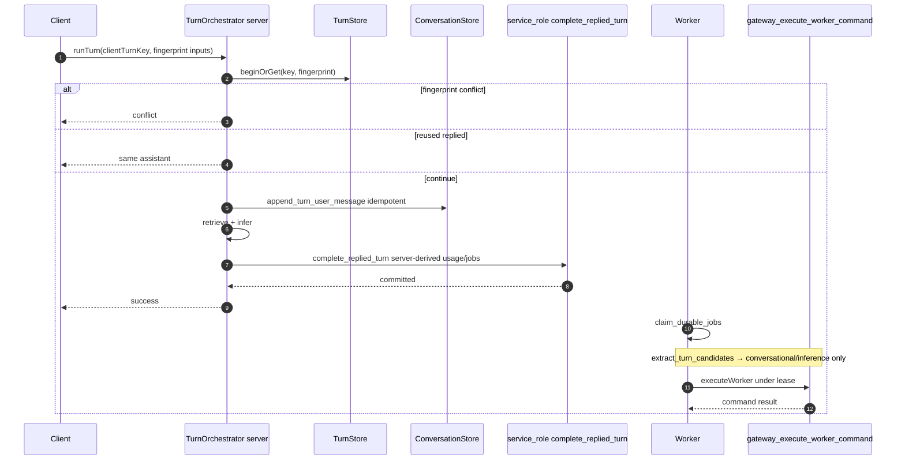

---

## 21. Usage and billing coordination model

Reuse `usage_events`, `credit_*`, `plan_usage_periods`.

1. `conversation_turns.usage_request_id` links settlement.  
2. Turn-idempotent plan recording keyed by turn_id.  
3. Completion RPC finalises usage or inserts repair obligation.  
4. Retries with same client turn key reuse the same turn and usage identity.  
5. Browser cannot supply arbitrary usage drafts.

---

## 22. Durable work / outbox model

### Job types

`extract_turn_candidates`, `extract_document_candidates`, `embed_assertion`, `embed_document_chunk`, `sync_external_index`, `delete_step`, `usage_repair`, `rebuild_fts`, `reconcile_external_index`, `transition_temporal`, `compat_projection_sync`, `quarantine_forbidden_secret`

### Job → worker command ownership (summary)

| job_type | Allowed worker commands | Forbidden |
| --- | --- | --- |
| `extract_turn_candidates` | `conversational_candidate`, `inference_candidate` | `document_candidate`; any embedding result command |
| `extract_document_candidates` | `document_candidate` | conversational/inference candidates; any embedding result command |
| `embed_assertion` | `mark_assertion_embedding_result` | `mark_document_chunk_embedding_result`; candidate creation |
| `embed_document_chunk` | `mark_document_chunk_embedding_result` | `mark_assertion_embedding_result`; candidate creation |

### Claim semantics

RPC `claim_durable_jobs(p_limit, p_worker_id, p_lease_seconds)` using `FOR UPDATE SKIP LOCKED`, DEFINER, `search_path=public`, EXECUTE service_role only.

Registration only from Gateway DEFINER RPCs or backend completion. Worker ingestion via `gateway_execute_worker_command` (§8.1.1). Payload privacy and subject CHECKs in §8.20. Vercel-compatible poller/cron/`waitUntil`-style runner — no external queue.

---

## 23. Deletion workflow model

| Scope | Steps |
| --- | --- |
| Assertion | soft-delete → purge revisions → embeddings → FTS → external → optional tombstone → complete |
| Document | chunks/embeddings → storage → nullify provenance → complete |
| Conversation | messages/sessions under ownership → influence → complete |
| Account | assertions → documents/storage → BYOK → external → commercial/legal waits → audit anonymise → auth_delete last → complete |

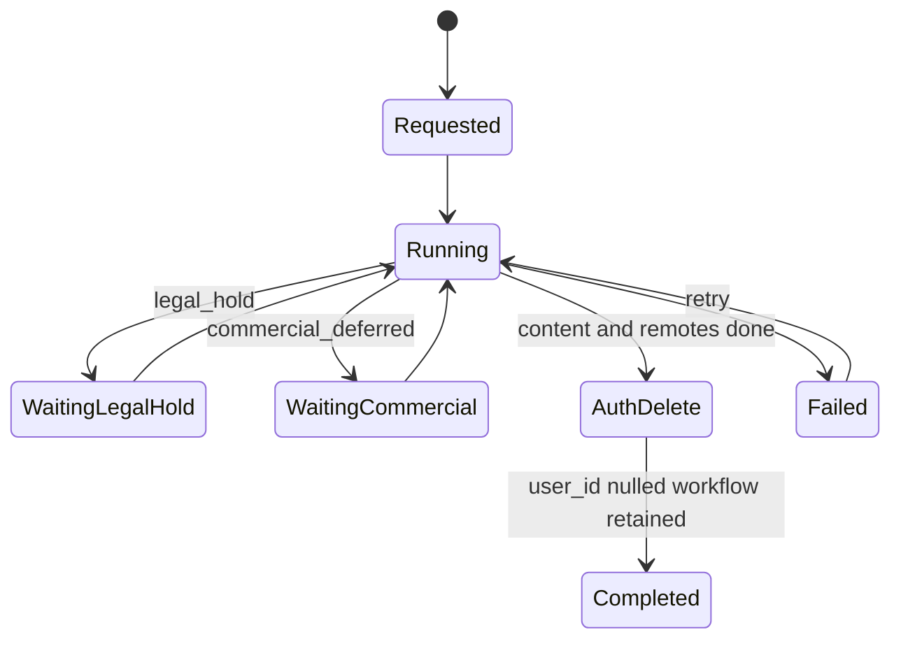

Visible status from `deletion_workflows.visible_status`. Legal/commercial deferrals use `waiting_*` states and step `skipped` + reason code — periods Deferred.

---

## 24. Explainability and influence records

`response_influence_records` store what was selected into context. Thinking UI reads by `turn_id` / `assistant_message_id`. Eligibility snapshot stores filter outcomes without raw secret material. `audit_log` remains operational; influence records are the user-facing provenance source. Intake links explain which assertions came from which intake decision.

---

## 25. Service architecture

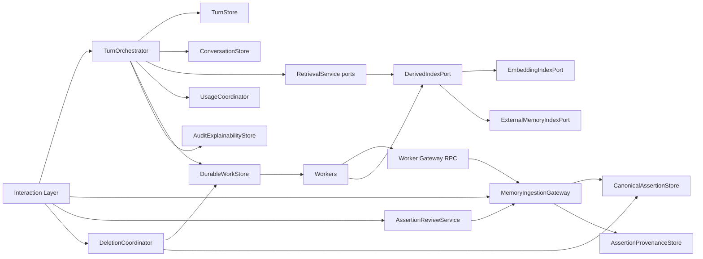

Interaction Layer never holds service_role in the browser. Next.js server uses service_role only for completion and workers.

## 26. Exact service interfaces

```ts
type UserId = string;
type IdempotencyKey = string;
type JobId = string;
type WorkerId = string;

type ServiceError =
  | { code: "unauthorized" }
  | { code: "forbidden" }
  | { code: "not_found" }
  | { code: "conflict"; current?: unknown }
  | { code: "validation"; details: string[] }
  | { code: "policy_blocked"; reasonCode: string }
  | { code: "usage_unresolved" }
  | { code: "registration_failed" }
  | { code: "lease_invalid" }
  | { code: "job_mismatch" }
  | { code: "internal" };

type Tx = { /* request-scoped DB transaction handle */ };

interface TurnOrchestrator {
  /** Idempotent conversational turn. Uses server credentials for completion. */
  runTurn(input: {
    userId: UserId;
    clientTurnKey: IdempotencyKey;
    interface: "think" | "chat" | "api";
    sessionId?: string;
    message: string;
    selectionKey: string;
    attachmentIds?: string[];
  }): Promise<
    | { ok: true; turnId: string; assistantMessage: string; reused: boolean }
    | { ok: false; error: ServiceError }
  >;
  // TX: user message via append_turn_user_message; completion via complete_replied_turn (service_role)
}

type UserIngestionCommand =
  | { type: "explicit_remember"; content: string; clientCommandKey: string; sourceTurnId?: string }
  | { type: "manual_vault_create"; content: string; contentKind: string; category?: string; clientCommandKey: string }
  | { type: "onboarding_assertion"; content: string; contentKind: string; clientCommandKey: string }
  | { type: "approve_candidate"; assertionId: string; idempotencyKey: string }
  | { type: "keep_after_edit"; assertionId: string; content: string; idempotencyKey: string }
  | { type: "reject_candidate"; assertionId: string; idempotencyKey: string }
  | { type: "defer_review"; assertionId: string; idempotencyKey: string }
  | { type: "correct_assertion"; assertionId: string; content: string; mode: "changed_over_time" | "corrects_false"; idempotencyKey: string }
  | { type: "mark_historical"; assertionId: string; idempotencyKey: string }
  | { type: "repudiate"; assertionId: string; idempotencyKey: string }
  | { type: "archive"; assertionId: string; idempotencyKey: string }
  | { type: "restore"; assertionId: string; idempotencyKey: string }
  | { type: "delete"; assertionId: string; idempotencyKey: string }
  | { type: "merge_duplicate"; fromId: string; toId: string; idempotencyKey: string }
  | { type: "resolve_conflict"; assertionIds: [string, string]; resolution: "keep_a" | "keep_b" | "coexist" | "repudiate"; idempotencyKey: string }
  | { type: "import_candidate"; content: string; importBatchRef: string; priorConfirmed?: boolean; clientCommandKey: string }
  | { type: "integration_candidate"; content: string; integrationRef: string; clientCommandKey: string };

type WorkerIngestionCommand =
  | { type: "conversational_candidate"; content: string; sourceMessageId: string; turnId: string; confidence?: number; commandIdempotencyKey: string }
  | { type: "inference_candidate"; content: string; sourceMessageId: string; turnId: string; confidence?: number; commandIdempotencyKey: string }
  | { type: "document_candidate"; content: string; documentId: string; chunkId?: string; commandIdempotencyKey: string }
  | { type: "transition_temporal"; assertionId: string; phase: string; commandIdempotencyKey: string }
  | {
      type: "mark_assertion_embedding_result";
      assertionId: string;
      revisionId: string;
      embeddingSpace: string;
      state: "ready" | "failed";
      /** Required when state='ready'; exactly 1536 finite numbers. Absent/null when state='failed'. */
      embedding?: number[];
      errorCode?: string;
      commandIdempotencyKey: string;
    }
  | {
      type: "mark_document_chunk_embedding_result";
      documentId: string;
      chunkId: string;
      contentSha256: string;
      embeddingSpace: string;
      state: "ready" | "failed";
      /** Required when state='ready'; exactly 1536 finite numbers. Absent/null when state='failed'. */
      embedding?: number[];
      errorCode?: string;
      commandIdempotencyKey: string;
    };

type IngestionResult = {
  intakeDecisionId?: string;
  assertionResults: Array<{
    assertionId?: string;
    relationRole?: "accepted_core" | "candidate_extra";
    trust?: "candidate" | "trusted" | "distrusted";
    reviewState?: string;
    disclosure?: {
      allowInference: boolean;
      allowEmbedding: boolean;
      allowExternalIndex: boolean;
    };
    blocked?: { reasonCode: string };
  }>;
  partial: boolean;
};

interface MemoryIngestionGateway {
  /** User JWT path → gateway_execute_command DEFINER with auth.uid check. */
  executeUser(command: UserIngestionCommand & { userId: UserId }): Promise<
    IngestionResult | { ok: false; error: ServiceError }
  >;
  /** Worker service_role path → gateway_execute_worker_command. */
  executeWorker(input: {
    jobId: JobId;
    workerId: WorkerId;
    userId: UserId;
    command: WorkerIngestionCommand;
  }): Promise<IngestionResult | { ok: false; error: ServiceError }>;
}

interface CanonicalAssertionStore {
  get(userId: UserId, id: string): Promise<AssertionRow | null>;
  list(userId: UserId, query: AssertionListQuery): Promise<AssertionRow[]>;
  /** Called only inside Gateway RPCs / trusted TX. */
  insertCurrent(tx: Tx, row: AssertionInsert): Promise<AssertionRow>;
  updateCurrent(tx: Tx, patch: AssertionPatch): Promise<AssertionRow>;
}

interface AssertionReviewService {
  approve(input: { userId: UserId; assertionId: string; idempotencyKey: string }): Promise<IngestionResult | { ok: false; error: ServiceError }>;
  reject(input: { userId: UserId; assertionId: string; idempotencyKey: string }): Promise<IngestionResult | { ok: false; error: ServiceError }>;
  defer(input: { userId: UserId; assertionId: string; idempotencyKey: string }): Promise<IngestionResult | { ok: false; error: ServiceError }>;
  keepAfterEdit(input: { userId: UserId; assertionId: string; content: string; idempotencyKey: string }): Promise<IngestionResult | { ok: false; error: ServiceError }>;
}

interface AssertionProvenanceStore {
  add(tx: Tx, row: ProvenanceInsert): Promise<void>;
  listForAssertion(userId: UserId, assertionId: string): Promise<ProvenanceRow[]>;
}

interface RetrievalServicePersistence {
  loadEligibleByIds(userId: UserId, ids: string[]): Promise<EligibleAssertion[]>;
  searchEmbeddingCandidates(userId: UserId, space: string, vector: number[], limit: number): Promise<SearchHit[]>;
  // Ranking Deferred Stage 12
}

interface DerivedIndexPort {
  enqueueRebuild(tx: Tx, input: { userId: UserId; assertionId: string; reason: string }): Promise<void>;
}
interface EmbeddingIndexPort {
  /**
   * Worker-facing API: build the mark_*_embedding_result command (including embedding vector on ready)
   * and invoke MemoryIngestionGateway.executeWorker. Must not write tables directly.
   */
  completeAssertionEmbedding(input: {
    jobId: JobId;
    workerId: WorkerId;
    userId: UserId;
    assertionId: string;
    revisionId: string;
    embeddingSpace: string;
    state: "ready" | "failed";
    embedding?: number[];
    errorCode?: string;
    commandIdempotencyKey: string;
  }): Promise<{ assertionId: string; state: string } | { ok: false; error: ServiceError }>;
  completeDocumentChunkEmbedding(input: {
    jobId: JobId;
    workerId: WorkerId;
    userId: UserId;
    documentId: string;
    chunkId: string;
    contentSha256: string;
    embeddingSpace: string;
    state: "ready" | "failed";
    embedding?: number[];
    errorCode?: string;
    commandIdempotencyKey: string;
  }): Promise<{ chunkId: string; state: string } | { ok: false; error: ServiceError }>;
  /** Internal producer helper: mark rows stale and register rebuild jobs — never persists a vector. */
  markAssertionStale(input: { userId: UserId; assertionId: string }): Promise<void>;
}
interface ExternalMemoryIndexPort {
  sync(input: { userId: UserId; assertionId: string }): Promise<void>;
  remove(input: { userId: UserId; assertionId: string }): Promise<void>;
  search(input: { userId: UserId; query: string; limit: number }): Promise<Array<{ externalId: string }>>;
}

interface ConversationStore {
  getOrCreateSession(input: { userId: string; sessionId?: string | null; selectionKey: string; title: string }): Promise<string>;
  getHistory(sessionId: string, limit: number): Promise<Array<{ role: string; content: string }>>;
  appendUserMessage(input: { sessionId: string; userId: string; content: string; turnId: string }): Promise<{ messageId: string }>;
  // Assistant persistence occurs inside complete_replied_turn, not as a public store write from routes
}

interface TurnStore {
  beginOrGet(input: {
    userId: UserId;
    clientTurnKey: string;
    requestFingerprint: string;
    interface: string;
    sessionId?: string;
    selectionKey: string;
  }): Promise<{ turn: TurnRow; reused: boolean } | { ok: false; error: ServiceError }>;
  markDenied(tx: Tx, turnId: string, code: string): Promise<void>;
  attachMessages(tx: Tx, input: { turnId: string; userMessageId?: string; assistantMessageId?: string }): Promise<void>;
}

interface UsageCoordinator {
  reserveOrGate(input: { userId: UserId; turnId: string; selectionKey: string }): Promise<GateResult>;
  finalizeInTx(tx: Tx, input: { userId: UserId; turnId: string; draft: UsageDraft }): Promise<{ usageRequestId: string }>;
  recordRepairObligationInTx(tx: Tx, input: { userId: UserId; turnId: string; reasonCode: string; payload: object }): Promise<void>;
}

interface DurableWorkStore {
  registerInTx(tx: Tx, jobs: NewJob[]): Promise<void>;
  claim(workerId: WorkerId, limit: number): Promise<Job[]>;
  complete(jobId: JobId, workerId: WorkerId): Promise<void>;
  fail(jobId: JobId, workerId: WorkerId, errorCode: string): Promise<void>;
}

interface DeletionCoordinator {
  start(input: { userId: UserId; scopeType: string; scopeId?: string; idempotencyKey: string }): Promise<{ workflowId: string }>;
  get(userId: UserId, workflowId: string): Promise<DeletionWorkflow>;
}

interface AuditExplainabilityStore {
  writeAudit(event: { userId?: UserId; action: string; entityType?: string; entityId?: string; metadata: object }): Promise<void>;
  recordInfluences(tx: Tx, rows: InfluenceRow[]): Promise<void>;
  listInfluences(userId: UserId, turnId: string): Promise<InfluenceRow[]>;
}
```

### Interface credentials and transaction expectations

| Interface | Credential | TX expectation | Forbidden leaks | Current relationship |
| --- | --- | --- | --- | --- |
| TurnOrchestrator | Next.js server; SR for completion | beginOrGet → user msg → infer → complete_replied_turn one commit | provider SDKs to clients | Replaces `runChatOrchestrator` + Think turn path |
| MemoryIngestionGateway.executeUser | User JWT → DEFINER RPC | Single TX: intake + assertions + links + command_results + jobs | extraction vendor details | Absorbs Think/API user writes |
| MemoryIngestionGateway.executeWorker | service_role → worker RPC | Single TX bound to leased job | cannot set user_asserted | New; absorbs async extraction |
| CanonicalAssertionStore | Inside Gateway RPCs only | Part of Gateway TX | Mem0 ids as semantics | Splits `MemoryProvider.insert` row side |
| AssertionReviewService | User JWT via Gateway | Review RPC TX | — | Replaces review PATCH status flips |
| AssertionProvenanceStore | Inside Gateway TX | Same TX as assertion write | raw bodies | New |
| Retrieval persistence | User RLS SELECT / INVOKER RPC | Read-only | ranking constants | Ports for Stage 12 |
| EmbeddingIndexPort | Worker SR → executeWorker with embedding in command | Single Gateway TX writes vector+state | cross-space compare; naive pad/truncate; cross-table writes; split vector-then-ready; vectors in jobs/results/logs | Splits `reembed`; no direct table writes |
| ExternalMemoryIndexPort | Worker SR | Job TX | remote text as authority | Wraps Mem0 |
| ConversationStore | User/server RPCs | Idempotent user message | — | Extended with turn_id |
| TurnStore | User JWT DEFINER for begin/append | Fingerprint conflict detection | — | New |
| UsageCoordinator | Server-only | Inside completion TX | prompt text | Wraps meter/settle |
| DurableWorkStore | Register in producer TX; claim SR | SKIP LOCKED claim | raw secrets in payload | New |
| DeletionCoordinator | User start DEFINER; steps SR | Workflow survives Auth | — | Replaces account route sequence |
| AuditExplainabilityStore | SR for audit write | Influence in completion TX | raw private content | Extends audit + influence |

---

## 27. Ingestion command model

### User commands

Listed as `UserIngestionCommand` in §26. Partial outcomes are first-class:

- clear user-asserted core → trusted (`accepted_core` link)  
- model-added assertions → candidates (`candidate_extra` link)  
- forbidden content → `memory_intake_decisions(outcome='blocked')` only  
- sensitive allowed content → saved with restricted disclosure flags  

Gateway does not invent the split algorithm; Processing Pipeline (Stage 10) supplies structured payloads to user or worker commands.

### Worker commands

Listed as `WorkerIngestionCommand`. Always produce candidates or embedding/temporal result updates. Never `user_asserted`, `user_confirmed`, or trusted memory.

| Command | Job type | Effect domain |
| --- | --- | --- |
| `conversational_candidate` / `inference_candidate` | `extract_turn_candidates` | candidate assertions with chat/turn provenance only |
| `document_candidate` | `extract_document_candidates` | candidate assertions with document/chunk provenance only |
| `mark_assertion_embedding_result` | `embed_assertion` | `memory_embeddings` only; carries `embedding?: number[]` for ready |
| `mark_document_chunk_embedding_result` | `embed_document_chunk` | `document_chunk_embeddings` only; carries `embedding?: number[]` for ready |
| `transition_temporal` | `transition_temporal` | temporal fields only |

There is no shared `mark_embedding_metadata` command; assertion and chunk embedding results are distinct types so a leased job cannot update the wrong derived table. Ready results require a 1,536-d finite vector in the command; failed results omit the vector and require `errorCode`. The RPC converts the JSON array to `vector(1536)` and commits vector+state together. Idempotent replay returns ids/state only — not the vector.

### Results and errors

`IngestionResult` carries `intakeDecisionId`, per-assertion results, and `partial`. Embedding result commands return a narrow result (`assertionId`/`chunkId` + `state` + optional `errorCode`) stored in `result_json` — never the vector. Errors use `ServiceError` tagged union. Idempotent replay with the same `(user_id, command_idempotency_key)` returns the prior `memory_command_results.result_json` without duplicate rows or vector replay.

---

## 28. Transaction ownership matrix

| Workflow | Owner | Credential | Tables written | Locks / uniqueness | Idempotency | Commit | Failure | Retry |
| --- | --- | --- | --- | --- | --- | --- | --- | --- |
| Explicit remember one clear | Gateway | user JWT DEFINER | intake, intake_assertion links, assertions, revisions, provenance, disclosure, jobs, command_results | `(user_id, command_key)` | command key | after all | error | same key |
| Remember + extras | Gateway | user JWT DEFINER | multiple assertions + links | same | command key | same | partial codes | same key |
| Chat candidate registration | Worker → worker Gateway | service_role | intake, links, conversational/inference candidate assertions… | leased `extract_turn_candidates` + turn subject | job/command key | job TX | retry/DLQ | replay |
| Document candidate registration | Worker → worker Gateway | service_role | intake, links, document_candidate assertions + provenance | leased `extract_document_candidates` + document or chunk subject | job/command key | job TX | retry/DLQ | replay |
| Assertion embedding result | Worker → worker Gateway | service_role | `memory_embeddings.embedding` + state/error (+ command_results ids/state) | leased `embed_assertion` + assertion/revision/space + 1536-d vector (ready) or errorCode (failed) | command key | **one TX**: validate then write vector+state; no pre-write | retry/DLQ | replay ids/state only |
| Document-chunk embedding result | Worker → worker Gateway | service_role | `document_chunk_embeddings.embedding` + state/error (+ command_results ids/state) | leased `embed_document_chunk` + chunk/document/fingerprint/space + 1536-d vector (ready) or errorCode (failed) | command key | **one TX**: validate then write vector+state; no pre-write | retry/DLQ | replay ids/state only |
| Approve/reject/defer | Review RPC | user JWT DEFINER | assertion, decision | pending check | `(user_id, assertion_id, key)` | RPC | conflict | same key |
| Correction | Gateway | user JWT DEFINER | assertions, links, revisions | active link unique | command key | RPC | conflict | same key |
| Mark historical / repudiate / archive | Gateway | user JWT DEFINER | assertion (+decision) | row lock | command key | TX | error | same key |
| Assertion/document delete start | Deletion RPC | user JWT DEFINER | workflow/steps + soft delete | `(user_id,key)` + `(subject_ref,key)` | workflow key | TX | failed | resume |
| Re-embed / ext sync register | Gateway | DEFINER | stale + job | `(user_id,key)` / subject_ref | job key | TX | error | replay |
| User message append | TurnStore RPC | user JWT DEFINER | chat_messages | turn+role unique | turn | TX | conflict→fetch | same turn |
| Replied turn completion | TurnOrchestrator | **service_role only** | turns, messages, influence, usage/repair, jobs | client_turn_key | client_turn_key | single TX | no success | same key+fingerprint |
| Usage repair | Worker | SR | usage/credits/plan | `(user_id, obligation key)` | obligation key | TX | DLQ | replay |
| Forbidden-secret reclassify | system RPC | SR | disclosure quarantine, soft-delete, workflow, jobs | assertion row | system key | TX | retry | resume |
| Account deletion | DeletionCoordinator | start user DEFINER; steps SR | workflows survive Auth | subject_ref keys | workflow key | stepwise | visible | resume |
| Worker command replay | Worker Gateway | SR | none if result exists | command_results PK | command key | return prior | — | safe |

---

## 29. RPC / function catalogue

| Name | Caller | Auth / grants | Security | Ownership validation | Notes |
| --- | --- | --- | --- | --- | --- |
| `complete_replied_turn` | TurnOrchestrator server | **EXECUTE service_role only** | DEFINER, `search_path=public` | turn.user_id = p_user_id; fingerprint/state checks | Server-derived usage/jobs/influences only |
| `append_turn_user_message` | TurnStore | authenticated EXECUTE | DEFINER | `auth.uid()=p_user_id` | Idempotent per turn |
| `begin_or_get_turn` | TurnStore | authenticated EXECUTE | DEFINER | uid | Fingerprint conflict → raise |
| `gateway_execute_command` | Gateway user path | authenticated EXECUTE | DEFINER | uid | Dispatches UserIngestionCommand |
| `gateway_execute_worker_command` | Worker | **EXECUTE service_role only** | DEFINER | leased job + user/subject/type matrix (§8.1.1) | Cannot create user_asserted/trusted; turn extract ≠ document extract; assertion embed ≠ chunk embed; ready embeddings validate/convert JSON array → `vector(1536)` atomically with state |
| `approve_memory_candidate` | Review | authenticated EXECUTE | DEFINER | uid + row owner | pending only |
| `reject_memory_candidate` / `defer_memory_candidate` | Review | authenticated | DEFINER | uid | |
| `correct_memory_assertion` | Gateway | authenticated | DEFINER | uid | |
| `quarantine_forbidden_secret_assertion` | System/worker | service_role | DEFINER | verified assertion owner | Quarantine + deletion start; no raw content copy |
| `start_deletion_workflow` | DeletionCoordinator | authenticated | DEFINER | uid | Creates surviving workflow with subject_ref |
| `claim_durable_jobs` | Worker | service_role | DEFINER SKIP LOCKED | N/A | |
| `complete_durable_job` / `fail_durable_job` | Worker | service_role | DEFINER | lease owner | |
| `reconcile_assertions_by_ids` | Retrieval | authenticated | **INVOKER** | uid via RLS | read-only |
| `match_memory_embeddings` | Retrieval | authenticated | INVOKER | uid | space pinned; eligible join |

**INVOKER** reserved for read-only paths that rely on RLS SELECT grants.  
**DEFINER** required for mutations because tables lack INSERT/UPDATE grants.

Legacy `match_memories` retained during coexistence; not authoritative after cutover.

### `complete_replied_turn` allowed inputs (server-derived)

| Field | Source |
| --- | --- |
| `p_user_id`, `p_turn_id` | Server session + TurnStore |
| `p_assistant_content`, `p_model` | Inference result |
| `p_usage_draft` | Metering from provider response — not client JSON |
| `p_influence_rows` | Retrieval selection |
| `p_required_jobs` | Allowlisted server descriptors |

Browser may only call HTTP `runTurn` with message + clientTurnKey + session + selection (+ attachments).

### `gateway_execute_worker_command` allowed inputs

| Field | Source |
| --- | --- |
| `p_job_id`, `p_worker_id` | Claim lease |
| `p_user_id` | Must equal job.user_id |
| `p_command` | Allowlisted worker command only; embedding result commands may include `embedding` JSON number array |
| `p_command_idempotency_key` | Under `(user_id, key)` |

**Embedding result validation (inside RPC):**

| `state` | Required | Forbidden | Atomic write |
| --- | --- | --- | --- |
| `ready` | `embedding` length 1536 all finite; active space; current revision or chunk fingerprint; `errorCode` null | missing/short/long/non-finite vector | convert JSON → `vector(1536)` + `state='ready'` + `error_code=NULL` together |
| `failed` | `errorCode` | non-null `embedding` | set `state='failed'` + `error_code` without writing `embedding`; reject if subject revision/fingerprint stale rather than clobbering a valid ready row |

Arbitrary commercial payloads, trust upgrades to `user_asserted`/`user_confirmed`, document candidates under turn jobs, conversational candidates under document jobs, assertion-embedding results under chunk jobs (or vice versa), vectors in job payloads/result_json, or unrelated job types are rejected.

---

## 30. RLS and grants matrix

Legend: ✓ allowed for own rows via `auth.uid() = user_id`; ✗ denied; SR = service_role; W = worker via SR RPCs.

| Table | RLS | Auth SEL | Auth INS/UPD/DEL | SR/W | Policy predicate | Parent ownership | Direct writes |
| --- | --- | --- | --- | --- | --- | --- | --- |
| memory_assertions | ✓ | own | **✗** | ✓ via RPC | own user_id | N/A | RPC-only mutate |
| memory_assertion_revisions | ✓ | own | ✗ | ✓ | own | composite FK | RPC-only |
| memory_review_decisions | ✓ | own | ✗ | ✓ | own | composite FK | RPC-only |
| memory_assertion_provenance | ✓ | own | ✗ | ✓ | own | validated source owner | RPC-only |
| memory_assertion_links | ✓ | own | ✗ | ✓ | own | composite both ends | RPC-only |
| memory_disclosure_policies | ✓ | own | ✗ | ✓ | own | composite FK | RPC-only |
| memory_intake_decisions | ✓ | own | ✗ | ✓ | own | turn composite optional | RPC-only |
| memory_intake_decision_assertions | ✓ | own | ✗ | ✓ | own | composite FKs both ends | RPC-only |
| memory_command_results | ✓ | own | ✗ | ✓ | own | `(user_id, key)` | RPC-only |
| embedding_spaces | ✓ | active | ✗ | ✓ | active flag | N/A | SR mutate |
| memory_embeddings | ✓ | own | ✗ | ✓ W via `mark_assertion_embedding_result` only (vector+state atomic) | own | revision triple | no client/direct SR writes; not writable by chunk-embed jobs; ready ⇒ 1536-d vector present |
| memory_fts_documents | ✓ | own | ✗ | ✓ W | own | revision triple | no client writes |
| external_memory_index_entries | ✓ | own | ✗ | ✓ W | own | revision triple | no client writes |
| document_chunk_embeddings | ✓ | own | ✗ | ✓ W via `mark_document_chunk_embedding_result` only (vector+state atomic) | own | composite FKs | no client/direct SR writes; not writable by assertion-embed jobs; ready ⇒ 1536-d vector present |
| conversation_turns | ✓ | own | ✗ | ✓ | own | session composite | RPC/completion |
| turn_inference_attempts | ✓ | own | ✗ | ✓ | own | turn composite | backend |
| usage_repair_obligations | ✓ | own | ✗ | ✓ | own | turn composite | completion/W |
| durable_jobs | ✓ | own optional | ✗ | ✓ W | own if user_id | subject_ref durable | register RPC; claim SR |
| deletion_workflows | ✓ | own if user_id | ✗ | ✓ | own if user_id | subject_ref | RPC |
| deletion_workflow_steps | ✓ | via workflow | ✗ | ✓ | workflow | subject_ref | W |
| response_influence_records | ✓ | own | ✗ | ✓ | own | composites | completion only |
| chat_messages (target) | ✓ | own | ✗ direct | ✓ | own | session+turn composites | append RPC |
| documents / chunks | ✓ | own | limited→RPC | ✓ | own | composite FKs | upgraded |
| memories compat | ✓ | own | **adapter RPC only** | ✓ | own | projection | adapter only |
| usage_events / credits / plan | ✓ | SEL | SR/RPC | ✓ | own SEL | existing | unchanged posture |
| audit_log | ✓ | SEL | SR | ✓ | own SEL | existing | codes only |
| workspaces | ✓ | member | owner | ✓ | existing | **no memory grants** | unchanged |

Admin tables remain service-role / admin-RBAC as today and are out of personal-memory scope.

**Security property:** workspace membership never appears in memory policy predicates.

---

## 31. Index strategy

| Need | Index |
| --- | --- |
| Vault list | `(user_id, organisation, retention, created_at DESC)` |
| Review queue | partial `(user_id, created_at DESC)` WHERE `trust='candidate' AND review_state IN ('pending','deferred') AND retention='present'` |
| Retrieval prefilter | `(user_id, trust, retention, organisation, succession_state, temporal_phase)` |
| Vector | ivfflat/hnsw on `memory_embeddings.embedding` WHERE `state='ready'` |
| FTS | GIN on `memory_fts_documents.document` |
| Jobs | pending/leased partial indexes; unique `(user_id, idempotency_key)` WHERE user_id NOT NULL; unique `(subject_ref, idempotency_key)` |
| Turns | unique `(user_id, client_turn_key)` |
| Messages | partial uniques per turn role |
| Provenance by source | `(user_id, source_chat_message_id)`, `(user_id, source_document_id)` |
| Intake links | `(user_id, assertion_id)`, `(user_id, intake_decision_id)` |
| Pins | `(user_id, pinned_at DESC NULLS LAST)` WHERE present |
| Deletion | `(workflow_id, state)`; unique `(subject_ref, idempotency_key)` |

---

## 32. Retrieval persistence contract

Stage 12 consumes these canonical fields/filters; it does not bypass them.

1. User ownership  
2. Trust  
3. Review outcome  
4. Temporal phase  
5. Temporal bounds (+ derived expired)  
6. Claim modality  
7. Organisation  
8. Retention  
9. Succession  
10. Conflict (via succession_state + links)  
11. Sensitivity class (stored; never forbidden_secret)  
12. Disclosure decisions / quarantine  
13. Pin  
14. Scope labels  
15. Content revision  
16. Embedding version/space/state  
17. Provenance identifiers  

| Object | Meaning |
| --- | --- |
| Search hit | Raw id+score from embedding/FTS/external |
| Canonically reconciled candidate | Hit mapped to assertion row |
| Retrieval-eligible assertion | Passes Stage 8 gate using canonical fields |
| Selected context item | Chosen by Stage 12 packing |
| Durable influence record | Persisted selected item |

No stored `is_eligible` authority column. Always exclude `retention IN ('deleted','purge_pending','purged')`, quarantined rows, candidates/rejected/distrusted as trusted truth, archived by default, superseded heads, unresolved conflicts as settled simultaneous facts, disclosure-denied for inference, stale embedding spaces, unreconciled external hits. Compatibility projection never emits purged tombstones.

---

## 33. Current-to-target component mapping

| Component | Fate |
| --- | --- |
| `memories` | Wrapped as compatibility projection; retired as authority after cutover |
| Legacy enums | Preserved for projection; retired later |
| `match_memories` | Replaced by `match_memory_embeddings` + reconcile; kept during coexistence |
| `message_context` | Replaced by `response_influence_records` after backfill window |
| `audit_log` | Preserved with stricter metadata rules |
| `MemoryProvider` | Split/wrapped into CAS + EmbeddingIndexPort + ExternalMemoryIndexPort |
| `SupabaseMemoryProvider` | Extended into EmbeddingIndexPort + CAS adapter |
| `Mem0MemoryProvider` | Wrapped as ExternalMemoryIndexPort |
| `ConversationStore` | Extended (returns message ids; turn linkage; idempotent user append) |
| `runChatOrchestrator` | Replaced by TurnOrchestrator |
| Think memory handlers | Replaced by Gateway user commands |
| Memory API routes | Thin HTTP wrappers over Gateway user path |
| Review queue | Extended to `review_state` / trust |
| Documents + retrieve | Preserved; ownership FKs upgraded; chunk embeddings versioned |
| Inference metering tables | Preserved; turn-linked |
| Plan usage tables | Extended for turn idempotency |
| Account deletion route | Replaced by DeletionCoordinator |
| Export format | Extended to export assertions (+ legacy fields during coexistence) |
| Async extraction | Worker path via `gateway_execute_worker_command` |

---

## 34. Legacy row mapping

| Legacy | Target | Rule |
| --- | --- | --- |
| type `profile` | `content_kind=identity` | Old enum proves profile/identity bucket (Stage 8 successor mapping) |
| type `preference` | `content_kind=preference` | Direct |
| type `semantic` | `content_kind=knowledge` | Stage 8 successor mapping only |
| type `episodic` | `content_kind=event` | Stage 8 successor mapping only |
| type `project` | `content_kind=project_context` | Stage 8 successor mapping only |
| type `temporary` | `content_kind=legacy_unknown` | Does **not** prove `knowledge` |
| `expires_at` present | copy; bounds `expiry_ruled` | Only when non-null; do not invent expiry |
| `expires_at` null on temporary | bounds `unbounded` | No invented TTL |
| status `active` | `trust=trusted`, `authority_source=legacy_migrated`, `review_state=none`, org visible, retention present | **Not** `user_asserted` / `user_confirmed` |
| `proposed` | `trust=candidate`, `review_state=pending` | No invented review decision row |
| `rejected` | `trust=candidate`, `review_state=rejected` | **Not** distrusted |
| `superseded` | `trust=trusted`, `succession_state=superseded`, `authority_source=legacy_migrated` | No invented correction links |
| `archived` | `organisation=archived`, `trust=trusted`, `authority_source=legacy_migrated` | |
| `deleted` | `retention=deleted` | |
| source `manual` | `origin_class=legacy_unknown` | Includes Think auto-active; **not** explicit_remember |
| `chat_extraction` | `origin_class=conversational_inference` | Enum proves extraction path only |
| `document` / `onboarding` / `import` | matching origin_class | |
| embeddings | `embedding_space=legacy-unlabeled-1536`, `state=ready` | |
| `is_sensitive=true` | `sensitivity_class=highly_sensitive`, conservative disclosure | never forbidden_secret class on stored row |
| `pinned_at` / `confidence` / `category` | copy | |
| review decisions / correction links / confirmation events | **do not invent** | `migration_note` may record `backfilled_from_memories` |

Projection may expose legacy `type`/`status`/`source` for old UI without claiming new authority history. New product and worker RPCs reject `legacy_unknown` / `legacy_migrated` inputs.

---

## 35. Coexistence and migration design

### Selected strategy

**Additive new tables + write-through Gateway adapter + dual-read + backfill + staged cutover.**

| Strategy | Role |
| --- | --- |
| Alter existing only | Rejected as sole long-term model |
| New tables + compatibility projection | Selected core |
| Dual-read | Selected during transition |
| Dual-write / write-through adapter | Selected until cutover |
| Backfill + cutover | Selected |
| Shadow validation | Selected before cutover |
| Legacy projection status | Selected |
| Forever dual-write | Rejected |

### Rules

1. Preserve memory UUIDs as assertion ids.  
2. Do not invent provenance, expiry, or trust history.  
3. Compatibility projection exposes legacy columns from assertions.  
4. Think and Chat both move behind TurnOrchestrator before either old path is removed.  
5. Rollback: keep `memories` projection populated and readable.  
6. Validation concepts: count mismatches projection vs canonical; orphan embeddings; zero cross-user composite FK violations; replied turns without assistant = 0; replied turns without usage/repair (except direct_answer) = 0; no stored disclosure rows with impossible forbidden_secret class; intake links same-user.  
7. Old enums retired only after API/UI cutover.  
8. Initially drop nothing: keep `match_memories`, `message_context`, legacy grants.  
9. Compatibility projections are not canonical authority.  
10. Adapter is the only writer to `memories` projection.

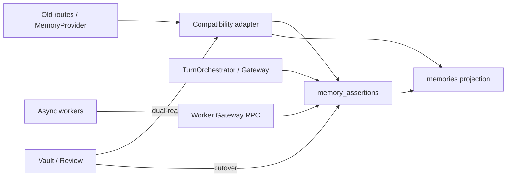

## 36. Security analysis

| # | Threat | DB protection | Service protection | Remaining risk | Later dependency |
| --- | --- | --- | --- | --- | --- |
| 1 | Cross-user parent refs | Composite / validated FKs | Gateway checks | Mis-migrated legacy rows | Data repair |
| 2 | Direct trust grant via PostgREST | No INS/UPD grants; DEFINER RPCs | Gateway | Grant drift | Ops review |
| 3 | Fabricated complete_replied_turn | service_role only | Server-derived payloads | SR exfiltration | Stage 15 |
| 4 | Worker forging user_asserted | Worker RPC authority ban + CHECKs | Allowlisted commands | Bug in allowlist | Stage 15 |
| 4a | Turn extract forging document candidate | job_type→command allowlist; provenance checks | Worker Gateway | Mis-typed job registration | Stage 15 |
| 4b | Document extract forging conversational candidate | job_type→command allowlist; turn subject required for chat cmds | Worker Gateway | Mis-typed job registration | Stage 15 |
| 4c | Assertion embed mutating chunk embedding | split embedding commands + subject checks | Worker Gateway | Shared helper bug | Stage 15 |
| 4d | Chunk embed mutating assertion embedding | split embedding commands + subject checks | Worker Gateway | Shared helper bug | Stage 15 |
| 4e | Ready embed for stale revision/fingerprint | current_revision_id / contentSha256 checks on ready | Worker Gateway | Race vs content change | tests |
| 4f | Ready without vector / wrong dim | RPC requires 1536 finite values; convert in TX | Worker Gateway | malformed provider output | tests |
| 4g | Split write: vector then mark ready | Forbidden; sole write path is atomic command | EmbeddingIndexPort → executeWorker only | bug writing tables directly | Stage 15 |
| 4h | Vector leaked to jobs/results/logs | payload/result_json/audit allowlists exclude vectors | redaction + schema checks | accidental field copy | lint/tests |
| 4i | Failed command clears valid ready vector | failed path does not write embedding; stale subject rejected | Worker Gateway | race mishandling | tests |
| 5 | Worker using unleased job | Lease verification | claim/execute coupling | Clock skew on lease | Ops |
| 6 | Forged actor UUID | actor_kind + owner equality CHECKs | RPC sets actor | — | tests |
| 7 | Secret stored on block | intake_decisions; no forbidden_secret on disclosure enum | Gateway | Detector misses | Stage 10 |
| 8 | Secret copied to jobs/audit | payload/metadata allowlists | redaction helpers | accidental fields | lint/tests |
| 9 | Job payload leakage | schema/version + privacy rules | workers | — | Stage 15 |
| 10 | Disclosure bypass | policy checks before external send | Provider gateway | model side channels | Stages 12/13 |
| 11 | Stale external | reconcile + purged tombstones | RetrievalService | provider outage UX | Stage 12 |
| 12 | Duplicate messages/charges | turn fingerprint + message uniques + usage PK | UsageCoordinator | repair bugs | Stage 15 |
| 13 | Fingerprint mismatch reuse | conflict | TurnStore | — | tests |
| 14 | Cross-user idempotency collision | `(user_id, key)` / `(subject_ref, key)` | writers | — | tests |
| 15 | Duplicate semantic links | active unique without idempotency_key | Gateway | — | tests |
| 16 | Account delete kills workflow | user_id SET NULL; subject_ref | DeletionCoordinator | long external lag | ops |
| 17 | DEFINER abuse | uid/lease checks, search_path, min grants | No arbitrary client SQL | Grant drift | Ops review |
| 18 | Compat write bypass | adapter-only grants | disable direct legacy writes post cutover | DBA mistake | Stage 16 |
| 19 | Embedding dim confusion | registry CHECK = 1536; no naive coerce | pinned space | misregistered transform | Stage 13 |
| 20 | Workspace widening | no memory FK/policy to workspace | forbid in Gateway | future feature creep | product gate |
| 21 | Revision pointer to other assertion | triple FK | Gateway | — | tests |
| 22 | Purge leaving private text | NULL revision + delete revisions | deletion steps | — | tests |
| 23 | Intake array cross-user link | replaced by composite link table | Gateway | — | tests |
| 24 | Later forbidden-secret leave-in-place | quarantine RPC + deletion workflow | system path | detector lag | Stage 10 |

---

## 37. Architecture diagrams

### 37.1 Target ERD (core)

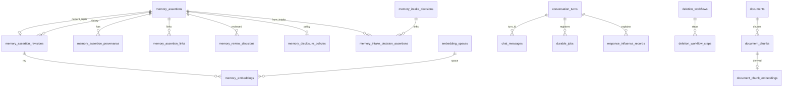

### 37.2 Canonical versus derived

See §7.

### 37.3 Service boundaries

See §25.

### 37.4 Replied-turn transaction sequence

See §20.

### 37.5 Explicit remember transaction sequence

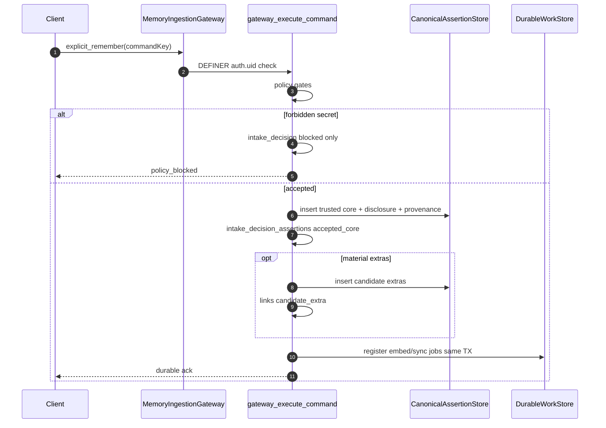

### 37.6 Candidate approval sequence

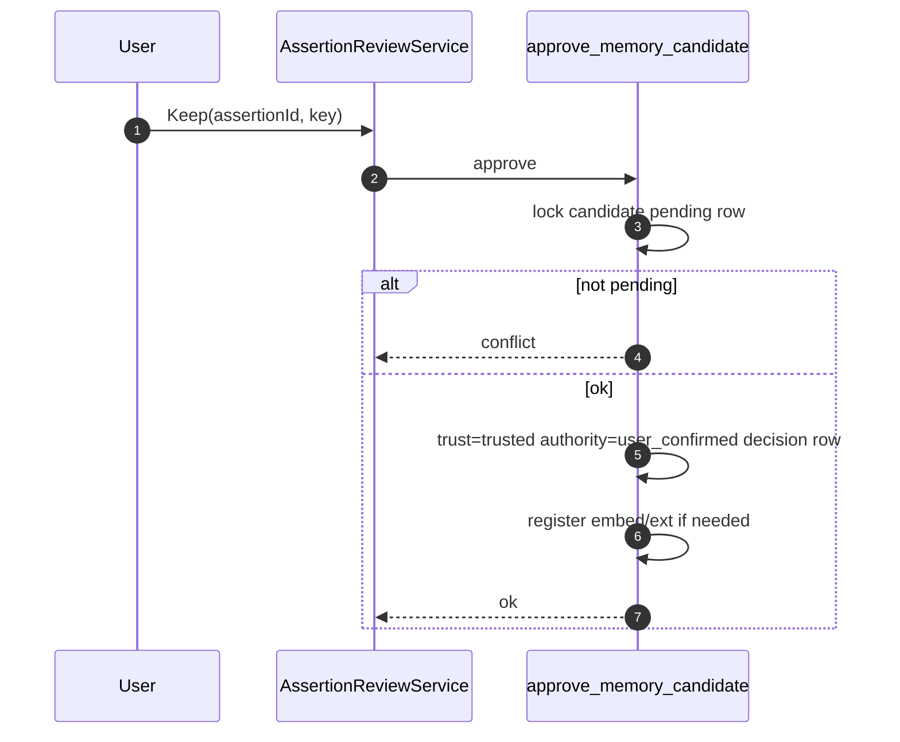

### 37.7 Correction and supersession sequence

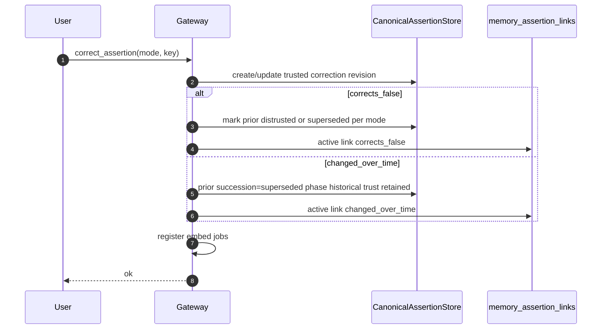

### 37.8 Outbox registration and worker execution

```mermaid
sequenceDiagram
  autonumber
  participant P as Producer TX
  participant J as durable_jobs
  participant W as Worker
  participant WG as gateway_execute_worker_command
  participant H as Idempotent handler effects

  P->>J: insert pending job unique user_id+key and subject_ref+key
  P->>P: commit
  W->>J: claim FOR UPDATE SKIP LOCKED
  W->>WG: execute allowlisted command under lease
  Note over WG: job_type gates command type + subject
  alt command result exists
    WG-->>W: prior result
  else extract_turn_candidates
    WG->>H: conversational/inference candidates only
    WG-->>W: new result
  else extract_document_candidates
    WG->>H: document_candidate only
    WG-->>W: new result
  else embed_assertion
    Note over W,WG: command carries embedding[] on ready; never in job.payload
    WG->>H: validate 1536-d vector + revision; write vector+ready atomically
    WG-->>W: result ids/state only
  else embed_document_chunk
    Note over W,WG: command carries embedding[] on ready; never in job.payload
    WG->>H: validate 1536-d vector + fingerprint; write vector+ready atomically
    WG-->>W: result ids/state only
  end
  alt success
    W->>J: succeeded
  else retryable
    W->>J: failed available_at backoff
  else exhausted
    W->>J: dead_letter
  end
```

### 37.9 Deletion workflow

See §23.

### 37.10 RLS / trust boundary

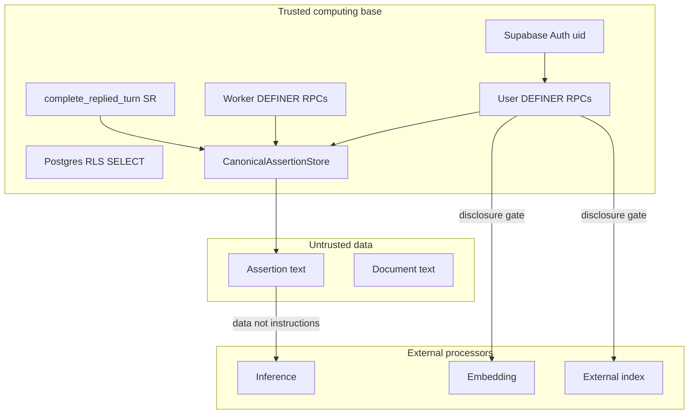

### 37.11 Current-to-target coexistence

See §35.

### 37.12 Embedding-version lifecycle

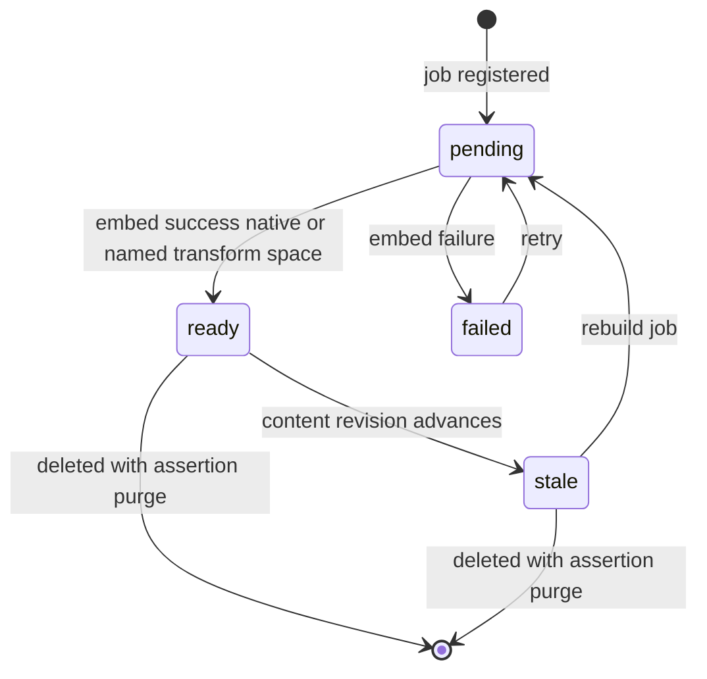

---

## 38. Database and service invariants

1. Every assertion has exactly one verified `user_id` owner; account Auth deletion occurs only after assertion purge.  
2. Candidate assertions may be canonical application data without being trusted memory.  
3. A trusted assertion has a valid authority source (`user_asserted|user_confirmed|user_corrected|legacy_migrated`).  
4. A distrusted assertion has an explicit owner_user repudiation actor and time.  
5. Review rejection does not imply distrust.  
6. Temporal phase changes do not silently alter trust.  
7. Historical assertions may remain trusted.  
8. Phase, bounds, and modality are not collapsed into one enum.  
9. Every canonical assertion mutation has provenance or an intake decision.  
10. Material model transformations cannot inherit explicit-user authority.  
11. Parent-child and source-target references cannot cross user ownership.  
12. Deleted, purge-pending, and purged assertions are never retrieval eligible.  
13. Archived assertions are excluded from default assistant retrieval.  
14. Candidate, rejected, and distrusted assertions cannot enter context as trusted truth.  
15. External index hits must reconcile to canonical state.  
16. Content changes invalidate or version prior embeddings.  
17. Incompatible embedding spaces are never queried together.  
18. External indexes are derived and rebuildable.  
19. Required turn jobs are registered before client success.  
20. Job replay cannot duplicate canonical effects.  
21. Turn retries cannot duplicate messages, charges, plan usage, or jobs.  
22. A replied turn cannot succeed without durable assistant persistence.  
23. A replied turn cannot succeed without usage finalisation or durable repair obligation (except `direct_answer=true`).  
24. A replied turn cannot succeed before its coordinated transaction commits.  
25. Storage permission and provider disclosure permission remain separate.  
26. Raw forbidden secrets do not appear in jobs, logs, assertions, disclosure rows, or errors.  
27. Documents do not become memories merely by upload.  
28. Workspaces cannot broaden personal-memory access.  
29. Normal product memory operations remain protected by RLS SELECT; mutations are RPC-only.  
30. Service-role operations require explicit verified user or job scope.  
31. Deletion remains tracked until required steps reach terminal state and survives Auth delete via subject_ref.  
32. Legacy rows are not assigned invented provenance, expiry, or trust history.  
33. Compatibility projections do not become new canonical authority.  
34. Provider-specific identifiers do not define product memory semantics.  
35. Stage 10 algorithms can be added without redesigning Stage 9 boundaries.  
36. Stage 11 entity records can be added without redefining assertion ownership.  
37. Stage 12 retrieval can consume eligible assertion projections without bypassing canonical checks.  
38. No browser client can directly grant trusted memory.  
39. `complete_replied_turn` is not browser-callable.  
40. Current revision belongs to the same assertion.  
41. Purged tombstone has no private revision text.  
42. Turn key + different fingerprint ⇒ conflict.  
43. Active semantic links are unique without relying on idempotency keys.  
44. Actor `owner_user` cannot forge other user ids.  
45. Every embedding space produces exactly 1536 dimensions; naive pad/truncate is forbidden.  
46. Mirrored `content_text`/`content_kind` match current revision when pointer non-null.  
47. Stored assertion has disclosure policy until purged; disclosure class cannot be `forbidden_secret`.  
48. Private payloads store ids/codes/hashes/metrics only.  
49. Worker Gateway commands require a valid lease and cannot create `user_asserted`.  
50. Intake-to-assertion links are composite same-user FKs, not free UUID arrays.  
51. User-owned idempotency keys are unique per `(user_id, key)`; durable post-Auth keys use `(subject_ref, key)`.  
52. Two different users may reuse the same client idempotency key without collision.  
53. Forbidden-secret intake creates only blocked intake decisions.  
54. Later forbidden-secret reclassification quarantines and starts deletion without copying raw content.  
55. `extract_turn_candidates` may create only conversational/inference candidates sourced from its own turn/messages.  
56. `extract_document_candidates` may create only document-derived candidates tied to the subject document or chunk owned by the same user.  
57. A document candidate is always tied to a document or chunk owned by the same user as the job.  
58. `mark_assertion_embedding_result` is allowed only from `embed_assertion` and mutates only `memory_embeddings`.  
59. `mark_document_chunk_embedding_result` is allowed only from `embed_document_chunk` and mutates only `document_chunk_embeddings`.  
60. Ready assertion embeddings always bind the assertion’s current revision; ready chunk embeddings always match the current chunk content fingerprint.  
61. A ready embedding row always stores an actual 1,536-dimensional finite vector committed in the same transaction as `state='ready'`.  
62. Failed embedding commands omit the vector, require `errorCode`, and do not overwrite a still-valid ready vector.  
63. Embedding vectors may travel in service-role worker commands but must never appear in `durable_jobs.payload`, `memory_command_results.result_json`, audit metadata, or worker error metadata.  
64. Workers must not write embedding vectors outside `gateway_execute_worker_command` and then separately mark ready.

---

## 39. Failure modes and recovery

| Failure | Client view | Durable state | Recovery |
| --- | --- | --- | --- |
| Auth failure | 401/403 | no turn | retry after auth |
| Entitlement deny | 402 | turn denied | no charge |
| Inference failure | 5xx | unfinished turn | same client_turn_key |
| Assistant persist fail | 5xx | no replied commit | same key; no final charge |
| Usage finalize fail | no success unless repair recorded | repair obligation + assistant | worker usage_repair |
| Job registration fail | no success | TX abort | same key |
| Crash after commit | client timeout | replied durable | retry returns same outcome |
| Fingerprint conflict | conflict | no mutation | new key if intentional new turn |
| Async job fail | turn still success | job retry/DLQ | worker replay |
| Worker lease invalid | job error | no canonical write | reclaim/retry claim |
| Wrong command for job type | command rejected | no write | fix worker / requeue correct command |
| Document candidate under turn job | rejected | no write | register `extract_document_candidates` |
| Conversational candidate under document job | rejected | no write | register `extract_turn_candidates` |
| Assertion embed cmd on chunk job | rejected | no chunk/assertion cross-write | use matching embedding command |
| Chunk embed cmd on assertion job | rejected | no cross-write | use matching embedding command |
| Ready embed stale revision/fingerprint | rejected | remains pending/stale | enqueue new embed job for current content |
| Ready embed missing/wrong-dim/non-finite vector | rejected | no ready write | worker recomputes embedding |
| Failed embed with non-null embedding | rejected | no write | omit vector; supply errorCode |
| Failed embed on stale subject | rejected | prior ready vector preserved | enqueue job for current content |
| Vector written outside RPC then mark ready | forbidden / fails policy | split window avoided | use single atomic command |
| Duplicate Keep | same result | one decision | idempotency key |
| Forbidden secret block | policy_blocked | intake decision only | user revises content |
| Forbidden reclassify | assertion hidden | quarantine + deletion workflow | resume deletion |
| External sync fail | eventual | sync_state failed | reconcile job |
| Deletion step fail | visible incomplete | workflow failed | resume |
| Cross-user FK attempt | DB reject | no row | fix caller |
| Stale vector present | excluded from retrieve | state=stale | rebuild |
| Auth-last failure after purge | workflow running | subject_ref retained | resume auth_delete |

---

## 40. Risks and tradeoffs

| Topic | Assessment |
| --- | --- |
| Wide assertion row vs side tables | Hot eligibility columns on assertion; history/policy/derived/intake links on side tables |
| Candidate and trusted sharing a table | Chosen for Stage 8 umbrella clarity; constraints prevent authority confusion |
| DEFINER surface | Larger than INVOKER-only; mitigated by uid/lease checks and min grants |
| service_role completion + worker path | Concentrated server trust; required to stop browser commercial forgery and JWT-less workers |
| Revision history cost | Extra writes/storage; accepted for correction/explainability |
| Extra joins during retrieval | Mitigated by content_text mirror + eligibility columns; vector table join required |
| Outbox operational burden | New worker/lease ops; accepted vs critical-path extraction |
| Legacy compatibility burden | Real; dual-read/write period required |
| Dual-write risk | Divergence possible — shadow validation before cutover |
| Fixed 1536 + named transforms only | Limits unsupported native dims unless Stage 13 evaluates a transform space |
| Exact trust vs UX latency | Explicit remember remains sync ack; extraction async via worker path |
| Sensitive-policy complexity | Hybrid booleans + class; more fields than `is_sensitive` |
| Nullable user_id on workflows/jobs | Ops complexity; required for survivability |
| Intake link table vs arrays | Extra join; required for ownership integrity |
| Premature abstraction | Avoided microservices/event-sourcing/entity graphs |
| Future entity compatibility | Assertion ids stable anchors for Stage 11 |
| Rollback and observability | Projection + job/turn ids support rollback and correlation |

---

## 41. Decisions intentionally deferred

| Stage | Deferred items |
| --- | --- |
| **10** | Candidate extraction prompts; lossless-vs-material detection; atomic splitting; secret detection implementation; sensitivity classification algorithms; exact/semantic dedupe; correction detection; conflict detection; conflict suggestions; confidence formulas; automatic summaries; extraction retry tuning |
| **11** | Entity types/records/resolution; relationship types/edges; graph representation; entity-link indexes |
| **12** | Retrieval signals; ranking weights; similarity thresholds; reranking; historical-vs-current weighting; modality-aware weighting; token budgets; context packing; prompt formatting; conflict presentation in model context |
| **13** | Mem0 continuation; Letta; LangMem; LangGraph; external framework choice; build-vs-reuse; evaluation of any named projection transform for non-1536 native models |
| **15** | Complete testing/evaluation framework (contract surfaces noted here) |
| **16** | Phased implementation roadmap and PR sequence |
| **17** | Exact first implementation PR |

Admin repudiation path not enabled. Offline legacy kind classification optional later. Legal retention periods Deferred.

---

## 42. Unknowns requiring later stages

1. Live volume/latency SLOs that might force queue infra beyond Postgres outbox (**Assumption:** not needed now).  
2. Whether high-sensitivity explicit remember should always require confirmation (product/Stage 10).  
3. Import packages’ machine-readable prior-confirmation claims.  
4. Exact legal/commercial retention windows for deletion deferrals.  
5. Whether relationship_fact will later require entity linkage (Stage 11).  
6. Final embedding provider identity beyond local/legacy spaces.  
7. Whether HNSW should replace IVFFlat operationally.  
8. Whether `memories` becomes a SQL view or trigger-maintained table at cutover (Stage 16).  
9. How Thinking UI will present multi-axis badges (product/UX).  
10. Whether shared/collaborative memories ever exist (product; currently out of scope).  
11. Which, if any, named projection transforms Stage 13 will evaluate.

---

## 43. Acceptance-criteria assessment

| # | Criterion | Status |
| --- | --- | --- |
| 1 | Selects one exact physical persistence model | **Met** — Option B lean (§5) |
| 2 | Exact tables/columns/types/keys/constraints | **Met** — §8 |
| 3 | Candidates distinct from trusted conceptually | **Met** — trust axis |
| 4 | Orthogonal Stage 8 dimensions preserved | **Met** |
| 5 | Trusted historical representable | **Met** |
| 6 | Repudiated false ≠ rejected candidate | **Met** |
| 7 | Provenance and revision storage | **Met** |
| 8 | Structural cross-user prevention | **Met** — composite FKs |
| 9 | RLS/grants table-by-table | **Met** — §30 |
| 10 | Service interfaces + TX ownership | **Met** — §26–28 |
| 11 | Replied-turn completion transaction | **Met** — backend-only |
| 12 | Durable job registration/execution | **Met** — §22 |
| 13 | Stable idempotency | **Met** — namespaced keys |
| 14 | Embedding versioning + stale protection | **Met** |
| 15 | External indexes non-authoritative | **Met** |
| 16 | Tracked deletion | **Met** |
| 17 | Storage vs disclosure permissions separate | **Met** |
| 18 | Documents as sources | **Met** |
| 19 | Realistic compatibility strategy | **Met** — §34–35 |
| 20 | No invented legacy provenance/expiry | **Met** |
| 21 | No Stage 10 algorithms | **Met** |
| 22 | No Stage 11 entity graphs | **Met** |
| 23 | No Stage 12 ranking | **Met** |
| 24 | No Stage 13 frameworks | **Met** |
| 25 | No production behaviour changes | **Met** — docs only |
| 26 | Stable boundaries for Stage 10 | **Met** |
| 27 | Self-contained (required content stated in this document) | **Met** |
| 28 | Worker ingestion path defined | **Met** — §8.1.1 / §26 / §29 |
| 29 | Forbidden-secret assertions impossible | **Met** — enum + intake path |
| 30 | Intake-to-assertion structural links | **Met** — §8.9 |
| 31 | No cross-user idempotency collisions | **Met** — §8.20 / §8.21 |
| 32 | Honest embedding dimensionality rules | **Met** — §8.11 / §17 |
| 33 | Document extract job distinct from turn extract | **Met** — `extract_document_candidates` + allowlist |
| 34 | Assertion vs chunk embedding commands split | **Met** — `mark_*_embedding_result` pair |
| 35 | Cross-domain worker isolation | **Met** — §8.1.1 / invariants 55–60 |
| 36 | Ready embeddings carry atomic 1536-d vectors | **Met** — command `embedding[]` + RPC convert |
| 37 | Vectors excluded from jobs/results/logs | **Met** — §8.1.1 / §8.20 / Appendix A |

---

## 44. Files and questions recommended for Stage 10

### Files to read first

1. This document (`09-technical-design.md`)  
2. `08-memory-model.md` §§8–11, 14  
3. `04-extraction-audit.md`  
4. `src/lib/memory/extraction/**`  
5. `src/lib/memory/redaction.ts`  
6. `src/app/api/think/route.ts` statement/remember handlers  
7. `src/lib/orchestration/chat.ts` extraction finalize path  

### Questions for Stage 10

1. How to detect lossless normalisation vs material transformation against `transformation_kind` markers?  
2. How to split compound explicit remember into trusted core + candidate extras without changing Gateway commands?  
3. Exact secret/sensitivity classifiers emitting intake `sensitivity_reason` + disclosure defaults?  
4. Exact and semantic dedupe keys compatible with absence of unique content constraint?  
5. Correction vs changed-over-time classification into link types?  
6. Conflict detection producing `conflicts_with` without auto-distrust?  
7. Confidence formulas that never grant trust?  
8. Which worker commands the Processing Pipeline may emit after an `extract_turn_candidates` job (conversational/inference only — never `document_candidate`)?  
9. How intake_decisions reason codes map from detectors?  
10. Whether offline legacy kind classification should rewrite `legacy_unknown` under migration notes without inventing authority?  
11. When should document extraction register document-scoped vs chunk-scoped `extract_document_candidates` jobs after re-chunking?  
12. What content fingerprint algorithm feeds `contentSha256` for `mark_document_chunk_embedding_result` readiness checks?  
13. How should document-pipeline Stage 10 outputs map exclusively onto `document_candidate` under `extract_document_candidates`?

### Non-goals for Stage 10

Physical schema redesign; entity graphs; ranking weights; framework selection; migrations; embedding projection algorithms.

---

## 45. Disagreements with prior artifacts

| Item | Disposition |
| --- | --- |
| `00-roadmap.md` stale statuses | Report only; Stages 1–8 treated complete; roadmap not edited |
| README “always proposed” framing | Design assumes Gateway policy, not README |
| Stage 7 “exact SQL deferred” | Closed here without changing Stage 7 architecture |
| Stage 8 deferral of candidate/trusted table split | Closed: shared table with trust axis |
| Stage 1 implication of no worker | Superseded by Stage 7 Postgres outbox; this design specifies `durable_jobs` + worker Gateway |
| Earlier Stage 9 draft granting authenticated INSERT/UPDATE on assertions | Corrected — SELECT only |
| Earlier Stage 9 authenticated execute on complete_replied_turn | Corrected — service_role only |
| Earlier revision FK same-user only | Corrected — same-assertion triple |
| Earlier purge vs NOT NULL revision conflict | Corrected |
| Earlier blocked secret via disclosure row / forbidden_secret class on stored assertions | Corrected — intake_decisions; enum excludes forbidden_secret |
| Earlier provenance ON DELETE SET NULL + NOT NULL user_id | Corrected |
| Earlier legacy temporary→knowledge and active→user_asserted | Corrected |
| Earlier deletion cascading away unfinished workflow | Corrected |
| Condensed Stage 9 revision that omitted required standalone sections | Corrected — document is self-contained |
| Unconstrained intake assertion-id arrays | Corrected — `memory_intake_decision_assertions` link table |
| Global idempotency key uniqueness | Corrected — per-user and subject_ref namespaces |
| Naive pad/truncate to 1536 | Corrected — forbidden; named transform spaces only |
| Missing worker ingestion path under service_role | Corrected — `gateway_execute_worker_command` |
| document_candidate allowed from extract_turn_candidates or undefined document extract job | Corrected — `extract_document_candidates` only |
| Shared mark_embedding_metadata for assertion and chunk embeds | Corrected — split `mark_assertion_embedding_result` / `mark_document_chunk_embedding_result` |
| Embedding result commands marked ready without carrying a vector | Corrected — `embedding?: number[]` in command; JSON array validated/converted to `vector(1536)` atomically with state |
| Stage 7/8 binding architecture | Preserved |

No binding disagreement requiring Stage 7/8 revision was found beyond clarifications already recorded (direct_answer usage exception; purged tombstones; worker path).

---

## 46. Final consistency checklist

- [x] Document is self-contained; required content is stated directly  
- [x] No browser client can directly grant trusted memory  
- [x] Commercial completion not callable with fabricated browser payloads  
- [x] Worker ingestion is service_role + lease-bound and cannot create `user_asserted`  
- [x] Turn extract cannot create document-derived candidates  
- [x] Document extract cannot create conversational/inference candidates  
- [x] Document candidates are always same-user document/chunk-bound  
- [x] Assertion embedding jobs cannot mutate document-chunk embeddings  
- [x] Document-chunk embedding jobs cannot mutate assertion embeddings  
- [x] Ready embeddings require current revision or current chunk fingerprint  
- [x] Ready embeddings require a 1,536-d vector committed atomically with state  
- [x] Failed embedding results omit vectors and do not clobber valid ready vectors  
- [x] Vectors never copied into jobs, command-result JSON, audit, or error metadata  
- [x] Current revision always same assertion  
- [x] Purged tombstone has no private revision text  
- [x] Blocking a secret does not store the secret  
- [x] Stored disclosure sensitivity cannot be `forbidden_secret`  
- [x] Provenance survives source deletion without FK/CHECK contradiction  
- [x] Turn retries cannot duplicate either message role  
- [x] Reused turn keys with different input conflict  
- [x] Legacy rows receive no invented authority or content kind  
- [x] Account deletion does not destroy unfinished workflow  
- [x] Actor identity cannot be forged  
- [x] Semantic links cannot duplicate via new idempotency keys  
- [x] Intake-to-assertion links are structurally same-user  
- [x] Idempotency keys are namespaced per user / subject_ref  
- [x] Every proposed table has complete DDL-quality definition  
- [x] Job types/subjects/payloads constrained  
- [x] Embedding dimensionality rules are honest (exact 1536; no naive coerce)  
- [x] Exact TypeScript-style interfaces, commands, errors, TX expectations present  
- [x] Required diagrams present  
- [x] Security, failure, RPC, RLS, invariants, acceptance sections complete  
- [x] Only this document changed in this pass  
- [x] No production behaviour changed  

---

## Appendix A — Mirrored-state and private-payload rules

### Mirrored / cross-table consistency (enforced in mutation RPCs + deferred triggers)

1. When `current_revision_id IS NOT NULL`: `content_text` and `content_kind` equal revision.  
2. Every non-purged stored assertion has disclosure policy row.  
3. Trusted authority CHECK.  
4. Distrusted owner repudiation CHECK.  
5. Candidate review_state ∈ pending/deferred/rejected.  
6. `succession_state='conflict_open'` ⇒ exists active unresolved `conflicts_with` link; `superseded`/`merged_into` ⇒ matching active link.  
7. Intake accepted/partial outcomes that created assertions have corresponding `memory_intake_decision_assertions` rows in the same TX.

### Private-payload allowlist (default deny raw bodies)

| Field | Allowed |
| --- | --- |
| `conversation_turns.retrieval_snapshot` | ids, scores, channel codes |
| `memory_review_decisions.notes` | short reason codes |
| `usage_repair_obligations.payload` | tokens/cost/model ids |
| `durable_jobs.payload` | ids, enums, hashes, counters, space ids — **never** embedding vectors |
| `response_influence_records.eligibility_snapshot` | filter flags/codes |
| `audit_log.metadata` | ids/codes/metrics — **never** embedding vectors |
| worker error metadata | error codes — **never** embedding vectors |
| `memory_intake_decisions.content_fingerprint` | irreversible hash only |
| `memory_command_results.result_json` | ids/codes/flags/state only — **never** embedding vectors |
| `gateway_execute_worker_command` `p_command.embedding` | allowed for ready mark_*_embedding_result only (derived numeric data; service_role) |

---

## Appendix B — `complete_replied_turn` contract (normative)

1. EXECUTE granted **only** to `service_role`.  
2. DEFINER + `search_path=public`.  
3. Loads turn by `p_turn_id`; requires `turn.user_id = p_user_id`.  
4. Rejects terminal conflict / fingerprint mismatch.  
5. Inserts assistant message with `turn_id` (unique role assistant).  
6. Finalises server-built usage **or** repair obligation **or** allows direct_answer exception.  
7. Inserts influence rows with revision triples.  
8. Registers allowlisted jobs from server descriptors with `(user_id, idempotency_key)` and `subject_ref`.  
9. Sets `state='replied'` and commits.  
10. Replay returns prior outcome without duplicates.

---

## Appendix C — Contract-test surfaces (Stage 15 preview)

1. Authenticated PostgREST INSERT into memory_assertions fails.  
2. Authenticated EXECUTE complete_replied_turn fails.  
3. Authenticated EXECUTE gateway_execute_worker_command fails.  
4. DEFINER remember with other user_id fails.  
5. Worker command without valid lease fails with lease_invalid.  
6. Worker command cannot set authority_source=user_asserted.  
7. current_revision_id cannot reference another assertion.  
8. Purged tombstone has NULL revision and empty content; revisions gone.  
9. Forbidden secret intake creates intake_decision only; no assertion; no disclosure row.  
10. Disclosure insert with forbidden_secret class fails (type/CHECK).  
11. Intake decision assertion link with mismatched user_id fails FK.  
12. Source delete nullifies provenance id and sets source_deleted_at.  
13. Retry same turn key does not duplicate user/assistant messages.  
14. Same turn key different fingerprint → conflict.  
15. Two users may insert jobs with the same idempotency_key string.  
16. Global unique on idempotency_key alone does not exist.  
17. Legacy backfill uses legacy_migrated/legacy_unknown; product/worker RPC rejects those inputs.  
18. Account Auth delete leaves deletion_workflows row with null user_id and subject_ref.  
19. owner_user actor_id must equal user_id.  
20. Second active identical link rejected.  
21. Job with wrong subject_type rejected.  
22. Embedding space with dimensions≠1536 rejected.  
23. Adapter attempting naive pad/truncate is out of policy (Stage 13/15 eval).  
24. Mirror trigger rejects content_text drift.  
25. Worker replay returns prior command_results without duplicate candidates.  
26. `document_candidate` under leased `extract_turn_candidates` is rejected.  
27. `conversational_candidate` / `inference_candidate` under leased `extract_document_candidates` is rejected.  
28. `extract_document_candidates` with document subject rejects command.documentId ≠ subject_id.  
29. Chunk-scoped `extract_document_candidates` rejects command.chunkId ≠ subject_id or parent document mismatch.  
30. Document/chunk not owned by job.user_id rejects document_candidate.  
31. Deleted / forbidding-deletion document rejects document_candidate and ready chunk embedding.  
32. `mark_assertion_embedding_result` under `embed_document_chunk` is rejected (and vice versa).  
33. `mark_assertion_embedding_result` ready with non-current revision_id is rejected.  
34. `mark_document_chunk_embedding_result` ready with mismatched contentSha256 is rejected.  
35. Assertion-embed job does not mutate `document_chunk_embeddings`; chunk-embed job does not mutate `memory_embeddings`.  
36. Ready embedding command without `embedding` or with length ≠ 1536 is rejected.  
37. Ready embedding command with non-finite values is rejected.  
38. Ready embedding command with non-null `errorCode` is rejected.  
39. Failed embedding command with non-null `embedding` is rejected.  
40. Failed embedding command without `errorCode` is rejected.  
41. After successful ready command, row has `state='ready'` and `vector_dims(embedding)=1536` in the same committed TX.  
42. `durable_jobs.payload` and `memory_command_results.result_json` never contain the embedding array.  
43. Idempotent replay of an embedding result returns ids/state only, not the vector.  
44. Direct table UPDATE of `memory_embeddings.embedding` / `document_chunk_embeddings.embedding` outside the worker Gateway RPC is denied by grants.

---

*End of Stage 9 technical design. Production behaviour unchanged.*
