# 09 — Database and Service Technical Design

> **Role:** Database and Service Technical Designer  
> **Scope:** Exact, production-oriented PostgreSQL and application-service design for Cortaix memory, turns, usage coordination, durable work, and deletion — grounded in Stages 1–8 and verified migrations/code.  
> **Constraints:** Documentation only. No migrations, SQL application, production code, API, prompt, test, dependency, configuration, or behaviour changes. No Stage 10 algorithms, Stage 11 entity graphs, Stage 12 ranking, Stage 13 frameworks, Stage 16 roadmap, or Stage 17 first-PR specification.  
> **Prior docs:** [`00-roadmap.md`](./00-roadmap.md), [`01-repository-map.md`](./01-repository-map.md), [`02-current-memory-flow.md`](./02-current-memory-flow.md), [`03-database-rls-audit.md`](./03-database-rls-audit.md), [`04-extraction-audit.md`](./04-extraction-audit.md), [`05-retrieval-context-audit.md`](./05-retrieval-context-audit.md), [`06-security-failure-audit.md`](./06-security-failure-audit.md), [`07-target-architecture.md`](./07-target-architecture.md), [`08-memory-model.md`](./08-memory-model.md).

Stages 1–8 are treated as **complete** even if `00-roadmap.md` status text lags. Prior reports are **not** edited. Disagreements with Stages 7–8 are recorded in §45 rather than silently changed.

---

## Legend (evidence classes)

| Label | Meaning |
| --- | --- |
| **Verified current behaviour** | Confirmed in migration SQL or application source in this stage. |
| **Technical decision** | Binding Stage 9 physical/service choice. |
| **Constraint** | Hard requirement from Stages 7–8 or verified current safety properties. |
| **Security property** | Isolation, trust, or disclosure guarantee the design must preserve. |
| **Tradeoff** | Cost accepted for a decision’s benefits. |
| **Assumption** | Reasonable premise not proven by live production metrics. |
| **Deferred decision** | Owned by Stages 10–13, 15–17, product, or legal. |
| **Unknown** | Cannot be closed from audits and Stages 7–8 alone. |

---

## 1. Executive summary

### Verdict

Cortaix’s target physical model is **Option B — new canonical `memory_assertions` table**, with **current-state orthogonal dimensions on the assertion row**, and **supporting tables** for revisions, provenance, succession links, review decisions, disclosure policy, derived embeddings/FTS/external-index state, conversation turns, usage-repair obligations, durable jobs, deletion workflows, and response-influence records. Existing `public.memories` remains during coexistence as a **compatibility projection**, not a second authority.

Candidates and trusted memories **share one assertion table**, distinguished by `trust` (and related constraints). Pure event-sourcing, separate candidate/trusted physical tables, and in-place widening of `memories` as the long-term canonical model are rejected as primary.

### Binding shape

| Area | Decision |
| --- | --- |
| Architecture | Modular monolith; PostgreSQL canonical; Storage for source-file bytes; indexes derived |
| Assertion identity | Stable UUID; composite uniqueness `(user_id, id)`; revisions for content history |
| Trust | `candidate` / `trusted` / `distrusted` with enforceable authority constraints |
| Temporal | Separate `temporal_phase`, `temporal_bounds_kind`, `claim_modality` (+ bound timestamps) |
| Parent/child ownership | Composite unique keys + composite foreign keys wherever child references parent/target |
| Turns | `conversation_turns` with client turn key; coordinated completion RPC |
| Outbox | `durable_jobs` registered in the replied-turn transaction; async claim/execute |
| Embeddings | Separate derived `memory_embeddings` keyed by revision + embedding space |
| Coexistence | Additive new tables + dual-read adapter + compatibility projection; no invented legacy provenance |

### What this stage does **not** decide

Extraction/dedupe/conflict algorithms (10); entity graphs (11); ranking/packing (12); Mem0/Letta/etc. (13); full test framework (15); implementation roadmap (16); first PR (17).

---

## 2. Verified current technical constraints

### 2.1 Schema (verified from migrations)

| Object | Verified facts |
| --- | --- |
| Enums | `memory_type` (`profile`,`preference`,`semantic`,`episodic`,`project`,`temporary`); `memory_status` (`active`,`proposed`,`rejected`,`superseded`,`archived`,`deleted`); `memory_source` (`manual`,`chat_extraction`,`document`,`onboarding`,`import`) — `20260720000001_init.sql` |
| `memories` | User-owned; content 1..8000; `embedding vector(1536)`; `expires_at`; `pinned_at` added later; ivfflat cosine index; RLS own CRUD — `20260720000002_memories.sql`, `20260721190000_memory_pinned_at.sql` |
| Documents | `documents` + `document_chunks` with parallel `user_id`; chunk FK to document **without** composite ownership — `20260720000003_documents.sql` |
| Chat | `chat_sessions`, `chat_messages`, `message_context`; message FK to session without composite ownership; `message_context` FKs to memory/chunk without same-user enforcement — `20260720000004_chat.sql` |
| Match RPCs | `match_memories` / `match_document_chunks` SECURITY INVOKER, filter `auth.uid()`, active+unexpired for memories — `20260720000007_functions.sql` |
| Usage | `usage_events` PK `request_id`; `credit_accounts` / `credit_ledger`; `apply_credit_delta` SECURITY DEFINER — `20260721140000_inference_metering.sql` |
| Plan usage | `plan_usage_periods`; `record_plan_usage_turn` **not** turn-idempotent — `20260721210000_commercial_plan_usage.sql` |
| Workspaces | Exist; **do not** scope memories — `20260721180000_billing_byok_workspaces.sql` |
| Account delete helper RPC | **None** in migrations; app orchestrates delete |

### 2.2 Application contracts (verified)

| Surface | Verified behaviour |
| --- | --- |
| Types | `Memory`, `MemoryType`, `MemoryStatus`, `MemorySource` in `src/lib/types.ts` |
| `MemoryProvider` | `insert`, `retrieve`, `reembed`, `remove`, `syncMetadata`, `removeAll`; request-scoped client — `src/lib/memory/provider.ts` |
| Think | Route-local active inserts for statement/remember; separate chat-turn path — `src/app/api/think/route.ts` |
| Chat | `runChatOrchestrator` → proposed extraction after reply — `src/lib/orchestration/chat.ts` |
| Settlement | `runInference` settles usage **before** assistant persist |
| Idempotency | Fresh UUID per attempt; no client turn key |
| Influence | `message_context` only |
| Export | JSON: profile + non-deleted memories + document metadata |

### 2.3 Integrity / security gaps Stage 9 must close

1. Parent/child ownership not structurally enforced.  
2. No turn idempotency; retries can duplicate messages/charges/jobs.  
3. Charge-without-reply ordering window.  
4. Soft-delete / superseded statuses unused by writers.  
5. Embeddings co-located with content; content PATCH can leave stale vectors appearing current.  
6. Mem0 can become de-facto authority when reconcile fails.  
7. No durable outbox; extraction on critical path.  
8. Account deletion is an untracked sequence.

---

## 3. Binding inputs from Stages 7 and 8

### 3.1 Stage 7 constraints (preserved)

1. Modular monolith; not microservices.  
2. PostgreSQL canonical for memory semantics, ownership, provenance, lifecycle, application state, references, extracted document records, operational coordination.  
3. Supabase Storage may remain canonical for source-file bytes.  
4. Embeddings, FTS, external indexes derived and rebuildable.  
5. One Turn Orchestrator; one Memory Ingestion Gateway.  
6. Route handlers do not own trust decisions.  
7. Required post-response work registered durably before client success; execution async.  
8. Replied turn succeeds only after durable assistant + usage finalise-or-repair + job registration + commit.  
9. Same turn identity reconciles without duplicate messages/charges/jobs.  
10. Retrieved content is untrusted data.  
11. External-index hits reconcile to canonical state before context.  
12. Deletion is a tracked workflow.  
13. Personal memories user-scoped under RLS; workspaces cannot broaden access.

### 3.2 Stage 8 constraints (preserved)

1. Vocabulary: memory assertion / candidate assertion / trusted memory / distrusted (narrow).  
2. Orthogonal dimensions must not collapse into one physical `status` without a compatibility projection.  
3. Explicit authority survival rule (user-asserted only; material rewrite → candidate).  
4. Temporal phase, bounds, modality are separate.  
5. Documents remain sources; document-derived candidates need confirmation.  
6. Retrieval eligibility is derived, never stored authority.

**Technical decision:** Stage 9 stores a **legacy projection status** for coexistence only; canonical semantics remain multi-axis.

---

## 4. Physical-model alternatives

### Option A — Extend `memories` in place

Widen `memories` with new columns/enums; keep it as the only assertion table.

| Criterion | Assessment |
| --- | --- |
| Stage 8 clarity | Weak — legacy `type`/`status`/`source` collide with new axes |
| PostgreSQL constraints | Moderate — CHECK soup on overloaded enums |
| RLS simplicity | Strong short-term |
| Parent-child ownership | Still needs composite key work elsewhere |
| Query complexity | Low initially |
| Write complexity | Moderate |
| Review / correction | Awkward — one status still overloaded unless projection-only |
| Retrieval | Easy if eligibility columns added |
| Migration | Easiest code-path change |
| Compatibility | Strong |
| Over-engineering | Low |
| Rollback | Easy |
| Future entities | Neutral |
| Provider independence | Neutral |

**Verdict:** Reject as **primary long-term model**. Accept additive columns only as transitional aids on a compatibility projection.

### Option B — New `memory_assertions` + compatibility layer

New canonical assertion table; keep `memories` as projection/adapter during migration.

| Criterion | Assessment |
| --- | --- |
| Stage 8 clarity | Strong — new enums match Stage 8 |
| Constraints | Strong — trust/authority CHECKs without legacy collision |
| RLS | Strong — same `auth.uid()` pattern |
| Parent-child | Can introduce composite uniqueness cleanly |
| Query | Moderate — one hot row + targeted joins |
| Writes | Moderate — Gateway owns mutations |
| Review/history | Side tables for decisions/revisions |
| Retrieval | Strong — eligibility filters on hot columns |
| Migration | Medium — dual-read/write period |
| Compatibility | Strong via view/adapter |
| Over-engineering | Controlled |
| Rollback | Strong if dual-write/projection kept |
| Future entities | Assertion IDs remain stable anchors |
| Provider independence | Strong |

**Verdict:** **Select as primary**, with lean supporting tables (not full Option C).

### Option C — Narrow assertion + many normalised state tables

Identity/content core; separate tables for trust, temporal, policy, etc. as canonical current state.

| Criterion | Assessment |
| --- | --- |
| Clarity | Highest conceptual purity |
| Constraints | Strong but multi-table transactions |
| RLS | Harder — policies explode |
| Query | High join cost on every eligibility check |
| Writes | High |
| Migration | Heavy |
| Over-engineering | **High** for current scale (Stage 7 P18) |

**Verdict:** Reject as primary. Adopt **selectively** for revisions, provenance, links, disclosure history, derived indexes.

### Option D — Separate candidate and trusted tables

| Criterion | Assessment |
| --- | --- |
| Clarity | Appealing for trust UI |
| Review/approval | Forces row move/copy on Keep |
| Correction across trust | Painful |
| Migration | Two populations + projection mess |
| Over-engineering | Medium-high |

**Verdict:** Reject. Stage 8 treats candidate/trusted as trust positions of one assertion umbrella.

### Option E — Event-sourced canonical model

| Criterion | Assessment |
| --- | --- |
| Clarity | Strong audit trail |
| Query/write | Heavy projections required |
| RLS | Complex |
| Over-engineering | **Too high** (Stage 8 rejected as product model) |

**Verdict:** Reject as primary. Append-only **revision/decision/job** history is enough.

---

## 5. Selected persistence model

### Technical decision — Option B (lean)

**Canonical current assertion** lives in `public.memory_assertions` with orthogonal current-state columns. Supporting tables:

- history: `memory_assertion_revisions`, `memory_review_decisions`, `memory_assertion_links`
- provenance: `memory_assertion_provenance`
- policy: `memory_disclosure_policies`
- derived: `memory_embeddings`, `memory_fts_documents`, `external_memory_index_entries`
- operational: `conversation_turns`, `turn_inference_attempts`, `usage_repair_obligations`, `durable_jobs`, `deletion_workflows`, `deletion_workflow_steps`
- explainability: `response_influence_records` (successor to `message_context`)
- projection: keep/adapt `public.memories` as compatibility surface during coexistence

**Tradeoff:** Dual-write/dual-read burden during migration. Accepted to avoid inventing semantics into legacy enums and to enable structural ownership fixes.

---

## 6. Design vocabulary

| Term | Physical meaning |
| --- | --- |
| Memory assertion | Row in `memory_assertions` |
| Candidate assertion | Assertion with `trust = 'candidate'` |
| Trusted memory | Assertion with `trust = 'trusted'` |
| Distrusted | Assertion with `trust = 'distrusted'` plus repudiation provenance |
| Current revision | `memory_assertions.current_revision_id` → `memory_assertion_revisions` |
| Derived index | Embeddings / FTS / external entries rebuildable from canonical |
| Compatibility projection | `memories` view/table mirroring legacy API shape |
| Turn | `conversation_turns` row keyed by `(user_id, client_turn_key)` |
| Outbox job | `durable_jobs` row registered in a producer transaction |

---

## 7. Canonical versus operational versus derived data

```mermaid
flowchart TB
  subgraph Canonical["Canonical PostgreSQL"]
    MA[memory_assertions]
    REV[memory_assertion_revisions]
    PROV[memory_assertion_provenance]
    LINK[memory_assertion_links]
    REVW[memory_review_decisions]
    DISC[memory_disclosure_policies]
    DOC[documents and chunks metadata]
    TURN[conversation_turns and messages]
    INFL[response_influence_records]
  end

  subgraph Operational["Operational coordination"]
    JOB[durable_jobs]
    DEL[deletion_workflows]
    REPAIR[usage_repair_obligations]
    INF[turn_inference_attempts]
  end

  subgraph Derived["Derived rebuildable"]
    EMB[memory_embeddings]
    FTS[memory_fts_documents]
    EXT[external_memory_index_entries]
  end

  subgraph Bytes["Byte store"]
    ST[(Supabase Storage files)]
  end

  subgraph Projection["Compatibility projection"]
    MEM[(memories compat)]
  end

  MA --> REV
  MA --> PROV
  MA --> LINK
  MA --> DISC
  MA --> EMB
  MA --> FTS
  MA --> EXT
  MA --> MEM
  DOC --> ST
  TURN --> JOB
  TURN --> REPAIR
  TURN --> INFL
```

| Class | Examples | Rebuildable? | Authoritative for product meaning? |
| --- | --- | --- | --- |
| Canonical | assertions, revisions, provenance, turns, influence, document metadata | No (except restore from backup) | Yes |
| Operational | jobs, deletion steps, usage repair | No — coordination truth | Yes for workflow state |
| Commercial | `usage_events`, credits, plan periods | No | Yes for billing |
| Derived | embeddings, FTS, external index | Yes | No |
| Bytes | storage objects | No (source files) | Yes for bytes only |
| Projection | `memories` compat | Yes from canonical | No |

---

## 8. Complete target table catalogue

DDL-quality definitions follow. Types use PostgreSQL. Unless noted, timestamps are `timestamptz`. UUIDs use `gen_random_uuid()`.

### 8.0 New enums

```text
assertion_content_kind:
  identity | preference | instruction | goal | commitment | decision |
  project_context | event | relationship_fact | knowledge

assertion_trust: candidate | trusted | distrusted

assertion_authority_source: none | user_asserted | user_confirmed | user_corrected

assertion_review_state: none | pending | accepted | rejected | deferred

temporal_phase: prospective | current | historical | ended

temporal_bounds_kind: unbounded | interval_bounded | event_anchored | expiry_ruled

claim_modality: asserted | uncertain | conditional | hypothetical | planned

assertion_organisation: visible | archived

assertion_retention: present | deleted | purge_pending | purged

assertion_succession: head | superseded | merged_into | conflict_open

assertion_origin_class:
  explicit_remember | manual_vault | onboarding | conversational_statement |
  conversational_inference | user_correction | user_approval | document_candidate |
  import | integration | system_summary | model_interpretation | heuristic_interpretation |
  legacy_unknown

sensitivity_class:
  ordinary_personal | highly_sensitive | third_party_personal |
  provider_restricted | forbidden_secret

transformation_kind: none | lossless_normalisation | material_transformation | unknown

conversation_turn_state:
  intent_registered | denied | retrieving | inferring | completing |
  replied | failed | cancelled

durable_job_state:
  pending | leased | succeeded | failed | dead_letter | cancelled

deletion_workflow_state:
  requested | running | completed | failed | cancelled

deletion_step_state: pending | running | succeeded | failed | skipped
```

### 8.1 `memory_assertions` — **canonical**

**Purpose:** Current-state memory assertion (candidate or trusted/distrusted).  
**Classification:** Canonical.  
**PK:** `id uuid`  
**Unique:** `(user_id, id)` — ownership anchor for composite FKs.

| Column | Type | Null | Default | Notes |
| --- | --- | --- | --- | --- |
| `id` | uuid | NO | `gen_random_uuid()` | Stable assertion id |
| `user_id` | uuid | NO | — | FK `auth.users(id)` ON DELETE CASCADE |
| `content_text` | text | NO | — | Mirror of current revision content (1..8000) |
| `content_kind` | assertion_content_kind | NO | — | Stage 8 kind |
| `category` | text | YES | NULL | Optional user label |
| `scope_labels` | text[] | NO | `'{}'` | Project/relevance labels; **not** access grants |
| `trust` | assertion_trust | NO | — | |
| `authority_source` | assertion_authority_source | NO | `'none'` | |
| `confidence` | real | YES | NULL | Model signal; NULL = N/A user-authored |
| `review_state` | assertion_review_state | NO | — | Current review projection |
| `temporal_phase` | temporal_phase | NO | `'current'` | |
| `temporal_bounds_kind` | temporal_bounds_kind | NO | `'unbounded'` | |
| `valid_from` | timestamptz | YES | NULL | Interval start |
| `valid_to` | timestamptz | YES | NULL | Interval end exclusive |
| `event_at` | timestamptz | YES | NULL | Event-anchored instant |
| `event_timezone` | text | YES | NULL | IANA tz for display |
| `expires_at` | timestamptz | YES | NULL | Expiry-ruled bound |
| `claim_modality` | claim_modality | NO | `'asserted'` | |
| `organisation` | assertion_organisation | NO | `'visible'` | |
| `retention` | assertion_retention | NO | `'present'` | |
| `succession_state` | assertion_succession | NO | `'head'` | |
| `pinned_at` | timestamptz | YES | NULL | |
| `origin_class` | assertion_origin_class | NO | — | Intake class |
| `current_revision_id` | uuid | NO | — | Points at revisions |
| `trust_changed_at` | timestamptz | YES | NULL | |
| `trust_changed_by` | uuid | YES | NULL | Actor user; usually owner |
| `deleted_at` | timestamptz | YES | NULL | Soft-delete time |
| `purge_after` | timestamptz | YES | NULL | Optional scheduling hint |
| `legacy_memory_id` | uuid | YES | NULL | Preserved id when backfilled 1:1 |
| `legacy_projection_status` | memory_status | YES | NULL | Compat only |
| `created_at` | timestamptz | NO | `now()` | |
| `updated_at` | timestamptz | NO | `now()` | |

**Checks:**

1. `trust = 'trusted' ⇒ authority_source IN ('user_asserted','user_confirmed','user_corrected')`  
2. `trust = 'candidate' ⇒ authority_source = 'none'`  
3. `trust = 'distrusted' ⇒ trust_changed_by IS NOT NULL AND trust_changed_at IS NOT NULL`  
4. `review_state = 'accepted' ⇒ trust = 'trusted'`  
5. `review_state IN ('pending','deferred','rejected') ⇒ trust = 'candidate'`  
6. `review_state = 'none' ⇒ trust IN ('trusted','distrusted')`  
7. Bounds:
   - `unbounded` ⇒ `valid_from/valid_to/event_at/expires_at` all NULL  
   - `interval_bounded` ⇒ `valid_from` and `valid_to` NOT NULL and `valid_from < valid_to`  
   - `event_anchored` ⇒ `event_at` NOT NULL  
   - `expiry_ruled` ⇒ `expires_at` NOT NULL  
8. `retention = 'deleted' ⇒ deleted_at IS NOT NULL`  
9. `retention IN ('purge_pending','purged') ⇒ deleted_at IS NOT NULL`  
10. `confidence IS NULL OR confidence BETWEEN 0 AND 1`  
11. `char_length(content_text) BETWEEN 1 AND 8000` OR (`retention='purged' AND content_text = ''`)

**Indexes:** `(user_id)`; `(user_id, trust, retention, organisation, succession_state)`; `(user_id, content_kind)`; `(user_id, temporal_phase)`; `(user_id, pinned_at DESC NULLS LAST)` WHERE `retention='present'`; `(user_id, review_state, created_at DESC)` WHERE `trust='candidate' AND retention='present'`; unique `(user_id, id)`; unique `(legacy_memory_id)` WHERE NOT NULL.

**RLS:** enabled — own SELECT/INSERT/UPDATE; client DELETE denied (soft-delete via Gateway/RPC).  
**Grants:** `authenticated` SELECT/INSERT/UPDATE; no DELETE; `service_role` ALL for scoped workers.  
**Primary writers:** Memory Ingestion Gateway / approved RPCs.  
**Primary readers:** Vault UI, review, retrieval reconcile, export.  
**Transaction owner:** Gateway; Turn completion only registers jobs that later write via Gateway.  
**Migration:** New table; backfill from `memories` preserving `id` into both `id` and `legacy_memory_id`.

---

### 8.2 `memory_assertion_revisions` — **canonical history**

**Purpose:** Content versions; every user edit / Keep-after-edit / correction content change creates a revision.  
**Classification:** Canonical.  
**PK:** `id uuid`  
**Unique:** `(user_id, id)`, `(user_id, assertion_id, revision_no)`

| Column | Type | Null | Default |
| --- | --- | --- | --- |
| `id` | uuid | NO | `gen_random_uuid()` |
| `user_id` | uuid | NO | — |
| `assertion_id` | uuid | NO | — |
| `revision_no` | int | NO | — |
| `content` | text | NO | — CHECK char_length 1..8000 |
| `normalised_content` | text | YES | NULL |
| `content_kind` | assertion_content_kind | NO | — |
| `transformation_kind` | transformation_kind | NO | `'unknown'` |
| `authored_by_role` | text | NO | CHECK IN (`user`,`system_model`,`system_heuristic`,`system_import`) |
| `actor_user_id` | uuid | YES | NULL |
| `change_reason` | text | NO | CHECK IN (`create`,`edit`,`keep_after_edit`,`correct`,`system_backfill`) |
| `created_at` | timestamptz | NO | `now()` |

**FKs:** `(user_id) → auth.users ON DELETE CASCADE`; `(user_id, assertion_id) → memory_assertions(user_id, id) ON DELETE CASCADE`; `memory_assertions(user_id, current_revision_id) → memory_assertion_revisions(user_id, id)` DEFERRABLE INITIALLY DEFERRED.

**Indexes:** `(user_id, assertion_id, revision_no DESC)`  
**RLS:** own SELECT; INSERT via Gateway/RPC only; no client UPDATE/DELETE.  
**Grants:** authenticated SELECT; INSERT via RPC path; service_role ALL.  
**Writers/readers:** Gateway / Vault history.  
**TX owner:** Gateway mutation TX.  
**Migration:** Backfill `revision_no=1` from current memory content.

**Technical decision:** Canonical text history lives on revisions; assertion stores mirrored `content_text` for list/retrieval hot path.

---

### 8.3 `memory_review_decisions` — **canonical operational history**

**Purpose:** Append-only review actions. Current `review_state` on assertion is projection.  
**Classification:** Canonical.

| Column | Type | Null | Default |
| --- | --- | --- | --- |
| `id` | uuid | NO | `gen_random_uuid()` |
| `user_id` | uuid | NO | — |
| `assertion_id` | uuid | NO | — |
| `decision` | text | NO | CHECK IN (`accepted`,`rejected`,`deferred`,`candidate_deleted`,`keep_after_edit`,`merge`,`correction`,`contradiction_resolution`,`repudiation`) |
| `actor_user_id` | uuid | NO | — |
| `notes` | text | YES | NULL |
| `resulting_trust` | assertion_trust | NO | — |
| `resulting_review_state` | assertion_review_state | NO | — |
| `merge_target_assertion_id` | uuid | YES | NULL |
| `idempotency_key` | text | NO | — |
| `created_at` | timestamptz | NO | `now()` |

**Unique:** `(user_id, assertion_id, idempotency_key)`  
**FKs:** composite to assertion; optional composite to merge target same user ON DELETE RESTRICT.  
**RLS:** own SELECT; INSERT via review service/RPC.  
**Grants:** authenticated SELECT; mutating via RPC; service_role ALL.  
**Migration:** Synthesize from legacy status transitions only when evidence exists; otherwise a single synthetic backfill decision with note `legacy_unknown`.

---

### 8.4 `memory_assertion_provenance` — **canonical**

**Purpose:** Source links for assertions/revisions.  
**Classification:** Canonical.

| Column | Type | Null | Default |
| --- | --- | --- | --- |
| `id` | uuid | NO | `gen_random_uuid()` |
| `user_id` | uuid | NO | — |
| `assertion_id` | uuid | NO | — |
| `revision_id` | uuid | YES | NULL |
| `origin_class` | assertion_origin_class | NO | — |
| `source_kind` | text | NO | CHECK IN (`chat_message`,`document`,`document_chunk`,`import_batch`,`integration`,`prior_assertion`,`turn`,`none`) |
| `source_chat_message_id` | uuid | YES | NULL |
| `source_document_id` | uuid | YES | NULL |
| `source_document_chunk_id` | uuid | YES | NULL |
| `source_prior_assertion_id` | uuid | YES | NULL |
| `source_turn_id` | uuid | YES | NULL |
| `source_external_ref` | text | YES | NULL |
| `transformation_kind` | transformation_kind | NO | `'unknown'` |
| `policy_version` | text | YES | NULL |
| `created_at` | timestamptz | NO | `now()` |

**Checks:** exactly one primary source reference matching `source_kind`, or all null when `source_kind='none'`.  
**FKs:** all source FKs are **composite** `(user_id, source_*)` to parent `(user_id, id)`.  
**ON DELETE:** chat_message/turn/document/chunk → `SET NULL`; prior_assertion → `RESTRICT` while present.  
**RLS:** own SELECT; INSERT via Gateway.  
**Migration:** Map `source`/`source_detail` best-effort; do not treat Mem0 ids as authority.

---

### 8.5 `memory_assertion_links` — **canonical succession**

**Purpose:** Correction, supersession, merge, conflict — assertion-to-assertion only (not Stage 11 entities).  
**Classification:** Canonical.

| Column | Type | Null | Default |
| --- | --- | --- | --- |
| `id` | uuid | NO | `gen_random_uuid()` |
| `user_id` | uuid | NO | — |
| `from_assertion_id` | uuid | NO | — |
| `to_assertion_id` | uuid | NO | — |
| `link_type` | text | NO | CHECK IN (`supersedes`,`corrects_false`,`changed_over_time`,`merged_into`,`conflicts_with`,`derived_from`) |
| `created_by` | uuid | NO | — |
| `created_at` | timestamptz | NO | `now()` |
| `resolved_at` | timestamptz | YES | NULL |
| `idempotency_key` | text | NO | — |

**Unique:** `(user_id, from_assertion_id, to_assertion_id, link_type, idempotency_key)`  
**FKs:** composite both ends same `user_id` ON DELETE CASCADE.  
**Check:** `from_assertion_id <> to_assertion_id`  
**Indexes:** `(user_id, from_assertion_id)`, `(user_id, to_assertion_id)`, partial open conflicts WHERE `link_type='conflicts_with' AND resolved_at IS NULL`.  
**RLS:** own SELECT; mutate via Gateway/RPC.

| Link | Meaning |
| --- | --- |
| `changed_over_time` | Prior was true; replaced historically |
| `corrects_false` | Prior repudiated/false; new trusted correction |
| `supersedes` | Generic head replacement |
| `merged_into` | from absorbed into to |
| `conflicts_with` | Open or resolved contradiction |
| `derived_from` | Candidate spawned from another assertion |

---

### 8.6 `memory_disclosure_policies` — **canonical policy state**

**Purpose:** Sensitivity + per-channel disclosure. Hybrid design (see §16).  
**Classification:** Canonical.  
**PK:** `(user_id, assertion_id)`

| Column | Type | Null | Default |
| --- | --- | --- | --- |
| `user_id` | uuid | NO | — |
| `assertion_id` | uuid | NO | — |
| `sensitivity_class` | sensitivity_class | NO | `'ordinary_personal'` |
| `classification_source` | text | NO | CHECK IN (`user`,`heuristic`,`model`,`policy_default`,`legacy_flag`) |
| `policy_version` | text | NO | — |
| `allow_store` | boolean | NO | `true` |
| `allow_trust` | boolean | NO | `true` |
| `allow_user_display` | boolean | NO | `true` |
| `allow_retrieval` | boolean | NO | `true` |
| `allow_inference_disclosure` | boolean | NO | `true` |
| `allow_embedding_disclosure` | boolean | NO | `true` |
| `allow_external_index_disclosure` | boolean | NO | `false` |
| `user_override` | jsonb | YES | NULL |
| `denial_reason_code` | text | YES | NULL |
| `quarantine` | boolean | NO | `false` |
| `updated_at` | timestamptz | NO | `now()` |
| `created_at` | timestamptz | NO | `now()` |

**Check:** `sensitivity_class='forbidden_secret' ⇒ allow_store=false AND allow_trust=false AND quarantine=true`  
**FK:** composite to assertions ON DELETE CASCADE.  
**RLS:** own SELECT; writes via Gateway.  
**No raw secret content** stored — reason codes only.

---

### 8.7 `memory_embeddings` — **derived**

**Purpose:** Versioned vectors bound to content revision and embedding space.  
**Classification:** Derived.

| Column | Type | Null | Default |
| --- | --- | --- | --- |
| `id` | uuid | NO | `gen_random_uuid()` |
| `user_id` | uuid | NO | — |
| `assertion_id` | uuid | NO | — |
| `revision_id` | uuid | NO | — |
| `embedding_space` | text | NO | — |
| `embedding_dim` | int | NO | — CHECK `= 1536` initially |
| `embedding` | vector(1536) | YES | NULL |
| `state` | text | NO | CHECK IN (`pending`,`ready`,`stale`,`failed`) DEFAULT `'pending'` |
| `provider` | text | YES | NULL |
| `model_id` | text | YES | NULL |
| `error_code` | text | YES | NULL |
| `created_at` | timestamptz | NO | `now()` |
| `updated_at` | timestamptz | NO | `now()` |

**Unique:** `(user_id, assertion_id, embedding_space)`  
**FK:** composite to assertion + revision.  
**Index:** ivfflat on `embedding` WHERE `state='ready'`.  
**RLS:** own SELECT; writes workers/Gateway.  
**Invariant:** content revision change marks prior ready rows `stale` and enqueues rebuild.

---

### 8.8 `memory_fts_documents` — **derived**

| Column | Type | Null | Default |
| --- | --- | --- | --- |
| `user_id` | uuid | NO | — |
| `assertion_id` | uuid | NO | — |
| `revision_id` | uuid | NO | — |
| `document` | tsvector | NO | — |
| `updated_at` | timestamptz | NO | `now()` |

**PK:** `(user_id, assertion_id)`  
**Index:** GIN `(document)`  
**RLS:** own SELECT; worker writes.

---

### 8.9 `external_memory_index_entries` — **derived sync state**

| Column | Type | Null | Default |
| --- | --- | --- | --- |
| `id` | uuid | NO | `gen_random_uuid()` |
| `user_id` | uuid | NO | — |
| `assertion_id` | uuid | NO | — |
| `revision_id` | uuid | NO | — |
| `provider` | text | NO | — |
| `external_id` | text | YES | NULL |
| `sync_state` | text | NO | CHECK IN (`pending`,`synced`,`stale`,`failed`,`deleted`) |
| `last_synced_at` | timestamptz | YES | NULL |
| `last_error_code` | text | YES | NULL |
| `created_at` | timestamptz | NO | `now()` |
| `updated_at` | timestamptz | NO | `now()` |

**Unique:** `(user_id, assertion_id, provider)`  
**RLS:** own SELECT; worker writes.  
**Security property:** never authoritative for trust/eligibility.

---

### 8.10 `document_chunk_embeddings` — **derived**

Mirror of §8.7 for chunks: `(user_id, chunk_id, embedding_space)` unique; `revision_token` or `content_hash` + `state`; composite FK to `document_chunks(user_id,id)`.

---

### 8.11 `conversation_turns` — **canonical operational**

| Column | Type | Null | Default |
| --- | --- | --- | --- |
| `id` | uuid | NO | `gen_random_uuid()` |
| `user_id` | uuid | NO | — |
| `client_turn_key` | text | NO | — |
| `session_id` | uuid | YES | NULL |
| `state` | conversation_turn_state | NO | `'intent_registered'` |
| `interface` | text | NO | CHECK IN (`think`,`chat`,`api`,`other`) |
| `user_message_id` | uuid | YES | NULL |
| `assistant_message_id` | uuid | YES | NULL |
| `usage_request_id` | uuid | YES | NULL |
| `denial_code` | text | YES | NULL |
| `retrieval_snapshot` | jsonb | NO | `'{}'` |
| `direct_answer` | boolean | NO | `false` |
| `error_code` | text | YES | NULL |
| `created_at` | timestamptz | NO | `now()` |
| `updated_at` | timestamptz | NO | `now()` |
| `completed_at` | timestamptz | YES | NULL |

**Unique:** `(user_id, client_turn_key)`  
**FKs:** composite to session/messages; `usage_request_id → usage_events(request_id)`  
**Check:** `state='replied' ⇒ assistant_message_id IS NOT NULL`  
**RLS:** own SELECT; inserts/updates via TurnStore/RPC.  
**Migration:** New; no historical backfill required.

---

### 8.12 `turn_inference_attempts` — **operational**

| Column | Type | Null | Default |
| --- | --- | --- | --- |
| `id` | uuid | NO | `gen_random_uuid()` |
| `user_id` | uuid | NO | — |
| `turn_id` | uuid | NO | — |
| `attempt_no` | int | NO | — |
| `provider` | text | NO | — |
| `model_id` | text | NO | — |
| `status` | text | NO | CHECK IN (`started`,`succeeded`,`failed`) |
| `error_code` | text | YES | NULL |
| `latency_ms` | int | YES | NULL |
| `created_at` | timestamptz | NO | `now()` |

**Unique:** `(user_id, turn_id, attempt_no)`  
**FK:** composite to turn ON DELETE CASCADE.

---

### 8.13 `usage_repair_obligations` — **operational commercial**

| Column | Type | Null | Default |
| --- | --- | --- | --- |
| `id` | uuid | NO | `gen_random_uuid()` |
| `user_id` | uuid | NO | — |
| `turn_id` | uuid | NO | — |
| `usage_request_id` | uuid | YES | NULL |
| `state` | text | NO | CHECK IN (`pending`,`succeeded`,`failed`,`cancelled`) |
| `reason_code` | text | NO | — |
| `payload` | jsonb | NO | `'{}'` |
| `idempotency_key` | text | NO | — |
| `created_at` | timestamptz | NO | `now()` |
| `updated_at` | timestamptz | NO | `now()` |

**Unique:** `(user_id, idempotency_key)`, `(user_id, turn_id)`  
**Payload:** tokens/cost estimates only — no prompt text.

---

### 8.14 `durable_jobs` — **operational outbox**

| Column | Type | Null | Default |
| --- | --- | --- | --- |
| `id` | uuid | NO | `gen_random_uuid()` |
| `user_id` | uuid | NO | — |
| `job_type` | text | NO | — |
| `subject_type` | text | NO | — |
| `subject_id` | uuid | NO | — |
| `turn_id` | uuid | YES | NULL |
| `idempotency_key` | text | NO | — |
| `payload` | jsonb | NO | `'{}'` |
| `priority` | int | NO | `100` |
| `available_at` | timestamptz | NO | `now()` |
| `state` | durable_job_state | NO | `'pending'` |
| `attempt_count` | int | NO | `0` |
| `max_attempts` | int | NO | `8` |
| `lease_owner` | text | YES | NULL |
| `lease_expires_at` | timestamptz | YES | NULL |
| `last_error_code` | text | YES | NULL |
| `created_at` | timestamptz | NO | `now()` |
| `started_at` | timestamptz | YES | NULL |
| `completed_at` | timestamptz | YES | NULL |
| `cancelled_at` | timestamptz | YES | NULL |

**Unique:** `(user_id, idempotency_key)`  
**Indexes:** `(state, available_at, priority)` WHERE state in pending/failed; `(lease_expires_at)` WHERE leased.  
**Payload privacy:** ids/params/error codes only — never raw forbidden secrets or full private bodies by default.  
**RLS:** enabled; authenticated optional SELECT own; claim/complete via service_role RPCs.

---

### 8.15 `deletion_workflows` / `deletion_workflow_steps` — **operational**

**`deletion_workflows`:** `id`, `user_id`, `scope_type` (`assertion|document|conversation|account|candidate_batch`), `scope_id`, `state`, `requested_by`, `idempotency_key`, `visible_status`, timestamps, `completed_at`. Unique `(user_id, idempotency_key)`.

**`deletion_workflow_steps`:** `id`, `user_id`, `workflow_id`, `step_key`, `state`, `attempt_count`, `last_error_code`, timestamps. Unique `(user_id, workflow_id, step_key)`. Composite FK to workflow.

---

### 8.16 `response_influence_records` — **canonical explainability**

Successor to `message_context`.

| Column | Type | Null | Default |
| --- | --- | --- | --- |
| `id` | uuid | NO | `gen_random_uuid()` |
| `user_id` | uuid | NO | — |
| `turn_id` | uuid | NO | — |
| `assistant_message_id` | uuid | NO | — |
| `assertion_id` | uuid | YES | NULL |
| `assertion_revision_id` | uuid | YES | NULL |
| `document_chunk_id` | uuid | YES | NULL |
| `channel` | text | NO | CHECK IN (`memory`,`document`,`identity`,`other`) |
| `eligibility_snapshot` | jsonb | NO | `'{}'` |
| `relevance` | real | YES | NULL |
| `selected` | boolean | NO | `true` |
| `created_at` | timestamptz | NO | `now()` |

**Checks:** memory channel requires assertion ids; document channel requires chunk id.  
**FKs:** composite ownership to turn, message, assertion, chunk.  
**RLS:** own SELECT/INSERT via orchestrator.  
**Migration:** Backfill from `message_context` where possible; keep old table until cutover.

---

### 8.17 Existing tables — ownership upgrades and retention

| Table | Change |
| --- | --- |
| `documents` | Add unique `(user_id, id)`; Storage remains byte canonical |
| `document_chunks` | Add unique `(user_id, id)`; FK `(user_id, document_id) → documents(user_id,id)` ON DELETE CASCADE |
| `chat_sessions` | Add unique `(user_id, id)` |
| `chat_messages` | Add unique `(user_id, id)`; FK `(user_id, session_id) → chat_sessions(user_id,id)` ON DELETE CASCADE |
| `message_context` | Retain during coexistence; superseded by influence records |
| `memories` | Compatibility projection maintained by adapter/triggers |
| `usage_events` / credits / plan | Retain; link via turns; add turn-idempotent plan recording |
| `audit_log` | Retain; metadata redaction rules |
| `workspaces*` | Retain; **no** FKs from memory assertions |

**Tombstone decision:** On hard purge keep minimal assertion tombstone (`id`, `user_id`, `retention='purged'`, `deleted_at`, empty `content_text`) so stale external hits reconcile to deleted.

## 9. Exact assertion schema

### Identity and ownership

| Concern | Decision |
| --- | --- |
| Stable id | `memory_assertions.id` UUID, preserved from legacy `memories.id` on backfill |
| Owner | `user_id` NOT NULL; RLS `auth.uid() = user_id` |
| Future scope | `scope_labels text[]` only; no `workspace_id` on assertions now |
| Created/updated | `created_at` / `updated_at` |
| Current revision | `current_revision_id` + mirrored `content_text` |
| Soft delete | `retention='deleted'`, `deleted_at` |
| Hard purge | `retention='purged'` tombstone after workflow steps |

### Content

| Concern | Decision |
| --- | --- |
| Canonical text | Current revision + mirrored `content_text` |
| Content kind | `content_kind` enum (Stage 8 list) |
| Category | optional `category` |
| Scope labels | `scope_labels` |
| Normalised form | optional `normalised_content` on revision; algorithm Deferred Stage 10 |

---

## 10. Candidate and review schema

| State | Physical |
| --- | --- |
| No review required | `review_state='none'` on trusted direct path |
| Pending | `trust='candidate'`, `review_state='pending'` |
| Accepted | decision row + `trust='trusted'`, `authority_source='user_confirmed'`, `review_state='accepted'` |
| Rejected | decision row + still `trust='candidate'`, `review_state='rejected'` |
| Deferred | `review_state='deferred'` |
| Candidate deletion | decision `candidate_deleted` + retention deletion workflow |
| Keep after edit | new revision + accepted decision |
| Merge | link `merged_into` + decision `merge` |
| Correction | link + correction command/decision |
| Contradiction resolution | resolve `conflicts_with` + decision |

**Technical decision:** Current review state on assertion **and** append-only `memory_review_decisions`.

---

## 11. Trust and authority representation

| Trust | Authority allowed | Extra required |
| --- | --- | --- |
| candidate | `none` only | review pending/deferred/rejected |
| trusted | user_asserted / user_confirmed / user_corrected | trust_changed_* set on transition |
| distrusted | last authority may remain for history display | repudiation actor/time + decision/provenance |

**Evidence that model expansion did not inherit authority:** `transformation_kind='material_transformation'` on revision/provenance and `trust='candidate'` / `authority_source='none'`.

Enforcement: DB CHECKs (§8.1) + Gateway invariants + approval RPC.

---

## 12. Temporal phase / bounds / modality representation

### Storage

| Axis | Column(s) |
| --- | --- |
| Phase | `temporal_phase` enum |
| Bounds kind | `temporal_bounds_kind` enum |
| Modality | `claim_modality` enum |
| Interval | `valid_from`, `valid_to` |
| Event | `event_at`, `event_timezone` |
| Expiry rule | `expires_at` |

### Expired

**Technical decision:** `expired` is **derived** at read/worker time:

- interval_bounded and `now() >= valid_to`
- expiry_ruled and `now() >= expires_at`
- event_anchored prospective with `event_at < now()` may transition via `transition_temporal` job

Workers may transition phase to `historical`/`ended` via Gateway without changing trust.

### Valid / invalid combinations

| Combo | Validity |
| --- | --- |
| historical + trusted + unbounded | Valid |
| current + interval_bounded + asserted | Valid |
| prospective + event_anchored + planned | Valid |
| prospective + uncertain | Valid |
| ended project_context with historically trusted decisions | Valid as separate assertions |
| unbounded + non-null valid_to | Invalid |
| phase change auto-flipping trust | Invalid |

### Timezone

Store instants as `timestamptz`. Optional IANA `event_timezone` for display. No NL time parsing here.

---

## 13. Organisation, retention, and succession

| Axis | Values | Storage |
| --- | --- | --- |
| Organisation | visible, archived | `organisation` |
| Retention | present, deleted, purge_pending, purged | `retention` |
| Succession | head, superseded, merged_into, conflict_open | `succession_state` + links |

`legacy_projection_status` is compatibility only and must not become new canonical authority.

---

## 14. Version and provenance model

| Question | Answer |
| --- | --- |
| Text update in place? | No — new revision; update pointer + content_text |
| Every user edit new revision? | Yes |
| Current revision identity? | `current_revision_id` |
| Old revisions retained? | Yes until purge steps |
| Correction link? | `memory_assertion_links` (`corrects_false` vs `changed_over_time`) |
| Changed-over-time vs false? | Link type distinguishes |
| Merge link? | `merged_into` |
| Unresolved conflicts? | `succession_state='conflict_open'` + unresolved `conflicts_with` |
| Source links? | `memory_assertion_provenance` |
| Actor? | `actor_user_id` / `authored_by_role` |
| User vs model content? | `authored_by_role` + `transformation_kind` |
| Lossless vs material marker? | `transformation_kind`; detector Deferred Stage 10 |
| Source document deleted? | Provenance SET NULL; assertion remains |
| Assertion deleted? | Soft retention; provenance retained until purge |
| Private content in logs? | Forbidden — ids/codes only |

---

## 15. Parent-child ownership enforcement

### Selected technique

**Mixture:**

1. Composite unique `(user_id, id)` on parents.  
2. Composite foreign keys on children.  
3. RPC validation for multi-step workflows.  
4. Triggers only for succession invariants that CHECKs cannot express.  
5. Keep child `user_id` for RLS simplicity — must match parent via composite FK.

**Rejected alone:** application discipline; child-only RLS; pure triggers without composite FKs.

### Application map

| Child | Parent/target | Enforcement |
| --- | --- | --- |
| revisions | assertions | composite FK |
| provenance | assertion, message, document, chunk, turn, prior assertion | composite FKs |
| links | from/to assertions | composite FKs both ends |
| embeddings / fts / external | assertion+revision | composite FKs |
| chat_messages | sessions | composite FK |
| influence records | turn, message, assertion, chunk | composite FKs |
| jobs / deletion | user + optional turn/subject | user_id + RPC ownership checks |
| document_chunks | documents | composite FK |

---

## 16. Sensitivity and disclosure representation

### Alternatives compared

| Option | Verdict |
| --- | --- |
| Fixed booleans only | Too rigid for policy version |
| Enum only | Insufficient channel split |
| JSONB snapshot only | Weak constraints |
| Separate decision rows per channel | High write amplification |
| **Hybrid: sensitivity enum + boolean channel permissions + policy_version + optional user_override JSONB** | **Selected** |

Raw forbidden secrets must not appear in `audit_log.metadata`, job payloads, or repair payloads.

---

## 17. Embedding and index model

| Concern | Decision |
| --- | --- |
| Location | Separate `memory_embeddings` |
| Space identity | `embedding_space` text |
| Dim | `embedding_dim`; product remains 1536 initially |
| Revision binding | `revision_id` required |
| States | pending/ready/stale/failed |
| Rebuild | job `embed_assertion` |
| Multi-space migration | Multiple rows per assertion for different spaces; queries pin one space |
| Stale protection | Retrieval joins `revision_id = current_revision_id AND state='ready'` |
| Chunk embeddings | `document_chunk_embeddings` |
| FTS | `memory_fts_documents` |
| Deletion | Workflow steps delete derived rows |

**Constraint:** incompatible spaces never compared in one RPC.

---

## 18. External-index reconciliation model

1. Search external provider → collect external ids.  
2. Map via `external_memory_index_entries` to `assertion_id`.  
3. Load canonical assertion; apply eligibility (§32).  
4. If missing/deleted/ineligible → drop hit; mark external entry `stale`/`deleted`.  
5. Never inject remote text without canonical row.

Mem0 (or successor) implements `ExternalMemoryIndexPort` only; Stage 13 chooses keep/replace.

---

## 19. Document provenance model

- Documents/chunks remain source records.  
- Upload does not create trusted memories.  
- Document-derived candidates use provenance `document`/`document_chunk`, `origin_class='document_candidate'`, `trust='candidate'`.  
- Document deletion: storage + chunks via deletion workflow; assertions remain with nullified source ids.  
- **Assumption:** orphaned document candidates remain pending with “source missing” UX rather than auto-reject.

---

## 20. Turn and message model

### Turn states

`intent_registered → (denied | retrieving → inferring → completing → replied | failed | cancelled)`

### Relationships

- Client supplies `client_turn_key` (or server mints and returns).  
- Unique `(user_id, client_turn_key)`.  
- Optional `session_id`; user/assistant message ids set once.  
- Inference attempts are children.  
- **Technical decision:** direct identity answers (`direct_answer=true`) may complete without `usage_events` and without repair obligation.  
- Denied turns: no conversational user/assistant messages by default; turn records `denied`.

---

## 21. Usage and billing coordination model

Reuse `usage_events`, `credit_*`, `plan_usage_periods`.

**Design changes:**

1. `conversation_turns.usage_request_id` links commercial settlement.  
2. New idempotent plan recording keyed by `turn_id` (extend or replace `record_plan_usage_turn` call pattern).  
3. Completion RPC finalises usage **or** inserts `usage_repair_obligations`.  
4. Retries with same client turn key reuse the same turn and usage identity.

---

## 22. Durable work / outbox model

### Job types (initial)

`extract_turn_candidates`, `embed_assertion`, `sync_external_index`, `delete_step`, `usage_repair`, `rebuild_fts`, `reconcile_external_index`, `transition_temporal`

### Claim semantics

**Selected:** RPC `claim_durable_jobs(p_limit, p_worker_id, p_lease_seconds)` using `FOR UPDATE SKIP LOCKED` inside SECURITY DEFINER, `search_path=public`, execute granted to `service_role` only.

- Abandoned leases: `lease_expires_at < now()` reclaimable to `pending`.  
- Handlers idempotent on `(user_id, idempotency_key)`.  
- Vercel-compatible poller/cron/`waitUntil`-style runner — no external queue.  
- User deletion: cancellation or deletion-workflow ownership; workers check retention/account state.

Registration of required turn jobs occurs in the same coordinated transaction as replied-turn completion. Execution remains asynchronous.

---

## 23. Deletion workflow model

| Scope | Steps |
| --- | --- |
| Assertion | soft-delete canonical → mark embeddings stale → delete embeddings → external delete → fts delete → optional hard purge/tombstone → complete |
| Candidate | same soft-delete path; review decision `candidate_deleted` when from review |
| Document | meta/chunks/embeddings → storage object remove → nullify provenance → complete |
| Conversation | delete messages/sessions under ownership → influence cleanup → complete |
| Account | assertions → documents/storage → BYOK → external indexes → auth delete → stripe handling → audit anonymise → complete |

Visible status from `deletion_workflows.visible_status`. Legal/commercial retention deferrals use step `skipped` + reason code — periods Deferred. Stale external ids after delete are dropped by reconcile (§18).

---

## 24. Explainability and influence records

`response_influence_records` store what was selected into context. Thinking UI reads by `turn_id` / `assistant_message_id`. Eligibility snapshot stores filter outcomes without raw secret material. `audit_log` remains operational; influence records are the user-facing provenance source.

---

## 25. Service architecture

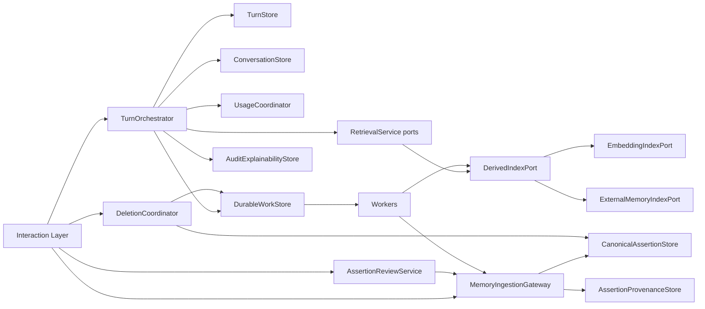

---

## 26. Exact service interfaces

```ts
type UserId = string;
type IdempotencyKey = string;

type ServiceError =
  | { code: "unauthorized" }
  | { code: "forbidden" }
  | { code: "not_found" }
  | { code: "conflict"; current?: unknown }
  | { code: "validation"; details: string[] }
  | { code: "policy_blocked"; reasonCode: string }
  | { code: "usage_unresolved" }
  | { code: "registration_failed" }
  | { code: "internal" };

interface TurnOrchestrator {
  runTurn(input: {
    userId: UserId;
    clientTurnKey: IdempotencyKey;
    interface: "think" | "chat" | "api";
    sessionId?: string;
    message: string;
    selectionKey: string;
  }): Promise<
    | { ok: true; turnId: string; assistantMessage: string; reused: boolean }
    | { ok: false; error: ServiceError }
  >;
}

type IngestionCommand =
  | { type: "explicit_remember"; content: string; clientCommandKey: string; sourceTurnId?: string }
  | { type: "manual_vault_create"; content: string; contentKind: string; category?: string; clientCommandKey: string }
  | { type: "onboarding_assertion"; content: string; contentKind: string; clientCommandKey: string }
  | { type: "conversational_candidate"; content: string; sourceMessageId: string; turnId: string; clientCommandKey: string }
  | { type: "inference_candidate"; content: string; sourceMessageId: string; turnId: string; confidence?: number; clientCommandKey: string }
  | { type: "document_candidate"; content: string; documentId: string; chunkId?: string; clientCommandKey: string }
  | { type: "import_candidate"; content: string; importBatchRef: string; priorConfirmed?: boolean; clientCommandKey: string }
  | { type: "integration_candidate"; content: string; integrationRef: string; clientCommandKey: string }
  | { type: "approve_candidate"; assertionId: string; idempotencyKey: string }
  | { type: "keep_after_edit"; assertionId: string; content: string; idempotencyKey: string }
  | { type: "reject_candidate"; assertionId: string; idempotencyKey: string }
  | { type: "defer_review"; assertionId: string; idempotencyKey: string }
  | { type: "correct_assertion"; assertionId: string; content: string; mode: "changed_over_time" | "corrects_false"; idempotencyKey: string }
  | { type: "mark_historical"; assertionId: string; idempotencyKey: string }
  | { type: "repudiate"; assertionId: string; idempotencyKey: string }
  | { type: "archive"; assertionId: string; idempotencyKey: string }
  | { type: "restore"; assertionId: string; idempotencyKey: string }
  | { type: "delete"; assertionId: string; idempotencyKey: string }
  | { type: "merge_duplicate"; fromId: string; toId: string; idempotencyKey: string }
  | { type: "resolve_conflict"; assertionIds: [string, string]; resolution: "keep_a" | "keep_b" | "coexist" | "repudiate"; idempotencyKey: string };

type IngestionResult = {
  assertionResults: Array<{
    assertionId?: string;
    trust?: "candidate" | "trusted" | "distrusted";
    reviewState?: string;
    disclosure?: { allowInference: boolean; allowEmbedding: boolean; allowExternalIndex: boolean };
    blocked?: { reasonCode: string };
  }>;
  partial: boolean;
};

interface MemoryIngestionGateway {
  execute(command: IngestionCommand & { userId: UserId }): Promise<IngestionResult | { ok: false; error: ServiceError }>;
}

interface CanonicalAssertionStore {
  get(userId: UserId, id: string): Promise<AssertionRow | null>;
  list(userId: UserId, query: AssertionListQuery): Promise<AssertionRow[]>;
  insertCurrent(tx: Tx, row: AssertionInsert): Promise<AssertionRow>;
  updateCurrent(tx: Tx, patch: AssertionPatch): Promise<AssertionRow>;
}

interface AssertionReviewService {
  approve(input: { userId: UserId; assertionId: string; idempotencyKey: string }): Promise<IngestionResult>;
  reject(input: { userId: UserId; assertionId: string; idempotencyKey: string }): Promise<IngestionResult>;
  defer(input: { userId: UserId; assertionId: string; idempotencyKey: string }): Promise<IngestionResult>;
  keepAfterEdit(input: { userId: UserId; assertionId: string; content: string; idempotencyKey: string }): Promise<IngestionResult>;
}

interface AssertionProvenanceStore {
  add(tx: Tx, row: ProvenanceInsert): Promise<void>;
  listForAssertion(userId: UserId, assertionId: string): Promise<ProvenanceRow[]>;
}

interface RetrievalServicePersistence {
  loadEligibleByIds(userId: UserId, ids: string[]): Promise<EligibleAssertion[]>;
  searchEmbeddingCandidates(userId: UserId, space: string, vector: number[], limit: number): Promise<SearchHit[]>;
}

interface DerivedIndexPort {
  enqueueRebuild(tx: Tx, input: { userId: UserId; assertionId: string; reason: string }): Promise<void>;
}
interface EmbeddingIndexPort {
  upsert(input: { userId: UserId; assertionId: string; revisionId: string; space: string; vector: number[] }): Promise<void>;
  markStale(input: { userId: UserId; assertionId: string }): Promise<void>;
}
interface ExternalMemoryIndexPort {
  sync(input: { userId: UserId; assertionId: string }): Promise<void>;
  remove(input: { userId: UserId; assertionId: string }): Promise<void>;
  search(input: { userId: UserId; query: string; limit: number }): Promise<Array<{ externalId: string }>>;
}

interface ConversationStore {
  getOrCreateSession(input: { userId: string; sessionId?: string | null; selectionKey: string; title: string }): Promise<string>;
  getHistory(sessionId: string, limit: number): Promise<Array<{ role: string; content: string }>>;
  appendUserMessage(input: { sessionId: string; userId: string; content: string; turnId: string }): Promise<{ messageId: string }>;
  appendAssistantMessage(input: { sessionId: string; userId: string; content: string; model: string; turnId: string }): Promise<{ messageId: string }>;
}

interface TurnStore {
  beginOrGet(input: { userId: UserId; clientTurnKey: string; interface: string; sessionId?: string }): Promise<{ turn: TurnRow; reused: boolean }>;
  markDenied(tx: Tx, turnId: string, code: string): Promise<void>;
  attachMessages(tx: Tx, input: { turnId: string; userMessageId?: string; assistantMessageId?: string }): Promise<void>;
}

interface UsageCoordinator {
  reserveOrGate(input: { userId: UserId; turnId: string; selectionKey: string }): Promise<GateResult>;
  finalizeInTx(tx: Tx, input: { userId: UserId; turnId: string; draft: UsageDraft }): Promise<{ usageRequestId: string }>;
  recordRepairObligationInTx(tx: Tx, input: { userId: UserId; turnId: string; reasonCode: string; payload: object }): Promise<void>;
}

interface DurableWorkStore {
  registerInTx(tx: Tx, jobs: NewJob[]): Promise<void>;
  claim(workerId: string, limit: number): Promise<Job[]>;
  complete(jobId: string, workerId: string): Promise<void>;
  fail(jobId: string, workerId: string, errorCode: string): Promise<void>;
}

interface DeletionCoordinator {
  start(input: { userId: UserId; scopeType: string; scopeId?: string; idempotencyKey: string }): Promise<{ workflowId: string }>;
  get(userId: UserId, workflowId: string): Promise<DeletionWorkflow>;
}

interface AuditExplainabilityStore {
  writeAudit(event: { userId?: UserId; action: string; entityType?: string; entityId?: string; metadata: object }): Promise<void>;
  recordInfluences(tx: Tx, rows: InfluenceRow[]): Promise<void>;
  listInfluences(userId: UserId, turnId: string): Promise<InfluenceRow[]>;
}
```

### Interface implementation notes

| Interface | RLS client | Service role | Forbidden leaks | Current relationship |
| --- | --- | --- | --- | --- |
| TurnOrchestrator | yes for reads | completion may use RPC | provider SDKs | replaces `runChatOrchestrator` + Think turn path |
| MemoryIngestionGateway | yes | no for normal CRUD | extraction vendor details | new; absorbs Think/API writes |
| CanonicalAssertionStore | yes | rare admin repair | Mem0 ids as semantics | splits `MemoryProvider.insert` row side |
| AssertionReviewService | yes via Gateway | no | — | replaces review PATCH status flips |
| AssertionProvenanceStore | yes | no | raw bodies in provenance extras | new |
| Retrieval persistence | yes | no | ranking constants | ports only for Stage 12 |
| EmbeddingIndexPort | worker/SR or user for local | maybe | cross-space compare | splits `reembed` |
| ExternalMemoryIndexPort | worker | often | remote text as authority | wraps Mem0 |
| ConversationStore | yes | no | — | preserved/extended |
| TurnStore | yes | RPC | — | new |
| UsageCoordinator | RPC/SR for ledger | yes | prompt text | wraps meter/settle |
| DurableWorkStore | SR claim RPCs | yes | raw secrets in payload | new |
| DeletionCoordinator | yes + SR steps | yes for auth/storage | — | replaces account route sequence |
| AuditExplainabilityStore | SR for audit write | yes | raw private content | extends audit + influence |

---

## 27. Ingestion command model

Commands are listed in §26. Partial outcomes are first-class:

- clear user-asserted core → trusted  
- model-added assertions → candidates  
- forbidden content → blocked with reason code  
- sensitive allowed content → saved with restricted disclosure flags  

Gateway does **not** invent the split algorithm; Processing Pipeline (Stage 10) supplies structured payloads.

Idempotent replay with the same command/idempotency key returns the prior result without duplicate rows.

---

## 28. Transaction ownership matrix

| Workflow | Owner | Tables written | Locks / uniqueness | Idempotency | Commit point | Work in TX | Failure | Retry |
| --- | --- | --- | --- | --- | --- | --- | --- | --- |
| Explicit remember one clear | Gateway | assertions, revisions, provenance, disclosure, jobs | assertion id; job key | clientCommandKey | after canonical+job reg | embed/ext jobs | error, no ack | same key |
| Remember + extras | Gateway | multiple assertions… | same | clientCommandKey | same | embed×N | partial result object | same key |
| Chat candidate registration | Job → Gateway | assertions… | job key | job idempotency | job TX | follow-up embed | job retry/DLQ | job replay |
| Approve candidate | Review RPC | assertion, decision, provenance | pending state check | decision key | RPC | embed if needed | conflict if not pending | same key |
| Reject candidate | Review RPC | assertion, decision | state check | decision key | RPC | optional ext | conflict | same key |
| Correction / supersession | Gateway RPC | assertions, revisions, links, decisions | link unique | command key | RPC | embed | conflict | same key |
| Mark historical | Gateway | assertion temporal | row lock | command key | TX | fts/ext meta | error | same key |
| Repudiation | Gateway | trust+decision+provenance | row lock | command key | TX | ext sync | error | same key |
| Archive / restore | Gateway | organisation | row lock | command key | TX | ext meta | error | same key |
| Assertion delete | DeletionCoordinator | retention + workflow/steps | workflow key | workflow key | soft-delete + step reg | delete_step jobs | workflow failed | resume |
| Document delete | DeletionCoordinator | docs/chunks/workflow | workflow key | workflow key | same | delete_step | failed | resume |
| Re-embed register | CAS/Gateway | embeddings stale + job | job key | job key | TX | embed | error | replay |
| External sync register | Gateway | external stale + job | job key | job key | TX | sync | error | replay |
| Replied turn completion | TurnOrchestrator + RPC | turns, messages, influence, usage/repair, jobs | client_turn_key | client_turn_key | single RPC TX | extract/etc | no client success | same turn key |
| Usage repair | Worker | usage/credits/plan/obligation | obligation unique | obligation key | TX | none | DLQ | replay |
| Account deletion start | DeletionCoordinator | workflow+steps; cancel jobs | workflow key | workflow key | TX | many steps | visible failed | resume |

---

## 29. RPC / function catalogue

| Name | Caller | Auth mode | Inputs (conceptual) | Output | Tables | TX | Idempotency | Ownership | Grants | Security | Notes |
| --- | --- | --- | --- | --- | --- | --- | --- | --- | --- | --- | --- |
| `complete_replied_turn` | TurnOrchestrator | authenticated | user_id, turn_id, assistant fields, usage draft or repair flag, influence rows, jobs | turn row | turns, messages, influence, usage/repair, jobs | single | client_turn_key / turn_id | `auth.uid()=user_id` | authenticated execute | DEFINER with search_path=public **only if** ledger writes require; else INVOKER | Must enforce replied invariants |
| `register_explicit_assertion` | Gateway | authenticated | assertion payload(s) | assertion ids | assertions… | single | command key | uid | authenticated | INVOKER preferred | |
| `approve_memory_candidate` | Review | authenticated | assertion_id, key | assertion | assertions, decisions | single | key | uid + row owner | authenticated | INVOKER | pending only |
| `correct_memory_assertion` | Gateway | authenticated | assertion_id, mode, content, key | new/updated ids | assertions, links, revisions | single | key | uid | authenticated | INVOKER | |
| `claim_durable_jobs` | Worker | service_role | limit, worker_id, lease_seconds | jobs | durable_jobs | single | lease | N/A SR | service_role | DEFINER + SKIP LOCKED | |
| `complete_durable_job` / `fail_durable_job` | Worker | service_role | job_id, worker_id, error? | void | durable_jobs | single | job_id+owner | SR | service_role | DEFINER | |
| `start_deletion_workflow` | DeletionCoordinator | authenticated | scope, key | workflow_id | workflows/steps + soft delete | single | key | uid | authenticated | INVOKER/DEFINER hybrid | |
| `reconcile_assertions_by_ids` | Retrieval | authenticated | ids | eligible rows | assertions, disclosure | read | N/A | uid | authenticated | INVOKER | |
| `match_memory_embeddings` | Retrieval | authenticated | vector, space, limit | hits | embeddings⋈assertions | read | N/A | uid | authenticated | INVOKER | filters eligibility |

Existing `match_memories` retained during coexistence; not authoritative after cutover.

## 30. RLS and grants matrix

Legend: ✓ allowed for own rows via `auth.uid() = user_id`; ✗ denied; SR = service_role; W = worker via SR RPCs.

| Table | RLS | SEL | INS | UPD | DEL | SR/W | Policy predicate | Parent ownership | Direct writes |
| --- | --- | --- | --- | --- | --- | --- | --- | --- | --- |
| memory_assertions | ✓ | ✓ | ✓* | ✓* | ✗ | ✓ | own user_id | N/A | prefer RPC for trust transitions |
| memory_assertion_revisions | ✓ | ✓ | RPC | ✗ | ✗ | ✓ | own | composite FK | RPC-only mutate |
| memory_review_decisions | ✓ | ✓ | RPC | ✗ | ✗ | ✓ | own | composite FK | RPC-only |
| memory_assertion_provenance | ✓ | ✓ | RPC | ✗ | ✗ | ✓ | own | composite FK | RPC-only |
| memory_assertion_links | ✓ | ✓ | RPC | resolve RPC | ✗ | ✓ | own | composite both ends | RPC-only |
| memory_disclosure_policies | ✓ | ✓ | RPC | RPC | ✗ | ✓ | own | composite FK | RPC-only |
| memory_embeddings | ✓ | ✓ | W | W | W | ✓ | own | composite FK | no client writes |
| memory_fts_documents | ✓ | ✓ | W | W | W | ✓ | own | composite FK | no client writes |
| external_memory_index_entries | ✓ | ✓ | W | W | W | ✓ | own | composite FK | no client writes |
| document_chunk_embeddings | ✓ | ✓ | W | W | W | ✓ | own | composite FK | no client writes |
| conversation_turns | ✓ | ✓ | TurnStore | TurnStore | ✗ | ✓ | own | session composite | service via store |
| turn_inference_attempts | ✓ | ✓ | TurnStore | TurnStore | ✗ | ✓ | own | turn composite | store |
| usage_repair_obligations | ✓ | ✓ | RPC | W | ✗ | ✓ | own | turn composite | RPC/W |
| durable_jobs | ✓ | optional ✓ | RPC | W RPC | ✗ | ✓ | own | user_id required | claim RPCs SR-only |
| deletion_workflows | ✓ | ✓ | RPC | RPC/W | ✗ | ✓ | own | user_id | RPC |
| deletion_workflow_steps | ✓ | ✓ | RPC | W | ✗ | ✓ | own | workflow composite | W |
| response_influence_records | ✓ | ✓ | Turn | ✗ | ✗ | ✓ | own | composites | orchestrator |
| documents | ✓ | ✓ | ✓ | ✓ | workflow | ✓ | own | unique (user_id,id) | existing + upgraded |
| document_chunks | ✓ | ✓ | ✓ | ✗/limited | workflow | ✓ | own | composite to documents | upgraded |
| chat_sessions | ✓ | ✓ | ✓ | ✓ | workflow | ✓ | own | unique (user_id,id) | upgraded |
| chat_messages | ✓ | ✓ | ✓ | ✗ | workflow | ✓ | own | composite to sessions | upgraded |
| message_context | ✓ | ✓ | ✓ | ✗ | ✗ | ✓ | own | legacy; coexistence | freeze new writes after cutover |
| memories compat | ✓ | ✓ | adapter | adapter | adapter | ✓ | own | projection | adapter only |
| usage_events / credits / plan | ✓ | ✓ SEL | SR/RPC | SR/RPC | ✗ | ✓ | own SEL | existing | unchanged posture |
| audit_log | ✓ | ✓ SEL | SR | ✗ | ✗ | ✓ | own SEL | existing | no raw secrets |
| workspaces | ✓ | member | owner | owner | owner | ✓ | existing | **no memory grants** | unchanged |

Admin tables remain service-role / admin-RBAC as today and are out of personal-memory scope.

**Security property:** workspace membership never appears in memory policy predicates.

---

## 31. Index strategy

| Need | Index |
| --- | --- |
| Vault list | `(user_id, organisation, retention, created_at DESC)` |
| Review queue | partial `(user_id, created_at DESC)` WHERE `trust='candidate' AND review_state IN ('pending','deferred') AND retention='present'` |
| Retrieval prefilter | `(user_id, trust, retention, organisation, succession_state, temporal_phase)` |
| Vector | ivfflat/hnsw on `memory_embeddings.embedding` WHERE `state='ready'` (+ space-specific indexes if multiple spaces hot) |
| FTS | GIN on `memory_fts_documents.document` |
| Jobs | pending/leased partial indexes (§8.14) |
| Turns | unique `(user_id, client_turn_key)` |
| Provenance by source | `(user_id, source_chat_message_id)`, `(user_id, source_document_id)` |
| Pins | `(user_id, pinned_at DESC NULLS LAST)` WHERE present |

---

## 32. Retrieval persistence contract

Stage 12 consumes these canonical fields/filters; it does not bypass them.

1. User ownership  
2. Trust  
3. Review outcome  
4. Temporal phase  
5. Temporal bounds (+ derived expired)  
6. Claim modality  
7. Organisation  
8. Retention  
9. Succession  
10. Conflict (via succession_state + links)  
11. Sensitivity class  
12. Disclosure decisions  
13. Pin  
14. Scope labels  
15. Content revision  
16. Embedding version/space/state  
17. Provenance identifiers  

| Object | Meaning |
| --- | --- |
| Search hit | Raw id+score from embedding/FTS/external |
| Canonically reconciled candidate | Hit mapped to assertion row |
| Retrieval-eligible assertion | Passes Stage 8 gate using canonical fields |
| Selected context item | Chosen by Stage 12 packing |
| Durable influence record | Persisted selected item |

No stored `is_eligible` authority column.

Default assistant retrieval excludes: non-trusted, rejected-as-truth, distrusted, deleted/purge-pending/purged, archived (default), superseded heads, unresolved conflict as settled simultaneous facts, disclosure-denied for inference, stale embedding spaces, unreconciled external hits.

---

## 33. Current-to-target component mapping

| Component | Fate |
| --- | --- |
| `memories` | Wrapped → compatibility projection; retired as authority after cutover |
| Legacy enums | Preserved for projection; retired later |
| `match_memories` | Replaced by `match_memory_embeddings` + reconcile; kept during coexistence |
| `message_context` | Extended then replaced by `response_influence_records` |
| `audit_log` | Preserved with stricter metadata rules |
| `MemoryProvider` | Split/wrapped into CAS + embedding + external ports |
| `SupabaseMemoryProvider` | Extended → EmbeddingIndexPort + CAS adapter |
| `Mem0MemoryProvider` | Wrapped as ExternalMemoryIndexPort |
| `ConversationStore` | Extended (returns message ids; turn linkage) |
| `runChatOrchestrator` | Replaced by TurnOrchestrator |
| Think memory handlers | Replaced by Gateway commands |
| Memory API routes | Thin wrappers over Gateway |
| Review queue | Extended to `review_state` / trust |
| Documents + retrieve | Preserved; ownership FKs upgraded; chunk embeddings versioned |
| Inference metering tables | Preserved; turn-linked |
| Plan usage tables | Extended for turn idempotency |
| Account deletion route | Replaced by DeletionCoordinator |
| Export format | Extended to export assertions (+ legacy fields during coexistence) |

---

## 34. Legacy row mapping

| Legacy | Target mapping |
| --- | --- |
| type `profile` | `content_kind=identity` |
| `preference` | `preference` |
| `semantic` | `knowledge` |
| `episodic` | `event` |
| `project` | `project_context` |
| `temporary` | `content_kind=knowledge` default; copy `expires_at` if present into expiry_ruled/unbounded; **do not invent** expiry |
| status `active` | `trust=trusted`, `review_state=none`, `organisation=visible`, `retention=present`, `succession_state=head` |
| `proposed` | `trust=candidate`, `review_state=pending` |
| `rejected` | `trust=candidate`, `review_state=rejected` (**not** distrusted) |
| `superseded` | `trust=trusted`, `succession_state=superseded`; phase `historical` only if evidence, else leave `current` and rely on succession |
| `archived` | `organisation=archived`; trust trusted unless other evidence |
| `deleted` | `retention=deleted`, set `deleted_at=updated_at` if needed |
| source `manual` | `origin_class=legacy_unknown` on backfill (do **not** rewrite as `explicit_remember`) |
| `chat_extraction` | `origin_class=conversational_inference` |
| `document` | `document_candidate` |
| `onboarding` | `onboarding` |
| `import` | `import` |
| authority for active+manual/onboarding | `user_asserted` |
| authority for active+chat_extraction | `user_confirmed` |
| authority for candidates | `none` |
| embeddings unlabeled | `embedding_space=legacy-unlabeled-1536`, `state=ready`, revision_no=1 |
| `is_sensitive=true` | `sensitivity_class=highly_sensitive`, conservative disclosure defaults (`allow_external_index_disclosure=false`) |
| `message_context` | map to influence records when message/memory still exist |
| `pinned_at` | copy |
| `confidence` | copy nullable |
| `category` | copy |
| `source_detail` | store in provenance `source_external_ref` or notes only when non-secret |

---

## 35. Coexistence and migration design

### Selected strategy

**Additive new tables + write-through compatibility adapter + dual-read + backfill + staged cutover.**

Compared alternatives:

| Strategy | Role |
| --- | --- |
| Alter existing only | Rejected as sole long-term model |
| New tables + compatibility projection | **Selected core** |
| Dual-read | Selected during transition |
| Dual-write / write-through adapter | Selected until cutover |
| Backfill + cutover | Selected |
| Shadow validation | Selected before cutover |
| Legacy projection status | Selected (`legacy_projection_status`) |
| Forever dual-write | Rejected |

### Rules

1. Preserve memory UUIDs as assertion ids.  
2. Do not invent provenance, expiry, or trust history.  
3. Compatibility projection exposes legacy columns from assertions.  
4. Think and Chat both move behind TurnOrchestrator before either old path is removed.  
5. Rollback: keep `memories` projection populated and readable.  
6. Validation concepts: count mismatches projection vs canonical; orphan embeddings; zero cross-user composite FK violations; replied turns without assistant = 0; replied turns without usage/repair (except direct_answer) = 0.  
7. Old enums retired only after API/UI cutover.  
8. Initially drop nothing: keep `match_memories`, `message_context`, legacy grants.  
9. Compatibility projections are not canonical authority.

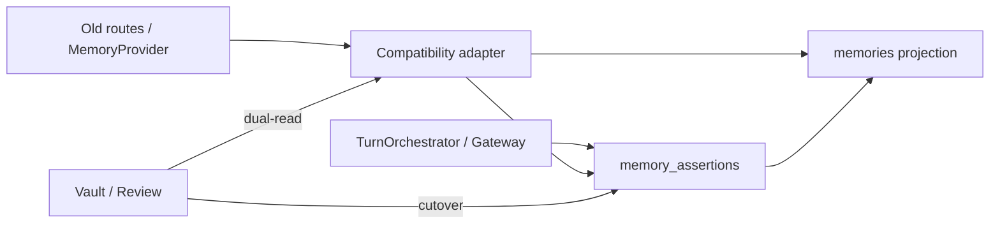

---

## 36. Security analysis

| # | Threat | DB protection | Service protection | Remaining risk | Later dependency |
| --- | --- | --- | --- | --- | --- |
| 1 | Cross-user parent refs | Composite FKs | Gateway checks | Mis-migrated legacy rows | Data repair |
| 2 | Service-role misuse | Narrow grants/RPCs | Scoped workers | Worker filter bugs | Stage 15 tests |
| 3 | DEFINER RPC abuse | uid checks, search_path, grants | No arbitrary client SQL | Grant drift | Ops review |
| 4 | Forged user_id | RLS + uid checks | Session context only | SR bugs | Stage 15 |
| 5 | Forged provenance | Composite FKs | Gateway | None if FKs hold | — |
| 6 | Job payload leakage | payload policy | redaction helpers | accidental fields | Stage 10 |
| 7 | Disclosure bypass | policy checks before embed/index/inference | Provider gateway | model side channels | Stages 12/13 |
| 8 | Stale external retrieval | mandatory reconcile | RetrievalService | provider outage UX | Stage 12 |
| 9 | Deleted resurrection | retention gates | delete workflow ordering | sync races | job design tests |
| 10 | Duplicate charging | turn unique + usage PK | UsageCoordinator | repair bugs | Stage 15 |
| 11 | Duplicate approval | decision idempotency + state | Review RPC | — | tests |
| 12 | Replay corrections | command idempotency | Gateway | — | tests |
| 13 | Account deletion races | workflow leasing | cancel jobs | long external lag | ops |
| 14 | Document ownership mismatch | composite FKs | document services | legacy orphans | backfill |
| 15 | Workspace widening | no memory FK/policy to workspace | forbid in Gateway | future feature creep | product gate |
| 16 | Raw-content logging | conventions + codes | AuditExplainabilityStore | human error | lint/tests |
| 17 | Embedding-space confusion | space predicate in RPC | pinned space config | misconfig | ops |
| 18 | Compat write bypass | privileges + adapter-only writes | disable direct legacy writes post cutover | DBA mistake | Stage 16 controls |

---

## 37. Architecture diagrams

### 37.1 Target ERD (core)

```mermaid
erDiagram
  memory_assertions ||--o{ memory_assertion_revisions : current
  memory_assertions ||--o{ memory_assertion_provenance : has
  memory_assertions ||--o{ memory_assertion_links : from
  memory_assertions ||--o{ memory_review_decisions : reviewed
  memory_assertions ||--|| memory_disclosure_policies : policy
  memory_assertions ||--o| memory_embeddings : derived
  memory_assertions ||--o| memory_fts_documents : derived
  memory_assertions ||--o| external_memory_index_entries : derived
  chat_sessions ||--o{ chat_messages : contains
  conversation_turns ||--o| chat_messages : user_msg
  conversation_turns ||--o| chat_messages : assistant_msg
  conversation_turns ||--o{ turn_inference_attempts : attempts
  conversation_turns ||--o| usage_repair_obligations : repair
  conversation_turns ||--o{ durable_jobs : registers
  conversation_turns ||--o{ response_influence_records : explains
  documents ||--o{ document_chunks : chunks
  document_chunks ||--o| document_chunk_embeddings : derived
  deletion_workflows ||--o{ deletion_workflow_steps : steps
```

### 37.2 Canonical versus derived

See §7.

### 37.3 Service boundaries

See §25.

### 37.4 Replied-turn transaction sequence

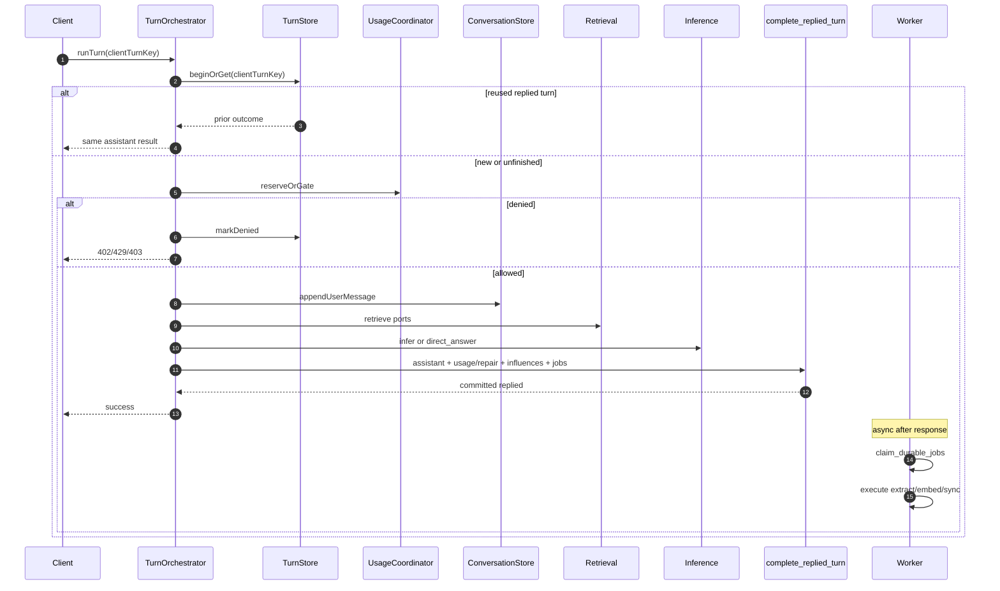

### 37.5 Explicit remember transaction sequence

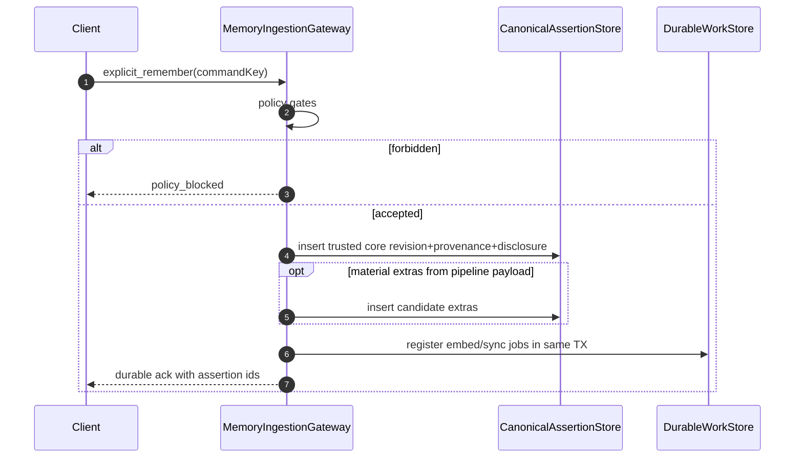

### 37.6 Candidate approval sequence

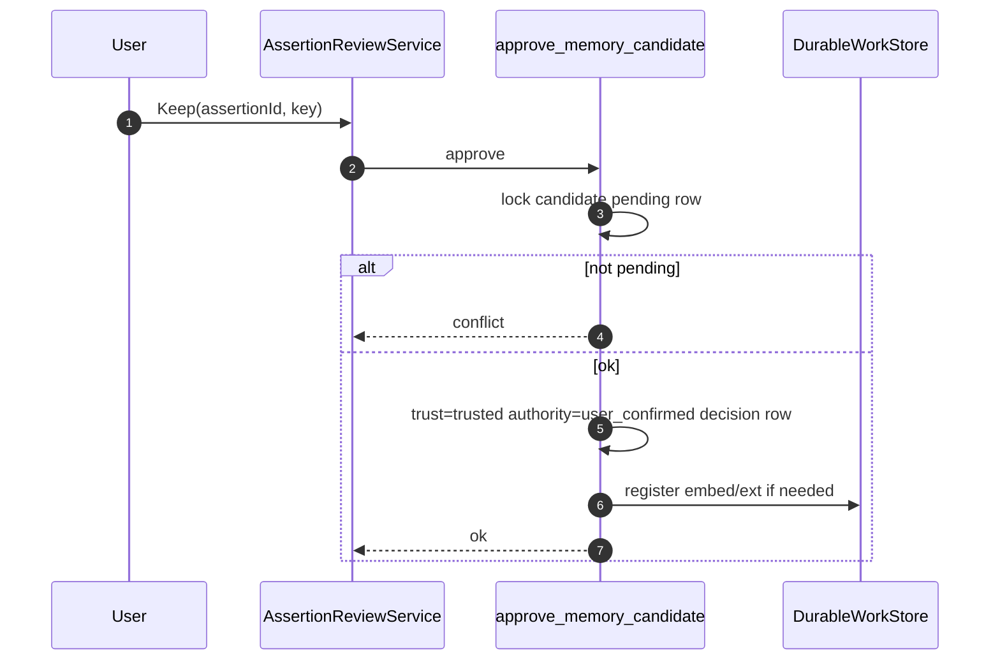

### 37.7 Correction and supersession sequence

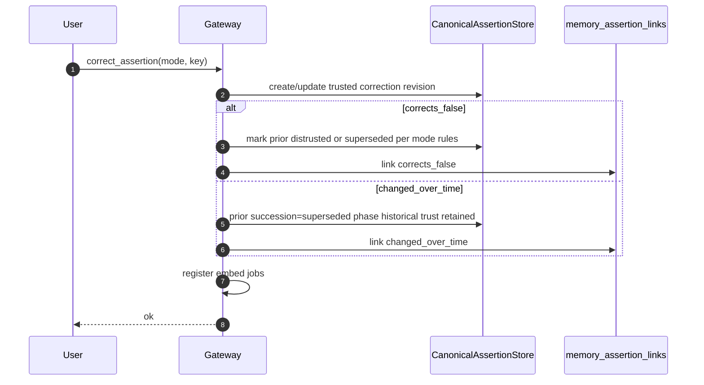

### 37.8 Outbox registration and execution

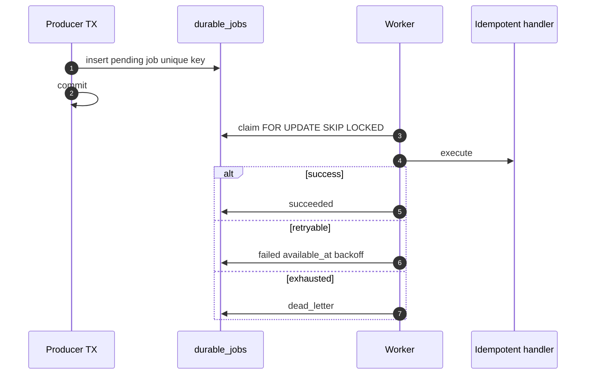

### 37.9 Deletion workflow

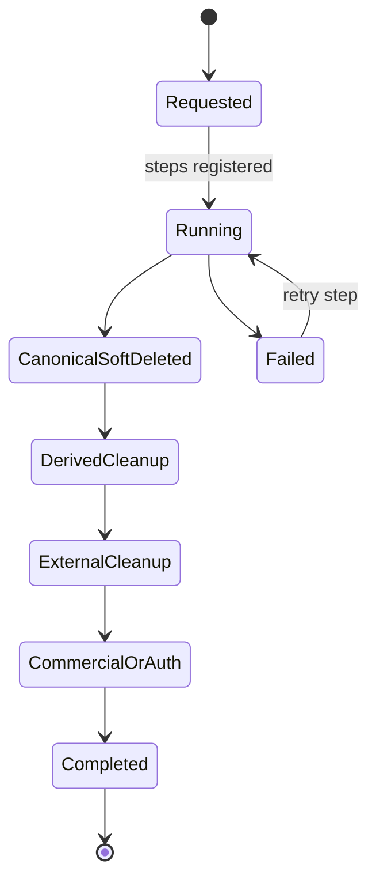

### 37.10 RLS / trust boundary

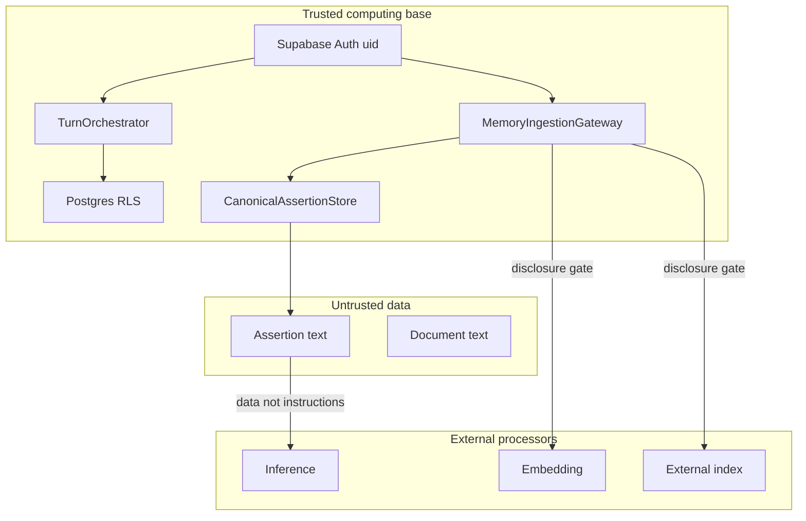

### 37.11 Current-to-target coexistence

See §35 diagram.

### 37.12 Embedding-version lifecycle

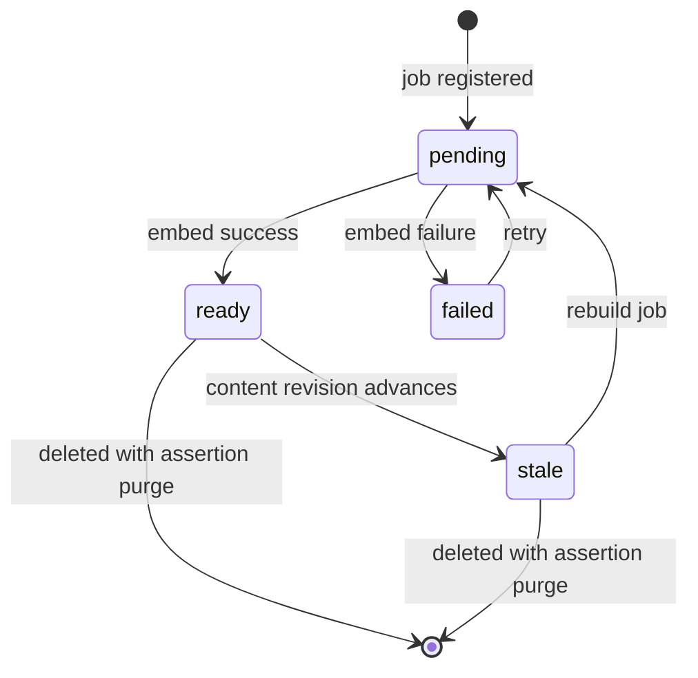

## 38. Database and service invariants

1. Every assertion has exactly one verified user owner.  
2. Candidate assertions may be canonical application data without being trusted memory.  
3. A trusted assertion has a valid authority source (`user_asserted|user_confirmed|user_corrected`).  
4. A distrusted assertion has an explicit repudiation/confirmed-false actor and time.  
5. Review rejection does not imply distrust.  
6. Temporal phase changes do not silently alter trust.  
7. Historical assertions may remain trusted.  
8. Phase, bounds, and modality are not collapsed into one enum.  
9. Every canonical assertion mutation has provenance.  
10. Material model transformations cannot inherit explicit-user authority.  
11. Parent-child and source-target references cannot cross user ownership.  
12. Deleted and purge-pending assertions are never retrieval eligible.  
13. Archived assertions are excluded from default assistant retrieval.  
14. Candidate, rejected, and distrusted assertions cannot enter context as trusted truth.  
15. External index hits must reconcile to canonical state.  
16. Content changes invalidate or version prior embeddings.  
17. Incompatible embedding spaces are never queried together.  
18. External indexes are derived and rebuildable.  
19. Required turn jobs are registered before client success.  
20. Job replay cannot duplicate canonical effects.  
21. Turn retries cannot duplicate messages, charges, plan usage, or jobs.  
22. A replied turn cannot succeed without durable assistant persistence.  
23. A replied turn cannot succeed without usage finalisation or durable repair obligation (except `direct_answer=true`).  
24. A replied turn cannot succeed before its coordinated transaction commits.  
25. Storage permission and provider disclosure permission remain separate.  
26. Raw forbidden secrets do not appear in jobs or operational logs.  
27. Documents do not become memories merely by upload.  
28. Workspaces cannot broaden personal-memory access.  
29. Normal product memory operations remain protected by RLS.  
30. Service-role operations require explicit verified user scope.  
31. Deletion remains tracked until required steps reach terminal state.  
32. Legacy rows are not assigned invented provenance, expiry, or trust history.  
33. Compatibility projections do not become new canonical authority.  
34. Provider-specific identifiers do not define product memory semantics.  
35. Stage 10 algorithms can be added without redesigning Stage 9 boundaries.  
36. Stage 11 entity records can be added without redefining assertion ownership.  
37. Stage 12 retrieval can consume eligible assertion projections without bypassing canonical checks.  
38. `legacy_projection_status` never overrides multi-axis semantics.  
39. Influence records cannot reference another user’s assertion or chunk.  
40. Outbox registration failure before row existence prevents replied-turn success.  
41. Crash after commit / before HTTP response is retry-safe via client turn key.  
42. Rate-limit and ops failures follow explicit product policy (no accidental fail-open as platform default).  
43. Embedding retrieval joins current revision identity before context use.  
44. Tombstoned purged assertions remain reconcilable as deleted for external hits.  
45. Export and UI reads of candidates must not present them as saved trusted memory.

---

## 39. Failure modes and recovery

| Failure | Client view | Durable state | Recovery |
| --- | --- | --- | --- |
| Auth failure | 401/403 | no turn | retry after auth |
| Entitlement deny | 402 | turn denied | no charge |
| Inference failure | 5xx | unfinished turn | same client_turn_key |
| Assistant persist fail | 5xx | no replied commit | same key; no final charge |
| Usage finalize fail | no success unless repair recorded | repair obligation + assistant | worker usage_repair |
| Job registration fail | no success | TX abort | same key |
| Crash after commit | client timeout | replied durable | retry returns same outcome |
| Async job fail | turn still success | job retry/DLQ | worker replay |
| Duplicate Keep | same result | one decision | idempotency key |
| External sync fail | eventual | sync_state failed | reconcile job |
| Deletion step fail | visible incomplete | workflow failed | resume |
| Cross-user FK attempt | DB reject | no row | fix caller |
| Stale vector present | excluded from retrieve | state=stale | rebuild |

---

## 40. Risks and tradeoffs

| Topic | Assessment |
| --- | --- |
| Wide assertion row vs side tables | Selected hybrid: hot eligibility columns on assertion; history/policy/derived on side tables |
| Candidate and trusted sharing a table | Chosen for Stage 8 umbrella clarity; constraints prevent authority confusion |
| Revision history cost | Extra writes/storage; accepted for correction/explainability |
| Extra joins during retrieval | Mitigated by content_text mirror + eligibility columns; vector table join required |
| RLS complexity | Higher than today; composite FKs reduce app-only risk |
| RPC complexity | Concentrated in turn completion and job claim; justified by Stage 6 High issues |
| Outbox operational burden | New worker/lease ops; accepted vs critical-path extraction |
| Legacy compatibility burden | Real; dual-read/write period required |
| Dual-write risk | Divergence possible — shadow validation before cutover |
| Embedding-version storage cost | Multiple spaces during migration; temporary |
| Exact trust vs UX latency | Explicit remember remains sync ack; extraction async |
| Sensitive-policy complexity | Hybrid booleans + class; more fields than `is_sensitive` |
| Long-term maintenance | More tables, clearer semantics than overloaded enums |
| Premature abstraction | Avoided microservices/event-sourcing/entity graphs |
| Future entity compatibility | Assertion ids stable anchors for Stage 11 |
| Rollback and observability | Projection + job/turn ids support rollback and correlation |

---

## 41. Decisions intentionally deferred

| Stage | Deferred items |
| --- | --- |
| **10** | Candidate extraction prompts; lossless-vs-material detection; atomic splitting; secret detection implementation; sensitivity classification algorithms; exact/semantic dedupe; correction detection; conflict detection; conflict suggestions; confidence formulas; automatic summaries; extraction retry tuning |
| **11** | Entity types/records/resolution; relationship types/edges; graph representation; entity-link indexes |
| **12** | Retrieval signals; ranking weights; similarity thresholds; reranking; historical-vs-current weighting; modality-aware weighting; token budgets; context packing; prompt formatting; conflict presentation in model context |
| **13** | Mem0 continuation; Letta; LangMem; LangGraph; external framework choice; build-vs-reuse |
| **15** | Complete testing/evaluation framework (contract surfaces noted here) |
| **16** | Phased implementation roadmap and PR sequence |
| **17** | Exact first implementation PR |

---

## 42. Unknowns requiring later stages

1. Live volume/latency SLOs that might force queue infra beyond Postgres outbox (**Assumption:** not needed now).  
2. Whether high-sensitivity explicit remember should always require confirmation (product/Stage 10).  
3. Import packages’ machine-readable prior-confirmation claims.  
4. Exact legal/commercial retention windows for deletion deferrals.  
5. Whether relationship_fact will later require entity linkage (Stage 11).  
6. Final embedding provider identity beyond local/legacy spaces.  
7. Whether HNSW should replace IVFFlat operationally.  
8. Whether `memories` becomes a SQL view or trigger-maintained table at cutover (implementation detail for Stage 16).  
9. How Thinking UI will present multi-axis badges (product/UX).  
10. Whether shared/collaborative memories ever exist (product; currently out of scope).

---

## 43. Acceptance-criteria assessment

| # | Criterion | Status |
| --- | --- | --- |
| 1 | Selects one exact physical persistence model | **Met** — Option B lean (§5) |
| 2 | Exact tables/columns/types/keys/constraints | **Met** — §8 |
| 3 | Candidates distinct from trusted conceptually | **Met** — trust axis |
| 4 | Orthogonal Stage 8 dimensions preserved | **Met** |
| 5 | Trusted historical representable | **Met** |
| 6 | Repudiated false ≠ rejected candidate | **Met** |
| 7 | Provenance and revision storage | **Met** |
| 8 | Structural cross-user prevention | **Met** — composite FKs |
| 9 | RLS/grants table-by-table | **Met** — §30 |
| 10 | Service interfaces + TX ownership | **Met** — §26–28 |
| 11 | Replied-turn completion transaction | **Met** — §20–21, §37.4 |
| 12 | Durable job registration/execution | **Met** — §22 |
| 13 | Stable idempotency | **Met** |
| 14 | Embedding versioning + stale protection | **Met** |
| 15 | External indexes non-authoritative | **Met** |
| 16 | Tracked deletion | **Met** |
| 17 | Storage vs disclosure permissions separate | **Met** |
| 18 | Documents as sources | **Met** |
| 19 | Realistic compatibility strategy | **Met** — §34–35 |
| 20 | No invented legacy provenance/expiry | **Met** |
| 21 | No Stage 10 algorithms | **Met** |
| 22 | No Stage 11 entity graphs | **Met** |
| 23 | No Stage 12 ranking | **Met** |
| 24 | No Stage 13 frameworks | **Met** |
| 25 | No production behaviour changes | **Met** — docs only |
| 26 | Stable boundaries for Stage 10 | **Met** |

---

## 44. Files and questions recommended for Stage 10

### Files to read first

1. This document (`09-technical-design.md`)  
2. `08-memory-model.md` §§8–11, 14  
3. `04-extraction-audit.md`  
4. `src/lib/memory/extraction/**`  
5. `src/lib/memory/redaction.ts`  
6. `src/app/api/think/route.ts` statement/remember handlers  
7. `src/lib/orchestration/chat.ts` extraction finalize path  

### Questions for Stage 10

1. How to detect lossless normalisation vs material transformation against `transformation_kind` markers?  
2. How to split compound explicit remember into trusted core + candidate extras without changing Gateway commands?  
3. Exact secret/sensitivity classifiers emitting `sensitivity_class` + disclosure defaults?  
4. Exact and semantic dedupe keys compatible with absence of unique content constraint?  
5. Correction vs changed-over-time classification into link types?  
6. Conflict detection producing `conflicts_with` without auto-distrust?  
7. Confidence formulas that never grant trust?  
8. Which Gateway commands the Processing Pipeline may emit atomically after a turn job?  

### Non-goals for Stage 10

Physical schema redesign; entity graphs; ranking weights; framework selection; migrations.

---

## 45. Disagreements with prior artifacts

| Item | Disposition |
| --- | --- |
| `00-roadmap.md` stale statuses | Report only; Stages 1–8 treated complete; roadmap not edited |
| README “always proposed” framing | Already contradicted by audits; design assumes Gateway policy, not README |
| Stage 7 “exact SQL deferred” | Closed here without changing Stage 7 architecture |
| Stage 8 deferral of candidate/trusted table split | Closed: shared table with trust axis (not Option D) |
| Stage 1 implication of no worker | Superseded by Stage 7 Postgres outbox; this design specifies `durable_jobs` |
| Any silent weakening of Stage 7 turn success contract | **None** — preserved and encoded in `complete_replied_turn` |
| Any collapse of Stage 8 temporal axes | **None** — three physical axes |

No binding disagreement requiring Stage 7/8 revision was found. Clarifications only:

1. Direct identity answers are an explicit exception to usage finalise-or-repair (**Technical decision**, compatible with Stage 7 “no provider” path).  
2. `purged` retention tombstones are added beyond Stage 8’s `purge_pending` wording to support external reconcile.

---

## 46. Final consistency checklist

- [x] Option B lean selected and justified against A–E  
- [x] Orthogonal dimensions physically separated  
- [x] Trust/authority CHECKs defined  
- [x] Rejected ≠ distrusted  
- [x] Historical trusted representable  
- [x] Revisions + provenance + succession links defined  
- [x] Composite ownership model selected  
- [x] Disclosure hybrid model selected  
- [x] Embeddings derived and revision-bound  
- [x] External index sync non-authoritative  
- [x] Turn + usage repair + outbox designed  
- [x] Deletion workflow designed  
- [x] Service interfaces and TX matrix complete  
- [x] RLS/grants matrix complete  
- [x] Legacy mapping without invented facts  
- [x] Coexistence strategy selected  
- [x] Security analysis complete  
- [x] Diagrams present  
- [x] Invariants numbered  
- [x] Deferrals explicit  
- [x] No production files modified  

---

## Appendix A — Conceptual DDL sketch for `memory_assertions` checks

```sql
-- Non-executable sketch for implementers (Stage 16+)
CHECK (
  (trust <> 'trusted') OR authority_source IN ('user_asserted','user_confirmed','user_corrected')
)
CHECK (
  (trust <> 'candidate') OR authority_source = 'none'
)
CHECK (
  (trust <> 'distrusted') OR (trust_changed_by IS NOT NULL AND trust_changed_at IS NOT NULL)
)
CHECK (
  (review_state <> 'accepted') OR trust = 'trusted'
)
CHECK (
  (review_state NOT IN ('pending','deferred','rejected')) OR trust = 'candidate'
)
CHECK (
  (temporal_bounds_kind <> 'unbounded') OR (valid_from IS NULL AND valid_to IS NULL AND event_at IS NULL AND expires_at IS NULL)
)
CHECK (
  (temporal_bounds_kind <> 'interval_bounded') OR (valid_from IS NOT NULL AND valid_to IS NOT NULL AND valid_from < valid_to)
)
CHECK (
  (temporal_bounds_kind <> 'event_anchored') OR event_at IS NOT NULL
)
CHECK (
  (temporal_bounds_kind <> 'expiry_ruled') OR expires_at IS NOT NULL
)
```

---

## Appendix B — Replied-turn completion contract (normative)

`complete_replied_turn` commits a turn to `state='replied'` only if all hold inside one transaction:

1. `auth.uid() = p_user_id` (or service_role worker path is not used for user turns).  
2. Turn exists and is not already terminal with a conflicting outcome.  
3. `assistant_message_id` is set and references an assistant message owned by the same user/session.  
4. Either:
   - `usage_request_id` is set and plan/credit effects for that turn are finalised exactly once, or  
   - a `usage_repair_obligations` row for the turn is inserted/present in `pending`/`succeeded`, or  
   - `direct_answer = true`.  
5. All required `durable_jobs` for the turn type are inserted with unique idempotency keys.  
6. Influence rows inserted under composite ownership.  
7. On conflict with an already `replied` turn for the same `(user_id, client_turn_key)`, return the existing outcome without inserting duplicates.

---

## Appendix C — Contract-test surfaces for Stage 15 (preview only)

1. Composite FK rejects cross-user message/session/provenance/influence inserts.  
2. Trusted insert without authority source rejected.  
3. Rejected candidate remains `trust=candidate`.  
4. Historical phase change preserves trust.  
5. Embedding stale after revision advance excluded from match RPC.  
6. External hit without canonical eligible row dropped.  
7. Replied-turn retry does not double usage/plan/jobs/messages.  
8. Missing job registration aborts replied success.  
9. Deletion workflow visible until external step completes.  
10. Compatibility projection maps proposed→candidate pending without inventing origin.

---

*End of Stage 9 technical design. Production behaviour unchanged.*
