# 10 — Memory Processing and Intelligence Design

**Stage:** 10 of 17  
**Role:** Memory Processing and Intelligence Designer  
**Status:** Complete (documentation only) — corrected  
**Date:** 2026-07-24  
**Branch:** `cursor/memory-processing-design`  
**Depends on:** Stages 1–9 (treated complete)  
**Produces:** Binding processing pipeline that converts intake sources into Stage 9 Gateway commands  
**PR:** https://github.com/NicolVii/ContextVault/pull/43  

---

## Legend (evidence classes)

| Label | Meaning |
| --- | --- |
| **Verified current behaviour** | Confirmed against current source / tests |
| **Technical decision** | Binding Stage 10 choice |
| **Security property** | Must hold under adversarial or failure conditions |
| **Assumption** | Working premise; not contradicted by Stages 7–9 |
| **Tradeoff** | Explicit cost/benefit of a selected alternative |
| **Deferred decision** | Owned by a later stage |
| **Unknown** | Not yet knowable from repo or prior stages |
| **Stage 9 amendment request** | Capability Stage 9 cannot persist; not a silent redesign |

---

## 1. Executive summary

### Verdict

**Technical decision — Option E (Hybrid staged pipeline)** remains the Stage 10 processing architecture.

Local deterministic preflight runs before any external disclosure. Structured extraction proposes atomic claims. Deterministic validation follows. Bounded same-user comparison performs exact, near-textual, and semantic dedupe plus correction / changed-over-time / conflict proposals. An optional conditional verifier runs only for ambiguous entailment or authority-survival cases. Processing never writes canonical memory; it emits Gateway commands only.

### Binding outcomes (corrected)

1. One pipeline converts every intake envelope into zero or more safe Stage 9 commands.  
2. A **durable processing run** freezes the first successfully validated command plan **before** any Gateway emission; retries resume unfinished commands only and cannot introduce new claims from model nondeterminism.  
3. Explicit remember / manual Vault / onboarding preserve user authority only for user-authored, lossless-normalised propositions whose **original-safe** evidence spans contain no blocked-secret segments.  
4. Material rewrites, inferences, and model-added meaning become candidates.  
5. Forbidden secrets are detected locally; the provider sees only redacted text; provenance uses **mapped original safe offsets**.  
6. Mixed safe+blocked content yields `partially_accepted` with safe cores only.  
7. Conversational and document worker paths create candidates only.  
8. Provider failure does not invent trusted meaning via heuristic semantic drift; explicit modes use a complete model-free deterministic fallback covering all product content kinds.  
9. Confidence is processing quality only — **no authority bonus** for explicit storage or authorship.  
10. Conflict detection never auto-distrusts trusted assertions; rejected and distrusted rows never block valid new claims.  
11. Import/integration package metadata cannot grant trust or authority.  
12. Document extraction and embedding disclosure are independent; provider-denied documents do not magically produce candidates.  
13. Exact-content fingerprints are temporally and contextually structured so relative-time claims on different days do not collide.  
14. Semantic dedupe uses a **transient** same-space embedding only when embedding disclosure is allowed; missing Layer 4 never suppresses a claim.  
15. Stage 9 gaps are amendment requests only.

### Preserved architecture (unchanged)

Option E hybrid staged pipeline; local preflight; structured extraction; deterministic validation; bounded same-user comparison; conditional verifier only; models never write canonical memory; models never grant user authority; worker paths candidates only; confidence ≠ trust; conflict ≠ auto-distrust; Stage 9 amendments only.

### What this stage does not decide

Entity graphs (11), assistant retrieval ranking (12), framework selection (13), full test framework (15), implementation roadmap / migrations (16–17), signed-bundle import authority policy.

---

## 2. Verified current processing behaviour

Re-verified against source on 2026-07-24. Unchanged from the prior Stage 10 pass: Think statements become active episodic without extraction; explicit remember / manual / onboarding bypass secret blocking and dedupe; chat extraction creates proposed rows via a separate path; LLM timeout falls back to heuristics while valid empty does not; exact dedupe is lowercase equality and rejected rows block re-proposal; documents create no memory candidates; no source-span / model / prompt / fallback evidence is stored; sensitivity is a keyword boolean; no correction / conflict / semantic dedupe exists.

See prior §2 tables in git history of this file’s first commit for the full path matrix; behaviours remain accurate. This correction pass does not re-litigate verification — it hardens target contracts.

### Problem resolution map (updated highlights)

| # | Current problem | Corrected Stage 10 resolution |
| --- | --- | --- |
| 8–9 | LLM vs heuristic drift / timeout→heuristic | Mode fail-safes; frozen plan; no conversational heuristic fallback |
| 11 | Underspecified fingerprint | Canonical structured fingerprint including temporal context |
| 12 | Rejected blocks re-proposal | Trust-state matrix: rejected/distrusted never block |
| 16 | Missing processing evidence | Durable processing run + frozen claims (amendment F) |
| Import auto-trust contradiction | Package `priorConfirmed` | Provenance metadata only; user must approve |
| Confidence mixes authority | `s_explicit` / `s_direct` bonuses | Removed; authority is a separate boolean decision |
| Doc extract tied to embed readiness | Sequencing ambiguity | Extract after durable chunk+fingerprint; independent of embed ready |
| Provider-restricted docs | Implied candidates | No automatic candidates without permitted processor |

---

## 3. Binding inputs from Stages 7–9

Preserved exactly as before: modular monolith; PostgreSQL canonical; one Turn Orchestrator; one Memory Ingestion Gateway; async post-response processing; durable jobs before client success; routes do not decide trust; external indexes derived; retrieved/document content untrusted; deletion tracked; personal memory user-scoped; orthogonal Stage 8 axes; Stage 9 Gateway/RPC contracts; turn jobs → conversational/inference only; document jobs → document_candidate only; workers never create trusted memory; intake outcomes accepted/partially_accepted/blocked; forbidden secret → intake decision only; idempotent commands; metadata = IDs/hashes/codes/versions/metrics.

---

## 4. Processing architecture alternatives

Options A–D remain rejected for the same reasons as the prior Stage 10 pass. **Option E remains selected.**

---

## 5. Selected pipeline

**Technical decision — Option E with durable freeze.**

```text
Intake envelope
→ create or load processing run (Stage 9 amendment F)
→ if frozen validated plan exists: skip model; resume unfinished commands only
→ else:
    local preflight (secrets, size, mode, disclosure gates)
    → build RedactedSource mapping
    → authority and source classification
    → segmentation
    → atomic claim extraction (structured model OR model-free deterministic for explicit modes)
    → transformation analysis
    → claim validation (deterministic + conditional entailment)
    → content-kind classification
    → temporal and modality analysis
    → sensitivity and disclosure analysis
    → exact dedupe (structured fingerprint + trust-state matrix)
    → semantic dedupe (transient vector contract)
    → correction / change / conflict analysis
    → confidence calculation (authority-orthogonal)
    → command planning
    → ATOMIC persist frozen sanitized plan on the processing run
→ only after plan commit: Gateway command emission per frozen claim
→ record command success/failure on frozen claim rows
→ retry resumes uncompleted commands only
```

**Processing versions (binding):**

| Constant | Initial value | Purpose |
| --- | --- | --- |
| `PROCESSING_VERSION` | `proc-v1` | Pipeline algorithm version |
| `PROMPT_VERSION` | `extract-v1` / `validate-v1` | Prompt templates |
| `POLICY_VERSION` | `policy-v1` | Secret/sensitivity/disclosure rules |
| `MODEL_POLICY_VERSION` | `model-policy-v1` | Allowed models / disclosure |

---

## 5A. Durable processing-run and frozen-plan contract

**Technical decision:** Claim-key hashing alone is insufficient because a model retry may split or phrase claims differently. The first successfully validated processing plan must be **frozen** before any Gateway command is emitted.

### 5A.1 Stage 9 amendment request F (summary)

Request operational tables `memory_processing_runs` and `memory_processing_claims` (or equivalent). Full amendment text in §42. Design proceeds conceptually; implementation requires Stage 9 approval.

### 5A.2 Processing run (conceptual fields)

```ts
type ProcessingRunState =
  | "pending"
  | "extracting"
  | "validating"
  | "plan_frozen"
  | "emitting"
  | "succeeded"
  | "partially_succeeded"
  | "failed"
  | "cancelled";

interface MemoryProcessingRun {
  id: string;
  userId: string;
  intakeId: string;
  sourceFingerprint: string;          // irreversible
  processingVersion: string;          // proc-v1
  promptVersion: string | null;       // null when model-free
  policyVersion: string;
  modelPolicyVersion: string;
  state: ProcessingRunState;
  attemptCount: number;
  engineType: "llm" | "model_free_deterministic" | "none";
  provider: string | null;
  modelId: string | null;
  fallbackMode: "none" | "model_free_deterministic" | "fail_safe_empty" | "retry_later" | "offline_demo";
  validEmpty: boolean;
  intakeOutcome: "accepted" | "partially_accepted" | "blocked" | null;
  reasonCodes: string[];              // safe codes only
  createdAt: string;
  updatedAt: string;
  completedAt: string | null;
}
```

**Unique run identity (binding):**

```text
UNIQUE (user_id, intake_id, source_fingerprint, processing_version, policy_version)
```

Deliberate reprocessing under a new `processing_version` or `policy_version` creates a **new** traceable run. Same tuple loads the existing run.

### 5A.3 Frozen validated claims (conceptual fields)

```ts
type FrozenClaimCommandState =
  | "planned"
  | "emitting"
  | "succeeded"
  | "failed"
  | "skipped_suppressed"
  | "skipped_blocked";

interface MemoryProcessingClaim {
  id: string;                         // stable claim ID within run
  processingRunId: string;
  userId: string;
  sourcePropositionId: string;
  /** Original-source safe offsets (never redacted-only). */
  originalSpanStart: number;
  originalSpanEnd: number;
  spanFingerprint: string;            // hash of original safe substring
  validatedNormalizedClaim: string;   // safe claim text only
  transformationKind: "none" | "lossless_normalisation" | "material_transformation" | "unknown";
  contentKind: string;                // product kinds only; never legacy_unknown
  temporalPhase: string;
  temporalBoundsKind: string;
  validFrom: string | null;
  validTo: string | null;
  eventAt: string | null;
  expiresAt: string | null;
  unresolvedTemporalPhrase: string | null;
  modality: string;
  polarity: "affirmative" | "negative";
  qualifiers: string[];
  scopeLabels: string[];
  subjectAnnotation: string | null;
  sensitivityClass: string;
  disclosureFlags: object;            // allow_* booleans + codes
  confidence: number;
  confidenceComponents: object;       // numeric/codes only
  dedupeOutcomeCode: string | null;
  correctionOutcomeCode: string | null;
  conflictOutcomeCode: string | null;
  authorityEligible: boolean;         // separate from confidence
  commandType: string;
  commandIdempotencyKey: string;
  commandState: FrozenClaimCommandState;
  resultingAssertionId: string | null;
  createdAt: string;
  updatedAt: string;
}
```

**Forbidden in run/claim rows:** raw forbidden-secret spans, complete source bodies, embeddings, chain-of-thought, secret substrings.

### 5A.4 Required sequencing (binding)

1. Create or load processing run by unique identity.  
2. If `state ∈ {plan_frozen, emitting, succeeded, partially_succeeded}` **and** frozen claims exist → **do not call the model again**.  
3. Otherwise run preflight → extraction → validation → comparison → confidence → planning.  
4. Persist the complete sanitized command plan atomically (`state → plan_frozen` with all claim rows in one TX).  
5. **Only after** the plan commits, begin Gateway command emission.  
6. Each command records success or failure against its frozen claim (`commandState`, `resultingAssertionId`).  
7. A retry resumes **only** claims with `commandState ∈ {planned, emitting, failed}` eligible for retry; succeeded claims are replayed via Gateway idempotency.  
8. Model nondeterminism **cannot** introduce new claims into the same run after freeze.  
9. Deliberate reprocessing under a new processing or policy version creates a new run; prior trust decisions are not silently overwritten.

**Security property:** Plan freeze is the durability boundary between nondeterministic extraction and deterministic emission.

---

## 6. Processing vocabulary

| Term | Meaning |
| --- | --- |
| **Intake envelope** | Typed processing input for one source unit |
| **Processing run** | Durable lifecycle record for one `(user, intake, fingerprint, versions)` attempt family |
| **Frozen plan** | Atomically persisted validated claims + command keys before Gateway emission |
| **Preflight** | Local checks before any external disclosure |
| **RedactedSource** | Redacted text + segment map to original offsets |
| **Atomic claim** | One independently correct proposition with annotations |
| **User-authored core** | Proposition present in user text after lossless normalisation with safe original span |
| **Candidate extra** | Model-added or materially transformed claim |
| **Authority eligibility** | Separate boolean decision; not a confidence weight |
| **Lossless normalisation** | Meaning-preserving transform retaining authority eligibility |
| **Material transformation** | Meaning-changing transform that loses direct authority |
| **Command plan** | Ordered Stage 9 Gateway commands bound to frozen claims |
| **Comparison population** | Same-user assertions fetched solely for dedupe/conflict |
| **Transient comparison vector** | In-memory embedding discarded after Layer 4 |
| **Fallback mode** | `none` \| `model_free_deterministic` \| `fail_safe_empty` \| `retry_later` \| `offline_demo` |
| **Processor capability** | `local_in_process` \| `externally_disclosed` \| `unavailable` |

## 7. Intake-envelope contract

```ts
type IntakeMode =
  | "explicit_remember"
  | "manual_vault_create"
  | "onboarding_assertion"
  | "conversational_extraction"
  | "inference_extraction"
  | "document_candidate"
  | "import_candidate"
  | "integration_candidate"
  | "user_correction"
  | "keep_after_edit";

type SourceKind =
  | "chat_message"
  | "document"
  | "document_chunk"
  | "import_batch"
  | "integration"
  | "prior_assertion"
  | "turn"
  | "none";

interface ProcessingIntakeEnvelope {
  userId: string;
  intakeId: string;
  commandOrJobIdempotencyKey: string;
  intakeMode: IntakeMode;
  sourceKind: SourceKind;
  sourceTurnId: string | null;
  sourceMessageId: string | null;
  sourceDocumentId: string | null;
  sourceChunkId: string | null;
  rawContentRef: {
    kind: "inline" | "message" | "document" | "chunk" | "import_blob";
    inlineText?: string;
    messageId?: string;
    documentId?: string;
    chunkId?: string;
    importBlobId?: string;
  };
  /** Populated during preflight; not caller-supplied. */
  redactedSource?: RedactedSource;
  userDirectlyAuthored: boolean;
  userExplicitlyRequestedStorage: boolean;
  interface: "think" | "chat" | "vault" | "onboarding" | "api" | "worker" | "import";
  locale: string;
  userTimezone: string;
  /** ISO timestamptz of the source message/document for relative-time resolution. */
  sourceTimestamp: string;
  processingPolicyVersion: string;
  modelPolicyVersion: string;
  allowedDisclosureChannels: {
    inferenceProvider: boolean;
    embeddingProvider: boolean;
    externalMemoryIndex: boolean;
  };
  /** Capability class for the selected processor (local vs external). */
  processorCapability: "local_in_process" | "externally_disclosed" | "unavailable";
  candidateSearchScope: {
    userId: string;
    includeTrust: Array<"candidate" | "trusted" | "distrusted">;
    includeOrganisation: Array<"visible" | "archived">;
    includeRetention: Array<"present">;
    maxCandidates: number;
    contentKinds?: string[] | null;
  };
  safeSourceFingerprint: string;
  jobId?: string | null;
  workerId?: string | null;
  attemptNumber: number;
  priorAssertionId?: string | null;
  /** Import/integration provenance only — never grants trust. */
  packagePriorConfirmedHint?: boolean;
}
```

**Security property:** Envelope never embeds raw forbidden-secret text into operational metadata. `packagePriorConfirmedHint` is informational provenance only.

---

## 8. Source-mode matrix

| Intake mode | Authored? | Explicit storage? | RPC path | Allowed trust on emit | Origin class(es) | Job / notes |
| --- | --- | --- | --- | --- | --- | --- |
| `explicit_remember` | yes | yes | **User** | trusted cores + candidate extras | `explicit_remember` (+ `model_interpretation` extras) | sync; model-free fallback OK |
| `manual_vault_create` | yes | yes | **User** | trusted cores + candidate extras | `manual_vault` | sync; model-free fallback OK |
| `onboarding_assertion` | yes | yes | **User** | trusted cores + candidate extras | `onboarding` | sync; model-free fallback OK |
| `conversational_extraction` | yes | no | **Worker** | **candidate only** | `conversational_statement` | `extract_turn_candidates` |
| `inference_extraction` | no | no | **Worker** | **candidate only** | `conversational_inference` / `model_interpretation` / `heuristic_interpretation` | `extract_turn_candidates` |
| `document_candidate` | doc | no | **Worker** | **candidate only** | `document_candidate` | `extract_document_candidates`; requires durable chunk+fingerprint; **not** embed-ready |
| `import_candidate` | import | no | **User** (batch worker may propose only) | **candidate only** until user approves | `import` | `priorConfirmed` hint ≠ trust |
| `integration_candidate` | external | no | **User**/worker propose | **candidate only**; workers never grant authority | `integration` | |
| `user_correction` | yes | yes | **User** | trusted new + links | `user_correction` | model-free fallback OK |
| `keep_after_edit` | yes | yes | **User** | trusted (`user_confirmed`) | `user_approval` | model-free fallback OK |

**Technical decision — imports/integrations:** Always emit candidates. A package field such as `priorConfirmed=true` is **provenance metadata only**. It cannot set `trust='trusted'`, `authority_source='user_confirmed'`, or `review_state='accepted'`. The authenticated user must approve via user Gateway (`approve_candidate` / `keep_after_edit`). Signed-bundle automatic authority remains **Deferred**. Integration workers can never grant authority.

---

## 9. Local preflight

1. Envelope integrity and same-user scope.  
2. Ownership verification.  
3. Deletion / quarantine gate → `policy_quarantine`.  
4. Size / encoding checks.  
5. Load original source bytes; compute `safeSourceFingerprint`.  
6. Create or load **processing run**; if frozen plan exists → skip to emission resume.  
7. Build **RedactedSource** (§10.2) with NFKC scan path and original offset map.  
8. Provider-disclosure / processor-capability gate (§16.8 for documents).  
9. Third-party personal-data heuristic floor.  
10. Mode authority classification flags (boolean eligibility inputs — not confidence).  
11. Only then — optional external or local model/processor call.

**Security property:** Steps 1–8 remain local and must not call externally disclosing providers.

---

## 10. Secret-handling design

### 10.1 Binding mixed-content choice

**Technical decision — redact blocked spans locally; process safe clauses; never send raw secrets to external models.**

| Question | Binding answer |
| --- | --- |
| Whole intake blocked? | **No** if safe durable clauses remain |
| Secret span redacted? | **Yes** before any provider call |
| Safe trusted/candidate allowed? | **Yes** for spans that map entirely to non-blocked original segments |
| Raw secret to external model? | **Never** when locally detectable |

### 10.2 Redacted-to-original source mapping

```ts
interface RedactedSource {
  originalFingerprint: string;
  redactedText: string;
  segments: Array<{
    redactedStart: number;
    redactedEnd: number;
    originalStart: number;
    originalEnd: number;
    kind: "unchanged" | "normalised" | "blocked_secret";
    reasonCode?: string;
  }>;
}
```

**Binding rules:**

1. The model returns offsets in `redactedText`.  
2. Processing **deterministically** translates those offsets into original-source coordinates via the segment map.  
3. A claim whose translated evidence span **touches any** `blocked_secret` segment is **rejected**.  
4. A claim may retain user authority only when its translated evidence span contains **no** blocked segment.  
5. Stored provenance uses **original safe offsets** plus span fingerprints — not redacted offsets alone.  
6. Normalisation that changes code-point length remains mapped (`kind: "normalised"`).  
7. Secret replacement length **must not** be assumed equal to the original secret length (use fixed marker e.g. `[REDACTED_SECRET]` and record exact original `[originalStart, originalEnd)`).  
8. Operational logs contain offsets and codes only — never secret text.

**Translation algorithm (normative):**

```text
translate(redactedStart, redactedEnd):
  find covering segments; require claim range fully inside mapped segments
  if any overlapping segment.kind == blocked_secret → REJECT
  originalStart = map(redactedStart); originalEnd = map(redactedEnd)
  spanFingerprint = SHA-256(original[originalStart:originalEnd])  // safe text only
```

### 10.3 Detector and mixed outcomes

Run forbidden-secret scanner on NFKC projection while recording original offsets. Build `redactedText` for providers. Re-scan every proposed claim text before freeze. Encoded high-entropy tokens adjacent to key words → forbidden when high confidence; else `provider_restricted`.

Reason codes: `forbidden_secret`, `provider_disclosure_denied`, `third_party_restricted`, `no_durable_claim`, `policy_quarantine`, `mixed_safe_and_blocked_content`, `oversized_content`, `source_ownership_mismatch`, `stale_chunk_fingerprint`, `span_maps_to_blocked_secret`, `processor_unavailable`.

---

## 11. Sensitivity and disclosure design

Classes unchanged: `ordinary_personal`, `highly_sensitive`, `third_party_personal`, `provider_restricted`. `forbidden_secret` intake-only.

**Technical decision — disclosure channels are independent:**

| Channel | Meaning |
| --- | --- |
| `allowInferenceDisclosure` | May send claim/source text to an externally disclosing inference provider |
| `allowEmbeddingDisclosure` | May send claim text to an embedding provider / write derived embeddings |
| `allowExternalIndexDisclosure` | May sync to external memory index |

A document/chunk may allow extraction while denying embedding, or allow embedding while denying extraction/inference. Local in-process processors classified `local_in_process` may run when external inference is denied **only if** policy marks them non-disclosing. Otherwise record `provider_disclosure_denied` and produce **no automatic candidates**.

Classification: deterministic floor first; model may raise not lower; policy version recorded.

---

## 12. Explicit-authority algorithm

Authority is a **boolean eligibility decision**, not a confidence weight.

```text
authorityEligible =
  userDirectlyAuthored
  AND userExplicitlyRequestedStorage   // for explicit/manual/onboarding/correction/keep-after-edit
  AND transformation_kind ∈ {none, lossless_normalisation}
  AND original evidence span validated
  AND evidence span contains no blocked_secret segment
  AND !modelAdded
  AND intakeMode ∈ explicit_authority_modes
```

Confidence never appears in this predicate. Classification ambiguity may lower confidence and emit warnings but **does not by itself** remove authority from a clearly user-authored safe atomic proposition.

### 12.1 Simple explicit remember

`Remember that I prefer concise answers.` → strip prefix → lossless whitespace → single preference → `authorityEligible=true` → trusted `user_asserted` → freeze plan → user Gateway.

### 12.2 Compound explicit remember

Split safe atomic clauses; each independently evaluated. Model-added extras → candidates. Blocked clauses → codes only. Ambiguous unsplittable remainder → candidate review / user confirmation — **not** trusted as a compound bag and **not** silently dropped (§23).

### 12.3 Model-added meaning ban

Unchanged: every authority-eligible claim needs safe original span entailment; Gateway rejects worker `user_asserted`.

### 12.4 Imports

Import/integration claims: `authorityEligible=false` always at emit time. User approval later sets trust via user RPC.

---

## 13. Lossless-versus-material transformation

Unchanged binding set from prior Stage 10 pass: whitespace, remember-prefix strip, quote normalisation, closed-list contractions, punctuation-only, plus **validated** first-person / pronoun / date cases that pass entailment. Unit conversion and inventing subjects are material. Uncertain → material or unknown with candidate-only authority.

Additionally: span translation must succeed on original coordinates; failure → reject or material+candidate.

---

## 14. Atomic proposition model

```ts
interface AtomicClaim {
  claimText: string;
  /** Offsets as returned by model — in redactedText. */
  redactedSourceSpan: { start: number; end: number };
  /** Deterministically translated original safe offsets. */
  originalSourceSpan: { start: number; end: number; textFingerprint: string };
  sourcePropositionId: string;
  subject: string | null;
  predicate: string | null;
  objectOrComplement: string | null;
  polarity: "affirmative" | "negative";
  qualifiers: string[];
  temporalPhrase: string | null;
  modality: "asserted" | "uncertain" | "conditional" | "hypothetical" | "planned";
  userAuthoredEvidenceSpan: { start: number; end: number } | null; // original coords
  transformationKind: "none" | "lossless_normalisation" | "material_transformation" | "unknown";
  transformationLabels: string[];
  contentKind:
    | "identity" | "preference" | "instruction" | "goal" | "commitment"
    | "decision" | "project_context" | "event" | "relationship_fact" | "knowledge";
  confidence: number;
  authorityEligible: boolean;
  sensitivityRecommendation: DisclosureRecommendation;
  processingWarnings: string[];
  modelAdded: boolean;
}
```

Atomicity rules unchanged (conjunctions, lists, negation, exceptions, comparisons, conditionals, hypotheticals, plans, uncertainty, quotes, sarcasm, corrections, used-to / no-longer / starting / until / every-Monday). Max claims soft 5 conversational / hard 12. Never emit `legacy_unknown`.

## 15. Conversational context design

**Selected: Option C** — bounded structured window (current user message + ≤6 prior messages / ≤2_000 chars prior). Assistant messages are conversational reference only, not fact authority, unless the user explicitly confirms a spanned assistant claim. Retrieved memory IDs are never extraction evidence. Prompt-injection delimited as untrusted data.

---

## 16. Document processing design

### 16.1 Job sequencing (corrected)

| Prerequisite | Required for extract? | Required for embed? |
| --- | --- | --- |
| Durable chunk content | **Yes** | Yes |
| Durable `content_sha256` fingerprint | **Yes** | Yes |
| Chunk embedding `ready` | **No** | Yes (for retrieval use) |
| Inference disclosure allowed **or** local non-disclosing processor | **Yes** for automatic candidates | Independent |
| Embedding disclosure allowed | Independent | **Yes** for embed jobs |

**Technical decision:** Chunk candidate extraction may begin after chunk content and fingerprint are durable. It must **not** require the chunk embedding to be ready.

### 16.2 Scoping

Default = chunk-scoped `extract_document_candidates`. Neighbour context ≤200 chars each, marked untrusted, same disclosure policy as primary chunk. Spans must fall inside the primary chunk. Whole-document auto-summaries and theme inferences remain disallowed.

### 16.3 Fingerprint

```text
contentSha256 = SHA-256( UTF-8( NFKC(chunk.content) ) ) hex
```

Stale fingerprint → reject command / fail job with `stale_chunk_fingerprint`.

### 16.4 Document classes and processor capability

| Doc class | Sensitivity floor | Automatic candidates when external inference denied |
| --- | --- | --- |
| Ordinary project notes | ordinary_personal | Local processor if available; else none + `provider_disclosure_denied` |
| CV / biography | ordinary→highly_sensitive fields | Same |
| Medical / financial | highly_sensitive; often provider_restricted | **No magic candidates** — only if a permitted `local_in_process` processor exists; else no automatic candidates |
| Contracts / email exports | highly_sensitive / third_party | Same |

Users may still browse documents locally and **manually** create memories via Vault (user Gateway) without automatic extraction.

### 16.5 Malicious instructions / deletion / replacement

Unchanged: document cannot alter policy; deletion cancels jobs with Stage 9 source_deleted provenance; replacement invalidates fingerprints and registers new jobs.

### 16.6 All document-derived assertions remain candidates

`trust=candidate`, `authority_source=none`, `origin_class=document_candidate`.

### 16.7 Channel independence

Document text is never embedded merely because inference is allowed, and never sent for inference merely because embedding is allowed.

### 16.8 Capability boundary (Stage 10; Stage 13 chooses providers later)

| Capability | Meaning |
| --- | --- |
| `local_in_process` | Non-disclosing processor allowed under policy |
| `externally_disclosed` | Requires corresponding allow_* disclosure flag |
| `unavailable` | No automatic candidates; record reason code |

---

## 17. Content-kind classification

Product kinds only — **never** `legacy_unknown` from Stage 10.

Criteria tables from the prior pass remain binding for model-assisted classification. **Model-free deterministic classifier** (ordered precedence) is defined in §23.2 and Appendix A. `knowledge` is only the intentional reference-note fallback when no more specific kind matches.

Ambiguous classification lowers **confidence** and may emit warnings; it does **not** by itself remove authority from a clearly user-authored safe atomic proposition under explicit modes.

---

## 18. Temporal phase / bounds / modality analysis

Phase / bounds / modality enums unchanged. Relative dates resolve against `sourceTimestamp` + `userTimezone`. Do not invent timestamps. Unresolved phrases store `unresolvedTemporalPhrase` with null concrete timestamptz fields. Recurrence via qualifiers/scope_labels pending optional amendment D.

**Critical for fingerprints:** unresolved relative time includes source timestamp + timezone in the exact-content identity structure (§24) so “tomorrow” on two different days does not collide.

---

## 19. Structured extraction contract

`ExtractionModelOutput` schema unchanged in spirit (`extract-v1`), with offsets defined as **redactedText coordinates**. Empty claims + `zeroMemoryReason` is valid success. No trust fields. No secret reproduction. No chain-of-thought.

---

## 20. Processing prompts

One extraction prompt + deterministic validation + conditional validator prompt. Untrusted delimiters wrap USER_SOURCE and CONTEXT. Prompt templates conceptually unchanged; runtime prompt files are not modified.

---

## 21. Validation pipeline

Order after extraction:

1. Schema validation  
2. Content-length  
3. Atomicity  
4. **Redacted span → original span translation** (§10.2); reject if touches `blocked_secret`  
5. Source-span fingerprint validation on **original** safe text  
6. Entailment (deterministic; conditional model on **redacted** source)  
7. Subject / polarity / qualifier / temporal / modality preservation  
8. Content-kind validation (no `legacy_unknown`)  
9. Secret rescan of claim text  
10. Sensitivity validation  
11. **Authority eligibility** (boolean; not confidence)  
12. Provenance completeness (original offsets required)  
13. Command compatibility  
14. Idempotency / freeze compatibility  

Validator outcomes unchanged: accept, accept_lossless_norm, downgrade_to_candidate, split_again, reject_claim, block_intake, require_user_confirmation, retry_processing.

**Selected strategy:** Deterministic validation + conditional second pass.

---

## 22. Entailment and evidence validation

Authority-eligible claims require original safe span support and entailment against redacted source. Forged or unmappable spans → `forged_span` / reject. Non-entailed modelAdded → reject or candidate_extra only.

---

## 23. Deterministic fallback and retries

### 23.1 Per-mode policy (binding)

| Mode | Model unavailable / timeout / invalid JSON / schema / refusal | Valid empty | Partial valid | Rate limit | Offline/demo | Crash before freeze | Crash after freeze before all emits | After Gateway success |
| --- | --- | --- | --- | --- | --- | --- | --- | --- |
| explicit_remember / manual / onboarding / correction / keep_after_edit | **`model_free_deterministic`** (§23.2) | success empty if no durable clause | freeze valid subset | retry then model-free | model-free | retry extraction | resume uncompleted frozen commands | replay |
| conversational / inference | `fail_safe_empty` + `retry_later` | intentional empty | freeze subset | retry_later | empty / demo flag | retry | resume frozen | replay |
| document | If processor unavailable / disclosure denied → **no candidates** + `provider_disclosure_denied`; else fail_safe_empty + retry_later | empty OK | freeze subset | retry_later | empty | retry | resume | replay |
| import / integration | Verbatim package claims as **candidates only** (material/unknown transform); never trust from metadata | — | — | retry | — | retry | resume | replay |

**Security property:** Provider failure must not silently change trusted user-authored meaning. Explicit modes preserve safe user-authored text without an external model. After freeze, retries never re-call the model for the same run.

### 23.2 Model-free explicit-authority fallback (complete)

Applies to: explicit remember, manual Vault, onboarding, user correction, keep-after-edit when no permitted model is available.

**Binding requirements:**

1. Preserve safe user-authored text **verbatim** except approved lossless normalisation.  
2. Do **not** require a semantic model to recognize user authority.  
3. Apply secret scan, RedactedSource mapping, atomicity, and deterministic content-kind selection.  
4. Ordered deterministic content-kind classifier covering **all** product kinds (§23.3).  
5. Use `knowledge` only as intentional reference-note fallback.  
6. Never emit `legacy_unknown`.  
7. Exact closed patterns and precedence (Appendix A).  
8. Exact splitting delimiters; unsplittable cases defined.  
9. If compound input cannot be split safely: retain clearly atomic safe clauses; `partially_accepted`; route ambiguous remainder to **candidate review / user confirmation**; do not silently drop or trust a compound bag.  
10. Kind ambiguity lowers confidence; does **not** alone remove authority from a clear safe atomic user-authored proposition.  
11. **No undefined confidence floor** determines trust — only `authorityEligible`.

### 23.3 Deterministic content-kind precedence (model-free)

Evaluate in order; first match wins:

1. `instruction` — imperative assistant directives (`always`, `never`, `from now on`, `call me`, `use … units`)  
2. `commitment` — promises (`I will`/`I'll` + obligation force with deadline cues)  
3. `decision` — `we decided` / `I decided` / `chose` among alternatives  
4. `goal` — `I want to` / `I'm training for` / `aiming to` without hard commitment force  
5. `event` — dated/scheduled occurrence cues (`flight`, `meeting`, `tomorrow at`, concrete event nouns + time)  
6. `relationship_fact` — another person as primary subject (`my manager is`, `my friend X`, `Sarah is my …`)  
7. `preference` — `prefer`/`like`/`love`/`hate`/`don't like` taste/habit  
8. `project_context` — named project constraints (`for Project X`, `Cortaix uses …`)  
9. `identity` — stable self facts (`my name is`, `I live in`, `I work at/in`, languages)  
10. `knowledge` — fallback for deliberate notes that are durable reference content without matching above  

### 23.4 Splitting rules (model-free)

**Safe split delimiters** (only when both sides are independently well-formed clauses with clear subjects):

- `";"`  
- `", and "` / `" and "` when both sides match first-person or explicit third-party relationship patterns  

**Not safely splittable (keep together or route remainder to review):**

- `"or"` alternatives  
- commas inside dates, lists of modifiers, or appositions  
- `"except"` / `"but"` exception clauses (keep as qualifiers on one claim)  
- conditionals (`if … then`)  
- comparisons (`prefer A over B`)  

### 23.5 Model-outage worked examples

| Input | Model-free result |
| --- | --- |
| `Remember that I am training for a marathon.` | One trusted **goal** core; verbatim; medium-high confidence; authorityEligible=true |
| `Remember that I prefer concise replies and I work at Acme.` | Split → trusted **preference** + trusted **identity**; both cores |
| `Remember that my flight is tomorrow.` | One trusted **event**; unresolved relative date stored with sourceTimestamp in fingerprint; authorityEligible=true; confidence may be medium if date unresolved |
| `Remember that Sarah is my manager.` | Trusted **relationship_fact** with third_party sensitivity floor; authorityEligible=true for user-authored statement; disclosure often restricted |
| `Remember that the modular monolith decision notes are in ADR-007.` | Trusted **knowledge** fallback (deliberate note); authorityEligible=true |

---

## 24. Exact deduplication

### Layer 1 — Processing-run + command idempotency

Load processing run; if frozen, resume commands. Gateway `(user_id, command_idempotency_key)` replay.

### Layer 2 — Exact content identity (structured)

**Technical decision — replace string concatenation with canonical structured serialization.**

```ts
interface ExactContentIdentity {
  normalizedClaimText: string;
  contentKind: string;
  polarity: "affirmative" | "negative";
  modality: string;
  qualifiersSorted: string[];
  scopeLabelsSorted: string[];
  temporalPhase: string;
  boundsKind: string;
  validFrom: string | null;       // ISO or null
  validTo: string | null;
  eventAt: string | null;
  expiresAt: string | null;
  unresolvedTemporalPhrase: string | null;
  /** Required when any temporal field is unresolved/relative. */
  sourceTimestamp: string | null;
  userTimezone: string | null;
  subjectAnnotation: string | null;  // distinguish user vs third party
}

content_fingerprint = SHA-256( canonical_json(ExactContentIdentity) )
```

**Canonical JSON rules:** UTF-8; object keys sorted lexicographically; arrays already sorted; no insignificant whitespace; `null` preserved; numbers as JSON numbers only if ever used (timestamps are strings).

**Normalization operations:**

| # | Operation | Rule |
| --- | --- | --- |
| 1 | Unicode | NFKC for normalizedClaimText used in identity |
| 2 | Case folding | Unicode casefold |
| 3 | Whitespace | collapse internal whitespace; trim |
| 4 | Punctuation | strip surrounding punctuation only; preserve internal |
| 5 | Diacritics | **preserve** |
| 6 | Numbers | preserve as typed (no unit conversion) |
| 7 | Dates | preserve resolved ISO when present; else phrase + sourceTimestamp |
| 8 | Negation | polarity field + preserve not/n't tokens in text |
| 9 | Qualifier ordering | Unicode code-point sort after casefold |
| 10 | Scope-label ordering | Unicode code-point sort after casefold |

**Explicit guarantee:** “My flight is tomorrow.” said on two different `sourceTimestamp` dates yields **different** fingerprints when `eventAt` is unresolved.

### Layer 3 — Near textual duplicate

Token Jaccard ≥ 0.92 and edit distance ≤ 2 on strings ≤ 120 chars, then apply trust-state matrix before suppress.

### Layer 4 — see §25

### 24.1 Trust-state behaviour matrix (binding)

| Match target | Exact/near/semantic suppress new row? | Merge destination? | Role |
| --- | --- | --- | --- |
| Trusted **current** | Yes **only if** temporal, modality, qualifiers, scope, subject all compatible | Never auto-merge meaning change; suggest review merge | Duplicate suppress / review |
| Trusted **historical** | No (not current duplicate authority) | No | May indicate changed-over-time |
| Candidate **pending** | May suppress or link duplicate candidate | Candidate-only merge proposal OK | |
| Candidate **rejected** | **Never blocks** | No | Informational only |
| Archived | Does not silently block | No | May suggest restore/succession |
| Superseded | No current duplicate authority | No | History only |
| Distrusted | **Never suppresses**; never merge destination | No | Correction / reassertion / conflict **context only** |
| Deleted / purge_pending / purged | **Excluded** from population | — | |

**Explicit reassertion vs distrusted:** If user explicitly reasserts text matching a distrusted assertion, create a **new** reviewed/trusted assertion or an explicit correction/reversal path — **never** disappear as a duplicate.

**Rejected candidates never block** a later valid claim.

---

## 25. Semantic deduplication

### 25.1 Transient semantic-dedupe vector contract (binding)

The new claim has **no** stored Stage 9 embedding yet.

1. After claim validation and disclosure classification, the processor may request a **transient** embedding only when:
   - `allowEmbeddingDisclosure=true`; and  
   - the active embedding space permits the selected provider or local implementation.  
2. The vector uses the **same named** Stage 9 `embedding_spaces` row as the comparison population.  
3. Used **only in memory** for bounded same-user comparison.  
4. **Not** written to jobs, processing evidence, command results, audits, or ordinary logs.  
5. **Discarded** after comparison.  
6. If disclosure denied, provider unavailable, vector generation fails, or space differs:
   - **skip Layer 4**;  
   - continue exact and near-textual layers;  
   - **never suppress** a claim merely because semantic comparison could not run.  
7. Optional conditional textual verification may compare a small lexically selected same-user set only when **inference** disclosure is allowed.  
8. **No cross-space** vector comparisons.

### 25.2 Parameters

| Parameter | Value |
| --- | --- |
| Population | Same user; retention present; org visible\|archived; apply trust-state matrix; limit 64 |
| Threshold | cosine ≥ 0.91 AND kind/modality/temporal/scope compatible |
| Missing Layer 4 | Not a suppress reason |
| Trusted handling | never auto-rewrite; review merge / succession only |

## 26. Correction detection

Situation table unchanged in intent. Additional binding:

- Distrusted matches provide **context** for `corrects_false` / reassertion — never suppress.  
- Explicit user reassertion of previously distrusted content creates a new assertion path (§24.1).  
- Model-detected contradiction never auto-distrusts trusted rows.

---

## 27. Changed-over-time detection

Unchanged: workers propose; trusted prior transitions require user path; temporal changes never alter trust. Trusted historical matches suggest succession rather than duplicate identity.

---

## 28. Conflict detection

Unchanged safety: no auto-distrust; confidence ≥ 0.55 to propose; user resolves via `resolve_conflict`. Worker proposals attach codes on frozen claims; active trusted-affecting links need user RPC or amendment C.

---

## 29. Confidence model

**Technical decision — confidence is combined processing confidence only** (span support, entailment, classification quality). It is **not** truth probability and **not** trust.

### Authority vs confidence (binding)

| Authority inputs (boolean eligibility — §12) | Confidence inputs (numeric — this section) |
| --- | --- |
| Direct user authorship | Validated source-span support |
| Explicit storage request | Entailment quality |
| User confirmation / correction authority | Transformation severity |
| | Content-kind certainty |
| | Temporal certainty |
| | Modality certainty |
| | Model interpretation confidence |
| | Validator outcome |
| | Fallback quality |
| | Optional verifier agreement |

**Removed from confidence:** `s_explicit` (explicit storage bonus).  
**Removed from confidence:** `s_direct` as an authority proxy. Source-span and entailment already capture evidence quality; authorship does not raise confidence.

### Revised formula

```text
Let signals s_i ∈ [0,1] or null. Omit nulls; renormalise weights.

s_span       = 1.0 span validated on original safe coords; else 0.2
s_entail     = 1.0 / 0.6 / 0.2 by entailment grade
s_transform  = 1.0 none|lossless; 0.55 unknown; 0.35 material
s_kind       = 1.0 clear deterministic/model kind; 0.6 ambiguous
s_temporal   = 1.0 resolved; 0.6 phrase-only with sourceTimestamp; 0.4 conflicting cues
s_modality   = 1.0 clear markers; 0.6 inferred
s_model      = modelConfidence if present else null
s_validator  = 1.0 accept; 0.7 accept_lossless; 0.5 downgrade; 0.0 reject
s_fallback   = 1.0 none; 0.80 model_free_deterministic; 0.4 offline_demo
s_agree      = verifier agreement if conditional pass used else null

base weights:
  span 0.16, entail 0.20, transform 0.12, kind 0.08, temporal 0.10,
  modality 0.08, model 0.10, validator 0.10, fallback 0.06, agree 0.00
  (agree weight becomes 0.08 when present; renormalise)

confidence = clamp( sum(w_i * s_i) / sum(w_i), 0.05, 0.99 )
```

Weights of present signals always renormalise to sum 1.0 over non-null terms.

### Bands

| Band | Range | Use |
| --- | --- | --- |
| High | ≥ 0.80 | Strong processing quality signal |
| Medium | 0.55–0.79 | Accept with warnings; **may still be trusted** if authorityEligible |
| Low | 0.30–0.54 | Prefer confirm for inferences; cores still authority-gated |
| Very low | < 0.30 | Reject weak inferences; **do not** use as sole authority denial for clear user cores |

### Independence examples

1. **Trusted + medium confidence:** Explicit `Remember that my flight is tomorrow.` — authorityEligible=true → trusted event; temporal unresolved → `s_temporal=0.6` → confidence ~medium.  
2. **Candidate + high confidence:** Conversational inferred preference with strong entailment — confidence high; trust remains candidate.  
3. **Independent motion:** User later approves candidate → trust becomes trusted while confidence components unchanged; or temporal resolver later fills `eventAt` on reprocess under new policy version without changing historical trust of prior run’s assertion.

Confidence **never** promotes candidate → trusted.

---

## 30. Partial outcomes

Example: `Remember my API key is sk-..., I prefer concise answers, and I may move next year.`

| Clause | Result |
| --- | --- |
| API key | blocked_secret segment; claim touching it rejected; no assertion |
| Prefer concise answers | trusted preference core (original safe span) |
| May move next year | trusted uncertain prospective if authorityEligible |
| Intake | `partially_accepted` |
| Freeze | Plan persisted with two planned commands + blocked codes on run |
| Replay / retry | Same frozen claims; no new model splits |

Compound unsplittable remainder under model-free mode → candidate review entry in frozen plan (`require_user_confirmation`) rather than silent drop.

---

## 31. Command planner

```ts
interface CommandPlan {
  processingRunId: string;
  intakeOutcome: "accepted" | "partially_accepted" | "blocked";
  reasonCodes: string[];
  intakeSensitivityReason?: string;
  frozenClaimIds: string[];
  commands: PlannedCommand[];  // 1:1 with non-skipped frozen claims
  safeUserMessageCodes: string[];
}
```

Planner runs **before** freeze. After freeze, emission reads frozen rows only.

---

## 32. Gateway command mapping

| # | Scenario | Channel | Trust on emit | Notes |
| --- | --- | --- | --- | --- |
| 1–3 | Explicit remember variants | user | trusted cores + candidate extras | authorityEligible gated |
| 4 | Forbidden secret only | user | blocked intake | no assertion |
| 5–6 | Conversational / inference | worker | candidate only | |
| 7–8 | Correction / changed-over-time | user/worker | per path | no auto-distrust |
| 9–10 | Manual / onboarding | user | trusted cores | model-free OK |
| 11 | Document-derived | worker | candidate only | extract ≠ embed ready; disclosure gates |
| 12 | Import | user | **candidate only** | `priorConfirmed` hint ≠ trust; user must approve |
| 13 | Integration | user/worker | **candidate only** | workers never grant authority |
| 14 | Duplicate suppress | — | skipped_suppressed on frozen claim | trust-state matrix |
| 15 | Conflict candidate | worker/user | candidate + proposal codes | |

Workers always use intake relation `candidate_extra`.

---

## 33. Processing idempotency

| Element | Definition |
| --- | --- |
| Run identity | `(user_id, intake_id, source_fingerprint, processing_version, policy_version)` |
| Frozen plan | Atomic claim rows + command keys |
| Command key | Derived at freeze time; stable thereafter |
| Retry before freeze | May re-extract; must not emit |
| Retry after freeze | Resume uncompleted commands only; **no new claims** |
| New policy/processing version | New run; traceable; no silent overwrite of prior trust |
| Source/chunk fingerprint change | New run family; stale jobs fail |

---

## 34. Processing provenance

Every emitted assertion carries:

- Source type/ID  
- **Original** safe span offsets + span fingerprint  
- Source fingerprint  
- Intake mode  
- Processing / prompt / policy / model-policy versions  
- Engine type, provider/model ID, fallback mode  
- Transformation kind  
- Validation / dedupe / conflict codes  
- Confidence + components  
- Authority eligibility bit  
- Actor kind  
- `processing_run_id` / `processing_claim_id` (amendment F)

Redacted-only offsets are insufficient for stored provenance.

---

## 35. Safe observability

Metrics: runs created/frozen/resumed; model calls skipped due to freeze; claims frozen/emitted; Layer 4 skipped (disclosure/unavailable); trust-matrix suppress vs allow; intakes blocked/partial; valid empty; latencies; versions.  

**Never log:** raw source, secrets, assertion full text in standard ops logs, embeddings, CoT.

---

## 36. Failure modes and recovery

| Failure | Recovery |
| --- | --- |
| Model timeout before freeze | Mode policy §23; then freeze |
| Invalid JSON before freeze | Failure path; not valid empty |
| Valid empty | Freeze empty plan; `validEmpty=true` |
| Failure after freeze | Resume emission; no re-extract |
| Transient vector failure | Skip Layer 4; never suppress for that reason |
| Processor unavailable (docs) | No automatic candidates; code |
| Gateway success then worker crash | Replay command results; mark claim succeeded |
| Stale chunk | Fail claim/job; new run on new fingerprint |

---

## 37. Security analysis

Prior threat table retained with additions:

| Threat | Protection |
| --- | --- |
| Model retry claim mutation | Freeze-before-emit |
| Redacted offset forgery / secret-span authority | Segment map; reject blocked touches |
| Semantic vector persistence / cross-space compare | Transient discard; same-space only |
| Import metadata privilege escalation | Candidates only; user approve |
| Confidence used as trust | Formula removes authority bonuses |
| Provider-restricted doc exfiltration | Capability boundary; no magic candidates |
| Neighbour chunk disclosure bypass | Same policy as primary |

## 38. Worked examples

Format: Mode → Preflight/Redaction → Claims → Authority/Confidence → Dedupe → Freeze → Gateway → Intake → UX

### 1–15 (core catalogue, corrected notes)

1. **“My name is Nicol.”** — conversational → candidate identity; not trusted from phrasing.  
2. **“Call me Nicol.”** — instruction candidate.  
3. **“Remember that I prefer concise replies.”** — trusted preference; authorityEligible; confidence high if clear.  
4. **Compound preference + hospitality work** — two trusted cores when split safely.  
5. **Training for a marathon** — trusted goal core; model-added values → candidate_extra or reject; **model-outage:** same core via model-free.  
6. **“I am building Cortaix.”** — conversational candidate project_context.  
7. **“Book a restaurant for tonight.”** — `no_durable_claim`.  
8. **“From now on always use metric units.”** — instruction; explicit→trusted / conversational→candidate.  
9. **“I might move to Berlin next year.”** — uncertain prospective.  
10. **Tokyo hypothetical** — non-durable by default.  
11. **“I used to live in London.”** — historical; not distrust.  
12. **“I no longer live in London.”** — changed-over-time proposal; no auto-distrust.  
13. **“Actually, I live in Athens.”** — potential correction; user confirm to distrust prior.  
14. **“My friend Sarah lives in Berlin.”** — relationship_fact; third_party; candidate in conversational.  
15. **Doctor prescribed 50 mg** — highly_sensitive candidate; not forbidden_secret.

### 16. API key + safe preference
RedactedSource maps secret to `blocked_secret`; preference original span safe → trusted under explicit; partially_accepted; provider never sees raw key.

### 17–23
Quoted biography; sarcasm; user confirms assistant; user rejects assumption; project ended; flight tomorrow (fingerprint includes sourceTimestamp if unresolved); standing preference unbounded.

### 24. Repeated rejected candidate
Trust matrix: rejected **never blocks**; new candidate/trusted core allowed.

### 25. Semantic near-duplicate
Transient vector if embedding disclosure allows; else Layer 2–3 only; missing Layer 4 ≠ suppress.

### 26–27
Changed-over-time move; false prior → corrects_false after user RPC.

### 28. Document CV
Extract after durable chunk+fingerprint; embed ready **not** required; candidates pending review.

### 29. Malicious document instruction
Ignored; no policy change.

### 30. Medical document with inference disclosure denied
If only externally disclosed processors exist → **no automatic candidates**; `provider_disclosure_denied`. Manual Vault still possible. Local non-disclosing processor may run only if policy-classified.

### 31–32
Overlapping chunk duplicates suppressed via Layers 2–4; document replace → new fingerprints/runs.

### 33–35
Timeout before freeze → mode fallback then freeze; invalid JSON ≠ empty; valid empty freezes empty plan.

### 36. Partial validation failure
Drop bad claims; freeze good subset.

### 37. Provider safety refusal
Explicit → model-free; conversational → empty + retry_later.

### 38. Retry after command success
Frozen claim `succeeded`; Gateway replay; no new claims from model.

### 39. Explicit reassertion of distrusted text
Does **not** suppress as duplicate; new trusted/review path or correction/reversal.

### 40. Import with `priorConfirmed=true`
Still **candidate only**; hint stored as provenance metadata; user must approve.

### 41. “My flight is tomorrow.” on day D1 vs D2
Different ExactContentIdentity (`sourceTimestamp`) → different fingerprints.

### 42–46. Model-outage explicit catalogue
See §23.5 (marathon, Acme split, flight tomorrow, Sarah manager, ADR knowledge note).

---

## 39. Architecture diagrams

### 39.1 Complete processing pipeline

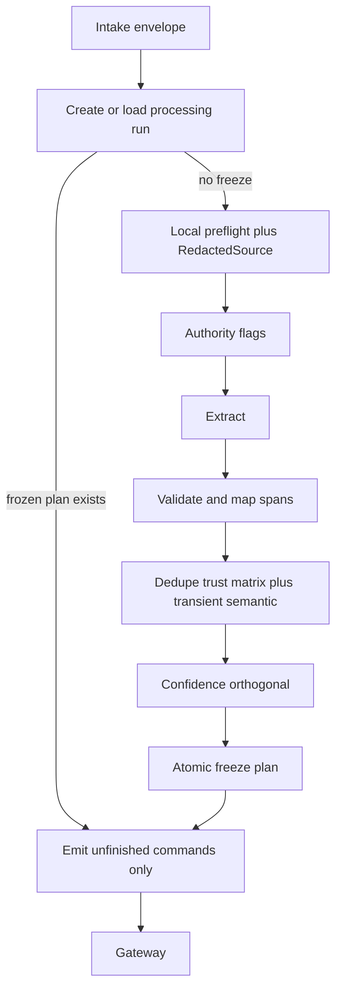

### 39.2 Explicit remember pipeline

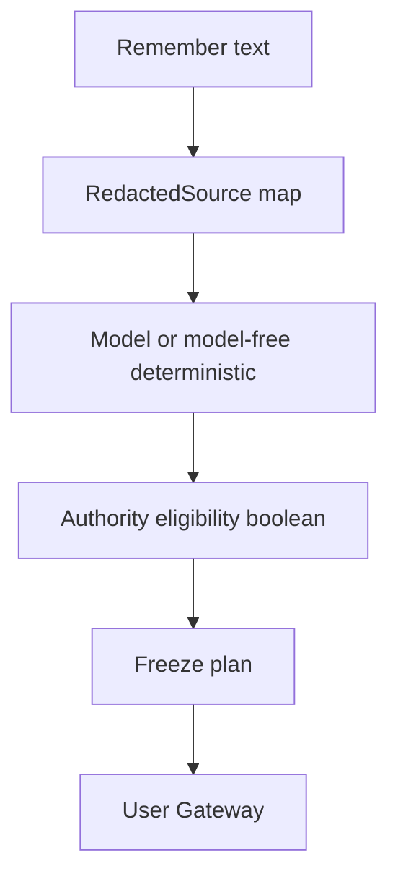

### 39.3 Conversational extraction pipeline

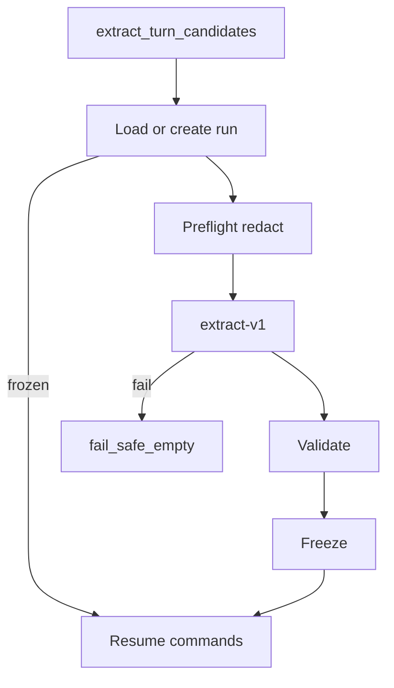

### 39.4 Document processing pipeline

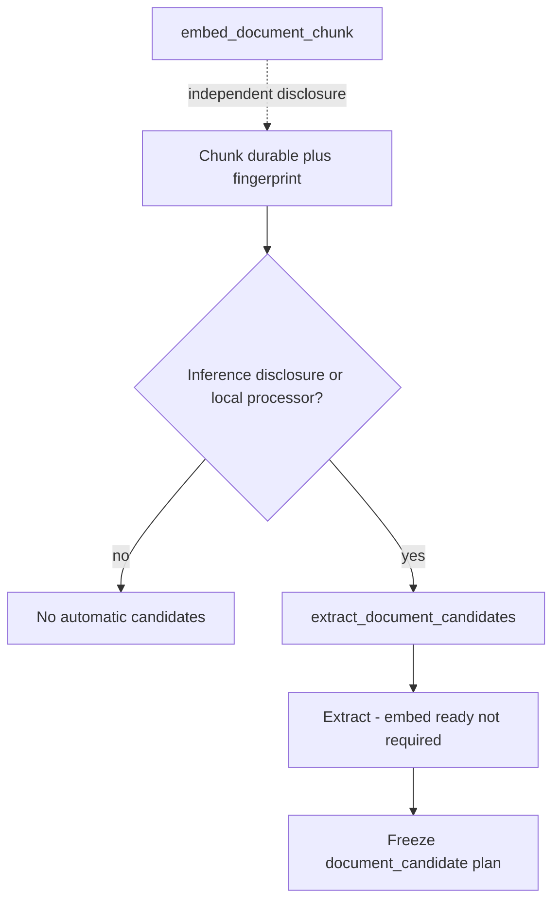

### 39.5 Mixed secret and safe content

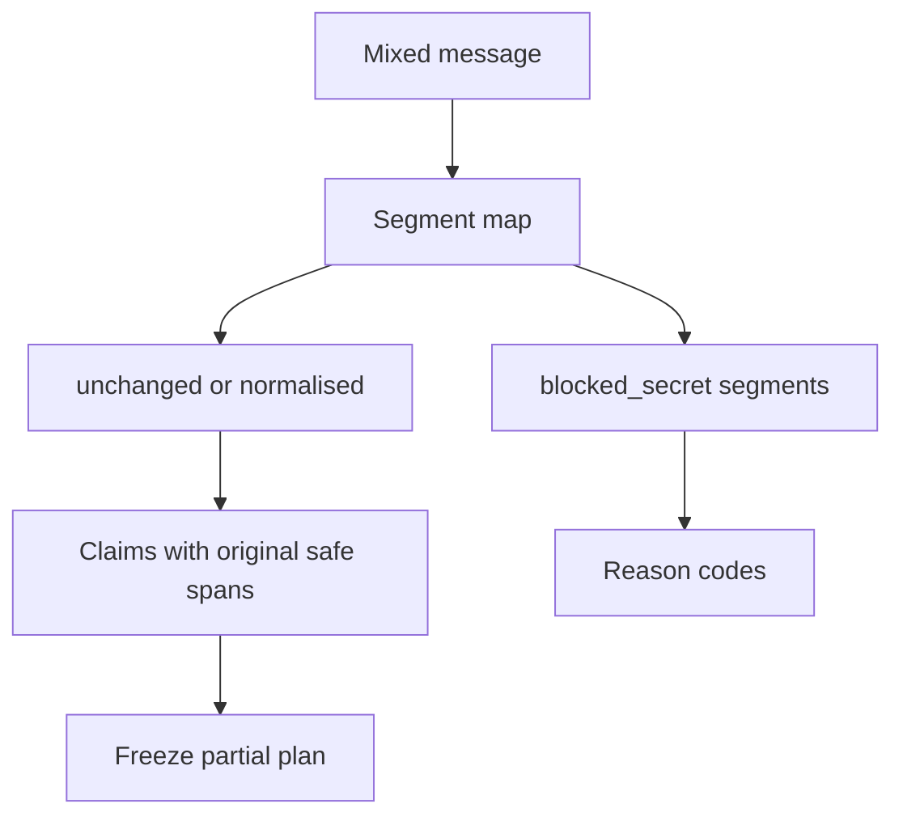

### 39.6 Validation decision tree

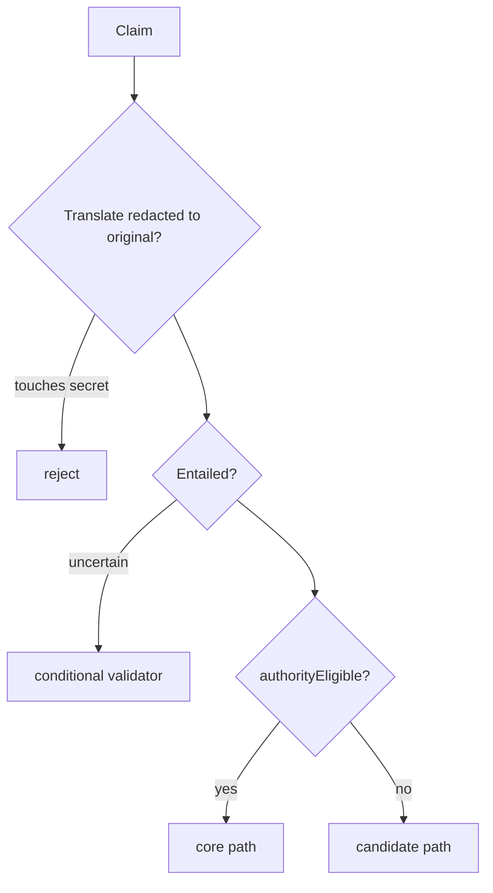

### 39.7 Exact and semantic dedupe flow

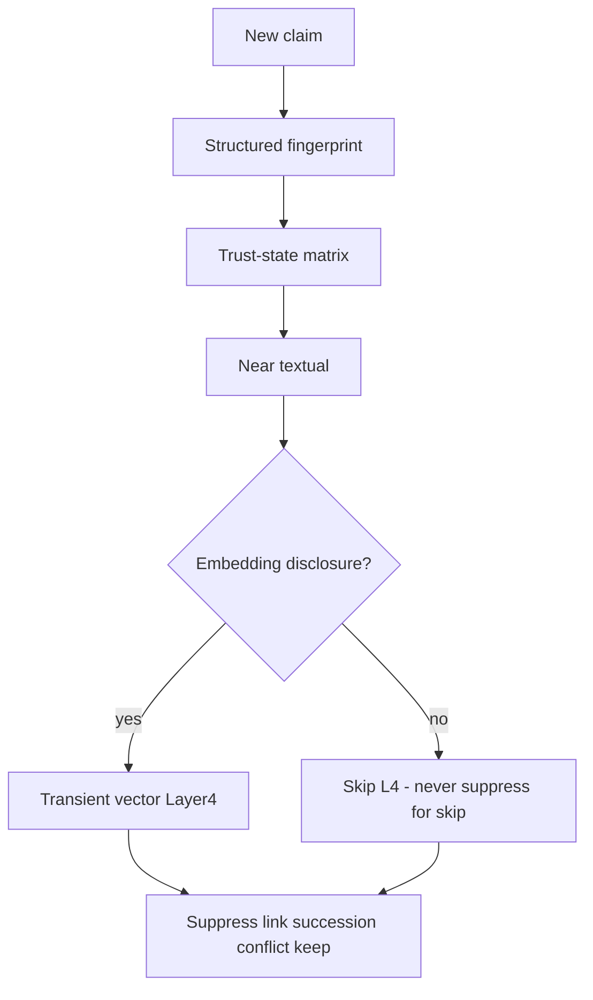

### 39.8 Correction versus changed-over-time

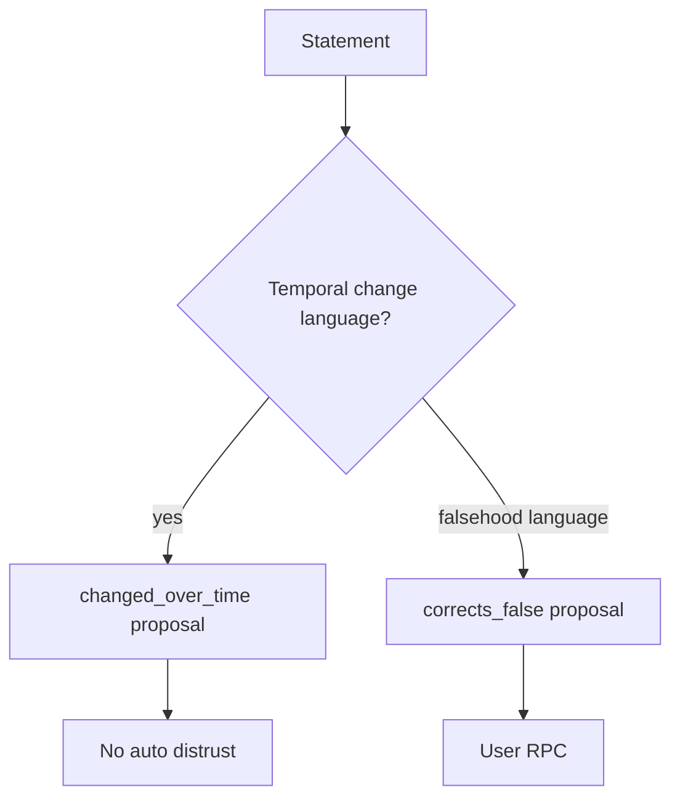

### 39.9 Conflict-detection flow

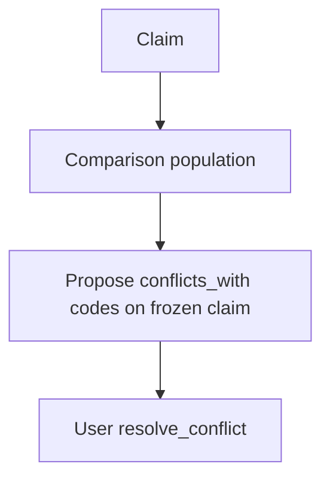

### 39.10 Provider failure and retry flow

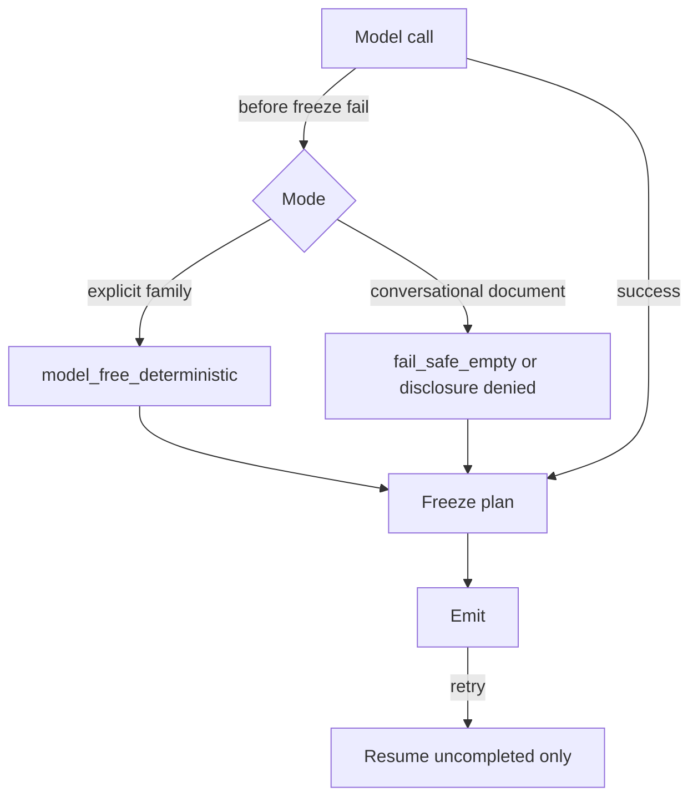

### 39.11 Processing-to-Gateway command flow

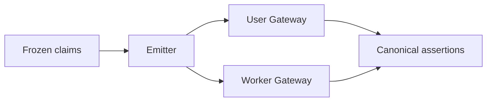

### 39.12 Processing version and replay flow

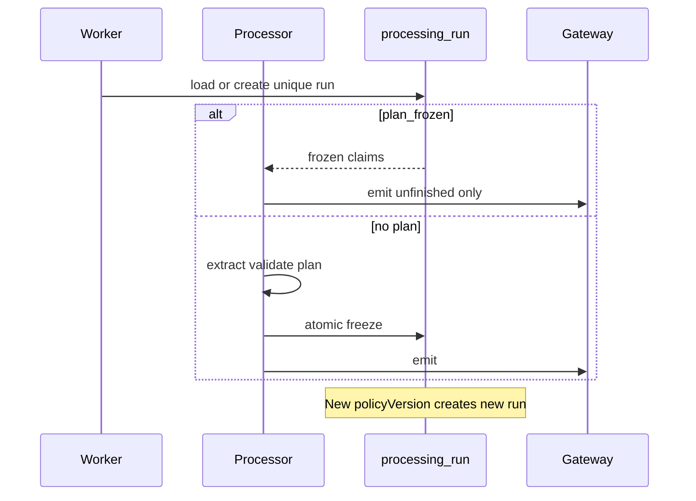

---

## 40. Processing invariants

1. No processing model directly writes canonical memory.  
2. Processing output is data consumed by the Gateway.  
3. Models cannot grant user authority.  
4. Confidence cannot grant trust.  
5. Explicit authority applies only to user-authored propositions with safe original spans.  
6. Material transformation loses direct authority.  
7. Source polarity, modality, qualifiers, and temporal scope must be preserved.  
8. Forbidden secrets are detected locally before external disclosure where technically possible.  
9. Raw forbidden secrets never enter assertions, jobs, results, audit metadata, or ordinary logs.  
10. Mixed safe and blocked content cannot leak blocked spans.  
11. Documents remain untrusted source content.  
12. Document instructions cannot alter processing policy.  
13. Document-derived claims remain candidates.  
14. Assistant statements are not user evidence unless the user explicitly confirms them.  
15. A valid empty extraction result is distinguishable from failure.  
16. Provider failure does not silently create different trusted meaning.  
17. Exact replay cannot duplicate assertions.  
18. Rejected candidates do not permanently block later valid claims.  
19. Semantic dedupe never silently rewrites trusted content.  
20. Model-detected conflict never automatically distrusts a trusted assertion.  
21. Changed-over-time remains distinct from prior falsehood.  
22. Temporal changes do not alter trust.  
23. Historical assertions may remain trusted.  
24. Every claim has source provenance with **original** safe offsets.  
25. Every material transformation is marked.  
26. Processing version, prompt version, policy version, and engine are traceable on the processing run.  
27. User and document ownership remain same-user verified.  
28. Turn jobs cannot emit document candidates.  
29. Document jobs cannot emit conversational candidates.  
30. New processing cannot emit migration-only enum values.  
31. Legacy rows are not retrospectively assigned invented processing evidence.  
32. Processing metadata excludes raw private bodies by default.  
33. Partial outcomes are idempotent under a frozen plan.  
34. Retry after Gateway success returns existing command results.  
35. Stage 11 can add entity linkage without replacing atomic claims.  
36. Stage 12 can consume assertions without relying on processing confidence as trust.  
37. Stage 13 can replace providers without changing canonical semantics.  
38. Heuristic extractors must not be used as conversational semantic fallback.  
39. Comparison populations are same-user only.  
40. `legacy_unknown` is never emitted by Stage 10.  
41. Worker relation roles for created candidates are `candidate_extra` only.  
42. Embedding vectors never appear in processing logs, jobs, frozen claims, or command results.  
43. First-person rewrite without entailment validation is treated as material.  
44. Task-only utterances produce no durable claims.  
45. Hypotheticals default to non-durable unless explicitly retained as hypothetical.  
46. A processing plan is frozen before any Gateway command emission.  
47. After freeze, model nondeterminism cannot add claims to the same run.  
48. Retries resume only uncompleted frozen commands.  
49. Claims touching `blocked_secret` segments cannot be authority-eligible.  
50. Redacted model offsets are translated before provenance persistence.  
51. Relative-time fingerprints include source timestamp and timezone when unresolved.  
52. Missing semantic Layer 4 never suppresses a claim.  
53. Transient comparison vectors are discarded after use.  
54. Distrusted assertions never suppress new claims and are never merge destinations.  
55. Import/integration package confirmation metadata cannot set trust or authority.  
56. Confidence formulas contain no explicit-storage or authorship authority bonus.  
57. Explicit safe atomic claims work without an external model via model-free fallback.  
58. Model-free fallback covers all product content kinds without `legacy_unknown`.  
59. Document extraction does not require embedding readiness.  
60. Inference and embedding disclosure channels are independent.  
61. Provider-restricted / disclosure-denied documents do not magically produce candidates.  
62. Neighbour chunk context obeys the same disclosure policy as the primary chunk.  

## 41. Risks and tradeoffs

Prior tradeoffs retained. Additional:

| Topic | Tradeoff |
| --- | --- |
| Durable freeze storage | Extra operational tables vs correctness under model nondeterminism — **accepted** |
| Model-free kind classifier | Lower recall than LLM; higher authority safety — **accepted** |
| Skipping Layer 4 when disclosure denied | More near-duplicate candidates — **accepted** vs secret/exfil risk |
| Import never auto-trusts | More review friction — **accepted** until signed-bundle policy exists |
| Extract without embed ready | Candidates may lack vectors until later — Stage 12 must not assume embed-ready |

---

## 42. Stage 9 amendment requests

Do **not** edit Stage 9 in this stage.

### Amendment A — Expanded ingestion command payloads

Unchanged need: structured `assertionDraft` / claim fields on user/worker commands. Approver: Stage 9 / 16.

### Amendment B — Per-assertion processing evidence

Optional companion to run/claim tables for assertion-linked evidence. May be satisfied partly by amendment F foreign keys. Approver: Stage 9 / 16.

### Amendment C — Worker-proposed succession links

Unchanged: candidate-side proposals without auto-distrust. Approver: Stage 9 / 16.

### Amendment D — Structured recurrence (optional)

Proceed without via scope_labels. Approver: Stage 9 if required.

### Amendment E — Document chunk content fingerprint column

`document_chunks.content_sha256` (or equivalent) required for extract and embed readiness checks. Approver: Stage 9 / 16. **Proceed without?** No for safe document extract.

### Amendment F — Durable processing runs and frozen claims (**required for corrected Stage 10**)

1. **Missing capability:** Durable processing lifecycle that freezes the first successfully validated command plan before Gateway emission, with per-claim command state for resume-without-re-extract.  
2. **Why existing fields are insufficient:** `memory_command_results` idempotency alone cannot prevent a retry from producing a differently split claim set; intake decisions lack per-claim emission state; provenance lacks run-level freeze semantics.  
3. **Smallest compatible change:** Add operational tables `memory_processing_runs` and `memory_processing_claims` with fields in §5A; unique `(user_id, intake_id, source_fingerprint, processing_version, policy_version)`; RLS SELECT own; writes via Gateway/worker DEFINER only; forbid secret/body/embedding/CoT columns.  
4. **Can Stage 10 proceed without it?** Design yes; correct idempotent implementation **no**.  
5. **Security consequences:** Improves safety against duplicate/divergent emits; must not store raw secrets; service_role/worker cannot use runs to grant `user_asserted`.  
6. **Approver:** Stage 9 maintainer / Stage 16.

### Amendment G — Processing span fields on provenance (optional if F stores spans)

If provenance must answer explainability without joining F, add original span start/end + span fingerprint columns. Else F is enough. Approver: Stage 9 / 16.

---

## 43. Decisions intentionally deferred

| Item | Owner |
| --- | --- |
| Entity graphs | Stage 11 |
| Assistant retrieval ranking / packing | Stage 12 |
| Provider/framework selection | Stage 13 |
| Full evaluation harness | Stage 15 |
| Migration / PR sequence | Stages 16–17 |
| **Signed-bundle automatic import authority** | Later explicit policy (not Stage 10) |
| Product UX copy for partial blocks | Product |
| Cross-model agreement default | Optional future |

---

## 44. Unknowns

1. Secret-scanner false-negative rate in production.  
2. Semantic cosine threshold calibration (0.91 initial).  
3. Latency cost of durable freeze TX under compound remember.  
4. Availability of a policy-approved `local_in_process` document processor in first implementation.  
5. Volume of document chunks per user.

---

## 45. Acceptance-criteria assessment

| # | Criterion | Status |
| --- | --- | --- |
| 1 | Option E selected | **Met** |
| 2 | Exact I/O contracts | **Met** — envelope, RedactedSource, AtomicClaim, run/claim, CommandPlan |
| 3 | Explicit-remember authority | **Met** — boolean eligibility + model-free |
| 4 | Atomic splitting | **Met** |
| 5 | Lossless vs material | **Met** |
| 6 | Local secret handling + span mapping | **Met** — §10 |
| 7 | Sensitivity/disclosure | **Met** — independent channels |
| 8 | Conversational context Option C | **Met** |
| 9 | Document extraction safely | **Met** — extract ≠ embed; disclosure gates |
| 10 | Content-kind classification | **Met** — full model-free precedence |
| 11 | Temporal/modality | **Met** — fingerprint-safe |
| 12 | Prompts/schemas | **Met** |
| 13–14 | Deterministic + conditional validation | **Met** |
| 15–16 | Provider failure / no heuristic drift | **Met** |
| 17–18 | Exact + semantic dedupe | **Met** — structured FP + transient vector |
| 19–20 | Correction / conflict safety | **Met** |
| 21 | Confidence orthogonal to authority | **Met** — no s_explicit/s_direct authority bonus |
| 22 | Partial outcomes | **Met** — freeze semantics |
| 23–24 | Gateway mapping + worker isolation | **Met** |
| 25 | Idempotency/versioning | **Met** — durable run |
| 26 | Provenance/observability | **Met** |
| 27–28 | No secrets / no model authority | **Met** |
| 29 | No silent Stage 9 redesign | **Met** — amendments A–G |
| 30–33 | No Stage 11/12/13; no prod change | **Met** |
| 34 | Stable later-stage outputs | **Met** |
| **C1** | Retries cannot add claims after freeze | **Met** |
| **C2** | Plans durable before emission | **Met** |
| **C3** | Redacted→original mapping | **Met** |
| **C4** | Secret spans cannot support authority | **Met** |
| **C5** | Relative-time fingerprint safety | **Met** |
| **C6–C7** | Transient vector; missing L4 ≠ suppress | **Met** |
| **C8** | Distrusted/rejected never block | **Met** |
| **C9** | Imports cannot grant authority via metadata | **Met** |
| **C10** | No explicit-storage confidence bonus | **Met** |
| **C11–C12** | Model-free explicit path complete | **Met** |
| **C13–C14** | Doc extract/embed independent; no magic candidates | **Met** |

---

## 46. Files and questions recommended for Stage 11

Unchanged questions on entity seeding from subject/predicate annotations; relationship_fact requirements; correction links vs entity merges; scope_labels → project entities; multi-chunk mentions.

---

## 47. Disagreements with prior artifacts

| Item | Disposition |
| --- | --- |
| Prior Stage 10 claim-key-only idempotency | **Corrected** — durable freeze (amendment F) |
| Prior Stage 10 string-concat fingerprint | **Corrected** — canonical structured identity |
| Prior Stage 10 import `priorConfirmed` auto-trust path | **Corrected** — metadata only |
| Prior Stage 10 confidence `s_explicit` / authorship bonus | **Corrected** — removed |
| Prior Stage 10 underspecified model-free fallback | **Corrected** — full kind precedence |
| Prior Stage 10 doc extract implying embed-ready / magic medical candidates | **Corrected** |
| `00-roadmap.md` stale statuses | Not edited |
| Stage 9 narrow commands | Amendment A; not silently changed |

---

## 48. Final consistency checklist

- [x] Option E preserved with listed architecture constraints  
- [x] Durable processing-run + frozen-plan contract defined  
- [x] Amendment F (and related) recorded — Stage 9 not silently redesigned  
- [x] RedactedSource mapping with original provenance rules  
- [x] Structured temporally-safe exact fingerprints  
- [x] Transient semantic vector + disclosure contract  
- [x] Trust-state dedupe matrix including distrusted/rejected  
- [x] Imports/integrations cannot grant authority via metadata  
- [x] Confidence orthogonal; no explicit-storage bonus  
- [x] Complete model-free explicit-authority fallback  
- [x] Document extract ≠ embed; no magic provider-denied candidates  
- [x] Diagrams, examples, invariants, acceptance updated  
- [x] Only this file changed; production behaviour unchanged  

### Correction-review verification

1. Retries cannot create new claims because a model changed its output — **Yes (freeze)**  
2. Processing plans durable before command emission — **Yes**  
3. Redacted offsets map to original provenance — **Yes**  
4. Secret spans cannot support user authority — **Yes**  
5. Relative-time claims do not collide across dates — **Yes**  
6. Semantic dedupe transient-vector contract — **Yes**  
7. Missing semantic comparison never suppresses — **Yes**  
8. Distrusted/rejected never block — **Yes**  
9. Imports cannot grant authority through metadata — **Yes**  
10. Confidence has no explicit-storage bonus — **Yes**  
11. Explicit safe claims work without external model — **Yes**  
12. Deterministic fallback covers all kinds without `legacy_unknown` — **Yes**  
13. Document extraction and embedding permissions independent — **Yes**  
14. Provider-restricted documents do not magically produce candidates — **Yes**  
15. Stage 9 gaps are explicit amendments — **Yes**  

---

## Appendix A — Model-free deterministic patterns (binding seed)

Precedence = §23.3. Illustrative closed patterns (evaluate per precedence, not table order alone):

| Kind | Closed pattern examples |
| --- | --- |
| instruction | `\b(from now on\|always\|never)\b`, `\bcall me\b`, `\buse (metric\|imperial)\b` |
| commitment | `\bi('ll\| will)\b` + deadline/obligation cue |
| decision | `\b(we\|i) (decided\|chose)\b` |
| goal | `\bi('m\| am) training for\b`, `\bi want to\b` |
| event | `\b(flight\|meeting\|appointment)\b`, `\btomorrow at\b` |
| relationship_fact | `\bmy (manager\|friend\|colleague\|doctor)\b`, `\b\w+ is my (manager\|friend)\b` |
| preference | `\bi (prefer\|like\|love\|hate\|don't like\|do not like)\b` |
| project_context | `\bfor project\b`, `\b[\w-]+ uses\b` with project cue |
| identity | `\bmy name is\b`, `\bi live in\b`, `\bi work (at\|in)\b` |
| knowledge | durable note not matching above after remember-prefix strip |

No paraphrase. Split only per §23.4.

## Appendix B — Comparison population query (conceptual)

```text
Same user_id
AND retention = 'present'
AND organisation IN ('visible', 'archived')
-- trust/review/succession filtered by trust-state matrix in application logic
ORDER BY updated_at DESC
LIMIT 64
```

Deleted/purge_pending/purged excluded. Distrusted included for context only, never as suppress/merge target.

## Appendix C — Stage 15 contract-test surfaces (preview)

1. Freeze-before-emit: second extract attempt after freeze does not change claims.  
2. Resume emits only unfinished frozen commands.  
3. Redacted offset translating onto blocked_secret → reject.  
4. Authority denied when evidence touches secret segment.  
5. “tomorrow” fingerprints differ across sourceTimestamp days.  
6. Layer 4 skipped when embedding disclosure false → claim not suppressed for that reason.  
7. Transient vector absent from jobs/evidence/logs.  
8. Rejected candidate does not block re-add.  
9. Distrusted match does not suppress explicit reassertion.  
10. Import `priorConfirmed=true` still creates candidate only.  
11. Confidence unchanged by explicit-storage flag alone.  
12. Model-free marathon / Acme / flight / Sarah / knowledge examples.  
13. Document extract allowed while embed not ready.  
14. Medical doc with inference disclosure denied → no automatic candidates without local processor.  
15. Worker cannot emit document_candidate on turn job.  
16. Conflict proposal does not auto-distrust.  
17. Mixed secret partial acceptance without provider leak.  
18. Valid empty ≠ failure ≠ heuristic invent.  

---

*End of Stage 10 memory processing design (corrected). Production behaviour unchanged.*
