# 11 — Entity and Relationship Architecture Design

> **Role:** Entity and Relationship Architecture Designer  
> **Stage:** 11 of the Cortaix memory-system planning process  
> **Constraints:** Documentation and design only. No production code, migrations, SQL execution, APIs, prompts, tests, dependencies, configuration, or behaviour changes. Does not edit Stages 0–10 reports or `00-roadmap.md`. Does not select Stage 12 ranking, Stage 13 frameworks, Stage 15 evaluation suites, or Stage 16–17 implementation sequencing.  
> **Branch:** `cursor/memory-entities-relationships-design`  
> **Output:** this file only

---

## 1. Executive summary

**Technical decision — selected architecture (Option C, refined):** Cortaix adopts an **assertion-first graph**.

| Layer | Status |
| --- | --- |
| Memory assertions | **Canonical factual truth** (Stages 8–10 unchanged) |
| Entity identity records and aliases | **Canonical operational identity** (user-scoped); **primary alias is canonical name**; `primary_label` is a denormalized read cache |
| Mentions (`resolved_entity_id`) | **Canonical operational span resolution** |
| Assertion grounding (`memory_assertion_entities`) | **Canonical operational role→entity links** for a revision (kept in sync with mention resolution; not a free-floating second identity store) |
| Entity-resolution candidates / scope-label candidates | **Candidate operational data** |
| Relationship **series** + **episodes** + support | **Derived and rebuildable** projections supported by assertions; multiple temporal episodes may coexist (exact-bounds episode keys §26) |
| Pairwise **episode relations** (overlap/containment/adjacency/disjoint/unknown) | **Derived and rebuildable dense set** — table `memory_entity_relationship_episode_relations` (§26.3); `N(N-1)/2` rows; missing ≠ disjoint |
| Relationship **user decisions** (confirm/reject/suppress display) | **Canonical operational** — survive full series/episode rebuilds (§23.1); splits may mark `needs_review` |
| Entity search indexes | **Derived and rebuildable** (Stage 7 derived layer) |

Binding product rules:

1. A `relationship_fact` assertion may exist **without** resolved entities. Entities are not required to store relationship facts.
2. Entity resolution **never** grants assertion trust. Resolution confidence ≠ memory trust.
3. Relationship projections/episodes **cannot** be more authoritative than their supporting assertions.
4. User-created graph relationships must create or reference an assertion; edges cannot bypass factual provenance.
5. PostgreSQL remains canonical. No graph database is required. No Stage 13 framework is selected.
6. Production today has **no** entity or relationship graph. Stage 11 is additive and coexistence-safe.
7. Identical names never imply identical people; provisional person aliases do **not** auto-link by name equality alone.
8. Scope labels remain relevance metadata (possibly one-to-many project candidates), never ACLs.
9. Profile remains the account identity source; the self entity is a thin synchronized anchor.
10. Provisional entity creation is rate- and count-limited; overflow leaves mentions unresolved or queued for review.
11. User relationship confirmations, rejections, and display preferences are stored as **canonical operational decisions**, never only on derived series/episode rows.
12. Mentions have an explicit retention lifecycle (`active` / `archived` / …); archival and purge are schema-backed (§13.4).
13. Pairwise temporal relations (incl. `disjoint`/`unknown`) live densely in `memory_entity_relationship_episode_relations` (`N(N-1)/2`), not a scalar on one episode; missing ≠ disjoint.  
14. `series_identity_key` uses distinct asymmetric vs symmetric formulas (§23.1).

This document answers Stage 10’s five handoff questions, defines exact tables/services/commands/jobs, and hands Stage 12 safe query contracts **without** ranking or packing.

---

## 2. Verified current repository behaviour

**Label: Verified current behaviour**

### 2.1 No entity or relationship graph exists in production

| Surface | Finding |
| --- | --- |
| Schema | No `entities`, `aliases`, `mentions`, `edges`, or relationship tables in `supabase/migrations/` |
| Types | `Memory` is flat text + enums (`src/lib/types.ts`); no entity IDs |
| Extraction | Outputs `{content, type, category, confidence, is_sensitive}` only; LLM prompt extracts durable facts about the **user**, not third-party graphs (`src/lib/memory/extraction/`) |
| Related memories | `GET /api/memories/[id]/related` uses semantic similarity + optional same-`category` fill — not graph edges |
| Connections UI | `/vault/connections` + `RelatedMemoriesStrip` display similarity %, not people/org graphs |
| Audit `entity_type` | Polymorphic audit subject (`memory`, `profile`, `document`, `chat_session`) — **not** knowledge-graph entities (`src/lib/audit.ts`) |
| `relationship_fact` | Exists only in Stage 8–10 docs; **not** in production enums |
| Mem0 | Maps `cv_memory_id`, type, source, status, category — no person/org sync |

### 2.2 Current memory model (production)

`public.memories` (`20260720000002_memories.sql`): `id`, `user_id`, `content`, freeform `category`, `type` ∈ {profile, preference, semantic, episodic, project, temporary}, `source` ∈ {manual, chat_extraction, document, onboarding, import}, `confidence`, `status`, `is_sensitive`, `embedding vector(1536)`, `expires_at`, `pinned_at`, timestamps.

Chat assembly (`src/lib/orchestration/chat.ts`): semantic retrieve ∪ active `type=profile` memories ∪ document chunks ∪ profile `UserIdentity` (`display_name`, `persona`).

### 2.3 Export and deletion

| Path | Behaviour |
| --- | --- |
| `GET /api/export` | Profile + non-deleted memories + document metadata; no graph data |
| `DELETE /api/memories/[id]` | Provider remove + hard row delete |
| Account memories scope | `removeAll` + delete memory rows |
| Account delete | Mem0 cleanup, storage remove, `auth.admin.deleteUser` → CASCADE |

### 2.4 Identity today vs Stage 11 entities

| Concept today | Meaning |
| --- | --- |
| `profiles.display_name` / `persona` | Account settings → prompt `USER IDENTITY` |
| `type=profile` memories | Freeform vault facts, always-unioned into chat context |
| Stage 11 self entity | Operational identity **anchor** for mentions of “I/me/my”; profile-synced thin mirror (§9.1); **not** a second profile truth store |

### 2.5 What Stage 11 can consume from Stage 10 (target contracts)

| Stage 10 field | Stage 11 use |
| --- | --- |
| `claimText` / `validatedNormalizedClaim` | Assertion content; mention context |
| `subject` / `predicate` / `objectOrComplement` | Seed mention candidates (**annotations, not entities**) |
| `subjectAnnotation` | Self vs third-party gating |
| `contentKind` especially `relationship_fact` | Relationship-projection eligibility |
| `scopeLabels` | Project-entity candidate seeding |
| Temporal phase/bounds/modality | Projection temporal cache (derived) |
| Sensitivity / disclosure | Entity sensitivity floors + disclosure gates |
| Processing confidence | **Not** resolution confidence; separate scorer |
| `resultingAssertionId` + revision | Grounding FK targets |
| Source spans / fingerprints | Mention provenance |
| Correction/conflict outcomes | Trigger projection reconciliation; do not redefine succession |

**Insufficient today in Stage 10 frozen claims:** independent typed mention list with per-mention original spans and entity-kind hints. See §57 Stage 10 amendment requests. Stage 11 can still proceed with a hybrid detector + amendment.

---

## 3. Binding inputs from Stages 7–10

**Label: Canonical data / Security property** (preserved)

1. Modular monolith; PostgreSQL canonical; external indexes derived/rebuildable.  
2. Personal memory user-scoped; workspace membership never widens access.  
3. Route handlers do not own memory authority; Gateway RPCs mutate.  
4. Deletion is a tracked workflow; purged content leaves no private graph support.  
5. Retrieved/document content is untrusted input.  
6. External services cannot become canonical authority.  
7. No graph DB required.  
8. Assertions remain durable claims; candidates are not trusted memory.  
9. Distrusted = repudiated or confirmed false (narrow).  
10. `relationship_fact` may exist before entity resolution.  
11. Entity resolution ≠ assertion trust; entity confidence ≠ memory trust.  
12. Temporal phase, bounds, modality remain orthogonal.  
13. Scope labels = relevance, not ACLs.  
14. Documents are sources, not memories.  
15. Origin never independently grants authority.  
16. Third-party personal data may be sensitive.  
17. `memory_assertions` + revisions + provenance + links remain as designed.  
18. Do **not** overload `memory_assertion_links` with domain graph edges.  
19. Composite `(user_id, id)` ownership prevents cross-user links.  
20. Stage 10 produces atomic assertions; annotations seed but do not become entities.  
21. Entity processing must not reinterpret material model inference as trusted.  
22. Frozen processing plans must not be rewritten by entity resolution.  
23. Document-derived assertions remain candidates.  
24. Stage 11 does not redefine Stage 9 succession links or Stage 10 freeze/authority/disclosure.

---

## 4. Entity architecture alternatives

| Option | Summary | Verdict |
| --- | --- | --- |
| **A — Assertions only** | Keep `relationship_fact` text; no entity records | Rejected as primary — insufficient for ambiguity, merge/split, explainability, Stage 12 entity filters |
| **B — Canonical entities + independent relationship edges** | Edges are facts beside assertions | Rejected — dual truth, trust/temporal/correction drift |
| **C — Canonical entities + assertion-backed relationship projections** | Entities canonical operational; edges derived | **Selected** |
| **D — Full ontology / KG** | Rich classes, inference, reasoning | Rejected — over-engineering; provider-coupled risk |
| **E — External graph DB as canonical** | Neo4j/etc. authoritative | Rejected — violates PostgreSQL canonicity; Stage 13 premature |
| **F — Derived entities only** | Fully rebuildable from assertion text | Rejected as sole model — loses user merge/split/alias authority and stable IDs |

### Assessment matrix (selected criteria)

| Criterion | A | B | C | D | E | F |
| --- | --- | --- | --- | --- | --- | --- |
| Assertion canonicity | ✓ | ✗ risk | ✓ | ✗ risk | ✗ | ✓ |
| Trust preservation | ✓ | ✗ | ✓ | ✗ | ✗ | ✓ |
| Correction / temporal | Weak UX | Dual | ✓ | Complex | Dual | Rebuild lag |
| Ambiguity / merge-split | Poor | Possible | ✓ | Heavy | Possible | Fragile |
| RLS / same-user | Simple | Harder | Feasible | Hard | Cross-store | Feasible |
| Deletion | Easy | Edge orphans | Rebuildable | Hard | Sync risk | Easy |
| Explainability | Text only | Dual | Support rows | Opaque inference | Opaque | Rebuild |
| Postgres feasibility | ✓ | ✓ | ✓ | Partial | ✗ | ✓ |
| Over-engineering | Under | Medium | Balanced | High | High | Medium |
| Provider independence | ✓ | ✓ | ✓ | Weak | Weak | ✓ |

---

## 5. Selected entity architecture

**Technical decision:** **Option C — assertion-first graph** (evaluated seriously and adopted).

```text
Assertion (canonical fact)
  └─ Mentions (resolved_entity_id = span resolution)
       └─ Entity (canonical operational identity; primary alias = name)
            └─ Assertion grounding (canonical role→entity for revision; synced to mention)
                 └─ Relationship series (derived)
                      └─ Episodes (derived temporal periods; multi allowed)
                           └─ Support → assertions + revisions + mentions
```

Refinements beyond the “likely direction”:

1. Provisional entities are **canonical operational rows** with `resolution_authority='system_proposed'` — not derived-only.  
2. Relationship **series + episodes** are **always rebuildable** from grounding + assertions using **exact temporal identity** (§26); repeated periods are separate episodes.  
3. Manual “draw an edge” UX must create/link a `relationship_fact` assertion, then project series/episodes.  
4. Entity search/FTS tables are derived indexes only.  
5. **Primary alias is the canonical display name**; `memory_entities.primary_label` is synchronized denormalized cache (§10.1).  
6. **Mention resolution is authoritative for spans**; assertion grounding is authoritative for revision-role links and must agree with the mention (§20).  
7. User relationship display/confirm/reject decisions live in `memory_entity_relationship_user_decisions` and **survive rebuilds** (§23.1).  
8. Mentions use an explicit retention lifecycle; soft-cap archival is schema-backed (§13.4).

**Why not A:** Stage 12 and UX need stable person/project anchors, disambiguation, and “why connected” without re-parsing free text.  
**Why not B/E:** Independent edges become a second memory store.  
**Why not D/F:** Ontology and pure derivation either overreach or erase user authority over identity.

---

## 6. Design vocabulary

| Term | Definition | Classification |
| --- | --- | --- |
| **Assertion** | Durable claim governed by Stages 8–10 | Canonical semantic truth |
| **Entity** | User-scoped identity anchor (person, org, place, project, concept) | Canonical operational identity |
| **Mention** | Span or structured annotation that may refer to an entity | Operational (may be candidate-linked) |
| **Alias** | Name/nickname/handle/former name/user label for an entity | Canonical operational (with authority) |
| **Primary alias** | The single active `is_primary` alias for an entity; **canonical display name** | Canonical operational |
| **`primary_label`** | Denormalized copy of primary alias `display_value` on the entity row | Synchronized read optimization (not independent truth) |
| **Mention resolution** | `memory_entity_mentions.resolved_entity_id` — what a span refers to | Canonical operational (span-level) |
| **Assertion grounding** | Mapping from assertion revision role (+ mention) → entity | Canonical operational (assertion-role); must match mention resolution |
| **Relationship series** | Derived identity of `(source, target, type)` | Derived rebuildable parent |
| **Relationship episode** | One temporal period of a series identified by **exact normalized temporal identity** | Derived rebuildable; multiple per series |
| **Episode relation** | Pairwise temporal relation between two episodes of one series | Derived rebuildable (`episode_relations`) |
| **Relationship support** | Assertion+revision backing an episode | Derived rebuildable |
| **Relationship user decision** | User confirm/reject/suppress/restore for a series or typed suggestion | **Canonical operational** (survives rebuild; split-safe) |
| **`series_identity_key`** | Stable hash of user + type + oriented endpoints (§23.1 / §25) | Used for decisions and series join; not temporal |
| **`user_display_confirmed` cache** | Optional denormalized flag on series from user decisions | Synchronized cache only — not canonical |
| **Resolution candidate** | Scored possible entity for a mention | Candidate operational |
| **Scope-label candidate** | Possible project entity for a normalized scope label | Candidate operational (one-to-many allowed) |
| **Self entity** | Unique `person` entity with `is_self=true` | Canonical operational (profile-synced thin anchor) |
| **Succession link** | Stage 9 `memory_assertion_links` | Canonical (unchanged) |
| **Entity-grounded association** | Same-entity co-mention / project membership | Derived or on-demand |
| **Semantic similarity association** | Embedding relatedness | Stage 12 (not Stage 11 storage) |

### Primary conceptual distinction (normative)

```text
Assertion:  "My manager is Tasos."     → trust, temporal, provenance, disclosure
Entity:     Tasos (person)              → identity anchor
Mention:    "Tasos" in assertion A123   → span + role + resolution state
Alias:      "Tasos", "Τάσος"            → names for the entity
Grounding:  subject→self, object→Tasos  → confirmed role mapping
Series/episode: self --reports_to--> Tasos (current episode) → derived from supporting assertion(s)
```

---

## 7. Canonical versus operational versus derived data

| Data | Class | Rebuildable? | User-confirmable? |
| --- | --- | --- | --- |
| Assertion content, trust, temporal, disclosure | Canonical semantic | No (history via revisions) | Yes (trust/review) |
| Entity row (id, kind, `primary_label` cache, is_self, lifecycle) | Canonical operational (+ denormalized label) | Entity identity no; `primary_label` re-syncable from primary alias | Yes |
| Aliases with authority (incl. primary) | Canonical operational — **primary alias is name truth** | No | Yes |
| Mentions + `resolved_entity_id` | Canonical operational span resolution | Spans partially re-detectable; **resolution decisions and history are not discarded as mere cache** | Resolution yes |
| Assertion–entity grounding | Canonical operational role links | Active rows for a revision may be **re-emitted from that revision’s resolved mentions** after revision change; **user grounding authority/history retained** | Yes |
| Resolution / scope-label candidates | Candidate | Yes | Suggest / disambiguate |
| Relationship series + episodes + support + episode_relations | Derived projection | **Yes** (full rebuild; re-applies user decisions afterward) | Display confirm via user-decision table, not invent facts |
| Relationship user decisions | Canonical operational | **No** | Yes (confirm/reject/suppress/restore); may become `needs_review` on ambiguous split |
| Mentions retention (`retention_state`) | Canonical operational lifecycle | Archival/compaction/purge rules §13.4 | N/A |
| Entity FTS / embedding search | Derived | Yes | N/A |
| External entity refs | Operational optional | On disconnect | User-linked only |

---

## 8. Entity kinds

**Technical decision — first-class kinds (closed enum):**

```text
person | organisation | place | project | concept
```

| Kind | First-class? | Auto-create provisional? | Notes |
| --- | --- | --- | --- |
| `person` | Yes | Yes (named third parties, gated) | Includes self |
| `organisation` | Yes | Yes when named as org | Companies, teams as orgs when org-like |
| `place` | Yes | Yes when place-named | Cities, countries, offices as places |
| `project` | Yes | Yes from clear project names / scope labels | Relevance only |
| `concept` | Yes | Conservative | Tools, products, services, abstract topics |
| `artifact` | **No** (assertion-only initially) | No | Files, docs stay document sources or concept |
| `product` / `service` | Under **`concept`** | Conservative | Avoid ontology sprawl |
| `event` | **No** — remain `event` assertions | No | Do not entity-ify meetings by default |
| `other` | **Forbidden** | — | Dangerously vague |
| Custom kinds | **Forbidden** | — | Closed vocabulary |

**Kind changes:** allowed only via user/system command; write `memory_entity_kind_history` (operational audit). Kind never grants trust.

### Per-kind criteria

#### `person`
- **Positive:** Named humans (self, family, colleagues, doctors, clients, public figures as *mentions in user's memory*).  
- **Exclusion:** Roles alone (“my manager” without a name) are **not** person entities; they are predicates/aliases-of-context, not identity.  
- **Examples:** Tasos, Sarah, Dr Smith.  
- **Ambiguous:** “Paris”, “Jordan”, “Apple” (see ambiguity).  
- **Relationship families:** person↔person, person↔org, person↔project, person↔place.  
- **Sensitivity default:** `third_party_personal` floor for non-self.  
- **Auto-creation:** provisional person for unambiguous new proper names in relationship_fact/identity contexts **within §18.2 limits**; never auto-merge same names; never auto-link later mentions by provisional name alone.

#### `organisation`
- **Positive:** Companies, institutions, named teams treated as orgs.  
- **Exclusion:** Generic “the company” without name.  
- **Examples:** Supabase, Apple Inc.  
- **Ambiguous:** Apple (fruit vs company); acronyms.  
- **Families:** person↔org, project↔org, org↔place.  
- **Sensitivity:** ordinary unless third-party employment context elevates.  
- **Auto-creation:** provisional when clearly organisational predicate/context.

#### `place`
- **Positive:** Geographic or venue names used as locations.  
- **Exclusion:** “the office” without place name → unresolved mention or contextual label, not auto entity until disambiguated.  
- **Examples:** Athens, Berlin, Jordan (country).  
- **Families:** located_in, based_in, born_in, travels_to, operates_in.  
- **Sensitivity:** ordinary; home address precision stays in assertions, not entity rows.  
- **Auto-creation:** provisional for clear toponyms.

#### `project`
- **Positive:** Named workstreams the user treats as projects; scope labels.  
- **Exclusion:** One-off tasks.  
- **Examples:** Cortaix, Project Atlas.  
- **Families:** works_on, owns_project, belongs_to org.  
- **Sensitivity:** ordinary; still relevance-only.  
- **Auto-creation:** provisional from project_context names / unambiguous scope labels **within limits**; ambiguous shared labels do not force a single project.

#### `concept`
- **Positive:** Tools, products, services, abstract topics intentionally remembered (“uses Supabase”).  
- **Exclusion:** Literal objects in casual speech (“I ate an apple”) — remain literals / non-entities.  
- **Families:** uses, depends_on, related_to (restricted).  
- **Sensitivity:** ordinary.  
- **Auto-creation:** only when contentKind/knowledge/project_context and capitalised or known tool pattern; fail closed to unresolved mention.

**Events:** stay `event` assertions. Narrow exception: recurring named festivals may be `concept`, not default.

---

## 9. Self-entity decision

**Technical decision — Option B:** exactly one `person` entity per user with `is_self=true`.

| Question | Decision |
| --- | --- |
| Count | Exactly one self entity per `user_id` (unique partial index) |
| Pronouns | `I`, `me`, `my`, `myself` → self (deterministic) |
| Display name | Profile `display_name` is the **account identity source**; it drives the self entity’s primary alias via §9.1 sync |
| Creation | **Lazy** on first entity-resolution job / grounding need, or eager during onboarding via `ensure_self_entity` |
| Delete | **Cannot** delete while account exists; archive of self forbidden; account deletion purges |
| Merge | Self may **absorb** a duplicate non-self person only via explicit user confirm; self cannot be merged *into* another entity as loser |
| Aliases | Profile-synced primary + optional user-confirmed nicknames/transliterations — **not** employment, city, bio, preferences |
| Second profile store | Forbidden — self entity is a thin anchor only |

**Rejected Option A** (no self entity): breaks uniform grounding and relationship projections.  
**Rejected Option C** (external user-subject): duplicates FK patterns and Stage 12 filters.

### 9.1 Profile ↔ self-entity synchronization contract

**Technical decision:** `profiles` remains the account-level identity source for prompt `USER IDENTITY`. The self entity mirrors **only** the display-name anchor (plus user-managed nicknames), never full profile facts.

| Topic | Contract |
| --- | --- |
| **Owning service** | `SelfEntitySyncService` (called from profile update Gateway path and `ensure_self_entity`) |
| **Initial creation** | `ensure_self_entity(userId)` creates `person`/`is_self=true` if missing; if `profiles.display_name` non-null, creates primary alias `authority=system` (profile-synced), `alias_type=primary_name`, sets `primary_label` cache; if display_name null, primary alias = `"Me"` / locale default until profile set |
| **Profile display_name change** | Same TX as profile update (or immediate follow-up job with idempotency key `self_sync:{userId}:{profile.updated_at}`): (1) current primary alias → if text differs, convert to `former_name` or `alt_spelling` with `is_primary=false`, `valid_to=now()` when the old value was profile-sourced; (2) upsert new primary alias from new display_name (`authority=system`, profile-sourced flag); (3) refresh `primary_label` |
| **Former vs alternate** | Profile-driven renames → previous profile-sourced primary becomes `former_name` (historical). If user had independently confirmed the old string as nickname, keep nickname active separately |
| **Independent self rename** | **Not allowed** to override profile as account identity. User may add nicknames/`user_label` aliases. `entity_rename` on self **rejects** or is defined as “add alias only”; changing the account name requires **profile update** |
| **Conflict: profile vs user_confirmed alias** | Profile always wins for **which alias is primary** when sync runs. A user_confirmed alias with the same normalized value may remain as non-primary confirmation evidence. A user_confirmed primary that disagrees with profile is demoted on next sync; reason code `profile_primary_restored` |
| **Facts that must stay assertions** | Employment, location, preferences, biography, languages-as-facts, etc. — never copied onto self entity columns |
| **Onboarding / import** | Onboarding may set profile display_name then `ensure_self_entity`. Imports never write profile fields via entity sync; import-derived identity assertions remain assertions |
| **Retry / idempotency** | Sync command key includes profile `updated_at` (or content hash of display_name). Retry returns existing aligned state. Drift repair job `reconcile_self_entity_profile` compares primary alias to profile and repairs |
| **Account deletion** | Self entity purged with entity graph after assertions; no surviving self anchor |
| **Drift detection** | `primary_label ≠ primary alias.display_value` OR (profile.display_name present AND primary alias normalized ≠ profile normalized AND primary `source_kind` indicates profile) → repair |
| **Prevention of second profile store** | CHECK/service rejection: no biography/notes columns; workers cannot write arbitrary self attributes; only alias+lifecycle fields |

**Assumption:** Persona text stays on `profiles.persona` only — not mirrored to the self entity.

---

## 10. Entity identity model

An entity row holds **identity and display data required to refer to the thing**, not arbitrary facts.

### 10.1 Canonical name: primary alias vs `primary_label`

**Technical decision — Approach 1:** the **primary alias is canonical**. `memory_entities.primary_label` is a **synchronized read optimization** only.

| Concern | Rule |
| --- | --- |
| Canonical name truth | Exactly one active alias with `is_primary=true` per entity (`memory_entity_aliases`) |
| `primary_label` | MUST equal that alias’s `display_value` after every successful name mutation; never independently authoritative |
| Owning service | `EntityAliasStore` (rename / set-primary / add-primary-on-create); calls `CanonicalEntityStore.syncPrimaryLabel` in the **same transaction** |
| Transaction boundary | Alias primary flip + former-primary update + `primary_label` write = one Gateway/worker TX. No commit may leave `is_primary` pointing at a different string than `primary_label` |
| Rename behaviour | (1) old primary: `is_primary=false`; if it was `primary_name`, typically becomes `former_name` with `valid_to=now()` (or remains `nickname` if that was its type); (2) new primary alias upserted/activated; (3) `primary_label` set to new display_value |
| Idempotency | Command key covers `(entity_id, new_normalized_primary, action)`. Retry no-ops if already aligned |
| Drift detection | Periodic/job check: active primary alias display_value ≠ `primary_label` → reason code `primary_label_drift` → repair by copying alias → label (alias wins) |
| Drift repair owner | `reconcile_entity_primary_label` system command / job |
| Reads | UI and Stage 12 MAY read `primary_label` for convenience; conflict resolution and audits MUST use the primary alias row |
| Search | Alias table (all types) is the search source; `primary_label` is not a second name vocabulary |

**Rejected Approach 2** (`primary_label` canonical, primary alias as search projection): aliases already carry authority, provenance, former-name history, and non-uniqueness — making them secondary would duplicate that machinery on the entity row.

### 10.2 Allowed entity fields

| Field | Allowed on entity? | Why |
| --- | --- | --- |
| `primary_label` | Yes (cache) | Denormalized from primary alias for list/UI queries |
| Entity kind | Yes | Resolution + relationship typing |
| `is_self` | Yes | Self uniqueness |
| Short disambiguation label | Yes | “Sarah (work)” vs “Sarah (sister)” — identity, not fact store |
| User notes | **No** (v1) | Would become shadow assertions; use assertions |
| Sensitivity floor | Yes | Operational disclosure gate |
| Resolution/lifecycle axes | Yes | Operational |
| Creation source | Yes | Provenance of identity record |
| Merge redirect target | Yes | Redirect |
| External IDs | Separate table, optional | Not product authority |
| Coordinates | **No** | Place facts stay in assertions |
| Org metadata (domain, HQ) | **No** on entity row | Assertions or external_refs |
| Contact details | **No** | Assertion content or hashed external_refs |
| Descriptions / bios | **No** | Assertions |

**Security property:** private facts (addresses, phones, medical, employment details) must not migrate onto entity rows for convenience.

---

## 11. Entity lifecycle

**Technical decision — separate axes (do not overload one state):**

| Axis | Values |
| --- | --- |
| `existence` | `active` \| `archived` \| `deleted` \| `purge_pending` \| `purged` |
| `identity_status` | `provisional` \| `resolved` \| `ambiguous_open` \| `merged_redirect` |
| `resolution_authority` | `system_proposed` \| `deterministic_exact` \| `user_confirmed` \| `user_created` |

Clarifications:

1. Provisional entities **are** canonical operational rows (stable IDs).  
2. Resolution confidence stored on mentions/groundings, not as trust.  
3. User confirmation upgrades `resolution_authority` / `identity_status`; never assertion trust.  
4. Merged losers remain as `merged_redirect` tombstones with `redirect_entity_id`.  
5. Archived entities remain linkable for historical assertions.  
6. Orphans (no mentions/groundings): retain if user-created or historically grounded; else eligible for archive after reconciliation job — **not** auto-purge of identity without policy.  
7. Purge ≠ merge: purge removes private identity data; merge preserves provenance via events.  
8. Series/episodes skip `deleted|purge_pending|purged` entities and follow redirects for `merged_redirect`.  
9. Stage 12 eligibility: active+resolved/provisional per query flags; never purged; redirects resolved server-side.

**Entity lifecycle must not silently alter assertion trust.**

---

## 12. Alias model

### Alias types (closed)

```text
primary_name | short_name | nickname | former_name | acronym |
handle | transliteration | alt_spelling | user_label
```

| Type | Actual name? | Notes |
| --- | --- | --- |
| primary_name, short_name, nickname, former_name, acronym, handle, transliteration, alt_spelling | Yes | Identity names |
| user_label | Display aid | User-defined |
| Role phrases (“my manager”) | **Not aliases** | Predicate / contextual reference; temporal |
| Contextual (“the London office”) | **Not aliases** unless user pins as label | Prefer place+org entities |

Decisions:

1. Aliases require provenance (`source_kind`, optional assertion/mention ids).  
2. Authority: `candidate` \| `system` \| `user_confirmed`.  
3. Candidate-only aliases allowed on provisional entities.  
4. Normalization: Unicode NFKC + casefold for match key; locale-aware optional secondary key; preserve original display form.  
5. Diacritics/transliterations: separate alias rows (`transliteration`), both retained.  
6. Former names: `former_name` with optional `valid_to`; remain historical, not deleted on rename.  
7. Alias conflict: same normalized form may point to **multiple** entities (non-unique). Ambiguity gate triggers.  
8. **No** unique constraint on alias text per user.  
9. Identical names ≠ identical entities.  
10. Exactly one active `is_primary=true` alias per entity; that row is the **canonical display name** (§10.1).  
11. Setting primary always updates `primary_label` in the same TX.

---

## 13. Mention model

Mentions are operational records tying source spans to possible entities.

### 13.1 Authority relative to grounding

| Record | Authoritative for | Class |
| --- | --- | --- |
| `memory_entity_mentions.resolved_entity_id` | **What entity this span refers to** (span-level resolution) | Canonical operational |
| `memory_assertion_entities` | **Which entity fills which assertion revision role** for projection and Stage 12 assertion↔entity queries | Canonical operational |

**Binding sync rule:** when an active grounding row references `mention_id`, `grounding.entity_id` MUST equal `mention.resolved_entity_id`. Writers update both in one TX via `AssertionEntityGroundingStore.activateGrounding` / mention resolve commands.

**Not a rebuildable projection:** grounding is not a disposable search index. Distinction vs “re-emit”:

1. After an assertion **revision change**, prior groundings deactivate; the resolver may **re-emit** active groundings for the new revision from that revision’s resolved mentions (deterministic join).  
2. User confirmation, rejection, and unlink **history** on grounding/mention rows is retained and is **not** recomputed away.  
3. Relationship episodes rebuild from grounding + assertions; they do **not** invent grounding.

Mentions may exist without assertions (document-only mention jobs). Grounding requires assertion+revision.

### 13.2 Required fields (table `memory_entity_mentions`)

user owner, source_kind, source ids, assertion_id (nullable), revision_id (nullable), processing_claim_id (nullable), original span offsets, span fingerprint, mention_text_normalized, optional mention_text_raw (see below), entity_kind_hint, mention_role, resolution_state, resolved_entity_id, resolver_type, resolver_version, resolution_confidence, user_confirmation, created/updated, source_deletion_state.

**Raw mention text:** store **normalized form always**; store raw text only when needed for explainability and disclosure allows (`allow_user_display`). Prefer relying on assertion revision content + offsets when assertion exists. Never store raw text from forbidden-secret blocked intake (no assertion exists).

### 13.3 Mention roles (closed; do not replace predicates)

```text
subject | object | mentioned | location | organisation |
project_scope | concept | possessor | participant | author | recipient
```

Role answers “how the mention participates,” not “what the relationship is.” Predicates stay on assertions / relationship types.

### 13.4 Mention retention and archival

**Technical decision — Option 1:** add lifecycle fields on `memory_entity_mentions` (do not invent a second mention table in v1). Soft-cap “archive” is only valid because this schema exists.

**Rejected Option 2** (separate retention table): extra join complexity for little privacy gain in v1.  
**Rejected Option 3** (hard delete as only policy): destroys correction/explainability for recent unresolved mentions.

#### Retention states

```text
retention_state: active | archived | purge_pending | purged
```

| Column | Purpose |
| --- | --- |
| `retention_state` | Lifecycle axis (orthogonal to `resolution_state`) |
| `archived_at` | When moved to archived |
| `purged_at` | When private fields stripped / tombstoned |
| `archive_reason_code` | e.g. `soft_cap_unresolved`, `source_deleted_compact`, `user_requested` |

#### Eligibility and prohibitions

| Mention class | May archive? |
| --- | --- |
| Unresolved / review_queued / ambiguous with `user_confirmation='none'` and **no** active grounding | **Yes** (soft-cap eligible) |
| `user_confirmation` ∈ {confirmed, rejected} | **No** (preserve resolution history) |
| Referenced by **active** grounding (`memory_assertion_entities.is_active`) | **No** |
| Resolved (`resolution_state=linked`) with active grounding | **No** |
| Resolved but grounding inactive and no user confirmation | Eligible only after N days (config; Stage 15) — prefer keep if entity still active |
| Source deleted candidate mentions | May archive sooner; keep fingerprint + normalized text |

#### Behaviour (archive)

1. **Archived mentions remain FK targets** (grounding history, candidates may point at them).  
2. **Do not participate in entity resolution candidate generation or auto-link** (`retention_state='active'` required).  
3. **Do not participate in Stage 12 retrieval filters** as live mentions; Stage 12 may still read via explainability APIs when disclosure allows.  
4. **Explainability:** archived mentions remain readable to the owner for “why linked / why unresolved” with retention badge.  
5. **On archive:** set `mention_text_raw = NULL`; **retain** `mention_text_normalized` (still NOT NULL), `span_fingerprint`, offsets, resolution fields, entity id if any.  
6. **Restore:** user/system command `mention_restore` → `retention_state='active'` **only from `archived`**; raw text is **not** restored unless still available from assertion revision spans. **Restore from `purged` is forbidden.**  
7. **Source deletion:** mark `source_deletion_state`; may accelerate archive of unresolved non-confirmed mentions; never auto-delete user-confirmed resolution history.  
8. **Orphans:** mentions with deleted/purged entities follow redirect or clear `resolved_entity_id` only when entity purged; archival still allowed if eligible.  
9. **Soft-cap enforcement order:** (a) archive oldest eligible unresolved/`review_queued` without active grounding; (b) never archive protected classes; (c) if still over cap, stop creating new provisionals and leave new mentions `review_queued` — do **not** delete protected history.  
10. **Bulk import:** higher create caps (§18.2); archival still applies afterward; do not skip retention protections for user_confirmed.  
11. **Metrics/audit codes:** `mention_archived_soft_cap`, `mention_archive_blocked_grounding`, `mention_archive_blocked_user_confirmation`, `mention_restored`, `mention_purge_pending`, `mention_purged`.  

#### Lifecycle checks (normative)

```text
retention_state = 'active'
  ⇒ mention_text_normalized IS NOT NULL

retention_state = 'archived'
  ⇒ mention_text_normalized IS NOT NULL
  AND mention_text_raw IS NULL
  AND archived_at IS NOT NULL

retention_state = 'purge_pending'
  ⇒ mention_text_raw IS NULL

retention_state = 'purged'
  ⇒ mention_text_raw IS NULL
  AND mention_text_normalized IS NULL
  AND purged_at IS NOT NULL
```

Therefore `mention_text_normalized` is **nullable** at the column level; NOT NULL is enforced only for `active`/`archived` via CHECK.

#### Purge contract (privacy)

**Before purge TX:**

1. Deactivate any remaining active groundings that reference the mention (should already be none for eligible soft-cap archives; required if user-requested purge of resolved history).  
2. Delete `memory_entity_resolution_candidates` for the mention.  
3. Remove mention from any derived entity-search documents that embedded mention text.  
4. Cancel resolve jobs that target the mention.

**On purge (same TX):**

1. Set `retention_state='purged'`, `purged_at=now()`, reason code.  
2. NULL `mention_text_raw`, `mention_text_normalized`.  
3. NULL `span_start`, `span_end` (offsets enable reconstruction against assertion text).  
4. NULL `entity_kind_hint`, `resolution_confidence`.  
5. Retain: `id`, `user_id`, `source_kind`, non-reversible `span_fingerprint` (policy-permitted), `resolution_state`, `user_confirmation`, `resolver_type`, `resolver_version`, `retention_state`, reason codes, timestamps.  
6. Retain FK tombstones as nullable ids where needed for audit: `assertion_id`, `revision_id`, `document_id`, `message_id`, `resolved_entity_id` may remain as **opaque UUIDs** without text; they must not be used for resolution/retrieval.  
7. Row remains for referential integrity of historical groundings (`is_active=false` only).

**After purge — forbidden:**

- Entity resolution / auto-link participation  
- Stage 12 live retrieval / filtering  
- User-visible source reconstruction of mention text  
- Provider disclosure of mention content  
- `mention_restore`

**Account deletion:** purge then hard-tombstone per Stage 9 entity graph steps.  
**Stage 15 privacy tests:** purged row has null normalized+raw; excluded from resolution/Stage 12; restore rejected; fingerprint alone cannot reconstruct private text in tests.

**Invariant:** claiming soft-cap archival without `retention_state` is forbidden — this subsection is normative for §18.2. A `purged` mention must never be usable for resolution, Stage 12 retrieval, source reconstruction, or provider disclosure.

---

## 14. Stage 10 annotation handoff

**Technical decision — Option D (hybrid):**

1. Prefer Stage 10 frozen claims carrying **typed mention candidates + original spans** (amendment).  
2. Deterministic mention detection for self pronouns and exact quoted proper names when amendment absent.  
3. Post-assertion resolver for ambiguous/multi-mention cases — **does not** unfreeze or rewrite the processing plan.

| Option | Verdict |
| --- | --- |
| A Re-run dedicated extractor always | Extra cost/injection; acceptable fallback only |
| B Extend Stage 10 only | Best long-term; needs amendment |
| C Deterministic-only | Too weak for real text |
| **D Hybrid** | **Selected** |

See §57 for amendment requests. Stage 11 proceeds with deterministic+heuristic mention registration keyed to assertion revision.

---

## 15. Entity candidate generation

Pipeline (same-user only; **not** Stage 12 retrieval):

1. Exact normalized alias match  
2. Case-insensitive / NFKC match  
3. Transliteration alias match  
4. Acronym match (org/project)  
5. Kind compatibility filter  
6. Mention role + assertion contentKind priors  
7. Same project scope / org co-mention boosts  
8. Neighbouring assertions (same document/turn)  
9. Temporal compatibility soft signal  
10. Same-user embedding similarity (optional, disclosure-gated)  
11. Conditional model disambiguation (**only** if disclosure allows inference; never for highly_sensitive / third_party without policy)  
12. External directory — **not assumed**; only user-linked `external_refs`

| Parameter | Value | Notes |
| --- | --- | --- |
| Max candidates | 8 | Hard cap per mention |
| Deterministic filters | same `user_id`; kind compatible or hint null; existence active/archived; not purged | |
| Auto-link thresholds | **Kind-specific** — see §18.1 | Numeric bands below are **calibration starting points**, not empirically proven constants (Stage 15 must tune) |
| Suggestion / choice band | Starting point ~0.55–auto-link floor | Surface user choices |
| Ambiguous band | top-2 within ~0.08 **or** ≥2 exact alias hits on distinct entities | Never force-merge |
| New-entity gate | Kind-specific + provisional creation limits (§18.2) | Prefer unresolved when unsafe |
| Missing signals | Do not invent; lower score | |
| Model use | Conditional disambiguator only; failure → leave unresolved or (if safe) create provisional — **no** broad heuristic merge | |
| Cross-user | Forbidden structurally | |

**Safety:** a unique **provisional** person alias matching by name alone is **not** sufficient for auto-link (§18.1).

---

## 16. Entity-resolution algorithm

```text
Assertion committed (or document mention job)
→ register resolve_assertion_entities (subject=assertion, payload: revision_id, resolver_version)
→ load current assertion revision; abort if stale/mismatch
→ load Stage 10 mention candidates OR detect mentions
→ ensure self entity (profile sync if needed); map I/me/my
→ enforce provisional-creation budgets for this job (§18.2)
→ for each mention: candidate generation → scoring → kind-specific auto-link policy → ambiguity gate
→ optional conditional disambiguator (disclosure-gated)
→ persist mention + candidates; link entity OR create provisional OR leave unresolved / review-queue
→ write grounding for roles when mention resolved (same TX; entity_id sync invariant)
→ register project_entity_relationships (series+episodes rebuild)
→ idempotent complete
```

### Exact behaviours

| Case | Behaviour |
| --- | --- |
| Exact self-reference | Auto-link self; authority `deterministic_exact` |
| Exact unique **user_confirmed** alias | Auto-link (all kinds) |
| Exact alias shared by several entities | Unresolved + candidates; user choice; **never** silent combine |
| Exact **provisional person** alias unique | **Do not** auto-link on name alone — require strong continuity (§18.1) or leave unresolved / ask user |
| Exact provisional org/place/project/concept unique | Kind-specific: may link only with continuity or stricter rules (§18.1) |
| New unambiguous named person | Create provisional **only within limits**; else unresolved + review |
| New org/place/project/concept | Provisional per kind rules + limits |
| Model outage | Skip conditional step; deterministic path only; no merge fallback |
| Missing source spans | Mention without offsets; fingerprint from normalized text + role; still resolvable |
| Deleted source | Process assertion if retained; mark `source_deletion_state` |
| Stale assertion revision | No-op success if newer resolution exists for current revision; else fail retryable `stale_revision` |
| User correction | User commands override; write history; sync grounding |
| New resolver version | May reprocess; must not change user_confirmed links without conflict flag |
| Retry after success | Return existing `command_result` |
| Limit exceeded | Stop creating provisionals; leave remaining mentions unresolved / `review_queued`; reason codes |

---

## 17. Resolution scoring and thresholds

**Resolution confidence = identity-match quality only.** Never grants assertion trust.

**Assumption / calibration note:** weights and numeric thresholds below are **initial design parameters** for Stage 15 evaluation. They must not be treated as measured production constants.

```text
score = clamp(0,1,
  0.40 * exact_confirmed_alias
+ 0.15 * alias_type_weight
+ 0.10 * kind_compatible
+ 0.10 * self_reference
+ 0.08 * same_project_scope
+ 0.05 * org_context
+ 0.05 * co_mentioned
+ 0.04 * source_continuity          # same document/conversation subject continuity
+ 0.03 * temporal_compatible
+ 0.05 * user_confirmed_external_ref
+ 0.03 * lexical_similarity
+ 0.02 * embedding_similarity       # 0 if disclosure denies
+ 0.05 * model_agreement            # 0 if unused/denied
- 0.20 * existing_ambiguity_penalty
- 0.25 * provisional_name_only_penalty  # applied when only signal is provisional alias equality for persons
)
```

| Band (starting point) | Default action | Person override |
| --- | --- | --- |
| ≥ ~0.92 unique + policy allows | Auto-link | Requires confirmed alias, self, or **strong continuity**, not provisional-name-only |
| Suggestion / choice | Unresolved + candidates; ask user | Same |
| Ambiguous | Unresolved; user chooses among identities | Same |
| Low score + safe new-entity | Create provisional if under limits | Prefer unresolved for common/weak names |
| Low score weak | Unresolved | Unresolved |

Examples: unique **user_confirmed** “Tasos” → auto-link; first provisional “John” then later “John” in unrelated chat → **unresolved / choice**, not absorb; two Sarahs → ambiguity; “Apple” + org predicate → organisation prior.

**Strong contextual continuity** (need ≥2 distinct signal classes, or 1 very strong class marked below):

1. Same document / import batch subject cluster (strong)  
2. Same conversation thread continuity with prior linked mention of that entity (strong)  
3. Same project-scope candidate set already tied to that entity  
4. Same organisation co-mention already grounded  
5. Compatible relationship context (e.g. continuing “my manager Tasos” after Tasos linked)  
6. User-confirmed external_ref match (strong alone)  
7. Multiple agreeing non-name signals (co-mention + scope + org)

Name equality to a provisional alias alone = **insufficient** for persons.

---

## 18. Resolution authority

| Authority | Auto? | Meaning |
| --- | --- | --- |
| `system_proposed` | Yes (create) | Provisional create; weak proposed link only when policy allows |
| `deterministic_exact` | Yes | Self / unique **user_confirmed** alias |
| `user_confirmed` | User RPC | Strong identity authority |
| `user_created` | User RPC | Manual entity |
| `ambiguous` | — | State on mention |
| `rejected` | User | Rejected candidate |
| `merged_redirect` | Merge flow | Loser entity |

Binding decisions:

1. Exact **user_confirmed** aliases may auto-link.  
2. Unique self references auto-link.  
3. Same-name people **never** auto-merge and **never** silently combine via provisional-name auto-link.  
4. Documents may create **provisional** entities from candidate assertions **within limits** (§18.2).  
5. Candidate assertions may seed provisional entities within limits.  
6. Trusted assertions may create provisional or deterministic links; **not** auto user_confirmed entities.  
7. Approving an assertion **does not** by itself approve entity links (separate confirmation unless deterministic_exact).  
8. **Entity-resolution confidence must never grant memory trust.**  
9. Low-confidence and ambiguous cases remain unresolved; the system may ask the user to choose.

### 18.1 Kind-specific auto-link policy

| Kind | Auto-link allowed when | Must NOT auto-link when |
| --- | --- | --- |
| **person** | (a) self pronouns → self; (b) unique **user_confirmed** alias; (c) unique candidate **with strong continuity** (§17) even if alias provisional | Provisional alias name equality alone; common given names without continuity; ≥2 entities share alias |
| **organisation** | Unique user_confirmed alias; OR unique alias + org-kind hint/predicate + (continuity OR acronym+context) | Bare name clash (Apple fruit vs company) without kind/predicate support |
| **place** | Unique user_confirmed alias; OR unique place-hinted toponym with travel/location predicate and no person candidate competing | Ambiguous person/place names (Paris, Jordan) without predicate support |
| **project** | Unique user_confirmed project alias; OR unique scope-label candidate when **exactly one** active project candidate remains after org/doc/conversation context filters | Label matches multiple project entities (e.g. two “Project Atlas”) — stay ambiguous |
| **concept** | Unique user_confirmed alias; conservative auto-link only with tool/product predicate patterns | Casual nouns (“apple” food); weak knowledge mentions |

### 18.2 Provisional entity creation limits

**Technical decision — enforceable safety budgets** (reason codes on overflow):

| Limit | Default cap | Scope |
| --- | --- | --- |
| Max new provisional entities per assertion (per resolve job for that revision) | **5** | Per `resolve_assertion_entities` execution |
| Max new provisional entities per document / import batch | **50** (documents); **200** for user-initiated imports flagged `bulk_entity_import=true` | Per document_id or import_batch_id |
| Max new provisional entities per worker job lease | **50** | Per durable job attempt |
| Max unresolved mentions retained per user (`retention_state='active'`, non-protected) | **5 000** (soft); oldest **eligible** mentions archived per §13.4 | Per user |
| Max resolution candidates retained per mention | **8** (already) | Per mention |
| Max provisional creates per user per rolling 24h | **200** default; **1 000** when user explicitly starts bulk import | Per user window |

**On exceed:**

1. Do **not** create further provisional entities in that unit of work.  
2. Leave remaining mentions `unresolved` or `review_queued` (mention resolution_state).  
3. Emit audit/metrics reason codes: `provisional_limit_assertion`, `provisional_limit_document`, `provisional_limit_job`, `provisional_limit_user_rate`, `mention_retain_soft_cap`.  
4. Prefer review queue over silent mass creation — especially under prompt-injection / noisy PDF suspicion (`processingWarnings` / high mention density).  
5. User-initiated imports with many names: require `bulk_entity_import` flag + higher caps; still never auto-merge persons; still apply ambiguity gates.  
6. Orphan provisional **entity** archival: reconciliation may archive entities with zero active groundings/mentions older than N days (config; Stage 15), without deleting assertions.  
7. Soft-cap mention archival follows §13.4 only (schema-backed `retention_state`).  
8. Limits never grant or revoke assertion trust.

---

## 19. Ambiguity handling

| Scenario | Action |
| --- | --- |
| Two people named Sarah | Two entities; mentions unresolved until user chooses; disambiguation labels |
| Alex in two projects | Scope-aware candidates; still may need user choice |
| Apple org vs apple food | Kind hint + contentKind; food → no entity |
| Jordan person vs country | Kind + predicate (called vs travelled) |
| Paris place vs person | Same |
| “My manager” over time | Not an alias; relationship projections temporal |
| “The office” cities | Unresolved or place after user names city |
| Company/product same name | Separate org + concept; related_to optional |
| Renamed project | former_name alias + same entity |
| Former surname | former_name alias retained |
| Doc abbreviations | Candidates; low auto-link |
| Contact rename | Alias update; same entity |

Rules: fail safe — leave unresolved rather than force-merge. Unresolved mentions **do not** participate in relationship projection traversal. Stage 12 may retrieve via assertion text but must not treat unresolved as entity filters.

Wrong resolutions: user `unlink` / `resolve_mention` commands; projections rebuild.

---

## 20. Assertion-to-entity grounding

**Technical decision — links point to assertion + revision + mention.**

### 20.1 Dual-record authority (normative)

| Question | Answer |
| --- | --- |
| Authoritative span resolution | `memory_entity_mentions.resolved_entity_id` |
| Authoritative assertion-role → entity for a revision | `memory_assertion_entities` (active row) |
| Classification of grounding | **Canonical operational data** (not a derived search index) |
| May active grounding be re-emitted? | **Yes**, after revision change, from that revision’s **already-resolved** mentions — this is regeneration of the role join, not “entities are derived-only” |
| What is not discarded on rebuild? | Mention resolution decisions, user confirmations, deactivated grounding history, merge/split provenance |
| Sync invariant | Active grounding.entity_id = mention.resolved_entity_id for grounding.mention_id |
| Owner | `AssertionEntityGroundingStore` + `EntityMentionStore` in one TX |

Model: `memory_assertion_entities` rows:

- `(user_id, assertion_id, revision_id, mention_id, entity_id, grounding_role, …)`  
- One assertion → many entities; one entity → many assertions.  
- Roles mirror mention roles (subject, object, …).  
- Self links use self entity.  
- Project/org/place/concept as applicable.  
- Provenance: resolver_*, confidence, authority, created_at.  
- History: deactivate grounding on revision change; new revision re-resolves mentions then re-emits groundings.  
- **Stale grounding invalid:** when `assertion.current_revision_id` changes, prior revision groundings set `is_active=false`; relationship episodes reconcile.  
- Deletion: assertion soft-delete → deactivate support; purge → remove private mention text / support.  
- Merge/split: retarget entity_id via redirect or move mentions (both mention + grounding).  
- Document source deletion: mentions mark source deleted; groundings to retained assertions remain until assertion changes.

---

## 21. Literal facts versus entities

**Do not entity-ify:** dates, times, numbers, quantities, prices, emails, phones, medical values, URLs, file names, model names, free-text descriptions — remain assertion content / temporal metadata.

Examples: “Sarah’s birthday is May 3” → Sarah person entity; May 3 temporal/literal. “I weigh 70 kg” → self; 70 kg literal.

**Narrow exceptions:** email/phone may appear as **hashed external_refs** for connector identity, not as aliases displaying secrets. Public product names → `concept` when the assertion is about the product as referent (“Cortaix uses Supabase”).

---

## 22. Relationship architecture alternatives

| Option | Verdict |
| --- | --- |
| A — Only relationship_fact assertions | Incomplete for traversal UX |
| B — Independent canonical edges as facts | Dual truth — rejected |
| **C — Assertion-backed derived projections** | **Selected** |
| D — Canonical relationship records fully delegated | Near-C but risk of treating edge as fact store — reject naming |
| E — Event-sourced graph | Overkill |

Assessment: C wins trust, temporal, corrections, rebuildability, RLS, explainability, Postgres fit.

---

## 23. Selected relationship architecture

**Technical decision — Option C, refined with series + episodes.**

Alternatives evaluated for repeated temporal periods:

| Option | Summary | Verdict |
| --- | --- | --- |
| 1. Separate relationship identity from episodes | Series parent + episode children | **Selected** |
| 2. Episode id inside single projection uniqueness | Flattened | Rejected — weaker identity for “the works_at relation” vs periods |
| 3. Period table only without series | Episodes orphan type endpoints | Rejected — duplicates endpoint keys |

Selected structure:

1. `memory_entity_relationship_series` — derived identity of `(user, source_entity, target_entity, relationship_type)`.  
2. `memory_entity_relationship_episodes` — one row per **exact temporal identity** episode (e.g. 2018–2020 and 2024–2026 coexist).  
3. `memory_entity_relationship_episode_relations` — dense pairwise temporal relations among active episodes (`N(N-1)/2`; §26.3).  
4. `memory_entity_relationship_support` — ties assertions/revisions to an **episode**.  
5. `memory_entity_relationship_user_decisions` — **canonical operational** user confirm/reject/suppress/restore (§23.1).  
6. Support cites assertion + revision + mentions.  
7. Episode trust/temporal/modality/disclosure **cached from support** and reconciled.  
8. Candidate supports → episode `authority_class='candidate'` only.  
9. Trusted supports → trusted episodes (`temporal_class` current vs historical).  
10. User display confirm/reject writes the **user-decision table first**, then reconciles derived series/episode caches.  
11. Manual edge creation → must create `relationship_fact` assertion first (user command).

**Binding rule:** A relationship episode/series cannot be more authoritative than its supporting assertions.

**Do not** collapse separate historical periods into one row.

### 23.1 Canonical relationship user decisions

User confirmations must survive complete series/episode rebuilds. Storing them only on derived rows is forbidden.

#### Alternatives

| Option | Summary | Verdict |
| --- | --- | --- |
| **A — `memory_entity_relationship_user_decisions`** | One table for confirm/reject/suppress/restore | **Selected** — simplest coherent model |
| B — Separate confirm + reject tables | Split vocabulary | Rejected — needless duplication |
| C — General preference bag | Free-form prefs | Rejected — too vague for RLS/idempotency |

#### Decision vocabulary (closed)

```text
display_confirmed   — user wants this series shown as a confirmed connection in UX
suggestion_rejected — user dismissed a candidate suggestion for this series identity or type hint
display_suppressed  — user hid a series that still has supporting assertions
display_restored    — user undid suppress/reject for display (does not grant assertion trust)
```

#### Target model and `series_identity_key` (normative — single definition)

Decisions target a **stable series identity**, not ephemeral episode UUIDs. Symmetry metadata comes from the closed relationship-type registry (`symmetric` boolean on each type in §24 / `memory_entity_relationship_type_registry`).

**Asymmetric types** (direction matters; examples: `reports_to`, `works_at`, `client_of`, `based_in`, `works_on`, `belongs_to`, `manages`, `located_in`, `uses`, …):

```text
series_identity_key = sha256(
  user_id || '|' ||
  relationship_type || '|' ||
  source_entity_id || '|' ||
  target_entity_id
)
```

`A reports_to B` ≠ `B reports_to A`.

**Symmetric types** (examples: `friend_of`, `family_of`, `partner_of`, `colleague_of`, `knows`, `related_to`):

```text
entity_low  = min(entity_a_id, entity_b_id)
entity_high = max(entity_a_id, entity_b_id)

series_identity_key = sha256(
  user_id || '|' ||
  relationship_type || '|' ||
  entity_low || '|' ||
  entity_high
)
```

Rules:

1. Canonical orientation for asymmetric series stores the typed direction on the series row (`source_entity_id` → `target_entity_id`).  
2. Inverse read views (e.g. `manages` as inverse of `reports_to`) are **read-time only** and do not create a second series_identity_key.  
3. `series_identity_key` **excludes** assertion IDs, episode keys, trust, temporal bounds, and projector version.  
4. After merge/split, keys are **recomputed** from resulting entity ids; user decisions reattach by rewritten key or enter `needs_review` (§23.1 split policy).  
5. Projector-version changes do not alter `series_identity_key`. Collisions are impossible across users; within a user, uniqueness of series rows enforces one row per key.

Optional decision fields:

- `episode_key` — when the decision is about a specific temporal identity (rare; usually series-level)  
- `suggestion_fingerprint` — when rejecting a typed suggestion before a series row exists (hash of source/target/type/candidate assertion ids)

#### Table: `memory_entity_relationship_user_decisions` — **canonical operational**

| Column | Type | Null | Default |
| --- | --- | --- | --- |
| `id` | uuid | NO | `gen_random_uuid()` |
| `user_id` | uuid | NO | — |
| `decision_type` | text | NO | CHECK IN vocabulary above |
| `application_state` | text | NO | `'active'` CHECK IN (`active`,`inactive`,`needs_review`,`historical`) |
| `series_identity_key` | text | NO | — |
| `source_entity_id` | uuid | YES | NULL — filled when entities known |
| `target_entity_id` | uuid | YES | NULL |
| `relationship_type` | memory_entity_relationship_type | NO | — |
| `episode_key` | text | YES | NULL — exact temporal key when episode-scoped |
| `suggestion_fingerprint` | text | YES | NULL |
| `reason_code` | text | YES | NULL — e.g. `entity_split_ambiguous` |
| `actor_kind` | actor_kind | NO | `'owner_user'` |
| `actor_id` | uuid | NO | — must equal user_id for owner |
| `authority` | text | NO | `'user_confirmed'` |
| `evidence_assertion_id` | uuid | YES | NULL — optional pointer |
| `command_idempotency_key` | text | NO | — |
| `superseded_at` | timestamptz | YES | NULL |
| `revoked_at` | timestamptz | YES | NULL |
| `created_at` / `updated_at` | timestamptz | NO | `now()` |

**Unique active application:** `(user_id, decision_type, series_identity_key, COALESCE(episode_key,''), COALESCE(suggestion_fingerprint,''))` WHERE `application_state='active'`.  
**Unique:** `(user_id, command_idempotency_key)`.  
**FK:** composite to entities when present; same-user only.  
**Rebuildable:** **No**.

#### Lifecycle

| Event | Behaviour |
| --- | --- |
| Create confirm/reject/suppress | Insert `application_state='active'`; deactivate conflicting prior active decision of incompatible type for same target |
| Revoke / restore | `display_restored` or set prior to `inactive`/`historical`; idempotent |
| Series/episode rebuild | **Leave decisions intact**; re-apply onto derived caches **only if** `application_state='active'` |
| Episode UUID change | Decisions keyed by `episode_key` (exact temporal identity), not episode row UUID |
| Entity **merge** | Deterministic redirect: rewrite endpoints + `series_identity_key` to survivor; `reason_code='entity_merge_redirected'`; remain `active` if still meaningful |
| Entity **split** | See §23.1.1 — never auto-duplicate confirmations |
| Assertion correction/deletion | Decisions remain; if supports gone → may stay `active` for explainability or `reason_code='support_disappeared'` without granting trust |
| Account deletion | Purge with entity graph |
| Rejected suggestion + new material evidence | May re-suggest only if `suggestion_fingerprint` changes or user restored |

#### 23.1.1 Split policy for relationship user decisions (conservative)

**Deterministic transfer** to exactly one resulting entity/series **only when all** hold:

1. All supporting mentions relevant to the relationship move to the same resulting entity.  
2. All supporting assertion groundings relevant to the relationship resolve to that same entity.  
3. No active support remains attached to the original or alternative split entity.  
4. The recalculated `series_identity_key` is unambiguous.

On deterministic transfer: rewrite endpoints + key; `reason_code='entity_split_transferred'`; `application_state='active'`; idempotent on split_event id.

**Ambiguous split** (any condition fails):

1. Do **not** copy the decision to both resulting entities.  
2. Do **not** silently pick one.  
3. Preserve the original decision row as historical operational data.  
4. Set `application_state='needs_review'`, `reason_code='entity_split_ambiguous'`.  
5. Do **not** apply it to derived series caches.  
6. Surface user review: reassign / restore / reject commands.  

**Never** duplicate one user confirmation across both sides of a split automatically.

Stage 12 / cache reapply: ignore `needs_review`, `inactive`, and `historical` when setting `user_display_confirmed` caches.  
Stage 15 tests: ambiguous split → needs_review; deterministic transfer once; no dual active confirms; rebuild does not reactivate needs_review.

#### Cache on derived series

`memory_entity_relationship_series.user_display_confirmed` (and optional `user_display_suppressed`) are **synchronized caches** derived from **`application_state='active'`** user decisions after each rebuild. They are **not** canonical. Writers of user commands:

1. Write `memory_entity_relationship_user_decisions` in the Gateway TX.  
2. Enqueue/reconcile derived series/episodes to refresh caches.

#### Explainability

Explainability must show: confirmed for display, rejected suggestion, suppressed/hidden, restored, **or needs_review after split** — citing the decision row (`decision_type`, `application_state`, `reason_code`, `created_at`, actor), independent of whether the derived series currently exists.

---

## 24. Relationship-type vocabulary

**Closed initial set** (no uncontrolled ontology). Generic `related_to` allowed **only** as low-salience fallback with mandatory support explanation; never auto-inferred without explicit predicate weakness.

### Selected types

| Type | Direction | Inverse | Symmetric? | Source→Target kinds | Temporal | Cardinality | Conflict meaningful? | Infer? | User confirm req? | From candidate? | Sensitivity |
| --- | --- | --- | --- | --- | --- | --- | --- | --- | --- | --- | --- |
| `knows` | a→b | knows | yes | person→person | soft | multi | no | no | no | candidate ok | third_party |
| `friend_of` | a→b | friend_of | yes | person→person | soft | multi | no | no | no | candidate ok | third_party |
| `family_of` | a→b | family_of | yes | person→person | soft | multi | no | no | prefer | candidate | elevated |
| `partner_of` | a→b | partner_of | yes | person→person | yes | single current* | yes | no | prefer | candidate | elevated |
| `colleague_of` | a→b | colleague_of | yes | person→person | soft | multi | no | no | no | candidate ok | third_party |
| `reports_to` | a→b | manages | no | person→person | yes | single current* | yes | no | no | candidate proj only | third_party |
| `manages` | a→b | reports_to | no | person→person | yes | multi | soft | no | no | candidate | third_party |
| `client_of` | a→b | — | no | person→person/org | soft | multi | no | no | no | candidate | third_party |
| `advisor_to` | a→b | — | no | person→person | soft | multi | no | no | no | candidate | third_party |
| `doctor_of` | a→b | — | no | person→person | yes | multi | soft | no | prefer | candidate | highly_sensitive floor |
| `works_at` | person→org | — | no | person→org | yes | multi (scoped) | soft | no | no | candidate | third_party |
| `member_of` | person→org | — | no | person→org | yes | multi | no | no | no | candidate | third_party |
| `owns` | person→org | — | no | person→org | soft | multi | no | no | no | candidate | — |
| `founded` | person→org | — | no | person→org | eventish | multi | no | no | no | candidate | — |
| `works_on` | person→project | — | no | person→project | yes | multi | no | no | no | candidate | — |
| `owns_project` | person→project | — | no | person→project | soft | multi | soft | no | no | candidate | — |
| `manages_project` | person→project | — | no | person→project | yes | multi | soft | no | no | candidate | — |
| `stakeholder_in` | person→project | — | no | person→project | soft | multi | no | no | no | candidate | — |
| `belongs_to` | project→org | — | no | project→org | soft | multi | soft | no | no | candidate | — |
| `commissioned_by` | project→org | — | no | project→org | soft | multi | no | no | no | candidate | — |
| `located_in` | entity→place | — | no | person/org/project→place | yes | single current home* | yes for home/based | no | no | candidate | — |
| `based_in` | org/person→place | — | no | →place | yes | single current* | yes | no | no | candidate | — |
| `born_in` | person→place | — | no | person→place | event | single | soft | no | no | candidate | — |
| `travels_to` | person→place | — | no | person→place | eventish | multi | no | no | no | candidate | — |
| `operates_in` | org→place | — | no | org→place | soft | multi | no | no | no | candidate | — |
| `uses` | project/person→concept | — | no | →concept | soft | multi | no | no | no | candidate | — |
| `depends_on` | project/concept→concept | — | no | →concept | soft | multi | no | no | no | candidate | — |
| `part_of` | concept/project→project/org | — | no | — | soft | multi | no | no | no | candidate | — |
| `created_by` | concept→person/org | — | no | — | soft | multi | no | no | no | candidate | — |
| `related_to` | any→any | related_to | yes | any | soft | multi | no | **no auto** | yes for display | only explicit weak predicate | — |

\* “single current*” means **cardinality expectation for UX/conflict hints**, not auto-distrust.

**Not in v1:** `represents`, `used_by` as separate — fold into related/commissioned. Doctor relationships inherit highly_sensitive disclosure floor from supporting assertions.

**Inference:** **not allowed** for v1 (no “friend of friend”).

---

## 25. Directionality and inverse relationships

- Store **one canonical direction** per asymmetric type (`reports_to`, not both) on the **series**.  
- Inverses are **read-time** (`manages` view of `reports_to`) — no second `series_identity_key`.  
- Symmetric types: series row stores `source_entity_id = entity_low`, `target_entity_id = entity_high` (`min`/`max` of UUIDs) with unique `(user_id, source, target, type)`.  
- `series_identity_key` formulas are defined once in §23.1 (asymmetric preserves order; symmetric normalizes).  
- Episodes inherit series orientation.  
- Projector writes canonical orientation only.  
- Symmetry flag comes from the relationship-type registry (§24 / §38.14).

---

## 26. Temporal relationships and episodes

### 26.0 Episode construction alternatives

| Option | Summary | Verdict |
| --- | --- | --- |
| **A — Exact normalized temporal identity** | Supports share an episode **only** when normalized temporal identity is **byte-identical** | **Selected** |
| B — Deterministic clustering of overlapping intervals | Soft merge of partial overlaps | Rejected for v1 — “compatible” clustering risks merging distinct stints; harder to explain |
| C — Episode identity + separate temporal observations | Richer model | Deferred — more machinery than needed before Stage 15 evidence |

**Why A is safer:** it removes the contradiction between “episode_key = hash(exact bounds)” and “merge overlapping non-identical bounds.” Prefer **conservative separation** over incorrectly combining two periods. Overlaps are represented as **multiple episodes** plus rows in `memory_entity_relationship_episode_relations` (§26.3), not a scalar on one episode.

### 26.1 Exact temporal identity (normative)

Projector version: `relationship_projector_version` (string, e.g. `rel-epi-v1`).

For each support, compute `temporal_identity` from the supporting assertion’s **current** temporal fields:

```text
temporal_identity = {
  bounds_kind,          # unbounded | interval_bounded | event_anchored | expiry_ruled
  valid_from_norm,      # UTC timestamptz truncated to day OR null sentinel
  valid_to_norm,        # UTC day OR null sentinel
  event_at_norm,        # UTC day OR null sentinel
  phase,                # prospective | current | historical | ended
  open_start,           # true if interval with unknown start
  open_end,             # true if interval with unknown end
  undated_token         # 'undated_current' | 'undated_historical' | 'undated_prospective' | null
}
```

Normalization rules:

1. Timestamps truncate to **UTC calendar day** for identity (time-of-day does not split episodes in v1).  
2. Null fields use explicit sentinel strings in the hash input (`∅`), never omitted keys.  
3. `undated_token` applies when no `valid_from`/`valid_to`/`event_at` exist; it is taken from `temporal_phase` only — so undated **current** and undated **historical** are **different** identities.  
4. Candidate vs trusted does **not** affect `temporal_identity` (authority is separate on the episode).

```text
episode_key = sha256(
  relationship_projector_version || '|' ||
  bounds_kind || '|' ||
  valid_from_norm || '|' ||
  valid_to_norm || '|' ||
  event_at_norm || '|' ||
  phase || '|' ||
  open_start || '|' ||
  open_end || '|' ||
  undated_token
)
```

**Uniqueness:** `(user_id, series_id, episode_key)` unique among derived episode rows.

**Stability:** `episode_key` is stable across rebuilds for the same temporal identity + projector version. Episode **row UUIDs** may change on rebuild; user decisions and explainability that need temporal specificity use `episode_key`, not episode UUID.

**Joining supports to episodes:** a support joins episode E iff its computed `episode_key` equals E.episode_key on the same series. **No other merge rule exists in v1.**

### 26.2 Case matrix (exact behaviour)

| Case | Behaviour |
| --- | --- |
| Identical date ranges | Same `episode_key` → one episode; multiple supports allowed |
| Partially overlapping ranges | **Separate episodes** (different keys); insert pairwise `relation_type='overlapping'` |
| One range contained in another | **Separate episodes**; `contains` / `contained_by` per left→right orientation |
| Adjacent ranges (end=start next day) | **Separate episodes**; `adjacent_before` / `adjacent_after` (not merged) |
| Open-ended range (`open_end=true`) | Identity includes `open_end`; distinct from closed end |
| Unknown start / unknown end | Distinct identities via `open_start`/`open_end` flags |
| Completely unknown dates | `undated_*` token from phase → one episode per phase bucket per series |
| `event_at` relationships | `bounds_kind=event_anchored`; key uses `event_at_norm`; not merged with intervals |
| Current assertion without dates | `undated_current` episode |
| Historical without dates | `undated_historical` episode (**different** from undated_current) |
| Prospective | `phase=prospective` (dated or `undated_prospective`) |
| Conflicting supports **same** key | Same episode; `episode_state=conflict_open` if assertion-level conflict or contradictory polarity; **no auto-distrust** |
| Candidate vs trusted supports same key | One episode; `authority_class=trusted` if any trusted support else `candidate` |
| Assertion correction / new revision | Old revision supports inactive; rebuild; keys follow new revision temporal fields |
| Support deleted/distrusted | Dropped from rebuild input; episode removed if no remaining supports for that key |
| Leave then return to same org | Non-identical intervals → **two episodes** (e.g. 2018–2020 and 2024–2026) |
| Multiple current episodes + single-current cardinality hint | Keep separate; set series `series_state=conflict_open`; do not auto-distrust |
| Projector version change | New keys may differ; full rebuild; map user decisions by `series_identity_key` (and old→new episode_key table only if migration note exists — v1: series-level decisions preferred) |

### 26.3 Pairwise episode relations — dense derived model

Scalar `overlap_status` on a single episode **cannot** represent “contains B, overlaps C, adjacent to D.” Pairwise facts live in:

**`memory_entity_relationship_episode_relations`** — fully derived and rebuildable.

#### Dense pairwise rule (normative)

For every unordered pair of **active** episodes within the same relationship series, store **exactly one** derived relation row. The closed vocabulary is:

| `relation_type` (left relative to right) | Meaning |
| --- | --- |
| `overlapping` | Partial overlap, neither contains the other |
| `contains` | Left properly contains right |
| `contained_by` | Left properly contained by right |
| `adjacent_before` | Left ends immediately before right starts |
| `adjacent_after` | Left starts immediately after right ends |
| `disjoint` | No overlap/adjacency — **stored explicitly** |
| `unknown` | Insufficient temporal information to classify |

**Absence of a row must never mean `disjoint`.** Absence means the derived relation set is incomplete, stale, not yet rebuilt, or inconsistent.

For a reconciled series with `N` active episodes (`episode_state='active'`; exclude inactive, deleted, purged, rebuild_pending):

```text
episode_relation_count = N × (N - 1) / 2
```

Examples: 1→0, 2→1, 3→3, 4→6 relation rows.

**Canonical orientation:** `left_episode_id < right_episode_id` (UUID order). `relation_type` describes **left relative to right**. Read-time may expose the inverse (`contains` ↔ `contained_by`, `adjacent_before` ↔ `adjacent_after`; `overlapping` / `disjoint` / `unknown` are self-inverse).

**Uniqueness:** `(user_id, series_id, left_episode_id, right_episode_id)`.

**Projector obligations:**

1. Build or replace the **complete dense** relation set in the same reconciliation TX / versioned rebuild as the episode set.  
2. Store `disjoint` and `unknown` explicitly — never omit.  
3. Never interpret a missing row as a temporal relation.  
4. Detect `episode_relation_count ≠ N(N-1)/2` as derived-state drift and rebuild.  
5. Rebuild the complete set when an episode is added, removed, corrected, or changes temporal identity.  
6. Delete stale relation rows when an episode disappears.  
7. Use the same `relationship_projector_version` as the episode set.  
8. Stage 12 must consume only reconciled series (matching projector version / completeness), or be given an explicit completeness flag.

**Constraints:**

1. Both episodes same `user_id` and same `series_id` (composite FKs — §38.7c).  
2. `left_episode_id < right_episode_id` (implies ≠).  
3. Only active episodes participate.  
4. No user decisions or assertion trust stored here.  
5. Does not grant or alter assertion trust.

**Reconciliation invariant:** for each reconciled series, `episode_relation_count = active_episode_count × (active_episode_count - 1) / 2`.

**Optional episode cache:** `has_temporal_overlap boolean` — derived convenience (`true` if any pairwise row is `overlapping|contains|contained_by`). **Not authoritative.**

Identical `undated_current` keys collapse to one episode (same key); they do not create a self-pair.

### 26.4 Conflict state calculation

| Level | Rule |
| --- | --- |
| Episode | `conflict_open` if ≥1 active `conflicts_with` among member assertions, or contradictory trusted supports under same key |
| Series | `conflict_open` if any episode conflict_open **or** >1 trusted `temporal_class=current` episode when type has single-current cardinality hint |

Never auto-distrust assertions for graph cardinality.

### 26.5 Stage 12 presentation

1. List episodes separately with bounds + support counts.  
2. Load pairwise relations via `listEpisodeRelations` / `listRelationsForEpisode` (dense set; never treat missing as disjoint; never infer one period from overlap).  
3. Do not present historical/`ended` as current.  
4. Show user decision badges from canonical decision table (`application_state='active'` only).  
5. Evidence per period = that episode’s support assertions (explainability).  
6. Never apply `needs_review` decisions as active confirmations.  
7. Never use archived/purged mentions for live retrieval or reconstruct purged text.

### 26.6 Worked temporal patterns

| Pattern | Episodes |
| --- | --- |
| Current manager | One trusted `current` (dated or `undated_current`) |
| Former manager | `historical`/`ended` episode |
| Return to employer after gap | Two interval episodes on same `works_at` series |
| Future employer | `prospective` episode |
| Friend without dates | One `undated_current` |
| Office Athens→London | Two `located_in` episodes (different targets ⇒ different series; if same place with changed_over_time phases, distinct keys) |
| Correction | Rebuild from new revision identities only |

---

## 27. Relationship support

Support row identifies: series_id, **episode_id**, supporting assertion + revision, subject mention, object mention, support_trust, support temporal/modality/disclosure, times.

| Support situation | Episode / series effect |
| --- | --- |
| One candidate support | Episode active, `authority_class=candidate` |
| One trusted support | `authority_class=trusted` |
| Multiple agreeing supports **identical** temporal identity | Same episode; keep all support rows |
| Supports with different temporal identities (incl. partial overlap) | **Distinct episodes**; pairwise rows in episode_relations, not merged |
| Disagreeing supports same episode_key | Episode/series `conflict_open`; do **not** auto-distrust assertions |
| All supports historical | Episodes historical; series may still be active identity |
| Support repudiated/distrusted | Drop from trusted active episode; rebuild |
| Assertion archived | Support inactive for current; historical ok if policy |
| Assertion deleted/purge_pending | Deactivate support; rebuild episodes |
| Revision changes | Invalidate old revision support; re-project episodes |
| Entity merge/split | Rebuild series/episodes |
| Series + episode rows | **Rebuildable derived** |

---

## 28. Candidate versus trusted episodes

```text
candidate assertion  → candidate episode only
trusted assertion    → trusted episode (if entities resolved)
distrusted assertion → cannot support active trusted episode
historical trusted   → historical trusted episode
```

UI must visually distinguish candidate vs confirmed/trusted vs historical, and list **multiple periods** on a series timeline.

---

## 29. Relationship conflicts and cardinality

Conflicts are **primarily assertion-level** (Stage 9/10). Graph cardinality adds **hints over current episodes**, never auto-distrust.

| Type family | Concurrent **current** episodes OK? | Multiple historical OK? | Scope may distinguish? | Auto-resolve? |
| --- | --- | --- | --- | --- |
| reports_to | Unexpected | Yes | Yes (job scopes) | No — conflict_open + user |
| based_in/home | Unexpected | Yes | Rare | No |
| works_at | Often OK (multi employer) | **Yes — expected** | Yes | No |
| friends/clients | OK | Yes | Yes | No |
| owns_project | Often OK | Yes | Yes | No |

---

## 30. Memory-to-memory associations

| Kind | Storage | Canonical? |
| --- | --- | --- |
| Stage 9 succession links | `memory_assertion_links` | Canonical — **unchanged** |
| Entity-grounded (same person/project/place) | On-demand via grounding queries; optional derived cache table later | Rebuildable if cached |
| Same relationship support set | Via support table | Derived |
| Semantic similarity | Stage 12 | Not Stage 11 |

Do not overload succession links with co-mention or similarity.

---

## 31. Project entities and scope labels

**Technical decision — coexistence with one-to-many scope candidates:**

1. `scope_labels` remain free-text **relevance** labels on assertions (Stage 10) — **never ACLs**.  
2. A normalized scope label may map to **multiple** candidate project entities (`memory_entity_scope_label_candidates`).  
3. Optional **confirmed** mapping rows (`memory_entity_scope_label_bindings`) pin a label **in a context** to one project.  
4. Project entity IDs do **not** replace scope labels on assertions.  
5. Renames: via `EntityAliasStore.setPrimaryAlias` (canonical primary alias + same-TX `primary_label` sync); former name retained; scope candidates updated.  
6. Same name under two orgs: two project entities + disambiguation labels; **both** remain candidates for the same normalized label.  
7. Ended projects: entity archived; still valid historical candidates/bindings.  
8. Project links never grant workspace access.  

### 31.1 Disambiguation context

Candidates for label `L` are ranked/filtered by:

1. Organisation entity co-grounded on the same assertion / neighbouring assertions  
2. Document id / import batch  
3. Conversation / session continuity  
4. Assertion `belongs_to` / `works_on` groundings already present  
5. User-confirmed binding for matching `context_fingerprint`

`context_fingerprint` (normalized) includes available: `org_entity_id?`, `document_id?`, `session_id?`, `assertion_id?` (for binding uniqueness — not required on every candidate).

### 31.2 Auto-resolve vs ambiguous

| Situation | Behaviour |
| --- | --- |
| Exactly one surviving candidate after context filters **and** (user_confirmed project alias **or** user binding) | Auto-bind / auto-ground `project_scope` |
| Exactly one provisional project candidate + strong doc/org continuity | May auto-link mention per project policy; still candidate authority |
| Multiple candidates remain (e.g. two “Project Atlas”) | **Remain ambiguous**; no single binding; Stage 12 must not guess |
| Zero candidates | May create provisional project **within limits** or leave unresolved |

### 31.3 Stage 12 project filtering

Stage 12 MUST request memories by **`project_entity_id`** (resolved redirect), not by raw label alone when ambiguity exists. If the caller only has a label:

1. Resolve candidates;  
2. If >1 and no context disambiguation → return `ambiguous_project_scope` and require entity id or richer context;  
3. Never treat label match as ACL or as proof of a single project.

### 31.4 Uniqueness (revised)

| Table | Unique constraint |
| --- | --- |
| `memory_entity_scope_label_candidates` | `(user_id, scope_label_normalized, entity_id)` WHERE active — **allows many entities per label** |
| `memory_entity_scope_label_bindings` | `(user_id, scope_label_normalized, context_fingerprint)` WHERE active — at most one entity per label **in that context** |

---

## 32. Entity merge

| Rule | Decision |
| --- | --- |
| Survivor | User-selected; default higher authority / older resolved |
| Redirect | Loser `identity_status=merged_redirect`, `redirect_entity_id=survivor` |
| Aliases | Move to survivor; duplicates retained with provenance |
| Mentions | Re-point or follow redirect at read |
| Groundings | Re-point to survivor; history in merge_event |
| Series/episodes | Full rebuild for affected entities |
| Provenance | merge_event retains both IDs forever |
| Auto merge | **Never** for persons with distinct mentions; system may only **propose** |
| Trusted support | Still requires user confirm to merge |
| Self | Only as survivor; never loser |
| Kind mismatch | Forbidden unless user confirms kind change on survivor |
| Rollback | Supported via split-from-merge event if within retention; else manual split |
| Sensitive third-party | Require explicit confirm; disclosure floor = max of both |
| Relationship user decisions | Deterministic `entity_merge_redirected` rewrite of endpoints + `series_identity_key` |

---

## 33. Entity split

User selects mentions/groundings to move → create new entity → reassign aliases (user picks; set primary via EntityAliasStore syncing `primary_label`) → reassign groundings (sync mention.resolved_entity_id) → rebuild series/episodes/episode_relations → apply §23.1.1 relationship-decision transfer or `needs_review` → ambiguous mention leftovers stay unresolved → audit `split_event`. Does **not** rewrite assertion text or trust. Idempotent on command key. Rollback via merge of the split-off entity (user confirm). **Never** auto-duplicate a single display confirmation onto both resulting entities.

---

## 34. Entity redirects

- Acyclic: CHECK + trigger/RPC validation forbidding cycles.  
- Reads always resolve to ultimate survivor (max hop 8).  
- API may return `redirected_from`.  
- Purged entities cannot be redirect targets.

---

## 35. Entity deletion and purge

| Action | Effect |
| --- | --- |
| Delete entity | Soft-delete entity; **does not** delete assertions by default |
| Assertion delete | Deactivate groundings/supports; orphan entity may remain |
| Document delete | Candidate mentions mark source deleted; trusted user assertions remain |
| Conversation delete | Same pattern for chat-sourced candidates |
| Account delete | Purge all entity private data after assertion purge steps |
| Merge redirects | Survive until purge of loser tombstone policy |
| Orphans | Archive eligible; not silent assertion delete |
| Derived series/episodes | Rebuild/delete via `delete_entity_derived_state` job |
| External indexes | Rebuild/purge derived |
| Audit | Retain codes/ids, not private names after purge where policy requires |

**Default safety:** entity deletion does not silently delete factual assertions.

Deletion steps amendment: add `purge_entity_graph` to Stage 9 deletion_step_key (see §56).

---

## 36. Third-party personal data

| Subject | Sensitivity floor | Auto entity | Auto relationship proj | Notes |
| --- | --- | --- | --- | --- |
| Family/friends/colleagues/managers/clients | third_party_personal | provisional OK | candidate/trusted per assertion | Private to user |
| Doctors | highly_sensitive floor when medical context | provisional | restricted disclosure | |
| Children | elevated; prefer review | provisional with review flag | restricted | |
| Public figures | third_party_personal still (user’s graph private) | provisional | OK | No global directory |
| Email contacts | external_ref hashed; not global | only if asserted | — | |
| People in uploads | provisional from candidates | candidate proj only | |

No global people directory. Inference/embedding/external disclosure follow assertion policies; entity names inherit max floor of linked assertions for provider disclosure.

Entity rows must not store medical facts, addresses, phones.

---

## 37. External identifiers

| ID type | Support | Canonical? | Unique? | Auto-resolve? |
| --- | --- | --- | --- | --- |
| Contact/CRM/calendar/integration IDs | `memory_entity_external_refs` | No — optional | Per provider+user unique | Only if user_confirmed link |
| Email/phone | Prefer assertion content; optional **hashed** ref | No | Hash unique optional | Never from raw scrape alone |
| Social handles | Alias `handle` and/or external_ref | Alias display | Non-unique alias | Ambiguity rules |
| Org domain / place IDs | external_ref | No | Per provider | User-confirmed |
| Public KB IDs | Optional | No | — | Never authority |

Provider IDs do not define product semantics. Connector disconnect soft-deactivates refs; does not delete entities. Deletion propagates to refs.

---


## 38. Exact database table catalogue

All tables use composite ownership. **Names are normative for Stage 9 amendment.** No executable SQL in this stage.

### 38.1 Enums (additive)

```text
memory_entity_kind: person | organisation | place | project | concept
memory_entity_existence: active | archived | deleted | purge_pending | purged
memory_entity_identity_status: provisional | resolved | ambiguous_open | merged_redirect
memory_entity_resolution_authority:
  system_proposed | deterministic_exact | user_confirmed | user_created
memory_entity_alias_type:
  primary_name | short_name | nickname | former_name | acronym |
  handle | transliteration | alt_spelling | user_label
memory_entity_alias_authority: candidate | system | user_confirmed
memory_entity_mention_role:
  subject | object | mentioned | location | organisation |
  project_scope | concept | possessor | participant | author | recipient
memory_entity_mention_resolution_state:
  unresolved | proposed | linked | rejected | ambiguous | review_queued | source_unavailable
memory_entity_relationship_type: <closed set from §24>
memory_entity_relationship_authority: candidate | trusted
memory_entity_relationship_graph_state: active | inactive | conflict_open | rebuild_pending
memory_entity_relationship_temporal_class:
  current | historical | prospective | ended | unknown
memory_entity_relationship_decision_type:
  display_confirmed | suggestion_rejected | display_suppressed | display_restored
memory_entity_mention_retention_state: active | archived | purge_pending | purged
memory_entity_relationship_decision_application_state:
  active | inactive | needs_review | historical
memory_entity_episode_relation_type:
  overlapping | contains | contained_by | adjacent_before | adjacent_after | disjoint | unknown
memory_entity_source_kind:
  assertion | assertion_revision | chat_message | document | document_chunk |
  user_manual | system | import_batch | none
```

Extend Stage 9:

```text
durable_job_type += 
  resolve_assertion_entities | resolve_document_entity_mentions |
  project_entity_relationships | rebuild_entity_relationships |
  reconcile_entity_merge | reconcile_entity_split |
  rebuild_entity_search_index | delete_entity_derived_state |
  reconcile_self_entity_profile | reconcile_entity_primary_label |
  reconcile_scope_label_candidates | archive_eligible_mentions |
  reapply_relationship_user_decisions

# Stage 9 amendment: former draft job name rebuild_entity_projection is
# RENAMED to rebuild_entity_relationships — do not register the old name.

durable_job_subject_type += entity | entity_merge | entity_split | relationship_series

deletion_step_key += purge_entity_graph | purge_entity_search_index | purge_relationship_user_decisions

deletion_scope_type += entity   # optional single-entity deletion workflow
```

---

### 38.2 `memory_entities` — **canonical operational**

| Column | Type | Null | Default |
| --- | --- | --- | --- |
| `id` | uuid | NO | `gen_random_uuid()` |
| `user_id` | uuid | NO | — |
| `kind` | memory_entity_kind | NO | — |
| `is_self` | boolean | NO | `false` |
| `primary_label` | text | NO | — CHECK char_length 1..200; **denormalized cache of primary alias** (§10.1) |
| `primary_alias_id` | uuid | YES | NULL — FK to aliases; set when primary exists; NULL only mid-create |
| `disambiguation_label` | text | YES | NULL CHECK ≤120 |
| `existence` | memory_entity_existence | NO | `'active'` |
| `identity_status` | memory_entity_identity_status | NO | `'provisional'` |
| `resolution_authority` | memory_entity_resolution_authority | NO | `'system_proposed'` |
| `sensitivity_floor` | text | NO | `'ordinary_personal'` CHECK IN sensitivity classes excl. forbidden_secret |
| `redirect_entity_id` | uuid | YES | NULL |
| `creation_source` | memory_entity_source_kind | NO | — |
| `created_actor_kind` | actor_kind | NO | — |
| `created_actor_id` | uuid | YES | NULL |
| `resolver_version` | text | YES | NULL |
| `archived_at` / `deleted_at` / `purged_at` | timestamptz | YES | NULL |
| `created_at` / `updated_at` | timestamptz | NO | `now()` |

**PK:** `id`  
**Unique:** `(user_id, id)`; unique `(user_id)` WHERE `is_self` AND `existence` NOT IN (`purged`); unique self only one.  
**Checks:** `is_self ⇒ kind=person`; `identity_status=merged_redirect ⇒ redirect_entity_id IS NOT NULL`; `redirect_entity_id IS NULL OR identity_status=merged_redirect`; `is_self ⇒ identity_status <> merged_redirect` (self never loser).  
**FKs:** `(user_id, redirect_entity_id) → memory_entities(user_id, id)` DEFERRABLE; `user_id → auth.users`.  
**Indexes:** `(user_id, kind, existence)`; `(user_id, primary_label)` for UI lists; partial self.  
**Checks (logical):** `primary_label` must match primary alias display_value when `primary_alias_id` set.  
**RLS:** SELECT own; no direct writes.  
**Writers:** Entity Gateway RPCs; workers via leased jobs; `primary_label` only via alias sync path.  
**Readers:** UI, Stage 12 query ports (label is convenience only).  
**TX owner:** entity commands / workers.  
**Rebuildable:** Entity identity **no**; `primary_label` **re-syncable** from primary alias.  
**Relationship to Stage 9:** parallel; groundings FK to assertions.

---

### 38.3 `memory_entity_aliases` — **canonical operational**

| Column | Type | Null | Default |
| --- | --- | --- | --- |
| `id` | uuid | NO | `gen_random_uuid()` |
| `user_id` | uuid | NO | — |
| `entity_id` | uuid | NO | — |
| `alias_type` | memory_entity_alias_type | NO | — |
| `display_value` | text | NO | CHECK 1..200 |
| `normalized_value` | text | NO | — |
| `locale` | text | YES | NULL |
| `authority` | memory_entity_alias_authority | NO | `'candidate'` |
| `is_primary` | boolean | NO | `false` |
| `profile_synced` | boolean | NO | `false` — true when maintained from `profiles.display_name` |
| `valid_from` / `valid_to` | timestamptz | YES | NULL |
| `source_kind` | memory_entity_source_kind | NO | — |
| `source_assertion_id` | uuid | YES | NULL |
| `source_mention_id` | uuid | YES | NULL |
| `is_active` | boolean | NO | `true` |
| `created_at` / `updated_at` | timestamptz | NO | `now()` |

**Unique:** `(user_id, id)`.  
**Partial unique:** at most one `is_primary` active per entity.  
**No unique** on `normalized_value` (ambiguity allowed — identical names ≠ identical entities).  
**FK:** `(user_id, entity_id) → memory_entities(user_id, id)` ON DELETE CASCADE; optional `(user_id, source_assertion_id) → memory_assertions(user_id, id)`.  
**Indexes:** `(user_id, normalized_value)` WHERE `is_active`.  
**Canonical name:** `is_primary=true` row is authoritative display name; writers must sync `memory_entities.primary_label` + `primary_alias_id` in same TX (§10.1).  
**RLS/writers:** same pattern; owned by `EntityAliasStore`.  
**Rebuildable:** No (candidate aliases may be re-suggested; confirmed/primary history retained).

---

### 38.4 `memory_entity_mentions` — **operational**

| Column | Type | Null | Default |
| --- | --- | --- | --- |
| `id` | uuid | NO | `gen_random_uuid()` |
| `user_id` | uuid | NO | — |
| `source_kind` | memory_entity_source_kind | NO | — |
| `assertion_id` | uuid | YES | NULL |
| `revision_id` | uuid | YES | NULL |
| `processing_claim_id` | uuid | YES | NULL |
| `document_id` / `chunk_id` / `message_id` | uuid | YES | NULL |
| `span_start` / `span_end` | int | YES | NULL |
| `span_fingerprint` | text | NO | — |
| `mention_text_normalized` | text | YES | NULL — required when active/archived; **NULL when purged** (§13.4) |
| `mention_text_raw` | text | YES | NULL |
| `entity_kind_hint` | memory_entity_kind | YES | NULL |
| `mention_role` | memory_entity_mention_role | NO | — |
| `resolution_state` | memory_entity_mention_resolution_state | NO | `'unresolved'` |
| `resolved_entity_id` | uuid | YES | NULL |
| `resolver_type` | text | NO | CHECK IN (`deterministic`,`heuristic`,`model`,`user`) |
| `resolver_version` | text | NO | — |
| `resolution_confidence` | real | YES | CHECK 0..1 |
| `user_confirmation` | text | NO | `'none'` CHECK IN (`none`,`confirmed`,`rejected`) |
| `source_deletion_state` | text | NO | `'present'` CHECK IN (`present`,`deleted`,`never_linked`) |
| `retention_state` | memory_entity_mention_retention_state | NO | `'active'` |
| `archived_at` | timestamptz | YES | NULL |
| `purged_at` | timestamptz | YES | NULL |
| `archive_reason_code` | text | YES | NULL |
| `created_at` / `updated_at` | timestamptz | NO | `now()` |

**Unique:** `(user_id, id)`; idempotency `(user_id, assertion_id, revision_id, span_fingerprint, mention_role)` WHERE assertion_id NOT NULL.  
**FK:** composite assertion+revision; composite entity for `resolved_entity_id`.  
**Checks:** lifecycle CHECKs in §13.4 (`active`/`archived` require normalized text; `purged` requires both texts NULL + `purged_at`).  
**Indexes:** `(user_id, retention_state, created_at)` for soft-cap scans; resolution only considers `retention_state='active'`.  
**RLS:** SELECT own (archived visible; purged tombstones visible without text); RPC writes.  
**Authoritative for:** span → entity resolution (`resolved_entity_id`) while `retention_state='active'`.  
**Rebuildable:** Span rows partially re-detectable; **resolution decisions + retention history are canonical operational**, not disposable cache.  
**States:** `review_queued` when provisional limits block creation; archival/purge per §13.4.  
**After purge:** no normalized/raw text; not usable for resolution, Stage 12 retrieval, reconstruction, or provider disclosure.

---

### 38.5 `memory_entity_resolution_candidates` — **candidate**

| Column | Type | Null | Default |
| --- | --- | --- | --- |
| `id` | uuid | NO | `gen_random_uuid()` |
| `user_id` | uuid | NO | — |
| `mention_id` | uuid | NO | — |
| `entity_id` | uuid | NO | — |
| `score` | real | NO | — |
| `score_components` | jsonb | NO | `'{}'` — reason codes/weights only, no raw bodies |
| `rank` | int | NO | — |
| `rejected` | boolean | NO | `false` |
| `created_at` | timestamptz | NO | `now()` |

**Unique:** `(user_id, mention_id, entity_id)`.  
**FK:** `(user_id, mention_id) → memory_entity_mentions(user_id, id)`; `(user_id, entity_id) → memory_entities(user_id, id)`.  
**TTL:** supersede on re-resolve.  
**Rebuildable:** Yes.

---

### 38.6 `memory_assertion_entities` — **canonical grounding**

| Column | Type | Null | Default |
| --- | --- | --- | --- |
| `id` | uuid | NO | `gen_random_uuid()` |
| `user_id` | uuid | NO | — |
| `assertion_id` | uuid | NO | — |
| `revision_id` | uuid | NO | — |
| `mention_id` | uuid | NO | — |
| `entity_id` | uuid | NO | — |
| `grounding_role` | memory_entity_mention_role | NO | — |
| `resolution_authority` | memory_entity_resolution_authority | NO | — |
| `resolution_confidence` | real | YES | NULL |
| `is_active` | boolean | NO | `true` |
| `superseded_at` | timestamptz | YES | NULL |
| `created_actor_kind` | actor_kind | NO | — |
| `created_actor_id` | uuid | YES | NULL |
| `command_idempotency_key` | text | NO | — |
| `created_at` | timestamptz | NO | `now()` |

**Unique active:** `(user_id, assertion_id, revision_id, mention_id, grounding_role)` WHERE `is_active`.  
**Unique:** `(user_id, command_idempotency_key)`.  
**FK:** composite assertion, revision triple, mention, entity — all same user.  
**CHECK / invariant:** `entity_id = mention.resolved_entity_id` for active rows (enforced in RPC).  
**On assertion revision change:** prior `is_active=false`; new revision may re-emit from resolved mentions.  
**Classification:** **Canonical operational** (role join + authority history).  
**Re-emit vs rebuildable:** active joins for a revision may be regenerated from mentions after revision change; history and user unlink/confirm decisions are **not** treated as derived-only search data.

---

### 38.7 `memory_entity_relationship_series` — **derived projection parent**

| Column | Type | Null | Default |
| --- | --- | --- | --- |
| `id` | uuid | NO | `gen_random_uuid()` |
| `user_id` | uuid | NO | — |
| `source_entity_id` | uuid | NO | — |
| `target_entity_id` | uuid | NO | — |
| `relationship_type` | memory_entity_relationship_type | NO | — |
| `canonical_orientation` | boolean | NO | `true` |
| `series_identity_key` | text | NO | — sha256 per §23.1 asymmetric/symmetric formulas |
| `series_state` | memory_entity_relationship_graph_state | NO | `'active'` |
| `sensitivity_floor` | text | NO | — |
| `user_display_confirmed` | boolean | NO | `false` — **cache** from user decisions; not canonical |
| `user_display_suppressed` | boolean | NO | `false` — **cache** from user decisions; not canonical |
| `relationship_projector_version` | text | NO | — |
| `last_reconciled_at` | timestamptz | NO | `now()` |
| `created_at` / `updated_at` | timestamptz | NO | `now()` |

**Unique:** `(user_id, id)` — required composite FK parent for episodes, episode_relations, and support.  
**Unique:** `(user_id, series_identity_key)`.  
**Unique asymmetric:** `(user_id, source_entity_id, target_entity_id, relationship_type)`.  
**Unique symmetric:** enforce `source_entity_id < target_entity_id` for symmetric types + same unique tuple.  
**FK:** `(user_id, source_entity_id) → memory_entities(user_id, id)`; `(user_id, target_entity_id) → memory_entities(user_id, id)`.  
**Rebuildable:** **Yes** (re-apply user decisions after rebuild).  
**Note:** Uniqueness is on the **series identity**, not on a single temporal period.  
**Canonical user decisions:** `memory_entity_relationship_user_decisions` only.  
**Dense relations:** after reconcile, episode_relations row count must equal `N(N-1)/2` for N active episodes.

### 38.7b `memory_entity_relationship_episodes` — **derived temporal periods**

| Column | Type | Null | Default |
| --- | --- | --- | --- |
| `id` | uuid | NO | `gen_random_uuid()` |
| `user_id` | uuid | NO | — |
| `series_id` | uuid | NO | — |
| `episode_key` | text | NO | — sha256 exact temporal identity (§26.1) |
| `authority_class` | memory_entity_relationship_authority | NO | `'candidate'` |
| `episode_state` | memory_entity_relationship_graph_state | NO | `'active'` |
| `temporal_class` | memory_entity_relationship_temporal_class | NO | `'unknown'` |
| `temporal_phase` | text | YES | NULL |
| `temporal_bounds_kind` | text | YES | NULL |
| `valid_from` / `valid_to` / `event_at` | timestamptz | YES | NULL |
| `open_start` / `open_end` | boolean | NO | `false` |
| `undated_token` | text | YES | NULL |
| `has_temporal_overlap` | boolean | NO | `false` — **derived cache** only; pairwise details in episode_relations |
| `claim_modality` | text | YES | NULL |
| `relationship_projector_version` | text | NO | — |
| `last_reconciled_at` | timestamptz | NO | `now()` |
| `created_at` / `updated_at` | timestamptz | NO | `now()` |

**Unique:** `(user_id, series_id, id)` — required composite FK parent for episode_relations and support.  
**Unique:** `(user_id, series_id, episode_key)`.  
**FK:** `(user_id, series_id) → memory_entity_relationship_series(user_id, id)`.  
**Rebuildable:** **Yes** (row UUIDs may change; `episode_key` stable for same identity+projector version).  
**Writers:** EntityRelationshipProjector only.  
**Join rule:** supports attach only when their computed `episode_key` matches — **no soft overlap merge**.  
**Pairwise overlap:** dense `memory_entity_relationship_episode_relations` (not a scalar here).  
**Allows:** multiple episodes per series (e.g. works_at 2018–2020 and 2024–2026).

---

### 38.7c `memory_entity_relationship_episode_relations` — **derived pairwise**

| Column | Type | Null | Default |
| --- | --- | --- | --- |
| `id` | uuid | NO | `gen_random_uuid()` |
| `user_id` | uuid | NO | — |
| `series_id` | uuid | NO | — |
| `left_episode_id` | uuid | NO | — |
| `right_episode_id` | uuid | NO | — |
| `relation_type` | memory_entity_episode_relation_type | NO | — |
| `relationship_projector_version` | text | NO | — |
| `created_at` / `updated_at` | timestamptz | NO | `now()` |

**Unique:** `(user_id, series_id, left_episode_id, right_episode_id)`.  
**Checks:** `left_episode_id < right_episode_id` (implies ≠ self).  
**FKs (exact):**
```text
(user_id, series_id)
  → memory_entity_relationship_series(user_id, id)

(user_id, series_id, left_episode_id)
  → memory_entity_relationship_episodes(user_id, series_id, id)

(user_id, series_id, right_episode_id)
  → memory_entity_relationship_episodes(user_id, series_id, id)
```
These structurally guarantee same user, same series, no cross-series/cross-user pairs, and no self-pairs (with the CHECK).  
**Dense completeness:** for N active episodes on the series, exactly `N(N-1)/2` rows; `disjoint` and `unknown` stored explicitly; missing row ≠ disjoint.  
**Rebuildable:** **Yes** — deleted and recreated on series/episode rebuild (same projector version as episodes).  
**Writers:** EntityRelationshipProjector only.  
**No** user decisions, trust, or assertion authority stored here.  
**Classification:** Derived projection.

---

### 38.8 `memory_entity_relationship_support` — **derived**

| Column | Type | Null | Default |
| --- | --- | --- | --- |
| `id` | uuid | NO | `gen_random_uuid()` |
| `user_id` | uuid | NO | — |
| `series_id` | uuid | NO | — |
| `episode_id` | uuid | NO | — |
| `assertion_id` | uuid | NO | — |
| `revision_id` | uuid | NO | — |
| `subject_mention_id` | uuid | YES | NULL |
| `object_mention_id` | uuid | YES | NULL |
| `support_trust` | text | NO | — |
| `support_temporal_phase` | text | YES | NULL |
| `support_modality` | text | YES | NULL |
| `support_disclosure_ok` | boolean | NO | `true` |
| `is_active` | boolean | NO | `true` |
| `created_at` | timestamptz | NO | `now()` |

**Unique:** `(user_id, id)`; active unique `(user_id, episode_id, assertion_id, revision_id)` WHERE `is_active`.  
**FKs:**
```text
(user_id, series_id) → memory_entity_relationship_series(user_id, id)
(user_id, series_id, episode_id) → memory_entity_relationship_episodes(user_id, series_id, id)
(user_id, assertion_id) → memory_assertions(user_id, id)   -- Stage 9 parent unique
(user_id, assertion_id, revision_id) → memory_assertion_revisions(user_id, assertion_id, id)
```
Optional mention FKs: `(user_id, subject_mention_id)` / `(user_id, object_mention_id)` → `memory_entity_mentions(user_id, id)`.  
**Rebuildable:** Yes.

---

### 38.8b `memory_entity_relationship_user_decisions` — **canonical operational**

See §23.1 for full column catalogue and vocabulary.

**Purpose:** Persist user confirm/reject/suppress/restore so rebuilds cannot erase UX decisions.  
**Classification:** Canonical operational (not derived).  
**Columns:** as §23.1 including `application_state` (`active|inactive|needs_review|historical`) and `reason_code`.  
**RLS:** SELECT own; user RPC writes only (`actor_kind=owner_user`). Workers may **re-apply** caches / mark split review but never invent owner confirmations.  
**Survives:** series/episode rebuild, episode UUID churn, assertion deletion, ambiguous splits (as `needs_review`).  
**TX owner:** relationship user commands write this table **before** derived reconcile.

---

### 38.9 `memory_entity_merge_events` / `memory_entity_split_events` — **operational audit**

Merge: `id`, `user_id`, `survivor_entity_id`, `loser_entity_id`, `actor_*`, `reason_code`, `alias_moved_count`, `grounding_moved_count`, `command_idempotency_key`, `rolled_back_at`, `created_at`.  
Split: `id`, `user_id`, `source_entity_id`, `new_entity_id`, `moved_mention_ids` uuid[], `actor_*`, `command_idempotency_key`, `created_at`.  

**FK:** composite entities. **Not rebuildable** (audit). CASCADE carefully — retain after entity soft-delete.

---

### 38.10 `memory_entity_external_refs` — **operational optional**

`id`, `user_id`, `entity_id`, `provider`, `external_type`, `external_key_hash`, `external_key_encrypted` (nullable), `authority` user_confirmed|system, `is_active`, times.  
**Unique:** `(user_id, provider, external_type, external_key_hash)`.  
**FK:** `(user_id, entity_id) → memory_entities(user_id, id)`.  
Never store raw email/phone in `external_key` plaintext columns in v1 — hash (+ optional app-level encrypt).

---

### 38.11 `memory_entity_scope_label_candidates` — **candidate / derived**

One-to-many possible project entities for a normalized scope label.

| Column | Type | Null | Default |
| --- | --- | --- | --- |
| `id` | uuid | NO | `gen_random_uuid()` |
| `user_id` | uuid | NO | — |
| `scope_label_normalized` | text | NO | — |
| `display_label` | text | NO | — |
| `entity_id` | uuid | NO | — project entity |
| `score` | real | YES | NULL |
| `is_active` | boolean | NO | `true` |
| `created_at` / `updated_at` | timestamptz | NO | `now()` |

**Unique:** `(user_id, scope_label_normalized, entity_id)` WHERE `is_active` — **many entities per label allowed**.  
**FK:** `(user_id, entity_id) → memory_entities(user_id, id)`.  
**Rebuildable:** Yes.

### 38.11b `memory_entity_scope_label_bindings` — **operational confirmed mapping**

Context-specific binding of a label to one project.

| Column | Type | Null | Default |
| --- | --- | --- | --- |
| `id` | uuid | NO | `gen_random_uuid()` |
| `user_id` | uuid | NO | — |
| `scope_label_normalized` | text | NO | — |
| `context_fingerprint` | text | NO | — see §31.1 |
| `entity_id` | uuid | NO | — |
| `authority` | memory_entity_resolution_authority | NO | — |
| `is_active` | boolean | NO | `true` |
| `created_at` / `updated_at` | timestamptz | NO | `now()` |

**Unique:** `(user_id, scope_label_normalized, context_fingerprint)` WHERE `is_active`.  
**FK:** `(user_id, entity_id) → memory_entities(user_id, id)`.  
**Not an ACL.** Rebuildable only if authority is system-proposed; user_confirmed bindings are operational and retained across rebuilds of candidates.

---

### 38.12 `memory_entity_kind_history` — **operational audit**

`user_id`, `entity_id`, `from_kind`, `to_kind`, `actor_*`, `created_at`.

---

### 38.13 `memory_entity_command_results` — **operational**

Mirror Stage 9 `memory_command_results`: `(user_id, command_idempotency_key)` unique, `command_type`, `result_json` (ids/codes only), `created_at`.

---

### 38.14 `memory_entity_relationship_type_registry` — **operational config**

Optional table or code constant; v1 may be code enum. If table: type, inverse, symmetric, allowed kinds jsonb, cardinality_hint, sensitivity_hint, active.

---

### 38.15 `memory_entity_search_documents` — **derived**

FTS/search doc per entity: `user_id`, `entity_id`, `document` tsvector/text, `embedding vector(1536)` nullable, `embedding_space`, updated_at.  
**Rebuildable:** Yes. Disclosure-gated embedding.

---

### 38.16 Deletion reconciliation

Reuse Stage 9 `deletion_workflows` / steps; add steps in §56. Optional `memory_entity_deletion_state` if needed — prefer workflow steps only.

---

## 39. Ownership constraints

**Security property — structural prevention via composite FKs:**

1. Entity↔assertion grounding requires same `user_id`.  
2. Alias→entity same user.  
3. Mention→sources same user.  
4. Relationship series/episodes both entities same user.  
5. Merge/split targets same user.  
6. Scope label candidates/bindings same user.  
7. External refs same user.  
8. No workspace_id column on any entity table.  
9. Active grounding.entity_id must equal mention.resolved_entity_id.  
10. `primary_label` may only change via primary-alias sync TX.  
11. Relationship user decisions are same-user only; workers cannot insert owner confirmations.  
12. Mention archive/purge commands enforce eligibility (§13.4).  
13. Episode_relations both episodes same user and same series; left < right; dense completeness `N(N-1)/2` after reconcile.  
14. `series_identity_key` recomputed after merge/split; never includes assertion/episode/trust.  
15. CHECK `source_entity_id <> target_entity_id` for nonsensical self-loops except allowed types none in v1 for person-self loops on reports_to etc. Self may appear as source of reports_to.  
16. Composite FK parents expose compatible unique keys: series `UNIQUE (user_id, id)`; episodes `UNIQUE (user_id, series_id, id)`; entities/aliases/mentions `UNIQUE (user_id, id)`.

---

## 40. RLS and grants matrix

| Table | Auth SELECT | Auth INS/UPD/DEL | User RPC | Worker RPC | Service role | Admin | Notes |
| --- | --- | --- | --- | --- | --- | --- | --- |
| memory_entities | own | **no** | yes | yes (lease) | via RPC | break-glass | |
| aliases | own | no | yes | yes | via RPC | | |
| mentions | own | no | yes | yes | via RPC | | raw text may be withheld by view later |
| resolution_candidates | own | no | yes | yes | via RPC | | |
| assertion_entities | own | no | yes | yes | via RPC | | |
| relationship_series | own | no | no direct (cache only) | rebuild + reapply decisions | via RPC | | |
| relationship_episodes | own | no | no direct | rebuild | via RPC | | |
| relationship_episode_relations | own | no | no direct | rebuild | via RPC | | |
| relationship_support | own | no | no direct | rebuild | via RPC | | |
| relationship_user_decisions | own | no | confirm/reject/suppress/restore/reassign | reapply cache; may set needs_review on split | via RPC | | |
| merge/split events | own | no | merge/split cmds | reconcile | via RPC | | |
| external_refs | own | no | yes | limited | via RPC | | |
| scope_label_candidates | own | no | no direct | rebuild | via RPC | | |
| scope_label_bindings | own | no | resolve/bind label | limited | via RPC | | |
| command_results | own | no | write on cmd | write | via RPC | | |
| search_documents | own | no | no | rebuild | via RPC | | |

Ordinary browsers cannot directly create resolutions, merges, or relationship facts by editing tables.

---

## 41. Service architecture

```text
MemoryIngestionGateway (Stage 9)
  └─ after assertion commit: enqueue resolve_assertion_entities

Profile Gateway path
  └─ SelfEntitySyncService (display_name → self primary alias)

EntityResolutionService
  → CanonicalEntityStore, EntityMentionStore, EntityAliasStore,
    AssertionEntityGroundingStore, EntitySearchPort
  → enforces kind-specific auto-link + provisional limits

EntityAliasStore
  → owns primary alias mutations; syncs primary_label in same TX

EntityRelationshipProjector
  → reads grounding + assertions + disclosure
  → writes series + episodes + support + dense episode_relations (rebuildable; exact episode_key; `N(N-1)/2`)
  → stores disjoint/unknown explicitly; missing row = drift, never disjoint
  → sets optional has_temporal_overlap cache from pairwise rows
  → reapplies active user decisions onto series caches

RelationshipUserDecisionStore
  → canonical confirm/reject/suppress/restore
  → merge redirect / split transfer or needs_review

EntityMentionRetentionService
  → archive_eligible_mentions / purgeMention / restore (archived only) per §13.4

EntityMergeService / EntitySplitService
  → user-confirmed only for commit; workers reconcile derived

EntityDeletionService
  → hooks DeletionWorkflowService steps

EntityExplainabilityStore
  → read model over mentions, groundings, supports, merge events, episodes
```

Provider-specific data forbidden in stores: raw Mem0 payloads, provider chain-of-thought, raw secret bodies.

---

## 42. TypeScript-style interfaces

```ts
// Pseudocode — not production code

interface EntityResolutionService {
  /** Idempotent: (userId, assertionId, revisionId, resolverVersion, commandKey) */
  resolveAssertionEntities(input: {
    userId: string;
    assertionId: string;
    revisionId: string;
    resolverVersion: string;
    jobId: string;
    commandIdempotencyKey: string;
  }): Promise<ResolveEntitiesResult>;
  // Errors: StaleRevision, AssertionPurged, LeaseInvalid, DisclosureBlocked
  // TX: single Gateway worker TX; service_role; same-user only
  // Must not modify frozen processing plans or assertion trust
}

interface CanonicalEntityStore {
  /** Prefer SelfEntitySyncService.ensureSelfEntity for profile-aware creation. */
  get(userId: string, entityId: string): Promise<Entity | null>;
  create(input: CreateEntityInput): Promise<Entity>; // user or worker provisional; syncs primary alias+label
  resolveRedirect(userId: string, entityId: string): Promise<Entity>;
  syncPrimaryLabel(userId: string, entityId: string, displayValue: string, primaryAliasId: string): Promise<void>;
  archive / restore / softDelete / markPurgePending(userId, entityId): Promise<void>;
}

interface EntityAliasStore {
  addAlias(input: AddAliasInput): Promise<Alias>;
  removeAlias(input: RemoveAliasInput): Promise<void>;
  /** Sets primary; demotes prior primary (often to former_name); syncs entity.primary_label in same TX. */
  setPrimaryAlias(input: SetPrimaryAliasInput): Promise<{ alias: Alias; entity: Entity }>;
  findByNormalized(userId: string, normalized: string, kind?: EntityKind): Promise<AliasHit[]>;
  reconcilePrimaryLabelDrift(userId: string, entityId: string): Promise<void>; // alias wins
}

interface SelfEntitySyncService {
  ensureSelfEntity(userId: string): Promise<Entity>;
  /** Called from profile update TX or idempotent follow-up job. */
  syncFromProfileDisplayName(input: {
    userId: string;
    displayName: string | null;
    profileUpdatedAt: string;
    commandIdempotencyKey: string;
  }): Promise<SyncResult>;
  // Errors: SelfImmutableAsLoser, ProfileSyncConflict (informational; profile wins primary)
}

interface EntityMentionStore {
  upsertMentionsForRevision(input: UpsertMentionsInput): Promise<Mention[]>;
  setResolution(input: SetMentionResolutionInput): Promise<Mention>;
}

interface AssertionEntityGroundingStore {
  /** Requires mention.resolved_entity_id set; writes grounding.entity_id to match in same TX. */
  activateGrounding(input: GroundingInput): Promise<Grounding>;
  deactivateForRevision(userId: string, assertionId: string, oldRevisionId: string): Promise<void>;
  reemitFromResolvedMentions(userId: string, assertionId: string, revisionId: string): Promise<Grounding[]>;
  listForAssertion(userId: string, assertionId: string): Promise<Grounding[]>;
}

interface EntityRelationshipProjector {
  reconcileForAssertion(userId: string, assertionId: string, revisionId: string): Promise<void>;
  rebuildForEntity(userId: string, entityId: string): Promise<void>;
  // Writes series + episodes + support + dense episode_relations (§26.3) using exact temporal identity;
  // never merges non-identical episode_keys; stores disjoint/unknown explicitly;
  // enforces episode_relation_count = N(N-1)/2 for active episodes; then reapplies active user decisions
}

interface RelationshipUserDecisionStore {
  upsertDecision(input: RelationshipUserDecisionInput): Promise<Decision>;
  revokeDecision(input: RevokeDecisionInput): Promise<void>;
  reassignAfterSplit(input: ReassignDecisionInput): Promise<Decision>; // user review
  listForSeriesIdentity(userId: string, seriesIdentityKey: string): Promise<Decision[]>;
  // Canonical; survives rebuilds; workers cannot create owner confirmations;
  // ambiguous splits → application_state=needs_review
}

interface EntityMentionRetentionService {
  archiveEligibleMentions(userId: string, opts: SoftCapOpts): Promise<ArchiveResult>;
  purgeMention(userId: string, mentionId: string): Promise<void>; // nulls normalized+raw
  restoreMention(userId: string, mentionId: string): Promise<Mention>; // archived only; purged forbidden
  // Never archives grounded or user_confirmation != none
}

interface EntityMergeService {
  proposeMerge(input: ProposeMergeInput): Promise<MergeProposal>;
  confirmMerge(input: ConfirmMergeInput): Promise<MergeEvent>; // owner_user only
  rollbackMerge(input: RollbackMergeInput): Promise<void>;
}

interface EntitySplitService {
  confirmSplit(input: ConfirmSplitInput): Promise<SplitEvent>; // owner_user only
}

interface EntitySearchPort {
  searchEntities(userId: string, query: string, filters: EntitySearchFilters): Promise<EntityHit[]>;
  // disclosure-aware; no cross-user vectors
}

interface EntityDeletionService {
  enqueueEntityDerivedPurge(userId: string, workflowId: string): Promise<void>;
  purgeEntityPrivateData(userId: string, entityId: string): Promise<void>;
}

interface EntityExplainabilityStore {
  explainRelationshipSeries(userId: string, seriesId: string): Promise<RelationshipSeriesExplanation>;
  explainRelationshipEpisode(userId: string, episodeId: string): Promise<RelationshipEpisodeExplanation>;
  explainEpisodeRelations(userId: string, episodeId: string): Promise<EpisodeRelationExplanation[]>;
  explainRelationshipUserDecision(userId: string, decisionId: string): Promise<DecisionExplanation>;
  explainEntityLink(userId: string, mentionId: string): Promise<MentionExplanation>;
  explainMerge(userId: string, mergeEventId: string): Promise<MergeExplanation>;
  // Series vs episode must never be confused; include user decision badges
}
```

Extends Stage 9 Gateway pattern; does not replace assertion services.

---

## 43. User, worker, and system commands

### User commands (owner RPC; `auth.uid()=p_user_id`)

`entity_create_manual`, `entity_rename` (non-self: set primary alias; self: rejected — use profile), `entity_alias_add`, `entity_alias_remove`, `entity_set_primary_alias`, `mention_resolve`, `mention_reject_resolution`, `mention_mark_ambiguous`, `mention_restore`, `entity_create_from_mention`, `entity_confirm_provisional`, `entity_merge_confirm`, `entity_split_confirm`, `entity_archive`, `entity_restore`, `entity_delete`, `assertion_entity_link_manual`, `assertion_entity_unlink`, `scope_label_bind` (context-specific), `scope_label_unbind`, `relationship_display_confirm` (writes user_decisions `display_confirmed` then reconcile), `relationship_suggestion_reject` (writes `suggestion_rejected` then reconcile), `relationship_display_suppress`, `relationship_display_restore`, `relationship_decision_reassign` (resolves `needs_review` after split), `mention_purge`, `relationship_manual_create` (**creates relationship_fact assertion** then enqueue resolve+project), `entity_merge_rollback`, `profile_self_sync` (normally invoked from profile update).

### Worker commands (service_role + lease)

`resolve_assertion_entities`, `resolve_document_entity_mentions`, `project_entity_relationships`, `rebuild_entity_relationships`, `rebuild_entity_search_index`, `delete_entity_derived_state`, `reconcile_entity_merge_derived`, `reconcile_entity_split_derived`, `reconcile_scope_label_candidates`, `archive_eligible_mentions`, `reapply_relationship_user_decisions`.

Workers **must not** set `user_confirmed` / confirm merge/split / invent trusted episodes without trusted supports / write relationship user decisions / confirm scope bindings as user.

### System reconciliation

`ensure_self_entity`, `reconcile_self_entity_profile`, `reconcile_entity_primary_label`, `invalidate_stale_groundings`, `rebuild_episodes_after_assertion_change`, `orphan_entity_archive_scan`, `archive_eligible_mentions` (soft-cap), `enforce_provisional_rate_window` (metrics + reject further creates), `reapply_relationship_user_decisions`.

---

## 44. Durable jobs and reconciliation

| Job | Subject | Payload (safe) | Idempotency | Notes |
| --- | --- | --- | --- | --- |
| `resolve_assertion_entities` | assertion | assertion_id, revision_id, resolver_version | per revision+version | stale revision abort |
| `resolve_document_entity_mentions` | document | document_id, content_sha256 | per fingerprint | cancel on delete |
| `project_entity_relationships` | assertion | assertion_id, revision_id, relationship_projector_version | per revision | rebuilds series/episodes + dense episode_relations (`N(N-1)/2`) + reapply decisions |
| `rebuild_entity_relationships` | entity | entity_id, reason | per entity+version | sole normative name; former draft `rebuild_entity_projection` superseded — do not dual-register; rebuilds complete dense relation set |
| `reapply_relationship_user_decisions` | relationship_series or user | series_identity_key | per key+updated_at | cache only |
| `archive_eligible_mentions` | user | soft_cap, as_of | per user+day | §13.4 |
| `reconcile_self_entity_profile` | user | profile_updated_at | per profile version | |
| `reconcile_entity_primary_label` | entity | entity_id | per entity | alias wins |
| `reconcile_scope_label_candidates` | user or document | label/doc ids | per label version | |
| `reconcile_entity_merge` | entity_merge | merge_event_id | per event | |
| `reconcile_entity_split` | entity_split | split_event_id | per event | |
| `rebuild_entity_search_index` | entity | entity_id | per entity+updated_at | disclosure gate |
| `delete_entity_derived_state` | deletion_workflow | workflow_id, step | per step | cancel other jobs |

Retry: exponential; terminal dead_letter after N. Privacy: ids/hashes/codes only in payload. Lease verification required.

---

## 45. Idempotency and resolver versioning

1. Command results keyed by `(user_id, command_idempotency_key)`.  
2. Retry after success returns stored result.  
3. Resolver version bumps may re-score **non-user_confirmed** links; never silently change user_confirmed without `needs_review` flag.  
4. `relationship_projector_version` independent of entity resolver version.  
5. Mention upsert unique on span fingerprint + role + revision.  
6. Relationship user-decision commands are idempotent on `(user_id, command_idempotency_key)` and survive derived rebuilds.

---

## 46. Explainability

Evidence required for user questions:

| Question | Evidence |
| --- | --- |
| Why is Tasos my manager? | Episode + support assertion text + trust + temporal + authority_source |
| Which assertion? | support.assertion_id |
| Current or historical? | episode temporal_class + assertion phase; list other episodes on series |
| Saved or inferred? | origin_class / authority_source / transformation_kind |
| Which document? | provenance source_kind/ids (if not deleted) or “source deleted” |
| Why same entity? | mention resolutions, alias matches, scores, user confirmation |
| Why merged? | merge_event |
| After correction? | assertion links changed_over_time/corrects_false + relationship rebuild timestamp |
| Project memories? | groundings + scope candidates/bindings |
| Hidden from provider? | disclosure policy on supporting assertions / sensitivity_floor |
| Why hidden / rejected / confirmed in UX? | `memory_entity_relationship_user_decisions` row (survives rebuild) |
| Why needs review after split? | `application_state=needs_review` + `entity_split_ambiguous` |
| How do these periods relate? | `episode_relations` pairwise rows (which other episode + relation_type) |
| Why was this mention archived/purged? | `retention_state` + reason codes; purged has no reconstructible text |

---

## 47. UX concepts (conceptual only)

1. **Entity detail** — label, kind, aliases, sensitivity indicator, mentions list, related assertions, relationship timeline.  
2. **Person/place/project/concept views** — filtered entity detail.  
3. **Ambiguity choice** — “Which Sarah?” cards with disambiguation labels + snippet.  
4. **Merge suggestion** — propose only; confirm explicit.  
5. **Split correction** — select mentions to move.  
6. **Alias editing** — calm list; former names marked.  
7. **Why connected?** — explainability panel.  
8. **Candidate vs trusted** — visual distinction (not raw DB terms).  
9. **Historical vs current** — timeline.  
10. **Sensitive** — lock/privacy indicator.  
11. **Explore / constellation** — future calm graph; **first release:** entity pages + assertion links sufficient.  
12. Avoid exposing “episode_key”, “grounding”, “series_identity_key” jargon; use “connection”, “time period”, “mentioned as”.  
13. Relationship timelines must show **multiple periods** when present (e.g. two stints at one company).  
14. Show confirmed / hidden / rejected-suggestion states from user decisions, including after rebuilds.  
15. Overlapping periods should be labeled carefully without implying a single merged job; show which other period is involved.  
16. After ambiguous splits, prompt reassignment of connection confirmations (`needs_review`).

---

## 48. Compatibility and coexistence

| Topic | Decision |
| --- | --- |
| Backfill | **Staged / lazy** — not mandatory immediate for all legacy memories |
| New assertions | Entity resolution begins when Stage 9/10 assertion path exists |
| Legacy profile/project/semantic | Seed **candidate** mentions/entities without inventing user_confirmed history |
| Relationship-like text | Treat as assertions; project when resolved |
| Category/source fields | Map via Stage 9 legacy projection; unknown provenance `never_linked` / legacy flags |
| Rollback | Feature flag `entity_graph_enabled`; derived tables droppable; assertions untouched |
| Old APIs | Remain functional; no entity fields required |
| Memory IDs | Unchanged; become assertion anchors |
| No-entity mode | Allowed: skip jobs; relationship_fact still stores as assertion |
| Additive | Entity tables additive beside `memories` compatibility |

**Invariant:** Legacy memories are not assigned invented entity-confirmation history.

---

## 49. Stage 12 query contract

Safe surfaces (no ranking weights):

```ts
interface EntityQueryPort {
  listAssertionsForEntity(userId, entityId, opts: {
    includeHistorical: boolean;
    trustFilter: Array<'trusted'|'candidate'>;
    followRedirects: true; // required
  }): AssertionRef[];

  listEntitiesForAssertion(userId, assertionId): EntityGroundingRef[];
  // Uses memory_assertion_entities (authoritative role links); may join mentions

  listRelationshipSeries(userId, opts: {
    types?: RelationshipType[];
    authorityClass?: Array<'trusted'|'candidate'>;
  }): SeriesRef[];

  listRelationshipEpisodes(userId, opts: {
    seriesId?: string;
    temporalClass: Array<'current'|'historical'|'prospective'|'ended'|'unknown'>;
    authorityClass: Array<'trusted'|'candidate'>;
    types?: RelationshipType[];
  }): EpisodeRef[]; // multiple episodes per series allowed

  listAssertionsForProjectEntity(userId, projectEntityId): AssertionRef[];
  // MUST use project_entity_id — not ambiguous raw scope label

  resolveProjectScopeLabel(userId, label, context): 
    | { status: 'resolved'; entityId: string }
    | { status: 'ambiguous'; candidates: EntityRef[] }
    | { status: 'unresolved' };

  listAssertionsForEntities(userId, entityIds: string[], mode: 'any'|'all'): AssertionRef[];

  explainRelationshipEpisode(userId, episodeId): RelationshipEpisodeExplanation;
  explainRelationshipSeries(userId, seriesId): RelationshipSeriesExplanation;
  listEpisodeRelations(userId, seriesId): RelationshipEpisodeRelationRef[];
  // Requires reconciled series: episode_relation_count = N(N-1)/2; never treat missing as disjoint
  listRelationsForEpisode(userId, episodeId): RelationshipEpisodeRelationRef[];
  listRelationshipUserDecisions(userId, seriesIdentityKey): DecisionRef[]; // active only for display caches

  resolveEntityId(userId, entityId): { entityId: string; redirectedFrom?: string[]; primaryLabel: string };
  // primaryLabel is cache; prefer primary alias for audits

  listUnresolvedMentions(userId, opts): MentionRef[];

  // Stage 12 MUST:
  // - reconcile assertion retention/trust/disclosure before use
  // - exclude quarantined / disclosure-denied
  // - not treat association as trust
  // - not present historical episodes as current
  // - not collapse multiple episodes into one fact
  // - not merge overlapping non-identical temporal identities
  // - present dense pairwise episode_relations (never one scalar; never infer missing=disjoint)
  // - use only reconciled series (matching projector version / completeness) or explicit incomplete flag
  // - not pick an arbitrary project when scope label is ambiguous
  // - surface user decision badges from application_state=active only (exclude needs_review)
  // - ignore mentions with retention_state != active for live retrieval
  // - never reconstruct purged mention text
}
```

Filters allowed: entity_id, kind, relationship_type, series_id, episode_id, temporal_class, authority_class, project_entity_id, sensitivity_floor, is_self.  
**Deferred:** traversal depth, hop weights, packing — Stage 12.

---

## 50. Failure modes and recovery

| Failure | Recovery |
| --- | --- |
| Model/resolver outage | Deterministic-only path; unresolved/provisional; no merge fallback |
| Stale revision | Abort retryable; succeed no-op if current already resolved |
| Deleted source mid-job | Mark source_deletion_state; continue on assertion |
| Duplicate retry | Idempotent command_results |
| Episode/series drift | rebuild_entity_relationships |
| Episode relation count ≠ N(N-1)/2 | derived-state drift → rebuild complete dense set in same TX/version; never treat missing as disjoint |
| Missing relation row interpreted as disjoint | forbidden; Stage 12 uses reconciled series only |
| User decision cache drift | reapply_relationship_user_decisions (decisions win) |
| Primary label drift | reconcile_entity_primary_label (alias wins) |
| Self/profile drift | reconcile_self_entity_profile (profile wins primary) |
| Provisional limit hit | unresolved / review_queued; no more creates |
| Soft-cap pressure | archive_eligible_mentions (§13.4); never archive protected |
| Ambiguous project label | return ambiguous_project_scope; no silent pick |
| Overlapping non-identical intervals | separate episodes + dense episode_relations (incl. overlapping explicitly); no silent merge |
| Ambiguous split of confirmed connection | decision → needs_review; no dual apply |
| Purge with NOT NULL normalized text | forbidden — nullable + CHECK; purge nulls both texts |
| Merge cycle attempt | Reject RPC |
| Orphan episodes | delete_entity_derived_state / rebuild |
| Partial merge | reconcile_entity_merge job to completion |

---


## 51. Security analysis

| # | Threat | DB protection | Service protection | Remaining risk | Required test | Later stage |
| --- | --- | --- | --- | --- | --- | --- |
| 1 | Cross-user entity-link | Composite FKs | RPC user_id checks | Miswritten DEFINER | Cross-user FK insert fails | 15 |
| 2 | Global identity leakage | No global tables | No cross-user search | Side channels in logs | Log redaction test | 15 |
| 3 | Third-party privacy amplification | sensitivity_floor | Disclosure gates on embed/infer | UX oversharing | Disclosure matrix tests | 12/15 |
| 4 | Incorrect person merges | No auto-merge | User confirm only | User error | Merge confirm UX test | 15 |
| 5 | Self-entity spoofing | Unique is_self; kind check | ensureSelf only | Alias confusion | Cannot create second self | 15 |
| 6 | Alias poisoning | Candidate authority default | User confirm for strong auto-link | Doc injection aliases | Doc candidate alias not auto-confirm | 10/15 |
| 7 | Resolver prompt injection | Untrusted input labeling | Conditional model gated | Model confuse | Injection suite | 15 |
| 8 | Document prompt injection | Same as Stage 10 | Candidate-only entities + **hard provisional caps** (§18.2) | Residual spam within caps | Cap + review_queued tests | 10/15 |
| 9 | External-ID spoofing | Hashed keys; user_confirmed | No auto authority | Connector bugs | Spoof ref test | 13/15 |
| 10 | Contact-ID reuse | Per-user unique only | No global join | Same contact two users OK | Isolation test | 15 |
| 11 | Name-homograph | NFKC normalize; ambiguity gate | No auto-merge on lookalikes | Unicode tricks | Homograph cases | 15 |
| 12 | Transliteration confusion | Separate aliases; ambiguity | User confirm when multi | Greek/Latin collide | Transliteration fixture | 15 |
| 13 | Inference presented as fact | No inference edges v1 | Explainability | Future feature risk | Ban inference flag | 12 |
| 14 | Candidate treated trusted | episode authority_class | Stage 12 must filter | UI bug | UI distinction test | 12/15 |
| 15 | Historical as current | episode temporal_class | Query filters; multi-episode aware | Packing bug | Temporal + multi-period tests | 12 |
| 16 | Stale revision grounding | deactivate on revision | Job checks current_revision_id | Race | Concurrent edit test | 15 |
| 17 | Stale document mentions | content_sha256 in job | Cancel on replace | Race | Fingerprint mismatch | 15 |
| 18 | Merge cycles | RPC cycle check | Max hop resolve | Bugs | Cycle reject test | 15 |
| 19 | Merge privilege escalation | owner_user only | Worker cannot confirm | Stolen session | Authz test | 15 |
| 20 | Split manipulation | owner_user; mention ownership | Same-user FKs | — | Split other-user fail | 15 |
| 21 | Deletion resurrection | existence/purge states | Workflow | Soft-delete bugs | Purge blocks resolve | 15 |
| 22 | Orphan projections | rebuild/delete jobs | Reconciliation | Lag | Orphan cleanup test | 15 |
| 23 | Workspace access widening | No workspace on entity tables | — | Future misuse | Schema lint | 9 amend |
| 24 | Provider disclosure bypass | Inherit assertion disclosure | Search embed gated | Bug | External index denial | 12/15 |
| 25 | Logging sensitive names | Reason codes in jobs | Redaction policy | Operator logs | Log scrub test | 15 |
| 26 | Cross-user vector compare | user_id filter mandatory | SearchPort | Extension misuse | RPC isolation | 15 |
| 27 | Retry duplication | command_results unique | Idempotent upserts | — | Retry harness | 15 |
| 28 | Resolver nondeterminism | version pinned in job | Freeze inputs | Model float | Deterministic path tests | 15 |
| 29 | Manual relationship bypass | Must create assertion | Gateway enforces | Direct table (blocked) | Manual edge test | 15 |
| 30 | Traversal exposes quarantined | Stage 12 reconcile disclosure | Projector skips denied | Query bug | Quarantine exclusion | 12/15 |
| 31 | Provisional-name person absorb | No name-only provisional auto-link | Kind policy §18.1 | User confusion | Two-John fixture | 15 |
| 32 | Ambiguous scope→wrong project | One-to-many candidates; Stage 12 requires entity id or binding | resolveProjectScopeLabel | Caller ignores ambiguous | Ambiguous Atlas test | 12/15 |
| 33 | primary_label / alias divergence | Same-TX sync; drift repair alias-wins | EntityAliasStore owns write | Race without TX | Drift repair test | 15 |
| 34 | Self entity second profile store | Thin fields; profile owns display_name | SelfEntitySyncService | Future column creep | Schema lint / service reject | 15 |
| 35 | Unlimited provisional spam | §18.2 caps + reason codes | Resolver budget checks | Tunable caps too high | Limit exceed tests | 15 |
| 36 | Rebuild erases user hide/confirm | Canonical user_decisions table | Commands write decisions first | Cache bug | Rebuild preserves decisions test | 15 |
| 37 | Soft-overlap merges distinct jobs | Exact episode_key only | Projector v1 algorithm | Future clustering misuse | Partial-overlap → two episodes + relations test | 15 |
| 38 | Soft-cap archives grounded mentions | §13.4 eligibility checks | Retention service | Race with grounding | Archive blocked_grounding test | 15 |
| 39 | Archived/purged mentions re-enter resolution | retention_state='active' filter | Resolver queries active only | Missing filter | Purged excluded + null text test | 15 |
| 40 | Scalar overlap loses multi-neighbour facts | dense episode_relations (`N(N-1)/2`) | Projector writes complete pair set incl. disjoint/unknown | Cache-only has_temporal_overlap misuse; missing≠disjoint | Contains+overlaps+adjacent dense count test | 15 |
| 41 | Split duplicates confirmations | needs_review policy | DecisionStore split handler | Bug copies both | Ambiguous split test | 15 |
| 42 | Asymmetric key min/max collapse | Separate formulas §23.1 | Type registry symmetric flag | Wrong symmetry metadata | reports_to direction test | 15 |
| 43 | Cross-series/cross-user episode pair | Composite FKs to series `(user_id,id)` and episodes `(user_id,series_id,id)` + left<right | Projector same-series only | Miswritten DEFINER | Cross-series/cross-user insert fails | 15 |
| 44 | Incomplete dense relation set | Count invariant + same projector version | Rebuild jobs / Stage 12 reconciled-only | Lag before rebuild | Count mismatch → drift rebuild test | 15 |

---

## 52. Worked examples

Format: compact decision records. All users same-owner; cross-user N/A.

### E1 — “My manager is Tasos.”
1. Assertion: relationship_fact, trusted if user-asserted, phase current.  
2. Mentions: “my”→self; “Tasos” object person.  
3. Candidates: self; Tasos exact alias or new.  
4. Resolution: self deterministic; Tasos → unique user_confirmed alias auto-link **or** new provisional (not absorb unrelated provisional).  
5. Lifecycle: Tasos provisional→resolved on confirm.  
6. Aliases: primary alias canonical; `primary_label` synced.  
7. Grounding: subject self, object Tasos; matches mention.resolved_entity_id.  
8. Series/episode: self reports_to Tasos, one **current** episode (`undated_current` or dated key).  
9. Support trust=assertion trust; temporal current.  
10. Disclosure: third_party_personal floor.  
11. UX: “Tasos — manager (current)”; optional `display_confirmed` decision is separate.  
12. Retry: idempotent; rebuild preserves any user decision.

### E2 — “Tasos approved the budget.”
relationship_fact/event; Tasos subject person; may link same entity; projection optional `related_to` weak or no typed edge if predicate not in vocabulary — **prefer no false reports_to**. Grounding only.

### E3 — “My former manager was Tasos.”
historical/ended phase → distinct `episode_key` from undated_current; **episode** temporal_class=historical/ended on same series; does not delete other episode keys.

### E4 — “My new manager is Kathryn.”
changed_over_time vs prior manager assertion (Stage 10); Tasos series episode becomes historical key; Kathryn **new series** (different target) with current episode; entities distinct; user decisions stay on each series_identity_key.

### E5 — Two Sarahs
Two person entities; identical aliases; mentions ambiguous until user picks; no auto-merge; **no** provisional-name auto-absorb.

### E6 — Sarah work vs personal
Disambiguation labels “Sarah (work)” / “Sarah (personal)”; scope boosts candidates but no force merge.

### E7 — “Apple released a product.”
Organisation provisional “Apple”; concept optional for product if named; not food.

### E8 — “I ate an apple.”
Self only; “apple” literal — **no** entity.

### E9 — “Jordan called me.”
Person provisional Jordan; predicate called → person prior.

### E10 — “I travelled to Jordan.”
Place Jordan; travels_to projection.

### E11 — “Paris is beautiful.”
Ambiguous; kind hint place common; if unresolved leave; if place → place entity; no false person.

### E12 — Person named Paris
User confirms person; disambiguation vs city entity coexist.

### E13 — “Cortaix uses Supabase.”
Concept/project Cortaix + concept/org Supabase; `uses` projection.

### E14 — Cortaix project vs product
May be one `project` entity with concept alias, or project+concept linked `related_to` after user confirm — **default:** single project entity if user scope uses Cortaix; product framing as concept only if distinct assertions require.

### E15 — Renamed project
Entity retained; former_name alias; scope projection updates; assertions unchanged.

### E16 — “Project Atlas is finished.”
Project entity archived or assertions historical; relationship episodes ended/historical.

### E17 — Scope label `Cortaix`
If one project candidate after context → may bind; if multiple → ambiguous candidates; labels remain on assertions; Stage 12 uses project_entity_id.

### E18 — “My office is in Athens.”
Place Athens; located_in/based_in from self; office contextual not separate entity unless named building.

### E19 — Office Athens → London
changed_over_time assertions; two **located_in series** (different place targets) or two episodes if modeled same-target with distinct temporal keys; never one overwritten row; exact keys differ.

### E20 — “My friend Sarah lives in Berlin.”
friend_of projection; Sarah person; Berlin place; lives → located_in; third_party floor.

### E21 — “My doctor is Dr Smith.”
doctor_of; highly_sensitive floor when medical adjacency; provisional Dr Smith.

### E22 — Highly sensitive medical assertion involving doctor
Assertion disclosure highly_sensitive; entity floor elevated; embedding/inference denied per policy; projection exists but Stage 12 excludes from provider disclosure.

### E23 — CV same employer across chunks
Multiple mentions → same org entity via alias + document continuity; provisional org.

### E24 — Duplicate overlapping chunk mentions
Idempotent span fingerprints; one mention row per role/span; same entity.

### E25 — Document two John Smiths
Two provisional persons or unresolved with two candidates; **never** auto-merge; user disambiguates.

### E26 — Deleted document, candidate mention remains
source_deletion_state=deleted; candidate assertion may remain until deleted; mention retained for explainability without raw doc body.

### E27 — Trusted assertion from deleted document
Assertion retained (Stage 9); grounding remains; provenance shows source deleted.

### E28 — Wrong resolution corrected
User unlink + resolve to other entity; projections rebuild; assertion trust unchanged.

### E29 — Entity merge
User confirms; loser redirect; aliases move; projections rebuild; merge_event.

### E30 — Merge rollback
rollbackMerge if event not purged; restore loser existence; rebuild.

### E31 — Entity split
Move selected mentions to new entity; rebuild; trust unchanged.

### E32 — Former surname
former_name alias retained with valid_to optional.

### E33 — Nickname + legal name
nickname + primary_name aliases same entity.

### E34 — Greek/Latin transliteration
transliteration alias both ways; match via normalized + transliteration type.

### E35 — Organisation acronym
acronym alias (e.g., “WHO”) non-unique globally per user; ambiguity if clash.

### E36 — Same project name two orgs
Two project entities; disambiguation labels include org; belongs_to distinct orgs; scope label candidates **both** active for same normalized label; Stage 12 must not pick arbitrarily.

### E37 — Candidate relationship episode
Candidate assertion → authority_class=candidate episode.

### E38 — Trusted relationship episode
Trusted assertion + resolved entities → trusted episode.

### E39 — Conflicting manager assertions
conflict_open on assertions; current episodes conflict_open; no auto-distrust.

### E40 — Historical manager relationship
historical episode; queryable as past; may coexist with a later current episode for a different manager series.

### E41 — Reassert after distrusted relationship
New trusted assertion; new support/episode; old distrusted cannot support active trusted episode.

### E42 — Account deletion
Workflow purges assertions then entity graph private data; tombstones per Stage 9.

### E43 — Orphan entity
No remaining groundings; user-created retained until user deletes; system provisional may archive via scan under §18.2 — not auto assertion delete.

### E44 — Manual entity creation no assertion
Allowed; no projections until assertions ground; UX “saved person”.

### E45 — Manual graph relationship creation
Command creates relationship_fact assertion (user_asserted) then resolve+project — **no naked edge**.

### E46 — Model/resolver outage
Deterministic path only; no aggressive merge.

### E47 — Retry after successful resolution
Same command key → same result.

### E48 — Stale assertion revision during resolution
Job sees revision ≠ current → abort retryable or no-op if superseded by newer successful job.

### E49 — Repeated employment periods at Company A
Assertions: worked at A 2018–2020; later returned 2024–2026. Same series `self works_at CompanyA`; **two episodes** with distinct exact `episode_key`s; partial-overlap rules do not apply (disjoint). Stage 12 lists both with separate evidence.

### E50 — Second “John” after provisional John
First doc creates provisional person John. Later unrelated chat “John called” without continuity → **unresolved / user choice**, not auto-link to the provisional. Continuity in same doc may link.

### E51 — Profile display_name change
Profile “Sam” → “Samantha”: self primary alias updates in sync TX; “Sam” becomes former_name; primary_label cache updates; employment assertions untouched.

### E52 — Ambiguous “Project Atlas” scope
Two Atlas projects under different orgs; scope candidates both present; no single binding without context; Stage 12 returns ambiguous_project_scope.

### E53 — Noisy document hits provisional cap
PDF yields >50 name-like mentions; after document cap, further mentions `review_queued`/`unresolved`; no silent mass entity create.

### E54 — User rejects candidate relationship suggestion then rebuild
User `relationship_suggestion_reject` writes canonical decision; later `rebuild_entity_relationships` recreates series/episodes; rejection remains; cache shows suppressed; explainability cites decision row.

### E55 — Partially overlapping employment dates
Supports 2018–2021 and 2020–2022 → **two active episodes** (different exact keys); dense set has **exactly 1** `episode_relations` row (`N=2` ⇒ `2×1/2=1`) with `relation_type=overlapping`, `left_episode_id < right_episode_id`; not merged; series may be conflict_open if cardinality requires; no auto-distrust. Missing row would mean drift, not disjoint.

### E56 — Soft-cap archives old unresolved mention
Eligible unresolved mention archived: `retention_state=archived`, `mention_text_raw` null, **normalized retained**; fingerprint retained; excluded from resolution; still explainable to owner; grounded/confirmed mentions untouched.

### E57 — One episode contains B, overlaps C, adjacent D
Four active episodes on one series ⇒ dense set has **exactly 6** relation rows (`4×3/2=6`), including the three neighbour relations from A plus the other pairs among B/C/D (each classified, including any `disjoint`/`unknown` explicitly). Optional `has_temporal_overlap=true` cache; Stage 12 lists each neighbour distinctly and never treats a missing pair as disjoint.

### E58 — Ambiguous split of confirmed “friend_of Sarah”
Mentions split across two Sarahs without clear evidence → decision `application_state=needs_review`, `reason_code=entity_split_ambiguous`; caches not confirmed; user `relationship_decision_reassign`.

### E59 — Purged mention privacy
After purge: `mention_text_normalized` and `mention_text_raw` NULL; offsets/hints null; tombstone ids may remain; resolution/Stage 12/rebuild text reconstruction forbidden; restore rejected.

---

## 53. Architecture diagrams

### 53.1 Assertion-first entity architecture

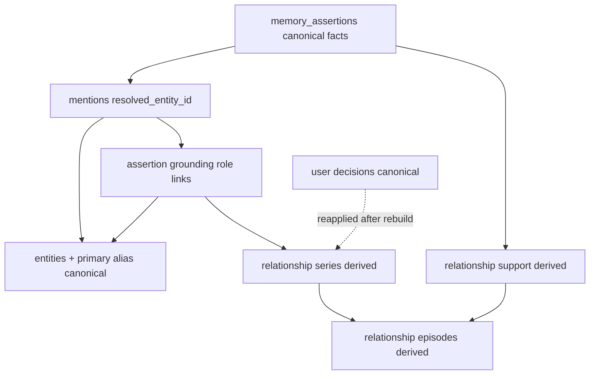

### 53.2 Canonical vs operational vs derived

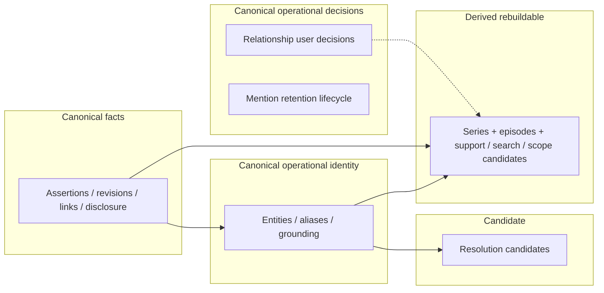

### 53.3 Entity-resolution pipeline

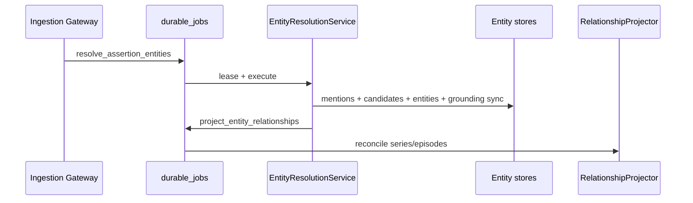

### 53.4 Assertion-to-entity grounding

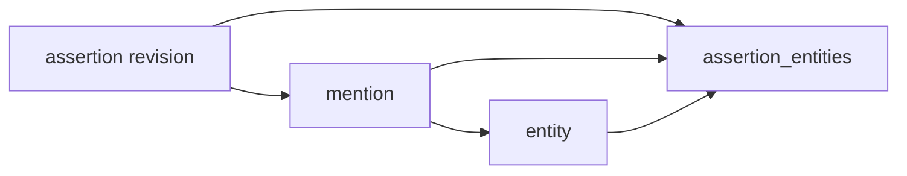

### 53.5 Relationship projection from support

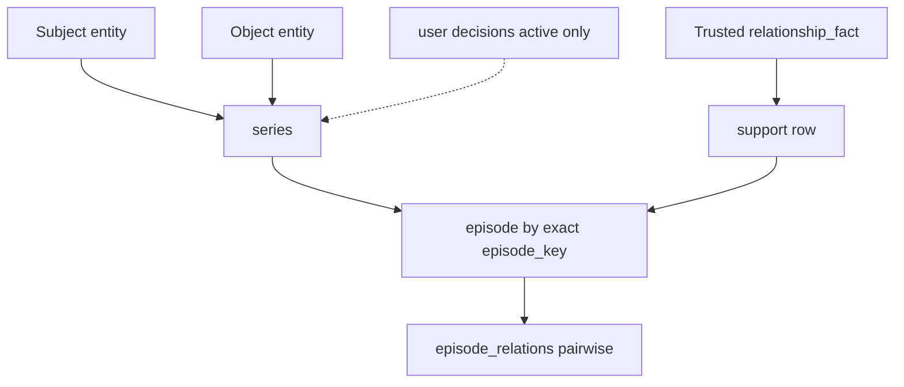

### 53.6 Candidate vs trusted relationship flow

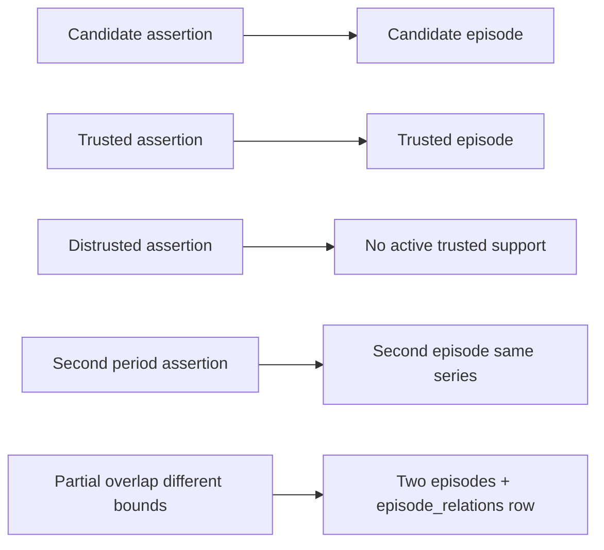

### 53.7 Ambiguity flow

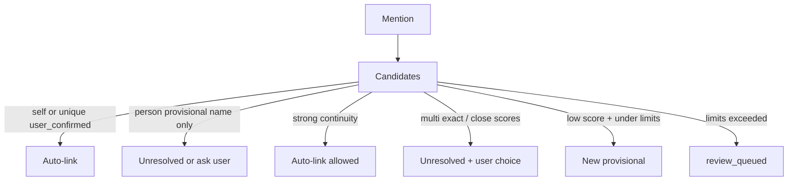

### 53.8 Merge flow

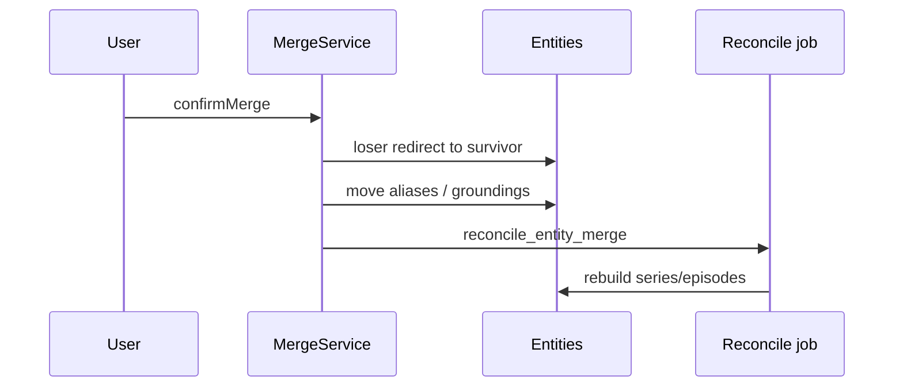

### 53.9 Split flow

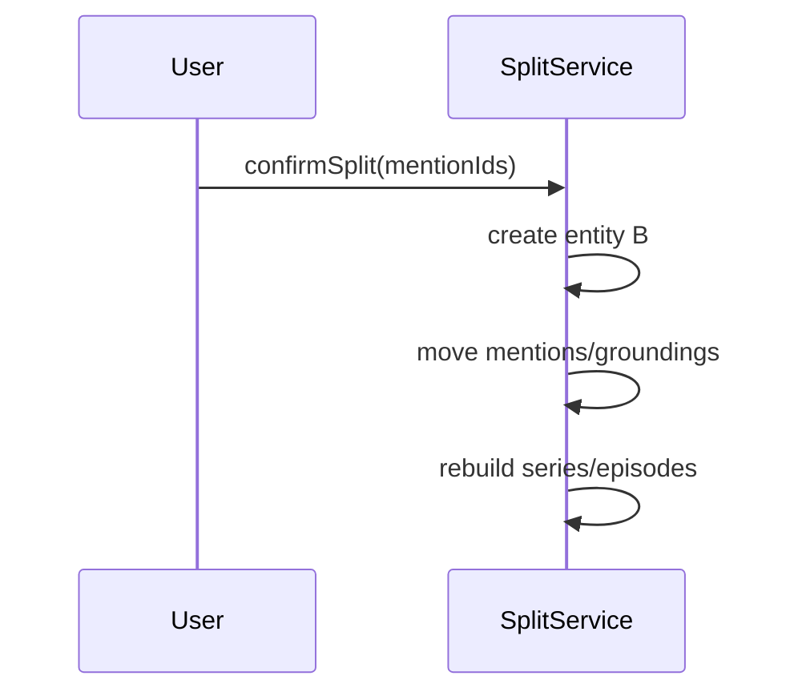

### 53.10 Project scope-label resolution

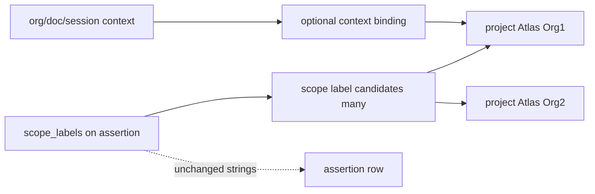

### 53.11 Document mention resolution

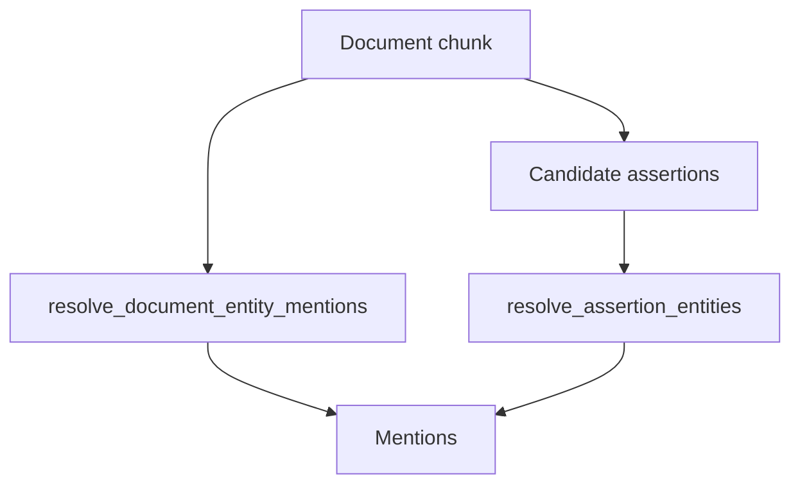

### 53.12 Correction and graph reconciliation

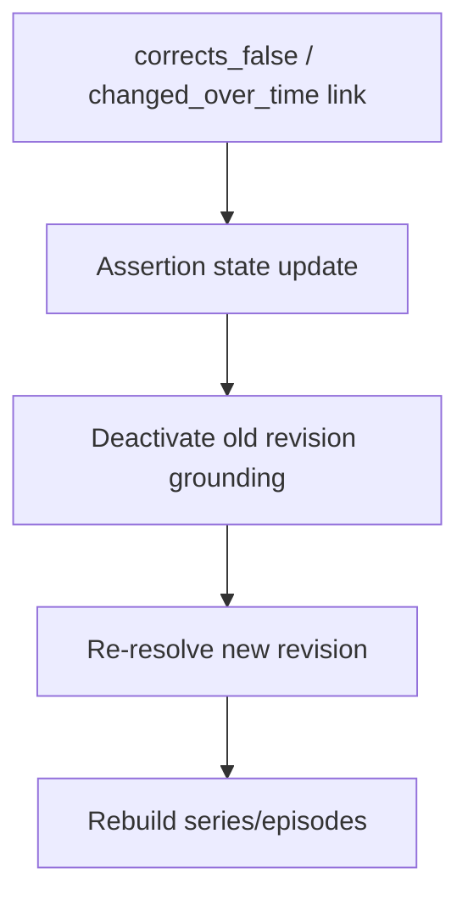

### 53.13 Entity deletion and purge

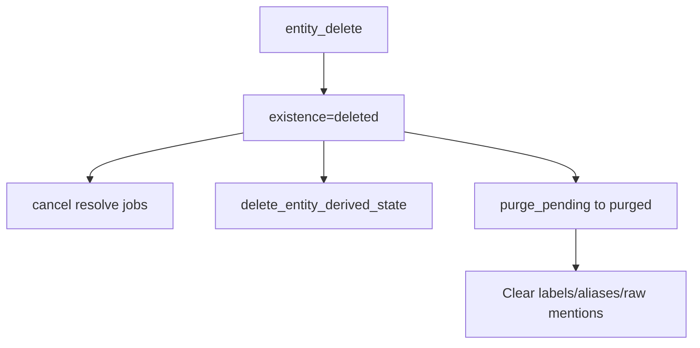

### 53.14 Account-deletion cleanup

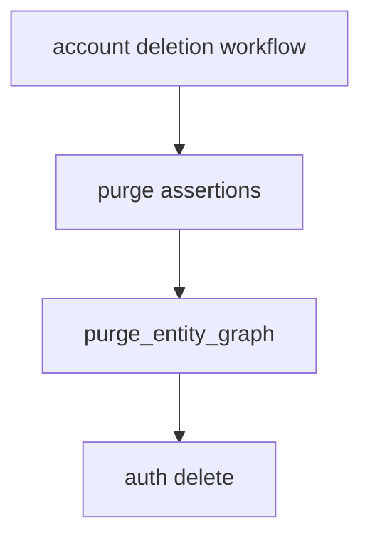

### 53.15 RLS and trust boundaries

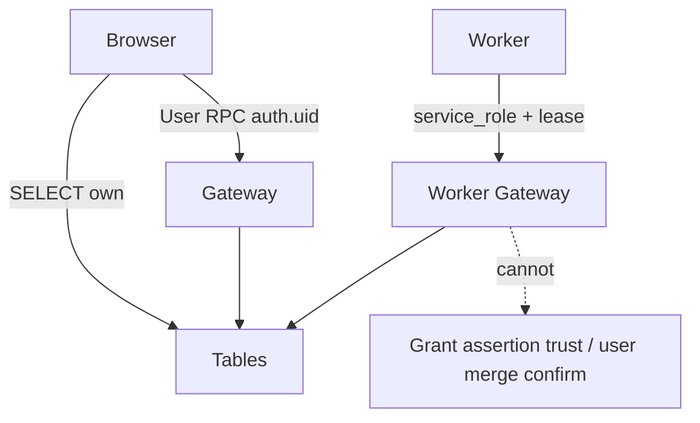

### 53.16 Stage 10 → 11 → 12 handoff


---

## 54. Entity and relationship invariants

1. Assertions remain canonical factual truth.  
2. Entity rows do not replace assertion content.  
3. Entity resolution never grants assertion trust.  
4. Resolution confidence is not trust; numeric thresholds are calibration parameters pending Stage 15.  
5. Relationship series/episodes cannot exceed supporting assertion authority.  
6. Candidate assertions cannot create trusted relationship episodes.  
7. Historical trusted assertions may support historical relationship episodes.  
8. Distrusted assertions cannot support active trusted episodes.  
9. Deleted and purge-pending assertions cannot support active episodes.  
10. Purged assertions leave no private graph support.  
11. Entity records are user-scoped.  
12. Entity aliases are user-scoped.  
13. Entity mentions are user-scoped.  
14. Relationship series/episodes never cross users.  
15. Workspace membership never widens entity access.  
16. The self entity is unique per user.  
17. Self entity fields do not become a second profile truth store; profile owns account display_name.  
18. Identical names do not imply identical entities.  
19. Ambiguous mentions remain unresolved rather than being force-merged.  
20. Same-name people may coexist.  
21. Entity kind does not determine assertion trust.  
22. User-confirmed aliases retain provenance.  
23. Former aliases remain historical rather than disappearing.  
24. Wrong entity links are correctable without rewriting assertion trust.  
25. Entity merges preserve provenance.  
26. Entity splits preserve assertion text and trust.  
27. Merge redirects cannot create cycles.  
28. Entity deletion does not silently delete assertions.  
29. Assertion deletion removes or reconciles its graph support.  
30. Assertion revision changes invalidate stale grounding.  
31. Document replacement invalidates stale mention jobs.  
32. Document deletion does not automatically delete trusted user-confirmed assertions.  
33. Project entity links and scope labels remain relevance, not ACLs.  
34. Relationship cardinality conflicts do not auto-distrust assertions.  
35. External IDs do not become product authority.  
36. Global cross-user entity dedupe is forbidden.  
37. Third-party person graphs remain private.  
38. Raw private source bodies do not enter operational graph metadata by default.  
39. Entity worker jobs are lease-bound and idempotent.  
40. Worker commands cannot impersonate user merge or split confirmation.  
41. Retry after successful resolution returns the existing result.  
42. Relationship series and episodes are rebuildable derived data.  
43. Stage 12 must canonically reconcile assertion and disclosure state before graph use.  
44. Stage 13 may replace providers without changing entity semantics.  
45. Stage 15 can evaluate resolution without redefining trust.  
46. Legacy memories are not assigned invented entity-confirmation history.  
47. Stage 11 does not redefine Stage 9 succession links.  
48. Stage 11 does not replace Stage 10 atomic claims.  
49. Manual relationship edges require an assertion.  
50. `related_to` never auto-infers without explicit weak-predicate path and display caution.  
51. Unresolved mentions do not create relationship episodes.  
52. Self entity cannot be merge loser.  
53. Forbidden-secret intake never creates entities or mentions with secret raw text.  
54. Entity processing cannot unfreeze Stage 10 plans.  
55. Scope labels remain stored even when project entities exist; a label may map to many candidate projects.  
56. Symmetric relationship **series** store one canonical undirected identity row; episodes remain temporal children.  
57. Provisional entities are stable operational IDs, not ephemeral cache keys.  
58. Audit `entity_type` in production logs remains unrelated to memory entities until renamed carefully.  
59. The primary alias is the canonical display name; `primary_label` is a same-TX synchronized cache.  
60. Active grounding.entity_id must equal mention.resolved_entity_id.  
61. Mention resolution is authoritative for spans; grounding is authoritative for assertion-role links.  
62. Disjoint temporal periods of the same relationship MUST remain distinct episodes.  
63. Provisional person aliases MUST NOT auto-link by name equality alone.  
64. Profile display_name changes drive self primary alias sync; users cannot make the self entity a conflicting account-name store.  
65. Provisional entity creation must respect explicit per-assertion, per-document, per-job, and per-user rate limits.  
66. Stage 12 must not silently pick a project entity from an ambiguous scope label.  
67. Grounding history and user resolution confirmations are not disposable search indexes (even though active joins may be re-emitted after revision change).  
68. Relationship user confirm/reject/suppress/restore decisions are canonical operational data and survive full series/episode rebuilds.  
69. `user_display_confirmed` / suppressed flags on series rows are caches only; `memory_entity_relationship_user_decisions` is authoritative.  
70. Supports share an episode only when exact normalized temporal identities (and thus `episode_key`) are identical.  
71. Partially overlapping, nested, or adjacent non-identical intervals produce distinct episodes; they are never silently merged.  
72. Mention archival requires `retention_state` and must not archive mentions with active grounding or user confirmation.  
73. Archived mentions are excluded from active resolution and Stage 12 live retrieval.  
74. Explainability APIs distinguish relationship **series** from relationship **episodes**.  
75. Job name `rebuild_entity_relationships` is normative; former draft name `rebuild_entity_projection` is superseded and must not be dual-registered.  
76. Pairwise temporal relations are stored densely in `memory_entity_relationship_episode_relations` (`N(N-1)/2` for N active episodes), not as a scalar `overlap_status` on episodes.  
77. Asymmetric `series_identity_key` preserves endpoint order; symmetric keys normalize with min/max entity ids.  
78. Ambiguous entity splits set relationship user decisions to `needs_review` and never auto-duplicate confirmations.  
79. Purged mentions have NULL `mention_text_normalized` and `mention_text_raw` and cannot participate in resolution or Stage 12 retrieval.  
80. `disjoint` and `unknown` episode relations are stored explicitly; absence of a row never means disjoint.  
81. For each reconciled series, `episode_relation_count = active_episode_count × (active_episode_count - 1) / 2`.  
82. Series exposes `UNIQUE (user_id, id)`; episodes expose `UNIQUE (user_id, series_id, id)` so episode_relations composite FKs structurally enforce same-user/same-series pairs.  
83. Stage 12 consumes only reconciled dense relation sets (or an explicit incompleteness signal).  

---

## 55. Risks and tradeoffs

| Risk | Tradeoff / mitigation |
| --- | --- |
| Entity records vs assertion-only | Added complexity for ambiguity/UX; assertions stay simpler source of truth |
| Canonical vs derived relationships | Derived chosen — rebuild cost vs dual truth |
| Auto provisional entities | Review volume; cap + ambiguity gate |
| False merges | No auto person merge |
| False splits | User-driven only |
| Alias proliferation | Authority levels + primary alias |
| Ontology size | Closed kinds/types |
| Generic related_to | Restricted fallback |
| Self-entity complexity | One row; thin fields |
| Project entity value | High for Stage 12 filters; coexistence with labels |
| Event entities | Deferred — avoid |
| Third-party privacy | Floors + disclosure |
| Graph join cost | Indexed FKs; rebuild async |
| Projection rebuild cost | Job-scoped, not global by default |
| Merge redirect complexity | Max hop + cycle checks |
| Historical relationships | temporal_class mandatory |
| User confusion | Calm UX vocabulary |
| Provider-dependent resolution | Deterministic primary path |
| Stage 10 amendment burden | Hybrid proceeds without; quality better with amendment |
| Stage 9 schema burden | Explicit amendment list |
| Postgres vs graph DB | Postgres sufficient |
| Retrieval value before Stage 12 | Entity pages still useful |
| Premature abstraction | Closed vocab; no KG reasoning |
| Rollback/coexistence | Feature flag; derived droppable |

---

## 56. Stage 9 amendment requests

**Label: Stage 9 amendment request**

| ID | Missing capability | Why Stage 9 insufficient | Smallest compatible change | Proceed without? | Security | Approver |
| --- | --- | --- | --- | --- | --- | --- |
| 9A | Entity tables §38 | No entity schema reserved | Add tables + enums as designed (incl. `primary_alias_id`, mention/grounding sync) | Design yes; impl no | Composite RLS | Stage 9 owner / architecture |
| 9B | durable_job_type extensions | Enum closed | Add job types §38.1 incl. self/profile + primary_label + scope reconcile | Design yes | Lease-bound | Stage 9 |
| 9C | durable_job_subject_type `entity` | Cannot subject jobs | Add entity/merge/split | Design yes | Subject verify | Stage 9 |
| 9D | deletion_step_key `purge_entity_graph` | Account purge incomplete | Add steps + order after assertion purge | **No** for account safety | Purge privacy | Stage 9 |
| 9E | Worker/user command unions | Commands not listed | Extend Gateway catalogs incl. alias primary sync + scope bind | Design yes | Authz split | Stage 9 |
| 9F | Optional deletion_scope `entity` | Single-entity delete workflow | Add scope or fold into assertion-preserving soft delete command | Proceed with command-only | — | Stage 9 |
| 9G | Processing-evidence link optional FK | mention.processing_claim_id | Nullable FK to processing claims if table exists | Yes | No raw content | Stage 9/10 |
| 9H | Series/episode reconciliation state | Single edge uniqueness insufficient for repeated periods | Add `memory_entity_relationship_series` + `episodes` + support→episode with **exact episode_key** | Design yes; **required** | Rebuildable only | Stage 9 |
| 9I | One-to-many scope mappings | Single unique label→entity unsafe | Replace with candidates + context bindings tables | Design yes; **required for Atlas ambiguity** | No ACL semantics | Stage 9 |
| 9J | Profile→self sync hook | Profile updates today do not notify entity layer | Gateway profile update calls `SelfEntitySyncService` / enqueues job | Design yes | Profile remains source | Stage 9 / profile owners |
| 9K | Provisional limit counters | No operational counters in Stage 9 | Add per-user rate window table or reuse usage counters with reason codes | Design yes | Abuse control | Stage 9 |
| 9L | Relationship user decisions | Derived rows cannot hold durable UX decisions | Add `memory_entity_relationship_user_decisions` + reapply job | Design yes; **required** | Survive rebuild | Stage 9 |
| 9M | Mention retention lifecycle | Soft-cap archive claimed without schema | Add `retention_state`/`archived_at`/`purged_at` on mentions + archive job | Design yes; **required** | Privacy + history | Stage 9 |
| 9N | Job rename | Former draft `rebuild_entity_projection` ambiguous | Add **only** `rebuild_entity_relationships`; do not register the old name | Design yes | Clarity | Stage 9 |
| 9O | Deletion purge of decisions | Account purge incomplete | `purge_relationship_user_decisions` step | **No** for account safety | Privacy | Stage 9 |
| 9P | Pairwise episode relations | Scalar overlap cannot model multi-neighbour relations | Add dense `memory_entity_relationship_episode_relations` (`N(N-1)/2`) | Design yes; **required** | Derived only; missing≠disjoint | Stage 9 |
| 9Q | Decision application_state | Split ambiguity not representable | Add `application_state` + reason codes on user_decisions | Design yes; **required** | No dual confirm | Stage 9 |
| 9R | Nullable mention_text_normalized | Purge privacy blocked by NOT NULL | Make nullable + lifecycle CHECKs §13.4 | Design yes; **required** | Privacy | Stage 9 |

Do **not** amend `memory_assertion_links` link_type for domain relationships.

---

## 57. Stage 10 amendment requests

**Label: Stage 10 amendment request**

| ID | Missing capability | Why insufficient | Smallest change | Proceed without? | Security | Approver |
| --- | --- | --- | --- | --- | --- | --- |
| 10A | Typed mention candidates on frozen claims | subject/predicate/object strings lack multi-mention spans | Add `mentionCandidates: Array<{text, role, kindHint, originalSpan, fingerprint}>` to frozen claim | **Yes** via hybrid detector | Spans must not include secret segments | Stage 10 owner |
| 10B | Entity-kind hints | Ambiguity Apple/Jordan | Optional `kindHint` per mention | Yes | — | Stage 10 |
| 10C | Predicate normalized token for relationship typing | Free predicate string weak for projector | Optional `predicateTypeHint` from closed map | Yes | No invented trust | Stage 10 |

Stage 11 does **not** edit Stage 10. Freeze/authority/disclosure unchanged.

---

## 58. Decisions intentionally deferred

**Label: Deferred decision**

1. Stage 12 ranking, hop depth, packing, token budgets.  
2. Stage 13 graph framework / ER framework selection.  
3. Full evaluation harness (Stage 15).  
4. Migration/PR sequence (Stages 16–17).  
5. Event as first-class entity kind.  
6. Artifact/product/service split from concept.  
7. Place coordinates on entity rows.  
8. Inference of relationships (friend-of-friend).  
9. Cached co-mention association table (may be on-demand).  
10. Multi-language nickname dictionaries beyond transliteration aliases.  
11. Whether to rename production audit `entity_type` column (compatibility).  
12. Encrypted external_ref payload format details.  
13. Real-time collaborative entity editing.  
14. Public-figure knowledge-base auto-enrichment (likely never).  
15. Exact numeric tuning of resolution weights (Stage 15).  
16. Whether `primary_alias_id` FK is enforced DEFERRABLE within insert TX only (implementation detail).  
17. Whether Option B temporal clustering is ever adopted after Stage 15 evidence (v1 stays exact-key).  
18. Soft-cap N and archive age thresholds for resolved-but-inactive mentions.  

---

## 59. Unknowns

**Label: Unknown**

1. Empirical auto-link threshold calibration on real user data (Stage 15) — current numbers are starting points only.  
2. Whether default provisional caps (§18.2) need product-tier differentiation.  
3. Whether users prefer project entities over labels in UX.  
4. Cost of series/episode rebuilds at account scale with many repeated periods.  
5. How often Greek/Latin alias collisions need UI.  
6. Whether doctor_of should always force highly_sensitive even for “my doctor is X” alone.  
7. Optimal first-release UX subset.  
8. Exact `context_fingerprint` composition for scope bindings in multi-device clients.  
9. Whether bulk import UX should require an explicit confirmation gate before raising caps.  
10. How aggressively overlapping episodes should be visually grouped in UX without merging keys.  
11. Whether episode-scoped user decisions are needed beyond series-level in first release.  

---

## 60. Acceptance-criteria assessment

| # | Criterion | Status |
| --- | --- | --- |
| 1 | Exact entity architecture | **Met** — Option C assertion-first |
| 2 | Exact relationship architecture | **Met** — derived projections |
| 3 | Assertions canonical | **Met** |
| 4 | Entity canonicity precise | **Met** — operational identity |
| 5 | Entity kinds | **Met** |
| 6 | Self entity | **Met** — Option B |
| 7 | Aliases | **Met** |
| 8 | Mentions | **Met** |
| 9 | Grounding | **Met** — assertion+revision+mention |
| 10 | Resolution | **Met** |
| 11 | Ambiguity | **Met** |
| 12 | Confidence ≠ trust | **Met** |
| 13 | Auto vs user actions | **Met** |
| 14 | Relationship types | **Met** |
| 15 | Direction/inverse/symmetry/cardinality | **Met** |
| 16 | Temporal relationships | **Met** |
| 17 | Candidate vs trusted episodes | **Met** |
| 18–20 | Merge/split/redirects | **Met** |
| 21 | Project-scope integration (one-to-many safe) | **Met** |
| 22 | Literals not entities | **Met** |
| 23 | Deletion/purge | **Met** |
| 24 | Third-party privacy | **Met** |
| 25 | Exact tables | **Met** |
| 26 | Cross-user prevention | **Met** |
| 27 | RLS/grants | **Met** |
| 28 | Services/commands | **Met** |
| 29 | Jobs/idempotency | **Met** |
| 30 | Explainability | **Met** |
| 31 | Compatibility | **Met** |
| 32 | Stage 12 queries without ranking | **Met** |
| 33 | No Stage 9 succession overload | **Met** |
| 34 | No Stage 10 semantic rewrite | **Met** |
| 35 | Amendments explicit | **Met** §§56–57 |
| 36 | No Stage 13 framework | **Met** |
| 37 | No Stage 12 ranking | **Met** |
| 38 | No implementation roadmap | **Met** |
| 39 | No production behaviour change | **Met** |
| 40 | Stable foundation for Stage 12 | **Met** |
| 41 | Single canonical name source (primary alias) | **Met** — §10.1 |
| 42 | Mention vs grounding authority defined | **Met** — §13.1 / §20 |
| 43 | Repeated temporal relationship episodes | **Met** — series+episodes |
| 44 | Provisional person auto-link safety | **Met** — §18.1 |
| 45 | Profile↔self sync contract | **Met** — §9.1 |
| 46 | Explicit provisional creation limits | **Met** — §18.2 |
| 47 | Canonical relationship user decisions survive rebuild | **Met** — §23.1 |
| 48 | Exact deterministic episode construction | **Met** — §26 Option A |
| 49 | Mention archival schema-backed | **Met** — §13.4 / §38.4 |
| 50 | Series vs episode APIs unambiguous | **Met** — §42 / §49 |
| 51 | Dense pairwise episode_relations model | **Met** — §26.3 / §38.7c (`N(N-1)/2`; missing≠disjoint) |
| 52 | Asymmetric/symmetric series_identity_key | **Met** — §23.1 |
| 53 | Split-safe relationship decisions | **Met** — §23.1.1 |
| 54 | Purged mention null normalized text | **Met** — §13.4 |
| 55 | Job rename consistency | **Met** — `rebuild_entity_relationships` only |
| 56 | Composite FK parent unique keys | **Met** — series `(user_id,id)`; episodes `(user_id,series_id,id)` |
| 57 | Stage 9 amendments ordered 9A–9R | **Met** — §56 |

---

## 61. Files and questions recommended for Stage 12

### Files
1. This document (`11-entity-relationship-design.md`)  
2. `09-technical-design.md` — assertions, disclosure, embeddings  
3. `10-memory-processing-design.md` — freeze, confidence, scope labels  
4. `08-memory-model.md` — trust/temporal/disclosure  
5. `05-retrieval-context-audit.md` — current retrieval behaviour  
6. `07-target-architecture.md` — derived indexes  

### Questions for Stage 12
1. How to blend entity-filtered assertions with vector/FTS hits without treating graph edges as trust?  
2. How to present historical vs current **episodes** (including multiple periods on one series) in prompt context?  
3. How to exclude disclosure-denied entity neighbourhoods from provider prompts while keeping local UX?  
4. Should unresolved mentions contribute only via raw assertion retrieval?  
5. How to pack multi-entity answers (e.g., manager + project) within token budgets?  
6. How should Stage 12 behave when `resolveProjectScopeLabel` returns `ambiguous`?  

### Non-goals for Stage 12 (from Stage 11)
Do not redefine entity canonicity, relationship projection authority, or succession links.

---

## 62. Disagreements with prior artifacts

| Item | Disposition |
| --- | --- |
| `00-roadmap.md` stale statuses (Stage 2 “next”, etc.) | Stages 1–10 treated complete per task instructions; roadmap **not** edited |
| Stage 7 deferred entity canonicity | **Closed** — entities canonical operational; relationships derived |
| Stage 8 “whether relationship_fact requires entities” | **Closed** — does **not** require; may attach when resolved |
| Production Connections UI as “graph” | Clarified: similarity only; not Stage 11 graph |
| Option B independent edges | Rejected despite common KG pattern |
| Full ontology (Option D) | Rejected as premature |
| Audit field name `entity_type` | Remains audit vocabulary; document collision; rename deferred |
| Earlier Stage 11 draft: unique provisional alias auto-link | **Superseded** — unsafe for persons; kind-specific continuity required |
| Earlier Stage 11 draft: single active projection per endpoints+type | **Superseded** — series + episodes for repeated periods |
| Earlier Stage 11 draft: unique scope_label → one project | **Superseded** — one-to-many candidates + context bindings |
| Earlier Stage 11 draft: primary_label and primary alias both unspecified | **Superseded** — primary alias canonical; label is cache |
| Earlier Stage 11 draft: soft overlap merge of “compatible” bounds | **Superseded** — exact temporal identity only |
| Earlier Stage 11 draft: `user_display_confirmed` only on derived series | **Superseded** — canonical user_decisions table |
| Earlier Stage 11 draft: soft-cap archive without mention retention schema | **Superseded** — `retention_state` on mentions |
| Earlier Stage 11 draft: job `rebuild_entity_projection` and `explainRelationship(projectionId)` | **Superseded** — `rebuild_entity_relationships` is the only new job name; series/episode explain APIs |
| Earlier Stage 11 draft: scalar `overlap_status` on episodes | **Superseded** — pairwise `episode_relations` |
| Earlier Stage 11 draft: ambiguous min/max series_identity_key | **Superseded** — separate asymmetric/symmetric formulas |
| Earlier Stage 11 draft: split always rewrites decisions | **Superseded** — deterministic transfer or needs_review |
| Earlier Stage 11 draft: mention_text_normalized NOT NULL after purge | **Superseded** — nullable + purged CHECK |

No disagreement that assertions are canonical or that Stage 10 annotations are non-entities.

---

## 63. Final consistency checklist

- [x] Assertions canonical; entities operational; series/episodes derived  
- [x] relationship_fact stores without entities  
- [x] Confidence ≠ trust; resolution ≠ trust; thresholds marked calibration-only  
- [x] Primary alias canonical; `primary_label` synchronized cache  
- [x] Mention resolution vs grounding authority + sync invariant  
- [x] Repeated temporal episodes representable (not collapsed)  
- [x] Provisional person name-only auto-link forbidden  
- [x] Scope labels one-to-many candidates; never ACLs  
- [x] Profile↔self sync defined; no second profile store  
- [x] Provisional creation hard limits + review_queued  
- [x] Composite ownership / RLS SELECT-only clients  
- [x] No workspace widening  
- [x] No graph DB required  
- [x] Stage 9 links not overloaded  
- [x] Stage 10 freeze untouched  
- [x] Third-party floors  
- [x] Deletion does not silently drop assertions when deleting entities  
- [x] Stage 12 contracts without ranking; multi-episode + ambiguous project aware  
- [x] Relationship user decisions canonical; series flags are caches  
- [x] Exact episode_key; no silent merge of different bounds  
- [x] Dense pairwise episode_relations (`N(N-1)/2`); disjoint/unknown explicit; missing≠disjoint  
- [x] Series `UNIQUE (user_id, id)`; episodes `UNIQUE (user_id, series_id, id)`; episode_relations FKs target those keys  
- [x] Asymmetric vs symmetric series_identity_key formulas  
- [x] Split decisions: transfer or needs_review; never dual-confirm  
- [x] Mention retention_state; purged nulls normalized+raw text  
- [x] Interfaces/jobs use series/episode terminology; rebuild_entity_relationships only  
- [x] Ownership constraints numbered sequentially; Stage 9 amendments 9A–9R ordered  
- [x] Amendments listed, docs 9/10 not edited  
- [x] Production behaviour unchanged  
- [x] Only Stage 11 document modified  
- [x] PR remains draft; Stage 12 not started

---

## Appendix A — Answers to Stage 10 handoff questions

1. **How should subject/predicate annotations seed entity candidates without becoming canonical prematurely?**  
   They seed **mentions** and **resolution candidates** with `system_proposed` / provisional entities. Canonical grounding activates only after deterministic rules or user confirmation. Annotations remain non-entities.

2. **When do relationship_fact assertions require entity nodes?**  
   **Never required** to store. Required only to emit a **relationship projection**. Unresolved mentions ⇒ assertion exists, no edge.

3. **How do correction/conflict links interact with entity identity merges?**  
   Succession links remain assertion-level. Merges retarget groundings/mentions and rebuild series/episodes; they do **not** rewrite `memory_assertion_links` or invent distrust. After correction, re-resolve new revision and rebuild episodes.

4. **Can scope_labels map to project entities without rewrite?**  
   **Yes** — coexistence via one-to-many `scope_label_candidates` + optional context `bindings`; labels remain on assertions; ambiguous labels do not force a single project.

5. **How to attach multiple mentions across chunks to one entity safely?**  
   Per-mention rows with span fingerprints + **strong continuity** scoring; provisional-name-only never auto-links persons; **no** auto-merge of distinct people; user confirms ambiguity.

---

## Appendix B — Automatic actions summary

| Action | Automatic? | Why safe |
| --- | --- | --- |
| I/me/my → self | Yes | Deterministic, unique self |
| Exact unique user_confirmed alias | Yes | User authority |
| Exact unique provisional **person** alias | **No** (name alone) | Requires strong continuity or user choice |
| Exact unique provisional non-person alias | Kind-specific | Org/place/project/concept policies §18.1 |
| New unambiguous named person | Provisional **within limits** | Stable ID; not trusted memory; else review_queued |
| New org/place/project | Provisional within limits | Kind-gated |
| New concept | Conservative provisional | Fail closed often |
| Two same-name people auto-merge / absorb | **Never** | False merge / absorb risk |
| Candidate assertion → provisional entity | Yes within caps | Candidate operational only |
| Document candidate → provisional | Yes within caps | Caps + review_queued on exceed |
| Trusted relationship_fact → trusted episode | Yes if entities resolved | Authority from assertion; episode per period |
| Candidate relationship → candidate episode | Yes | Cannot exceed support |
| System-proposed merge | Suggest only | Need user confirm |
| Merge with trusted support | User confirm | High impact |
| Split | User confirm | High impact |
| Profile display_name → self primary alias | Yes (sync) | Profile is account source |
| Scope label → single project | Only if unambiguous after context | Else ambiguous candidates |
| Relationship display confirm/reject | Writes user_decisions first | Survives rebuild |
| Soft-cap mention archive | Eligible unresolved only | §13.4 protections |
| Mention purge | Nulls normalized+raw | No restore |
| Partial-overlap intervals | Separate episodes + episode_relations | Conservative separation |
| Ambiguous relationship decision after split | needs_review | User reassign |

---

*End of Stage 11 — Entity and Relationship Architecture Design*
