# 11 — Entity and Relationship Architecture Design

> **Role:** Entity and Relationship Architecture Designer  
> **Stage:** 11 of the Cortaix memory-system planning process  
> **Constraints:** Documentation and design only. No production code, migrations, SQL execution, APIs, prompts, tests, dependencies, configuration, or behaviour changes. Does not edit Stages 0–10 reports or `00-roadmap.md`. Does not select Stage 12 ranking, Stage 13 frameworks, Stage 15 evaluation suites, or Stage 16–17 implementation sequencing.  
> **Branch:** `cursor/memory-entities-relationships-design`  
> **Output:** this file only

---

## 1. Executive summary

**Technical decision — selected architecture (Option C, refined):** Cortaix adopts an **assertion-first graph**.

| Layer | Status |
| --- | --- |
| Memory assertions | **Canonical factual truth** (Stages 8–10 unchanged) |
| Entity identity records, aliases, mentions, assertion grounding | **Canonical operational identity data** (user-scoped) |
| Entity-resolution candidates | **Candidate operational data** |
| Relationship edges | **Derived and rebuildable projections** supported by assertions |
| Entity search indexes | **Derived and rebuildable** (Stage 7 derived layer) |

Binding product rules:

1. A `relationship_fact` assertion may exist **without** resolved entities. Entities are not required to store relationship facts.
2. Entity resolution **never** grants assertion trust. Resolution confidence ≠ memory trust.
3. Relationship projections **cannot** be more authoritative than their supporting assertions.
4. User-created graph relationships must create or reference an assertion; edges cannot bypass factual provenance.
5. PostgreSQL remains canonical. No graph database is required. No Stage 13 framework is selected.
6. Production today has **no** entity or relationship graph. Stage 11 is additive and coexistence-safe.

This document answers Stage 10’s five handoff questions, defines exact tables/services/commands/jobs, and hands Stage 12 safe query contracts **without** ranking or packing.

---

## 2. Verified current repository behaviour

**Label: Verified current behaviour**

### 2.1 No entity or relationship graph exists in production

| Surface | Finding |
| --- | --- |
| Schema | No `entities`, `aliases`, `mentions`, `edges`, or relationship tables in `supabase/migrations/` |
| Types | `Memory` is flat text + enums (`src/lib/types.ts`); no entity IDs |
| Extraction | Outputs `{content, type, category, confidence, is_sensitive}` only; LLM prompt extracts durable facts about the **user**, not third-party graphs (`src/lib/memory/extraction/`) |
| Related memories | `GET /api/memories/[id]/related` uses semantic similarity + optional same-`category` fill — not graph edges |
| Connections UI | `/vault/connections` + `RelatedMemoriesStrip` display similarity %, not people/org graphs |
| Audit `entity_type` | Polymorphic audit subject (`memory`, `profile`, `document`, `chat_session`) — **not** knowledge-graph entities (`src/lib/audit.ts`) |
| `relationship_fact` | Exists only in Stage 8–10 docs; **not** in production enums |
| Mem0 | Maps `cv_memory_id`, type, source, status, category — no person/org sync |

### 2.2 Current memory model (production)

`public.memories` (`20260720000002_memories.sql`): `id`, `user_id`, `content`, freeform `category`, `type` ∈ {profile, preference, semantic, episodic, project, temporary}, `source` ∈ {manual, chat_extraction, document, onboarding, import}, `confidence`, `status`, `is_sensitive`, `embedding vector(1536)`, `expires_at`, `pinned_at`, timestamps.

Chat assembly (`src/lib/orchestration/chat.ts`): semantic retrieve ∪ active `type=profile` memories ∪ document chunks ∪ profile `UserIdentity` (`display_name`, `persona`).

### 2.3 Export and deletion

| Path | Behaviour |
| --- | --- |
| `GET /api/export` | Profile + non-deleted memories + document metadata; no graph data |
| `DELETE /api/memories/[id]` | Provider remove + hard row delete |
| Account memories scope | `removeAll` + delete memory rows |
| Account delete | Mem0 cleanup, storage remove, `auth.admin.deleteUser` → CASCADE |

### 2.4 Identity today vs Stage 11 entities

| Concept today | Meaning |
| --- | --- |
| `profiles.display_name` / `persona` | Account settings → prompt `USER IDENTITY` |
| `type=profile` memories | Freeform vault facts, always-unioned into chat context |
| Stage 11 self entity | Operational identity **anchor** for mentions of “I/me/my”; **not** a second profile truth store |

### 2.5 What Stage 11 can consume from Stage 10 (target contracts)

| Stage 10 field | Stage 11 use |
| --- | --- |
| `claimText` / `validatedNormalizedClaim` | Assertion content; mention context |
| `subject` / `predicate` / `objectOrComplement` | Seed mention candidates (**annotations, not entities**) |
| `subjectAnnotation` | Self vs third-party gating |
| `contentKind` especially `relationship_fact` | Relationship-projection eligibility |
| `scopeLabels` | Project-entity candidate seeding |
| Temporal phase/bounds/modality | Projection temporal cache (derived) |
| Sensitivity / disclosure | Entity sensitivity floors + disclosure gates |
| Processing confidence | **Not** resolution confidence; separate scorer |
| `resultingAssertionId` + revision | Grounding FK targets |
| Source spans / fingerprints | Mention provenance |
| Correction/conflict outcomes | Trigger projection reconciliation; do not redefine succession |

**Insufficient today in Stage 10 frozen claims:** independent typed mention list with per-mention original spans and entity-kind hints. See §57 Stage 10 amendment requests. Stage 11 can still proceed with a hybrid detector + amendment.

---

## 3. Binding inputs from Stages 7–10

**Label: Canonical data / Security property** (preserved)

1. Modular monolith; PostgreSQL canonical; external indexes derived/rebuildable.  
2. Personal memory user-scoped; workspace membership never widens access.  
3. Route handlers do not own memory authority; Gateway RPCs mutate.  
4. Deletion is a tracked workflow; purged content leaves no private graph support.  
5. Retrieved/document content is untrusted input.  
6. External services cannot become canonical authority.  
7. No graph DB required.  
8. Assertions remain durable claims; candidates are not trusted memory.  
9. Distrusted = repudiated or confirmed false (narrow).  
10. `relationship_fact` may exist before entity resolution.  
11. Entity resolution ≠ assertion trust; entity confidence ≠ memory trust.  
12. Temporal phase, bounds, modality remain orthogonal.  
13. Scope labels = relevance, not ACLs.  
14. Documents are sources, not memories.  
15. Origin never independently grants authority.  
16. Third-party personal data may be sensitive.  
17. `memory_assertions` + revisions + provenance + links remain as designed.  
18. Do **not** overload `memory_assertion_links` with domain graph edges.  
19. Composite `(user_id, id)` ownership prevents cross-user links.  
20. Stage 10 produces atomic assertions; annotations seed but do not become entities.  
21. Entity processing must not reinterpret material model inference as trusted.  
22. Frozen processing plans must not be rewritten by entity resolution.  
23. Document-derived assertions remain candidates.  
24. Stage 11 does not redefine Stage 9 succession links or Stage 10 freeze/authority/disclosure.

---

## 4. Entity architecture alternatives

| Option | Summary | Verdict |
| --- | --- | --- |
| **A — Assertions only** | Keep `relationship_fact` text; no entity records | Rejected as primary — insufficient for ambiguity, merge/split, explainability, Stage 12 entity filters |
| **B — Canonical entities + independent relationship edges** | Edges are facts beside assertions | Rejected — dual truth, trust/temporal/correction drift |
| **C — Canonical entities + assertion-backed relationship projections** | Entities canonical operational; edges derived | **Selected** |
| **D — Full ontology / KG** | Rich classes, inference, reasoning | Rejected — over-engineering; provider-coupled risk |
| **E — External graph DB as canonical** | Neo4j/etc. authoritative | Rejected — violates PostgreSQL canonicity; Stage 13 premature |
| **F — Derived entities only** | Fully rebuildable from assertion text | Rejected as sole model — loses user merge/split/alias authority and stable IDs |

### Assessment matrix (selected criteria)

| Criterion | A | B | C | D | E | F |
| --- | --- | --- | --- | --- | --- | --- |
| Assertion canonicity | ✓ | ✗ risk | ✓ | ✗ risk | ✗ | ✓ |
| Trust preservation | ✓ | ✗ | ✓ | ✗ | ✗ | ✓ |
| Correction / temporal | Weak UX | Dual | ✓ | Complex | Dual | Rebuild lag |
| Ambiguity / merge-split | Poor | Possible | ✓ | Heavy | Possible | Fragile |
| RLS / same-user | Simple | Harder | Feasible | Hard | Cross-store | Feasible |
| Deletion | Easy | Edge orphans | Rebuildable | Hard | Sync risk | Easy |
| Explainability | Text only | Dual | Support rows | Opaque inference | Opaque | Rebuild |
| Postgres feasibility | ✓ | ✓ | ✓ | Partial | ✗ | ✓ |
| Over-engineering | Under | Medium | Balanced | High | High | Medium |
| Provider independence | ✓ | ✓ | ✓ | Weak | Weak | ✓ |

---

## 5. Selected entity architecture

**Technical decision:** **Option C — assertion-first graph** (evaluated seriously and adopted).

```text
Assertion (canonical fact)
  └─ Mentions (operational spans / roles)
       └─ Resolution → Entity (canonical operational identity)
            └─ Assertion grounding (canonical resolution data)
                 └─ Relationship projection (derived, rebuildable)
                      └─ Support rows → assertions + revisions + mentions
```

Refinements beyond the “likely direction”:

1. Provisional entities are **canonical operational rows** with `resolution_authority='system_proposed'` — not derived-only.  
2. Relationship projections are **always rebuildable** from grounding + assertions.  
3. Manual “draw an edge” UX must call a user command that creates/links a `relationship_fact` assertion, then projects.  
4. Entity search/FTS tables are derived indexes only.

**Why not A:** Stage 12 and UX need stable person/project anchors, disambiguation, and “why connected” without re-parsing free text.  
**Why not B/E:** Independent edges become a second memory store.  
**Why not D/F:** Ontology and pure derivation either overreach or erase user authority over identity.

---

## 6. Design vocabulary

| Term | Definition | Classification |
| --- | --- | --- |
| **Assertion** | Durable claim governed by Stages 8–10 | Canonical semantic truth |
| **Entity** | User-scoped identity anchor (person, org, place, project, concept) | Canonical operational identity |
| **Mention** | Span or structured annotation that may refer to an entity | Operational (may be candidate-linked) |
| **Alias** | Name/nickname/handle/former name/user label for an entity | Canonical operational (with authority) |
| **Assertion grounding** | Mapping from assertion role (+ mention) → entity | Canonical resolution data |
| **Relationship projection** | Graph-friendly edge derived from supporting assertions | Derived projection |
| **Resolution candidate** | Scored possible entity for a mention | Candidate operational |
| **Self entity** | Unique `person` entity with `is_self=true` | Canonical operational |
| **Succession link** | Stage 9 `memory_assertion_links` | Canonical (unchanged) |
| **Entity-grounded association** | Same-entity co-mention / project membership | Derived or on-demand |
| **Semantic similarity association** | Embedding relatedness | Stage 12 (not Stage 11 storage) |

### Primary conceptual distinction (normative)

```text
Assertion:  "My manager is Tasos."     → trust, temporal, provenance, disclosure
Entity:     Tasos (person)              → identity anchor
Mention:    "Tasos" in assertion A123   → span + role + resolution state
Alias:      "Tasos", "Τάσος"            → names for the entity
Grounding:  subject→self, object→Tasos  → confirmed role mapping
Projection: self --reports_to--> Tasos  → derived from supporting assertion(s)
```

---

## 7. Canonical versus operational versus derived data

| Data | Class | Rebuildable? | User-confirmable? |
| --- | --- | --- | --- |
| Assertion content, trust, temporal, disclosure | Canonical semantic | No (history via revisions) | Yes (trust/review) |
| Entity row (id, kind, display, is_self, lifecycle) | Canonical operational | No (but merge/split tracked) | Yes |
| Aliases with authority | Canonical operational | No | Yes |
| Mentions | Operational | Partially (from spans) | Resolution yes |
| Assertion–entity grounding | Canonical operational | No (history retained) | Yes |
| Resolution candidates | Candidate | Yes | Suggest only |
| Relationship projections + support | Derived projection | **Yes** | Confirm projection display, not invent facts |
| Entity FTS / embedding search | Derived | Yes | N/A |
| External entity refs | Operational optional | On disconnect | User-linked only |

---

## 8. Entity kinds

**Technical decision — first-class kinds (closed enum):**

```text
person | organisation | place | project | concept
```

| Kind | First-class? | Auto-create provisional? | Notes |
| --- | --- | --- | --- |
| `person` | Yes | Yes (named third parties, gated) | Includes self |
| `organisation` | Yes | Yes when named as org | Companies, teams as orgs when org-like |
| `place` | Yes | Yes when place-named | Cities, countries, offices as places |
| `project` | Yes | Yes from clear project names / scope labels | Relevance only |
| `concept` | Yes | Conservative | Tools, products, services, abstract topics |
| `artifact` | **No** (assertion-only initially) | No | Files, docs stay document sources or concept |
| `product` / `service` | Under **`concept`** | Conservative | Avoid ontology sprawl |
| `event` | **No** — remain `event` assertions | No | Do not entity-ify meetings by default |
| `other` | **Forbidden** | — | Dangerously vague |
| Custom kinds | **Forbidden** | — | Closed vocabulary |

**Kind changes:** allowed only via user/system command; write `memory_entity_kind_history` (operational audit). Kind never grants trust.

### Per-kind criteria

#### `person`
- **Positive:** Named humans (self, family, colleagues, doctors, clients, public figures as *mentions in user's memory*).  
- **Exclusion:** Roles alone (“my manager” without a name) are **not** person entities; they are predicates/aliases-of-context, not identity.  
- **Examples:** Tasos, Sarah, Dr Smith.  
- **Ambiguous:** “Paris”, “Jordan”, “Apple” (see ambiguity).  
- **Relationship families:** person↔person, person↔org, person↔project, person↔place.  
- **Sensitivity default:** `third_party_personal` floor for non-self.  
- **Auto-creation:** provisional person for unambiguous new proper names in relationship_fact/identity contexts; never auto-merge same names.

#### `organisation`
- **Positive:** Companies, institutions, named teams treated as orgs.  
- **Exclusion:** Generic “the company” without name.  
- **Examples:** Supabase, Apple Inc.  
- **Ambiguous:** Apple (fruit vs company); acronyms.  
- **Families:** person↔org, project↔org, org↔place.  
- **Sensitivity:** ordinary unless third-party employment context elevates.  
- **Auto-creation:** provisional when clearly organisational predicate/context.

#### `place`
- **Positive:** Geographic or venue names used as locations.  
- **Exclusion:** “the office” without place name → unresolved mention or contextual label, not auto entity until disambiguated.  
- **Examples:** Athens, Berlin, Jordan (country).  
- **Families:** located_in, based_in, born_in, travels_to, operates_in.  
- **Sensitivity:** ordinary; home address precision stays in assertions, not entity rows.  
- **Auto-creation:** provisional for clear toponyms.

#### `project`
- **Positive:** Named workstreams the user treats as projects; scope labels.  
- **Exclusion:** One-off tasks.  
- **Examples:** Cortaix, Project Atlas.  
- **Families:** works_on, owns_project, belongs_to org.  
- **Sensitivity:** ordinary; still relevance-only.  
- **Auto-creation:** provisional from exact scope label / project_context names.

#### `concept`
- **Positive:** Tools, products, services, abstract topics intentionally remembered (“uses Supabase”).  
- **Exclusion:** Literal objects in casual speech (“I ate an apple”) — remain literals / non-entities.  
- **Families:** uses, depends_on, related_to (restricted).  
- **Sensitivity:** ordinary.  
- **Auto-creation:** only when contentKind/knowledge/project_context and capitalised or known tool pattern; fail closed to unresolved mention.

**Events:** stay `event` assertions. Narrow exception: recurring named festivals may be `concept`, not default.

---

## 9. Self-entity decision

**Technical decision — Option B:** exactly one `person` entity per user with `is_self=true`.

| Question | Decision |
| --- | --- |
| Count | Exactly one self entity per `user_id` (unique partial index) |
| Pronouns | `I`, `me`, `my`, `myself` → self (deterministic) |
| Display name | Profile `display_name` seeds a **confirmed alias** on self; profile remains account truth for prompt identity |
| Creation | **Lazy** on first entity-resolution job or first grounding need; also ensure-on-onboarding command allowed |
| Delete | **Cannot** delete while account exists; archive of self forbidden; account deletion purges |
| Merge | Self may **absorb** a duplicate non-self person only via explicit user confirm; self cannot be merged *into* another entity as loser |
| Aliases | From profile display name + user-confirmed identity assertions’ subject/object names — **not** all personal facts |
| Second profile store | Self entity stores **identity anchors only** (display label, aliases). Employment, city, preferences remain assertions |

**Rejected Option A** (no self entity): breaks uniform grounding and relationship projections.  
**Rejected Option C** (external user-subject): duplicates FK patterns and Stage 12 filters.

---

## 10. Entity identity model

An entity row holds **identity and display data required to refer to the thing**, not arbitrary facts.

| Field | Allowed on entity? | Why |
| --- | --- | --- |
| Primary display label | Yes | Referent UI |
| Entity kind | Yes | Resolution + relationship typing |
| `is_self` | Yes | Self uniqueness |
| Short disambiguation label | Yes | “Sarah (work)” vs “Sarah (sister)” — identity, not fact store |
| User notes | **No** (v1) | Would become shadow assertions; use assertions |
| Sensitivity floor | Yes | Operational disclosure gate |
| Resolution/lifecycle axes | Yes | Operational |
| Creation source | Yes | Provenance of identity record |
| Merge redirect target | Yes | Redirect |
| External IDs | Separate table, optional | Not product authority |
| Coordinates | **No** | Place facts stay in assertions / future place metadata only if non-sensitive display aid — **deferred**; v1 no coords |
| Org metadata (domain, HQ) | **No** on entity row | Assertions or external_refs |
| Contact details | **No** | Assertion content or hashed external_refs — never plain phone/email on entity |
| Descriptions / bios | **No** | Assertions |

**Security property:** private facts (addresses, phones, medical, employment details) must not migrate onto entity rows for convenience.

---

## 11. Entity lifecycle

**Technical decision — separate axes (do not overload one state):**

| Axis | Values |
| --- | --- |
| `existence` | `active` \| `archived` \| `deleted` \| `purge_pending` \| `purged` |
| `identity_status` | `provisional` \| `resolved` \| `ambiguous_open` \| `merged_redirect` |
| `resolution_authority` | `system_proposed` \| `deterministic_exact` \| `user_confirmed` \| `user_created` |

Clarifications:

1. Provisional entities **are** canonical operational rows (stable IDs).  
2. Resolution confidence stored on mentions/groundings, not as trust.  
3. User confirmation upgrades `resolution_authority` / `identity_status`; never assertion trust.  
4. Merged losers remain as `merged_redirect` tombstones with `redirect_entity_id`.  
5. Archived entities remain linkable for historical assertions.  
6. Orphans (no mentions/groundings): retain if user-created or historically grounded; else eligible for archive after reconciliation job — **not** auto-purge of identity without policy.  
7. Purge ≠ merge: purge removes private identity data; merge preserves provenance via events.  
8. Projections skip `deleted|purge_pending|purged` and follow redirects for `merged_redirect`.  
9. Stage 12 eligibility: active+resolved/provisional per query flags; never purged; redirects resolved server-side.

**Entity lifecycle must not silently alter assertion trust.**

---

## 12. Alias model

### Alias types (closed)

```text
primary_name | short_name | nickname | former_name | acronym |
handle | transliteration | alt_spelling | user_label
```

| Type | Actual name? | Notes |
| --- | --- | --- |
| primary_name, short_name, nickname, former_name, acronym, handle, transliteration, alt_spelling | Yes | Identity names |
| user_label | Display aid | User-defined |
| Role phrases (“my manager”) | **Not aliases** | Predicate / contextual reference; temporal |
| Contextual (“the London office”) | **Not aliases** unless user pins as label | Prefer place+org entities |

Decisions:

1. Aliases require provenance (`source_kind`, optional assertion/mention ids).  
2. Authority: `candidate` \| `system` \| `user_confirmed`.  
3. Candidate-only aliases allowed on provisional entities.  
4. Normalization: Unicode NFKC + casefold for match key; locale-aware optional secondary key; preserve original display form.  
5. Diacritics/transliterations: separate alias rows (`transliteration`), both retained.  
6. Former names: `former_name` with optional `valid_to`; remain historical, not deleted on rename.  
7. Alias conflict: same normalized form may point to **multiple** entities (non-unique). Ambiguity gate triggers.  
8. **No** unique constraint on alias text per user.  
9. Identical names ≠ identical entities.

---

## 13. Mention model

Mentions are operational records tying source spans to possible entities.

### Required fields (conceptual → table `memory_entity_mentions`)

user owner, source_kind, source ids, assertion_id (nullable), revision_id (nullable), processing_claim_id (nullable), original span offsets, span fingerprint, mention_text_normalized, optional mention_text_raw (see below), entity_kind_hint, mention_role, resolution_state, resolved_entity_id, resolver_type, resolver_version, resolution_confidence, user_confirmation, created/updated, source_deletion_state.

**Raw mention text:** store **normalized form always**; store raw text only when needed for explainability and disclosure allows (`allow_user_display`). Prefer relying on assertion revision content + offsets when assertion exists. Never store raw text from forbidden-secret blocked intake (no assertion exists).

### Mention roles (closed; do not replace predicates)

```text
subject | object | mentioned | location | organisation |
project_scope | concept | possessor | participant | author | recipient
```

Role answers “how the mention participates,” not “what the relationship is.” Predicates stay on assertions / relationship types.

---

## 14. Stage 10 annotation handoff

**Technical decision — Option D (hybrid):**

1. Prefer Stage 10 frozen claims carrying **typed mention candidates + original spans** (amendment).  
2. Deterministic mention detection for self pronouns and exact quoted proper names when amendment absent.  
3. Post-assertion resolver for ambiguous/multi-mention cases — **does not** unfreeze or rewrite the processing plan.

| Option | Verdict |
| --- | --- |
| A Re-run dedicated extractor always | Extra cost/injection; acceptable fallback only |
| B Extend Stage 10 only | Best long-term; needs amendment |
| C Deterministic-only | Too weak for real text |
| **D Hybrid** | **Selected** |

See §57 for amendment requests. Stage 11 proceeds with deterministic+heuristic mention registration keyed to assertion revision.

---

## 15. Entity candidate generation

Pipeline (same-user only; **not** Stage 12 retrieval):

1. Exact normalized alias match  
2. Case-insensitive / NFKC match  
3. Transliteration alias match  
4. Acronym match (org/project)  
5. Kind compatibility filter  
6. Mention role + assertion contentKind priors  
7. Same project scope / org co-mention boosts  
8. Neighbouring assertions (same document/turn)  
9. Temporal compatibility soft signal  
10. Same-user embedding similarity (optional, disclosure-gated)  
11. Conditional model disambiguation (**only** if disclosure allows inference; never for highly_sensitive / third_party without policy)  
12. External directory — **not assumed**; only user-linked `external_refs`

| Parameter | Value |
| --- | --- |
| Max candidates | 8 |
| Deterministic filters | same `user_id`; kind compatible or hint null; existence active/archived; not purged |
| Auto-link threshold | ≥ 0.92 and unique survivor after filters |
| Suggestion band | 0.55–0.92 |
| Ambiguous band | top-2 within 0.08 or ≥2 exact alias hits |
| New-entity threshold | best < 0.55 and mention looks like proper name / kind heuristic |
| Missing signals | Do not invent; lower score |
| Model use | Conditional disambiguator only; failure → leave unresolved or provisional new — **no** broad heuristic merge |
| Cross-user | Forbidden structurally |

---

## 16. Entity-resolution algorithm

```text
Assertion committed (or document mention job)
→ register resolve_assertion_entities (subject=assertion, payload: revision_id, resolver_version)
→ load current assertion revision; abort if stale/mismatch
→ load Stage 10 mention candidates OR detect mentions
→ ensure self entity; map I/me/my
→ for each mention: candidate generation → scoring → ambiguity gate
→ optional conditional disambiguator (disclosure-gated)
→ persist mention + candidates; link entity OR create provisional OR leave unresolved
→ write grounding for roles subject/object/location/organisation/project_scope/concept when resolved
→ register project_entity_relationships
→ idempotent complete
```

### Exact behaviours

| Case | Behaviour |
| --- | --- |
| Exact self-reference | Auto-link self; authority `deterministic_exact` |
| Exact unique **user_confirmed** alias | Auto-link |
| Exact alias shared by several entities | Unresolved + candidates; no auto-link |
| Exact provisional alias unique | Auto-link that provisional |
| New unambiguous named person | Create provisional person + alias candidate |
| New org/place/project/concept | Provisional per kind rules |
| Model outage | Skip conditional step; deterministic path only; no merge fallback |
| Missing source spans | Mention without offsets; fingerprint from normalized text + role; still resolvable |
| Deleted source | Process assertion if retained; mark `source_deletion_state` |
| Stale assertion revision | No-op success if newer resolution exists for current revision; else fail retryable `stale_revision` |
| User correction | User commands override; write history |
| New resolver version | May reprocess; must not change user_confirmed links without conflict flag |
| Retry after success | Return existing `command_result` |

---

## 17. Resolution scoring and thresholds

**Resolution confidence = identity-match quality only.** Never grants assertion trust.

```text
score = clamp(0,1,
  0.40 * exact_confirmed_alias
+ 0.15 * alias_type_weight
+ 0.10 * kind_compatible
+ 0.10 * self_reference
+ 0.08 * same_project_scope
+ 0.05 * org_context
+ 0.05 * co_mentioned
+ 0.04 * source_continuity
+ 0.03 * temporal_compatible
+ 0.05 * user_confirmed_external_ref
+ 0.03 * lexical_similarity
+ 0.02 * embedding_similarity   # 0 if disclosure denies
+ 0.05 * model_agreement        # 0 if unused/denied
- 0.20 * existing_ambiguity_penalty
)
```

| Band | Action |
| --- | --- |
| ≥ 0.92 unique | Auto-link |
| 0.55–0.92 | Suggest / provisional link only if new-entity rules say create |
| Ambiguous band | Leave unresolved; surface choices |
| < 0.55 proper name | New provisional entity |
| < 0.55 weak | Unresolved mention |

Examples: unique confirmed “Tasos” → ~0.95 auto-link; two Sarahs exact → ambiguity penalty → unresolved; “Apple” org context → kind boost toward organisation.

---

## 18. Resolution authority

| Authority | Auto? | Meaning |
| --- | --- | --- |
| `system_proposed` | Yes | Provisional create / weak link |
| `deterministic_exact` | Yes | Self / unique confirmed alias |
| `user_confirmed` | User RPC | Strong identity authority |
| `user_created` | User RPC | Manual entity |
| `ambiguous` | — | State on mention |
| `rejected` | User | Rejected candidate |
| `merged_redirect` | Merge flow | Loser entity |

Binding decisions:

1. Exact confirmed aliases may auto-link.  
2. Unique self references auto-link.  
3. Same-name people **never** auto-merge.  
4. Documents may create **provisional** entities from candidate assertions.  
5. Candidate assertions may seed provisional entities.  
6. Trusted assertions may create provisional or deterministic links; **not** auto user_confirmed entities.  
7. Approving an assertion **does not** by itself approve entity links (separate confirmation unless deterministic_exact).  
8. **Entity-resolution confidence must never grant memory trust.**

---

## 19. Ambiguity handling

| Scenario | Action |
| --- | --- |
| Two people named Sarah | Two entities; mentions unresolved until user chooses; disambiguation labels |
| Alex in two projects | Scope-aware candidates; still may need user choice |
| Apple org vs apple food | Kind hint + contentKind; food → no entity |
| Jordan person vs country | Kind + predicate (called vs travelled) |
| Paris place vs person | Same |
| “My manager” over time | Not an alias; relationship projections temporal |
| “The office” cities | Unresolved or place after user names city |
| Company/product same name | Separate org + concept; related_to optional |
| Renamed project | former_name alias + same entity |
| Former surname | former_name alias retained |
| Doc abbreviations | Candidates; low auto-link |
| Contact rename | Alias update; same entity |

Rules: fail safe — leave unresolved rather than force-merge. Unresolved mentions **do not** participate in relationship projection traversal. Stage 12 may retrieve via assertion text but must not treat unresolved as entity filters.

Wrong resolutions: user `unlink` / `resolve_mention` commands; projections rebuild.

---

## 20. Assertion-to-entity grounding

**Technical decision — links point to assertion + revision + mention.**

Model: `memory_assertion_entities` rows:

- `(user_id, assertion_id, revision_id, mention_id, entity_id, grounding_role, …)`  
- One assertion → many entities; one entity → many assertions.  
- Roles mirror mention roles (subject, object, …).  
- Self links use self entity.  
- Project/org/place/concept as applicable.  
- Provenance: resolver_*, confidence, authority, created_at.  
- History: deactivate grounding on revision change; new revision re-resolves.  
- **Stale grounding invalid:** when `assertion.current_revision_id` changes, prior revision groundings set `is_active=false`; projections reconcile.  
- Deletion: assertion soft-delete → deactivate support; purge → remove private mention text / support.  
- Merge/split: rewrote entity_id via redirect or move mentions.  
- Document source deletion: mentions mark source deleted; groundings to retained assertions remain until assertion changes.

---

## 21. Literal facts versus entities

**Do not entity-ify:** dates, times, numbers, quantities, prices, emails, phones, medical values, URLs, file names, model names, free-text descriptions — remain assertion content / temporal metadata.

Examples: “Sarah’s birthday is May 3” → Sarah person entity; May 3 temporal/literal. “I weigh 70 kg” → self; 70 kg literal.

**Narrow exceptions:** email/phone may appear as **hashed external_refs** for connector identity, not as aliases displaying secrets. Public product names → `concept` when the assertion is about the product as referent (“Cortaix uses Supabase”).

---

## 22. Relationship architecture alternatives

| Option | Verdict |
| --- | --- |
| A — Only relationship_fact assertions | Incomplete for traversal UX |
| B — Independent canonical edges as facts | Dual truth — rejected |
| **C — Assertion-backed derived projections** | **Selected** |
| D — Canonical relationship records fully delegated | Near-C but risk of treating edge as fact store — reject naming |
| E — Event-sourced graph | Overkill |

Assessment: C wins trust, temporal, corrections, rebuildability, RLS, explainability, Postgres fit.

---

## 23. Selected relationship architecture

**Technical decision — Option C.**

1. Edges live in `memory_entity_relationship_projections` + `memory_entity_relationship_support`.  
2. Support cites assertion + revision + mentions.  
3. Projection trust/temporal/modality/disclosure **cached from support** and reconciled.  
4. Candidate supports → `projection_trust='candidate'` only.  
5. Trusted supports → may mark projection `trusted_active` / `trusted_historical`.  
6. User “confirm relationship” confirms **display/identity of projection**, not inventing trust beyond supports.  
7. Manual edge creation → must create `relationship_fact` assertion first (user command).

**Binding rule:** A relationship projection cannot be more authoritative than its supporting assertions.

---

## 24. Relationship-type vocabulary

**Closed initial set** (no uncontrolled ontology). Generic `related_to` allowed **only** as low-salience fallback with mandatory support explanation; never auto-inferred without explicit predicate weakness.

### Selected types

| Type | Direction | Inverse | Symmetric? | Source→Target kinds | Temporal | Cardinality | Conflict meaningful? | Infer? | User confirm req? | From candidate? | Sensitivity |
| --- | --- | --- | --- | --- | --- | --- | --- | --- | --- | --- | --- |
| `knows` | a→b | knows | yes | person→person | soft | multi | no | no | no | candidate ok | third_party |
| `friend_of` | a→b | friend_of | yes | person→person | soft | multi | no | no | no | candidate ok | third_party |
| `family_of` | a→b | family_of | yes | person→person | soft | multi | no | no | prefer | candidate | elevated |
| `partner_of` | a→b | partner_of | yes | person→person | yes | single current* | yes | no | prefer | candidate | elevated |
| `colleague_of` | a→b | colleague_of | yes | person→person | soft | multi | no | no | no | candidate ok | third_party |
| `reports_to` | a→b | manages | no | person→person | yes | single current* | yes | no | no | candidate proj only | third_party |
| `manages` | a→b | reports_to | no | person→person | yes | multi | soft | no | no | candidate | third_party |
| `client_of` | a→b | — | no | person→person/org | soft | multi | no | no | no | candidate | third_party |
| `advisor_to` | a→b | — | no | person→person | soft | multi | no | no | no | candidate | third_party |
| `doctor_of` | a→b | — | no | person→person | yes | multi | soft | no | prefer | candidate | highly_sensitive floor |
| `works_at` | person→org | — | no | person→org | yes | multi (scoped) | soft | no | no | candidate | third_party |
| `member_of` | person→org | — | no | person→org | yes | multi | no | no | no | candidate | third_party |
| `owns` | person→org | — | no | person→org | soft | multi | no | no | no | candidate | — |
| `founded` | person→org | — | no | person→org | eventish | multi | no | no | no | candidate | — |
| `works_on` | person→project | — | no | person→project | yes | multi | no | no | no | candidate | — |
| `owns_project` | person→project | — | no | person→project | soft | multi | soft | no | no | candidate | — |
| `manages_project` | person→project | — | no | person→project | yes | multi | soft | no | no | candidate | — |
| `stakeholder_in` | person→project | — | no | person→project | soft | multi | no | no | no | candidate | — |
| `belongs_to` | project→org | — | no | project→org | soft | multi | soft | no | no | candidate | — |
| `commissioned_by` | project→org | — | no | project→org | soft | multi | no | no | no | candidate | — |
| `located_in` | entity→place | — | no | person/org/project→place | yes | single current home* | yes for home/based | no | no | candidate | — |
| `based_in` | org/person→place | — | no | →place | yes | single current* | yes | no | no | candidate | — |
| `born_in` | person→place | — | no | person→place | event | single | soft | no | no | candidate | — |
| `travels_to` | person→place | — | no | person→place | eventish | multi | no | no | no | candidate | — |
| `operates_in` | org→place | — | no | org→place | soft | multi | no | no | no | candidate | — |
| `uses` | project/person→concept | — | no | →concept | soft | multi | no | no | no | candidate | — |
| `depends_on` | project/concept→concept | — | no | →concept | soft | multi | no | no | no | candidate | — |
| `part_of` | concept/project→project/org | — | no | — | soft | multi | no | no | no | candidate | — |
| `created_by` | concept→person/org | — | no | — | soft | multi | no | no | no | candidate | — |
| `related_to` | any→any | related_to | yes | any | soft | multi | no | **no auto** | yes for display | only explicit weak predicate | — |

\* “single current*” means **cardinality expectation for UX/conflict hints**, not auto-distrust.

**Not in v1:** `represents`, `used_by` as separate — fold into related/commissioned. Doctor relationships inherit highly_sensitive disclosure floor from supporting assertions.

**Inference:** **not allowed** for v1 (no “friend of friend”).

---

## 25. Directionality and inverse relationships

- Store **one canonical direction** per asymmetric type (`reports_to`, not both).  
- Inverses are **read-time** (`manages` view of `reports_to`).  
- Symmetric types store undirected canonicalization: `(min(id), max(id), type)` unique for active projections.  
- Projector writes canonical orientation only.

---

## 26. Temporal relationships

Projections **cache** from supporting assertions (derived, reconciled):

`temporal_phase`, `temporal_bounds_kind`, `valid_from`, `valid_to`, `event_at`, `claim_modality`, plus `projection_temporal_class` ∈ {`current`,`historical`,`prospective`,`ended`,`unknown`}.

| Case | Projection |
| --- | --- |
| Current manager | trusted_active + current |
| Former manager | trusted_historical + historical/ended |
| Future employer | prospective |
| Membership date range | interval from assertion bounds |
| Friend without dates | current/unbounded soft |
| Doctor ended | ended/historical |
| Company renamed | entity alias former_name; relationships unchanged |
| Project archived | entity archived; projections historical if assertions historical |
| Moved Athens→London | changed_over_time on assertions; located_in projections reconcile |

Historical relationships remain queryable as historical; Stage 12 must not present as current without phase check.

---

## 27. Relationship support

Support row identifies: source_entity, target_entity, relationship_type, supporting assertion + revision, subject mention, object mention, support_trust, support temporal/modality/disclosure, projection_id, times.

| Support situation | Projection effect |
| --- | --- |
| One candidate support | `projection_state=active`, `authority_class=candidate` |
| One trusted support | `authority_class=trusted` |
| Multiple agreeing supports | Aggregate; keep all support rows |
| Disagreeing supports | Projection `conflict_open`; do **not** auto-distrust assertions |
| All supports historical | Projection historical |
| Support repudiated/distrusted | Remove from trusted active; rebuild |
| Assertion archived | Support inactive for active graph; historical ok if policy |
| Assertion deleted/purge_pending | Deactivate support; rebuild |
| Revision changes | Invalidate support for old revision; re-project |
| Entity merge/split | Rebuild projections |
| Projection rows | **Rebuildable derived** |

---

## 28. Candidate versus trusted projections

```text
candidate assertion  → candidate projection only
trusted assertion    → trusted projection (if entities resolved)
distrusted assertion → cannot support active trusted projection
historical trusted   → historical trusted projection
```

UI must visually distinguish candidate vs confirmed/trusted vs historical.

---

## 29. Relationship conflicts and cardinality

Conflicts are **primarily assertion-level** (Stage 9/10). Graph cardinality adds **hints**, never auto-distrust.

| Type family | Concurrent OK? | Scope may distinguish? | Auto-resolve? |
| --- | --- | --- | --- |
| reports_to current | Unexpected | Yes (job scopes) | No — conflict_open + user |
| based_in/home current | Unexpected | Rare | No |
| works_at | Often OK | Yes | No |
| friends/clients | OK | Yes | No |
| owns_project | Often OK | Yes | No |

---

## 30. Memory-to-memory associations

| Kind | Storage | Canonical? |
| --- | --- | --- |
| Stage 9 succession links | `memory_assertion_links` | Canonical — **unchanged** |
| Entity-grounded (same person/project/place) | On-demand via grounding queries; optional derived cache table later | Rebuildable if cached |
| Same relationship support set | Via support table | Derived |
| Semantic similarity | Stage 12 | Not Stage 11 |

Do not overload succession links with co-mention or similarity.

---

## 31. Project entities and scope labels

**Technical decision — coexistence via projection:**

1. `scope_labels` remain free-text relevance labels on assertions (Stage 10).  
2. Labels **may** resolve to `project` entities via `memory_entity_scope_projections` (label → entity).  
3. Project entity IDs do **not** replace scope labels.  
4. Renames: entity primary label changes; former label remains alias + scope projection history.  
5. Same name under two orgs: two project entities + disambiguation labels.  
6. Ended projects: entity archived; historical assertions remain.  
7. Project links never grant workspace ACL.  
8. Stage 12 may filter `project_entity_id` after resolving redirects + disclosure.

Exact names auto-link to unique user_confirmed project alias; else provisional project from label.

---

## 32. Entity merge

| Rule | Decision |
| --- | --- |
| Survivor | User-selected; default higher authority / older resolved |
| Redirect | Loser `identity_status=merged_redirect`, `redirect_entity_id=survivor` |
| Aliases | Move to survivor; duplicates retained with provenance |
| Mentions | Re-point or follow redirect at read |
| Groundings | Re-point to survivor; history in merge_event |
| Projections | Full rebuild for affected entities |
| Provenance | merge_event retains both IDs forever |
| Auto merge | **Never** for persons with distinct mentions; system may only **propose** |
| Trusted support | Still requires user confirm to merge |
| Self | Only as survivor; never loser |
| Kind mismatch | Forbidden unless user confirms kind change on survivor |
| Rollback | Supported via split-from-merge event if within retention; else manual split |
| Sensitive third-party | Require explicit confirm; disclosure floor = max of both |

---

## 33. Entity split

User selects mentions/groundings to move → create new entity → reassign aliases (user picks) → reassign groundings → rebuild projections → ambiguous leftovers stay unresolved → audit `split_event`. Does **not** rewrite assertion text or trust. Idempotent on command key. Rollback via merge of the split-off entity (user confirm).

---

## 34. Entity redirects

- Acyclic: CHECK + trigger/RPC validation forbidding cycles.  
- Reads always resolve to ultimate survivor (max hop 8).  
- API may return `redirected_from`.  
- Purged entities cannot be redirect targets.

---

## 35. Entity deletion and purge

| Action | Effect |
| --- | --- |
| Delete entity | Soft-delete entity; **does not** delete assertions by default |
| Assertion delete | Deactivate groundings/supports; orphan entity may remain |
| Document delete | Candidate mentions mark source deleted; trusted user assertions remain |
| Conversation delete | Same pattern for chat-sourced candidates |
| Account delete | Purge all entity private data after assertion purge steps |
| Merge redirects | Survive until purge of loser tombstone policy |
| Orphans | Archive eligible; not silent assertion delete |
| Derived relationships | Rebuild/delete via `delete_entity_derived_state` job |
| External indexes | Rebuild/purge derived |
| Audit | Retain codes/ids, not private names after purge where policy requires |

**Default safety:** entity deletion does not silently delete factual assertions.

Deletion steps amendment: add `purge_entity_graph` to Stage 9 deletion_step_key (see §56).

---

## 36. Third-party personal data

| Subject | Sensitivity floor | Auto entity | Auto relationship proj | Notes |
| --- | --- | --- | --- | --- |
| Family/friends/colleagues/managers/clients | third_party_personal | provisional OK | candidate/trusted per assertion | Private to user |
| Doctors | highly_sensitive floor when medical context | provisional | restricted disclosure | |
| Children | elevated; prefer review | provisional with review flag | restricted | |
| Public figures | third_party_personal still (user’s graph private) | provisional | OK | No global directory |
| Email contacts | external_ref hashed; not global | only if asserted | — | |
| People in uploads | provisional from candidates | candidate proj only | |

No global people directory. Inference/embedding/external disclosure follow assertion policies; entity names inherit max floor of linked assertions for provider disclosure.

Entity rows must not store medical facts, addresses, phones.

---

## 37. External identifiers

| ID type | Support | Canonical? | Unique? | Auto-resolve? |
| --- | --- | --- | --- | --- |
| Contact/CRM/calendar/integration IDs | `memory_entity_external_refs` | No — optional | Per provider+user unique | Only if user_confirmed link |
| Email/phone | Prefer assertion content; optional **hashed** ref | No | Hash unique optional | Never from raw scrape alone |
| Social handles | Alias `handle` and/or external_ref | Alias display | Non-unique alias | Ambiguity rules |
| Org domain / place IDs | external_ref | No | Per provider | User-confirmed |
| Public KB IDs | Optional | No | — | Never authority |

Provider IDs do not define product semantics. Connector disconnect soft-deactivates refs; does not delete entities. Deletion propagates to refs.

---


## 38. Exact database table catalogue

All tables use composite ownership. **Names are normative for Stage 9 amendment.** No executable SQL in this stage.

### 38.1 Enums (additive)

```text
memory_entity_kind: person | organisation | place | project | concept
memory_entity_existence: active | archived | deleted | purge_pending | purged
memory_entity_identity_status: provisional | resolved | ambiguous_open | merged_redirect
memory_entity_resolution_authority:
  system_proposed | deterministic_exact | user_confirmed | user_created
memory_entity_alias_type:
  primary_name | short_name | nickname | former_name | acronym |
  handle | transliteration | alt_spelling | user_label
memory_entity_alias_authority: candidate | system | user_confirmed
memory_entity_mention_role:
  subject | object | mentioned | location | organisation |
  project_scope | concept | possessor | participant | author | recipient
memory_entity_mention_resolution_state:
  unresolved | proposed | linked | rejected | ambiguous | source_unavailable
memory_entity_relationship_type: <closed set from §24>
memory_entity_projection_authority: candidate | trusted
memory_entity_projection_state: active | inactive | conflict_open | rebuild_pending
memory_entity_projection_temporal_class:
  current | historical | prospective | ended | unknown
memory_entity_source_kind:
  assertion | assertion_revision | chat_message | document | document_chunk |
  user_manual | system | import_batch | none
```

Extend Stage 9:

```text
durable_job_type += 
  resolve_assertion_entities | resolve_document_entity_mentions |
  project_entity_relationships | rebuild_entity_projection |
  reconcile_entity_merge | reconcile_entity_split |
  rebuild_entity_search_index | delete_entity_derived_state

durable_job_subject_type += entity | entity_merge | entity_split

deletion_step_key += purge_entity_graph | purge_entity_search_index

deletion_scope_type += entity   # optional single-entity deletion workflow
```

---

### 38.2 `memory_entities` — **canonical operational**

| Column | Type | Null | Default |
| --- | --- | --- | --- |
| `id` | uuid | NO | `gen_random_uuid()` |
| `user_id` | uuid | NO | — |
| `kind` | memory_entity_kind | NO | — |
| `is_self` | boolean | NO | `false` |
| `primary_label` | text | NO | — CHECK char_length 1..200 |
| `disambiguation_label` | text | YES | NULL CHECK ≤120 |
| `existence` | memory_entity_existence | NO | `'active'` |
| `identity_status` | memory_entity_identity_status | NO | `'provisional'` |
| `resolution_authority` | memory_entity_resolution_authority | NO | `'system_proposed'` |
| `sensitivity_floor` | text | NO | `'ordinary_personal'` CHECK IN sensitivity classes excl. forbidden_secret |
| `redirect_entity_id` | uuid | YES | NULL |
| `creation_source` | memory_entity_source_kind | NO | — |
| `created_actor_kind` | actor_kind | NO | — |
| `created_actor_id` | uuid | YES | NULL |
| `resolver_version` | text | YES | NULL |
| `archived_at` / `deleted_at` / `purged_at` | timestamptz | YES | NULL |
| `created_at` / `updated_at` | timestamptz | NO | `now()` |

**PK:** `id`  
**Unique:** `(user_id, id)`; unique `(user_id)` WHERE `is_self` AND `existence` NOT IN (`purged`); unique self only one.  
**Checks:** `is_self ⇒ kind=person`; `identity_status=merged_redirect ⇒ redirect_entity_id IS NOT NULL`; `redirect_entity_id IS NULL OR identity_status=merged_redirect`; `is_self ⇒ identity_status <> merged_redirect` (self never loser).  
**FKs:** `(user_id, redirect_entity_id) → memory_entities(user_id, id)` DEFERRABLE; `user_id → auth.users`.  
**Indexes:** `(user_id, kind, existence)`; `(user_id, primary_label)`; partial self.  
**RLS:** SELECT own; no direct writes.  
**Writers:** Entity Gateway RPCs; workers via leased jobs.  
**Readers:** UI, Stage 12 query ports.  
**TX owner:** entity commands / workers.  
**Rebuildable:** No.  
**Relationship to Stage 9:** parallel; groundings FK to assertions.

---

### 38.3 `memory_entity_aliases` — **canonical operational**

| Column | Type | Null | Default |
| --- | --- | --- | --- |
| `id` | uuid | NO | `gen_random_uuid()` |
| `user_id` | uuid | NO | — |
| `entity_id` | uuid | NO | — |
| `alias_type` | memory_entity_alias_type | NO | — |
| `display_value` | text | NO | CHECK 1..200 |
| `normalized_value` | text | NO | — |
| `locale` | text | YES | NULL |
| `authority` | memory_entity_alias_authority | NO | `'candidate'` |
| `is_primary` | boolean | NO | `false` |
| `valid_from` / `valid_to` | timestamptz | YES | NULL |
| `source_kind` | memory_entity_source_kind | NO | — |
| `source_assertion_id` | uuid | YES | NULL |
| `source_mention_id` | uuid | YES | NULL |
| `is_active` | boolean | NO | `true` |
| `created_at` / `updated_at` | timestamptz | NO | `now()` |

**Unique:** `(user_id, id)`; at most one `is_primary` active per entity.  
**No unique** on `normalized_value` (ambiguity allowed).  
**FK:** composite to entity CASCADE; optional composite to assertion.  
**Indexes:** `(user_id, normalized_value)` WHERE `is_active`.  
**RLS/writers:** same pattern.  
**Rebuildable:** No (but can be re-derived as candidates).

---

### 38.4 `memory_entity_mentions` — **operational**

| Column | Type | Null | Default |
| --- | --- | --- | --- |
| `id` | uuid | NO | `gen_random_uuid()` |
| `user_id` | uuid | NO | — |
| `source_kind` | memory_entity_source_kind | NO | — |
| `assertion_id` | uuid | YES | NULL |
| `revision_id` | uuid | YES | NULL |
| `processing_claim_id` | uuid | YES | NULL |
| `document_id` / `chunk_id` / `message_id` | uuid | YES | NULL |
| `span_start` / `span_end` | int | YES | NULL |
| `span_fingerprint` | text | NO | — |
| `mention_text_normalized` | text | NO | — |
| `mention_text_raw` | text | YES | NULL |
| `entity_kind_hint` | memory_entity_kind | YES | NULL |
| `mention_role` | memory_entity_mention_role | NO | — |
| `resolution_state` | memory_entity_mention_resolution_state | NO | `'unresolved'` |
| `resolved_entity_id` | uuid | YES | NULL |
| `resolver_type` | text | NO | CHECK IN (`deterministic`,`heuristic`,`model`,`user`) |
| `resolver_version` | text | NO | — |
| `resolution_confidence` | real | YES | CHECK 0..1 |
| `user_confirmation` | text | NO | `'none'` CHECK IN (`none`,`confirmed`,`rejected`) |
| `source_deletion_state` | text | NO | `'present'` CHECK IN (`present`,`deleted`,`never_linked`) |
| `created_at` / `updated_at` | timestamptz | NO | `now()` |

**Unique:** `(user_id, id)`; idempotency `(user_id, assertion_id, revision_id, span_fingerprint, mention_role)` WHERE assertion_id NOT NULL.  
**FK:** composite assertion+revision; composite entity.  
**RLS:** SELECT own; RPC writes.  
**Rebuildable:** Partially from spans.

---

### 38.5 `memory_entity_resolution_candidates` — **candidate**

| Column | Type | Null | Default |
| --- | --- | --- | --- |
| `id` | uuid | NO | `gen_random_uuid()` |
| `user_id` | uuid | NO | — |
| `mention_id` | uuid | NO | — |
| `entity_id` | uuid | NO | — |
| `score` | real | NO | — |
| `score_components` | jsonb | NO | `'{}'` — reason codes/weights only, no raw bodies |
| `rank` | int | NO | — |
| `rejected` | boolean | NO | `false` |
| `created_at` | timestamptz | NO | `now()` |

**Unique:** `(user_id, mention_id, entity_id)`.  
**FK:** composite mention, entity.  
**TTL:** supersede on re-resolve.  
**Rebuildable:** Yes.

---

### 38.6 `memory_assertion_entities` — **canonical grounding**

| Column | Type | Null | Default |
| --- | --- | --- | --- |
| `id` | uuid | NO | `gen_random_uuid()` |
| `user_id` | uuid | NO | — |
| `assertion_id` | uuid | NO | — |
| `revision_id` | uuid | NO | — |
| `mention_id` | uuid | NO | — |
| `entity_id` | uuid | NO | — |
| `grounding_role` | memory_entity_mention_role | NO | — |
| `resolution_authority` | memory_entity_resolution_authority | NO | — |
| `resolution_confidence` | real | YES | NULL |
| `is_active` | boolean | NO | `true` |
| `superseded_at` | timestamptz | YES | NULL |
| `created_actor_kind` | actor_kind | NO | — |
| `created_actor_id` | uuid | YES | NULL |
| `command_idempotency_key` | text | NO | — |
| `created_at` | timestamptz | NO | `now()` |

**Unique active:** `(user_id, assertion_id, revision_id, mention_id, grounding_role)` WHERE `is_active`.  
**Unique:** `(user_id, command_idempotency_key)`.  
**FK:** composite assertion, revision triple, mention, entity — all same user.  
**On assertion revision change:** prior `is_active=false`.  
**Rebuildable:** No (history retained); can re-emit from mentions.

---

### 38.7 `memory_entity_relationship_projections` — **derived projection**

| Column | Type | Null | Default |
| --- | --- | --- | --- |
| `id` | uuid | NO | `gen_random_uuid()` |
| `user_id` | uuid | NO | — |
| `source_entity_id` | uuid | NO | — |
| `target_entity_id` | uuid | NO | — |
| `relationship_type` | memory_entity_relationship_type | NO | — |
| `canonical_orientation` | boolean | NO | `true` |
| `authority_class` | memory_entity_projection_authority | NO | `'candidate'` |
| `projection_state` | memory_entity_projection_state | NO | `'active'` |
| `temporal_class` | memory_entity_projection_temporal_class | NO | `'unknown'` |
| `temporal_phase` | text | YES | NULL |
| `temporal_bounds_kind` | text | YES | NULL |
| `valid_from` / `valid_to` / `event_at` | timestamptz | YES | NULL |
| `claim_modality` | text | YES | NULL |
| `sensitivity_floor` | text | NO | — |
| `user_display_confirmed` | boolean | NO | `false` |
| `projection_version` | text | NO | — |
| `last_reconciled_at` | timestamptz | NO | `now()` |
| `created_at` / `updated_at` | timestamptz | NO | `now()` |

**Unique active asymmetric:** `(user_id, source_entity_id, target_entity_id, relationship_type)` WHERE state active/conflict.  
**Unique active symmetric:** store with `source_entity_id < target_entity_id` enforced by CHECK for symmetric types.  
**FK:** composite both entities.  
**Rebuildable:** **Yes**.  
**Writers:** EntityRelationshipProjector only.

---

### 38.8 `memory_entity_relationship_support` — **derived**

| Column | Type | Null | Default |
| --- | --- | --- | --- |
| `id` | uuid | NO | `gen_random_uuid()` |
| `user_id` | uuid | NO | — |
| `projection_id` | uuid | NO | — |
| `assertion_id` | uuid | NO | — |
| `revision_id` | uuid | NO | — |
| `subject_mention_id` | uuid | YES | NULL |
| `object_mention_id` | uuid | YES | NULL |
| `support_trust` | text | NO | — |
| `support_temporal_phase` | text | YES | NULL |
| `support_modality` | text | YES | NULL |
| `support_disclosure_ok` | boolean | NO | `true` |
| `is_active` | boolean | NO | `true` |
| `created_at` | timestamptz | NO | `now()` |

**Unique:** `(user_id, projection_id, assertion_id, revision_id)` WHERE `is_active`.  
**FK:** composite projection, assertion, revision.  
**Rebuildable:** Yes.

---

### 38.9 `memory_entity_merge_events` / `memory_entity_split_events` — **operational audit**

Merge: `id`, `user_id`, `survivor_entity_id`, `loser_entity_id`, `actor_*`, `reason_code`, `alias_moved_count`, `grounding_moved_count`, `command_idempotency_key`, `rolled_back_at`, `created_at`.  
Split: `id`, `user_id`, `source_entity_id`, `new_entity_id`, `moved_mention_ids` uuid[], `actor_*`, `command_idempotency_key`, `created_at`.  

**FK:** composite entities. **Not rebuildable** (audit). CASCADE carefully — retain after entity soft-delete.

---

### 38.10 `memory_entity_external_refs` — **operational optional**

`id`, `user_id`, `entity_id`, `provider`, `external_type`, `external_key_hash`, `external_key_encrypted` (nullable), `authority` user_confirmed|system, `is_active`, times.  
**Unique:** `(user_id, provider, external_type, external_key_hash)`.  
Never store raw email/phone in `external_key` plaintext columns in v1 — hash (+ optional app-level encrypt).

---

### 38.11 `memory_entity_scope_projections` — **derived**

Maps `scope_label` → `project` entity for a user.  
Columns: `user_id`, `scope_label_normalized`, `display_label`, `entity_id`, `authority`, `is_active`, times.  
**Unique:** `(user_id, scope_label_normalized)` WHERE active.  
**Rebuildable:** Yes from labels + aliases.

---

### 38.12 `memory_entity_kind_history` — **operational audit**

`user_id`, `entity_id`, `from_kind`, `to_kind`, `actor_*`, `created_at`.

---

### 38.13 `memory_entity_command_results` — **operational**

Mirror Stage 9 `memory_command_results`: `(user_id, command_idempotency_key)` unique, `command_type`, `result_json` (ids/codes only), `created_at`.

---

### 38.14 `memory_entity_relationship_type_registry` — **operational config**

Optional table or code constant; v1 may be code enum. If table: type, inverse, symmetric, allowed kinds jsonb, cardinality_hint, sensitivity_hint, active.

---

### 38.15 `memory_entity_search_documents` — **derived**

FTS/search doc per entity: `user_id`, `entity_id`, `document` tsvector/text, `embedding vector(1536)` nullable, `embedding_space`, updated_at.  
**Rebuildable:** Yes. Disclosure-gated embedding.

---

### 38.16 Deletion reconciliation

Reuse Stage 9 `deletion_workflows` / steps; add steps in §56. Optional `memory_entity_deletion_state` if needed — prefer workflow steps only.

---

## 39. Ownership constraints

**Security property — structural prevention via composite FKs:**

1. Entity↔assertion grounding requires same `user_id`.  
2. Alias→entity same user.  
3. Mention→sources same user.  
4. Projection both entities same user.  
5. Merge/split targets same user.  
6. Scope projections same user.  
7. External refs same user.  
8. No workspace_id column on any entity table.  
9. CHECK `source_entity_id <> target_entity_id` for nonsensical self-loops except allowed types none in v1 for person-self loops on reports_to etc. Self may appear as source of reports_to.

---

## 40. RLS and grants matrix

| Table | Auth SELECT | Auth INS/UPD/DEL | User RPC | Worker RPC | Service role | Admin | Notes |
| --- | --- | --- | --- | --- | --- | --- | --- |
| memory_entities | own | **no** | yes | yes (lease) | via RPC | break-glass | |
| aliases | own | no | yes | yes | via RPC | | |
| mentions | own | no | yes | yes | via RPC | | raw text may be withheld by view later |
| resolution_candidates | own | no | yes | yes | via RPC | | |
| assertion_entities | own | no | yes | yes | via RPC | | |
| relationship_projections | own | no | confirm/reject display | rebuild | via RPC | | |
| relationship_support | own | no | no direct | rebuild | via RPC | | |
| merge/split events | own | no | merge/split cmds | reconcile | via RPC | | |
| external_refs | own | no | yes | limited | via RPC | | |
| scope_projections | own | no | resolve label | yes | via RPC | | |
| command_results | own | no | write on cmd | write | via RPC | | |
| search_documents | own | no | no | rebuild | via RPC | | |

Ordinary browsers cannot directly create resolutions, merges, or relationship facts by editing tables.

---

## 41. Service architecture

```text
MemoryIngestionGateway (Stage 9)
  └─ after assertion commit: enqueue resolve_assertion_entities

EntityResolutionService
  → CanonicalEntityStore, EntityMentionStore, EntityAliasStore,
    AssertionEntityGroundingStore, EntitySearchPort

EntityRelationshipProjector
  → reads grounding + assertions + disclosure
  → writes projections + support (rebuildable)

EntityMergeService / EntitySplitService
  → user-confirmed only for commit; workers reconcile derived

EntityDeletionService
  → hooks DeletionWorkflowService steps

EntityExplainabilityStore
  → read model over mentions, groundings, supports, merge events
```

Provider-specific data forbidden in stores: raw Mem0 payloads, provider chain-of-thought, raw secret bodies.

---

## 42. TypeScript-style interfaces

```ts
// Pseudocode — not production code

interface EntityResolutionService {
  /** Idempotent: (userId, assertionId, revisionId, resolverVersion, commandKey) */
  resolveAssertionEntities(input: {
    userId: string;
    assertionId: string;
    revisionId: string;
    resolverVersion: string;
    jobId: string;
    commandIdempotencyKey: string;
  }): Promise<ResolveEntitiesResult>;
  // Errors: StaleRevision, AssertionPurged, LeaseInvalid, DisclosureBlocked
  // TX: single Gateway worker TX; service_role; same-user only
  // Must not modify frozen processing plans or assertion trust
}

interface CanonicalEntityStore {
  ensureSelfEntity(userId: string): Promise<Entity>;
  create(input: CreateEntityInput): Promise<Entity>; // user or worker provisional
  get(userId: string, entityId: string): Promise<Entity | null>;
  resolveRedirect(userId: string, entityId: string): Promise<Entity>;
  archive / restore / softDelete / markPurgePending(userId, entityId): Promise<void>;
}

interface EntityAliasStore {
  addAlias(input: AddAliasInput): Promise<Alias>;
  removeAlias(input: RemoveAliasInput): Promise<void>;
  findByNormalized(userId: string, normalized: string, kind?: EntityKind): Promise<AliasHit[]>;
}

interface EntityMentionStore {
  upsertMentionsForRevision(input: UpsertMentionsInput): Promise<Mention[]>;
  setResolution(input: SetMentionResolutionInput): Promise<Mention>;
}

interface AssertionEntityGroundingStore {
  activateGrounding(input: GroundingInput): Promise<Grounding>;
  deactivateForRevision(userId: string, assertionId: string, oldRevisionId: string): Promise<void>;
  listForAssertion(userId: string, assertionId: string): Promise<Grounding[]>;
}

interface EntityRelationshipProjector {
  reconcileForAssertion(userId: string, assertionId: string, revisionId: string): Promise<void>;
  rebuildForEntity(userId: string, entityId: string): Promise<void>;
  // Derived only; authority_class <= support trusts
}

interface EntityMergeService {
  proposeMerge(input: ProposeMergeInput): Promise<MergeProposal>;
  confirmMerge(input: ConfirmMergeInput): Promise<MergeEvent>; // owner_user only
  rollbackMerge(input: RollbackMergeInput): Promise<void>;
}

interface EntitySplitService {
  confirmSplit(input: ConfirmSplitInput): Promise<SplitEvent>; // owner_user only
}

interface EntitySearchPort {
  searchEntities(userId: string, query: string, filters: EntitySearchFilters): Promise<EntityHit[]>;
  // disclosure-aware; no cross-user vectors
}

interface EntityDeletionService {
  enqueueEntityDerivedPurge(userId: string, workflowId: string): Promise<void>;
  purgeEntityPrivateData(userId: string, entityId: string): Promise<void>;
}

interface EntityExplainabilityStore {
  explainRelationship(userId: string, projectionId: string): Promise<RelationshipExplanation>;
  explainEntityLink(userId: string, mentionId: string): Promise<MentionExplanation>;
  explainMerge(userId: string, mergeEventId: string): Promise<MergeExplanation>;
}
```

Extends Stage 9 Gateway pattern; does not replace assertion services.

---

## 43. User, worker, and system commands

### User commands (owner RPC; `auth.uid()=p_user_id`)

`entity_create_manual`, `entity_rename`, `entity_alias_add`, `entity_alias_remove`, `mention_resolve`, `mention_reject_resolution`, `mention_mark_ambiguous`, `entity_create_from_mention`, `entity_confirm_provisional`, `entity_merge_confirm`, `entity_split_confirm`, `entity_archive`, `entity_restore`, `entity_delete`, `assertion_entity_link_manual`, `assertion_entity_unlink`, `scope_label_resolve`, `relationship_projection_confirm_display`, `relationship_suggestion_reject`, `relationship_manual_create` (**creates relationship_fact assertion** then enqueue resolve+project), `entity_merge_rollback`.

### Worker commands (service_role + lease)

`resolve_assertion_entities`, `resolve_document_entity_mentions`, `project_entity_relationships`, `rebuild_entity_projection`, `rebuild_entity_search_index`, `delete_entity_derived_state`, `reconcile_entity_merge_derived`, `reconcile_entity_split_derived`.

Workers **must not** set `user_confirmed` / confirm merge/split / invent trusted projections without trusted supports.

### System reconciliation

`ensure_self_entity`, `invalidate_stale_groundings`, `rebuild_projections_after_assertion_change`, `orphan_entity_archive_scan`.

---

## 44. Durable jobs and reconciliation

| Job | Subject | Payload (safe) | Idempotency | Notes |
| --- | --- | --- | --- | --- |
| `resolve_assertion_entities` | assertion | assertion_id, revision_id, resolver_version | per revision+version | stale revision abort |
| `resolve_document_entity_mentions` | document | document_id, content_sha256 | per fingerprint | cancel on delete |
| `project_entity_relationships` | assertion | assertion_id, revision_id, projection_version | per revision | |
| `rebuild_entity_projection` | entity | entity_id, reason | per entity+version | |
| `reconcile_entity_merge` | entity_merge | merge_event_id | per event | |
| `reconcile_entity_split` | entity_split | split_event_id | per event | |
| `rebuild_entity_search_index` | entity | entity_id | per entity+updated_at | disclosure gate |
| `delete_entity_derived_state` | deletion_workflow | workflow_id, step | per step | cancel other jobs |

Retry: exponential; terminal dead_letter after N. Privacy: ids/hashes/codes only in payload. Lease verification required.

---

## 45. Idempotency and resolver versioning

1. Command results keyed by `(user_id, command_idempotency_key)`.  
2. Retry after success returns stored result.  
3. Resolver version bumps may re-score **non-user_confirmed** links; never silently change user_confirmed without `needs_review` flag.  
4. Projection version independent of resolver version.  
5. Mention upsert unique on span fingerprint + role + revision.

---

## 46. Explainability

Evidence required for user questions:

| Question | Evidence |
| --- | --- |
| Why is Tasos my manager? | Projection + support assertion text + trust + temporal + authority_source |
| Which assertion? | support.assertion_id |
| Current or historical? | temporal_class + assertion phase |
| Saved or inferred? | origin_class / authority_source / transformation_kind |
| Which document? | provenance source_kind/ids (if not deleted) or “source deleted” |
| Why same entity? | mention resolutions, alias matches, scores, user confirmation |
| Why merged? | merge_event |
| After correction? | assertion links changed_over_time/corrects_false + projection rebuild timestamp |
| Project memories? | groundings + scope projections |
| Hidden from provider? | disclosure policy on supporting assertions / sensitivity_floor |

---

## 47. UX concepts (conceptual only)

1. **Entity detail** — label, kind, aliases, sensitivity indicator, mentions list, related assertions, relationship timeline.  
2. **Person/place/project/concept views** — filtered entity detail.  
3. **Ambiguity choice** — “Which Sarah?” cards with disambiguation labels + snippet.  
4. **Merge suggestion** — propose only; confirm explicit.  
5. **Split correction** — select mentions to move.  
6. **Alias editing** — calm list; former names marked.  
7. **Why connected?** — explainability panel.  
8. **Candidate vs trusted** — visual distinction (not raw DB terms).  
9. **Historical vs current** — timeline.  
10. **Sensitive** — lock/privacy indicator.  
11. **Explore / constellation** — future calm graph; **first release:** entity pages + assertion links sufficient.  
12. Avoid exposing “projection”, “grounding” jargon; use “connection”, “mentioned as”.

---

## 48. Compatibility and coexistence

| Topic | Decision |
| --- | --- |
| Backfill | **Staged / lazy** — not mandatory immediate for all legacy memories |
| New assertions | Entity resolution begins when Stage 9/10 assertion path exists |
| Legacy profile/project/semantic | Seed **candidate** mentions/entities without inventing user_confirmed history |
| Relationship-like text | Treat as assertions; project when resolved |
| Category/source fields | Map via Stage 9 legacy projection; unknown provenance `never_linked` / legacy flags |
| Rollback | Feature flag `entity_graph_enabled`; derived tables droppable; assertions untouched |
| Old APIs | Remain functional; no entity fields required |
| Memory IDs | Unchanged; become assertion anchors |
| No-entity mode | Allowed: skip jobs; relationship_fact still stores as assertion |
| Additive | Entity tables additive beside `memories` compatibility |

**Invariant:** Legacy memories are not assigned invented entity-confirmation history.

---

## 49. Stage 12 query contract

Safe surfaces (no ranking weights):

```ts
interface EntityQueryPort {
  listAssertionsForEntity(userId, entityId, opts: {
    includeHistorical: boolean;
    trustFilter: Array<'trusted'|'candidate'>;
    followRedirects: true; // required
  }): AssertionRef[];

  listEntitiesForAssertion(userId, assertionId): EntityGroundingRef[];

  listRelationships(userId, opts: {
    temporalClass: Array<'current'|'historical'|...>;
    authorityClass: Array<'trusted'|'candidate'>;
    types?: RelationshipType[];
  }): ProjectionRef[];

  listAssertionsForProjectEntity(userId, projectEntityId): AssertionRef[];

  listAssertionsForEntities(userId, entityIds: string[], mode: 'any'|'all'): AssertionRef[];

  explainRelationshipSupport(userId, projectionId): SupportExplanation;

  resolveEntityId(userId, entityId): { entityId: string; redirectedFrom?: string[] };

  listUnresolvedMentions(userId, opts): MentionRef[];

  // Stage 12 MUST:
  // - reconcile assertion retention/trust/disclosure before use
  // - exclude quarantined / disclosure-denied
  // - not treat association as trust
}
```

Filters allowed: entity_id, kind, relationship_type, temporal_class, authority_class, project_entity_id, sensitivity_floor, is_self.  
**Deferred:** traversal depth, hop weights, packing — Stage 12.

---

## 50. Failure modes and recovery

| Failure | Recovery |
| --- | --- |
| Model/resolver outage | Deterministic-only path; unresolved/provisional; no merge fallback |
| Stale revision | Abort retryable; succeed no-op if current already resolved |
| Deleted source mid-job | Mark source_deletion_state; continue on assertion |
| Duplicate retry | Idempotent command_results |
| Projection drift | rebuild_entity_projection |
| Merge cycle attempt | Reject RPC |
| Orphan projections | delete_entity_derived_state / rebuild |
| Partial merge | reconcile_entity_merge job to completion |

---


## 51. Security analysis

| # | Threat | DB protection | Service protection | Remaining risk | Required test | Later stage |
| --- | --- | --- | --- | --- | --- | --- |
| 1 | Cross-user entity-link | Composite FKs | RPC user_id checks | Miswritten DEFINER | Cross-user FK insert fails | 15 |
| 2 | Global identity leakage | No global tables | No cross-user search | Side channels in logs | Log redaction test | 15 |
| 3 | Third-party privacy amplification | sensitivity_floor | Disclosure gates on embed/infer | UX oversharing | Disclosure matrix tests | 12/15 |
| 4 | Incorrect person merges | No auto-merge | User confirm only | User error | Merge confirm UX test | 15 |
| 5 | Self-entity spoofing | Unique is_self; kind check | ensureSelf only | Alias confusion | Cannot create second self | 15 |
| 6 | Alias poisoning | Candidate authority default | User confirm for strong auto-link | Doc injection aliases | Doc candidate alias not auto-confirm | 10/15 |
| 7 | Resolver prompt injection | Untrusted input labeling | Conditional model gated | Model confuse | Injection suite | 15 |
| 8 | Document prompt injection | Same as Stage 10 | Candidate-only entities | Over-creation | Cap provisional creates | 10/15 |
| 9 | External-ID spoofing | Hashed keys; user_confirmed | No auto authority | Connector bugs | Spoof ref test | 13/15 |
| 10 | Contact-ID reuse | Per-user unique only | No global join | Same contact two users OK | Isolation test | 15 |
| 11 | Name-homograph | NFKC normalize; ambiguity gate | No auto-merge on lookalikes | Unicode tricks | Homograph cases | 15 |
| 12 | Transliteration confusion | Separate aliases; ambiguity | User confirm when multi | Greek/Latin collide | Transliteration fixture | 15 |
| 13 | Inference presented as fact | No inference edges v1 | Explainability | Future feature risk | Ban inference flag | 12 |
| 14 | Candidate treated trusted | authority_class column | Stage 12 must filter | UI bug | UI distinction test | 12/15 |
| 15 | Historical as current | temporal_class | Query filters | Packing bug | Temporal filter test | 12 |
| 16 | Stale revision grounding | deactivate on revision | Job checks current_revision_id | Race | Concurrent edit test | 15 |
| 17 | Stale document mentions | content_sha256 in job | Cancel on replace | Race | Fingerprint mismatch | 15 |
| 18 | Merge cycles | RPC cycle check | Max hop resolve | Bugs | Cycle reject test | 15 |
| 19 | Merge privilege escalation | owner_user only | Worker cannot confirm | Stolen session | Authz test | 15 |
| 20 | Split manipulation | owner_user; mention ownership | Same-user FKs | — | Split other-user fail | 15 |
| 21 | Deletion resurrection | existence/purge states | Workflow | Soft-delete bugs | Purge blocks resolve | 15 |
| 22 | Orphan projections | rebuild/delete jobs | Reconciliation | Lag | Orphan cleanup test | 15 |
| 23 | Workspace access widening | No workspace on entity tables | — | Future misuse | Schema lint | 9 amend |
| 24 | Provider disclosure bypass | Inherit assertion disclosure | Search embed gated | Bug | External index denial | 12/15 |
| 25 | Logging sensitive names | Reason codes in jobs | Redaction policy | Operator logs | Log scrub test | 15 |
| 26 | Cross-user vector compare | user_id filter mandatory | SearchPort | Extension misuse | RPC isolation | 15 |
| 27 | Retry duplication | command_results unique | Idempotent upserts | — | Retry harness | 15 |
| 28 | Resolver nondeterminism | version pinned in job | Freeze inputs | Model float | Deterministic path tests | 15 |
| 29 | Manual relationship bypass | Must create assertion | Gateway enforces | Direct table (blocked) | Manual edge test | 15 |
| 30 | Traversal exposes quarantined | Stage 12 reconcile disclosure | Projector skips denied | Query bug | Quarantine exclusion | 12/15 |

---

## 52. Worked examples

Format: compact decision records. All users same-owner; cross-user N/A.

### E1 — “My manager is Tasos.”
1. Assertion: relationship_fact, trusted if user-asserted, phase current.  
2. Mentions: “my”→self role possessor/subject; “Tasos” object person.  
3. Candidates: self; Tasos exact alias or new.  
4. Resolution: self deterministic; Tasos provisional or linked.  
5. Lifecycle: Tasos provisional→resolved on confirm.  
6. Aliases: Tasos primary candidate/system.  
7. Grounding: subject self, object Tasos.  
8. Projection: self reports_to Tasos (or manages inverse).  
9. Support trust=assertion trust; temporal current.  
10. Disclosure: third_party_personal floor.  
11. UX: “Tasos — manager (current)”.  
12. Retry: idempotent.

### E2 — “Tasos approved the budget.”
relationship_fact/event; Tasos subject person; may link same entity; projection optional `related_to` weak or no typed edge if predicate not in vocabulary — **prefer no false reports_to**. Grounding only.

### E3 — “My former manager was Tasos.”
historical/ended phase; projection temporal_class=historical; same entity.

### E4 — “My new manager is Kathryn.”
changed_over_time vs prior manager assertion (Stage 10); Tasos projection → historical; Kathryn current reports_to; entities distinct.

### E5 — Two Sarahs
Two person entities; identical aliases; mentions ambiguous until user picks; no auto-merge.

### E6 — Sarah work vs personal
Disambiguation labels “Sarah (work)” / “Sarah (personal)”; scope boosts candidates but no force merge.

### E7 — “Apple released a product.”
Organisation provisional “Apple”; concept optional for product if named; not food.

### E8 — “I ate an apple.”
Self only; “apple” literal — **no** entity.

### E9 — “Jordan called me.”
Person provisional Jordan; predicate called → person prior.

### E10 — “I travelled to Jordan.”
Place Jordan; travels_to projection.

### E11 — “Paris is beautiful.”
Ambiguous; kind hint place common; if unresolved leave; if place → place entity; no false person.

### E12 — Person named Paris
User confirms person; disambiguation vs city entity coexist.

### E13 — “Cortaix uses Supabase.”
Concept/project Cortaix + concept/org Supabase; `uses` projection.

### E14 — Cortaix project vs product
May be one `project` entity with concept alias, or project+concept linked `related_to` after user confirm — **default:** single project entity if user scope uses Cortaix; product framing as concept only if distinct assertions require.

### E15 — Renamed project
Entity retained; former_name alias; scope projection updates; assertions unchanged.

### E16 — “Project Atlas is finished.”
Project entity archived or assertions historical; projections ended/historical.

### E17 — Scope label `Cortaix`
scope_projection → project entity; labels remain on assertions.

### E18 — “My office is in Athens.”
Place Athens; located_in/based_in from self; office contextual not separate entity unless named building.

### E19 — Office Athens → London
changed_over_time assertions; Athens historical located_in; London current.

### E20 — “My friend Sarah lives in Berlin.”
friend_of projection; Sarah person; Berlin place; lives → located_in; third_party floor.

### E21 — “My doctor is Dr Smith.”
doctor_of; highly_sensitive floor when medical adjacency; provisional Dr Smith.

### E22 — Highly sensitive medical assertion involving doctor
Assertion disclosure highly_sensitive; entity floor elevated; embedding/inference denied per policy; projection exists but Stage 12 excludes from provider disclosure.

### E23 — CV same employer across chunks
Multiple mentions → same org entity via alias + document continuity; provisional org.

### E24 — Duplicate overlapping chunk mentions
Idempotent span fingerprints; one mention row per role/span; same entity.

### E25 — Document two John Smiths
Two provisional persons or unresolved with two candidates; **never** auto-merge; user disambiguates.

### E26 — Deleted document, candidate mention remains
source_deletion_state=deleted; candidate assertion may remain until deleted; mention retained for explainability without raw doc body.

### E27 — Trusted assertion from deleted document
Assertion retained (Stage 9); grounding remains; provenance shows source deleted.

### E28 — Wrong resolution corrected
User unlink + resolve to other entity; projections rebuild; assertion trust unchanged.

### E29 — Entity merge
User confirms; loser redirect; aliases move; projections rebuild; merge_event.

### E30 — Merge rollback
rollbackMerge if event not purged; restore loser existence; rebuild.

### E31 — Entity split
Move selected mentions to new entity; rebuild; trust unchanged.

### E32 — Former surname
former_name alias retained with valid_to optional.

### E33 — Nickname + legal name
nickname + primary_name aliases same entity.

### E34 — Greek/Latin transliteration
transliteration alias both ways; match via normalized + transliteration type.

### E35 — Organisation acronym
acronym alias (e.g., “WHO”) non-unique globally per user; ambiguity if clash.

### E36 — Same project name two orgs
Two project entities; disambiguation labels include org; belongs_to distinct orgs.

### E37 — Candidate relationship projection
Candidate assertion → authority_class=candidate projection.

### E38 — Trusted relationship projection
Trusted assertion + resolved entities → trusted projection.

### E39 — Conflicting manager assertions
conflict_open on assertions; projections conflict_open; no auto-distrust.

### E40 — Historical manager relationship
temporal_class=historical; queryable as past.

### E41 — Reassert after distrusted relationship
New trusted assertion; new support; old distrusted cannot support active trusted projection.

### E42 — Account deletion
Workflow purges assertions then entity graph private data; tombstones per Stage 9.

### E43 — Orphan entity
No remaining groundings; user-created retained until user deletes; system provisional may archive via scan — not auto assertion delete.

### E44 — Manual entity creation no assertion
Allowed; no projections until assertions ground; UX “saved person”.

### E45 — Manual graph relationship creation
Command creates relationship_fact assertion (user_asserted) then resolve+project — **no naked edge**.

### E46 — Model/resolver outage
Deterministic path only; no aggressive merge.

### E47 — Retry after successful resolution
Same command key → same result.

### E48 — Stale assertion revision during resolution
Job sees revision ≠ current → abort retryable or no-op if superseded by newer successful job.

---

## 53. Architecture diagrams

### 53.1 Assertion-first entity architecture

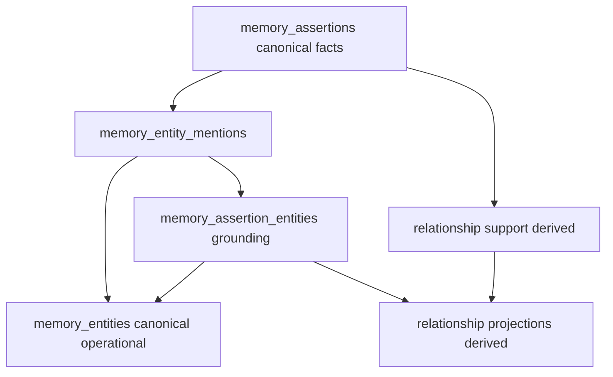

### 53.2 Canonical vs operational vs derived

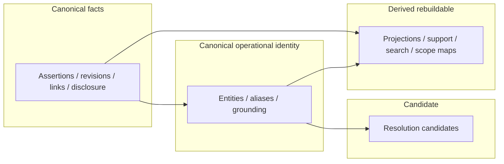

### 53.3 Entity-resolution pipeline

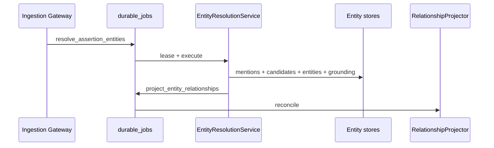

### 53.4 Assertion-to-entity grounding

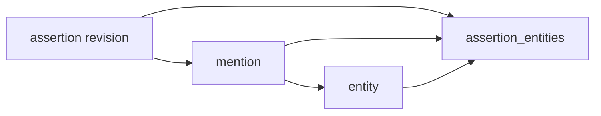

### 53.5 Relationship projection from support

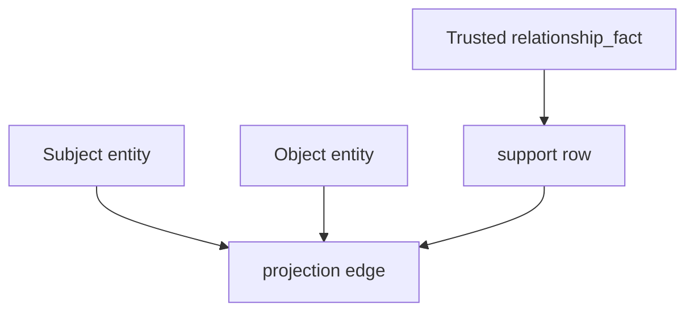

### 53.6 Candidate vs trusted relationship flow

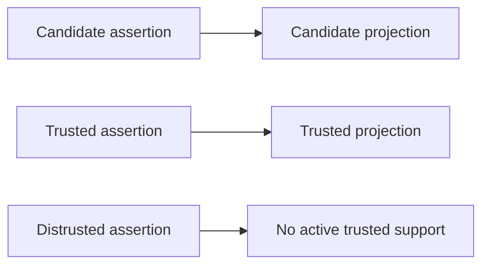

### 53.7 Ambiguity flow

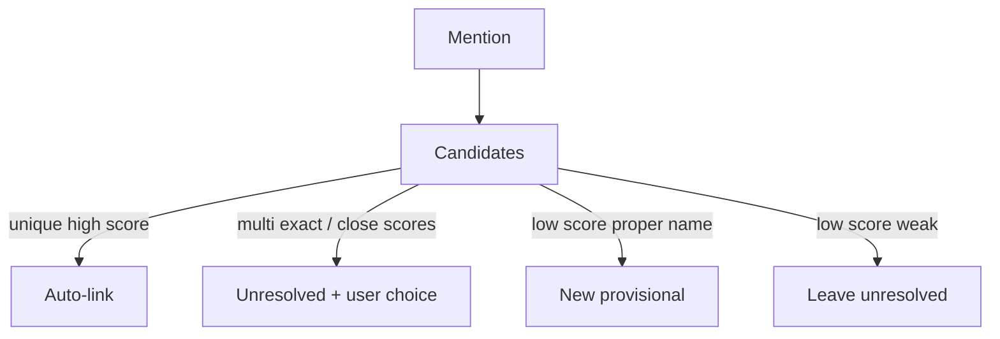

### 53.8 Merge flow

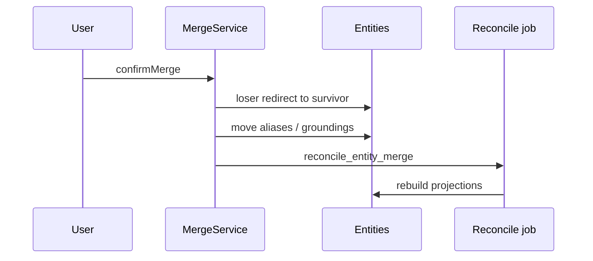

### 53.9 Split flow

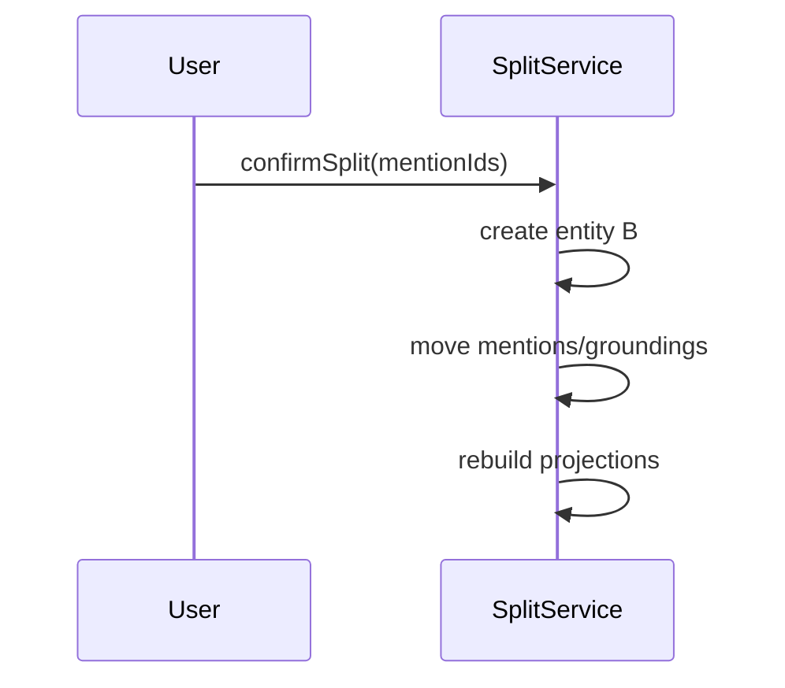

### 53.10 Project scope-label resolution

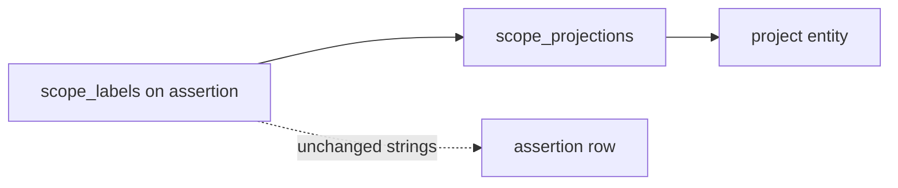

### 53.11 Document mention resolution

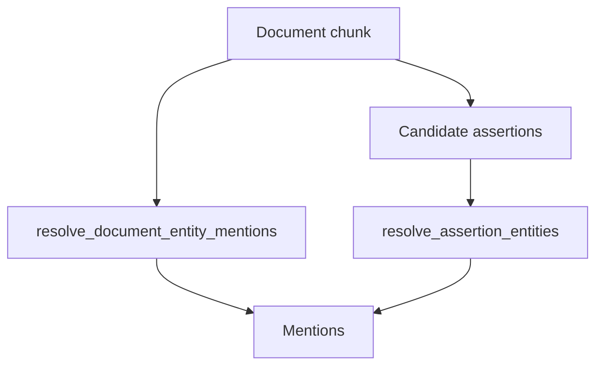

### 53.12 Correction and graph reconciliation

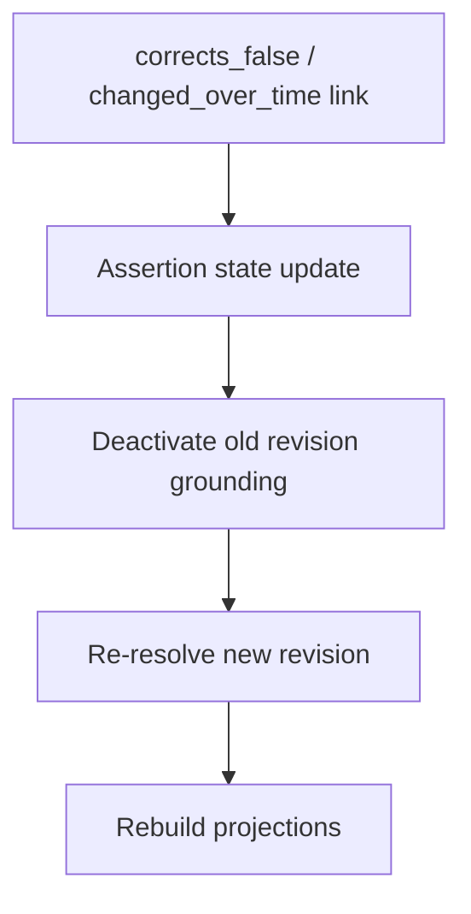

### 53.13 Entity deletion and purge

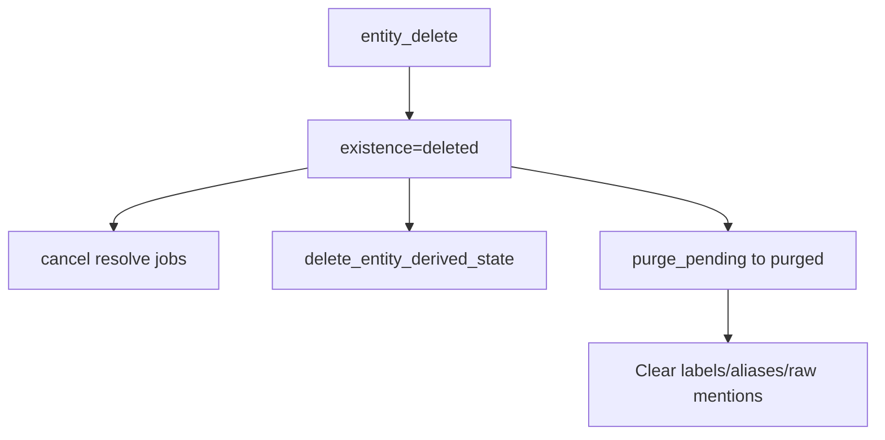

### 53.14 Account-deletion cleanup

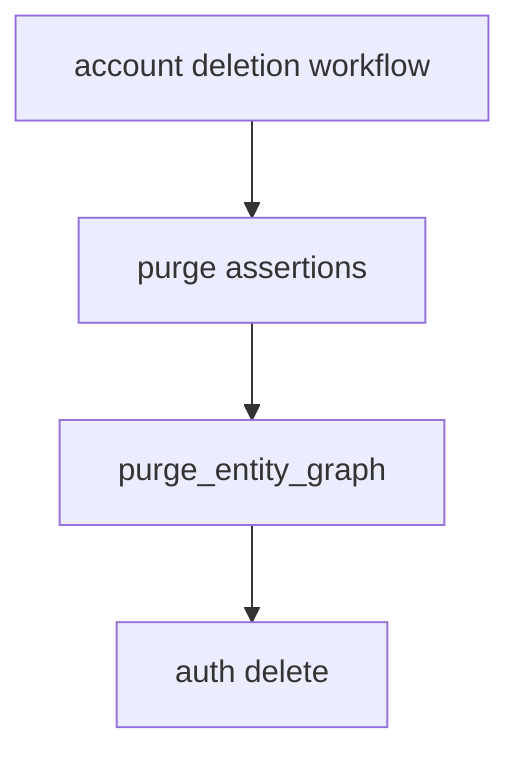

### 53.15 RLS and trust boundaries

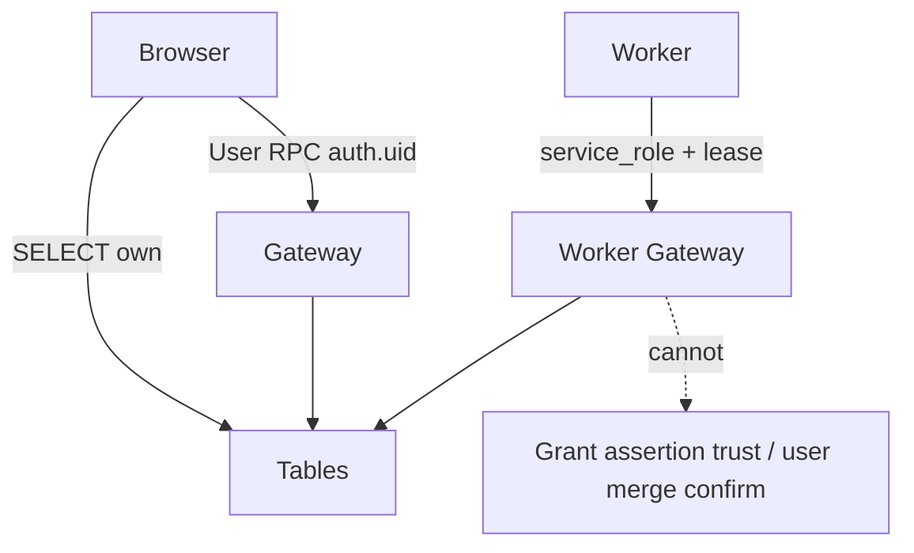

### 53.16 Stage 10 → 11 → 12 handoff


---

## 54. Entity and relationship invariants

1. Assertions remain canonical factual truth.  
2. Entity rows do not replace assertion content.  
3. Entity resolution never grants assertion trust.  
4. Resolution confidence is not trust.  
5. Relationship projections cannot exceed supporting assertion authority.  
6. Candidate assertions cannot create trusted relationship projections.  
7. Historical trusted assertions may support historical relationships.  
8. Distrusted assertions cannot support active trusted relationships.  
9. Deleted and purge-pending assertions cannot support active projections.  
10. Purged assertions leave no private graph support.  
11. Entity records are user-scoped.  
12. Entity aliases are user-scoped.  
13. Entity mentions are user-scoped.  
14. Relationship projections never cross users.  
15. Workspace membership never widens entity access.  
16. The self entity is unique per user.  
17. Self entity fields do not become a second profile truth store.  
18. Identical names do not imply identical entities.  
19. Ambiguous mentions remain unresolved rather than being force-merged.  
20. Same-name people may coexist.  
21. Entity kind does not determine assertion trust.  
22. User-confirmed aliases retain provenance.  
23. Former aliases remain historical rather than disappearing.  
24. Wrong entity links are correctable without rewriting assertion trust.  
25. Entity merges preserve provenance.  
26. Entity splits preserve assertion text and trust.  
27. Merge redirects cannot create cycles.  
28. Entity deletion does not silently delete assertions.  
29. Assertion deletion removes or reconciles its graph support.  
30. Assertion revision changes invalidate stale grounding.  
31. Document replacement invalidates stale mention jobs.  
32. Document deletion does not automatically delete trusted user-confirmed assertions.  
33. Project entity links remain relevance, not ACLs.  
34. Relationship cardinality conflicts do not auto-distrust assertions.  
35. External IDs do not become product authority.  
36. Global cross-user entity dedupe is forbidden.  
37. Third-party person graphs remain private.  
38. Raw private source bodies do not enter operational graph metadata by default.  
39. Entity worker jobs are lease-bound and idempotent.  
40. Worker commands cannot impersonate user merge or split confirmation.  
41. Retry after successful resolution returns the existing result.  
42. Entity relationship projections are rebuildable.  
43. Stage 12 must canonically reconcile assertion and disclosure state before graph use.  
44. Stage 13 may replace providers without changing entity semantics.  
45. Stage 15 can evaluate resolution without redefining trust.  
46. Legacy memories are not assigned invented entity-confirmation history.  
47. Stage 11 does not redefine Stage 9 succession links.  
48. Stage 11 does not replace Stage 10 atomic claims.  
49. Manual relationship edges require an assertion.  
50. `related_to` never auto-infers without explicit weak-predicate path and display caution.  
51. Unresolved mentions do not create relationship projections.  
52. Self entity cannot be merge loser.  
53. Forbidden-secret intake never creates entities or mentions with secret raw text.  
54. Entity processing cannot unfreeze Stage 10 plans.  
55. Scope labels remain stored even when project entities exist.  
56. Symmetric relationships store one canonical undirected row.  
57. Provisional entities are stable operational IDs, not ephemeral cache keys.  
58. Audit `entity_type` in production logs remains unrelated to memory entities until renamed carefully.  

---

## 55. Risks and tradeoffs

| Risk | Tradeoff / mitigation |
| --- | --- |
| Entity records vs assertion-only | Added complexity for ambiguity/UX; assertions stay simpler source of truth |
| Canonical vs derived relationships | Derived chosen — rebuild cost vs dual truth |
| Auto provisional entities | Review volume; cap + ambiguity gate |
| False merges | No auto person merge |
| False splits | User-driven only |
| Alias proliferation | Authority levels + primary alias |
| Ontology size | Closed kinds/types |
| Generic related_to | Restricted fallback |
| Self-entity complexity | One row; thin fields |
| Project entity value | High for Stage 12 filters; coexistence with labels |
| Event entities | Deferred — avoid |
| Third-party privacy | Floors + disclosure |
| Graph join cost | Indexed FKs; rebuild async |
| Projection rebuild cost | Job-scoped, not global by default |
| Merge redirect complexity | Max hop + cycle checks |
| Historical relationships | temporal_class mandatory |
| User confusion | Calm UX vocabulary |
| Provider-dependent resolution | Deterministic primary path |
| Stage 10 amendment burden | Hybrid proceeds without; quality better with amendment |
| Stage 9 schema burden | Explicit amendment list |
| Postgres vs graph DB | Postgres sufficient |
| Retrieval value before Stage 12 | Entity pages still useful |
| Premature abstraction | Closed vocab; no KG reasoning |
| Rollback/coexistence | Feature flag; derived droppable |

---

## 56. Stage 9 amendment requests

**Label: Stage 9 amendment request**

| ID | Missing capability | Why Stage 9 insufficient | Smallest compatible change | Proceed without? | Security | Approver |
| --- | --- | --- | --- | --- | --- | --- |
| 9A | Entity tables §38 | No entity schema reserved | Add tables + enums as designed | Design yes; impl no | Composite RLS | Stage 9 owner / architecture |
| 9B | durable_job_type extensions | Enum closed | Add 8 job types §38.1 | Design yes | Lease-bound | Stage 9 |
| 9C | durable_job_subject_type `entity` | Cannot subject jobs | Add entity/merge/split | Design yes | Subject verify | Stage 9 |
| 9D | deletion_step_key `purge_entity_graph` | Account purge incomplete | Add steps + order after assertion purge | **No** for account safety | Purge privacy | Stage 9 |
| 9E | Worker/user command unions | Commands not listed | Extend Gateway command catalogs | Design yes | Authz split | Stage 9 |
| 9F | Optional deletion_scope `entity` | Single-entity delete workflow | Add scope or fold into assertion-preserving soft delete command | Proceed with command-only | — | Stage 9 |
| 9G | Processing-evidence link optional FK | mention.processing_claim_id | Nullable FK to processing claims if table exists | Yes | No raw content | Stage 9/10 |
| 9H | Projection reconciliation state | May use projection_state only | Prefer columns on projection table; avoid new if possible | Yes | — | Stage 9 |

Do **not** amend `memory_assertion_links` link_type for domain relationships.

---

## 57. Stage 10 amendment requests

**Label: Stage 10 amendment request**

| ID | Missing capability | Why insufficient | Smallest change | Proceed without? | Security | Approver |
| --- | --- | --- | --- | --- | --- | --- |
| 10A | Typed mention candidates on frozen claims | subject/predicate/object strings lack multi-mention spans | Add `mentionCandidates: Array<{text, role, kindHint, originalSpan, fingerprint}>` to frozen claim | **Yes** via hybrid detector | Spans must not include secret segments | Stage 10 owner |
| 10B | Entity-kind hints | Ambiguity Apple/Jordan | Optional `kindHint` per mention | Yes | — | Stage 10 |
| 10C | Predicate normalized token for relationship typing | Free predicate string weak for projector | Optional `predicateTypeHint` from closed map | Yes | No invented trust | Stage 10 |

Stage 11 does **not** edit Stage 10. Freeze/authority/disclosure unchanged.

---

## 58. Decisions intentionally deferred

**Label: Deferred decision**

1. Stage 12 ranking, hop depth, packing, token budgets.  
2. Stage 13 graph framework / ER framework selection.  
3. Full evaluation harness (Stage 15).  
4. Migration/PR sequence (Stages 16–17).  
5. Event as first-class entity kind.  
6. Artifact/product/service split from concept.  
7. Place coordinates on entity rows.  
8. Inference of relationships (friend-of-friend).  
9. Cached co-mention association table (may be on-demand).  
10. Multi-language nickname dictionaries beyond transliteration aliases.  
11. Whether to rename production audit `entity_type` column (compatibility).  
12. Encrypted external_ref payload format details.  
13. Real-time collaborative entity editing.  
14. Public-figure knowledge-base auto-enrichment (likely never).  

---

## 59. Unknowns

**Label: Unknown**

1. Empirical auto-link threshold calibration on real user data.  
2. Volume of provisional entities from noisy documents.  
3. Whether users prefer project entities over labels in UX.  
4. Cost of projection rebuilds at account scale.  
5. How often Greek/Latin alias collisions need UI.  
6. Whether doctor_of should always force highly_sensitive even for “my doctor is X” alone.  
7. Optimal first-release UX subset.  

---

## 60. Acceptance-criteria assessment

| # | Criterion | Status |
| --- | --- | --- |
| 1 | Exact entity architecture | **Met** — Option C assertion-first |
| 2 | Exact relationship architecture | **Met** — derived projections |
| 3 | Assertions canonical | **Met** |
| 4 | Entity canonicity precise | **Met** — operational identity |
| 5 | Entity kinds | **Met** |
| 6 | Self entity | **Met** — Option B |
| 7 | Aliases | **Met** |
| 8 | Mentions | **Met** |
| 9 | Grounding | **Met** — assertion+revision+mention |
| 10 | Resolution | **Met** |
| 11 | Ambiguity | **Met** |
| 12 | Confidence ≠ trust | **Met** |
| 13 | Auto vs user actions | **Met** |
| 14 | Relationship types | **Met** |
| 15 | Direction/inverse/symmetry/cardinality | **Met** |
| 16 | Temporal relationships | **Met** |
| 17 | Candidate vs trusted projections | **Met** |
| 18–20 | Merge/split/redirects | **Met** |
| 21 | Project-scope integration | **Met** |
| 22 | Literals not entities | **Met** |
| 23 | Deletion/purge | **Met** |
| 24 | Third-party privacy | **Met** |
| 25 | Exact tables | **Met** |
| 26 | Cross-user prevention | **Met** |
| 27 | RLS/grants | **Met** |
| 28 | Services/commands | **Met** |
| 29 | Jobs/idempotency | **Met** |
| 30 | Explainability | **Met** |
| 31 | Compatibility | **Met** |
| 32 | Stage 12 queries without ranking | **Met** |
| 33 | No Stage 9 succession overload | **Met** |
| 34 | No Stage 10 semantic rewrite | **Met** |
| 35 | Amendments explicit | **Met** §§56–57 |
| 36 | No Stage 13 framework | **Met** |
| 37 | No Stage 12 ranking | **Met** |
| 38 | No implementation roadmap | **Met** |
| 39 | No production behaviour change | **Met** |
| 40 | Stable foundation for Stage 12 | **Met** |

---

## 61. Files and questions recommended for Stage 12

### Files
1. This document (`11-entity-relationship-design.md`)  
2. `09-technical-design.md` — assertions, disclosure, embeddings  
3. `10-memory-processing-design.md` — freeze, confidence, scope labels  
4. `08-memory-model.md` — trust/temporal/disclosure  
5. `05-retrieval-context-audit.md` — current retrieval behaviour  
6. `07-target-architecture.md` — derived indexes  

### Questions for Stage 12
1. How to blend entity-filtered assertions with vector/FTS hits without treating graph edges as trust?  
2. How to present historical vs current relationships in prompt context?  
3. How to exclude disclosure-denied entity neighbourhoods from provider prompts while keeping local UX?  
4. Should unresolved mentions contribute only via raw assertion retrieval?  
5. How to pack multi-entity answers (e.g., manager + project) within token budgets?  

### Non-goals for Stage 12 (from Stage 11)
Do not redefine entity canonicity, relationship projection authority, or succession links.

---

## 62. Disagreements with prior artifacts

| Item | Disposition |
| --- | --- |
| `00-roadmap.md` stale statuses (Stage 2 “next”, etc.) | Stages 1–10 treated complete per task instructions; roadmap **not** edited |
| Stage 7 deferred entity canonicity | **Closed** — entities canonical operational; relationships derived |
| Stage 8 “whether relationship_fact requires entities” | **Closed** — does **not** require; may attach when resolved |
| Production Connections UI as “graph” | Clarified: similarity only; not Stage 11 graph |
| Option B independent edges | Rejected despite common KG pattern |
| Full ontology (Option D) | Rejected as premature |
| Audit field name `entity_type` | Remains audit vocabulary; document collision; rename deferred |

No disagreement that assertions are canonical or that Stage 10 annotations are non-entities.

---

## 63. Final consistency checklist

- [x] Assertions canonical; entities operational; projections derived  
- [x] relationship_fact stores without entities  
- [x] Confidence ≠ trust; resolution ≠ trust  
- [x] Composite ownership / RLS SELECT-only clients  
- [x] No workspace widening  
- [x] No graph DB required  
- [x] Stage 9 links not overloaded  
- [x] Stage 10 freeze untouched  
- [x] Self entity thin; profile remains account identity  
- [x] Third-party floors  
- [x] Deletion does not silently drop assertions when deleting entities  
- [x] Stage 12 contracts without ranking  
- [x] Amendments listed, docs 9/10 not edited  
- [x] Production behaviour unchanged  
- [x] Only file created: `docs/memory-system/11-entity-relationship-design.md`

---

## Appendix A — Answers to Stage 10 handoff questions

1. **How should subject/predicate annotations seed entity candidates without becoming canonical prematurely?**  
   They seed **mentions** and **resolution candidates** with `system_proposed` / provisional entities. Canonical grounding activates only after deterministic rules or user confirmation. Annotations remain non-entities.

2. **When do relationship_fact assertions require entity nodes?**  
   **Never required** to store. Required only to emit a **relationship projection**. Unresolved mentions ⇒ assertion exists, no edge.

3. **How do correction/conflict links interact with entity identity merges?**  
   Succession links remain assertion-level. Merges retarget groundings/projections; they do **not** rewrite `memory_assertion_links` or invent distrust. After correction, re-resolve new revision and rebuild projections.

4. **Can scope_labels map to project entities without rewrite?**  
   **Yes** — coexistence via `memory_entity_scope_projections`; labels remain on assertions.

5. **How to attach multiple mentions across chunks to one entity safely?**  
   Per-mention rows with span fingerprints + document continuity scoring; same alias/entity candidate; **no** auto-merge of distinct people; user confirms ambiguity.

---

## Appendix B — Automatic actions summary

| Action | Automatic? | Why safe |
| --- | --- | --- |
| I/me/my → self | Yes | Deterministic, unique self |
| Exact unique user_confirmed alias | Yes | User authority |
| Exact unique provisional alias | Yes | Same provisional continuity |
| New unambiguous named person | Provisional yes | Stable ID; not trusted memory |
| New org/place/project | Provisional yes | Kind-gated |
| New concept | Conservative provisional | Fail closed often |
| Two same-name people auto-merge | **Never** | False merge risk |
| Candidate assertion → provisional entity | Yes | Candidate operational only |
| Document candidate → provisional | Yes | Same |
| Trusted relationship_fact → trusted projection | Yes if entities resolved | Authority from assertion |
| Candidate relationship → candidate projection | Yes | Cannot exceed support |
| System-proposed merge | Suggest only | Need user confirm |
| Merge with trusted support | User confirm | High impact |
| Split | User confirm | High impact |

---

*End of Stage 11 — Entity and Relationship Architecture Design*
