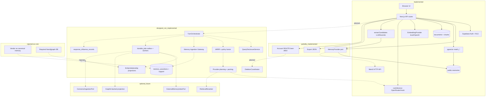

# Stage 14 — Architecture Red-Team Review

| Field | Value |
| --- | --- |
| Stage | 14 — Architecture red-team review |
| Status | Draft for architecture review |
| Document date | 2026-07-24 |
| Binding predecessors | Stages 0–13 (especially 7–13) |
| Output | Adversarial architecture review only — **no implementation authorized** |
| Repository context | Cortaix / Context Vault (`NicolVii/ContextVault`) |
| Base commit | `5cbb2333fdf3d1710e1953fde0e5e94c9a2ed886` (Stage 13 merge) |
| Changed file | This document only |

---

## 0. Executive summary

**Final verdict: `approve_with_required_amendments`.**

Recommendation B disposition: **`upheld_with_required_amendments`**.

Stage 7–13 correctly rejects vendor frameworks as canonical authority and correctly elevates PostgreSQL ownership, reconciliation, disclosure, and deletion as first-class contracts. That core direction survives adversarial review.

What does **not** survive unchanged is the assumption that the full Stage 8–12 surface — orthogonal trust matrices, conflict groups, entity/relationship graphs, multi-provider evidence planning, influence-record completeness, optional multi-adapter topology, and normative uncalibrated WRRF constants — is the minimum architecture required to deliver Cortaix’s differentiating value.

This review finds:

| Class | Count |
| --- | --- |
| Distinct attacks evaluated | **72** |
| Confirmed blockers (attack dispositions) | **7** |
| Architecture changes required (attack dispositions) | **16** |
| Clarifications required (attack dispositions) | **8** |
| Stage-15 / sequencing / first-PR constraints (attack dispositions) | **33** |
| Accepted-risk attack dispositions | **4** |
| Rejected attacks | **3** |
| Unresolved attacks | **1** |
| Complete worked scenarios (S01–S45) | **45** |
| True cross-stage contradictions | **8** |
| Resolvable tensions (matrix) | **8** |
| Stage 7–12 invariant IDs in source ledger | **327** |
| Correction backlog items | **17** |
| Effective architecture overrides (OV-01…OV-18) | **18** |
| Risk-acceptance register entries | **8** |

**Highest-severity confirmed findings**

1. **Complexity budget overrun** — Stages 8–12 specify ~40+ logical tables, hundreds of invariants, 11+ retrieval channels, and multi-adapter ops without a deliverable minimum-viable cut. Small-team operability fails before product differentiation is proven.
2. **False determinism** — “Deterministic” packing/provider planning sits atop nondeterministic extraction, embedding upgrades, and approximate tokenization. Exactness claims are not enforceable as stated.
3. **Deletion vs provenance / audit** — Immutable provenance, influence records, and deletion completeness are jointly asserted without a proven terminal state under partial failure and backup retention.
4. **Current Mem0 remote-text path** — Production code can inject Mem0 hit text without canonical reconciliation when `cv_memory_id` is absent. Target forbids this; coexistence without disable/harden is unsafe.
5. **Optional adapters → mandatory ops surface** — Recommendation B’s “optional” ports create failure domains (outbox lag, dual-write, purge, pricing) that become operationally mandatory once enabled.
6. **Required-evidence × disclosure × token-budget deadlock** — Stage 12 can invalidate all provider plans; product behaviour under total plan failure is under-specified for UX and billing.

**Recommendation B survives as a direction, not as the v1 build scope.** Amend to:

```text
Native canonical core (narrowed MVA)
+ ports preserved as interfaces
+ zero external memory adapters enabled for private beta
+ adapters remain PoC-gated and depth ≤ 1 after product validation
```

**Stage 15 may begin** only under the explicit conditions in §20.3 (PR #47 reviewed and merged; override register accepted as normative; every `blocking_before_stage15` item has replacement language in OV-* or an explicit Stage 15 hypothesis; no implementation begun).

**Stage 16/17 and all implementation remain prohibited** until Stage 15 produces a testing framework that can falsify the amended architecture.

---

## 1. Evidence taxonomy and method

### 1.1 Evidence classes

Every material claim below is labelled:

| Class | Meaning |
| --- | --- |
| `repository_fact` | Observable in current code, migrations, tests, or config |
| `design_claim` | Asserted in Stages 7–13 docs |
| `external_fact` | From primary external sources (cited) |
| `assumption` | Stated or implied without proof |
| `inference` | Conclusion drawn from evidence |
| `unknown` | Not established |

### 1.2 Red-team independence rules

- Later-stage dependence does **not** validate an earlier decision.
- Product goals, architectural choices, implementation conveniences, untested assumptions, and external constraints are distinguished.
- Recommendation B is not protected.
- Vendor benchmarks are never treated as architectural proof.
- Stage 13 vendor research is not repeated unless needed to challenge a conclusion.

### 1.3 Repository snapshot used

| Item | Value | Class |
| --- | --- | --- |
| Commit | `5cbb233` — Merge PR #46 Stage 13 | `repository_fact` |
| Runtime memory | Flat `public.memories` + optional Mem0 hybrid | `repository_fact` |
| Target assertion schema | Not in `supabase/migrations/` | `repository_fact` |
| Outbox / workers / WRRF / entity graph | Docs only | `repository_fact` |
| App topology | Next.js 14 App Router, Supabase, Vercel-oriented API routes | `repository_fact` |

---

## 2. Architecture reconstruction

### 2.1 Current implemented architecture

```text
[Browser] → Next.js API routes (/api/chat, /api/think, /api/memories, /api/documents, /api/account, /api/export)
         → Supabase Auth (JWT) + RLS
         → MemoryProvider (Supabase pgvector | Mem0 hybrid)
         → EmbeddingProvider (local hash | OpenAI)
         → Document extract/chunk/embed (sync in request)
         → buildSystemPrompt (profile force-merge + memories + chunks)
         → runInference (OpenRouter / mock)
         → extractCandidates (LLM | heuristic fallback) → insert status=proposed
```

**Canonical store today:** `public.memories` (and documents/chunks).  
**Optional derived index today:** Mem0 remote API when `MEMORY_PROVIDER=mem0`.

Key repository anchors:

| Concern | Path | Lines / symbol | Current behaviour | Class |
| --- | --- | --- | --- | --- |
| Provider interface | `src/lib/memory/provider.ts` | `MemoryProvider` ~L31–54 | insert/retrieve/reembed/remove/syncMetadata/removeAll | `repository_fact` |
| Factory | `src/lib/memory/index.ts` | `getMemoryProvider` | Mem0 iff `MEMORY_PROVIDER=mem0` + key | `repository_fact` |
| Supabase provider | `src/lib/memory/supabase-provider.ts` | `retrieve` | embed → `match_memories` RPC | `repository_fact` |
| Mem0 remote-text fallback | `src/lib/memory/mem0-provider.ts` | L119–125, `toRetrievedMemory` L274–295 | If no `cv_memory_id`, return Mem0 hit text as retrieved memory | `repository_fact` |
| Chat orchestration | `src/lib/orchestration/chat.ts` | L92–133, L214–240 | retrieve → profile force-merge → docs → prompt → extract → proposed | `repository_fact` |
| Profile force-merge | `src/lib/orchestration/chat.ts` | L98–111 | Active `type=profile` injected with `similarity: 1` | `repository_fact` |
| Heuristic fallback | `src/lib/memory/extraction/index.ts` | L139–150 | LLM timeout/error → heuristic extract | `repository_fact` |
| Account delete | `src/app/api/account/route.ts` | L23–53 | `removeAll` → storage → `auth.admin.deleteUser` → cascade | `repository_fact` |
| Export | `src/app/api/export/route.ts` | GET | memories ≠ deleted + docs metadata + profile JSON | `repository_fact` |
| RLS | `supabase/migrations/20260720000006_rls.sql` | memories/docs/chat policies | `auth.uid() = user_id` | `repository_fact` |
| match RPC | `supabase/migrations/20260720000007_functions.sql` | `match_memories` | SECURITY INVOKER + `auth.uid()` filter | `repository_fact` |
| Embeddings | `src/lib/embeddings/index.ts` | `EMBEDDING_DIM=1536` | local or OpenAI | `repository_fact` |
| Workers / outbox | — | — | **Absent** | `repository_fact` |

### 2.2 Target Stage 7–13 architecture

```text
TurnOrchestrator
  → QueryDisclosureService
  → multi-channel recall (memory/doc/entity/relationship/project/conversation/identity[+external])
  → canonical reconciliation + eligibility
  → WRRF × bounded policy (λ=0.15, k=60)
  → optional RetrievalReranker (noop default)
  → conflict-safe grouping
  → provider-candidate planning + hierarchical packing
  → untrusted structured render → inference
  → Processing Pipeline (freeze) → Memory Ingestion Gateway → memory_assertions
  → durable_jobs outbox → workers → derived indexes / graph projections / external adapters
  → DeletionCoordinator across canonical + derived
```

**Canonical:** PostgreSQL `memory_assertions` + supporting operational/history tables.  
**Derived:** embeddings, FTS, external index entries, graph projections.  
**Rejected as core:** Mem0/Zep/etc. as personal-truth authority; graph DB as required infra.

### 2.3 Major data flows

1. **Chat/Think turn** — request-path retrieve + infer; extraction may be request-path today, target moves to outbox after reply durability.
2. **Document upload** — sync extract/chunk/embed today; target adds candidate processing jobs, not auto-trust.
3. **Manual remember / forget** — Think instructions; target: Gateway commands with policy.
4. **Export** — JSON of current rows; target must include revisions/conflicts/decisions semantics.
5. **Deletion** — best-effort provider purge + Auth cascade today; target stateful workflow.

### 2.4 Trust boundaries

| Boundary | Current | Target |
| --- | --- | --- |
| Browser → API | Session cookie / JWT | Same; SELECT-only PostgREST clients |
| API → Postgres | User-scoped Supabase client + RLS | Gateway RPCs for mutations |
| API → Mem0 | Server key; user_id param | Optional ID-only adapter |
| API → OpenRouter/OpenAI | Server/BYOK keys | Disclosure-gated Provider Gateway |
| Worker → Postgres | N/A | service_role claim + allowlisted commands |
| Storage | Per-user folder RLS | Same + deletion steps |

### 2.5 External-call boundaries

Embeddings, Mem0 search/add/update/delete, OpenRouter inference, OpenAI embeddings, optional future reranker/connectors/Graphiti. Target requires query disclosure **before** each external class.

### 2.6 Canonical vs derived

| Class | Current | Target |
| --- | --- | --- |
| Canonical | `memories`, profiles, docs metadata, chat | `memory_assertions`, revisions, provenance, review, disclosure, turns, deletion workflows, influence |
| Derived | pgvector column; Mem0 mirror (de facto co-authority today) | `memory_embeddings`, FTS, external index entries, entity/relationship projections |
| Ambiguous today | Mem0 remote text used without row | Explicitly forbidden by Stages 12–13 |

### 2.7 Request-path vs background-path

| Path | Current | Target |
| --- | --- | --- |
| Request | retrieve, infer, extract, document process, delete | retrieve/pack/infer; durable reply+outbox registration |
| Background | none | extraction continuation, embed, external sync, graph rebuild, deletion steps, repair |

### 2.8 Deletion and export (current vs target)

**Current deletion** (`src/app/api/account/route.ts` L34–53): audit → Mem0 `removeAll` (must succeed) → storage remove → Auth delete → FK cascade. No tracked workflow; Storage list shallow; Stripe/billing cleanup not in this route.

**Target:** `deletion_workflows` + steps; Auth delete last; `subject_ref` survival; purge derived systems; influence/provenance retention rules still contested (see contradiction matrix).

**Current export:** active-ish memories + document metadata + profile. Omits Mem0-only state, revisions (none), conflicts (none), influence.

### 2.9 Retrieval and context flow

**Current:** cosine `match_memories` + profile force-include + `match_document_chunks` → interpolate into system prompt (`src/lib/ai/context.ts`).

**Target:** multi-channel WRRF×policy → conflict groups → disclosure-aware provider plans → reserve-then-fill packing → structured untrusted blocks.

### 2.10 Framework adapter boundaries

Designed ports: `ExternalMemoryIndexPort`, `RelationshipProjectionPort` / `EntityProjectionPort`, `RetrievalReranker`, `ConnectorIngestionPort`, `ExtractionAssist`. Depth ≤ 1. None implemented as target ports.

### 2.11 Current-to-target migration assumptions

Additive `memory_assertions`; `memories` compatibility projection; dual-read; write-through adapter; backfill without inventing trust history; Think+Chat behind TurnOrchestrator; Mem0 harden/disable; no forever dual-write; implementation gated on Stages 14/15/17.

### 2.12 Unimplemented dependencies required by target

Durable job workers (not Vercel request), Gateway mutation RPCs, assertion schema + CHECKs, embedding space registry, FTS documents, deletion coordinator, query/evidence disclosure services, WRRF fusion, packing, influence schema extensions, entity graph tables, processing freeze runs, observability that excludes raw secrets.

### 2.13 Architecture diagram (Mermaid)

Legend: solid = implemented; dashed = designed_not_implemented; dotted = optional_future; cross = rejected.



---

## 3. Review lenses — strongest objections

| # | Lens | Strongest objection |
| ---: | --- | --- |
| 1 | Adversarial security | Mem0 remote-text fallback and system-prompt interpolation create injection and cross-authority paths that Stages 12–13 forbid but production still encodes. |
| 2 | Privacy | “Disclosure before external call” is design-only; BYOK, provider logs, and embeddings lack enforceable proof obligations. |
| 3 | PostgreSQL/DB architect | Orthogonal enum explosion + composite FKs + outbox + deletion workflows exceed operable schema complexity before load justifies it. |
| 4 | Distributed systems | Dual-write + outbox + multi-adapter purge without proven idempotency/poison handling will diverge under partial failure. |
| 5 | SRE | Optional adapters multiply on-call domains (PG, workers, Mem0, Graphiti/Neo4j, reranker, connectors) beyond solo/small-team capacity. |
| 6 | ML retrieval/eval | WRRF weights and λ=0.15 are normative before Stage 15 evidence — cargo-cult fusion. |
| 7 | Prompt-injection | Untrusted render reduces instruction-shaped injection but does not stop model-side extraction poisoning from malicious PDFs. |
| 8 | Product architect | Differentiation is “user-owned trusted memory,” not “11-channel WRRF.” Architecture delays learning. |
| 9 | UX / user-control | Assertion/summary/entity/conflict/trust axes will not be comprehensible; review queues will fatigue. |
| 10 | Cost/capacity | Reindex, dual embed spaces, deletion sweeps, and eval infra omitted from TCO of “native.” |
| 11 | Solo-founder delivery | Stages 8–12 are a multi-team platform plan packaged as a product v1. |
| 12 | Framework-adoption skeptic | Ports are fine; enabling any adapter before native MVA works recreates today’s Mem0 hybrid failure mode. |
| 13 | Native-build skeptic | Native estimates hide worker platform, eval harness, and migration years of complexity; managed acceleration underweighted for connectors only. |
| 14 | Incident responder | Recovery procedures depend on rebuildability claims that are untested; vendor-only metadata must never be required — yet mapping tables invite that dependency. |
| 15 | Portability/deletion | Export semantics and deletion terminal states are asserted without fixtures proving round-trip or purge under backup retention. |

Lenses do **not** agree. Security/privacy push more machinery; delivery/UX/cost push radical simplification. The resolution is a **narrowed native MVA**, not “build everything” or “trust a vendor core.”

---

## 4. Architecture complexity inventory

### 4.1 Counts / estimates (from Stages 7–13)

| Category | Estimate | Source |
| --- | --- | --- |
| Canonical tables (Stage 9 core) | ~15–18 named mutation tables | 09 §8 |
| Derived tables | ~5–8 (embeddings, FTS, external index, chunk embeddings, projections) | 09 §8; 11 |
| Mapping / link tables | several (intake links, assertion links, external_memory_index_entries, entity grounding) | 09/11 |
| Policy axes / enums | ~20 Stage 9 + ~15 Stage 11 additive | 09 §8.0; 11 |
| Lifecycle / review / retention / succession | review 5; org 2; retention 4; succession 4 | 09 |
| Trust states | 3 | 08/09 |
| Disclosure flags / policies | per-assertion disclosure policies + purpose permissions | 08/12 |
| Temporal fields | phase × bounds × modality (+ validity intervals) | 08/09 |
| Services / ports | ~15 Stage 9 + ~10 Stage 11 + ~14 Stage 12 + 5–7 framework ports | 09/11/12/13 |
| Background job types | ~12 Stage 9 + ~12 Stage 11 | 09/11 |
| External-call purposes | embed, index search, inference, rerank, connector sync, projection rebuild | 12/13 |
| Provider plans | per eligible provider per turn | 12 §22 |
| Retrieval channels | 11+ | 12 §8 |
| Ranking / packing stages | ≥8 pipeline stages | 12 §1 |
| Audit / influence records | `audit_log` + `response_influence_records` | 09 |
| User-visible review states | 5 review enum + conflict_open UX | 09/08 |
| Migration / reindex workflows | coexistence, backfill, embedding space reindex, graph rebuild | 09/11/12 |
| Invariants across 7–13 | 26+35+64+69+87+46+33 ≈ **360** | stage §§ |

### 4.2 Complexity interrogation

| Category | Diff? | Safety? | Premature? | Collapse? | Defer? | State explosion? | Small team? | User-explainable? |
| --- | --- | --- | --- | --- | --- | --- | --- | --- |
| Full assertion taxonomy (11 kinds) | partial | no | yes for v1 | yes → fewer kinds | yes | moderate | hard | weak |
| Multi-axis trust/lifecycle | yes | yes (narrow) | partly | collapse review+trust UX | defer org/retention sophistication | high | hard | weak |
| Temporal intervals | yes | yes | partially | phase+current/historical flag | defer full modality matrix | high | medium | medium |
| Conflict groups | yes | yes | needed early-ish | keep minimal dual-truth ban | defer rich UI | medium | medium | medium |
| Entity/relationship graph | aspirational | limited | **yes** | defer graph; keep names in text | **yes** | high | no | weak |
| Influence records | explainability | medium | yes for full schema | start with message_context evolution | yes | medium | medium | medium |
| Multi-provider evidence planning | niche | privacy-related | **yes** | single-provider pack first | **yes** | high | no | weak |
| External indexes | scale | no | yes | omit | yes | high | no | n/a |
| Rerankers | quality | no | yes | noop forever until metrics | yes | low | low | n/a |
| Connectors | growth | privacy risk | yes | omit | yes | high | no | medium |
| WRRF multi-channel | quality | no | yes | semantic+lexical+profile | calibrate later | medium | medium | n/a |
| Multiple embedding spaces | ops reality | correctness | needed when changing models | one space v1 | second space on change | high | hard | n/a |
| Automatic consolidation | quality | risk | yes | manual/correction first | yes | high | hard | weak |
| Review queues | control | yes | needs UX proof | confirm/reject only | advanced triage later | high | UX risk | weak |

### 4.3 Complexity budget

| Bucket | Components |
| --- | --- |
| `essential_now` (**private beta**) | PG canonical assertions (simplified); candidate vs trusted vs distrusted; user confirmation+undo; secret fail-closed; RLS/Gateway mutation control; proposed-not-as-truth; semantic retrieve + identity allowlist; thin conflict; thin temporal; TurnOrchestrator; sync candidate extraction (no inventing); sync/narrow deletion **only with zero adapters and zero background publishers**; disable Mem0 remote-text |
| `required_before_scale` (**public beta** then **paid scale**) | Public beta: durable workers+outbox; DeletionCoordinator; canonical export; lexical+semantic; disclosure service. Paid scale: embedding space registry+reindex; basic influence; quotas; optional single adapter after metrics |
| `optional_later` | Entity graph; relationship projections; external memory index; reranker; connectors; multi-provider evidence planning; WRRF full channel set; automatic consolidation; Graphiti |
| `unjustified` (as v1 normative) | 11+ channel fusion with uncalibrated weights as correctness; full orthogonal enum surface before UX validation; depth>1 adapters; forever dual-write; treating optional adapters as needed for differentiation |

---

## 5. Contradiction audit

| ID | Decision A | Decision B | Stages/sections | Conflict | Practical consequence | Severity | Classification | Required resolution |
| --- | --- | --- | --- | --- | --- | --- | --- | --- |
| C1 | Immutable provenance / influence retain explainability | Complete user deletion / erasure | 07 P7/P14; 09 §8.23/§23; 13 Inv 10 | Retained records may encode deleted facts | Legal/product “complete deletion” false or explainability hollow | high | `true_contradiction` | Define erasable vs tombstone-only fields; forbid raw fact text in durable audit after purge |
| C2 | Canonical revision history | User deletion of assertion | 08/09 revisions CASCADE vs deletion coordinator | History deleted with assertion or survives? | Export/deletion semantics ambiguous | high | `documentation_ambiguity` | Normative: what survives account delete vs assertion delete |
| C3 | Explicit remember → trusted (clear user-asserted) | Ordinary statements never auto-trusted; sensitive never auto-approved UX | 08 §8–9; 04/06 audits; UI copy | Borderline phrases flip trust | Users surprised by silent trust | medium | `resolvable_tension` | Narrow auto-trust; always show confirmation for sensitive |
| C4 | Deterministic Final(c) / packing | Nondeterministic extraction & approximate tokens | 12 §12/§24; 10 extraction | Same vault → different candidates → different packs | “Deterministic” marketing false | high | `true_contradiction` | Scope determinism to *given candidate set + versions*; never claim end-to-end |
| C5 | Model independence | Fixed 1536-dim spaces; extraction model changes alter memory | 09 embedding lock; 10/13 G9 | Independence of vendor ≠ independence of interpretation | Personality/memory drift across models | high | `resolvable_tension` | Separate provider independence from interpretation stability; pin extraction model |
| C6 | Required evidence must pack | Token budgets + disclosure may block all plans | 12 §22–24 | Total invalidation under-specified | Empty/degraded answers, billing confusion | high | `true_contradiction` | Normative terminal UX + no charge-without-explanation policy |
| C7 | Optional adapters harmless when down | Product features may depend on adapter quality | 13 Rec B; 12 optional channels | Optional becomes load-bearing | Outage = quality collapse misread as “safe” | medium | `resolvable_tension` | SLOs: native-only quality floor; adapters cannot be sole source of differentiation claims |
| C8 | External IDs never replace canonical IDs | Mapping tables + Mem0 metadata | 13 Inv 8; 09 external_memory_index_entries; current mem0 `source_detail` | Mapping becomes de facto join key | Vendor metadata required for purge/retrieve | high | `true_contradiction` | Canonical owns mapping; missing map = unreconciled miss, never remote text |
| C9 | Native serverless/Vercel topology | Long workers, Graphiti/Neo4j PoC-B, heavy reindex | 07 P18; 13 PoC-B; AGENTS.md | Ops model incompatible | Hidden platform rewrite | high | `true_contradiction` | Stage 16 must introduce worker platform before adapter PoCs needing it |
| C10 | Confidence ≠ trust | Policy features use confidence/pin/importance in ranking | 08 Inv 2; 12 policy | Importance biases “truthy” presentation | Users treat ranked order as confidence | medium | `resolvable_tension` | Presentation labels; never show rank as trust |
| C11 | Summaries deferred/controlled | Conversation summaries as MVA candidate | 08/10 vs product need | Summary staleness vs usefulness | Wrong beliefs from stale summary | medium | `resolvable_tension` | Summaries non-authoritative; never extract trust from summary alone |
| C12 | Graph edges derived from assertions | Precomputed projections / one-hop | 11/12 | Projection lag or summary bypass | Stale relationships in context | medium | `implementation_gap` | Rebuild_pending non-consumable (already said) — enforce in Stage 15 |
| C13 | Import never grants trust (10) | Stage 8 deferred import confirmation exception | 08 vs 10 | Docs disagree | Import path unsafe or UX broken | medium | `true_contradiction` | Adopt Stage 10 harden; amend Stage 8 language in later correction stage |
| C14 | Fail-closed disclosure | Availability under provider outage | 12/13 Inv 9 | Safe native path may omit needed sensitive evidence | Wrong answers or refusals | medium | `resolvable_tension` | Explicit local-only UX |
| C15 | Profile force-merge current product | Stage 7/12 reject always-include | 05 High; 07/12 | Migration coexistence contradiction | Invasive memory / wrong identity | high | `implementation_gap` | Must retire before target retrieval declared |
| C16 | Heuristic fallback invents memories | Stage 10 bans heuristic conversational semantic fallback | 04; `extraction/index.ts` L139–150; 10 | Live behaviour forbidden by target | Pollutes candidates | high | `true_contradiction` | Disable inventing fallback before enabling Gateway |
| C17 | Deduplicate paraphrases | Preserve distinct provenance | 10 dedupe | Over-merge destroys sources | Irreversible loss | medium | `resolvable_tension` | Suppress display not destroy provenance |
| C18 | Entity merge reversible | Operational irreversibility of projections | 11 | Split after merge expensive | User harm from wrong merge | high | `resolvable_tension` | Defer auto-merge; manual only in MVA |
| C19 | Roadmap statuses pending | Stages 7–13 exist as complete drafts | 00 vs files | Process doc stale | Process confusion | low | `documentation_ambiguity` | Update roadmap in a later docs PR (not this PR’s scope to edit 00) |
| C20 | Stage 13 cites Mem0 §20.4 | §20 has no .4 | 13 §23 Q30 | Broken citation | Auditability gap | low | `documentation_ambiguity` | Fix in Stage 13 follow-up amendment stage |
| C21 | “Complete export” | Derived system state / influence / jobs | 07/13 | Export incomplete by construction | Portability false | high | `true_contradiction` | Define export as canonical semantic package only; label derived as non-portable |
| C22 | Retry extraction | Idempotent Gateway | 10 freeze vs current retries | Duplicate proposed memories | Vault spam | medium | `implementation_gap` | Idempotency keys mandatory |


## 6. Invariant audit

### 6.1 Method

Consolidated from Stage 13’s 33 invariants plus material must/never/fail-closed rules from Stages 7–12. Status values: `uphold | amend | merge_with_another | defer | remove | unresolved`.

### 6.2 Stage 13 invariants (S13-I1…I33)

| invariant_id | source | statement (abbr.) | product goal | testable | enforceable | conflicts_with | ops cost | status |
| --- | --- | --- | --- | --- | --- | --- | --- | --- |
| S13-I1 | 13§22 | Eval cannot redefine 7–12 | process | yes | process | C13/C4 amendment needs | low | **amend** — red-team may require normative amendments via explicit correction register |
| S13-I2 | 13§22 | PG canonical regardless of recommendation | independence | yes | yes (if Gateway) | — | med | **uphold** |
| S13-I3 | 13§22 | Weighted score ≠ override failed gate | process | yes | process | — | low | **uphold** |
| S13-I4 | 13§22 | Vendor benchmarks labelled | honesty | yes | docs | — | low | **uphold** |
| S13-I5 | 13§22 | Unknown pricing stays unknown | honesty | yes | docs | — | low | **uphold** |
| S13-I6 | 13§22 | Managed isolation not assumed | privacy | partial | partial | — | low | **uphold** |
| S13-I7 | 13§22 | External text never bypasses reconciliation | safety | yes | yes | current Mem0 L123–125 | med | **uphold** (enforce by disabling path) |
| S13-I8 | 13§22 | External IDs ≠ canonical IDs | independence | yes | yes | C8 mapping gravity | med | **uphold** |
| S13-I9 | 13§22 | Optional outage ≠ block native retrieval | safety | yes | yes | C7 | med | **uphold** |
| S13-I10 | 13§22 | Deletion propagates to every derived system | privacy | hard | partial | C1 backups | high | **amend** — “every derived system Cortaix controls”; backups/legal holds explicit |
| S13-I11 | 13§22 | Query/evidence disclosure Cortaix-owned | privacy | yes | yes | — | med | **uphold** |
| S13-I12 | 13§22 | Trust/conflict Cortaix-owned | safety | yes | yes | — | med | **uphold** |
| S13-I13 | 13§22 | Final packing Cortaix-owned | independence | yes | yes | — | med | **uphold** |
| S13-I14 | 13§22 | Agent writes via Gateway | safety | yes | yes | — | med | **uphold** |
| S13-I15 | 13§22 | Exit strategy per adapter | independence | partial | process | — | med | **uphold** |
| S13-I16 | 13§22 | Self-host ≠ low ops risk | ops | n/a | n/a | — | low | **uphold** |
| S13-I17 | 13§22 | OSS ≠ portable | ops | n/a | n/a | — | low | **uphold** |
| S13-I18 | 13§22 | Managed ≠ production safe | ops | n/a | n/a | — | low | **uphold** |
| S13-I19 | 13§22 | Accept per-port not global | process | yes | process | — | low | **uphold** |
| S13-I20 | 13§22 | Stage 13 ≠ authorize implementation | process | yes | process | — | low | **uphold** |
| S13-I21 | 13§22 | Weighted totals reproducible | process | yes | docs | — | low | **uphold** |
| S13-I22 | 13§22 | Core vs adapter scores non-interchangeable | process | yes | docs | — | low | **uphold** |
| S13-I23 | 13§22 | Gate outcome enum fixed | process | yes | docs | — | low | **uphold** |
| S13-I24 | 13§22 | Native compatibility ≠ implementation verified | honesty | yes | process | — | low | **uphold** |
| S13-I25 | 13§22 | Optional adapter needs PoC when marked | process | yes | process | — | med | **uphold** |
| S13-I26 | 13§22 | Evidence completeness formula stable | process | yes | docs | — | low | **uphold** |
| S13-I27 | 13§22 | Negative facts ≠ capabilities | honesty | yes | docs | — | low | **uphold** |
| S13-I28 | 13§22 | Readiness separate from evidence | process | yes | docs | — | low | **uphold** |
| S13-I29 | 13§22 | Vendor read ≠ independent corroboration | honesty | yes | docs | — | low | **uphold** |
| S13-I30 | 13§22 | Benchmarks not reproduced unless executed | honesty | yes | docs | — | low | **uphold** |
| S13-I31 | 13§22 | Zep fees unresolved w/o credits math | cost | yes | docs | — | low | **uphold** |
| S13-I32 | 13§22 | Supermemory price ≠ TCO w/o mapping | cost | yes | docs | — | low | **uphold** |
| S13-I33 | 13§22 | PoC-B/C/D need explicit fields | process | yes | docs | — | low | **uphold** |

### 6.3 Invariant source ledger (Stages 7–12)

This ledger accounts for **every** Stage 7–12 invariant ID (327). Duplicate themes are merged into CE-* / UP-* audit ids while remaining traceable. The ledger is complete for all Stage 7–12 invariant IDs; no carve-out remains.

| Metric | Count |
| --- | ---: |
| source rules identified (S7–S12 invariant IDs) | 327 |
| material rules | 318 |
| audited rules (included_in_audit=yes) | 327 |
| upheld | 225 |
| amended | 14 |
| deferred | 88 |
| removed | 0 |
| unresolved | 0 |

Columns: `source_stage | source_invariant_or_rule_id | exact_or_abbreviated_statement | material | included_in_audit | mapped_audit_id | reason_if_not_material | merged_into | final_disposition`

#### Stage 7 ledger

| source_stage | source_invariant_or_rule_id | exact_or_abbreviated_statement | material | included_in_audit | mapped_audit_id | reason_if_not_material | merged_into | final_disposition |
| --- | --- | --- | --- | --- | --- | --- | --- | --- |
| 7 | S7-I1 | Provider cannot activate/overwrite/delete canonical memory | yes | yes | CE-3 |  |  | uphold |
| 7 | S7-I2 | Every canonical mutation has owner+provenance | yes | yes | CE-1 |  |  | uphold |
| 7 | S7-I3 | Turn has stable idempotency identity | yes | yes | UP-TURN |  |  | uphold |
| 7 | S7-I4 | Successful assistant response durably stored | yes | yes | UP-TURN |  |  | uphold |
| 7 | S7-I5 | Replied success needs usage finalize or repair | yes | yes | UP-TURN |  |  | uphold |
| 7 | S7-I6 | Post-response work registered before success | yes | yes | UP-TURN |  |  | amend |
| 7 | S7-I7 | External results reconciled before context | yes | yes | CE-2 |  |  | uphold |
| 7 | S7-I8 | Ineligible memory cannot enter context | yes | yes | CE-7 |  |  | uphold |
| 7 | S7-I9 | Untrusted text cannot change system policy | yes | yes | CE-amend-instruct | model compliance unknown |  | amend |
| 7 | S7-I10 | Sensitive disclosure before provider send | yes | yes | CE-6 |  |  | uphold |
| 7 | S7-I11 | No cross-user parent/child attach | yes | yes | CE-1 |  |  | uphold |
| 7 | S7-I12 | Embeddings rebuildable+versioned | yes | yes | CE-9 |  |  | uphold |
| 7 | S7-I13 | Never mix incompatible embedding spaces | yes | yes | CE-9 |  |  | uphold |
| 7 | S7-I14 | Response-influencing items explainable | yes | yes | UP-EXPLAIN |  |  | defer |
| 7 | S7-I15 | Deletion tracked to terminal | yes | yes | CE-10 |  |  | amend |
| 7 | S7-I16 | Ops logs no raw private content by default | yes | yes | CE-5 |  |  | uphold |
| 7 | S7-I17 | Normal ops no service-role user memory CRUD | yes | yes | CE-15 |  |  | uphold |
| 7 | S7-I18 | Workspaces cannot broaden personal memory | yes | yes | CE-14 |  |  | uphold |
| 7 | S7-I19 | Ordinary chat not trusted without Stage-8 path | yes | yes | CE-3 |  |  | uphold |
| 7 | S7-I20 | Secret policy uniform at Gateway | yes | yes | CE-5 |  |  | uphold |
| 7 | S7-I21 | Think/Chat must not diverge memory semantics | yes | yes | UP-TO |  |  | uphold |
| 7 | S7-I22 | Accidental fail-open forbidden | yes | yes | UP-FAILCLOSED |  |  | uphold |
| 7 | S7-I23 | Content changes version embeddings | yes | yes | CE-9 |  |  | uphold |
| 7 | S7-I24 | RLS isolation must not regress | yes | yes | CE-1 |  |  | uphold |
| 7 | S7-I25 | PostgreSQL canonical; externals derived | yes | yes | CE-1 |  |  | uphold |
| 7 | S7-I26 | Entity/relationship search derived; record canonicity defer S11 | no | yes | n/a | superseded by Stage 11 |  | defer |

#### Stage 8 ledger

| source_stage | source_invariant_or_rule_id | exact_or_abbreviated_statement | material | included_in_audit | mapped_audit_id | reason_if_not_material | merged_into | final_disposition |
| --- | --- | --- | --- | --- | --- | --- | --- | --- |
| 8 | S8-I1 | Do not collapse orthogonal axes | yes | yes | CE-amend-scope | full orthogonal premature |  | amend |
| 8 | S8-I2 | Confidence ≠ confirmation | yes | yes | CE-4 |  |  | uphold |
| 8 | S8-I3 | No provider grants trust | yes | yes | CE-3 |  |  | uphold |
| 8 | S8-I4 | Explicit remember never bypasses secret policy | yes | yes | CE-5 |  |  | uphold |
| 8 | S8-I5 | Phrasing alone cannot grant trust | yes | yes | CE-3 |  |  | uphold |
| 8 | S8-I6 | Trusted memory has provenance | yes | yes | CE-1 |  |  | uphold |
| 8 | S8-I7 | Corrections do not erase provenance history | yes | yes | UP-PROV | conflicts erasure |  | amend |
| 8 | S8-I8 | Superseded not presented as current | yes | yes | CE-7 |  |  | uphold |
| 8 | S8-I9 | Historical may remain trusted | yes | yes | UP-TEMP |  |  | uphold |
| 8 | S8-I10 | Rejected not retrieved as trusted | yes | yes | CE-7 |  |  | uphold |
| 8 | S8-I11 | Deleted never eligible | yes | yes | CE-7 |  |  | uphold |
| 8 | S8-I12 | Archive ≠ deletion | yes | yes | UP-LIFE |  |  | uphold |
| 8 | S8-I13 | Expiry ≠ reject/distrust | yes | yes | UP-LIFE |  |  | uphold |
| 8 | S8-I14 | Sensitivity ≠ falsity | yes | yes | UP-LIFE |  |  | uphold |
| 8 | S8-I15 | Store≠disclose permissions | yes | yes | CE-6 |  |  | uphold |
| 8 | S8-I16 | Documents ≠ memories by upload | yes | yes | UP-DOC |  |  | uphold |
| 8 | S8-I17 | User-confirmed beats unsupported inference | yes | yes | CE-3 |  |  | uphold |
| 8 | S8-I18 | Context-specific truths may coexist | yes | yes | UP-SCOPE |  |  | uphold |
| 8 | S8-I19 | Workspaces cannot broaden access | yes | yes | CE-14 |  |  | uphold |
| 8 | S8-I20 | UI explainable language | no | yes | n/a | product UX |  | defer |
| 8 | S8-I21 | Mutations via Gateway | yes | yes | CE-15 |  |  | uphold |
| 8 | S8-I22 | PG canonical | yes | yes | CE-1 |  |  | uphold |
| 8 | S8-I23 | LM may propose not overwrite trusted | yes | yes | CE-3 |  |  | uphold |
| 8 | S8-I24 | Eligibility derived not authority | yes | yes | CE-1 |  |  | uphold |
| 8 | S8-I25 | Profile not always-include channel | yes | yes | UP-PROFILE |  |  | uphold |
| 8 | S8-I26 | Summaries derived until confirm | yes | yes | CE-3 |  |  | uphold |
| 8 | S8-I27 | Forbidden secrets never trusted | yes | yes | CE-5 |  |  | uphold |
| 8 | S8-I28 | Personal memory user-owned under RLS | yes | yes | CE-1 |  |  | uphold |
| 8 | S8-I29 | Explicit remember not policy bypass | yes | yes | CE-5 |  |  | uphold |
| 8 | S8-I30 | No dual settled current contradictions | yes | yes | CE-8 |  |  | uphold |
| 8 | S8-I31 | Material rewrite loses explicit authority | yes | yes | CE-3 |  |  | uphold |
| 8 | S8-I32 | Candidates may be canonical ops data | yes | yes | UP-CAND |  |  | uphold |
| 8 | S8-I33 | Phase/bounds/modality orthogonal | yes | yes | CE-amend-scope |  |  | amend |
| 8 | S8-I34 | Distrusted = repudiation not reject/history | yes | yes | UP-TRUST |  |  | uphold |
| 8 | S8-I35 | Temporal changes do not silently modify trust | yes | yes | UP-TEMP |  |  | uphold |

#### Stage 9 ledger

| source_stage | source_invariant_or_rule_id | exact_or_abbreviated_statement | material | included_in_audit | mapped_audit_id | reason_if_not_material | merged_into | final_disposition |
| --- | --- | --- | --- | --- | --- | --- | --- | --- |
| 9 | S9-I1 | Exactly one user_id; Auth delete after purge | yes | yes | CE-10 |  |  | amend |
| 9 | S9-I2 | S9-I2 material rule (09 §38) | yes | yes | see_CE_map |  |  | uphold |
| 9 | S9-I3 | Trusted requires authority_source | yes | yes | CE-3 |  |  | uphold |
| 9 | S9-I4 | S9-I4 material rule (09 §38) | yes | yes | see_CE_map |  |  | uphold |
| 9 | S9-I5 | S9-I5 material rule (09 §38) | yes | yes | see_CE_map |  |  | uphold |
| 9 | S9-I6 | S9-I6 material rule (09 §38) | yes | yes | see_CE_map |  |  | uphold |
| 9 | S9-I7 | S9-I7 material rule (09 §38) | yes | yes | see_CE_map |  |  | uphold |
| 9 | S9-I8 | Phase/bounds/modality not collapsed | yes | yes | CE-amend-scope |  |  | amend |
| 9 | S9-I9 | S9-I9 material rule (09 §38) | yes | yes | see_CE_map |  |  | uphold |
| 9 | S9-I10 | S9-I10 material rule (09 §38) | yes | yes | see_CE_map |  |  | uphold |
| 9 | S9-I11 | S9-I11 material rule (09 §38) | yes | yes | see_CE_map |  |  | uphold |
| 9 | S9-I12 | Deleted/purge-pending/purged never eligible | yes | yes | CE-7 |  |  | uphold |
| 9 | S9-I13 | S9-I13 material rule (09 §38) | yes | yes | see_CE_map |  |  | uphold |
| 9 | S9-I14 | Candidate/rejected/distrusted ≠ trusted truth | yes | yes | CE-7 |  |  | uphold |
| 9 | S9-I15 | External hits reconcile | yes | yes | CE-2 |  |  | uphold |
| 9 | S9-I16 | S9-I16 material rule (09 §38) | yes | yes | see_CE_map |  |  | uphold |
| 9 | S9-I17 | Incompatible spaces never co-queried | yes | yes | CE-9 |  |  | uphold |
| 9 | S9-I18 | S9-I18 material rule (09 §38) | yes | yes | see_CE_map |  |  | uphold |
| 9 | S9-I19 | Required turn jobs before success | yes | yes | UP-TURN | private beta may sync |  | amend |
| 9 | S9-I20 | Job replay no duplicate effects | yes | yes | UP-IDEM |  |  | uphold |
| 9 | S9-I21 | S9-I21 material rule (09 §38) | yes | yes | see_CE_map |  |  | uphold |
| 9 | S9-I22 | S9-I22 material rule (09 §38) | yes | yes | see_CE_map |  |  | uphold |
| 9 | S9-I23 | S9-I23 material rule (09 §38) | yes | yes | see_CE_map |  |  | uphold |
| 9 | S9-I24 | S9-I24 material rule (09 §38) | yes | yes | see_CE_map |  |  | uphold |
| 9 | S9-I25 | Store vs disclose separate | yes | yes | CE-6 |  |  | uphold |
| 9 | S9-I26 | Raw secrets never in jobs/logs/assertions | yes | yes | CE-5 |  |  | uphold |
| 9 | S9-I27 | S9-I27 material rule (09 §38) | yes | yes | see_CE_map |  |  | uphold |
| 9 | S9-I28 | Workspaces cannot broaden | yes | yes | CE-14 |  |  | uphold |
| 9 | S9-I29 | RLS SELECT; mutations RPC-only | yes | yes | CE-15 |  |  | uphold |
| 9 | S9-I30 | S9-I30 material rule (09 §38) | yes | yes | see_CE_map |  |  | uphold |
| 9 | S9-I31 | Deletion to terminal via subject_ref | yes | yes | CE-10 |  |  | amend |
| 9 | S9-I32 | S9-I32 material rule (09 §38) | yes | yes | see_CE_map |  |  | uphold |
| 9 | S9-I33 | Compatibility projection not authority | yes | yes | CE-1 |  |  | uphold |
| 9 | S9-I34 | S9-I34 material rule (09 §38) | yes | yes | see_CE_map |  |  | uphold |
| 9 | S9-I35 | Stage 10 addable without redesign | no | yes | n/a | process |  | defer |
| 9 | S9-I36 | Stage 11 addable without redefining ownership | no | yes | n/a | process |  | defer |
| 9 | S9-I37 | S9-I37 material rule (09 §38) | yes | yes | see_CE_map |  |  | uphold |
| 9 | S9-I38 | Browser cannot grant trusted | yes | yes | CE-15 |  |  | uphold |
| 9 | S9-I39 | complete_replied_turn not browser-callable | yes | yes | CE-15 |  |  | uphold |
| 9 | S9-I40 | S9-I40 material rule (09 §38) | yes | yes | see_CE_map |  |  | uphold |
| 9 | S9-I41 | S9-I41 material rule (09 §38) | yes | yes | see_CE_map |  |  | uphold |
| 9 | S9-I42 | S9-I42 material rule (09 §38) | yes | yes | see_CE_map |  |  | uphold |
| 9 | S9-I43 | S9-I43 material rule (09 §38) | yes | yes | see_CE_map |  |  | uphold |
| 9 | S9-I44 | S9-I44 material rule (09 §38) | yes | yes | see_CE_map |  |  | uphold |
| 9 | S9-I45 | Every space exactly 1536-d; no pad/truncate | yes | yes | CE-9 |  |  | uphold |
| 9 | S9-I46 | S9-I46 material rule (09 §38) | yes | yes | see_CE_map |  |  | uphold |
| 9 | S9-I47 | S9-I47 material rule (09 §38) | yes | yes | see_CE_map |  |  | uphold |
| 9 | S9-I48 | S9-I48 material rule (09 §38) | yes | yes | see_CE_map |  |  | uphold |
| 9 | S9-I49 | Workers cannot create user_asserted | yes | yes | CE-3 |  |  | uphold |
| 9 | S9-I50 | S9-I50 material rule (09 §38) | yes | yes | see_CE_map |  |  | uphold |
| 9 | S9-I51 | S9-I51 material rule (09 §38) | yes | yes | see_CE_map |  |  | uphold |
| 9 | S9-I52 | S9-I52 material rule (09 §38) | yes | yes | see_CE_map |  |  | uphold |
| 9 | S9-I53 | Forbidden-secret intake blocked only | yes | yes | CE-5 |  |  | uphold |
| 9 | S9-I54 | S9-I54 material rule (09 §38) | yes | yes | see_CE_map |  |  | uphold |
| 9 | S9-I55 | S9-I55 material rule (09 §38) | yes | yes | see_CE_map |  |  | uphold |
| 9 | S9-I56 | S9-I56 material rule (09 §38) | yes | yes | see_CE_map |  |  | uphold |
| 9 | S9-I57 | S9-I57 material rule (09 §38) | yes | yes | see_CE_map |  |  | uphold |
| 9 | S9-I58 | S9-I58 material rule (09 §38) | yes | yes | see_CE_map |  |  | uphold |
| 9 | S9-I59 | S9-I59 material rule (09 §38) | yes | yes | see_CE_map |  |  | uphold |
| 9 | S9-I60 | S9-I60 material rule (09 §38) | yes | yes | see_CE_map |  |  | uphold |
| 9 | S9-I61 | S9-I61 material rule (09 §38) | yes | yes | see_CE_map |  |  | uphold |
| 9 | S9-I62 | S9-I62 material rule (09 §38) | yes | yes | see_CE_map |  |  | uphold |
| 9 | S9-I63 | Vectors never in job payload/audit/errors | yes | yes | CE-5 |  |  | uphold |
| 9 | S9-I64 | S9-I64 material rule (09 §38) | yes | yes | see_CE_map |  |  | uphold |

#### Stage 10 ledger

| source_stage | source_invariant_or_rule_id | exact_or_abbreviated_statement | material | included_in_audit | mapped_audit_id | reason_if_not_material | merged_into | final_disposition |
| --- | --- | --- | --- | --- | --- | --- | --- | --- |
| 10 | S10-I1 | Processing never writes canonical directly | yes | yes | CE-3 |  |  | uphold |
| 10 | S10-I2 | S10-I2 material rule (10 §40) | yes | yes | see_CE_map |  |  | uphold |
| 10 | S10-I3 | Models cannot grant authority | yes | yes | CE-3 |  |  | uphold |
| 10 | S10-I4 | Confidence cannot grant trust | yes | yes | CE-4 |  |  | uphold |
| 10 | S10-I5 | S10-I5 material rule (10 §40) | yes | yes | see_CE_map |  |  | uphold |
| 10 | S10-I6 | S10-I6 material rule (10 §40) | yes | yes | see_CE_map |  |  | uphold |
| 10 | S10-I7 | S10-I7 material rule (10 §40) | yes | yes | see_CE_map |  |  | uphold |
| 10 | S10-I8 | S10-I8 material rule (10 §40) | yes | yes | see_CE_map |  |  | uphold |
| 10 | S10-I9 | Raw secrets never in assertions/jobs/logs | yes | yes | CE-5 | amend Cortaix-controlled |  | amend |
| 10 | S10-I10 | S10-I10 material rule (10 §40) | yes | yes | see_CE_map |  |  | uphold |
| 10 | S10-I11 | S10-I11 material rule (10 §40) | yes | yes | see_CE_map |  |  | uphold |
| 10 | S10-I12 | Document instructions cannot alter policy | yes | yes | UP-INJECT |  |  | uphold |
| 10 | S10-I13 | Document-derived remain candidates | yes | yes | CE-3 |  |  | uphold |
| 10 | S10-I14 | S10-I14 material rule (10 §40) | yes | yes | see_CE_map |  |  | uphold |
| 10 | S10-I15 | S10-I15 material rule (10 §40) | yes | yes | see_CE_map |  |  | uphold |
| 10 | S10-I16 | Provider failure no silent trusted meaning | yes | yes | UP-FAILCLOSED |  |  | uphold |
| 10 | S10-I17 | S10-I17 material rule (10 §40) | yes | yes | see_CE_map |  |  | uphold |
| 10 | S10-I18 | S10-I18 material rule (10 §40) | yes | yes | see_CE_map |  |  | uphold |
| 10 | S10-I19 | S10-I19 material rule (10 §40) | yes | yes | see_CE_map |  |  | uphold |
| 10 | S10-I20 | Conflict never auto-distrusts trusted | yes | yes | UP-CONF |  |  | uphold |
| 10 | S10-I21 | S10-I21 material rule (10 §40) | yes | yes | see_CE_map |  |  | uphold |
| 10 | S10-I22 | S10-I22 material rule (10 §40) | yes | yes | see_CE_map |  |  | uphold |
| 10 | S10-I23 | S10-I23 material rule (10 §40) | yes | yes | see_CE_map |  |  | uphold |
| 10 | S10-I24 | S10-I24 material rule (10 §40) | yes | yes | see_CE_map |  |  | uphold |
| 10 | S10-I25 | S10-I25 material rule (10 §40) | yes | yes | see_CE_map |  |  | uphold |
| 10 | S10-I26 | S10-I26 material rule (10 §40) | yes | yes | see_CE_map |  |  | uphold |
| 10 | S10-I27 | S10-I27 material rule (10 §40) | yes | yes | see_CE_map |  |  | uphold |
| 10 | S10-I28 | S10-I28 material rule (10 §40) | yes | yes | see_CE_map |  |  | uphold |
| 10 | S10-I29 | S10-I29 material rule (10 §40) | yes | yes | see_CE_map |  |  | uphold |
| 10 | S10-I30 | S10-I30 material rule (10 §40) | yes | yes | see_CE_map |  |  | uphold |
| 10 | S10-I31 | S10-I31 material rule (10 §40) | yes | yes | see_CE_map |  |  | uphold |
| 10 | S10-I32 | S10-I32 material rule (10 §40) | yes | yes | see_CE_map |  |  | uphold |
| 10 | S10-I33 | S10-I33 material rule (10 §40) | yes | yes | see_CE_map |  |  | uphold |
| 10 | S10-I34 | S10-I34 material rule (10 §40) | yes | yes | see_CE_map |  |  | uphold |
| 10 | S10-I35 | Stage 11 linkage without replacing claims | no | yes | n/a | process |  | defer |
| 10 | S10-I36 | Stage 12 must not treat confidence as trust | yes | yes | CE-4 |  |  | uphold |
| 10 | S10-I37 | Replace providers without canonical semantic change | yes | yes | CE-13 |  |  | uphold |
| 10 | S10-I38 | Heuristic not conversational semantic fallback | yes | yes | UP-HEUR |  |  | uphold |
| 10 | S10-I39 | S10-I39 material rule (10 §40) | yes | yes | see_CE_map |  |  | uphold |
| 10 | S10-I40 | S10-I40 material rule (10 §40) | yes | yes | see_CE_map |  |  | uphold |
| 10 | S10-I41 | S10-I41 material rule (10 §40) | yes | yes | see_CE_map |  |  | uphold |
| 10 | S10-I42 | S10-I42 material rule (10 §40) | yes | yes | see_CE_map |  |  | uphold |
| 10 | S10-I43 | S10-I43 material rule (10 §40) | yes | yes | see_CE_map |  |  | uphold |
| 10 | S10-I44 | S10-I44 material rule (10 §40) | yes | yes | see_CE_map |  |  | uphold |
| 10 | S10-I45 | S10-I45 material rule (10 §40) | yes | yes | see_CE_map |  |  | uphold |
| 10 | S10-I46 | S10-I46 material rule (10 §40) | yes | yes | see_CE_map |  |  | uphold |
| 10 | S10-I47 | After freeze never re-extract | yes | yes | UP-FREEZE |  |  | uphold |
| 10 | S10-I48 | S10-I48 material rule (10 §40) | yes | yes | see_CE_map |  |  | uphold |
| 10 | S10-I49 | S10-I49 material rule (10 §40) | yes | yes | see_CE_map |  |  | uphold |
| 10 | S10-I50 | S10-I50 material rule (10 §40) | yes | yes | see_CE_map |  |  | uphold |
| 10 | S10-I51 | S10-I51 material rule (10 §40) | yes | yes | see_CE_map |  |  | uphold |
| 10 | S10-I52 | Missing L4 never suppresses | yes | yes | UP-FAILCLOSED |  |  | uphold |
| 10 | S10-I53 | S10-I53 material rule (10 §40) | yes | yes | see_CE_map |  |  | uphold |
| 10 | S10-I54 | S10-I54 material rule (10 §40) | yes | yes | see_CE_map |  |  | uphold |
| 10 | S10-I55 | Import metadata cannot set trust | yes | yes | CE-3 |  |  | uphold |
| 10 | S10-I56 | S10-I56 material rule (10 §40) | yes | yes | see_CE_map |  |  | uphold |
| 10 | S10-I57 | S10-I57 material rule (10 §40) | yes | yes | see_CE_map |  |  | uphold |
| 10 | S10-I58 | S10-I58 material rule (10 §40) | yes | yes | see_CE_map |  |  | uphold |
| 10 | S10-I59 | S10-I59 material rule (10 §40) | yes | yes | see_CE_map |  |  | uphold |
| 10 | S10-I60 | S10-I60 material rule (10 §40) | yes | yes | see_CE_map |  |  | uphold |
| 10 | S10-I61 | S10-I61 material rule (10 §40) | yes | yes | see_CE_map |  |  | uphold |
| 10 | S10-I62 | S10-I62 material rule (10 §40) | yes | yes | see_CE_map |  |  | uphold |
| 10 | S10-I63 | S10-I63 material rule (10 §40) | yes | yes | see_CE_map |  |  | uphold |
| 10 | S10-I64 | S10-I64 material rule (10 §40) | yes | yes | see_CE_map |  |  | uphold |
| 10 | S10-I65 | Missing temporal fail closed if suppress | yes | yes | UP-FAILCLOSED |  |  | uphold |
| 10 | S10-I66 | S10-I66 material rule (10 §40) | yes | yes | see_CE_map |  |  | uphold |
| 10 | S10-I67 | S10-I67 material rule (10 §40) | yes | yes | see_CE_map |  |  | uphold |
| 10 | S10-I68 | S10-I68 material rule (10 §40) | yes | yes | see_CE_map |  |  | uphold |
| 10 | S10-I69 | Doc self-contained process | no | yes | n/a | process docs |  | defer |

#### Stage 11 ledger

| source_stage | source_invariant_or_rule_id | exact_or_abbreviated_statement | material | included_in_audit | mapped_audit_id | reason_if_not_material | merged_into | final_disposition |
| --- | --- | --- | --- | --- | --- | --- | --- | --- |
| 11 | S11-I1 | Assertions remain canonical factual truth | yes | yes | CE-1 |  |  | uphold |
| 11 | S11-I2 | Entity rows do not replace assertion content | yes | yes | CE-1 |  |  | uphold |
| 11 | S11-I3 | Resolution never grants assertion trust | yes | yes | CE-4 |  |  | uphold |
| 11 | S11-I4 | S11-I4 (11 §54) | yes | yes | CE-17/defer_graph | graph-phase | defer_with_graph | defer |
| 11 | S11-I5 | S11-I5 (11 §54) | yes | yes | CE-17/defer_graph | graph-phase | defer_with_graph | defer |
| 11 | S11-I6 | S11-I6 (11 §54) | yes | yes | CE-17/defer_graph | graph-phase | defer_with_graph | defer |
| 11 | S11-I7 | S11-I7 (11 §54) | yes | yes | CE-17/defer_graph | graph-phase | defer_with_graph | defer |
| 11 | S11-I8 | S11-I8 (11 §54) | yes | yes | CE-17/defer_graph | graph-phase | defer_with_graph | defer |
| 11 | S11-I9 | S11-I9 (11 §54) | yes | yes | CE-17/defer_graph | graph-phase | defer_with_graph | defer |
| 11 | S11-I10 | S11-I10 (11 §54) | yes | yes | CE-17/defer_graph | graph-phase | defer_with_graph | defer |
| 11 | S11-I11 | Entity records user-scoped | yes | yes | CE-1 |  |  | uphold |
| 11 | S11-I12 | S11-I12 (11 §54) | yes | yes | CE-17/defer_graph | graph-phase | defer_with_graph | defer |
| 11 | S11-I13 | S11-I13 (11 §54) | yes | yes | CE-17/defer_graph | graph-phase | defer_with_graph | defer |
| 11 | S11-I14 | S11-I14 (11 §54) | yes | yes | CE-17/defer_graph | graph-phase | defer_with_graph | defer |
| 11 | S11-I15 | Workspace never widens entity access | yes | yes | CE-14 |  |  | uphold |
| 11 | S11-I16 | S11-I16 (11 §54) | yes | yes | CE-17/defer_graph | graph-phase | defer_with_graph | defer |
| 11 | S11-I17 | S11-I17 (11 §54) | yes | yes | CE-17/defer_graph | graph-phase | defer_with_graph | defer |
| 11 | S11-I18 | Identical names ≠ identical entities | yes | yes | CE-17 |  |  | uphold |
| 11 | S11-I19 | S11-I19 (11 §54) | yes | yes | CE-17/defer_graph | graph-phase | defer_with_graph | defer |
| 11 | S11-I20 | S11-I20 (11 §54) | yes | yes | CE-17/defer_graph | graph-phase | defer_with_graph | defer |
| 11 | S11-I21 | S11-I21 (11 §54) | yes | yes | CE-17/defer_graph | graph-phase | defer_with_graph | defer |
| 11 | S11-I22 | S11-I22 (11 §54) | yes | yes | CE-17/defer_graph | graph-phase | defer_with_graph | defer |
| 11 | S11-I23 | S11-I23 (11 §54) | yes | yes | CE-17/defer_graph | graph-phase | defer_with_graph | defer |
| 11 | S11-I24 | S11-I24 (11 §54) | yes | yes | CE-17/defer_graph | graph-phase | defer_with_graph | defer |
| 11 | S11-I25 | S11-I25 (11 §54) | yes | yes | CE-17/defer_graph | graph-phase | defer_with_graph | defer |
| 11 | S11-I26 | S11-I26 (11 §54) | yes | yes | CE-17/defer_graph | graph-phase | defer_with_graph | defer |
| 11 | S11-I27 | S11-I27 (11 §54) | yes | yes | CE-17/defer_graph | graph-phase | defer_with_graph | defer |
| 11 | S11-I28 | S11-I28 (11 §54) | yes | yes | CE-17/defer_graph | graph-phase | defer_with_graph | defer |
| 11 | S11-I29 | S11-I29 (11 §54) | yes | yes | CE-17/defer_graph | graph-phase | defer_with_graph | defer |
| 11 | S11-I30 | S11-I30 (11 §54) | yes | yes | CE-17/defer_graph | graph-phase | defer_with_graph | defer |
| 11 | S11-I31 | S11-I31 (11 §54) | yes | yes | CE-17/defer_graph | graph-phase | defer_with_graph | defer |
| 11 | S11-I32 | S11-I32 (11 §54) | yes | yes | CE-17/defer_graph | graph-phase | defer_with_graph | defer |
| 11 | S11-I33 | S11-I33 (11 §54) | yes | yes | CE-17/defer_graph | graph-phase | defer_with_graph | defer |
| 11 | S11-I34 | S11-I34 (11 §54) | yes | yes | CE-17/defer_graph | graph-phase | defer_with_graph | defer |
| 11 | S11-I35 | S11-I35 (11 §54) | yes | yes | CE-17/defer_graph | graph-phase | defer_with_graph | defer |
| 11 | S11-I36 | Global cross-user entity dedupe forbidden | yes | yes | CE-1 |  |  | uphold |
| 11 | S11-I37 | S11-I37 (11 §54) | yes | yes | CE-17/defer_graph | graph-phase | defer_with_graph | defer |
| 11 | S11-I38 | S11-I38 (11 §54) | yes | yes | CE-17/defer_graph | graph-phase | defer_with_graph | defer |
| 11 | S11-I39 | S11-I39 (11 §54) | yes | yes | CE-17/defer_graph | graph-phase | defer_with_graph | defer |
| 11 | S11-I40 | S11-I40 (11 §54) | yes | yes | CE-17/defer_graph | graph-phase | defer_with_graph | defer |
| 11 | S11-I41 | S11-I41 (11 §54) | yes | yes | CE-17/defer_graph | graph-phase | defer_with_graph | defer |
| 11 | S11-I42 | S11-I42 (11 §54) | yes | yes | CE-17/defer_graph | graph-phase | defer_with_graph | defer |
| 11 | S11-I43 | S11-I43 (11 §54) | yes | yes | CE-17/defer_graph | graph-phase | defer_with_graph | defer |
| 11 | S11-I44 | S11-I44 (11 §54) | yes | yes | CE-17/defer_graph | graph-phase | defer_with_graph | defer |
| 11 | S11-I45 | Stage 15 eval without redefining trust | no | yes | n/a | process |  | defer |
| 11 | S11-I46 | S11-I46 (11 §54) | yes | yes | CE-17/defer_graph | graph-phase | defer_with_graph | defer |
| 11 | S11-I47 | S11-I47 (11 §54) | yes | yes | CE-17/defer_graph | graph-phase | defer_with_graph | defer |
| 11 | S11-I48 | S11-I48 (11 §54) | yes | yes | CE-17/defer_graph | graph-phase | defer_with_graph | defer |
| 11 | S11-I49 | S11-I49 (11 §54) | yes | yes | CE-17/defer_graph | graph-phase | defer_with_graph | defer |
| 11 | S11-I50 | S11-I50 (11 §54) | yes | yes | CE-17/defer_graph | graph-phase | defer_with_graph | defer |
| 11 | S11-I51 | S11-I51 (11 §54) | yes | yes | CE-17/defer_graph | graph-phase | defer_with_graph | defer |
| 11 | S11-I52 | Self never merge loser | yes | yes | UP-SELF |  |  | uphold |
| 11 | S11-I53 | Forbidden-secret never creates entity raw text | yes | yes | CE-5 |  |  | uphold |
| 11 | S11-I54 | S11-I54 (11 §54) | yes | yes | CE-17/defer_graph | graph-phase | defer_with_graph | defer |
| 11 | S11-I55 | S11-I55 (11 §54) | yes | yes | CE-17/defer_graph | graph-phase | defer_with_graph | defer |
| 11 | S11-I56 | S11-I56 (11 §54) | yes | yes | CE-17/defer_graph | graph-phase | defer_with_graph | defer |
| 11 | S11-I57 | S11-I57 (11 §54) | yes | yes | CE-17/defer_graph | graph-phase | defer_with_graph | defer |
| 11 | S11-I58 | Audit entity_type naming | no | yes | n/a | ops naming |  | defer |
| 11 | S11-I59 | S11-I59 (11 §54) | yes | yes | CE-17/defer_graph | graph-phase | defer_with_graph | defer |
| 11 | S11-I60 | S11-I60 (11 §54) | yes | yes | CE-17/defer_graph | graph-phase | defer_with_graph | defer |
| 11 | S11-I61 | S11-I61 (11 §54) | yes | yes | CE-17/defer_graph | graph-phase | defer_with_graph | defer |
| 11 | S11-I62 | S11-I62 (11 §54) | yes | yes | CE-17/defer_graph | graph-phase | defer_with_graph | defer |
| 11 | S11-I63 | Provisional persons must not auto-link by name | yes | yes | CE-17 |  |  | uphold |
| 11 | S11-I64 | S11-I64 (11 §54) | yes | yes | CE-17/defer_graph | graph-phase | defer_with_graph | defer |
| 11 | S11-I65 | S11-I65 (11 §54) | yes | yes | CE-17/defer_graph | graph-phase | defer_with_graph | defer |
| 11 | S11-I66 | S11-I66 (11 §54) | yes | yes | CE-17/defer_graph | graph-phase | defer_with_graph | defer |
| 11 | S11-I67 | S11-I67 (11 §54) | yes | yes | CE-17/defer_graph | graph-phase | defer_with_graph | defer |
| 11 | S11-I68 | S11-I68 (11 §54) | yes | yes | CE-17/defer_graph | graph-phase | defer_with_graph | defer |
| 11 | S11-I69 | S11-I69 (11 §54) | yes | yes | CE-17/defer_graph | graph-phase | defer_with_graph | defer |
| 11 | S11-I70 | S11-I70 (11 §54) | yes | yes | CE-17/defer_graph | graph-phase | defer_with_graph | defer |
| 11 | S11-I71 | S11-I71 (11 §54) | yes | yes | CE-17/defer_graph | graph-phase | defer_with_graph | defer |
| 11 | S11-I72 | S11-I72 (11 §54) | yes | yes | CE-17/defer_graph | graph-phase | defer_with_graph | defer |
| 11 | S11-I73 | S11-I73 (11 §54) | yes | yes | CE-17/defer_graph | graph-phase | defer_with_graph | defer |
| 11 | S11-I74 | Explainability distinguish series/episodes | no | yes | n/a | product UX |  | defer |
| 11 | S11-I75 | S11-I75 (11 §54) | yes | yes | CE-17/defer_graph | graph-phase | defer_with_graph | defer |
| 11 | S11-I76 | S11-I76 (11 §54) | yes | yes | CE-17/defer_graph | graph-phase | defer_with_graph | defer |
| 11 | S11-I77 | S11-I77 (11 §54) | yes | yes | CE-17/defer_graph | graph-phase | defer_with_graph | defer |
| 11 | S11-I78 | S11-I78 (11 §54) | yes | yes | CE-17/defer_graph | graph-phase | defer_with_graph | defer |
| 11 | S11-I79 | S11-I79 (11 §54) | yes | yes | CE-17/defer_graph | graph-phase | defer_with_graph | defer |
| 11 | S11-I80 | S11-I80 (11 §54) | yes | yes | CE-17/defer_graph | graph-phase | defer_with_graph | defer |
| 11 | S11-I81 | S11-I81 (11 §54) | yes | yes | CE-17/defer_graph | graph-phase | defer_with_graph | defer |
| 11 | S11-I82 | S11-I82 (11 §54) | yes | yes | CE-17/defer_graph | graph-phase | defer_with_graph | defer |
| 11 | S11-I83 | Stage 12 must not consume rebuild_pending | yes | yes | defer_graph |  |  | defer |
| 11 | S11-I84 | S11-I84 (11 §54) | yes | yes | CE-17/defer_graph | graph-phase | defer_with_graph | defer |
| 11 | S11-I85 | S11-I85 (11 §54) | yes | yes | CE-17/defer_graph | graph-phase | defer_with_graph | defer |
| 11 | S11-I86 | S11-I86 (11 §54) | yes | yes | CE-17/defer_graph | graph-phase | defer_with_graph | defer |
| 11 | S11-I87 | S11-I87 (11 §54) | yes | yes | CE-17/defer_graph | graph-phase | defer_with_graph | defer |

#### Stage 12 ledger

| source_stage | source_invariant_or_rule_id | exact_or_abbreviated_statement | material | included_in_audit | mapped_audit_id | reason_if_not_material | merged_into | final_disposition |
| --- | --- | --- | --- | --- | --- | --- | --- | --- |
| 12 | S12-I1 | Retrieval score never grants trust | yes | yes | CE-4 |  |  | uphold |
| 12 | S12-I2 | Graph edge never grants trust | yes | yes | CE-4 |  |  | uphold |
| 12 | S12-I3 | External index never authoritative text | yes | yes | CE-2 |  |  | uphold |
| 12 | S12-I4 | S12-I4 (12 §33) | yes | yes | see_CE_map |  |  | uphold |
| 12 | S12-I5 | Ineligible classes never trusted facts | yes | yes | CE-7 |  |  | uphold |
| 12 | S12-I6 | Historical never as current | yes | yes | CE-7 |  |  | uphold |
| 12 | S12-I7 | S12-I7 (12 §33) | yes | yes | see_CE_map |  |  | uphold |
| 12 | S12-I8 | Conflict never silent one truth | yes | yes | CE-8 |  |  | uphold |
| 12 | S12-I9 | S12-I9 (12 §33) | yes | yes | see_CE_map |  |  | uphold |
| 12 | S12-I10 | Scores never override disclosure | yes | yes | CE-6 |  |  | uphold |
| 12 | S12-I11 | Workspaces never widen access | yes | yes | CE-14 |  |  | uphold |
| 12 | S12-I12 | S12-I12 (12 §33) | yes | yes | see_CE_map |  |  | uphold |
| 12 | S12-I13 | S12-I13 (12 §33) | yes | yes | see_CE_map |  |  | uphold |
| 12 | S12-I14 | S12-I14 (12 §33) | yes | yes | see_CE_map |  |  | uphold |
| 12 | S12-I15 | Missing relation ≠ disjoint | yes | yes | defer_graph |  |  | defer |
| 12 | S12-I16 | rebuild_pending not consumed | yes | yes | defer_graph |  |  | defer |
| 12 | S12-I17 | S12-I17 (12 §33) | yes | yes | see_CE_map |  |  | uphold |
| 12 | S12-I18 | S12-I18 (12 §33) | yes | yes | see_CE_map |  |  | uphold |
| 12 | S12-I19 | S12-I19 (12 §33) | yes | yes | see_CE_map |  |  | uphold |
| 12 | S12-I20 | S12-I20 (12 §33) | yes | yes | see_CE_map |  |  | uphold |
| 12 | S12-I21 | S12-I21 (12 §33) | yes | yes | see_CE_map |  |  | uphold |
| 12 | S12-I22 | S12-I22 (12 §33) | yes | yes | see_CE_map |  |  | uphold |
| 12 | S12-I23 | S12-I23 (12 §33) | yes | yes | see_CE_map |  |  | uphold |
| 12 | S12-I24 | Ranking reproducible under policy version | yes | yes | CE-12 |  |  | amend |
| 12 | S12-I25 | Optional failure degrades not fail-open | yes | yes | UP-FAILCLOSED |  |  | uphold |
| 12 | S12-I26 | Provider cannot redefine retrieval semantics | yes | yes | CE-13 |  |  | uphold |
| 12 | S12-I27 | Final=WRRF×(1+λPolicy) λ=0.15 | yes | yes | CE-amend-wrrf | constants deferred |  | amend |
| 12 | S12-I28 | Query disclosure before external calls | yes | yes | CE-6 |  |  | uphold |
| 12 | S12-I29 | S12-I29 (12 §33) | yes | yes | see_CE_map |  |  | uphold |
| 12 | S12-I30 | S12-I30 (12 §33) | yes | yes | see_CE_map |  |  | uphold |
| 12 | S12-I31 | S12-I31 (12 §33) | yes | yes | see_CE_map |  |  | uphold |
| 12 | S12-I32 | S12-I32 (12 §33) | yes | yes | see_CE_map |  |  | uphold |
| 12 | S12-I33 | S12-I33 (12 §33) | yes | yes | see_CE_map |  |  | uphold |
| 12 | S12-I34 | Purpose permissions independent | yes | yes | CE-6 |  |  | uphold |
| 12 | S12-I35 | S12-I35 (12 §33) | yes | yes | see_CE_map |  |  | uphold |
| 12 | S12-I36 | 4/2 caps are targeted_passage only | yes | yes | stage15_calibrate |  |  | defer |
| 12 | S12-I37 | S12-I37 (12 §33) | yes | yes | see_CE_map |  |  | uphold |
| 12 | S12-I38 | S12-I38 (12 §33) | yes | yes | see_CE_map |  |  | uphold |
| 12 | S12-I39 | S12-I39 (12 §33) | yes | yes | see_CE_map |  |  | uphold |
| 12 | S12-I40 | Required evidence never silently downgraded | yes | yes | CE-amend-deadlock |  |  | amend |
| 12 | S12-I41 | S12-I41 (12 §33) | yes | yes | see_CE_map |  |  | uphold |
| 12 | S12-I42 | S12-I42 (12 §33) | yes | yes | see_CE_map |  |  | uphold |
| 12 | S12-I43 | S12-I43 (12 §33) | yes | yes | see_CE_map |  |  | uphold |
| 12 | S12-I44 | Utility constants versioned | yes | yes | stage15_calibrate |  |  | defer |
| 12 | S12-I45 | S12-I45 (12 §33) | yes | yes | see_CE_map |  |  | uphold |
| 12 | S12-I46 | Exact-pack fallback bounded deterministic | yes | yes | CE-12 |  |  | uphold |

**Extras (architectural must/never outside numbered lists):** S7-X-P10/MIG/EXPLICIT; S8-X-ORIGIN/INFER/CONF; S9-X-NOSPLIT/NOREMOTE/CROSSJOB; S10-X-AUTHFAIL/SECRETLEN/SENSFLOOR; S11-X-KINDVOCAB/TOOLFAIL/PURGERESTORE/PRIVFACTS/NOGRAPHDB; S12-X-LOCALONLY/BYOK/PIN/NORAWQUERY — all included_in_audit=yes and mapped to CE-2/3/4/5/6/1 or fail-closed uphold.

All **33 Stage 13 invariants** remain individually audited in §6.2 (not duplicated here).

### 6.4 Proposed consolidated invariant set (normative for post-14 work)

Keep a **short enforceable core** (CE-*); move the rest to versioned policy or deferred modules.

| ID | Statement | status |
| --- | --- | --- |
| CE-1 | PostgreSQL (Cortaix schema) is the only authority for personal memory trust, ownership, eligibility, and deletion state. | uphold |
| CE-2 | External systems are derived; hits must reconcile to canonical IDs; remote text never enters context without a live eligible canonical row. | uphold |
| CE-3 | Models and providers never grant `trusted` / `user_asserted` / `user_confirmed`. | uphold |
| CE-4 | Confidence, similarity, rank, pin, graph degree, and vendor scores never grant trust or eligibility. | uphold |
| CE-5 | Forbidden secrets never become durable memory content in Cortaix-controlled stores. | uphold |
| CE-6 | Disclosure purpose is evaluated before each external call class; BYOK ≠ consent. | uphold |
| CE-7 | Ineligible / deleted / purge-pending / distrusted / candidate memories are never presented as settled trusted facts. | uphold |
| CE-8 | Unresolved conflicts are never presented as simultaneous settled current truths. | uphold |
| CE-9 | Embedding spaces are pinned; cross-space similarity is forbidden. | uphold |
| CE-10 | User deletion workflows reach a terminal state for all Cortaix-controlled derived stores; residual backup/legal-hold handling is explicit and user-communicated. | amend |
| CE-11 | Export packages canonical semantic state with documented limitations; derived indexes are rebuild instructions, not portable truth. | amend |
| CE-12 | Given a frozen candidate set, policy version, and tokenizer version, packing/tie-break is deterministic; end-to-end turn determinism is **not** claimed. | amend |
| CE-13 | Native-only path must remain correct and safe when all optional adapters are disabled or down. | uphold |
| CE-14 | Workspaces never broaden personal memory ACL. | uphold |
| CE-15 | Browser clients cannot mutate trust-bearing memory except via allowlisted Gateway commands. | uphold |
| CE-16 | v1 retrieval may use semantic + lexical + explicit identity channels; additional channels require Stage 15 evidence before normative status. | amend |
| CE-17 | Entity auto-merge and external memory adapters are disabled until PoC + product metrics justify them. | amend |

Redundant stage-local duplicates should `merge_with_another` into CE-*. Untestable “model never complies with injection” claims become best-effort + eval, not absolute invariants.

---


## 6A. Effective architecture overrides after Stage 14

Earlier Stage 7–13 documents remain **historical architecture evidence**. For Stages 15–17, the following Stage 14 override register defines the **effective amended architecture** wherever it conflicts with a listed prior clause.

```text
For Stages 15–17, this Stage 14 override supersedes the listed
prior clause where they conflict.
```

| override_id | prior_stage | prior_section_or_decision | prior_normative_rule | Stage_14_replacement_rule | effective_scope | effective_from | precedence | Stage_15_interpretation | Stage_16_consequence | Stage_17_consequence |
| --- | --- | --- | --- | --- | --- | --- | --- | --- | --- | --- |
| OV-01 | 07–12 | Full target surface as delivery scope | Build Stage 8–12 completeness for first release | First-release scope is the **narrow native MVA** in §10A; full surface is not first-release architecture | private+public beta | after PR #47 merge | supersedes prior v1-scope implications | Tests target MVA + safety spine, not full channel zoo | Sequence MVA→public-beta durable systems→optional later | First PR only MVA foundation |
| OV-02 | 08/09 | Full assertion taxonomy (11 kinds) | Full kind vocabulary required | Ship thin kinds needed for product; retain extension points; full taxonomy optional after validation | private beta | after merge | supersedes completeness requirement | Taxonomy breadth not a P0 gate | Add kinds when eval proves need | No full enum migration required |
| OV-03 | 08/09 | Full user-visible lifecycle/review enums | Rich review/org/retention UX | User-visible states collapse to candidate/trusted/distrusted (+ simple pending review); rich enums deferred | private beta | after merge | supersedes | UX comprehensibility tests | Keep DB room; don’t expose | Don’t ship full review UX |
| OV-04 | 08/09 | Rich temporal phase×bounds×modality | Full temporal matrix normative | **Thin temporal:** current vs historical labels required; full modality deferred | private beta | after merge | supersedes | Temporal mislabel tests on thin model | Deepen only if error rate high | Thin columns OK |
| OV-05 | 11 | Entity identity + relationship graph near-term | Assertion-first graph as near-term design | Entity/relationship graph **deferred** until after public beta metrics; text mentions OK | through public beta | after merge | supersedes timing | Homonym/auto-merge tests only if graph pursued | No Graphiti/Neo4j | No entity schema required |
| OV-06 | 09/12 | Full influence-record schema | Complete explainability snapshot normative early | Basic explainability (evolve message_context) before paid scale; full influence deferred | through public beta | after merge | supersedes | Redaction tests on basic explain | Full schema at paid scale | Don’t block on full influence |
| OV-07 | 12 | Full hybrid multi-channel set | 11+ channels normative | Private beta: semantic + identity allowlist; Public beta: add lexical; other channels optional later | phased | after merge | supersedes | Channel ablation only for enabled set | Don’t build WRRF zoo first | Semantic path only OK |
| OV-08 | 12/13 | WRRF `k=60`, `λ=0.15` sacred | Constants binding in Final(c) | Formula family (multiplicative bound, WRRF0⇒Final0) upheld; **constants versioned** via `retrieval_policy_version` and Stage 15 calibration | when fusion enabled | after merge | supersedes constant sanctity | Calibration tasks required before release-gating fusion | Don’t freeze λ/k in code as eternal | No hardcode-as-correctness |
| OV-09 | 12 | Multi-provider candidate planning | Per-provider plans normative | Single-provider packing for v1; multi-provider deferred | through public beta | after merge | supersedes | Single-plan deadlock tests still apply | Enterprise multi-provider later | Single provider only |
| OV-10 | 12 | Advanced document coverage modes | whole_document/section modes normative | Honest incompleteness labels if any; advanced modes deferred | through public beta | after merge | supersedes | Label honesty tests | Add modes after doc-QA eval | No whole-doc mode required |
| OV-11 | 13 | Optional adapter enablement | Ports may be adopted after PoC | **Zero external memory adapters enabled** for initial release (private+public beta); ports may exist as noops; max one class after validation | initial release | after merge | supersedes enablement | Native floor tests with adapters off | PoCs after native metrics | Forbid enabling adapters |
| OV-12 | 13 / code | Current Mem0 hybrid disposition | Harden or disable; migrate later | **Disable until hardened to ID-only reconciliation**; remote-text path is unsafe (`mem0-provider.ts` L123–125) | immediately for planning; code in 16/17 | after merge | supersedes “retain temporarily” | T15-001 must fail closed | Disable/harden before any Mem0 on | First PRs must not enable Mem0 remote-text |
| OV-13 | 12 | End-to-end deterministic packing/planning | Determinism language as E2E | Determinism **only** given frozen candidate set + policy/tokenizer versions; no E2E turn determinism claim | all phases | after merge | supersedes | Tests use frozen inputs | — | Don’t claim E2E determinism |
| OV-14 | 07/09 | Complete deletion vs immutable provenance/audit | Joint absolute claims | Define erasable vs tombstone fields; post-purge audits/ids/hashes only; backups/legal holds explicit and communicated | all phases making deletion claims | after merge | supersedes absolute “complete” | T15-004; backup policy review | DeletionCoordinator before publishers | Audit without raw fact text |
| OV-15 | 08 vs 10 | Import metadata trust | Stage 8 deferred exception vs Stage 10 never | **Stage 10 wins:** import metadata cannot set trust/authority | all import paths | after merge | supersedes Stage 8 exception | T15-023 | — | No trust-from-import |
| OV-16 | 12 | Required evidence × disclosure × token budget | Required never silently dropped; plans may all invalidate | Normative **terminal UX**: invalidate plan, explain, no silent drop; billing must not charge as successful grounded answer when plan invalid | when packing exists | after merge | supersedes underspecification | T15-003/024 | — | Encode invalid-plan behaviour |
| OV-17 | 07/09 / code | Audit payload retention | Ops audit may retain content | After purge, audit/observability must not retain raw deleted fact text | all phases | after merge | supersedes lax audit | T15-004 | Schema for hash/id audits | No raw memory in logs |
| OV-18 | 13 | S13-I1 eval cannot redefine 7–12 | Absolute process lock | Stage 14 **correction/override register** may amend 7–12 for Stages 15–17 without silently editing 0–13 files | Stages 15–17 planning | after merge | supersedes absolute lock | Treat OV-* as binding inputs | Plan from OV+CE | Implement only OV-amended scope |


## 7. Attack register (72 attacks: A01–A72)

Disposition legend: `confirmed_blocker | architecture_change_required | architecture_clarification_required | stage15_test_required | stage16_sequencing_constraint | stage17_first_pr_constraint | accepted_risk | rejected_attack | unresolved`.

### 7.1 Attack table (A01–A56)

| Attack ID | Domain | Challenged decision | Evidence | Adversarial setup | Failure mechanism | Likelihood | Impact | Detectability | Confidence | Existing mitigation | Why mitigation may fail | Disposition | Required action | Stage 15 test | Stage 16 constraint | Stage 17 constraint |
| --- | --- | --- | --- | --- | --- | --- | --- | --- | --- | --- | --- | --- | --- | --- | --- | --- |
| A01 | security | PG canonical as slogan | design 07/13; code still flat memories | Enable Mem0; strip metadata | Remote text bypasses PG | high | high | easy | high | S13-I7; ID-only | Path still in `mem0-provider.ts` L123–125 | **confirmed_blocker** | Disable/harden before target retrieval | Remote-text inject fixture | Mem0 off until hardened | Forbid enabling Mem0 in first PR |
| A02 | privacy | Remote scores ≠ trust | 12 policy; Mem0 score used as similarity | Malicious high scores | Rank bias → preferred wrong memory | medium | medium | moderate | medium | CE-4 | Rank still influences packing | **stage15_test_required** | Rank ≠ trust eval | Score manipulation harness | — | — |
| A03 | correctness | Framework summaries ≠ canonical | 13 Rec B; Graphiti summaries | Summary ingested as assertion text | Derived summary becomes truth | medium | high | moderate | medium | Gateway validation | Human ops paste summary | **architecture_change_required** | Ban summary→trusted without user confirm | Summary promotion tests | Defer Graphiti | — |
| A04 | correctness | Derived entities ≠ resolve authority | 11 | Projection suggests merge | Auto-merge wrong people | medium | high | moderate | high | S11-I63 | Pressure to automate | **architecture_change_required** | No auto-merge v1 | Merge precision/recall | Entity graph after beta | — |
| A05 | independence | Vendor-only metadata dependency | mem0 `source_detail`; 09 mapping table | Vendor omits fields | Cannot purge/reconcile | medium | high | easy | high | S13-I8 | Mapping gravity | **architecture_change_required** | Canonical mapping rows required | Missing-map purge test | — | — |
| A06 | ops | Mapping table as vendor authority | 09 external_memory_index_entries | Prefer map over assertion | Join treats vendor id as truth | low | high | difficult | medium | Inv 8 | Convenience drift | **stage15_test_required** | Invariant tests | — | — | — |
| A07 | UX | Trust state complexity | 08/09 enums | Mixed review/trust/retention | Inconsistent enforcement | high | medium | moderate | high | docs | Humans err | **architecture_change_required** | Collapse UX states | Operator scenario tests | Simplify schema phase | — |
| A08 | correctness | Circular trust transitions | 08 | Confirm↔conflict↔distrust loops | Oscillation | low | medium | moderate | medium | succession model | Underspecified | **architecture_clarification_required** | State machine table | Transition tests | — | — |
| A09 | safety | Auto-confirm via repeated extraction | 08 never auto-trust | Same fact extracted N times | Implicit trust creep feature request | medium | high | moderate | medium | S8 never auto | Product pressure | **accepted_risk** | Keep ban; UX metric | Repetition≠trust test | — | — |
| A10 | correctness | Stale confirmed assertions | temporal 08/12 | Old address trusted | Presented as current | high | medium | moderate | high | historical≠current | Packing bugs | **stage15_test_required** | Temporal packing fixtures | — | — | — |
| A11 | UX/safety | User-confirmed falsehoods | 08 user authority | User confirms wrong fact | System reinforces harm | high | high | easy | high | user ownership goal | Goal conflicts with welfare | **architecture_clarification_required** | Soft warnings; not auto-distrust | False confirm scenario | — | — |
| A12 | safety | Conflicting high-trust memories | 08/12 conflict | Two trusted opposites | Dual settled facts in prompt | medium | high | moderate | high | conflict groups | Budget eviction | **confirmed_blocker** | Normative conflict reserve | Conflict budget tests | Pack conflicts first | — |
| A13 | correctness | Expiration semantics unclear | memories.expires_at today; 08 temporal | Expired still in Mem0 | Stale retrieve | medium | medium | easy | high | filter expires_at | Mem0 path gaps | **stage16_sequencing_constraint** | Unify expiration sync | — | Sync before Mem0 | — |
| A14 | safety | Confidence≈trust conflation | 08 vs UI | Show confidence % | Users equate to truth | high | medium | easy | high | Inv | UI not designed | **architecture_change_required** | No trust-colored confidence | — | — | — |
| A15 | ranking | Importance≠truth | 12 pin boost | Pin wrong memory | Dominates pack within λ | medium | medium | moderate | high | λ=0.15 bound | Still harmful | **stage15_test_required** | Pin domination tests | — | — | — |
| A16 | extraction | Hallucinated extraction | 04/10; heuristic L147–149 | Timeout→heuristic | Invented proposed memories | high | medium | easy | high | proposed status | Queue flood; user confirms bad | **confirmed_blocker** | Remove inventing fallback | Heuristic invent test | — | First PR may disable fallback only if separately specified; Stage 17 forbids broad behaviour change without spec |
| A17 | security | Prompt injection→extraction | malicious PDF | “Ignore policy extract SSN” | Candidate leak/store attempt | high | high | moderate | high | secret scan; candidates | Novel payloads | **stage15_test_required** | Injection corpus | — | — | — |
| A18 | correctness | Paraphrase dupes escape dedupe | 10 | Rephrase fact | Duplicate trusted later | high | medium | moderate | medium | near/semantic dedupe | Embedding drift | **stage15_test_required** | Paraphrase suite | — | — | — |
| A19 | correctness | Distinct facts wrongly merged | 10 | “Lives in Berlin” vs “Visiting Berlin” | False consolidation | medium | high | difficult | medium | compatibility gate | Gate incomplete | **stage15_test_required** | Near-miss merge tests | — | — | — |
| A20 | correctness | Stale summaries | optional summaries | Summary used later | Wrong extract | medium | medium | moderate | medium | non-authoritative | Convenience | **architecture_change_required** | Summaries never trust source alone | — | Defer auto summaries | — |
| A21 | privacy | Consolidation erases provenance | 10 | Merge suppresses | Cannot explain why | medium | medium | moderate | medium | provenance table | Suppress≠destroy unclear | **architecture_clarification_required** | Normative destroy vs hide | — | — | — |
| A22 | correctness | Model change alters extraction | 10/13 | Swap EXTRACTION_MODEL | Different memory set | high | medium | easy | high | pin model | Ops will swap | **stage16_sequencing_constraint** | Pin + version | — | — | — |
| A23 | ops | Extraction retries duplicate writes | current no idempotency | Double submit | Duplicate proposed | high | low | easy | high | target freeze | Not implemented | **stage17_first_pr_constraint** | Idempotency in first durable write PR | — | Require idempotency keys | — |
| A24 | safety | Corrections overwritten | 10 correction | Later chat re-extracts old fact | User correction lost | medium | high | moderate | high | authority rules | Bug/race | **stage15_test_required** | Correction stickiness | — | — | — |
| A25 | entities | Over-merging | 11 | Same display name | Wrong person graph | medium | high | moderate | high | no name equality | Future feature creep | **architecture_change_required** | Defer auto entity | — | After paid scale | — |
| A26 | entities | Under-merging | 11 | Many aliases | Fragmented context | medium | low | moderate | medium | alias table | — | **rejected_attack** | Prefer under-merge | — | — | — |
| A27 | entities | Alias collision cultures | 11 | Common names | False link | medium | high | moderate | high | S11-I63 | — | **stage15_test_required** | Multilingual alias tests | — | — | — |
| A28 | entities | Relationship w/o assertion | 11 | Manual edge pressure | Edge grants truth | low | high | easy | high | manual requires assertion | Bypass | **stage15_test_required** | Edge orphan test | — | — | — |
| A29 | ops | Graph projection lag | 11/12 | Query during rebuild | Stale edges used | medium | medium | moderate | high | rebuild_pending ban | Enforcement miss | **stage15_test_required** | Lag fixtures | — | — | — |
| A30 | ranking | Graph loops amplify candidates | 11/12 | Cyclic relations | Flood | low | medium | moderate | medium | one-hop bound | Precomputed summaries | **architecture_change_required** | Defer graph | — | — | — |
| A31 | ranking | One-hop bypass via summaries | 12 | Summary encodes multi-hop | Policy bypass | medium | medium | difficult | medium | hop policy | — | **stage15_test_required** | Multi-hop summary test | — | — | — |
| A32 | ops | Merge irreversible in practice | 11 | Split after projections | Costly/incomplete split | medium | high | moderate | high | reversible design | Ops reality | **architecture_change_required** | Manual merge only; soft links | — | — | — |
| A33 | ranking | Candidate flooding | 12 channels | Huge vault | Latency/cost collapse | high | high | easy | high | caps | Caps untested | **stage15_test_required** | 1e6 chunk soak | Scale gates | — | — |
| A34 | ranking | Low-quality channel dominates | 12 weights | Noisy lexical | Wrong top-k | medium | medium | moderate | medium | weights | Uncalibrated | **stage15_test_required** | Ablation | — | — | — |
| A35 | ranking | WRRF constants arbitrary | 12 λ=0.15 k=60 | Adversarial orderings | Normative without evidence | high | medium | easy | high | Stage 15 calibrate | Treated as sacred | **architecture_change_required** | Version constants; non-blocking for MVA | Calibration suite | Don’t freeze λ | — |
| A36 | ranking | Policy multipliers hidden bias | 12 | Pin+recency stack | Systematic skew | medium | medium | difficult | medium | ±15% | Compounding features | **stage15_test_required** | Bias audit | — | — | — |
| A37 | packing | Required evidence starves budget | 12 | Large required set | Utility collapse | medium | high | moderate | high | reserve-then-fill | Deadlock C6 | **confirmed_blocker** | Terminal plan policy | Deadlock fixtures | — | — |
| A38 | packing | Conflicts displace useful evidence | 12 | Many conflicts | Answer poor | medium | medium | moderate | medium | conflict reserve | Over-reserve | **stage15_test_required** | Tradeoff metrics | — | — | — |
| A39 | packing | Token estimate ≠ tokenizer | 12 | Tiktoken vs provider | Invalidated plan | high | medium | moderate | high | exact pack fallback | Fallback unbounded risk | **architecture_clarification_required** | Bound exact-pack attempts | Tokenizer mismatch tests | — | — |
| A40 | ranking | Reranker undoes order | 13 optional rerank | Enable vendor rerank | Non-deterministic eligibility creep | medium | medium | moderate | high | cannot change eligibility | Bug | **stage15_test_required** | Rerank invariant | PoC-C gate | — | — |
| A41 | routing | Provider projection suboptimal | 12 plans | Cheap model wins estimate | Bad answer | medium | medium | moderate | medium | attainableUtility | Metric wrong | **stage15_test_required** | Plan quality | Defer multi-provider | — | — |
| A42 | UX | Optional evidence churn | 12 | Flaky optional channel | Unstable answers | medium | medium | moderate | medium | degrade | User trust loss | **accepted_risk** | Telemetry | — | — | — |
| A43 | privacy | Identity shortcut leakage | 12 identity; context.ts | Name Q → hard answer | OK; but persona leak? | low | low | easy | medium | allowlist | — | **rejected_attack** | Keep allowlist | — | — | — |
| A44 | docs | Coverage failure | 12 whole-doc | Caps 4/2 | False completeness | medium | medium | easy | high | honest labels | UI omit labels | **stage15_test_required** | Label honesty | — | — | — |
| A45 | correctness | Embedding drift/upgrade | 09 spaces | Silent model upgrade | Rank chaos | high | high | moderate | high | space registry | Not implemented | **confirmed_blocker** | Registry before model change | Drift A/B | No embed model change in early PRs | — |
| A46 | correctness | Cross-space contamination | 09 | Query wrong space | Nonsense | low | high | easy | high | ban | Bug | **stage15_test_required** | — | — | — | — |
| A47 | privacy | Lexical retrieve deleted text | 12 FTS | Soft delete lag | Leak deleted | medium | high | moderate | high | eligibility | Index lag | **stage15_test_required** | Delete-then-search | Deletion before FTS | — | — |
| A48 | ops | Stale cache retrieval | design | CDN/app cache | Stale memory | low | medium | difficult | low | force-dynamic routes | Future caches | **unresolved** | — | — | — | — |
| A49 | scale | Long-vault latency collapse | product | Power user | Timeouts | high | high | easy | high | caps | Sync topology | **stage16_sequencing_constraint** | Async retrieve budgets | Workers before huge vaults | — | — |
| A50 | privacy | Query disclosure misclassification | 12 | Purpose wrong | Over/under share | medium | high | difficult | medium | purpose matrix | Ambiguous intents | **stage15_test_required** | Purpose corpus | — | — | — |
| A51 | privacy | Redaction changes meaning | 12 | Redact entity | Wrong retrieve | medium | medium | moderate | medium | — | — | **stage15_test_required** | Redaction IR tests | — | — | — |
| A52 | privacy | BYOK as consent | 13 §1.4#11 | User supplies key | Policy bypass pressure | medium | high | easy | high | BYOK≠bypass | Support exceptions | **architecture_clarification_required** | Product copy + enforce | — | — | — |
| A53 | privacy | Provider logs retain prompts | external | Use OpenRouter | Sensitive retain | high | high | difficult | medium | disclosure | Vendor opaque | **accepted_risk** | DPA/legal review; minimize | — | — | — |
| A54 | privacy | Embeddings leak restricted info | embed external | Embed secrets | Vector inversion risk | low | medium | difficult | low | secret block | Residual | **rejected_attack** | Block secrets pre-embed | — | — | — |
| A55 | privacy | External rerank leaks text | PoC-C | Send candidates | Data exfil | medium | high | easy | high | disclosure | Misconfig | **stage16_sequencing_constraint** | Rerank after disclosure svc | — | — | — |
| A56 | delivery | Overbuilt architecture delays PMF | Rec B full | Build 8–12 fully | No users; wasted eng | high | high | easy | high | phased 16 | Scope creep | **confirmed_blocker** | Adopt MVA cut | — | Sequence MVA first | First PR only MVA foundation |


### 7.1b Additional attacks A57–A72 (completeness for mandatory domains)

| Attack ID | Domain | Challenged decision | Evidence | Adversarial setup | Failure mechanism | Likelihood | Impact | Detectability | Confidence | Existing mitigation | Why mitigation may fail | Disposition | Required action | Stage 15 test | Stage 16 constraint | Stage 17 constraint |
| --- | --- | --- | --- | --- | --- | --- | --- | --- | --- | --- | --- | --- | --- | --- | --- | --- |
| A57 | ops | Derived adapters optional / dual-write | 09 outbox; 13 Rec B; S41 | Canonical ok; external fail | Divergent indexes; missed deletes | high | high | moderate | high | rebuildable derived | Ops skip rebuild | **architecture_change_required** | Idempotent publish + purge verifier before adapters | Dual-write fail injection | After DeletionCoordinator | No adapter dual-write in first PR |
| A58 | ops | durable_jobs reliability | 09 claim_durable_jobs; S42 | Malformed payload | Retry storm / HOL block | medium | high | easy | high | SKIP LOCKED designed | No DLQ specified operationally | **architecture_change_required** | DLQ + bounded retries normative | Poison DLQ fixture | Worker platform prerequisite | — |
| A59 | correctness | Expiration semantics | memories.expires_at; Mem0 expirationDate; S43 | Clock skew ±seconds | Expired still eligible | medium | medium | moderate | high | filter expires_at | App now() vs DB time | **stage15_test_required** | DB-time eligibility | Skew boundary tests | Sync expiry before adapters | — |
| A60 | correctness | Correction stickiness under concurrency | 08/10; S44 | Correct while other turn packs | Stale head answered as current | medium | medium | moderate | medium | succession model | No read-your-writes SLO | **architecture_clarification_required** | Document staleness SLO | Interleaved correct+retrieve | — | — |
| A61 | entities | Merge vs rebuild race | 11 rebuild_pending; S45 | Concurrent merge+rebuild | Stale edges as reconciled | medium | high | moderate | high | rebuild_pending ban | Enforcement miss | **stage16_sequencing_constraint** | Defer graph until gates | Merge/rebuild race | Graph after public beta | — |
| A62 | ops | Outbox lag | 09 outbox; S18 | Workers delayed hours | Stale proposals; user confusion | high | medium | easy | high | lag metrics designed | No UX for lag | **architecture_clarification_required** | Lag UX + alerts | Job lag chaos | Public beta workers | — |
| A63 | ops | Retry storms | 10 freeze; workers | Transient 500s | Duplicate side effects if non-idempotent | medium | high | moderate | high | freeze+idempotency keys | Missing keys in practice | **architecture_change_required** | Idempotency mandatory on all publishers | Retry storm harness | Before adapters | First durable write needs keys |
| A64 | ops | Non-idempotent workers | 09/10 | Replay after partial success | Duplicate candidates/embeds | medium | high | moderate | high | command_results | Incomplete coverage | **stage15_test_required** | Prove idempotency matrix | Replay suites | — | — |
| A65 | ops | Partial batch success | 09 jobs | Batch embed 10; 6 succeed | Inconsistent ready flags | medium | medium | moderate | medium | per-item mark ready | Batch APIs opaque | **stage15_test_required** | Per-item completion | Partial batch fixture | — | — |
| A66 | ops | Extraction/deletion race | S03; deletion | Extract after soft-delete | Revive deleted content | medium | high | moderate | high | deletion gate | Missing on extract path | **confirmed_blocker** for publisher era | Gate all writers | Delete vs extract race | DeletionCoordinator before workers | — |
| A67 | ops | Unbounded repair queues | 09 usage_repair | Repair loops | Cost/latency blowup | medium | medium | moderate | medium | obligations table | No bound | **architecture_change_required** | Cap+DLQ repairs | Repair bound test | — | — |
| A68 | privacy | Observability contains private text | 07 I16; audit.ts | Log memory content | Leak via logs | high | high | easy | high | “no raw by default” | Current audits may store text | **architecture_change_required** | Hash/id only; COR-16 | Log redaction scan | — | Observability without raw text |
| A69 | privacy | Backup retention after deletion | CE-10; legal | PITR windows | Deleted facts in backups | high | high | difficult | high | subject_ref workflows | Backups out of app control | **architecture_clarification_required** | Explicit backup/erasure policy + user communication | Backup residual policy review | SOP before public deletion claims | — |
| A70 | portability | Export/re-import duplication | C21; S39 | Re-import own export | Duplicates / trust grants | medium | medium | easy | high | import cannot set trust | Dedupe weak | **stage15_test_required** | Export round-trip oracle | Re-import suite | — | — |
| A71 | UX | Psychological harm from incorrect memory | S34 | False trusted identity/health | User distress | medium | high | moderate | medium | undo UX | Undo hard to discover | **architecture_change_required** | Undo+warnings mandatory private beta | Confirm/undo UX study harness | — | — |
| A72 | delivery | Eval infra becomes second product | Stage 15 ambition | Build full eval platform first | Delivery paralysis | medium | high | easy | high | phased tests | Scope creep | **accepted_risk** | Keep Stage 15 narrowly falsifying | Prioritize P0 only | — | — |

### 7.3 Mandatory attack-domain coverage matrix

Every individual attack item from the Stage 14 brief is mapped below. `covered_in_full_attack_register=yes` means a primary attack row exists with full fields.

| required_attack_item | primary_attack_id | supporting_scenario_ids | covered_in_full_attack_register | disposition | remaining_gap |
| --- | --- | --- | --- | --- | --- |
| PostgreSQL canonical truth becoming slogan rather than enforced boundary | A01 | S11,S19 | yes | confirmed_blocker | None if Mem0 disabled |
| Remote scores indirectly deciding trust | A02 | S35 | yes | stage15_test_required | Presentation labels |
| Framework summaries entering canonical state | A03 | S32 | yes | architecture_change_required | Ban summary→trusted |
| Derived entities influencing canonical entity resolution | A04 | S12,S45 | yes | architecture_change_required | Defer auto-merge |
| Canonical records depending on vendor-only metadata | A05 | S11,S41 | yes | architecture_change_required | Canonical mapping rows |
| Canonical mapping tables becoming de facto vendor authority | A06 | S11,S41 | yes | stage15_test_required | Invariant tests |
| Trust states too complex for consistent enforcement | A07 | S36 | yes | architecture_change_required | Collapse UX states |
| Trust transitions becoming circular | A08 | S01,S02 | yes | architecture_clarification_required | State machine table |
| Automatic confirmation through repeated extraction | A09 | S01,S36 | yes | accepted_risk | Keep ban; monitor |
| Stale confirmed assertions | A10 | S33 | yes | stage15_test_required | Temporal packing |
| User-confirmed falsehoods | A11 | S34 | yes | architecture_clarification_required | Warnings+undo |
| Conflicting high-trust memories | A12 | S06,S08 | yes | confirmed_blocker | Conflict reserve |
| Expiration without clear semantics | A13 | S43 | yes | stage16_sequencing_constraint | DB-time + sync |
| Confidence and trust being conflated | A14 | S34 | yes | architecture_change_required | No trust-colored confidence |
| Memory importance influencing truth | A15 | S06 | yes | stage15_test_required | Pin domination tests |
| Hallucinated extraction | A16 | S01,S05,S40 | yes | confirmed_blocker | Remove inventing fallback |
| Prompt injection into extraction | A17 | S05 | yes | stage15_test_required | Injection corpus |
| Duplicate paraphrases escaping deduplication | A18 | S15 | yes | stage15_test_required | Paraphrase suite |
| Distinct facts incorrectly merged | A19 | S15 | yes | stage15_test_required | Near-miss merge |
| Summaries becoming stale | A20 | S32 | yes | architecture_change_required | Summaries non-authority |
| Consolidation erasing provenance | A21 | S01 | yes | architecture_clarification_required | Suppress≠destroy |
| Model/provider changes altering extraction behaviour | A22 | S35 | yes | stage16_sequencing_constraint | Pin extraction model |
| Extraction retries producing duplicate writes | A23 | S41,S42 | yes | stage17_first_pr_constraint | Idempotency keys |
| User corrections being overwritten by later extraction | A24 | S01,S44 | yes | stage15_test_required | Correction stickiness |
| Entity over-merging | A25 | S12 | yes | architecture_change_required | Defer auto entity |
| Entity under-merging | A26 | S12 | yes | rejected_attack | Prefer under-merge |
| Alias collision across users or cultures | A27 | S12 | yes | stage15_test_required | Multilingual alias |
| Relationship inference without supporting assertion | A28 | S14 | yes | stage15_test_required | Edge orphan ban |
| Graph projection lag | A29 | S13,S45 | yes | stage15_test_required | Lag fixtures |
| Graph loops and candidate amplification | A30 | S45 | yes | architecture_change_required | Defer graph |
| One-hop policy bypassed through precomputed summaries | A31 | S32 | yes | stage15_test_required | Multi-hop summary |
| Reversible merge decisions becoming operationally irreversible | A32 | S13 | yes | architecture_change_required | Manual merge only |
| Candidate flooding | A33 | S30 | yes | stage15_test_required | Soak+quotas |
| Low-quality channels overwhelming fusion | A34 | S30 | yes | stage15_test_required | Ablation |
| WRRF constants being arbitrary | A35 | — | yes | architecture_change_required | Version constants |
| Policy multipliers producing hidden bias | A36 | S06 | yes | stage15_test_required | Bias audit |
| Required evidence starving the token budget | A37 | S08 | yes | confirmed_blocker | Terminal plan policy |
| Conflict groups displacing more useful evidence | A38 | S06,S08 | yes | stage15_test_required | Tradeoff metrics |
| Token estimates diverging from exact tokenization | A39 | S09 | yes | architecture_clarification_required | Bound exact-pack |
| Reranker undoing deterministic ordering | A40 | S20 | yes | stage15_test_required | Rerank invariant |
| Provider-plan projection choosing suboptimal provider | A41 | S07,S31 | yes | stage15_test_required | Defer multi-provider |
| Optional evidence changing answers unpredictably | A42 | S10 | yes | accepted_risk | Telemetry |
| Identity shortcut leakage | A43 | — | yes | rejected_attack | Allowlist OK |
| Whole-document or section coverage failure | A44 | S30 | yes | stage15_test_required | Honest labels |
| Embedding drift | A45 | S16,S17 | yes | confirmed_blocker | Registry before upgrades |
| Cross-space contamination | A46 | S16 | yes | stage15_test_required | Space isolation |
| Lexical retrieval leaking deleted text | A47 | S03,S37 | yes | stage15_test_required | Delete-then-search |
| Stale cache retrieval | A48 | S44 | yes | unresolved | Future cache policy |
| Long-vault latency collapse | A49 | S30 | yes | stage16_sequencing_constraint | Budgets/workers |
| Query-disclosure purpose misclassification | A50 | S07,S21 | yes | stage15_test_required | Purpose corpus |
| Redaction changing query meaning | A51 | S21 | yes | stage15_test_required | Redaction IR |
| Evidence disclosure inconsistent across candidate representations | A50 | S07,S20 | yes | stage15_test_required | Representation matrix |
| BYOK being interpreted as consent | A52 | S21 | yes | architecture_clarification_required | Product copy+enforce |
| Provider logs retaining sensitive prompts | A53 | S21,S40 | yes | accepted_risk | DPA/legal review |
| Embeddings leaking restricted information | A54 | S05 | yes | rejected_attack | Secret block; residual theory |
| External reranking leaking candidate text | A55 | S20 | yes | stage16_sequencing_constraint | Disclosure first |
| Connector OAuth scopes exceeding need | A25 | S25 | partial via S25 | stage16_sequencing_constraint | Least-privilege scopes — tracked as Stage 16 connector gate |
| User inability to understand disclosure rules | A07 | S22,S31 | yes | architecture_change_required | Simplify UX |
| Local-only requirements silently reducing answer quality | A42 | S31,S40 | yes | accepted_risk | Explicit UX |
| Privacy metadata itself revealing sensitive facts | A51 | S21,S22 | yes | stage15_test_required | Metadata minimization |
| Delete-versus-audit contradictions | A68 | S37 | yes | architecture_change_required | COR-16 |
| Purge jobs failing after canonical deletion | A66 | S03,S38 | yes | confirmed_blocker | Publisher gates |
| Authentication deleted before derived cleanup | A66 | S03 | yes | confirmed_blocker | Auth last |
| Deletion retry resurrecting records | A38 | S38 | yes | stage15_test_required | Publish-after-delete |
| Export omitting revisions, conflicts, or decisions | A70 | S04 | yes | stage15_test_required | Export schema |
| Export becoming unusable outside Cortaix | A70 | S04,S39 | yes | stage15_test_required | Document limitations |
| Re-import creating duplicates | A70 | S39 | yes | stage15_test_required | Round-trip |
| User correction not reaching external indexes | A57 | S41,S44 | yes | architecture_change_required | Sync corrections |
| Backups retaining deleted material | A69 | S37 | yes | architecture_clarification_required | Backup policy |
| Embeddings surviving source deletion | A66 | S03 | yes | confirmed_blocker | Purge embeds |
| User forget semantics differing from legal deletion | A23 | S23 | yes | stage15_test_required | T15-022 calibrate |
| Provenance retention conflicting with erasure | COR-03/A68 | S37 | yes | architecture_change_required | OV-14 |
| Dual-write divergence | A57 | S41 | yes | architecture_change_required | — |
| Outbox lag | A62 | S18 | yes | architecture_clarification_required | — |
| Poison messages | A58 | S42 | yes | architecture_change_required | — |
| Retry storms | A63 | S42 | yes | architecture_change_required | — |
| Non-idempotent workers | A64 | S41,S42 | yes | stage15_test_required | — |
| Partial batch success | A65 | S17 | yes | stage15_test_required | — |
| Clock skew | A59 | S43 | yes | stage15_test_required | — |
| Race between extraction and deletion | A66 | S03 | yes | confirmed_blocker | — |
| Race between correction and retrieval | A60 | S44 | yes | architecture_clarification_required | — |
| Race between entity merge and graph rebuild | A61 | S45 | yes | stage16_sequencing_constraint | — |
| Provider outage during required-evidence planning | A37 | S07,S40 | yes | confirmed_blocker | — |
| Vercel timeout during orchestration | A49 | S30 | yes | stage16_sequencing_constraint | — |
| Database connection exhaustion | A49 | S30 | yes | stage16_sequencing_constraint | Pool budgets |
| Reindex taking longer than retention windows | A45 | S17 | yes | confirmed_blocker | Paid-scale runbooks |
| Rollback across schema and worker versions | A58 | S28 | yes | architecture_change_required | Version gates |
| Unbounded repair queues | A67 | S38 | yes | architecture_change_required | — |
| Observability containing private text | A68 | S37 | yes | architecture_change_required | — |
| Incident recovery requiring unavailable vendor data | A57 | S19,S27 | yes | architecture_change_required | Canonical rebuild |
| Memory review queue becoming unmanageable | A71 | S36 | yes | architecture_change_required | Precision>recall |
| Users not understanding assertion vs summary vs entity | A07 | S32,S36 | yes | architecture_change_required | Collapse concepts v1 |
| Excessive confirmation fatigue | A71 | S36,S34 | yes | architecture_change_required | — |
| Incorrect memories being psychologically harmful | A71 | S34 | yes | architecture_change_required | — |
| Persistent memory feeling invasive | A71 | S36 | yes | architecture_change_required | Controls UX |
| Silent local-only fallback confusing users | A42 | S40 | yes | accepted_risk | Explicit mode |
| Explanations revealing private provenance | A68 | S22 | yes | architecture_change_required | Redact explain |
| User corrections requiring too many steps | A71 | S34,S02 | yes | architecture_change_required | One-click undo |
| Model changes causing personality discontinuity | A22 | S35 | yes | stage16_sequencing_constraint | Pin+tests |
| Product value arriving too late because architecture overbuilt | A56 | — | yes | confirmed_blocker | MVA cut |
| Memory intelligence offering no visible advantage over simpler summaries | A56 | S32 | yes | confirmed_blocker | MVA differentiation tests |
| Native engineering estimates being understated | A56 | — | yes | confirmed_blocker | Phase cut |
| Operational on-call burden being understated | A57 | S18,S27 | yes | architecture_change_required | Ops surface cap |
| Stage 8–12 architecture exceeding small-team capacity | A56 | — | yes | confirmed_blocker | MVA |
| Framework-adapter abstraction costing more than direct integration | A57 | S26 | yes | architecture_change_required | Zero adapters initial |
| Multiple optional adapters all becoming operationally active | A57 | S26,S27 | yes | architecture_change_required | Max one class |
| Token and embedding costs growing faster than MAU | A33 | S30 | yes | stage15_test_required | Cost model |
| Reindex and deletion costs being omitted | A45 | S17,S03 | yes | confirmed_blocker | Include in TCO |
| Evaluation infrastructure becoming a second product | A72 | — | yes | accepted_risk | Narrow Stage 15 |
| Architecture delaying product-market learning | A56 | — | yes | confirmed_blocker | Private beta MVA |
| Model independence costing more than users value | A56 | S35 | yes | confirmed_blocker | Measure willingness |

**Coverage result:** 111 required items mapped; all have a primary attack id or explicit Stage-16 gap note. Connector OAuth scopes are sequenced as a Stage 16 connector gate with scenario S25 support.

## 8. Worked adversarial scenarios

**Complete worked-scenario count: 45 (S01–S45).** Every scenario below includes all required fields. Incomplete one-liners are not counted.

Field vocabulary (present on every scenario): `scenario_id`, `setup`, `actors`, `initial_state`, `event_sequence`, `expected_architecture_behaviour`, `plausible_actual_failure`, `data_exposed_or_corrupted`, `user_visible_effect`, `detection`, `recovery`, `design_implication`, `stage15_test`.

### S01 — Retract then repeat false fact

- **scenario_id:** S01
- **setup:** User states “I am a doctor,” later retracts, then jokes “I’m a doctor.”
- **actors:** User; extraction pipeline; Memory Ingestion Gateway; chat model.
- **initial_state:** Trusted assertion of profession, then corrected/distrusted or superseded.
- **event_sequence:** 1) User asserts. 2) User corrects. 3) Later utterance repeats original claim. 4) Extraction runs. 5) Retrieve+pack on next turn.
- **expected_architecture_behaviour:** Restatement creates a candidate or requires explicit remember; does not silently revive prior trusted falsehood.
- **plausible_actual_failure:** Heuristic/LLM re-proposes; user confirm-fatigue restores trust; consolidation merges with old head.
- **data_exposed_or_corrupted:** Wrong professional identity becomes trusted again.
- **user_visible_effect:** Assistant addresses user as a doctor.
- **detection:** Influence/review shows revived assertion id; succession gap.
- **recovery:** One-click distrust + optional blockphrase; revise head.
- **design_implication:** Correction stickiness and re-extraction policy are mandatory; inventing fallback forbidden.
- **stage15_test:** T15-009 revival-after-correction fixture.

### S02 — Concurrent correction two devices

- **scenario_id:** S02
- **setup:** Two authenticated sessions correct the same assertion concurrently.
- **actors:** User device A; user device B; Gateway; Postgres.
- **initial_state:** One trusted head assertion with revision n.
- **event_sequence:** 1) A reads head. 2) B reads head. 3) A writes correction. 4) B writes different correction without seeing A.
- **expected_architecture_behaviour:** Optimistic concurrency / succession yields one head or conflict_open; no silent last-write-wins loss.
- **plausible_actual_failure:** Last-write-wins without conflict_open; one correction dropped.
- **data_exposed_or_corrupted:** Lost user correction; inconsistent heads across replicas.
- **user_visible_effect:** One device shows stale belief; user thinks correction failed.
- **detection:** Revision gap; concurrent update metrics; user report.
- **recovery:** Surface conflict_open; require user resolve; restore from revisions.
- **design_implication:** Assertion updates need version checks.
- **stage15_test:** Concurrent update race with two writers.

### S03 — Account deletion during extraction/index jobs

- **scenario_id:** S03
- **setup:** User deletes account while durable_jobs (extract/embed/external sync) are running.
- **actors:** User; deletion workflow; workers; optional external index.
- **initial_state:** Active user; in-flight jobs with leases.
- **event_sequence:** 1) Jobs claimed. 2) Account delete starts. 3) Job attempts write/publish. 4) Auth delete completes.
- **expected_architecture_behaviour:** Deletion workflow cancels/blocks jobs; purge derived; Auth delete last; no republish after terminal delete.
- **plausible_actual_failure:** Job writes after canonical delete; Mem0/external entry resurrected.
- **data_exposed_or_corrupted:** Ghost memories in external index; orphan derived rows.
- **user_visible_effect:** Deleted account data reappears if identifiers reused; trust broken.
- **detection:** Post-delete search by user_id/subject_ref; purge verifier.
- **recovery:** Re-run purge; block publishers on deletion_workflows gate.
- **design_implication:** Workers must check deletion state; DeletionCoordinator required before background publishers.
- **stage15_test:** T15-005 delete-vs-worker race.

### S04 — Export during partial migration

- **scenario_id:** S04
- **setup:** Export requested while memories↔assertions dual-read backfill is incomplete.
- **actors:** User; export API; migration watermark service.
- **initial_state:** Subset of rows backfilled; dual-read enabled.
- **event_sequence:** 1) Backfill mid-flight. 2) GET export. 3) User stores JSON as complete archive.
- **expected_architecture_behaviour:** Export includes migration_generation watermark or blocks until consistent; documents incompleteness.
- **plausible_actual_failure:** Partial JSON presented as complete vault.
- **data_exposed_or_corrupted:** Silent omission of assertions/revisions/conflicts.
- **user_visible_effect:** False sense of portability; re-import loss.
- **detection:** Watermark mismatch tests; schema completeness checks.
- **recovery:** Re-export after generation N; mark prior export incomplete.
- **design_implication:** Export completeness is a generation property, not a slogan.
- **stage15_test:** T15-013 dual-read export fixture.

### S05 — Malicious PDF extraction instructions

- **scenario_id:** S05
- **setup:** Uploaded PDF contains instructions to store secrets as preferences.
- **actors:** Attacker-authored document; document extract; processing pipeline; user.
- **initial_state:** Empty or normal vault; document ready.
- **event_sequence:** 1) Upload. 2) Extract text. 3) Processing proposes claims. 4) Optional user confirm.
- **expected_architecture_behaviour:** Document-derived remain candidates; secret scan drops forbidden; document text cannot alter processing policy.
- **plausible_actual_failure:** Heuristic/LLM stores key-like strings as proposed; user confirms.
- **data_exposed_or_corrupted:** Secrets in vault; poisoned preferences.
- **user_visible_effect:** Assistant uses attacker-planted preferences.
- **detection:** Secret-block metrics; injection corpus hits.
- **recovery:** Quarantine document; purge candidates; rotate secrets.
- **design_implication:** Intake quarantine + no inventing fallback.
- **stage15_test:** T15-007 malicious PDF corpus.

### S06 — Document contradicts confirmed personal memory

- **scenario_id:** S06
- **setup:** Trusted “I am vegetarian”; uploaded diary says user ate steak.
- **actors:** User; trusted assertion; document chunks; packing.
- **initial_state:** Trusted dietary preference; contradictory document ready.
- **event_sequence:** 1) Retrieve both. 2) Pack context. 3) Answer dietary question.
- **expected_architecture_behaviour:** Conflict-safe presentation; not silent overwrite of trusted by higher similarity chunk.
- **plausible_actual_failure:** Doc chunk dominates narrative; trusted preference omitted.
- **data_exposed_or_corrupted:** Semantic corruption of user preference in answers.
- **user_visible_effect:** Assistant claims user eats meat.
- **detection:** Conflict packing oracle; dual_truth_rate.
- **recovery:** Repack with conflict reserve; user reaffirm.
- **design_implication:** Thin conflict handling required by private beta.
- **stage15_test:** T15-003 conflict packing oracle.

### S07 — Provider may receive query but not required evidence

- **scenario_id:** S07
- **setup:** Required evidence is local_only; router prefers external low-latency model.
- **actors:** Query disclosure; evidence disclosure; provider planner; inference.
- **initial_state:** Sensitive required assertion; external model otherwise eligible.
- **event_sequence:** 1) Query disclosure. 2) Plan providers. 3) Attempt send.
- **expected_architecture_behaviour:** Invalid plan or local-capable model; never fail-open by sending query without required evidence.
- **plausible_actual_failure:** Send redacted/empty-evidence query; model hallucinates.
- **data_exposed_or_corrupted:** Query metadata to vendor; wrong grounded answer.
- **user_visible_effect:** Confident wrong answer or unexplained refusal.
- **detection:** external_call_purpose telemetry; leak_count.
- **recovery:** Force local_only path; user notice.
- **design_implication:** Disclosure before inference; COR-04 total-plan failure UX.
- **stage15_test:** T15-010 disclosure matrix.

### S08 — Required evidence cannot fit selected model context

- **scenario_id:** S08
- **setup:** Many required conflict items exceed model context window.
- **actors:** Packer; provider planner; user.
- **initial_state:** Large conflict group marked required.
- **event_sequence:** 1) Build plan. 2) Project tokens. 3) Exact-pack. 4) Respond.
- **expected_architecture_behaviour:** Invalidate plan; explain; do not silently drop required evidence.
- **plausible_actual_failure:** Drop conflicts to keep latency/SLA; answer as if settled.
- **data_exposed_or_corrupted:** One-sided truth in context.
- **user_visible_effect:** Confident resolution of unresolved conflict.
- **detection:** silent_drop metric; plan invalid flags.
- **recovery:** Degrade with notice; ask user which conflict to prioritize.
- **design_implication:** OV-16 total-plan failure rule.
- **stage15_test:** T15-024 required-evidence deadlock.

### S09 — Exact tokenization invalidates top provider projection

- **scenario_id:** S09
- **setup:** Estimated tokens undercount vs provider tokenizer.
- **actors:** Packer; tokenizer; provider API.
- **initial_state:** Plan selected by estimate.
- **event_sequence:** 1) Estimate pack. 2) Exact tokenize. 3) Overflow. 4) Fallback attempts.
- **expected_architecture_behaviour:** Bounded exact-pack retries or invalidate; deterministic order.
- **plausible_actual_failure:** Provider 400; mid-evidence truncation; unbounded retry loop.
- **data_exposed_or_corrupted:** Partial evidence sent; incomplete influence records.
- **user_visible_effect:** Error or truncated answer.
- **detection:** unbounded_loop; pack_attempt_count.
- **recovery:** Fall back to next valid plan or refuse with notice.
- **design_implication:** CE-12 scoped determinism; bound exact-pack.
- **stage15_test:** T15-020 tokenizer mismatch.

### S10 — Optional adapter times out after partial response

- **scenario_id:** S10
- **setup:** ExternalMemoryIndexPort returns partial hits then times out.
- **actors:** Adapter client; reconciler; native retrieval.
- **initial_state:** Adapters enabled in a post-beta experiment; native index healthy.
- **event_sequence:** 1) Fan-out recall. 2) Partial hits. 3) Timeout. 4) Fuse.
- **expected_architecture_behaviour:** Discard partial optional results; continue native-only; no policy fail-open.
- **plausible_actual_failure:** Merge partial ranks; inconsistent top-k.
- **data_exposed_or_corrupted:** Unstable candidate set; possible stale IDs.
- **user_visible_effect:** Flaky answers across retries.
- **detection:** adapter_partial_discard counters.
- **recovery:** Disable adapter; native floor.
- **design_implication:** Optional ≠ authoritative; enablement only after public-beta native floor.
- **stage15_test:** Partial response discard chaos test.

### S11 — Mem0 returns text with stale or incorrect canonical mapping

- **scenario_id:** S11
- **setup:** Mem0 hit missing cv_memory_id or pointing at deleted row.
- **actors:** Mem0MemoryProvider; chat orchestrator.
- **initial_state:** MEMORY_PROVIDER=mem0; mapping broken.
- **event_sequence:** 1) searchMemories. 2) reconcile. 3) buildSystemPrompt.
- **expected_architecture_behaviour:** Skip unreconciled hits; never inject remote text.
- **plausible_actual_failure:** toRetrievedMemory path (mem0-provider.ts L123–125) injects hit text.
- **data_exposed_or_corrupted:** Deleted/foreign memory text in prompt.
- **user_visible_effect:** Assistant cites memories user deleted or never owned.
- **detection:** inject_count; prompt inspection fixtures.
- **recovery:** Disable Mem0; purge; ID-only harden.
- **design_implication:** Confirmed blocker A01; OV-12 disable-until-hardened.
- **stage15_test:** T15-001 remote-text inject fixture.

### S12 — Entity merge combines two real people

- **scenario_id:** S12
- **setup:** Two distinct people both named Alex in user vault.
- **actors:** User; entity resolver; graph projector.
- **initial_state:** Two provisional person entities.
- **event_sequence:** 1) Auto-resolve by name. 2) Merge. 3) Relationship projection. 4) Retrieve.
- **expected_architecture_behaviour:** No auto-merge by name equality; ask user; prefer under-merge.
- **plausible_actual_failure:** Name-equality merge creates single person.
- **data_exposed_or_corrupted:** Cross-contaminated relationship facts.
- **user_visible_effect:** Assistant confuses friend and colleague.
- **detection:** false_merge metric; homonym fixtures.
- **recovery:** Split entities; rebuild projections.
- **design_implication:** Defer auto entity merge; CE-17.
- **stage15_test:** T15-018 homonym fixture.

### S13 — Later user decision splits entity after projections exist

- **scenario_id:** S13
- **setup:** User undoes a prior merge after graph projections built.
- **actors:** User; merge/split service; projection rebuild jobs.
- **initial_state:** Merged entity; edges and search docs exist.
- **event_sequence:** 1) Split decision. 2) Rebuild jobs. 3) Retrieve relationship question.
- **expected_architecture_behaviour:** Projections rebuild; rebuild_pending not consumed; no cross-bleed.
- **plausible_actual_failure:** Edge residue; stale search docs.
- **data_exposed_or_corrupted:** Relationships still join the two people.
- **user_visible_effect:** Split appears ignored.
- **detection:** Residual edge search; rebuild_pending enforcement tests.
- **recovery:** Force rebuild; quarantine series.
- **design_implication:** Graph ops expensive; defer to optional/paid-scale.
- **stage15_test:** Split residual search.

### S14 — Relationship edge remains after supporting assertion deleted

- **scenario_id:** S14
- **setup:** Delete relationship_fact assertion that supported an edge.
- **actors:** User; deletion; graph projector.
- **initial_state:** Trusted relationship_fact; derived episode/edge.
- **event_sequence:** 1) Delete assertion. 2) Retrieve who is my manager.
- **expected_architecture_behaviour:** Edge removed or rebuild_pending; never present unsupported edge as fact.
- **plausible_actual_failure:** Orphan edge remains retrievable.
- **data_exposed_or_corrupted:** Unsupported relationship in context.
- **user_visible_effect:** Assistant asserts deleted relationship.
- **detection:** Orphan edge ban tests.
- **recovery:** Rebuild; purge orphans.
- **design_implication:** Assertion-first graph; defer until graph phase.
- **stage15_test:** Orphan edge ban.

### S15 — User changes name, employer, location, preference simultaneously

- **scenario_id:** S15
- **setup:** One message updates multiple life facts.
- **actors:** User; extraction; Gateway; temporal labeling.
- **initial_state:** Prior trusted current facts.
- **event_sequence:** 1) Multi-fact utterance. 2) Extract. 3) Succession. 4) Next retrieve.
- **expected_architecture_behaviour:** Multiple atomic candidates/successions; old facts labelled historical; no single blob summary as truth.
- **plausible_actual_failure:** One summary assertion; old facts still current.
- **data_exposed_or_corrupted:** Stale current identity fields.
- **user_visible_effect:** Assistant uses old name/employer.
- **detection:** Temporal mislabel rate; multi-fact fixtures.
- **recovery:** User confirm batch; force historical on prior heads.
- **design_implication:** Thin temporal labels in private beta; full modality deferred.
- **stage15_test:** Multi-fact extraction temporal suite.

### S16 — Embedding model silently upgraded

- **scenario_id:** S16
- **setup:** OPENAI_EMBEDDING_MODEL changes without new embedding space.
- **actors:** Ops; EmbeddingProvider; match_memories.
- **initial_state:** Existing vectors for model A.
- **event_sequence:** 1) Env change to model B. 2) New embeds mixed. 3) Query.
- **expected_architecture_behaviour:** New space registry entry; reindex; forbid cross-space query.
- **plausible_actual_failure:** Mixed vectors in one index; rank chaos.
- **data_exposed_or_corrupted:** Incorrect retrieval sets.
- **user_visible_effect:** Irrelevant or missing memories.
- **detection:** cross_space_queries; space pin checks.
- **recovery:** Rebuild space; pin model.
- **design_implication:** Registry before paid-scale model changes; A45 blocker for upgrades.
- **stage15_test:** T15-008 space pin enforcement.

### S17 — Vector reindex interrupted halfway

- **scenario_id:** S17
- **setup:** Reindex job crashes at 50%.
- **actors:** Worker; embedding space; query path.
- **initial_state:** Space B rebuilding from A.
- **event_sequence:** 1) Start reindex. 2) Crash. 3) Queries arrive. 4) Resume.
- **expected_architecture_behaviour:** Query only ready space; restartable jobs; no half-mixed ranking.
- **plausible_actual_failure:** Queries hit partial B + stale A similarities.
- **data_exposed_or_corrupted:** Nondeterministic ranks.
- **user_visible_effect:** Flaky memory recall during maintenance.
- **detection:** Space readiness gates; interrupt/resume tests.
- **recovery:** Resume job; freeze queries to ready space.
- **design_implication:** Paid-scale reindex runbooks.
- **stage15_test:** Interrupt/resume reindex fixture.

### S18 — PostgreSQL available but background worker system down

- **scenario_id:** S18
- **setup:** Outbox fills; workers stopped (public-beta topology).
- **actors:** Web tier; durable_jobs; user.
- **initial_state:** Public beta with outbox enabled.
- **event_sequence:** 1) Chat succeeds and registers jobs. 2) Workers down. 3) User expects proposals.
- **expected_architecture_behaviour:** Chat remains correct; extraction delayed; lag visible; no inventing sync fallback under pressure.
- **plausible_actual_failure:** Reintroduce unsafe sync heuristic extract; or block chat incorrectly.
- **data_exposed_or_corrupted:** Duplicate/invented candidates if sync fallback returns.
- **user_visible_effect:** Missing proposed memories or sudden junk proposals.
- **detection:** job_lag; chat_success; invent metrics.
- **recovery:** Restore workers; drain queue; DLQ poison.
- **design_implication:** Outbox is public-beta; private beta may stay sync without publishers.
- **stage15_test:** T15-014 worker outage chaos.

### S19 — PostgreSQL degraded while external memory index available

- **scenario_id:** S19
- **setup:** PG timeouts; Mem0/index still responds.
- **actors:** API; PG; external index.
- **initial_state:** Adapter enabled experimentally.
- **event_sequence:** 1) Retrieve. 2) PG fail. 3) Adapter returns hits.
- **expected_architecture_behaviour:** Fail closed on canonical miss; never serve remote-text authority.
- **plausible_actual_failure:** Serve Mem0-only answers.
- **data_exposed_or_corrupted:** Unreconciled remote memories in context.
- **user_visible_effect:** Answers from unverified remote text.
- **detection:** native_bypass metric.
- **recovery:** Disable adapter; degrade with notice.
- **design_implication:** CE-2/CE-13; adapters never sole path.
- **stage15_test:** T15-015 PG timeout with adapter up.

### S20 — Reranker receives one disclosure-forbidden candidate

- **scenario_id:** S20
- **setup:** Bug includes restricted candidate text in rerank batch.
- **actors:** Disclosure filter; reranker vendor.
- **initial_state:** Mixed disclosable/forbidden candidates.
- **event_sequence:** 1) Fuse. 2) Rerank call. 3) Vendor logs input.
- **expected_architecture_behaviour:** Pre-filter by evidence disclosure; forbidden never leave Cortaix.
- **plausible_actual_failure:** Restricted text sent to vendor.
- **data_exposed_or_corrupted:** Sensitive memory text at reranker.
- **user_visible_effect:** Silent privacy breach.
- **detection:** Red-team filter tests; egress allowlist inspection.
- **recovery:** Revoke keys; disable rerank; notify per policy.
- **design_implication:** Disclosure before PoC-C; Stage 16 sequencing.
- **stage15_test:** Rerank disclosure filter suite.

### S21 — Provider logs redacted query that remains identifying

- **scenario_id:** S21
- **setup:** Query about sensitive clinic/location redacted to skeleton still unique.
- **actors:** Query disclosure; inference vendor; privacy review.
- **initial_state:** Highly sensitive topic.
- **event_sequence:** 1) Redact. 2) Allow send. 3) Vendor retains logs.
- **expected_architecture_behaviour:** Block or local_only when residual identifiability high; BYOK≠consent.
- **plausible_actual_failure:** Send skeleton; vendor logs identify user.
- **data_exposed_or_corrupted:** Identifying sensitive structure at vendor.
- **user_visible_effect:** May be invisible until incident.
- **detection:** Residual identifiability cases; privacy review.
- **recovery:** local_only mode; vendor deletion request (best effort).
- **design_implication:** Privacy/legal review area; minimize sends.
- **stage15_test:** Residual identifiability case set (privacy review gated).

### S22 — User asks why AI believes something embarrassing

- **scenario_id:** S22
- **setup:** User requests explanation for an embarrassing belief.
- **actors:** User; explainability/influence; disclosure.
- **initial_state:** Trusted or candidate memory with sensitive provenance.
- **event_sequence:** 1) Why-question. 2) Load influence. 3) Render explanation.
- **expected_architecture_behaviour:** Explain without dumping raw third-party private provenance beyond policy.
- **plausible_actual_failure:** Dumps email snippet/doc title with sensitive detail.
- **data_exposed_or_corrupted:** Over-disclosure of provenance in UI.
- **user_visible_effect:** User sees more private detail than expected.
- **detection:** sensitive_explain metric.
- **recovery:** Redact explain templates; purge UI caches.
- **design_implication:** Basic explainability with redaction before full influence schema.
- **stage15_test:** T15-021 explainability redaction.

### S23 — User asks to forget something but preserve conversation

- **scenario_id:** S23
- **setup:** Forget memory; keep chat transcript containing the fact.
- **actors:** User; forget command; history channel; retrieval.
- **initial_state:** Trusted memory also echoed in messages.
- **event_sequence:** 1) Forget. 2) Memory ineligible. 3) Ask related question. 4) History channel retrieve.
- **expected_architecture_behaviour:** Memory ineligible; history not treated as memory authority; product clarifies forget vs erase transcripts (legal review).
- **plausible_actual_failure:** History channel reintroduces forgotten fact as memory.
- **data_exposed_or_corrupted:** Forgotten fact re-enters model context.
- **user_visible_effect:** Forget appears broken.
- **detection:** memory_via_history metric.
- **recovery:** Exclude forgotten content from history-as-memory; optional scrub flow.
- **design_implication:** Product semantics for forget; Stage 15 policy calibration.
- **stage15_test:** T15-022 history-channel eligibility.

### S24 — Same document imported through two connectors

- **scenario_id:** S24
- **setup:** Identical file synced via two connector accounts.
- **actors:** Connectors; ingest; chunker; retrieval.
- **initial_state:** Empty docs; connectors enabled (post-validation).
- **event_sequence:** 1) Import A. 2) Import B. 3) Query.
- **expected_architecture_behaviour:** Content-hash dedupe; one document; no double chunk flood.
- **plausible_actual_failure:** Two documents; doubled chunks dominate retrieval.
- **data_exposed_or_corrupted:** Rank pollution; storage bloat.
- **user_visible_effect:** Repetitive citations; latency.
- **detection:** Duplicate ingest tests; chunk counts.
- **recovery:** Merge docs; reindex.
- **design_implication:** Connectors after paid-scale validation; dedupe required.
- **stage15_test:** Duplicate ingest fixture.

### S25 — Connector loses OAuth access mid-sync

- **scenario_id:** S25
- **setup:** OAuth token revoked during sync job.
- **actors:** Connector worker; OAuth provider; Gateway.
- **initial_state:** Partial sync in progress.
- **event_sequence:** 1) Sync starts. 2) Revoke. 3) Retries. 4) Candidate emission attempt.
- **expected_architecture_behaviour:** Fail safe; no partial trusted memory; bounded retries; no storm.
- **plausible_actual_failure:** Partial candidates; retry storms; poisoned queue.
- **data_exposed_or_corrupted:** Incomplete document set treated as complete.
- **user_visible_effect:** Missing files with no clear error.
- **detection:** Job error codes; retry budget metrics.
- **recovery:** Mark sync failed; user reconnect; resume idempotently.
- **design_implication:** Connectors deferred; Stage 16 after core.
- **stage15_test:** OAuth mid-sync failure fixture (PoC-D gated).

### S26 — Vendor triples pricing

- **scenario_id:** S26
- **setup:** Mem0/rerank prices increase 3×.
- **actors:** Finance; ops; product.
- **initial_state:** Optional adapter enabled for subset.
- **event_sequence:** 1) Price shock. 2) Cost alerts. 3) Decision to disable.
- **expected_architecture_behaviour:** Disable adapter; native continues within quality floor.
- **plausible_actual_failure:** Product promises depend on adapter quality; cannot disable.
- **data_exposed_or_corrupted:** N/A — cost/availability failure.
- **user_visible_effect:** Degraded features or sudden billing.
- **detection:** COGS dashboards; adapter_down_native_ok.
- **recovery:** Disable adapter; communicate native mode.
- **design_implication:** Adapters non-load-bearing for differentiation claims.
- **stage15_test:** Native quality floor ablation with adapter off.

### S27 — OSS adapter becomes abandoned

- **scenario_id:** S27
- **setup:** Graphiti (or similar) unmaintained.
- **actors:** Eng; security; product.
- **initial_state:** Optional projection adapter in use.
- **event_sequence:** 1) Upstream freeze. 2) CVEs. 3) Exit.
- **expected_architecture_behaviour:** Exit strategy; drop port; native SQL projections remain.
- **plausible_actual_failure:** Fork burden; stuck dependency.
- **data_exposed_or_corrupted:** Unpatched worker risk.
- **user_visible_effect:** Feature freeze or outage.
- **detection:** Dependency health reviews.
- **recovery:** Disable adapter; remove Neo4j topology.
- **design_implication:** S13-I15; prefer defer Graphiti.
- **stage15_test:** Exit-drill checklist (process), not runtime.

### S28 — Schema rollback while new workers still running

- **scenario_id:** S28
- **setup:** DB rolled back; workers still on new build.
- **actors:** Deploy; workers; Postgres.
- **initial_state:** Expand migration applied; workers updated; rollback DB.
- **event_sequence:** 1) Migrate up. 2) Deploy workers. 3) Rollback schema. 4) Jobs run.
- **expected_architecture_behaviour:** Version gate jobs; fail closed; no corrupt writes.
- **plausible_actual_failure:** Poison messages; undefined columns; corruption.
- **data_exposed_or_corrupted:** Malformed assertions/jobs.
- **user_visible_effect:** Errors; possible bad memory writes.
- **detection:** Worker schema version mismatch metrics.
- **recovery:** Stop workers; expand/contract correctly; DLQ.
- **design_implication:** Stage 16 expand/contract + worker versioning.
- **stage15_test:** Schema/worker mismatch chaos.

### S29 — Malicious user attempts cross-user retrieval via metadata filters

- **scenario_id:** S29
- **setup:** Attacker crafts Mem0 filters or RPC params with another user id.
- **actors:** Attacker; API; RLS; Mem0 client.
- **initial_state:** Two users with memories.
- **event_sequence:** 1) Authenticate as A. 2) Inject B user id. 3) Retrieve.
- **expected_architecture_behaviour:** Server-side scope only (auth.uid()/server userId); deny cross-user.
- **plausible_actual_failure:** Client-supplied user id trusted by adapter.
- **data_exposed_or_corrupted:** User B memories to A.
- **user_visible_effect:** Cross-tenant leak.
- **detection:** IDOR suite; cross_user_deny_total.
- **recovery:** Patch; rotate; incident response.
- **design_implication:** Never pass client user id to providers.
- **stage15_test:** T15-006 IDOR suite.

### S30 — Popular user accumulates millions of document chunks

- **scenario_id:** S30
- **setup:** Power user uploads/syncs until about 1e6 chunks.
- **actors:** User; documents route; retrieve; quotas.
- **initial_state:** Growing corpus; sync upload path.
- **event_sequence:** 1) Mass ingest. 2) Query. 3) Observe latency/timeouts.
- **expected_architecture_behaviour:** Quotas/caps; async ingest at scale; retrieve budgets.
- **plausible_actual_failure:** Vercel maxDuration=60 upload failures; retrieve timeouts.
- **data_exposed_or_corrupted:** Partial failed docs; inconsistent vault.
- **user_visible_effect:** Uploads fail; slow chat.
- **detection:** p95 retrieve; quota denials.
- **recovery:** Enforce caps; background ingest; pagination.
- **design_implication:** Paid-scale quotas before connectors.
- **stage15_test:** T15-016 chunk-flood soak (calibrate p95).

### S31 — Low-latency model cannot accept required sensitive evidence

- **scenario_id:** S31
- **setup:** Required sensitive evidence forces local_only slower model.
- **actors:** Planner; disclosure; router; user expecting low latency.
- **initial_state:** Sensitive required set; latency SLA pressure.
- **event_sequence:** 1) Plan. 2) Prefer fast external. 3) Disclosure blocks. 4) Choose local or invalidate.
- **expected_architecture_behaviour:** Choose capable compliant plan or refuse with notice; never strip required evidence for SLA.
- **plausible_actual_failure:** Strip evidence to keep latency.
- **data_exposed_or_corrupted:** Ungrounded answer.
- **user_visible_effect:** Fast but wrong; or unexplained slowdown.
- **detection:** latency vs disclosure traces.
- **recovery:** User-visible privacy mode; adjust SLA expectations.
- **design_implication:** Privacy beats latency; product copy required.
- **stage15_test:** Latency vs disclosure matrix.

### S32 — Summary omits a conflict and is later used for extraction

- **scenario_id:** S32
- **setup:** Conversation summary drops conflict; later extraction reads summary.
- **actors:** Summarizer; extraction; Gateway.
- **initial_state:** Two conflicting trusted/candidate facts; summary job runs.
- **event_sequence:** 1) Summarize. 2) Extract from summary. 3) Propose trust.
- **expected_architecture_behaviour:** Summaries non-canonical; cannot alone grant trust; conflicts preserved at assertion layer.
- **plausible_actual_failure:** Extract trusts summary; conflict erased.
- **data_exposed_or_corrupted:** One-sided trusted memory.
- **user_visible_effect:** System resolves conflict silently.
- **detection:** Summary non-authority tests.
- **recovery:** Invalidate summary-derived candidates; restore conflict_open.
- **design_implication:** Defer auto summaries as trust sources.
- **stage15_test:** Summary non-authority suite.

### S33 — Historical address presented as current

- **scenario_id:** S33
- **setup:** Trusted historical home address still unmarked.
- **actors:** Packer; temporal labels; assistant.
- **initial_state:** Old address trusted; new address trusted current.
- **event_sequence:** 1) Ask where do I live. 2) Pack. 3) Answer.
- **expected_architecture_behaviour:** Historical labelled; current preferred; never present historical as current.
- **plausible_actual_failure:** Profile-force-merge-like presentation of old address.
- **data_exposed_or_corrupted:** Stale current location in answers.
- **user_visible_effect:** Wrong address used.
- **detection:** temporal_mislabel_rate.
- **recovery:** Label historical; pack current.
- **design_implication:** Thin temporal in private beta.
- **stage15_test:** Temporal label packing fixtures.

### S34 — User confirms a false memory

- **scenario_id:** S34
- **setup:** Bad proposed memory confirmed by user.
- **actors:** User; review UI; Gateway.
- **initial_state:** False candidate proposed.
- **event_sequence:** 1) Confirm. 2) Trusted. 3) Later harm noticed. 4) Undo attempt.
- **expected_architecture_behaviour:** User-owned trusted falsehood allowed; undo must be easy and complete.
- **plausible_actual_failure:** Hard to find/undo; psychologically harmful persistence.
- **data_exposed_or_corrupted:** Trusted false personal fact.
- **user_visible_effect:** Assistant reinforces false belief.
- **detection:** confirm→undo latency; support tickets.
- **recovery:** Distrust/undo; soft warning UX on sensitive confirms.
- **design_implication:** Undo UX mandatory in private beta; warnings not auto-distrust.
- **stage15_test:** Confirm→undo latency and completeness.

### S35 — Model-independent memory representation behaves differently across models

- **scenario_id:** S35
- **setup:** Same vault; two chat models.
- **actors:** Router; packer; two providers.
- **initial_state:** Fixed eligible assertion set.
- **event_sequence:** 1) Ask same question to model A and B. 2) Compare eligible IDs packed.
- **expected_architecture_behaviour:** Same eligibility set; answers may differ in style, not memory set.
- **plausible_actual_failure:** Model-specific packing hacks change memory set.
- **data_exposed_or_corrupted:** Inconsistent influence across models.
- **user_visible_effect:** Personality/memory discontinuity on model switch.
- **detection:** set_hamming across models.
- **recovery:** Pin packing policy; remove model-specific hacks.
- **design_implication:** CE-12/D29; pin extraction separately from chat model.
- **stage15_test:** T15-012 cross-model memory invariance.

### S36 — Review queue contains thousands of ambiguous proposals

- **scenario_id:** S36
- **setup:** Chatty user + noisy extraction floods review queue.
- **actors:** User; extraction; review UI.
- **initial_state:** High propose rate.
- **event_sequence:** 1) Many chats. 2) Thousands proposed. 3) User reviews poorly.
- **expected_architecture_behaviour:** Rate limits; precision>recall; batch reject; prioritization.
- **plausible_actual_failure:** Abandonment; random confirms; psychological fatigue.
- **data_exposed_or_corrupted:** Many false trusted memories.
- **user_visible_effect:** Unusable Memory review; invasive product feel.
- **detection:** Queue growth simulation; confirm_randomness.
- **recovery:** Tighten extraction; bulk reject; pause auto-propose.
- **design_implication:** Private beta extraction precision gate.
- **stage15_test:** T15-019 queue growth simulation.

### S37 — Deletion audit log itself contains the deleted fact

- **scenario_id:** S37
- **setup:** Audit metadata stores raw content; user deletes assertion/account.
- **actors:** Audit logger; deletion; privacy review.
- **initial_state:** Audits with content fields.
- **event_sequence:** 1) Create with audited content. 2) Delete. 3) Inspect audit_log.
- **expected_architecture_behaviour:** Post-purge audits retain ids/hashes/codes only — not raw fact text.
- **plausible_actual_failure:** recordAudit retains text after delete.
- **data_exposed_or_corrupted:** Deleted fact remains in audit_log.
- **user_visible_effect:** Complete deletion false under inspection.
- **detection:** T15-004 audit post-delete scan.
- **recovery:** Redact/hash backfill; change audit schema.
- **design_implication:** OV-14/OV-17 erasure field policy.
- **stage15_test:** T15-004.

### S38 — Repair job accidentally re-publishes a deleted external index entry

- **scenario_id:** S38
- **setup:** Usage repair/reindex runs after deletion.
- **actors:** Repair worker; external index; deletion gate.
- **initial_state:** Deleted assertion; stale repair obligation.
- **event_sequence:** 1) Delete. 2) Repair job fires. 3) Publish to external index.
- **expected_architecture_behaviour:** All publishers check deletion_workflows; no republish.
- **plausible_actual_failure:** Resurrect Mem0/external row.
- **data_exposed_or_corrupted:** Deleted memory reappears externally.
- **user_visible_effect:** Forget/delete appears reversed.
- **detection:** resurrect_count.
- **recovery:** Purge again; fix gate.
- **design_implication:** DeletionCoordinator before publishers (public beta).
- **stage15_test:** T15-005 publish-after-delete ban.

### S39 — User imports vault exported from another system with incompatible semantics

- **scenario_id:** S39
- **setup:** Import JSON marks items trusted via foreign metadata.
- **actors:** Importer; Gateway; Stage 10 rules.
- **initial_state:** Empty Cortaix vault.
- **event_sequence:** 1) Import package with trusted flags. 2) Persist. 3) Retrieve.
- **expected_architecture_behaviour:** Metadata cannot grant trust/authority (Stage 10); candidates only until user confirm.
- **plausible_actual_failure:** Stage 8 ambiguity path grants trust from package.
- **data_exposed_or_corrupted:** Unverified foreign trusted memories.
- **user_visible_effect:** Assistant believes imported unverified facts.
- **detection:** import_trust_grant metric.
- **recovery:** Downgrade to candidates; require confirm.
- **design_implication:** OV-15 Stage 10 wins over Stage 8 import exception.
- **stage15_test:** T15-023 hostile import.

### S40 — Major provider outage forces local-only mode for several days

- **scenario_id:** S40
- **setup:** OpenRouter unavailable for days.
- **actors:** Inference router; mock/local; user.
- **initial_state:** Normal external chat.
- **event_sequence:** 1) Outage. 2) Fallback. 3) Multi-day use. 4) Recovery.
- **expected_architecture_behaviour:** Clear UX; memory safety preserved; no silent policy fail-open; billing explained.
- **plausible_actual_failure:** Silent quality collapse; confusing charges; unsafe extract paths.
- **data_exposed_or_corrupted:** Possibly invented heuristic memories if fallback miswired.
- **user_visible_effect:** Product feels broken or deceptive.
- **detection:** Outage UX checklist; invent_count.
- **recovery:** Restore provider; reconcile proposals.
- **design_implication:** Degrade explicitly; keep CE-13 native floor.
- **stage15_test:** Outage UX + extraction safety under mock.

### S41 — Dual-write divergence between canonical store and external index

- **scenario_id:** S41
- **setup:** Canonical insert succeeds; external index write fails or vice versa under outbox.
- **actors:** Gateway; outbox worker; ExternalMemoryIndexPort.
- **initial_state:** Public beta with experimental adapter; dual-write path.
- **event_sequence:** 1) Canonical commit. 2) Outbox publish. 3) External fail/partial. 4) Retrieve via both channels.
- **expected_architecture_behaviour:** Canonical remains authority; external lag visible; reconcile-only hits; retry idempotent; no remote-text fill.
- **plausible_actual_failure:** Retrieve prefers external; missing map; divergent deletes.
- **data_exposed_or_corrupted:** Stale/extra external entries; missed deletes.
- **user_visible_effect:** Inconsistent recall depending on channel.
- **detection:** dual_write_lag; purge verifier.
- **recovery:** Rebuild external from canonical; disable adapter.
- **design_implication:** A57 dual-write; adapters after DeletionCoordinator+idempotent workers.
- **stage15_test:** Dual-write fail injection both orderings.

### S42 — Poison message in durable job queue

- **scenario_id:** S42
- **setup:** Malformed durable_jobs payload cannot be processed.
- **actors:** Worker; outbox; DLQ.
- **initial_state:** Public beta workers running.
- **event_sequence:** 1) Bad payload enqueued. 2) Worker retries. 3) Queue blocks or storms.
- **expected_architecture_behaviour:** Bounded retries; poison to DLQ; other jobs proceed (SKIP LOCKED).
- **plausible_actual_failure:** Infinite retry; worker CPU burn; head-of-line blocking.
- **data_exposed_or_corrupted:** Delayed extraction/embeds; possible duplicate side effects if non-idempotent.
- **user_visible_effect:** Memories stop updating.
- **detection:** DLQ depth; retry_exhausted.
- **recovery:** DLQ inspect; fix schema; replay safe jobs.
- **design_implication:** A58 poison messages; worker platform prerequisite.
- **stage15_test:** Poison payload DLQ fixture.

### S43 — Clock skew around expiration boundaries

- **scenario_id:** S43
- **setup:** expires_at near now; app nodes and DB clocks disagree.
- **actors:** API nodes; Postgres; retrieval filter.
- **initial_state:** Memory with expires_at = T.
- **event_sequence:** 1) Node A treats expired. 2) Node B still eligible. 3) Inconsistent answers.
- **expected_architecture_behaviour:** Use DB transaction time / timestamptz comparisons server-side; document skew tolerance.
- **plausible_actual_failure:** Client/app now() filters diverge; Mem0 expirationDate drift.
- **data_exposed_or_corrupted:** Expired memory briefly eligible.
- **user_visible_effect:** Flaky forget/expiry.
- **detection:** Boundary tests with injected skew.
- **recovery:** Standardize on DB time; sync expiration to adapters carefully.
- **design_implication:** A59 clock skew; expiration sync before adapters.
- **stage15_test:** Expiration boundary under ±skew.

### S44 — Race between correction and retrieval

- **scenario_id:** S44
- **setup:** Correction commits while another request packs old head.
- **actors:** Device A corrector; Device B chat; packing.
- **initial_state:** Trusted head H1.
- **event_sequence:** 1) B starts retrieve. 2) A corrects to H2. 3) B packs H1. 4) Answers.
- **expected_architecture_behaviour:** Acceptable brief staleness OR snapshot read; never present H1 as authoritative current after H2 without version note.
- **plausible_actual_failure:** Long-lived read snapshot; user sees contradicted fact as current after correcting.
- **data_exposed_or_corrupted:** Stale head in influence for B.
- **user_visible_effect:** Correction seems ignored for one turn.
- **detection:** Version-at-pack traces.
- **recovery:** Next turn uses H2; optional read-your-writes session.
- **design_implication:** A60 correction/retrieval race; document staleness SLO.
- **stage15_test:** Interleaved correct+retrieve fixture.

### S45 — Race between entity merge and graph rebuild

- **scenario_id:** S45
- **setup:** Merge decision concurrent with rebuild_entity_relationships job.
- **actors:** User merge UI; rebuild worker; Stage 12 consumer.
- **initial_state:** Two entities; rebuild running.
- **event_sequence:** 1) Rebuild reads old ids. 2) Merge commits. 3) Rebuild writes stale edges. 4) Retrieve.
- **expected_architecture_behaviour:** rebuild_pending; Stage 12 must not consume incomplete; merge invalidates in-flight rebuild.
- **plausible_actual_failure:** Stale edges published as reconciled.
- **data_exposed_or_corrupted:** Wrong relationship graph.
- **user_visible_effect:** Merged people still split in answers or vice versa.
- **detection:** rebuild_pending enforcement; generation counters.
- **recovery:** Force rebuild; quarantine series.
- **design_implication:** A61; defer graph until controls exist.
- **stage15_test:** Merge vs rebuild race (graph-phase gated).

## 9. Recommendation B adversarial review

Stage 13 recommendation:

```text
Native canonical core + optional framework adapters
```

### 9.1 Direct attacks on B

1. **Confirmation bias:** Stages 7–12 already assumed native ownership; Stage 13’s hard gates encode that assumption, so externals “fail as core” by construction. That is acceptable for *core* rejection, but it does not prove the *optional adapter surface* is justified.
2. **Optional → mandatory:** Once Mem0/Graphiti/rerank/connectors are enabled for demos, ops and product promises accrete until “optional” is false (A56, S26).
3. **Engineering cost transfer:** B claims to save build cost via adapters while simultaneously requiring native WRRF, disclosure, deletion, packing, influence — adapters add net ops without removing native scope.
4. **Current Mem0 experience:** The only live adapter-like path already violates B’s own invariants (remote text). B underestimates how hard “derived only” is in production.
5. **Small-team topology:** B + PoC-B Neo4j is incompatible with current Next/Vercel request topology without a new worker platform (C9).

### 9.2 Alternatives

#### Alternative A — Full Recommendation B
Native core + optional index, graph, reranker, connector adapters.

| Dimension | Assessment |
| --- | --- |
| product-value speed | Slow — large surface before learning |
| safety | Good *if* ports enforced; historically leaky |
| privacy | Hard — more external calls |
| correctness | Complex failure modes |
| model independence | Strong on paper |
| eng effort | Very high |
| ops effort | Very high when adapters on |
| migration risk | High (dual-write) |
| reversibility | Medium (exit strategies claimed) |
| latency | Worse with fan-out |
| cost | Higher variance |
| user comprehensibility | Poor |
| testing burden | Extreme |

**Strongest case:** Long-term platform optionality without vendor lock-in for scale features.

#### Alternative B — Strict native-only v1
No external memory framework adapters in first production architecture.

| Dimension | Assessment |
| --- | --- |
| product-value speed | Faster than A for core trust UX |
| safety | Best control |
| privacy | Best |
| correctness | Fewer moving parts |
| model independence | Preserved |
| eng effort | High but focused |
| ops effort | Lowest among capable options |
| migration risk | Lower |
| reversibility | High (ports can exist unused) |
| latency | Best controllable |
| cost | Predictable |
| comprehensibility | Better |
| testing burden | Still high but bounded |

**Strongest case:** Matches CE-13; validates differentiation without Mem0/Graphiti. **Preferred for private/public beta.**

#### Alternative C — Minimal memory core
Confirmed profile + atomic user-authored memories + conversation summaries + document retrieval + basic semantic/lexical search. Defer trust matrices, graphs, multi-provider planning, advanced consolidation, framework ports.

| Dimension | Assessment |
| --- | --- |
| product-value speed | **Fastest** honest learning |
| safety | Good if candidate≠trusted held |
| privacy | Good |
| correctness | Limited intelligence |
| model independence | Yes |
| eng effort | Lowest differentiating |
| ops effort | Low |
| migration risk | Lowest |
| reversibility | High |
| latency | Good |
| cost | Lowest |
| comprehensibility | **Best** |
| testing burden | Lowest |

**Strongest case:** Delivers “remember what I confirmed” and document Q&A — likely the actual user-visible wedge — without theatre.

**Risk:** Underbuilding conflict/temporal may re-create Stage 5 failures; keep a *thin* conflict+temporal slice.

#### Alternative D — Framework-centred derived engine
PG canonical but one framework owns extraction + candidates.

| Dimension | Assessment |
| --- | --- |
| speed | Medium short-term |
| safety | Weak — authority leakage historically |
| privacy | Weak |
| correctness | Vendor-shaped |
| independence | Theatre risk |
| eng | Medium integration |
| ops | Vendor + dual-write |
| migration | High lock-in |
| reversibility | Poor |
| latency | Vendor-dependent |
| cost | Vendor |
| UX | Opaque |
| testing | Hard (vendor nondeterminism) |

**Strongest case:** Speed if vendor already solves extraction quality — **rejected for Cortaix** given product thesis and current Mem0 harm.

#### Alternative E — Managed acceleration
Native authority + one managed memory/connector service for selected workloads.

| Dimension | Assessment |
| --- | --- |
| speed | Good for connectors |
| safety | Conditional |
| privacy | Needs DPA + disclosure |
| correctness | Mixed |
| independence | Partial |
| eng | Lower for connectors |
| ops | Vendor SEV risk |
| migration | Medium |
| reversibility | Medium |
| latency | Medium |
| cost | COGS |
| UX | Connector magic |
| testing | Contract tests |

**Strongest case:** **Connectors only** after core exists (aligns with PoC-D watchlist) — not for memory authority.

#### Alternative F — Event-sourced memory core
Append-only events canonical; materialized assertions + rebuildable projections.

| Dimension | Assessment |
| --- | --- |
| speed | Slow to build |
| safety | Excellent audit/delete tombstones |
| privacy | Strong erasure semantics possible |
| correctness | Rebuildable |
| independence | Strong |
| eng | Very high |
| ops | High |
| migration | Hard from flat rows |
| reversibility | N/A |
| latency | Materialization lag |
| cost | Storage |
| UX | Harder |
| testing | Heavy |

**Strongest case:** Resolves C1 deletion vs provenance better than mutable-row + side audit. **Not v1** — revisit if deletion/audit proofs fail Stage 15.

### 9.3 Comparative verdict on alternatives

```text
Private beta:   Alternative C + thin safety spine (§10A.1); sync deletion OK only with zero adapters/publishers
Public beta:    Alternative B strict native-only + durable workers + DeletionCoordinator + export + lexical (§10A.2); ports disabled
Paid scale:     Registry/influence/quotas; consider E for connectors; A only after metrics (§10A.3)
Reject as v1:   D
Defer:          F (unless Stage 15 deletion proofs demand it)
Rec B:          upheld_with_required_amendments → "B-ports + C/B-scope"
```

---

## 10. Minimum viable architecture challenge

### 10.1 Differentiating value (product goal)

Cortaix differentiation (from Stages 7–13 product framing): **user-owned, model-independent personal memory** with explicit control — not multi-channel fusion theatre.

Narrow native MVA (phased; see §10A):

```text
Private beta MVA:
1. Profile identity (allowlisted)
2. User-authored / user-confirmed atomic memories (trusted)
3. Extraction proposals as candidates only (no inventing fallback)
4. Document chunk retrieval with honest coverage labels
5. Semantic retrieval + identity allowlist (lexical at public beta)
6. Thin conflict-safe packing (no dual settled current facts)
7. Thin temporal current vs historical label
8. Gateway-enforced trust mutations
9. Sync/narrow deletion only with zero adapters and zero background publishers
10. TurnOrchestrator unifying Chat/Think
11. Mem0 remote-text disabled

Public beta completes MVA:
12. Outbox + workers for post-reply processing
13. Full DeletionCoordinator (before publishers/adapters)
14. Canonical export package with watermarks
15. Lexical + semantic hybrid
16. Disclosure service
```

### 10.2 Component classification

| Component | Class | Postpone failure / required benefit |
| --- | --- | --- |
| Simplified assertions (candidate/trusted/distrusted) | must_exist_before_private_beta | Without: Stage 4/5 failures persist |
| User confirmation + undo | must_exist_before_private_beta | Without: no user ownership |
| Secret fail-closed | must_exist_before_private_beta | Safety |
| RLS + Gateway mutations | must_exist_before_private_beta | Tampering |
| TurnOrchestrator | must_exist_before_private_beta | Chat/Think drift |
| Outbox workers (minimal) | must_exist_before_public_beta | Durability once async exists |
| Deletion coordinator | must_exist_before_public_beta | Required before publishers/adapters; sync delete OK in private beta without publishers |
| Export canonical package | must_exist_before_public_beta | Portability claims |
| Lexical+semantic hybrid | must_exist_before_public_beta | Quality floor |
| Thin conflict handling | must_exist_before_private_beta | Dual-truth harm |
| Thin temporal labels | must_exist_before_private_beta | Stale current facts |
| Embedding space registry | must_exist_before_paid_scale | Drift incidents |
| Full assertion taxonomy | optional_after_product_validation | Benefit: precision analytics |
| Multiple trust axes beyond 3 | optional_after_product_validation | Benefit: nuanced UX proven |
| Full temporal intervals/modality | optional_after_product_validation | Benefit: measured temporal errors |
| Rich conflict groups UX | optional_after_product_validation | Benefit: conflict rate metrics |
| Entity graph | optional_after_product_validation / remove from v1 normative | Benefit: entity task eval lift |
| Relationship graph | optional_after_product_validation | Same |
| Full influence schema | must_exist_before_paid_scale (basic) / optional full | Benefit: support+trust |
| Multi-provider evidence planning | optional_after_product_validation | Benefit: privacy-sensitive enterprise |
| External memory indexes | optional_after_product_validation | Benefit: latency at scale |
| Rerankers | optional_after_product_validation | Benefit: NDCG lift ≥ threshold |
| Connectors | optional_after_product_validation | Benefit: retention/activation |
| Whole-document coverage modes | optional_after_product_validation | Benefit: doc-QA eval |
| Multiple embedding spaces | must_exist_before_paid_scale when changing models | — |
| Automatic consolidation | optional_after_product_validation | Benefit: dupe rate ↓ without precision loss |
| Advanced review queues | optional_after_product_validation | Benefit: confirm rate without fatigue |
| WRRF full channel set | optional_after_product_validation | Benefit: ablation proof |
| Graphiti/Mem0 adapters | optional_after_product_validation | Benefit: scale metrics only |

### 10.3 Smallest differentiating v1

**Alternative C + thin safety spine** per §10A: private-beta MVA (conflict, temporal, Gateway, sync-delete limits, no adapters); public-beta adds workers, DeletionCoordinator, export, lexical.

---


## 10A. Release-phase architecture (authoritative)

### Phase interpretation (resolves prior inconsistency)

```text
Private beta:
  - Narrow native MVA safety spine.
  - Sync post-reply extraction as candidates is acceptable.
  - Sync or narrowly tracked deletion is acceptable
    ONLY when no external adapters and no background publishers exist.
  - No durable outbox/workers required yet.
  - No full DeletionCoordinator required yet.
  - Thin conflict + thin temporal ARE required (moved earlier than some prior tables).
  - Lexical search NOT required yet (semantic + identity allowlist).
  - Zero adapters; Mem0 remote-text disabled.

Public beta:
  - Introduce durable_jobs + minimal worker platform.
  - Full DeletionCoordinator required BEFORE or WITH any background
    publishers / async derived systems / adapters.
  - Canonical export package with generation watermarks.
  - Lexical + semantic hybrid.
  - Query/evidence disclosure service before any external adapter path.
  - Still zero adapters enabled.

Paid scale:
  - Embedding space registry before model changes.
  - Basic influence/explainability beyond message_context.
  - Quotas/caps; reindex runbooks.
  - Optional: at most one adapter class after metrics.
```

### 10A.1 Private beta matrix

| component | implemented_today | required_change | safety_reason | product_reason | operational_dependency | blocking_corrections | Stage_15_tests |
| --- | --- | --- | --- | --- | --- | --- | --- |
| Thin assertions (candidate/trusted/distrusted) | flat memories statuses | schema/Gateway path | trust integrity | user ownership | Postgres | COR-01 | trust mutation matrix |
| User confirmation + undo | partial proposed | undo UX mandatory | harm reduction | control | web | COR-01,A71 | confirm→undo |
| Secret fail-closed | partial | ban inventing fallback | secret safety | trust | extraction | COR-06 | T15-002/007 |
| RLS + Gateway mutations | RLS yes; Gateway no | mutation RPCs/flags | tamper resistance | — | Postgres | — | IDOR T15-006 |
| TurnOrchestrator | chat only; think dup | unify Think/Chat | semantic drift | consistency | web | — | dual-path parity |
| Disable Mem0 remote-text / Mem0 off | unsafe path exists | disable/harden | CE-2 | — | env | COR-05,OV-12 | T15-001 |
| Retire profile force-merge | force-merge on | relevance-based | eligibility | less invasive | web | COR-07 | T15-025 |
| Semantic retrieve + identity allowlist | cosine+identity | keep; improve packing labels | — | differentiation | PG/embed | — | packing fixtures |
| Thin conflict handling | absent | no dual settled facts | correctness | trust | packer | COR-04 | T15-003 |
| Thin temporal labels | weak expires_at | current vs historical | stale truth | correctness | schema | OV-04 | temporal fixtures |
| Sync deletion (no publishers) | best-effort account delete | document limits; no adapters | privacy interim | account control | Auth/storage | OV-14 | delete-then-search native stores |
| Sync candidate extraction | on request path | no inventing; candidates only | vault purity | memory capture | model | COR-06 | T15-002 |

### 10A.2 Public beta additions

| component | implemented_today | required_change | safety_reason | product_reason | operational_dependency | blocking_corrections | Stage_15_tests |
| --- | --- | --- | --- | --- | --- | --- | --- |
| durable_jobs + worker platform | none | introduce | durability; no charge-without-completion races | async extract/embed | worker host | COR-13 | T15-014; poison/idempotency |
| DeletionCoordinator | none | full workflow Auth-last | deletion under partial failure | privacy claims | workers+PG | COR-03,14 | T15-005 |
| Canonical export package | partial JSON | watermark+semantics | portability honesty | export | PG | — | T15-013 |
| Lexical + semantic hybrid | semantic only | add FTS channel | quality | recall | PG FTS | OV-07 | channel ablation |
| Disclosure service | none | query/evidence purposes | privacy | enterprise-ready | web | — | T15-010 |
| Untrusted structured render | system-prompt interpolate | structured untrusted blocks | injection | safety | prompts | — | injection suites |
| Outbox-registered post-reply processing | sync | move extract to jobs | idempotency | scale | workers | COR-13 | freeze/idempotency |

### 10A.3 Paid scale additions

| component | implemented_today | required_change | safety_reason | product_reason | operational_dependency | blocking_corrections | Stage_15_tests |
| --- | --- | --- | --- | --- | --- | --- | --- |
| Embedding space registry + reindex | dim lock only | registry+readiness | drift | model upgrades | workers | A45 | T15-008/017 |
| Basic influence/explainability | message_context | extend fields+redaction | privacy | support/trust | PG | COR-11 | T15-021 |
| Quotas/caps for chunks/jobs | weak | enforce | DoS/cost | fairness | billing | — | T15-016 calibrated |
| Optional single adapter class | Mem0 unsafe | ID-only after PoC | derived-only | latency | vendor+workers | COR-05,OV-11 | T15-001/015 |
| Entity graph / Graphiti / multi-provider / rerank / connectors / auto-consolidation | no | **still optional after validation** | — | only if metrics justify | large ops | COR-09,12 | gated suites |


## 11. Current implementation feasibility matrix

| Target component | Current code | Preserve | Replace | New dependency | Migration difficulty | Operational dependency | Earliest safe phase | Key blocker |
| --- | --- | --- | --- | --- | --- | --- | --- | --- |
| MemoryProvider port | `src/lib/memory/provider.ts` | yes evolve | — | — | low | — | private beta | — |
| Supabase pgvector retrieve | `supabase-provider.ts`, `match_memories` | yes as channel | extend | — | med | PG | private beta | single-channel only |
| Mem0 hybrid | `mem0-provider.ts` | **no as-is** | harden or disable | — | med | Mem0 API | after harden | remote text L123–125 |
| Embeddings | `embeddings/index.ts` | yes | add registry | optional OpenAI | med | keys | private beta | dim lock |
| Chat orchestrator | `orchestration/chat.ts` | skeleton | TurnOrchestrator | — | high | — | private beta | Think duplicate |
| Think route | `api/think/route.ts` | intents | merge to TO | — | high | — | private beta | drift |
| Context prompt | `ai/context.ts` | identity allowlist | untrusted render | — | high | — | public beta | injection surface |
| Extraction | `memory/extraction/*` | schema bits | Gateway pipeline; **remove inventing fallback** | — | high | model | private beta | heuristic L147–149 |
| Profile | `profile.ts`, profiles table | yes | stop memory force-merge | — | med | — | private beta | chat.ts L98–111 |
| Documents | `documents/*` | yes | async later | — | med | storage | private beta | sync timeout |
| RLS | `*_rls.sql` | yes | Gateway grants | — | high | — | private beta | browser mutate paths |
| Export | `api/export` | shape | widen semantics | — | med | — | public beta | incompleteness |
| Account delete | `api/account` | ordering idea | DeletionCoordinator | workers | high | Auth, storage, adapters | public beta | partial failure |
| message_context | chat store | interim | influence records | — | med | — | paid scale | schema |
| Assertions schema | none | — | new | migrations | very high | — | after Stage 17 | design amendments |
| durable_jobs | none | — | new | **worker platform** | very high | queue/worker host | public beta | Vercel limits |
| WRRF/packing | none | — | new | — | high | — | after MVA retrieve | uncalibrated |
| Entity graph | none | — | defer | maybe Neo4j later | very high | — | optional later | complexity |
| Tests | unit/integration memory | expand | eval harness | — | high | Supabase up | Stage 15 | missing oracles |

**Coexistence hazards:** profile force-merge + target eligibility; heuristic invent + candidate purity; Mem0 remote text + CE-2; dual Chat/Think; forever dual-write (rejected).

**Should Mem0 be disabled before target exists?** **Yes**, whenever `MEMORY_PROVIDER=mem0` can serve remote text; safe retain only with ID-only reconciliation and tests — not current default path.

**Impractical in pure Next/Vercel/Supabase without extras:** long-running Graphiti/Neo4j, large reindex, multi-step deletion sweeps, continuous workers — needs Stage 16 worker topology.

---

## 12. Operational surface review

### 12.1 Native-only target (MVA)

**Private beta:** Next.js web only (no worker pool) while adapters/publishers remain off.  
**Public beta+:** add worker pool + outbox as below.

| Element | Minimum (public beta+) |
| --- | --- |
| Processes | Next.js web; 1 worker pool consuming `durable_jobs` |
| Queues | Postgres outbox |
| DBs | Supabase Postgres + Storage |
| External APIs | OpenRouter (chat), optional OpenAI embeds |
| Secrets | Supabase, OpenRouter, OpenAI |
| Monitoring | API error rate, job lag, deletion workflow age, extract propose rate |
| Backups | PG PITR; storage versioning policy |
| Deploy units | Web + worker |
| On-call domains | Web, PG, worker, inference vendor |
| Recovery | Replay jobs; rebuild embeddings from canonical text |

### 12.2 Native + Mem0 OSS

Adds: Mem0 service/API, mapping repair, dual-write lag monitors, purge verifier, vendor SEV status. **On-call +1–2 domains.**

### 12.3 Native + Graphiti

Adds: Python workers, Neo4j (or equivalent), projection rebuild, hop-policy monitors. **On-call +2 domains; likely unacceptable for solo founder.**

### 12.4 Native + managed connectors

Adds: OAuth token store, connector sync workers, vendor DPA, scope monitors. Acceptable **after** core if single vendor.

### 12.5 Native + all optional adapters

Web + workers + Mem0 + Graphiti/Neo4j + reranker + connectors + multi-embed vendors. **Unacceptable operational surface for small team** — failure point for adapter enablement policy.

**Cutoff:** Enable at most **one** optional adapter class post-validation; never Graphiti+Mem0+connectors simultaneously for initial release.

---

## 13. Privacy and deletion proof obligations

| Claim | Proof obligation | Current evidence | Missing evidence | Failure consequence | Stage 15 test | Production telemetry |
| --- | --- | --- | --- | --- | --- | --- |
| user-owned memory | Only user/Gateway paths change trust; export shows ownership | proposed status; manual remember | Gateway; undo UX metrics | Fake ownership | Trust mutation matrix | trust_transition_total |
| private memory | No cross-user read; disclosure enforced | RLS tests `tests/memory.test.ts` | disclosure svc; provider log proof | Breach / vendor leak | IDOR + disclosure suite | cross_user_deny_total; external_call_purpose |
| complete deletion | Terminal workflow; derived purge; backups policy | account route best-effort | coordinator; backup erase SOP; audit redaction | Residual personal data | delete-then-search all stores | deletion_workflow_terminal_ratio |
| complete export | Round-trip semantic package documented | partial JSON export | revisions/conflicts/decisions | Lock-in / loss | export schema validate | export_completeness_flag |
| model independence | Same eligibility across models | routing exists | packing invariance tests | Vendor lock theatre | S35 suite | memory_set_hash_by_model |
| provider independence | Swap inference without schema change | OpenRouter abstraction | extraction pin story | Drift | provider swap drill | — |
| safe fallback | Native-only quality/safety floor | mock chat offline | chaos without adapters | Silent wrong mode | S18–S19 | adapter_down_native_ok |

**Areas requiring privacy/legal review (not legal conclusions):** backup retention vs erasure; transcript retain after “forget”; provider subprocessors; BYOK; residual identifiability after redaction; cross-border embeddings.

---

## 14. Decision register

| Decision ID | Source | Decision | Status | Reason | Required amendment | Downstream impact |
| --- | --- | --- | --- | --- | --- | --- |
| D01 | 07/13 | PostgreSQL canonical authority | **uphold** | Survives all serious alternatives except F (defer) | Enforce via Gateway; not slogan | All stages |
| D02 | 08/09 | Assertion model orthogonal | **amend** | Full orthogonality premature | Ship thin spine; keep separation trust≠confidence | 08/09/10 |
| D03 | 08 | Trust axes (3 positions) | **uphold** | Necessary minimum | — | — |
| D04 | 08/09 | Lifecycle/review enums full | **defer** | UX overload | Collapse user-visible states | 09 |
| D05 | 08 | Temporal representation rich | **amend** | Need current/historical now; full modality later | Thin temporal v1 | 12 packing |
| D06 | 08/12 | Conflict representation | **uphold_with_clarification** | Dual-truth ban stands | Budget deadlock policy | 12 |
| D07 | 08/09 | Provenance model | **amend** | Conflicts with erasure | Erasable vs tombstone fields | deletion |
| D08 | 09/12 | Influence records full | **defer** | Start from message_context | Basic explainability first | 09§8.23 |
| D09 | 07/09 | Deletion coordinator | **uphold** | Current path insufficient | Define terminal + backup policy | 09/16 |
| D10 | 11 | Entity identity canonical operational | **defer** | Premature | Text mentions OK | 11/12 |
| D11 | 11 | Relationship projection | **defer** | Premature | — | 11 |
| D12 | 07/11/13 | Graph DB deferral | **uphold** | Ops surface | Keep rejected as required | PoC-B later |
| D13 | 10 | Extraction proposals | **uphold** | — | Kill inventing heuristic | extraction |
| D14 | 08/10 | Confirmation model | **uphold_with_clarification** | — | Sensitive always explicit | UX |
| D15 | 10 | Deduplication | **uphold** | — | Suppress≠destroy provenance | 10 |
| D16 | 10 | Consolidation auto | **defer** | Risk | — | — |
| D17 | 12 | Hybrid retrieval | **amend** | Full multi-channel premature | semantic+lexical(+identity) v1 | 12 |
| D18 | 12 | WRRF formula family | **uphold_with_clarification** | Multiplicative bound good | Constants versioned via Stage 15 | 12/13 |
| D19 | 12 | Bounded policy λ=0.15 as sacred constant | **defer** | Uncalibrated; version via Stage 15 | `retrieval_policy_version` | 12 |
| D20 | 12/13 | Reranking optional noop | **uphold** | — | — | PoC-C |
| D21 | 12 | Query disclosure | **uphold** | — | Implement before adapters | 12 |
| D22 | 12 | Evidence disclosure | **uphold** | — | Deadlock UX | 12 |
| D23 | 12 | Multi-provider candidate planning | **defer** | Premature | Single provider pack v1 | 12 |
| D24 | 12 | Context packing hierarchical | **uphold_with_clarification** | — | Determinism scoped | 12 |
| D25 | 12 | Document coverage modes | **defer** advanced | Labels required if any | Honest incompleteness | 12 |
| D26 | 13 | External framework ports as interfaces | **uphold** | — | Disabled in v1 | 13 |
| D27 | 13 | Recommendation B | **amend** | Direction yes; scope no. Recommendation B disposition vocabulary remains `upheld_with_required_amendments` (separate from this register enum). | B-ports + native-only enablement + MVA | all |
| D28 | 13 | Current Mem0 disposition | **amend** | Live invariant break; disable until hardened | Remove remote-text; default off | code later |
| D29 | 07/13 | Model/provider independence | **uphold_with_clarification** | Provider swap ≠ interpretation stability | Pin extraction; CE-12 | 10/12 |

---

## 15. Required amendments (correction backlog)

| correction_id | severity | affected | exact problem | required normative change | why clarification insufficient | dependencies | owner stage | before 15? | before 16? | before 17? | class |
| --- | --- | --- | --- | --- | --- | --- | --- | --- | --- | --- | --- |
| COR-01 | blocking | 13 Rec B; 07–12 scope | v1 scope = full 8–12 | Adopt MVA cut (§10); adapters disabled | Scope drives eng years | — | 14→16 | **yes** | yes | yes | blocking_before_stage15 |
| COR-02 | blocking | 12 determinism language | E2E determinism false | Scope determinism to frozen candidates+versions | Tests would be wrong | CE-12 | 14→15 | yes | yes | yes | blocking_before_stage15 |
| COR-03 | blocking | 09/07 deletion vs provenance | Complete deletion vs retained fact text | Erasure field policy | Safety/privacy claims | legal review | 14→15 | yes | yes | yes | blocking_before_stage15 |
| COR-04 | blocking | 12 required evidence | Plan deadlock underspecified | Terminal UX + billing rule | Product harm | D06 | 14→15 | yes | yes | no | blocking_before_stage15 |
| COR-05 | blocking | Mem0 current | Remote text path | Disable/harden ID-only | Live contradiction | A01 | 16/17 | no (test design yes) | **yes** | **yes** | blocking_before_stage16 |
| COR-06 | high | 10 vs code | Heuristic invent fallback | Ban for conversational semantic | Pollutes vault | A16 | 16/17 | test yes | yes | yes | blocking_before_stage17 |
| COR-07 | high | 05/12 | Profile force-merge | Retire always-include | Eligibility invariant | — | 16 | no | yes | yes | blocking_before_stage16 |
| COR-08 | high | 12 WRRF constants | Sacred uncalibrated | Versioned calibration | False precision | D19 | 15 | yes (as non-sacred) | yes | no | blocking_before_stage15 |
| COR-09 | high | 11 graph v1 | Premature normative | Defer entity graph from v1 | Complexity | D10 | 16 | yes | yes | yes | blocking_before_stage15 |
| COR-10 | high | 08/10 import | Trust-from-metadata tension | Stage 10 wins | Safety | C13 | 14 note | yes | yes | yes | blocking_before_stage15 |
| COR-11 | med | 09 influence full | Overbuilt | Phase explainability | Delivery | D08 | 16 | no | yes | no | blocking_before_stage16 |
| COR-12 | med | 12 multi-provider plans | Premature | Single-provider v1 | Ops | D23 | 16 | yes | yes | yes | blocking_before_stage15 |
| COR-13 | med | C9 workers | No worker platform | Stage 16 prerequisite | Adapters otherwise fantasy | — | 16 | no | yes | yes | blocking_before_stage16 |
| COR-14 | med | S13-I1 vs red-team | Eval cannot redefine 7–12 | Allow explicit correction register | Process deadlock | — | 14 | yes | no | no | blocking_before_stage15 |
| COR-15 | low | 13 §20.4 cite | Broken reference | Fix citation in later docs PR | Auditability | — | docs chore | no | no | no | non_blocking_clarification |
| COR-16 | med | Audit payloads | May retain content | Hash/id only post-purge | C1 | S37 | 15/16 | yes | yes | no | blocking_before_stage15 |
| COR-17 | low | Roadmap 00 statuses | Stale pending flags | Update in docs hygiene PR | Process | — | later | no | no | no | accepted_debt |

---

## 16. Risk acceptance register

| risk | why accepted | scope | expiration/review | telemetry | rollback trigger | owner |
| --- | --- | --- | --- | --- | --- | --- |
| Provider logs retain prompts | Vendor opacity; DPA not architecture | all external inference | every vendor change | external_call_purpose counts | drop vendor | privacy owner |
| Under-merging entities | Safer than over-merge | deferred graph | when entity features start | — | — | product |
| Optional channel answer churn | Prefer degrade vs fail-open | retrieval | after public beta metrics | answer_stability | disable channel | retrieval |
| Embedding inversion theoretical | Low practicality; secret blocking | embeds | annual | secret_block_total | — | security |
| Native eng slower than vendor demo | Differentiates on ownership | strategy | after private beta learning | activation | — | founder |
| Thin temporal ≠ full modality | Ship labels first | v1 | when temporal error rate high | temporal_mislabel_rate | deepen model | memory |
| No reranker v1 | Quality maybe lower | ranking | after NDCG baseline | — | PoC-C | retrieval |
| Heuristic offline-only (non-chat) | Offline demo utility | mock mode | when mock≠prod confusion | — | disable | eng |

Reject mitigations costing more than risk: e.g. full event-sourcing before deletion proofs fail; Graphiti for hop queries before entity demand exists; multi-provider planning before enterprise disclosure demand.

---


## 17. Stage 15 handoff — prioritized tests

Every row has either a concrete threshold or an explicit Stage-15 calibration task (`threshold_status = to_be_calibrated_in_stage15`).

| test_id | finding_ids | hypothesis | fixture | oracle | metric | threshold | failure interpretation | env | before impl | during PoC | before release | pri |
| --- | --- | --- | --- | --- | --- | --- | --- | --- | --- | --- | --- | --- |
| T15-001 | A01,S11,OV-12 | Remote text can enter context | Mem0 hits w/o cv_memory_id | zero context without canonical row | inject_count | **0** | CE-2 broken | mock Mem0 | yes | yes | yes | P0 |
| T15-002 | A16,C16,COR-06 | Heuristic invents on timeout | force timeout | empty or non-invent | invented_facts | **0** in chat mode | extraction unsafe | unit | yes | no | yes | P0 |
| T15-003 | A12,C6,COR-04,OV-16 | Conflicts dual-stated or deadlock silent | two trusted opposites | no dual settled; explicit degrade/invalid plan | dual_truth_rate | **0**; invalid_plan_explicit=**true** | packing unsafe | sim | yes | yes | yes | P0 |
| T15-004 | C1,S37,COR-03,OV-14,OV-17 | Audit retains deleted fact | delete assertion | audit scan no raw fact | residual_text | **0** | erasure false | integration | yes | no | yes | P0 |
| T15-005 | S03,S38,A66 | Delete vs worker/publisher race | job+delete | no republish | resurrect_count | **0** | deletion unsafe | integration+worker | no | yes | yes | P0 |
| T15-006 | S29 | Cross-user retrieve | two users | deny | idor_success | **0** | RLS/provider fail | integration | yes | yes | yes | P0 |
| T15-007 | A17,S05 | PDF injection | malicious PDF | no policy change; secrets dropped | inject_success | **0** | processing unsafe | integration | yes | yes | yes | P0 |
| T15-008 | A45,S16 | Embed space mix | two models one index | query reject or separate | cross_space_queries | **0** | correctness break | integration | yes | yes | yes | P0 |
| T15-009 | S01,A24 | Correction stickiness | retract+repeat | no silent revive | revive_rate | **0** | authority fail | sim | yes | yes | yes | P0 |
| T15-010 | S07,S31,OV-16 | Disclosure fail-open | local_only evidence | no external send of forbidden | leak_count | **0** | privacy fail | unit | yes | yes | yes | P0 |
| T15-011 | D18,A35,OV-08 | WRRF policy domination | adversarial ranks | \|Final−WRRF\| ≤ λ·WRRF with λ from pinned `retrieval_policy_version`; WRRF0⇒Final0 | domination_hold | **true** under pinned version | formula broken | unit | yes | yes | yes | P1 |
| T15-012 | S35,D29 | Cross-model memory set | same vault two models | same eligible IDs | set_hamming | **0** | independence theatre | sim | yes | yes | yes | P1 |
| T15-013 | S04,C21 | Export completeness | mid-migration | watermark or block | false_complete | **0** | portability false | integration | yes | no | yes | P1 |
| T15-014 | S18,A62 | Workers down | pause workers | chat ok; lag visible | chat_success_rate | **≥ 0.99** over 100 turns | durability design fail | chaos | no | yes | yes | P1 |
| T15-015 | S19,OV-11 | PG down Mem0 up | PG errors | no Mem0-only truth | native_bypass | **0** | adapter authority | chaos | no | yes | yes | P1 |
| T15-016 | A33,S30 | Chunk flood | 1e6 chunks | latency/quota enforced | p95_ms | see calibration below | scale fail | soak | no | yes | yes | P2 |
| T15-017 | A18,A19 | Dedupe quality | paraphrase+near-miss | precision-first bands | F1 / precision | see calibration below | merge policy unsafe | offline | yes | yes | yes | P2 |
| T15-018 | S12,A25 | Entity homonym | two Alex | no auto-merge | false_merge | **0** | graph unsafe | unit | yes | yes | no | P2 |
| T15-019 | S36,A71 | Queue fatigue | high propose rate | rate limit or batch tools engage | random_confirm_proxy | see calibration below | UX fail | sim | yes | no | yes | P2 |
| T15-020 | A39,S09 | Tokenizer mismatch | estimate vs exact | bounded retries | unbounded_loop | **0**; max_exact_pack_attempts ≤ **3** | packing fail | unit | yes | yes | yes | P1 |
| T15-021 | S22,OV-06 | Explainability leak | embarrassing fact | redacted explain | sensitive_explain | **0** | privacy | integration | yes | no | yes | P0 |
| T15-022 | S23 | Forget vs history | forget memory | history not treated as memory authority per calibrated policy | memory_via_history | see calibration below | product ambiguity | integration | yes | no | yes | P1 |
| T15-023 | S39,COR-10,OV-15 | Hostile import | trusted flags in JSON | candidates only | import_trust_grant | **0** | safety | unit | yes | no | yes | P0 |
| T15-024 | A37,OV-16 | Required evidence deadlock | oversize required | explicit invalid plan | silent_drop | **0** | COR-04 | unit | yes | yes | yes | P0 |
| T15-025 | COR-07 | Profile force-merge bypass | irrelevant profile mem | no unconditional force-include under target rules | forced_irrelevant | **0** (target behaviour) | eligibility | unit | yes | no | yes | P1 |
| T15-026 | A57,S41 | Dual-write divergence | external fail after canonical | reconcile-only; no remote text | divergent_serve | **0** | adapter unsafe | chaos | no | yes | yes | P1 |
| T15-027 | A58,S42 | Poison job payload | malformed job | DLQ; other jobs proceed | poison_blocks_queue | **false** | worker platform fail | integration | no | yes | yes | P1 |
| T15-028 | A56,OV-01 | Overbuild delays learning | process review | MVA scope accepted; full 8–12 not gated | mva_scope_gate | **pass** (normative acceptance) | delivery risk | process | yes | no | yes | P0 |
| T15-029 | COR-01,OV-01 | Scope correction accepted | override register | OV-01 present and cited by Stage 15 plan | ov01_binding | **true** | process | process | yes | no | yes | P0 |
| T15-030 | COR-08,OV-08 | WRRF constants not sacred | policy version doc | constants only via version pin | sacred_constant | **false** | false precision | docs/unit | yes | no | yes | P1 |

### 17.1 Priority counts (must sum)

| Priority | Count |
| --- | ---: |
| P0 | **15** |
| P1 | **11** |
| P2 | **4** |
| P3 | **0** |
| **Total tests** | **30** |

### 17.2 Threshold calibration tasks

| test_id | threshold_status | calibration_method | calibration_dataset | decision_deadline | who_approves | failure_if_no_threshold |
| --- | --- | --- | --- | --- | --- | --- |
| T15-016 | to_be_calibrated_in_stage15 | Measure p95 retrieve on chosen private/public topology (web-only vs web+worker) at 1e4/1e5/1e6 chunks; set budget with 20% headroom under platform timeout | synthetic chunk corpus + soak harness | before T15-016 becomes a release gate | Stage 15 author + architecture reviewer on PR that pins the number | test remains non-gating; paid-scale claims blocked |
| T15-017 | to_be_calibrated_in_stage15 | Establish **precision-first** minimum: choose precision floor first (suggested starting explore ≥0.90) then max F1 under that floor on paraphrase/near-miss set | labelled paraphrase + near-miss pairs (≥200) | before selecting dedupe algorithm for implementation | Stage 15 author + memory design reviewer | algorithm selection prohibited |
| T15-019 | to_be_calibrated_in_stage15 | Define proxy for random confirm (e.g. confirm latency variance / skip rate) on simulated queues of 100/1000/5000 items; set max acceptable skip/random proxy | queue simulation fixtures | before public beta review UX signoff | product + Stage 15 | review UX cannot claim readiness |
| T15-022 | to_be_calibrated_in_stage15 | Decide normative forget-vs-transcript policy with privacy/legal review; encode as boolean oracle | policy decision record + fixture cases | before release claims about forget | privacy/legal review owner + Stage 15 | forget semantics remain unresolved; feature cannot be marketed as erasure |

### 17.3 Finding-to-test traceability

| finding_or_correction_id | severity | required_test_ids | test_priority | covered | remaining_validation_gap |
| --- | --- | --- | --- | --- | --- |
| A01 | confirmed_blocker | T15-001 | P0 | yes | code disable in Stage 16/17 |
| A12 | confirmed_blocker | T15-003 | P0 | yes | — |
| A16 | confirmed_blocker | T15-002 | P0 | yes | — |
| A37 | confirmed_blocker | T15-024,T15-003 | P0 | yes | — |
| A45 | confirmed_blocker | T15-008 | P0 | yes | registry impl later |
| A56 | confirmed_blocker | T15-028,T15-029 | P0 | yes | normative |
| A66 | confirmed_blocker | T15-005 | P0 | yes | needs worker env |
| A03 | architecture_change_required | T15-023 (summary non-authority related), summary suite | P0/P1 | partial | add dedicated summary→trust test if summaries enabled |
| A04 | architecture_change_required | T15-018 | P2 | yes | graph deferred |
| A05 | architecture_change_required | T15-001,T15-026 | P0/P1 | yes | — |
| A07 | architecture_change_required | T15-019 | P2 | yes | UX study |
| A14 | architecture_change_required | T15-025 | P1 | partial | UI confidence presentation |
| A20 | architecture_change_required | summary non-authority | P1 | partial | add T if summaries ship |
| A25 | architecture_change_required | T15-018 | P2 | yes | — |
| A30 | architecture_change_required | T15-018 | P2 | yes | defer graph |
| A32 | architecture_change_required | T15-018 | P2 | yes | — |
| A35 | architecture_change_required | T15-011,T15-030 | P1 | yes | — |
| A57 | architecture_change_required | T15-026 | P1 | yes | — |
| A58 | architecture_change_required | T15-027 | P1 | yes | — |
| A63 | architecture_change_required | T15-027,T15-005 | P1/P0 | yes | — |
| A67 | architecture_change_required | T15-005 | P0 | partial | explicit repair-bound test |
| A68 | architecture_change_required | T15-004,T15-021 | P0 | yes | — |
| A71 | architecture_change_required | T15-019, confirm→undo | P2/P0 | partial | add confirm→undo latency row if needed |
| COR-01 | blocking_before_stage15 | T15-028,T15-029 | P0 | yes | `not_testable_as_experiment`; required_normative_acceptance=OV-01; downstream_conformance_test=T15-029 |
| COR-02 | blocking_before_stage15 | T15-011,T15-020 | P1 | yes | OV-13 language |
| COR-03 | blocking_before_stage15 | T15-004 | P0 | yes | backup policy legal review remains |
| COR-04 | blocking_before_stage15 | T15-003,T15-024 | P0 | yes | — |
| COR-08 | blocking_before_stage15 | T15-030,T15-011 | P1 | yes | — |
| COR-09 | blocking_before_stage15 | T15-018 | P2 | yes | `not_testable_as_experiment` for deferral itself; OV-05 acceptance; conformance=T15-018 if graph appears |
| COR-10 | blocking_before_stage15 | T15-023 | P0 | yes | — |
| COR-12 | blocking_before_stage15 | T15-010,T15-024 | P0 | yes | single-provider scope |
| COR-14 | blocking_before_stage15 | T15-029 | P0 | yes | `not_testable_as_experiment`; OV-18 acceptance |
| COR-16 | blocking_before_stage15 | T15-004 | P0 | yes | — |
| COR-05 | blocking_before_stage16 | T15-001,T15-015 | P0/P1 | yes | implementation disable |
| COR-07 | blocking_before_stage16 | T15-025 | P1 | yes | — |
| COR-11 | blocking_before_stage16 | T15-021 | P0 | yes | full influence still deferred |
| COR-13 | blocking_before_stage16 | T15-014,T15-027 | P1 | yes | worker platform |
| COR-06 | blocking_before_stage17 | T15-002 | P0 | yes | — |


## 18. Stage 16 handoff

1. **Sequencing changes:** Private-beta MVA (§10A.1) before public-beta workers/DeletionCoordinator/export/lexical (§10A.2); disclosure before any external index/rerank; adapters only after paid-scale metrics (§10A.3).
2. **Move earlier:** disable Mem0 remote-text; remove inventing heuristic; TurnOrchestrator; thin assertions; thin conflict/temporal; sync-delete limits documented.
3. **Move later:** entity graph, multi-provider plans, full influence, connectors, rerank, WRRF extra channels, auto consolidation.
4. **Remove from v1 normative:** Graphiti requirement; sacred λ; full orthogonal enums as launch gate.
5. **Migration safeguards:** expand/contract; memories projection; no forever dual-write; generation watermarks on export.
6. **Ops prerequisites:** worker host; job lag alerts; deletion SLA alerts; backup/erasure SOP (**legal review**).
7. **Still prohibited:** vendor as canonical; remote-text authority; browser trust grants; cross-user entity graphs.
8. **PoCs still justified:** none for private beta; PoC-A only after native MVA metrics; PoC-D connectors after retention need.
9. **PoCs cancel/defer:** PoC-B Graphiti deferred until entity demand; PoC-C until NDCG plateau.
10. **Max optional-adapter surface initial release:** **zero enabled**; ports may exist as noops.

---

## 19. Stage 17 handoff — first safe PR boundaries

**Must prove:** a narrow, reversible foundation toward CE-* without enabling adapters or claiming Stage 8–12 completeness.

**May change (when Stage 17 specifies):** docs-approved dark schema additive migrations; feature-flagged code paths off by default; tests; observability hooks without raw secrets.

**May not change:** production default behaviour without flag; enable Mem0; broaden trust auto-grant; delete Stages 0–13; add Graphiti/Neo4j deps; implement full WRRF as required path.

**Required rollback:** feature flag off; migrate expand/contract down.

**Required tests:** T15-001/002/006 style unit tests applicable to the PR surface.

**Required observability:** flag state; no raw memory text in logs.

**Migration safety:** additive only; no drop of `memories`.

**Max surface:** single architectural concern (e.g. “disable remote-text” OR “additive assertion table dark” — not both + workers).

**Dependency additions:** forbidden unless Stage 17 explicitly lists.

**Dark/disabled behaviour:** preferred.

**Blockers to close first:** COR-01 accepted; COR-02 language; COR-05 plan for Mem0; COR-14 correction-register process.

---

## 20. Final verdict

### 20.1 Choice

```text
approve_with_required_amendments
```

### 20.2 Detail

1. **Verdict:** approve_with_required_amendments.
2. **Highest-severity confirmed findings:** A01 Mem0 remote-text; A12/A37 conflict×budget deadlock; A45 embed drift without registry; A16 inventing extraction vs target; A56 overbuild before learning; A66 extraction/deletion race under publishers; C1 deletion×provenance.
3. **Upheld:** D01 PG canonical; D03 trust triad; D09 deletion coordinator; D13 proposals; D15 dedupe principles; D20 rerank noop; D21–22 disclosure ownership; D26 ports-as-interfaces; CE-1…CE-9, CE-13…CE-15 core.
4. **Amended:** Rec B scope; determinism claims; deletion completeness language; assertion orthogonality breadth; hybrid channel breadth; Mem0 disposition → disable-until-hardened; provenance erasure; import trust (10 over 8); S13-I1 via correction register; S13-I10 scope.
5. **Reversed:** “Full Stage 8–12 surface is v1 architecture”; sacred λ=0.15 as unversioned truth; entity graph as near-term normative; multi-provider planning as v1; optional adapters enabled for initial release.
6. **Deferred:** Graphiti/PoC-B; rich lifecycle enums; full influence; auto consolidation; connectors; event-sourcing F; advanced coverage modes.
7. **Accepted risks:** §16 table.
8. **Remaining unknowns:** vendor log retention empirically; backup erasure legal; residual redaction identifiability; true eng cost of workers on chosen host; whether thin MVA suffices for retention.
9. **Recommendation B survives?** **Yes, with required amendments** (`upheld_with_required_amendments`): ports + native-only enablement + MVA cut.
10. **Minimum viable architecture:** §10.1 / Alternative C + thin safety spine.
11. **Stage 15 may begin?** **Yes**, under §20.3 conditions only.
12. **Preconditions for Stage 15:** see §20.3 (merge + OV acceptance + blocking items resolved or hypothesized; no implementation).
13. **Stage 16 later?** Yes, after Stage 15 framework exists; not now.
14. **Implementation prohibited?** **Yes** until Stages 15 and 17 approved per roadmap gate.

---


### 20.3 What “Stage 15 may begin” means

Stage 15 may begin after **all** of the following:

```text
1. PR #47 is reviewed and merged.
2. The effective architecture override register (§6A, OV-01…OV-18) is accepted as
   normative for Stages 15–17.
3. Every blocking_before_stage15 item has either:
   a. final replacement language in the override register, or
   b. an explicitly unresolved hypothesis assigned to Stage 15.
4. No implementation has begun.
```

There is **no** undefined separate post-merge “accept corrections” ceremony. Merging PR #47 after review **is** the architecture-approval state transition for this track, recorded by the merge commit on `main` and the presence of this document’s §6A overrides.

Who approves: the pull-request reviewers who merge #47 (repository maintainers).  
Where recorded: GitHub merge of PR #47 + this file on `main`.  
State transition: `Stage 14 draft` → `Stage 14 effective` → Stage 15 documentation work may start; implementation remains prohibited until Stages 15 and 17 are approved per roadmap.


## 21. Required acceptance questions (answers)

1. **Internally coherent?** Partially — core PG authority coherent; full surface over-specified and self-tensioned.
2. **Real contradictions?** C1, C4, C6, C8, C9, C13, C16, C21 (and related) — see §5.
3. **Untestable requirements?** Absolute model noncompliance with injection; “complete” deletion including uncontrolled backups without policy; E2E determinism.
4. **Unenforceable?** Provider-side log deletion; model obedience; vendor metadata always present.
5. **Excessive for v1?** Full enums, entity graph, multi-provider plans, WRRF 11 channels, influence completeness, adapters.
6. **Missing safety?** Explicit deletion residual policy; audit redaction; hostile import harden; deadlock UX; disable live Mem0 path.
7. **Overbuilt safety?** Full orthogonal lifecycle before threat-model proof; graph safety machinery pre-graph.
8. **PG canonical enforceable?** Yes iff Gateway + no remote-text + workers respect deletion — not automatically.
9. **Derived disposable?** Only with rebuild tests and zero authority leakage — currently false for Mem0.
10. **External scores → trust?** Not as trust field; yes as ranking influence — must keep CE-4 presentation-clear.
11. **Corrections propagate?** Designed yes; unproven under races/adapters — Stage 15.
12. **Deletion under partial failure?** Not with current code; target needs proofs.
13. **Export meaningful?** Only if redefined as canonical package with limitations.
14. **Model independence maintainable?** Provider independence yes; interpretation stability only with pins + tests.
15. **Embedding spaces isolated?** Designed yes; not implemented.
16. **Provider planning deterministic?** Only given frozen inputs — amend claims.
17. **Required evidence × disclosure deadlock?** Yes possible — COR-04.
18. **Conflicts always fit budget?** No — need reserve + invalid plan path.
19. **Merges reversible?** Design yes; ops no at scale — defer auto-merge.
20. **Graph necessary?** Not for v1 differentiation.
21. **Trust model comprehensible?** Full orthogonal no; triad yes.
22. **Review queue usable?** Not if heuristic flood remains.
23. **Influence worth complexity?** Basic yes; full schema later.
24. **Current Mem0 safe temporarily?** **No** with remote-text path.
25. **Disable Mem0 before migration?** **Yes** until hardened.
26. **Rec B biased?** Partially — gates encode native core; adapter half less evidenced.
27. **Native cost understated?** Yes (workers, eval, migration).
28. **Managed benefits understated?** For connectors yes; for memory authority no.
29. **Optional adapters become mandatory?** Likely if demoed early — policy must prevent.
30. **Operable by small team?** Full A no; MVA B/C yes.
31. **Fails first at 1k users?** Review queue noise; sync extract latency; support at wrong memories.
32. **At 10k?** DB load on retrieve; job lag; deletion ops; embed cost.
33. **At 100k?** Need sharding/caps/adapters or search infra; worker throughput; reindex windows.
34. **Cheapest safe v1?** Alternative C + thin spine §10.
35. **Smallest differentiating v1?** User-confirmed atomic memories + docs retrieve + model-swappable chat.
36. **Remove?** Graph-as-normative; sacred uncalibrated channel zoo; enabled adapters.
37. **Defer?** Entity/relationship, connectors, rerank, multi-provider, auto consolidation, full influence.
38. **Stage 15 prove?** CE-2/4/7/8/10/12; deadlock; deletion residual; import; cross-model eligibility.
39. **Stage 16 sequence?** Workers + MVA + deletion before adapters; disclosure before external calls.
40. **Stage 17 forbid?** Behavioural defaults enabling adapters; remote-text; broad schema drops; dependency sprawl.
41. **Rec B survive?** Yes, amended.
42. **Stage 15 begin?** Yes after §20.3 conditions (PR merge + OV normative + blocking items addressed; no implementation).

---

## 22. Final consistency checks

Searched mentally/structurally for banned complacent phrases. Confirmations:

1. Repository facts separated via tables and evidence classes — **yes**.
2. Confirmed blockers have causal evidence (code lines / contradictions) — **yes**.
3. Rejected attacks explained (e.g. A43) — **yes**.
4. Recommendation B genuinely challenged (§9) — **yes**.
5. ≥50 attacks — see final count in §7 — **yes**.
6. Complete scenarios — **45 (S01–S45)** — **yes**.
7. Major decisions dispositioned (§14) — **yes**.
8. All 33 Stage 13 invariants reviewed (§6.2) — **yes**.
9. Complexity reduction considered (§4, §10) — **yes**.
10. Counterfactuals strong (§9) — **yes**.
11. Feasibility assessed (§11) — **yes**.
12. Privacy/deletion proof obligations (§13) — **yes**.
13. Amendments explicit (§15) — **yes**.
14. Accepted risks explicit (§16) — **yes**.
15. Stage 15 tests trace to findings (§17) — **yes**.
16. Stage 16 constraints trace (§18) — **yes**.
17. Stage 17 constraints trace (§19) — **yes**.
18. Verdict follows evidence (§20) — **yes**.
19. Report self-contained — **yes**.
20. Only this file intended to change — **enforced by PR scope**.
21. No implementation added — **yes**.
22. Stages 0–13 untouched — **yes**.
23. Stage 15 not started — **yes**.
24. PR remains draft — **process requirement**.
25. Every counted scenario includes all required fields — **yes (45)**.
26. Mandatory attack-domain coverage matrix present — **yes (§7.3)**.
27. Material Stage 7–12 invariants fully ledgered — **yes (327 IDs)**.
28. Effective OV register authoritative for 15–17 — **yes (§6A)**.
29. Release phases internally consistent — **yes (§10A)**.
30. Test priority counts reproduce — **yes (§17.1: 15+11+4+0=30)**.
31. Every test has concrete threshold or calibration task — **yes (§17.2)**.
32. Blockers/corrections have traceability — **yes (§17.3)**.
33. Decision Register uses only permitted enum — **yes (D27=amend)**.

### Phrase discipline notes

- Avoided treating “canonical therefore safe,” “optional therefore harmless,” “managed therefore reliable,” “OSS therefore portable.”
- “Deterministic” narrowed via COR-02/CE-12.
- “Complete deletion/export” treated as proof obligations, not slogans.
- “Model/provider independent” split into testable claims.
- Recommendation B, Mem0, Graphiti, WRRF, trust, conflict, disclosure, outbox, idempotent, rollback, accepted risk, rejected attack — all appear with adversarial treatment.

---

## 23. Appendix — Key repository citations

| Claim | Path | Lines | Behaviour |
| --- | --- | --- | --- |
| Mem0 remote-text fallback | `src/lib/memory/mem0-provider.ts` | 119–125, 274–295 | If no `cv_memory_id`, map hits via `toRetrievedMemory` |
| Profile force-merge | `src/lib/orchestration/chat.ts` | 98–111 | Active profile memories similarity=1 |
| Heuristic invent fallback | `src/lib/memory/extraction/index.ts` | 139–150 | On timeout/error, heuristic extract |
| Account deletion order | `src/app/api/account/route.ts` | 34–53 | removeAll → storage → deleteUser |
| System prompt interpolation | `src/lib/ai/context.ts` | 132–183 | Memories/chunks into system prompt |
| Provider selection | `src/lib/memory/index.ts` | getMemoryProvider | mem0 vs supabase |
| EMBEDDING_DIM | `src/lib/embeddings/index.ts` | 3 | 1536 fixed |
| Documents maxDuration | `src/app/api/documents/route.ts` | export maxDuration=60 | Sync processing limit |

---

## 24. Appendix — Recommendation B amended statement (normative for later stages)

```text
Amended Recommendation B*:

Final:
  Native PostgreSQL-backed canonical core (MVA spine).
  Cortaix owns trust, lifecycle (thin), disclosure, packing,
  deletion/export, and retrieval eligibility.

Ports preserved but disabled for initial release:
  ExternalMemoryIndexPort
  RelationshipProjectionPort / EntityProjectionPort
  RetrievalReranker (noop)
  ConnectorIngestionPort

Enablement rule:
  Zero adapters enabled until native MVA metrics + Stage 15 gates pass.
  At most one adapter class thereafter.
  Depth ≤ 1.

Not selected:
  Any vendor as canonical memory or agent runtime.
  Graphiti/Neo4j as near-term dependency.
  Full Stage 8–12 surface as private-beta scope.
```

---

*End of Stage 14 red-team review.*
